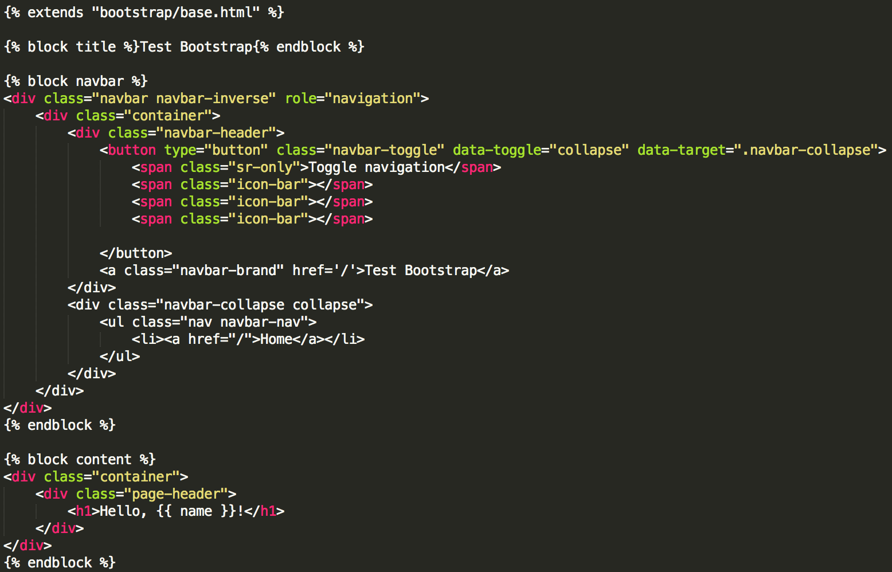
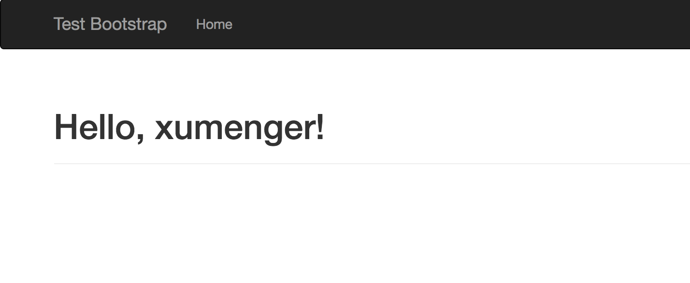
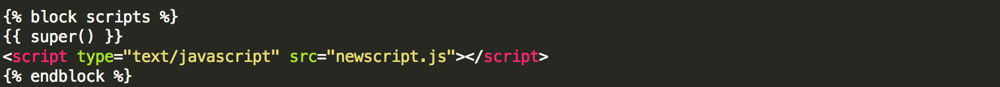

Bootstrap是客户端框架，因此不会直接涉及服务器。服务器需要做的只是提供引用了Bootstrap层叠样式表（CSS）和JavaScript文件的HTML响应，并在HTML、CSS和JavaScript代码中实例化所需组件。这些操作最理想的执行场所就是模板

`pip install flask-bootstrap`安装该扩展。下面这种方式初始化Flask-Bootstrap

```python
from flask import Flask
from flask_bootstrap import Bootstrap

bootstrap = Bootstrap()

def create_app():
    app = Flask(__name__)
    bootstrap.init_app(app)

    ...
    return app
```

初始化Flask-Bootstrap之后，就可以在程序中使用一个包含所有Bootstrap文件的基模板。这个模板引擎利用Jinja2的模板继承机制，让程序扩展一个具有基本页面结构的基模板，其中就有用来引用Bootstrap的元素

比如下面编写一个user.html继承自bootstrap/base.html



Jinja2中的extends指令从Flask-Bootstrap中导入bootstrap/base.html，从而实现模板继承。Flask-Bootstrap中的基模板提供了一个网页框架，引入了Bootstrap中的所有CSS和JavaScript文件

基模板中定义了可在衍生模板中重定义的块。block和endblock指令定义的块中的内容可添加到基模板中。上面的user.html模板定义了3个块，分别为title、navbar、content。这些块都是基模板提供的，可在衍生模板类中重定义。其中navbar和content这两个块分别表示页面中的导航条和主题内容

在这个模板中，navbar块使用Bootstrap组件定义了一个简单的导航条。content块有一个`<div>`容器

## 测试

对应上面的页面，编写视图函数

```python
@main.route('/user/<name>')
def user(name):
    return render_template('user.html', name=name)
```

在浏览器上输入`http://127.0.0.1:5000/user/xumenger`可以看到渲染效果



## Flask-Bootstrap定义的块

Flask-Bootstrap的base.html模板中还定义了很多块，都可以在衍生模板中使用

块名            | 说明
---------------|------------------
doc            | 整个HTML文档
html\_attribs  | html 标签的属性
html           | html 标签中的内容
head           | head 标签中的内容
title          | title 标签中的内容
metas          | 一组 meta 标签
styles         | 层叠样式表定义
body\_attribs  | body 标签的属性
body           | body 标签中的内容
navbar         | 用户定义的导航条
content        | 用户定义的页面内容
scripts        | 文档底部的JavaScript声明

上表中的很多块都是Flasl-Bootstrap自用的，如果直接重定义可能会导致一些问题。例如，Bootstrap所需的文件在styles和scripts块中声明。如果程序需要向已经有内容的块中添加新内容，必须使用Jinja2提供的super()函数。例如，如果要在衍生模板中添加新的JavaScript文件，需要这么定义scripts块



## 参考文档

* 《Flask Web开发》
* [欢迎进入Flask大型教程项目！](http://www.pythondoc.com/flask-mega-tutorial/index.html)
