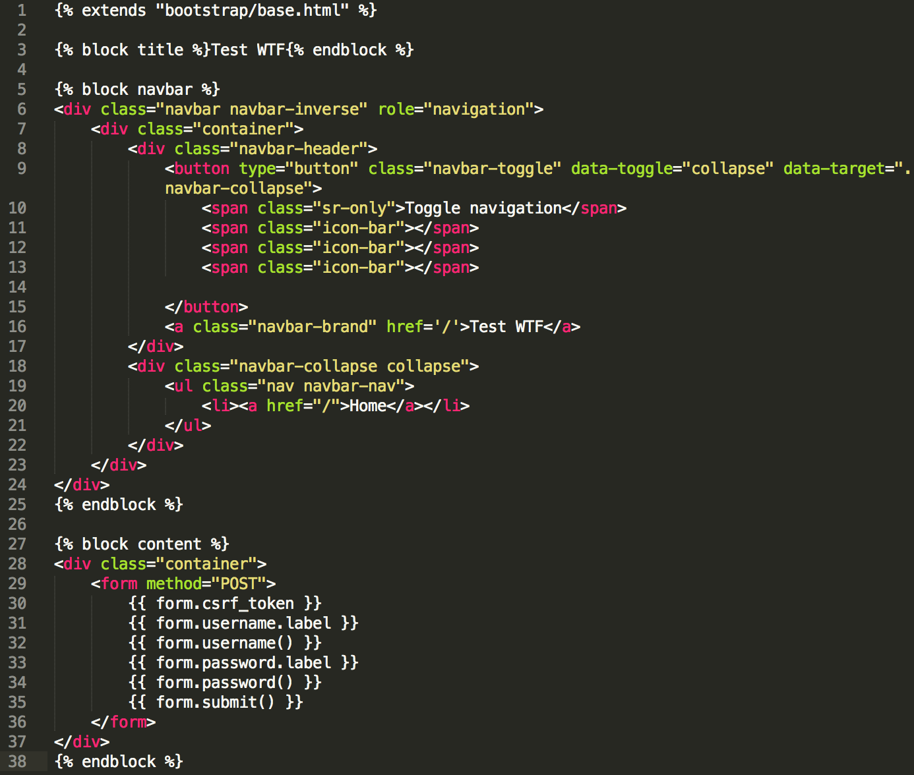

Flask的request请求上下文包含客户端发出的所有请求信息，其中request.form能获取POST请求中提交的表单信息。当你必须处理浏览器提交的表单数据时，视图代码很快会变得难以阅读，有一些库可以简化这个工作，WTForms就是其中之一

而[Flask-WTF](http://www.pythondoc.com/flask-wtf/) 提供了简单地 [WTForms](http://wtforms.simplecodes.com/docs/) 的集成。flask-wtf还有一个强大的功能，就是其可以保护表单免受跨站请求伪造（CSRF）的攻击

`pip3 install flask-wtf`安装该Flask插件

本文我们使用Flask-WTF开发一个简单的程序来展示Flask-WTF的用法

## WTF开发表单

先在forms.py源文件中实现一个登录表单

```
# -*- coding: utf-8 -*-
from flask_wtf import FlaskForm
from wtforms import StringField, PasswordField, SubmitField
from wtforms.validators import Required

'''登录表单类
'''
class LoginForm(FlaskForm):
    username = StringField('username', validators=[Required()])
    password = PasswordField('password', validators=[Required()])
    submit = SubmitField(label=u'提交')

```

然后在views.py中对登录表单请求进行处理

```
'''登录
'''
@main.route('/login', methods=['GET', 'POST'])
def login():
    from .forms import LoginForm
    form = LoginForm()
    if request.method == 'POST':
        if not form.validate_on_submit():
            return 'Username and password error!'
        else:
            if form.data['username'] == 'admin':
                return 'login success'
    else:
        return render_template('login.html', form=form)

```

在manage.py中设置CSRF防护密码

```
# -*- coding: utf-8 -*-
import os
from app import create_app

if __name__ == '__main__':
    app = create_app(None)
    app.config['SECRET_KEY'] = 'xumenger'
    app.run()
```

然后实现login.html如下：



>注意一定要有`{{ form.csrf_token }}`否则form.validate_on_submit()一定会返回false

然后启动服务器，在浏览器上可以访问，效果如下


ok，看起来运行没有问题

然后我们输入用户名admin，随便什么密码，看一下运行效果：


