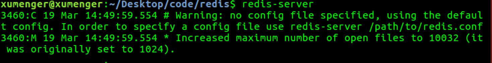
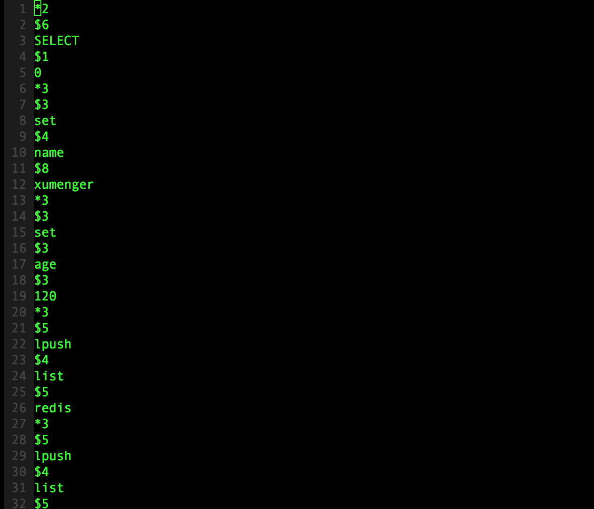

之前分别在[《基于内存的键值对存储数据库Redis》](http://www.xumenger.com/python-redis-20171216/)和[《Redis下使用Lua脚本》](http://www.xumenger.com/lua-redis-20180127/)对Redis这种NoSQL数据库简单介绍过，今天深入讲一下Redis的更多更深入的知识点

# 准备阶段

先列举一些常用的命令

* ps -elf \| grep redis 检查当前机器上和redis相关的进程信息，常用于查看redis-server是否启动
* kill -9 pid 杀死进程号为pid的进程

接下来介绍一下redis的配置

Ubuntu下使用`sudo apt-get install redis-server`方式安装的Redis，其配置文件放在/etc/redis/redis.conf，但redis-server启动时并不是使用该文件作为配置文件；在Mac下使用`brew install redis`方式安装的Redis，其配置文件位置放在/usr/local/etc/redis.conf，但redis-server启动时并不是使用该文件作为配置文件

无论是Ubuntu还是Mac，当redis启动时无法找到对应的配置文件都会报错



所以需要通过`redis-server config-path`的方式在redis-server启动时指定对应的配置文件路径，比如`redis-server /etc/redis/redis.conf`

# Redis持久化

>什么是持久化，简单来说就是将数据放到断电后数据不会对丢失的设备中。在计算机领域就是我们所说的硬盘！

先来把Redis的写操作流程梳理一下：

1. 客户端向服务端发送写操作（数据在客户端的内存中）
2. 数据库服务端接收到写请求的数据（数据在服务端的内存中）
3. 服务端调用write(2)系统调用，将数据写到磁盘上（数据在系统内存的缓冲区中）
4. 操作系统将缓冲区中的数据转移到磁盘控制器上（数据在磁盘缓存中）
5. 磁盘控制器将数据写到磁盘的物理介质中（数据真正落到磁盘上）

如果不走到第5步，在前四步的任何一步出现了问题，那么就出现了数据损坏、数据不一致等的问题！比如：

* 当数据库系统故障时，假如系统内核还是OK的，那么此时只要执行完了第3步，那么数据就是安全的，因为后续步骤操作系统来完成，并保证数据最终落到磁盘上
* 当系统断电时，这时上面提到的所有缓存都会失效，并且数据库和操作系统都会停止工作，所以只有当数据完成第5步后，机器断电才能保证数据不丢失，在上述4步中的数据都会丢失

所以需要弄清楚下面这些问题：

1. 数据库多长时间调用一次write(2)将数据写到内核缓冲区
2. 内核多长时间会将系统缓冲区中的数据写到磁盘控制器
3. 磁盘控制器又在什么时候把缓存中的数据写到物理介质上

第一个问题，通常数据库层面会进行全面控制。而对于第二个问题，操作系统有其默认的策略，我们也可通过POSIX API的fsync系列命令强制操作系统将数据从内核区写到磁盘控制器上。对于第三个问题，好像数据库已经无法触及，但实际上，大多数情况下磁盘缓存是被设置关闭的，或者只开启为读缓存，也就是写操作不进行缓存，直接写到磁盘，建议的做法是仅仅当你的磁盘设备有备用电池时才开启写缓存

### 怎么应对数据损坏

所谓数据损坏就是数据无法恢复，上面讲到是如何保证数据确实写到磁盘上去，但写到磁盘上可能并不意味着数据不会损坏。比如可能一次写请求会进行两次不同的写操作，当意外发生时，可能会导致一次写操作完成，但另一个还没开始。如果数据库的数据文件结构组织不合理，可能会导致数据完全不能恢复的状况出现。那么一般有下面这几种策略来组织数据，防止数据文件损坏到无法恢复的情况：

* 第一种最粗糙，不通过数据的组织形式保证数据的可恢复性。而是通过配置数据同步备份的方式，在数据文件损坏后通过数据备份方式进行恢复
* 另一种是在上面基础上添加一个操作日志，每次操作时记录操作的行为，这样后续就可以通过操作日志进行数据恢复。因为操作日志是顺序追加的方式写的，所以不会出现操作日志也无法恢复的情况
* 更保险的方法是数据库不进行老数据的修改，只是以追加方式完成操作，这样数据本身就是一份日志，这样就永远不会出现数据无法恢复的情况了

Redis的持久化有两种方式：RDB快照、AOF日志

### RDB快照

RDB是一个二进制格式的数据库文件。Redis服务端是一个事件循环驱动的单进程程序，客户端使用bgsave命令，其借用fork的copy on write机制，在生成RDB快照时，将当前进程fork出一个子进程，然后在子进程中循环所有的数据，将数据写成为RDB文件，而住进程继续接受客户端请求，完全没有被阻塞！但是如果客户端使用save命令的话，那么服务端不是通过fork子进程而是自己来执行保存工作，那么这时候就会阻塞服务端进程！

可以用Redis的save/bgsave指令来强制生成RDB文件，比如在客户端分别执行以下命令

```
set name 'xumenger'
set age 120

lpush list "redis"
lpush list "mysql"

sadd set "github"
sadd set "gitlab"
sadd set "gitbook"

hmset hash test "test hash"
```

然后执行save命令，这时候我们来到redis.conf中dir配置项指定的redis运行的目录，一般是Linux是/var/lib/redis，Mac是/usr/local/var/db/redis/，可以看到有一个dump.rdb文件，然后我们可以使用vim（`vim -b dump.rbd`，然后`:%!xxd`查看其16进制格式）来查看该二进制文件（或者用`od -c dump.rdb`命令）


>参考[《Redis RDB格式》](https://www.jianshu.com/p/b1b34f77a3ac)了解详细的RDB文件格式！

可以在配置文件中添加配置，让Redis在运行的时候根据配置来自动保存数据为RDB格式

```
save 900 1
save 300 10
save 60 10000
```

其中`save 900 1`的意思是服务端在900s之内，对数据进行至少一次修改就保存，上面配置的三个条件，只要满足其中一个Redis就会保存RDB文件。另外需要注意的是，虽然这里配置的是save，但实际上在保存RDB的时候使用的bgsave而不是save方式

RDB也是Redis主从同步内部实现的一环

* 第一次Slave向Master发出同步请求，Master先dump出RDB文件，然后将RDB文件全量传输给Slave，然后Master把缓存的命令转发给Slave，初次同步完成
* 第二次以及以后的同步实现是Master将变量的快照直接实时依次发生给各个Slave
* 但不管什么原因导致Slave和Master断开重连都会重复以上两个步骤的过程

### AOF日志

RDB方式有其不足之处，就是一旦数据酷出现问题，那我们的RDB文件中保存的数据并不是最新的，从上次RDB文件生成到Redis停机这段时间的数据全部丢掉了。AOF（Append-Only File）比RDB方式有更好的持久性。由于在使用AOF持久化方式时，Redis会将每一个收到的写命令都通过Write函数追加到文件中，类似于MySQL的binlog。当Redis重启是会通过重新执行文件中保存的写命令来在内存中重建整个数据库的内容

不过和一般数据库的binlog不同的是，AOF文件是可识别的纯文本，它的内容就是一个个的Redis标准命令。我们可以在任务启动的时候`redis-server --appendonly yes`开启AOF功能

同样是在客户端分别执行下面的写命令

```
set name 'xumenger'
set age 120

lpush list "redis"
lpush list "mysql"

sadd set "github"
sadd set "gitlab"
sadd set "gitbook"

hmset hash test "test hash"
```

然后在redis-server的运行目录下查看appendonly.aof文件，其内容大概是



>被写入AOF文件的所有命令都是以Redis命令请求协议格式写入的，因为Redis的命令请求协议是纯文本格式。关于Redis的协议格式会在后续讲解

显然，如果每条写命令都生成一条日志，那么AOF文件会越变越大，所以Redis又提供了一个新功能，叫做AOF重写，其功能就是重新生成一份AOF文件，新的AOF文件中一条记录的操作只会有一次，而不像一份老文件那样可能记录了对同一值的多次写操作。其生成过程和RDB类似，也是fork一个进程，直接遍历数据，写入新的AOF临时文件。在写入新文件的过程中，所有的写操作日志还是会写到原来老的AOF文件中，同时还会记录在内存缓冲区中。当重写操作完成后，会将所有缓冲区中的日志一次性写入到临时文件中。然后调用原子性的rename命令用新的AOF文件取代老的AOF文件

从上面的流程我们能够看到，RDB和AOF操作都是顺序IO操作，性能都很高。而同时在通过RDB文件或者AOF日志进行数据库恢复的时候，也是顺序的读取数据加载到内存中。所以也不会造成磁盘的随机读

AOF可靠性配置在配置文件中可以这么设置：

* `appendonly yes`：开启AOF，默认是不开启的！
* `appendfsync no`：Redis不会主动调用fsync去将AOF日志内容同步到磁盘，所以这一切就完全依赖于操作系统的调试了。对大多数Linux操作系统，是每30秒进行一次fsync，将缓冲区中的数据写到磁盘上
* `appendfsync everysec`：Redis会默认每隔一秒进行一次fsync调用，将缓冲区中的数据写到磁盘。但是当这一次的fsync调用时长超过1秒时。Redis会采取延迟fsync的策略，再等一秒钟。也就是在两秒后再进行fsync，这一次的fsync就不管会执行多长时间都会进行。这时候由于在fsync时文件描述符会被阻塞，所以当前的写操作就会阻塞
* `appednfsync always`：每一次写操作都会调用一次fsync，这时数据是最安全的，当然，由于每次都会执行fsync，所以其性能也会受到影响

# Redis主从机制

>接下来的测试，先把上面演示中redis中的数据删除，简单的方法就是关闭Redis，删除RDB、AOF文件，然后重启Redis即可

在Redis中，用户可以通过执行`slaveof`命令或者设置`slaveof`选项，让一个服务器去复制另一个服务器，我们称被复制的服务器为主服务器（master），而对服务器进行复制的服务器则被称为从服务器（slave）

目前我的环境是这样的：

* 在Mac上的redis作为master，IP地址是192.168.191.3
* 在Ubuntu上的redis作为slave，IP地址是172.16.192.153

在Ubuntu上`redis-server /etc/redis/redis.conf`运行服务端程序，`redis-cli`连接到服务端，执行`slaveof 192.168.191.3 6379`，但是可能在Ubuntu的服务端看到这样的报错


这个问题的解决方案是给master设置密码，或者设置protected-mode no。为了安全起见，选择给master设置密码。具体方法在后面的《Redis安全》中会讲到。在master上配置好密码为123456后，需要修改slave的配置文件，添加

```
masterauth 123456
```

然后再启动slave，并在salve的客户端执行`slaveof 192.168.191.3 6379`

### 主从同步原理

从服务器对主服务器的同步操作需要通过向主进程服务器发生`SYNC`命令来完成，以下是SYNC命令的步骤：

* slave向master发生SYNC命令
* 收到SYNC命令的master执行BGSAVE命令，在后台生成一个RDB文件，并使用一个缓冲区记录从现在开始执行的所有写操作
* 当master的BGSAVE执行完毕后，master会将BGSAVE命令生成的RDB文件发送给slave
* slave接收并载入这个RDB文件，将自己的数据库状态更新至master执行BGSAVE命令时的数据库状态
* master将记录在缓冲区中的所有写命令发给slave，slave执行这些写操作，将自己数据库状态更新至master数据库当前所处的状态

# Redis集群


# Redis C++客户端

在[《基于内存的键值对存储数据库Redis》](http://www.xumenger.com/python-redis-20171216/)中讲到在Python下可以使用其Redis模块对接Redis服务器进行开发，假如我想在C/C++语言环境下对接Redis进行开发呢，有没有为C/C++封装的客户端模块？


# Redis协议解析


# Redis发布与订阅


# 使用Lua定制更强大的功能


# Redis安全

Redis部署在服务器上的时候一定好考虑安全问题，至少包括下面这几个点

### Redis设置密码

上面提到，主从备份的时候，slave直接`slaveof 192.168.191.3 6379`可能无法连接上，因为需要master redis设置密码，那么怎么设置密码呢？

在master redis的配置文件中找到requirepass配置项，修改成自己需要的密码，然后`redis-server /usr/local/etc/redis.conf`重启即可，比如修改为：

```
requirepass 123456
```

然后客户端登录的时候都必须输入设置的密码了`redis-cli -a 123456`，另外slave不能直接使用`slaveof 192.168.191.3 6379`命令，而必须先在配置文件中设置`masterauth 123456`才行

### 


# 扩展：Lua

Lua的使用可以参考[《Lua简明教程》](http://www.xumenger.com/lua-20180126/)快速学习


# 扩展：Nginx

Lua脚本是一个很轻量级的脚本，也是号称性能最高的脚本，用在很多需要性能的地方，比如本文提到的Redis、游戏脚本、WireShark的脚本，其实在Nginx中也可以使用Lua进行定制

对于Nginx的讲解是后续会花时间整理出来的

# 参考资料

* [《redis设置开机启动》](https://www.cnblogs.com/skyessay/p/6433349.html)
* [《解密Redis持久化》](http://blog.nosqlfan.com/html/3813.html)
* [《redis使用rdb恢复数据》](https://www.cnblogs.com/zzq-include/p/7927716.html)
* [《redis 集群 数据丢失及解决方案 AOF RDB 数据恢复》](http://blog.csdn.net/jack85986370/article/details/51453041)
* [《利用redis + lua解决抢红包高并发的问题》](http://blog.csdn.net/hengyunabc/article/details/19433779/)
* [《nginx+lua+redis高并发应用建设》](https://www.cnblogs.com/mengfanrong/p/4561593.html)
* [《详解用Nginx+Lua+Redis来构建高并发Web应用》](http://blog.chinaunix.net/uid-29071165-id-4076544.html)
* [《Nginx+Lua+Redis实现高性能缓存数据读取》](https://mp.weixin.qq.com/s/8NDktzm6kD_jHniwP04T9A)
* [《通过 lua 进行 nginx redis 访问控制》](https://www.linuxprobe.com/lua-access-control-redis.html)
* [《Nginx 通过 Lua + Redis 实现动态封禁 IP》](https://www.jianshu.com/p/20b6883e62ea)
* [《用 Nginx + Lua(OpenResty) 开发高性能 Web 应用》](https://www.jianshu.com/p/f8b216d694c8)
* [《redis配置文件详解》](https://www.cnblogs.com/AlanLee/p/7053577.html)
* [《redis3.0配置文件详解》](http://www.cnblogs.com/zhang-ke/p/5981108.html)
* 《Redis设计与实现》
* [《Redis 设置密码登录》](http://blog.csdn.net/crazy__qu/article/details/78738264)
* [《redis设置密码和主从复制》](http://blog.51cto.com/leezhxing/1312872)
