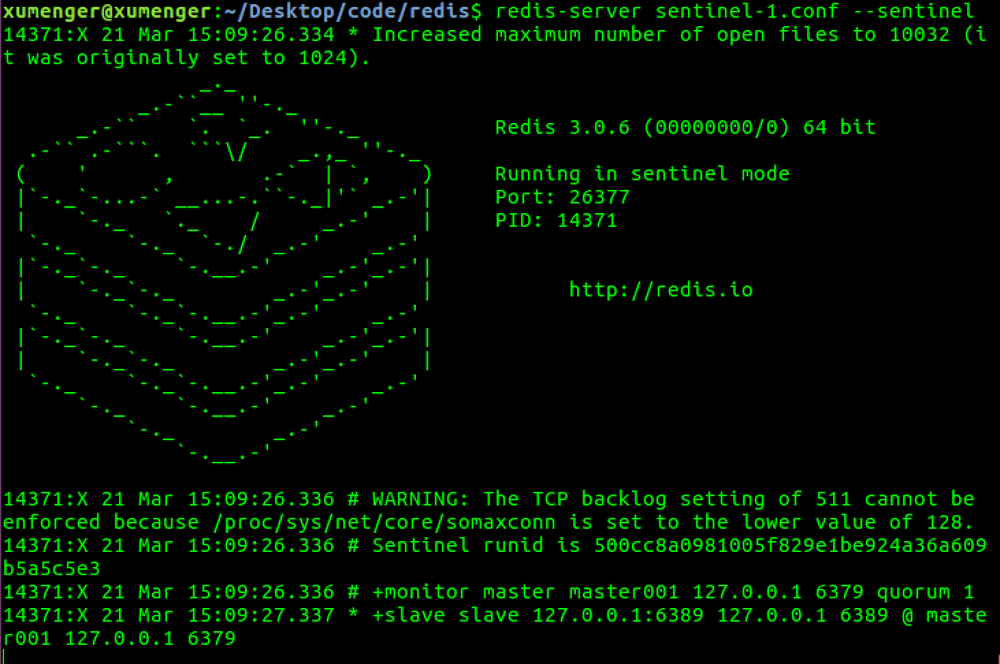
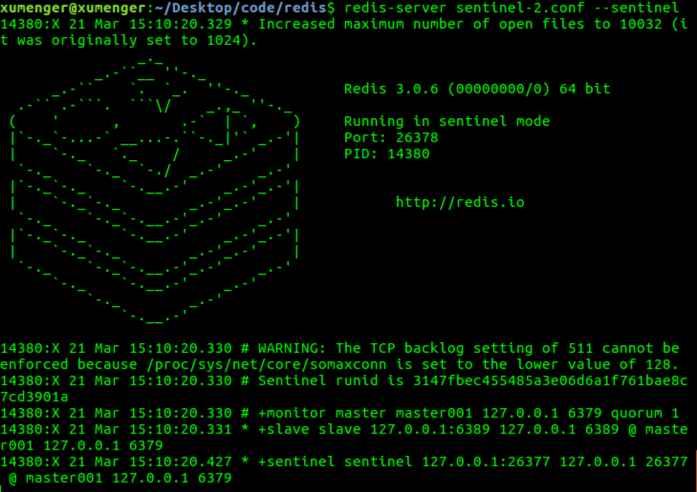
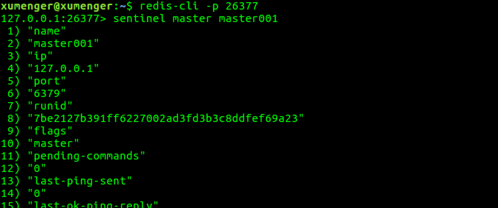

之前分别在[《基于内存的键值对存储数据库Redis》](http://www.xumenger.com/python-redis-20171216/)和[《Redis下使用Lua脚本》](http://www.xumenger.com/lua-redis-20180127/)对Redis这种NoSQL数据库简单介绍过，今天深入讲一下Redis的更多更深入的知识点

# 准备阶段

先列举一些常用的命令

* ps -elf \| grep redis 检查当前机器上和redis相关的进程信息，常用于查看redis-server是否启动
* kill -9 pid 杀死进程号为pid的进程
* redis-server redis-conf 启动redis服务，并指定配置文件路径
* redis-cli -a password 通过密码连接到对应的redis服务端
* redis-sentinel sentinel-conf 或 redis-server sentinel-conf --sentinel 可以启动Sentinel

接下来介绍一下redis的配置

Ubuntu下使用`sudo apt-get install redis-server`方式安装的Redis，其配置文件放在/etc/redis/redis.conf，但redis-server启动时并不是使用该文件作为配置文件；在Mac下使用`brew install redis`方式安装的Redis，其配置文件位置放在/usr/local/etc/redis.conf，但redis-server启动时并不是使用该文件作为配置文件

无论是Ubuntu还是Mac，当redis启动时无法找到对应的配置文件都会报错


所以需要通过`redis-server config-path`的方式在redis-server启动时指定对应的配置文件路径，比如`redis-server /etc/redis/redis.conf`

# Redis持久化

>什么是持久化，简单来说就是将数据放到断电后数据不会丢失的设备中。在计算机领域就是把数据落地到硬盘上！

先来把Redis的写操作流程梳理一下：

1. 客户端向服务端发送写操作（数据在客户端的内存中）
2. 数据库服务端接收到写请求的数据（数据在服务端的内存中）
3. 服务端调用write(2)系统调用，将数据写到磁盘上（数据在系统内存的缓冲区中）
4. 操作系统将缓冲区中的数据转移到磁盘控制器上（数据在磁盘缓存中）
5. 磁盘控制器将数据写到磁盘的物理介质中（数据真正落到磁盘上）

如果不走到第5步，在前四步的任何一步出现了问题，那么就出现了数据损坏、数据不一致等的问题！比如：

* 当数据库系统故障时，假如系统内核还是OK的，那么此时只要执行完了第3步，那么数据就是安全的，因为后续步骤操作系统来完成，并保证数据最终落到磁盘上
* 当系统断电时，这时上面提到的所有缓存都会失效，并且数据库和操作系统都会停止工作，所以只有当数据完成第5步后，机器断电才能保证数据不丢失，在上述4步中的数据都会丢失

所以需要弄清楚下面这些问题：

1. 数据库多长时间调用一次write(2)将数据写到内核缓冲区
2. 内核多长时间会将系统缓冲区中的数据写到磁盘控制器
3. 磁盘控制器又在什么时候把缓存中的数据写到物理介质上

第一个问题，通常数据库层面会进行全面控制。而对于第二个问题，操作系统有其默认的策略，我们也可通过POSIX API的fsync系列命令强制操作系统将数据从内核区写到磁盘控制器上。对于第三个问题，好像数据库已经无法触及，但实际上，大多数情况下磁盘缓存是被设置关闭的，或者只开启为读缓存，也就是写操作不进行缓存，直接写到磁盘，建议的做法是仅仅当你的磁盘设备有备用电池时才开启写缓存

### 怎么应对数据损坏

所谓数据损坏就是数据无法恢复，上面讲到是如何保证数据确实写到磁盘上去，但写到磁盘上可能并不意味着数据不会损坏。比如可能一次写请求会进行两次不同的写操作，当意外发生时，可能会导致一次写操作完成，但另一个还没开始。如果数据库的数据文件结构组织不合理，可能会导致数据完全不能恢复的状况出现。那么一般有下面这几种策略来组织数据，防止数据文件损坏到无法恢复的情况：

* 第一种最粗糙，不通过数据的组织形式保证数据的可恢复性。而是通过配置数据同步备份的方式，在数据文件损坏后通过数据备份方式进行恢复
* 另一种是在上面基础上添加一个操作日志，每次操作时记录操作的行为，这样后续就可以通过操作日志进行数据恢复。因为操作日志是顺序追加的方式写的，所以不会出现操作日志也无法恢复的情况
* 更保险的方法是数据库不进行老数据的修改，只是以追加方式完成操作，这样数据本身就是一份日志，这样就永远不会出现数据无法恢复的情况了

Redis的持久化有两种方式：RDB快照、AOF日志

### RDB快照

RDB是一个二进制格式的数据库文件。Redis服务端是一个事件循环驱动的单进程程序，客户端使用bgsave命令，其借用fork的copy on write机制，在生成RDB快照时，将当前进程fork出一个子进程，然后在子进程中循环所有的数据，将数据写成为RDB文件，而住进程继续接受客户端请求，完全没有被阻塞！但是如果客户端使用save命令的话，那么服务端不是通过fork子进程而是自己来执行保存工作，那么这时候就会阻塞服务端进程！

可以用Redis的save/bgsave指令来强制生成RDB文件，比如在客户端分别执行以下命令

```
set name 'xumenger'
set age 120

lpush list "redis"
lpush list "mysql"

sadd set "github"
sadd set "gitlab"
sadd set "gitbook"

hmset hash test "test hash"
```

然后执行save命令，这时候我们来到redis.conf中dir配置项指定的redis运行的目录，一般是Linux是/var/lib/redis，Mac是/usr/local/var/db/redis/，可以看到有一个dump.rdb文件，然后我们可以使用vim（`vim -b dump.rbd`，然后`:%!xxd`查看其16进制格式）来查看该二进制文件（或者用`od -c dump.rdb`命令）


>参考[《Redis RDB格式》](https://www.jianshu.com/p/b1b34f77a3ac)了解详细的RDB文件格式！

可以在配置文件中添加配置，让Redis在运行的时候根据配置来自动保存数据为RDB格式

```
save 900 1
save 300 10
save 60 10000
```

其中`save 900 1`的意思是服务端在900s之内，对数据进行至少一次修改就保存，上面配置的三个条件，只要满足其中一个Redis就会保存RDB文件。另外需要注意的是，虽然这里配置的是save，但实际上在保存RDB的时候使用的bgsave而不是save方式

RDB也是Redis主从同步内部实现的一环

* 第一次Slave向Master发出同步请求，Master先dump出RDB文件，然后将RDB文件全量传输给Slave，然后Master把缓存的命令转发给Slave，初次同步完成
* 第二次以及以后的同步实现是Master将变量的快照直接实时依次发生给各个Slave
* 但不管什么原因导致Slave和Master断开重连都会重复以上两个步骤的过程

### AOF日志

RDB方式有其不足之处，就是一旦数据库出现问题，那我们的RDB文件中保存的数据并不是最新的，从上次RDB文件生成到Redis停机这段时间的数据全部丢掉了。AOF（Append-Only File）比RDB方式有更好的持久性。由于在使用AOF持久化方式时，Redis会将每一个收到的写命令都通过Write函数追加到文件中，类似于MySQL的binlog。当Redis重启是会通过重新执行文件中保存的写命令来在内存中重建整个数据库的内容

不过和一般数据库的binlog不同的是，AOF文件是可识别的纯文本，它的内容就是一个个的Redis标准命令。我们可以在任务启动的时候`redis-server --appendonly yes`开启AOF功能

同样是在客户端分别执行下面的写命令

```
set name 'xumenger'
set age 120

lpush list "redis"
lpush list "mysql"

sadd set "github"
sadd set "gitlab"
sadd set "gitbook"

hmset hash test "test hash"
```

然后在redis-server的运行目录下查看appendonly.aof文件，其内容大概是


>被写入AOF文件的所有命令都是以Redis命令请求协议格式写入的，因为Redis的命令请求协议是纯文本格式。关于Redis的协议格式会在后续讲解

显然，如果每条写命令都生成一条日志，那么AOF文件会越变越大，所以Redis又提供了一个新功能，叫做AOF重写，其功能就是重新生成一份AOF文件，新的AOF文件中一条记录的操作只会有一次，而不像一份老文件那样可能记录了对同一值的多次写操作。其生成过程和RDB类似，也是fork一个进程，直接遍历数据，写入新的AOF临时文件。在写入新文件的过程中，所有的写操作日志还是会写到原来老的AOF文件中，同时还会记录在内存缓冲区中。当重写操作完成后，会将所有缓冲区中的日志一次性写入到临时文件中。然后调用原子性的rename命令用新的AOF文件取代老的AOF文件

从上面的流程我们能够看到，RDB和AOF操作都是顺序IO操作，性能都很高。而同时在通过RDB文件或者AOF日志进行数据库恢复的时候，也是顺序的读取数据加载到内存中。所以也不会造成磁盘的随机读

AOF可靠性配置在配置文件中可以这么设置：

* `appendonly yes`：开启AOF，默认是不开启的！
* `appendfsync no`：Redis不会主动调用fsync去将AOF日志内容同步到磁盘，所以这一切就完全依赖于操作系统的调试了。对大多数Linux操作系统，是每30秒进行一次fsync，将缓冲区中的数据写到磁盘上
* `appendfsync everysec`：Redis会默认每隔一秒进行一次fsync调用，将缓冲区中的数据写到磁盘。但是当这一次的fsync调用时长超过1秒时。Redis会采取延迟fsync的策略，再等一秒钟。也就是在两秒后再进行fsync，这一次的fsync就不管会执行多长时间都会进行。这时候由于在fsync时文件描述符会被阻塞，所以当前的写操作就会阻塞
* `appednfsync always`：每一次写操作都会调用一次fsync，这时数据是最安全的，当然，由于每次都会执行fsync，所以其性能也会受到影响

# Redis主从机制

>接下来的测试，先把上面演示中redis中的数据删除，简单的方法就是关闭Redis，删除RDB、AOF文件，然后重启Redis即可

在Redis中，用户可以通过执行`slaveof`命令或者设置`slaveof`选项，让一个服务器去复制另一个服务器，我们称被复制的服务器为主服务器（Master），而对服务器进行复制的服务器则被称为从服务器（Slave）

目前我的环境是这样的：

* 在Mac上的redis作为Master，IP地址是192.168.191.3
* 在Ubuntu上的redis作为Slave，IP地址是172.16.192.153

先在Mac上启动Master；然后在Ubuntu上`redis-server`运行Slave服务端程序，`redis-cli`连接到服务端，执行`slaveof 192.168.191.3 6379`，但是可能在Ubuntu的服务端看到这样的报错


这个问题的解决方案是给Master设置密码，或者设置protected-mode no。为了安全起见，选择给Master设置密码。具体方法在后面的《Redis安全》中会讲到。在Master上配置好密码为123456后，需要修改Slave的配置文件，添加

```
masterauth 123456
```

结果在Ubuntu上`redis-server /etc/redis/redis.conf`启动服务端直接无法启动，暂时未找到解决方法

### 重新测试

上面Ubuntu作为Slave有问题，所以我换一个测试方案（换一下Master、Slave的身份）：

* 在Ubuntu上的redis作为Master，IP地址是172.16.192.153
* 在Mac上的redis作为Slave，IP地址是192.168.191.3

先在Ubuntu上启动Master；再在Mac上`redis-server`启动Slave，`redis-cli`连接到服务端，执行`slaveof 172.16.192.153 6379`，这次成功

接下来测试主备效果，Master和Slave上最初都没有数据，都执行`get name`都获取不到值


然后再Master的客户端执行`set name 'xumenger'`，分别可以在Master和Slave上都取到值了


现在只能在Master的客户端对数据进行写操作，如果在Slave进行写操作，就会报错


OK，现在验证通过！

### 主从同步原理简介

当客户端向从服务器发送SLAVEOF命令，要求从服务器复制主服务器时，从服务器首先需要执行同步操作，也就是将从服务器的数据库状态更新至主服务器当前所处的数据库状态

从服务器对主服务器的同步操作需要通过向主进程服务器发生SYNC命令来完成，以下是SYNC命令的步骤：

* Slave向Master发生SYNC命令
* 收到SYNC命令的Master执行BGSAVE命令，在后台生成一个RDB文件，并使用一个缓冲区记录从现在开始执行的所有写操作
* 当Master的BGSAVE执行完毕后，Master会将BGSAVE命令生成的RDB文件发送给Slave
* Slave接收并载入这个RDB文件，将自己的数据库状态更新至Master执行BGSAVE命令时的数据库状态
* Master将记录在缓冲区中的所有写命令发给Slave，Slave执行这些写操作，将自己数据库状态更新至Master数据库当前所处的状态

# Redis集群

Sentinel是Redis的高可用性解决方案：由一个或多个Sentinel实例组成的Sentinel系统可以监控任意多个主服务器，以及这些主服务器属下的所有从服务器，并在被监视的主服务器进入下线状态时，自动将下线服务器属下的某个从服务器升级为新的主服务器，然后由新的主服务器代替已下线的主服务器继续处理命令请求！


继续在上面主从备份配置的基础上进行Sentinel的实验！

redis-sentinel sentinel-conf 或 redis-server sentinel-conf --sentinel 可以启动Sentinel。当一个Sentinel启动时，它需要执行以下步骤：

* 初始化服务器
* 将普通Redis服务器使用的代码替换为Sentinel专用代码
* 初始化Sentinel状态
* 根据给定的配置文件，初始化Sentinel的监视主服务器列表
* 创建连向主服务器的网络连接

### sentinel.conf配置文件

下面展示一个简单的sentinel.conf配置文件

```
port 26377
# sentinel announce-ip <ip>
# sentinel announce-port <port>
dir /tmp

################################# master001 #################################
sentinel monitor master001 192.168.110.101 6379 2
# sentinel auth-pass <master-name> <password>
sentinel down-after-milliseconds master001 30000
sentinel parallel-syncs master001 1
sentinel failover-timeout master001 180000
# sentinel notification-script <master-name> <script-path>
# sentinel client-reconfig-script <master-name> <script-path>

# 可以配置多个master节点
################################# master002 #################################
```

* port：当前Sentinel服务运行的端口
* dir：Sentinel服务运行时使用的临时文件夹
* sentinel monitor master001 192.168.110.101 6379 2
	* Sentinel去监视一个名为master001的主redis实例
	* 这个实例的地址是192.168.110.101，端口是6379
	* 而将该主实例判为失效至少要2个Sentinel进程同意，只要同意Sentinel的数量不达标，自动failover就不会执行
* sentinel down-after-milliseconds master001 30000
	* 指定了Sentinel认为Redis实例已经失效所需的毫秒数
	* 当实例超过该时间没有返回PING，或者直接返回错误，那么Sentinel将这个实例标记为主观下线
	* 只有一个 Sentinel进程将实例标记为主观下线并不一定会引起实例的自动故障迁移
	* 只有在足够数量的Sentinel都将一个实例标记为主观下线之后，实例才会被标记为客观下线，这时自动故障迁移才会执行
* sentinel parallel-syncs master001 1
	* 指定了在执行故障转移时，最多可以有多少个从Redis实例在同步新的主实例
	* 在从Redis实例较多的情况下这个数字越小，同步的时间越长，完成故障转移所需的时间就越长
* sentinel failover-timeout master001 180000
	* 如果在该时间（ms）内未能完成failover操作，则认为该failover失败
* sentinel notification-script <master-name> <script-path>
	* 指定sentinel检测到该监控的redis实例指向的实例异常时，调用的报警脚本。该配置项可选，但很常用

### 开始实验

>一主（Ubuntu）、二从（Mac）、三哨兵（Ubuntu下三个哨兵）

新增一个Slave，让其运行在Ubuntu上，其它的配置不要，只为其新增配置文件redis-1.conf，只修改端口，保证不和Unutu的Master冲突

```
port 6389
```

启动后，客户端登录该Slave，执行`slaveof 127.0.0.1 6379`命令，让其变成Master的一个Slave

继续上面的配置，把Sentinel设置在Ubuntu上运行，配置文件内容如下（另外两个哨兵的端口分别是26378、26379）

```
port 26377
# sentinel announce-ip <ip>
# sentinel announce-port <port>
dir /tmp

################################# master001 #################################
sentinel monitor master001 172.16.192.153 6379 2
# sentinel auth-pass <master-name> <password>
sentinel down-after-milliseconds master001 30
sentinel parallel-syncs master001 1
sentinel failover-timeout master001 180
# sentinel notification-script <master-name> <script-path>
# sentinel client-reconfig-script <master-name> <script-path>
```

然后在Ubuntu上启动三个Sentinel，其中一个运行起来大概是这样的



然后通过redis-cli -p 26377登录到其中一个哨兵，执行`sentinel master master001`可以查看master001的信息



然后我们把Ubuntu上的Master杀了，先看到Mac上的Slave报错无法同步数据



>简单参考[《Redis主从加Sentinel模式部署》](https://www.cnblogs.com/dupang/p/6414365.html)

# Redis的C++客户端

hiredis是Redis提供的官方客户端Library

执行下面的命令进行安装

```
git clone https://github.com/redis/hiredis
cd hiredis
make
sudo make install (复制生成的库到/usr/local/lib目录下)
```

下面使用hiredis编写测试程序

```
#include <hiredis/hiredis.h>
#include <iostream>
#include <string>

using namespace std;

int main()
{
    //2s的超时时间
    struct timeval timeout = {2, 0};

    //redisContext是Redis的操作对象
    redisContext *redis = (redisContext *)redisConnectWithTimeout("172.16.192.153", 6379, timeout);
    if(NULL == redis || redis->err){
        if(redis){
            cout << "connect error: " << redis->errstr << endl;
        }
        else{
            cout << "connect error: can't allocate redis context." << endl;
        }
        return -1;
    }

    //redisReply是redis命令回复对象，redis返回的信息保存在redisReply对象中
    redisReply *reply = (redisReply *)redisCommand(redis, "get name");
    cout << "get name" << endl;
    cout << reply->str << endl << endl << endl;

    //当多条redis命令使用同一个redisReply对象时
    //每次执行完redis命令后需清空redisReply，以免对下次redis操作造成影响
    freeReplyObject(reply);


    reply = (redisReply *)redisCommand(redis, "INFO"); //执行info命令
    cout << "INFO" << endl;
    cout << reply->str << endl;

    freeReplyObject(reply);

    return 0;
}
```

`g++ test.cpp -o test -lhiredis`编译，运行程序的效果如下


# Redis协议详解

在上面介绍AOF文件的时候，讲到AOF文件中就是直接存储Redis命令的协议格式，这里就来看一下Redis的协议细节

Redis是以行来划分，每行以\r\n结束的。每一行都有一个消息头，消息头共分为5种分别如下：

* (+)表示一个正确的状态信息，具体信息是当前行 + 后面的字符
* (-)表示一个错误信息，具体信息是当前行 - 后面的字符
* (\*)表示消息体总共有多少行，不包括当前行，\* 后面是具体的行首
* ($)表示下一行数据长度，不包括换行符长度\r\n，$ 后面则是对应长度的数据
* (:)表示返回一个数值，: 后面是相应的数字节符

### SET命令

>SET HENRY HENRYFAN

以上命令是设置HENRY的值为HENRYFAN，在Redis的通信协议上会以空格把命令拆分成三行，得到最终的命令

```
*3\r\n
$3\r\n
SET\r\n
$5\r\n
HENRY\r\n
$8\r\n
HENRYFAN\r\n
```

如果操作成功，服务端返回信息

```
+OK\r\n
```

否则服务端返回

```
-错误信息\r\n
```

### 命令HMGET

>HMGET HENRY QQ

以上命令是获取HENTY的QQ信息

```
*3\r\n
$5\r\n
HMGET\r\n
$5\r\n
HENRY\r\n
$2\r\n
QQ\r\n
```

如果不存在字段值，服务端返回

```
*1\r\n
$-1\r\n
```

如果存在字段，则返回

```
*1\r\n
$8\r\n
12345678\r\n
```

# 使用Lua定制更强大的功能


# Redis安全

Redis部署在服务器上的时候一定好考虑安全问题，至少包括下面这几个点

### Redis设置密码

上面提到，主从备份的时候，Slave直接`slaveof 192.168.191.3 6379`可能无法连接上，因为需要Master redis设置密码，那么怎么设置密码呢？

在Master redis的配置文件中找到requirepass配置项，修改成自己需要的密码，然后`redis-server /usr/local/etc/redis.conf`重启即可，比如修改为：

```
requirepass 123456
```

然后客户端登录的时候都必须输入设置的密码了`redis-cli -a 123456`，另外slave不能直接使用`slaveof 192.168.191.3 6379`命令，而必须先在配置文件中设置`masterauth 123456`才行

### IP安全配置

>Redis默认情况下会绑定在0.0.0.0:6379，这样会将Redis服务暴露在公网上，如果在没有开启认证的情况下，可以导致任意用户在可以访问目标服务器的情况下未授权访问Redis，以及读取Redis的数据。攻击者在未授权访问Redis的情况下可以利用Redis的相关方法，可以成功地在Redis服务器上写入公钥，进而可以使用对应私钥直接登录目标服务器！

入侵特征：

* Redis可能执行过FLUSHALL方法，整个Redis数据库被清空
* 在Redis数据库中新建一个名为crackit（网上流传的命令指令）的键值对，内容为一个SSH公钥
* 在/root/.ssh文件夹下新建或修改了authorized\_keys，内容为Redis生成的DB文件，包含上述公钥

首先建议添加如下配置项，来禁用远程DB文件地址

```
rename-command FLUSHALL ""
rename-command CONFIG ""
rename-command EVAL ""
``

另外为Redis服务创建单独的用户和家目录，并配置禁止登陆

为Redis添加密码认证，这个在上面有详细的讲到

另外就是禁止外网访问Redis，修改配置文件

```
bind 127.0.0.1
```

>如果确实存在需要外网访问Redis的场景怎么办？

# 扩展：Lua

Lua的使用可以参考[《Lua简明教程》](http://www.xumenger.com/lua-20180126/)快速学习


# 扩展：Nginx

Lua脚本是一个很轻量级的脚本，也是号称性能最高的脚本，用在很多需要性能的地方，比如本文提到的Redis、游戏脚本、WireShark的脚本，其实在Nginx中也可以使用Lua进行定制

对于Nginx的讲解是后续会花时间整理出来的

# 参考资料

* [《redis设置开机启动》](https://www.cnblogs.com/skyessay/p/6433349.html)
* [《解密Redis持久化》](http://blog.nosqlfan.com/html/3813.html)
* [《redis使用rdb恢复数据》](https://www.cnblogs.com/zzq-include/p/7927716.html)
* [《Redis主从复制》](http://blog.csdn.net/zouyujie1127/article/details/41411195)
* [《redis 集群 数据丢失及解决方案 AOF RDB 数据恢复》](http://blog.csdn.net/jack85986370/article/details/51453041)
* [《Redis Sentinel高可用架构》](http://www.cnblogs.com/gomysql/p/5040847.html)
* [《sentinel.conf配置》](https://www.cnblogs.com/LiZhiW/p/4851640.html)
* [《redis的C/C++ API》](http://blog.csdn.net/for_tech/article/details/51917831)
* [《Redis协议详解》](https://www.cnblogs.com/smark/p/3247620.html)
* [《Redis 请务必注意 Redis 安全配置，否则将导致轻松被入侵》](https://ruby-china.org/topics/28094)
* [《利用redis + lua解决抢红包高并发的问题》](http://blog.csdn.net/hengyunabc/article/details/19433779/)
* [《nginx+lua+redis高并发应用建设》](https://www.cnblogs.com/mengfanrong/p/4561593.html)
* [《详解用Nginx+Lua+Redis来构建高并发Web应用》](http://blog.chinaunix.net/uid-29071165-id-4076544.html)
* [《Nginx+Lua+Redis实现高性能缓存数据读取》](https://mp.weixin.qq.com/s/8NDktzm6kD_jHniwP04T9A)
* [《通过 lua 进行 nginx redis 访问控制》](https://www.linuxprobe.com/lua-access-control-redis.html)
* [《Nginx 通过 Lua + Redis 实现动态封禁 IP》](https://www.jianshu.com/p/20b6883e62ea)
* [《用 Nginx + Lua(OpenResty) 开发高性能 Web 应用》](https://www.jianshu.com/p/f8b216d694c8)
* [《redis配置文件详解》](https://www.cnblogs.com/AlanLee/p/7053577.html)
* [《redis3.0配置文件详解》](http://www.cnblogs.com/zhang-ke/p/5981108.html)
* 《Redis设计与实现》
* [《Redis 设置密码登录》](http://blog.csdn.net/crazy__qu/article/details/78738264)
* [《redis设置密码和主从复制》](http://blog.51cto.com/leezhxing/1312872)
