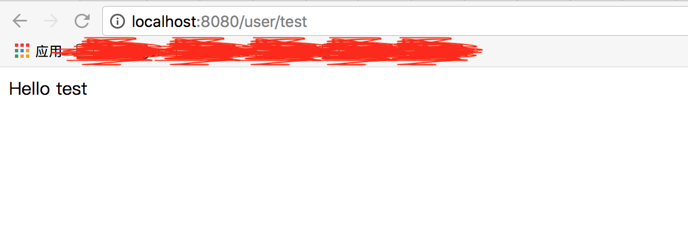

## 安装Maven

Maven是跨平台的项目管理工具。主要服务于基于Java平台的项目构建，依赖管理和项目信息管理。项目构建过程包括：【清理项目】->【编译项目】->【测试项目】->【生成测试报告】->【打包项目】->【部署项目】，这六个步骤就是一个项目的完整构建过程

Maven就可以帮助开发者完成上述所说的项目构建过程！

[https://maven.apache.org/download.cgi](https://maven.apache.org/download.cgi)下载Maven，比如放到/Users/xumenger/Desktop/library/apache-maven-3.5.3-bin.tar.gz

`tar -xzf apache-maven-3.5.3-bin.tar.gz`解压。maven目录是/Users/xumenger/Desktop/library/apache-maven-3.5.3

打开一个终端，往~/.bash_profile中添加以下配置

```
export M2_HOME=/Users/xumenger/Desktop/library/apache-maven-3.5.3
export PATH=$PATH:$M2_HOME/bin
```

`source ~/.bash_profile`使配置生效，然后`mvn -v`检查其安装成功


接下来在[Eclipse](http://www.xumenger.com/mac-install-eclipse-20180306/)上配置Maven。Eclipse的菜单路径是【Eclipse】->【Preferences】->【Maven】->【Installations】->【Add】


然后勾选新添加的Maven并且Apply


设置当前使用的Maven版本


配置下载jar包时可以同时下载相关的源文件


【Eclipse】->【Preferences】->【Java】->【Installed JREs】编辑JDK，vm arguments添加如下语句`-Dmaven.multiModuleProjectDirectory=$M2_HOME`


## Spring Boot开发Web应用

Spring Boot是由Pivotal团队提供的全新框架，其设计目的是用来简化新Spring应用的初始搭建以及开发过程。该框架使用了特定的方式来进行配置，从而使开发人员不再需要定义样板化的配置。通过这种方式，Boot致力于在蓬勃发展的快速应用开发领域成为领导者

【Help】->【Eclipse Marketplace】选择安装Spring Tool Suite (STS) for Eclipse


等待STS安装完成（下载速度可能很慢）


重启Eclipse，然后【New】->【Other】，选择新建Spring Boot -> Spring Starter Project


注意我们这里目前只选择Web，下面做一个测试用


然后可能会等待一会


创建后的项目结构是这样的。其中HelloSpringBootApplication.java是服务启动类


然后新建一个TestController


编写代码如下

```java
package com.example.demo;

import org.springframework.web.bind.annotation.PathVariable;
import org.springframework.web.bind.annotation.RequestMapping;
import org.springframework.web.bind.annotation.RequestMethod;
import org.springframework.web.bind.annotation.RestController;

@RestController
public class TestController {
    @RequestMapping("/")
    public String index() {
    	    return "This is Index Page";
    }
    
    @RequestMapping("/about")
    public String about() {
	    return "This is About Page";
    }
    
    @RequestMapping(value="/user/{name}", method= RequestMethod.GET)
    public String user(@PathVariable("name") String name) {
	    return "Hello " + name;
    }
}
```

然后在HelloSpringBootApplication.java上右键选择Run As -> Spring Boot App，看到Console有输出


然后我们试着访问对应Controller中的URL


下面使用Maven对项目进行打包处理，命令行进入到HelloSpringBoot项目目录，执行mvn clean package


然后到项目目录的target下面，可以看到有一个项目jar包


执行java -jar HelloSpringBoot-0.0.1-SNAPSHOT.jar项目即可启动服务（注意先把原来Eclipse上的项目关闭，否则已经有tomcat占用了8080端口，这边就会启动失败）


用这种方式启动了服务之后，去浏览器同样可以正确访问对应的URL！比如



>这里只是演示了最简单的流程，更多的东西比如Maven的进阶用法、SpringBoot的配置文件application.properties、数据库开发等都没有涉及到！

## Java Web与Python Web

上面编写的Java SpringBoot的Controller是不是很像[Python Flask的代码](http://www.xumenger.com/python2-flask-20170701/)

```python
# -*- coding: utf-8 -*-
from flask import Flask
app = Flask(__name__)

# 主页
@app.route('/')
def index():
    return 'This is Index Page'

@app.route('/about')
def about():
    return 'This is About Page'

# 用户URL
@app.route('/user/<name>')
def user(name):
    return '<h1>Hello %s</h1>' % name

if __name__ == '__main__':
    app.run(debug = True)
```

Python开发Web程序、Java开发Web程序，也许从形式上、框架上看起来有很多不同之处，但毕竟它们都是用来开发Web程序的，所以最本质的东西应该是一样的

现在我就想梳理一下这本质的东西，这里不再赘言了，毕竟本文是主要讲解Java SpringBoot开发的，后续会专门整理文章对比二者的异同！

本文只是起一个引子！

## Spring Boot实现MVC

上面的演示中只是展示了在收到请求的时候直接返回一些字符串，如果想实现MVC三层架构要怎么做呢？

首先编写Model实体类（一般在这里处理和数据库的交互，比如获取数据……）

```java
package com.example.demo;

public class TestModel {
    private long id;
    private String content;
    
    public long getId() {
    	    return this.id;
    }
    
    public void setId(long id) {
    	    this.id = id;
    }
    
    public String getContent() {
    	    return this.content;
    }
    
    public void setContent(String content) {
    	    this.content = content;
    }
}
```

为了让控制器直接通过模板引擎返回HTML页面，我们先在pom.xml中添加如下配置

```xml
<dependency>
    <groupId>org.springframework.boot</groupId>
    <artifactId>spring-boot-starter-thymeleaf</artifactId>
</dependency>
```

再在application.properties中添加如下配置

```
# 定位模板的目录
spring.mvc.view.prefix=classpath:/templates/
# 给返回的页面添加后缀名
spring.mvc.view.suffix=.html
```

之后编写类似这样的程序就会在收到对应的HTTP请求时返回src/main/resources/templates下index.html页面

```java
    @RequestMapping("/index")
    public String index(){
        return "index";
    }
```

然后编写控制器

```java
package com.example.demo;

import org.springframework.stereotype.Controller;
import org.springframework.ui.Model;
import org.springframework.web.bind.annotation.GetMapping;
import org.springframework.web.bind.annotation.ModelAttribute;
import org.springframework.web.bind.annotation.PostMapping;

//注意区别RestController和Controller
@Controller
public class TestController {
	@GetMapping("/index")
	public String indexForm(Model model) {
		//1.向html输入一个TestModel类来封装数据，看起来和Flask的Flask-WTF插件差不多
		model.addAttribute("test", new TestModel());
		
		//2.TestModel实体类交给HTML让用户去填充数据
		return "index";
	}
	
	@PostMapping("/index")
	public String indexSubmit(@ModelAttribute("test") TestModel test) {
		//3.test就是用户填充数据后的实体
		System.out.println("用户提交的是 " + test);
		
		//4.处理数据，并返回实体给用户，页面通过第一步的test参数来展示数据
		test.setId(100);
		test.setContent("修改后的数据");
		return "result";
	}
}
```

然后index.html是

```html
<!DOCTYPE HTML>  
<html xmlns:th="http://www.thymeleaf.org">  
<head>  
    <title>Getting Started: Handling Form Submission</title>  
    <meta http-equiv="Content-Type" content="text/html; charset=UTF-8" />  
</head>  
<body>  
    <h1>Form</h1>  
    <form action="#" th:action="@{/index}" th:object="${test}" method="post">  
        <p>Id: <input type="text" th:field="*{id}" /></p> 
        <p>Message: <input type="text" th:field="*{content}" /></p>  
        <p><input type="submit" value="Submit" /> <input type="reset" value="Reset" /></p>  
    </form>  
</body>  
</html>
```

result.html的内容是

```html
<!DOCTYPE HTML>  
<html xmlns:th="http://www.thymeleaf.org">  
<head>  
    <title>Getting Started: Handling Form Submission</title>  
    <meta http-equiv="Content-Type" content="text/html; charset=UTF-8" />  
</head>  
<body>  
    <h1>Result</h1>  
    <p th:text="'id: ' + ${test.id}" />  
    <p th:text="'content: ' + ${test.content}" />  
    <a href="/index">Submit another message</a>  
</body>  
</html>  
```

然后访问 http://127.0.0.1:8080/index 的效果是


点击Submit后的效果是


## Spring Boot安全

在Web领域，安全是一个大课题，包含整个Web开发流程的方方面面，数据库安全、SQL注入、HTML注入、CSRF等等。下面的内容是转载自[《SpringBoot中使用SpringSecurity》](https://zhuanlan.zhihu.com/p/24869196)

在编写Web应用的时候，经常需要对页面做一些安全控制，比如：对于没有访问权限的用户需要转到登录表单页面。要实现访问控制的方法多种多样，可以通过Aop、拦截器实现，也可以通过框架实现，比如Apache Shiro、SpingSecurity，接下来介绍在Spring Boot中如何使用Spring Security进行安全控制。在上面做的HelloSpringBoot实验的基础上进行演示

好的，我们接下来继续，编写Controller如下

```java
package com.example.demo;

import org.springframework.stereotype.Controller;
import org.springframework.web.bind.annotation.RequestMapping;

//注意区别RestController和Controller
@Controller
public class TestController {
	
	// /映射到index.html
    @RequestMapping("/")
    public String index() {
        return "index";
    }

    // /hello映射到hello.html
    @RequestMapping("/hello")
    public String hello() {
        return "hello";
    }
}
```

然后index.html如下

```html
<!DOCTYPE html>  
<html xmlns="http://www.w3.org/1999/xhtml" xmlns:th="http://www.thymeleaf.org" xmlns:sec="http://www.thymeleaf.org/thymeleaf-extras-springsecurity3">  
    <head>
        <title>Spring Security入门</title>
    </head>
    <body>
        <h1>欢迎使用Spring Security!</h1>
        <p>点击 <a th:href="@{/hello}">这里</a> 打个招呼吧</p>
    </body>
</html>  
```

hello.html如下

```html
<!DOCTYPE html>  
<html xmlns="http://www.w3.org/1999/xhtml" xmlns:th="http://www.thymeleaf.org"  
      xmlns:sec="http://www.thymeleaf.org/thymeleaf-extras-springsecurity3">
    <head>
        <title>Hello World!</title>
    </head>
    <body>
        <h1>Hello world!</h1>
    </body>
</html>  
```

然后我们可以直接从index.html跳转到/hello链接，显然在这里没有任何安全控制，所以点击链接后就可以直接跳转到hello.html页面

可以选择Spring Security对hello页面权限进行控制，必须是授权用户才能访问。当没有权限的用户访问后，跳转到登录页面

现在pom.xml中添加配置引入对Spring Security的依赖

```
        <dependency>
            <groupId>org.springframework.boot</groupId>
            <artifactId>spring-boot-starter-security</artifactId>
        </dependency>
```

先创建一个密码解码器

```java
package com.example.demo;

import org.springframework.security.crypto.password.PasswordEncoder;

public class MyPasswordEncoder implements PasswordEncoder {

    @Override
    public String encode(CharSequence arg0) {
        return arg0.toString();
    }

    @Override
    public boolean matches(CharSequence arg0, String arg1) {
        return arg1.equals(arg0.toString());
    }

}
```

然后创建Spring Security的配置类 WebSecurityConfig 

```java
package com.example.demo;

import org.springframework.beans.factory.annotation.Autowired;
import org.springframework.context.annotation.Configuration;
import org.springframework.security.config.annotation.authentication.builders.AuthenticationManagerBuilder;
import org.springframework.security.config.annotation.web.builders.HttpSecurity;
import org.springframework.security.config.annotation.web.configuration.EnableWebSecurity;
import org.springframework.security.config.annotation.web.configuration.WebSecurityConfigurerAdapter;

@Configuration
@EnableWebSecurity
public class WebSecurityConfig extends WebSecurityConfigurerAdapter {

    @Override
    protected void configure(HttpSecurity http) throws Exception {
        http
            .authorizeRequests()
                .antMatchers("/", "/home").permitAll()
                .anyRequest().authenticated()
                .and()
            .formLogin()
                .loginPage("/login")
                .permitAll()
                .and()
            .logout()
                .permitAll();
    }

    @Autowired
    public void configureGlobal(AuthenticationManagerBuilder auth) throws Exception {
        auth
            .inMemoryAuthentication()
            .passwordEncoder(new MyPasswordEncoder())//在此处应用自定义PasswordEncoder
            .withUser("user")
            .password("password")
            .roles("USER");
    }

}
```

* 通过@EnableWebSecurity注解开启Spring Security的功能
* 继承WebSecurityConfigureAdapter，并重写它的方法来设置一些Web安全的细节
* configure(HttpSecurity http) 方法
	* 通过 authorizeRequests() 定义哪些URL需要被保护、哪些不需要被保护。例如以上代码指定了 / 和 /home 不需要任何认证就可以访问，其他的路径都必须通过身份验证
	* 通过 formLogin() 定义当需要用户登录时候，转到的登录页面
* configureGlobal(AuthenticationManagerBuilder auth) 方法，在内存中创建了一个用户，该用户的名称为user，密码为password，用户角色为USER

然后添加一个为/login 新增一个请求映射至login.html

```java
    @RequestMapping("/login")
    public String login() {
        return "login";
    }
```

新增login.html页面

```html
<!DOCTYPE html>  
<html xmlns="http://www.w3.org/1999/xhtml"  
      xmlns:th="http://www.thymeleaf.org"
      xmlns:sec="http://www.thymeleaf.org/thymeleaf-extras-springsecurity3">
    <head>
        <title>Spring Security Example </title>
    </head>
    <body>
        <div th:if="${param.error}">
            用户名或密码错
        </div>
        <div th:if="${param.logout}">
            您已注销成功
        </div>
        <form th:action="@{/login}" method="post">
            <div><label> 用户名 : <input type="text" name="username"/> </label></div>
            <div><label> 密  码 : <input type="password" name="password"/> </label></div>
            <div><input type="submit" value="登录"/></div>
        </form>
    </body>
</html>
```

可以看到，实现一个简单的通过用户名和密码提交到/login的登录方式，根据配置，Spring Security提供了一个过滤器来拦截请求并验证用户身份。如果用户身份认证失败，页面就重定向到 /login?error ，并且页面中会展现相应的错误信息。若用户想要注销登录，可以通过访问 /login?logout 请求，在完成注销之后，页面展现相应的成功消息

到这里，我们启用应用，并访问 http://localhost:8080/ ，可以正常访问。但是访问 http://localhost:8080/hello 的时候被重定向到了http://localhost:8080/login 页面，因为没有登录，用户没有访问权限，通过输入用户名user和密码password进行登录后，跳转到了Hello World页面，再也通过访问http://localhost:8080/login?logout ，就可以完成注销操作

修改hello.html如下

```html
<!DOCTYPE html>  
<html xmlns="http://www.w3.org/1999/xhtml" xmlns:th="http://www.thymeleaf.org"  
      xmlns:sec="http://www.thymeleaf.org/thymeleaf-extras-springsecurity3">
    <head>
        <title>Hello World!</title>
    </head>
    <body>
        <h1 th:inline="text">Hello [[${#httpServletRequest.remoteUser}]]!</h1>
        <form th:action="@{/logout}" method="post">
            <input type="submit" value="注销"/>
        </form>
    </body>
</html>
```

现在在主页点击，因为没有权限，所以先跳转到登录页面


输入user/password即可以成功登录


## 参考资料

* [《Maven学习总结(一)——Maven入门》](https://www.cnblogs.com/xdp-gacl/p/3498271.html)
* [《eclipse上配置Maven》](https://www.cnblogs.com/northern-light/p/7906552.html)
* [《用Spring Boot颠覆Java应用开发》](https://www.cnblogs.com/aishangJava/p/5971288.html)
* [《【Spring Boot】使用Spring Boot来搭建Java web项目以及开发过程》](https://blog.csdn.net/zsq520520/article/details/55050446/)
* [《Eclipse新建Spring-boot项目，打包部署并输出HelloWord》](https://blog.csdn.net/qq_19260029/article/details/77966154)
* [《【系统学习SpringBoot】SpringBoot新建HelloWorld工程（IDEA）》](https://blog.csdn.net/small_mouse0/article/details/77800737)
* [《Eclipse搭建SpringBoot之HelloWorld》](https://www.cnblogs.com/LUA123/p/8110285.html)
* [《python wsgi 规范 与java的servlet规范比较》](https://blog.csdn.net/yl0706401049/article/details/46126143)
* [《18.springboot处理请求数据,使用html页面返回》](https://blog.csdn.net/qq_34448345/article/details/78807911)
* [《Spring中@Controller和@RestController之间的区别》](https://blog.csdn.net/blueheart20/article/details/51434942)
* [《SpringBoot中使用SpringSecurity》](https://zhuanlan.zhihu.com/p/24869196)
