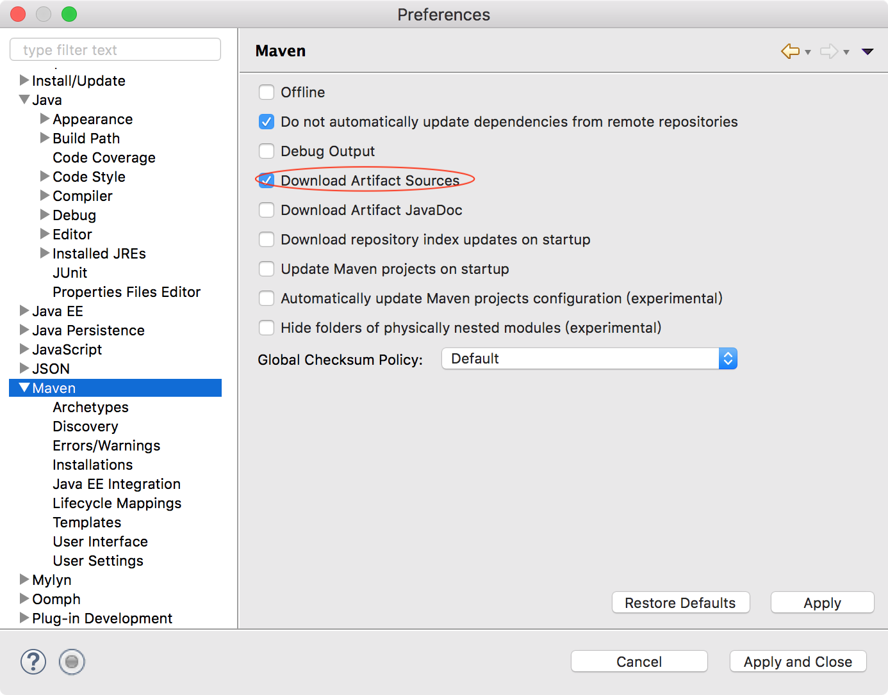
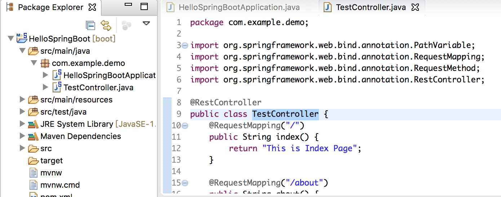

## 安装Maven

Maven是跨平台的项目管理工具。主要服务于基于Java平台的项目构建，依赖管理和项目信息管理。项目构建过程包括：【清理项目】->【编译项目】->【测试项目】->【生成测试报告】->【打包项目】->【部署项目】，这六个步骤就是一个项目的完整构建过程

Maven就可以帮助开发者完成上述所说的项目构建过程！

[https://maven.apache.org/download.cgi](https://maven.apache.org/download.cgi)下载Maven，比如放到/Users/xumenger/Desktop/library/apache-maven-3.5.3-bin.tar.gz

`tar -xzf apache-maven-3.5.3-bin.tar.gz`解压。maven目录是/Users/xumenger/Desktop/library/apache-maven-3.5.3

打开一个终端，往~/.bash_profile中添加以下配置

```
export M2_HOME=/Users/xumenger/Desktop/library/apache-maven-3.5.3
export PATH=$PATH:$M2_HOME/bin
```

`source ~/.bash_profile`使配置生效，然后`mvn -v`检查其安装成功


接下来在[Eclipse](http://www.xumenger.com/mac-install-eclipse-20180306/)上配置Maven。Eclipse的菜单路径是【Eclipse】->【Preferences】->【Maven】->【Installations】->【Add】


然后勾选新添加的Maven并且Apply


设置当前使用的Maven版本


配置下载jar包时可以同时下载相关的源文件



【Eclipse】->【Preferences】->【Java】->【Installed JREs】编辑JDK，vm arguments添加如下语句`-Dmaven.multiModuleProjectDirectory=$M2_HOME`


## Spring Boot开发Web应用

Spring Boot是由Pivotal团队提供的全新框架，其设计目的是用来简化新Spring应用的初始搭建以及开发过程。该框架使用了特定的方式来进行配置，从而使开发人员不再需要定义样板化的配置。通过这种方式，Boot致力于在蓬勃发展的快速应用开发领域成为领导者

【Help】->【Eclipse Marketplace】选择安装Spring Tool Suite (STS) for Eclipse


等待STS安装完成（下载速度可能很慢）


重启Eclipse，然后【New】->【Other】，选择新建Spring Boot -> Spring Starter Project


注意我们这里目前只选择Web，下面做一个测试用


然后可能会等待一会


创建后的项目结构是这样的。其中HelloSpringBootApplication.java是服务启动类


然后新建一个TestController



编写代码如下

```java
package com.example.demo;

import org.springframework.web.bind.annotation.PathVariable;
import org.springframework.web.bind.annotation.RequestMapping;
import org.springframework.web.bind.annotation.RequestMethod;
import org.springframework.web.bind.annotation.RestController;

@RestController
public class TestController {
    @RequestMapping("/")
    public String index() {
    	    return "This is Index Page";
    }
    
    @RequestMapping("/about")
    public String about() {
	    return "This is About Page";
    }
    
    @RequestMapping(value="/user/{name}", method= RequestMethod.GET)
    public String user(@PathVariable("name") String name) {
	    return "Hello " + name;
    }
}
```

然后在HelloSpringBootApplication.java上右键选择Run As -> Spring Boot App，看到Console有输出


然后我们试着访问对应Controller中的URL


下面使用Maven对项目进行打包处理，命令行进入到HelloSpringBoot项目目录，执行mvn clean package


然后到项目目录的target下面，可以看到有一个项目jar包


执行java -jar HelloSpringBoot-0.0.1-SNAPSHOT.jar项目即可启动服务（注意先把原来Eclipse上的项目关闭，否则已经有tomcat占用了8080端口，这边就会启动失败）


用这种方式启动了服务之后，去浏览器同样可以正确访问对应的URL！比如


>这里只是演示了最简单的流程，更多的东西比如Maven的进阶用法、SpringBoot的配置、数据库开发等都没有涉及到！

## Java Web与Python Web

上面编写的Java SpringBoot的Controller是不是很像[Python Flask的代码](http://www.xumenger.com/python2-flask-20170701/)

```python
# -*- coding: utf-8 -*-
from flask import Flask
app = Flask(__name__)

# 主页
@app.route('/')
def index():
    return 'This is Index Page'

@app.route('/about')
def about():
    return 'This is About Page'

# 用户URL
@app.route('/user/<name>')
def user(name):
    return '<h1>Hello %s</h1>' % name

if __name__ == '__main__':
    app.run(debug = True)
```

Python开发Web程序、Java开发Web程序，也许从形式上、框架上看起来有很多不同之处，但毕竟它们都是用来开发Web程序的，所以最本质的东西应该是一样的

现在我就想梳理一下这本质的东西


## Spring Boot安全


## 参考资料

* [《Maven学习总结(一)——Maven入门》](https://www.cnblogs.com/xdp-gacl/p/3498271.html)
* [《eclipse上配置Maven》](https://www.cnblogs.com/northern-light/p/7906552.html)
* [《用Spring Boot颠覆Java应用开发》](https://www.cnblogs.com/aishangJava/p/5971288.html)
* [《【Spring Boot】使用Spring Boot来搭建Java web项目以及开发过程》](https://blog.csdn.net/zsq520520/article/details/55050446/)
* [《Eclipse新建Spring-boot项目，打包部署并输出HelloWord》](https://blog.csdn.net/qq_19260029/article/details/77966154)
* [《【系统学习SpringBoot】SpringBoot新建HelloWorld工程（IDEA）》](https://blog.csdn.net/small_mouse0/article/details/77800737)
* [《Eclipse搭建SpringBoot之HelloWorld》](https://www.cnblogs.com/LUA123/p/8110285.html)
* [《python wsgi 规范 与java的servlet规范比较》](https://blog.csdn.net/yl0706401049/article/details/46126143)
