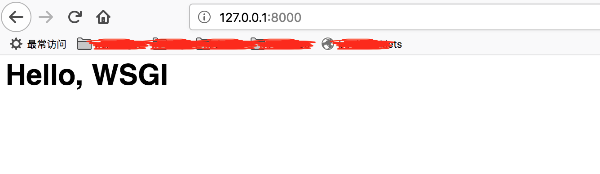
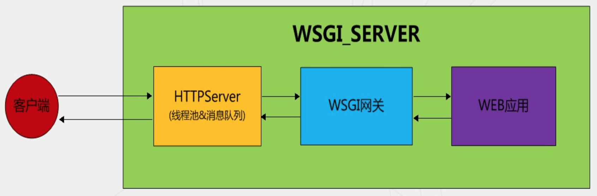
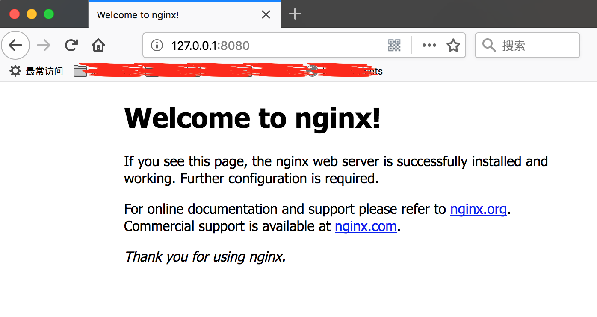
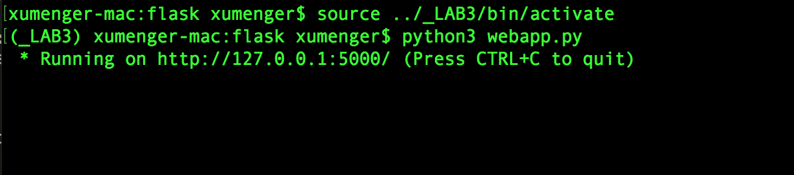
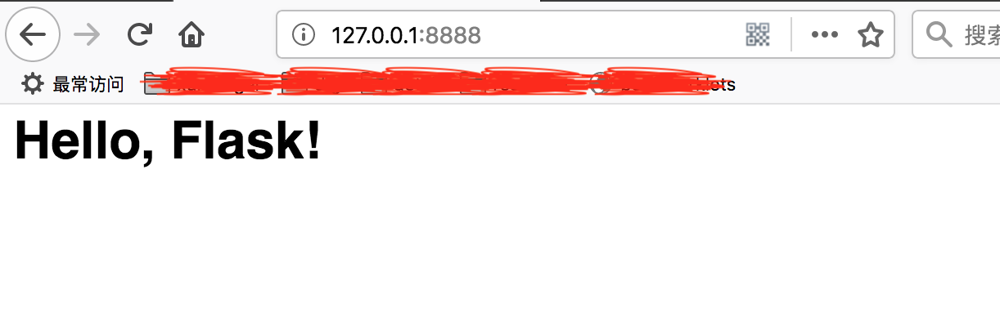
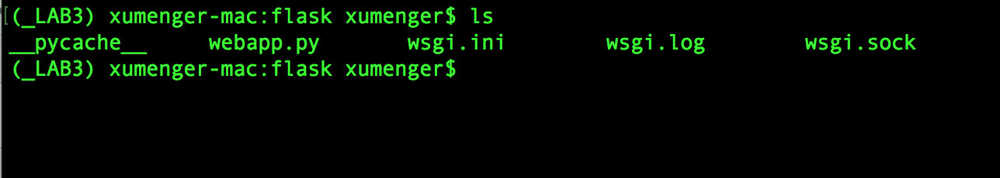
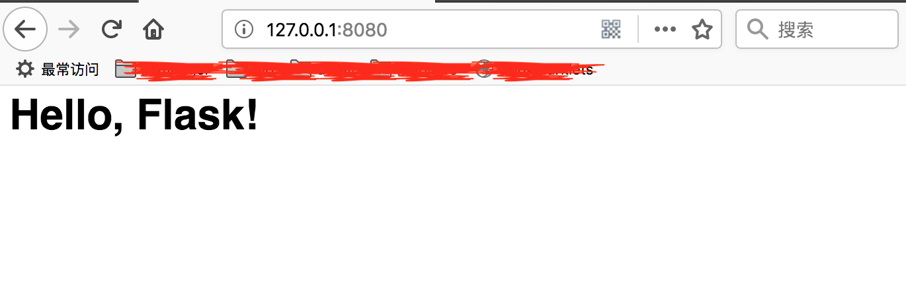

>本文只是展示一个简单的流程，更为详细的Nginx架构、uWSGI运行原理、uWSGI详细配置项、Nginx详细配置项、Nginx更强大的功能、Nginx集成Lua等都完全没有讲到！

## 先认识一下WSGI

WSGI全称是Web Server Gateway Interface，WSGI不是服务器、Python模块、框架、API或任何软件，只是一种规范，描述Web Server如何与Web Application通信的规范，详细可以参见[PEP 3333](https://www.python.org/dev/peps/pep-3333/)

要实现WSGI，必须要同时实现Web Server和Web Application，当前运行在WSGI协议基础上的Web框架有Tornado、Flask、Django

WSGI协议其实是定义了一种Server与Application解耦得规范，即可以有多个实现WSGI Server的服务器，也可以有多个实现WSGI Application的框架，那么可以任意选择Server和Application组合实现自己的Web应用

官方WSGI使用WSGI的wsgiref模块可以实现了一个小的demo

```python
#-*- coding: utf-8 -*-
from wsgiref.simple_server import make_server

def application(environ, start_response):
    start_response('200 OK', [('Content-Type', 'text/html')])
    return '<h1>Hello, WSGI</h1>'

# 创建一个服务器，绑定IP、端口，设置
httpd = make_server('127.0.0.1', 8000, application)
print("Serving HTTP on port 8000...")
# 开始监听HTTP请求
httpd.serve_forever()
```

先启动服务


然后就可以在浏览器中访问看到效果



下图展示了WSGI规范下HTTP处理的简单流程



流程大概是这样的（细节上可能不同的实现有所出入，比如Nginx和Apache有所不同）：

* HTTPServer监听在指定端口，接受外部请求
* 当一个请求到达时，它被封装成HTTPConnection对象放入消息队列
* HTTPServer内部的线程池会不断的从消息队列中取出HTTPConnection对象交给WSGI网关处理
* WSGI网关按照WSGI规范调用Web应用
* Web应用响应发过来的请求，然后把结果会送给WSGI网关
* WSGI网关又会把结果会送给HTTPServer
* 最终再由HTTPServer把结果写回到socket返回给客户端

>可以看一下[《python wsgi 简介》](http://python.jobbole.com/87361/)更详细的了解WSGI

另外推荐找资料扩展了解一下Java的Servlet规范，和Python的WSGI规范做一下比较

## 安装和部署Nginx

这里不选择使用源码安装的方式安装Nginx，而是直接`brew install nginx`来安装，安装完成后执行`nginx`命令即可启动服务器，接下来可以直接在浏览器中访问看nginx是否启动成功



另外介绍一下Nginx的相关命令：

* nginx: 启动nginx服务
* nginx -s stop: 直接关闭nginx服务
* nginx -s quit: 优雅地停止nginx服务
* nginx -s reload: 运行中重新加载配置文件

这种方式安装的nginx的配置文件的目录在/usr/local/etc/nginx/nginx.conf，其默认配置内容如下

```nginx
#user  nobody;
worker_processes  1;

#error_log  logs/error.log;
#error_log  logs/error.log  notice;
#error_log  logs/error.log  info;

#pid        logs/nginx.pid;


events {
    worker_connections  1024;
}


http {
    include       mime.types;
    default_type  application/octet-stream;

    #log_format  main  '$remote_addr - $remote_user [$time_local] "$request" '
    #                  '$status $body_bytes_sent "$http_referer" '
    #                  '"$http_user_agent" "$http_x_forwarded_for"';

    #access_log  logs/access.log  main;

    sendfile        on;
    #tcp_nopush     on;

    #keepalive_timeout  0;
    keepalive_timeout  65;

    #gzip  on;

    server {
        listen       8080;
        server_name  localhost;

        #charset koi8-r;

        #access_log  logs/host.access.log  main;

        location / {
            root   html;
            index  index.html index.htm;
        }

        #error_page  404              /404.html;

        # redirect server error pages to the static page /50x.html
        #
        error_page   500 502 503 504  /50x.html;
        location = /50x.html {
            root   html;
        }

        # proxy the PHP scripts to Apache listening on 127.0.0.1:80
        #
        #location ~ \.php$ {
        #    proxy_pass   http://127.0.0.1;
        #}

        # pass the PHP scripts to FastCGI server listening on 127.0.0.1:9000
        #
        #location ~ \.php$ {
        #    root           html;
        #    fastcgi_pass   127.0.0.1:9000;
        #    fastcgi_index  index.php;
        #    fastcgi_param  SCRIPT_FILENAME  /scripts$fastcgi_script_name;
        #    include        fastcgi_params;
        #}

        # deny access to .htaccess files, if Apache's document root
        # concurs with nginx's one
        #
        #location ~ /\.ht {
        #    deny  all;
        #}
    }


    # another virtual host using mix of IP-, name-, and port-based configuration
    #
    #server {
    #    listen       8000;
    #    listen       somename:8080;
    #    server_name  somename  alias  another.alias;

    #    location / {
    #        root   html;
    #        index  index.html index.htm;
    #    }
    #}


    # HTTPS server
    #
    #server {
    #    listen       443 ssl;
    #    server_name  localhost;

    #    ssl_certificate      cert.pem;
    #    ssl_certificate_key  cert.key;

    #    ssl_session_cache    shared:SSL:1m;
    #    ssl_session_timeout  5m;

    #    ssl_ciphers  HIGH:!aNULL:!MD5;
    #    ssl_prefer_server_ciphers  on;

    #    location / {
    #        root   html;
    #        index  index.html index.htm;
    #    }
    #}
    include servers/*;
}
```

## 使用uWSGI对接Flask

`pip3 install uwsgi`即可完成uWSGI的安装；`pip3 install flask`即可完成Flask的安装！

首先在某个目录下编写一个简单的Flask项目，命名为webapp.py

```python
#-*- coding: utf-8 -*-

from flask import Flask

application = Flask(__name__)

@application.route('/')
def index():
    return '<h1>Hello, Flask!</h1>'

if '__main__' == __name__:
    application.run()

```

正常情况下，编写完成这个小webapp.py，就可以直接使用python启动，然后在浏览器上访问了



因为Flask中自带了Web server，通过Werkzeug，我们可以搭建WSGI服务，运行Flask应用，但Flask是Web框架，并不是Web服务器，尽管Werkzeug很强大，但只能用于开发，不能用于生产。对于Web服务器，我们有更专业的选择，那就是uWSGI，uWSGI是一个全站式的托管服务，它实现了应用服务器（支持多种编程语言）、代理、进程管理器、监视器。取名为uWSGI是因为它最早实现的是Python语言的WSGI。现在uWSGI是C语言写的，性能比较高

接下来我们来编写uWSGI的配置文件，特别注意如果要使用VirtualEnv虚拟环境，请设置home为虚拟环境路径！

```ini
[uwsgi]
master = true  
callable = application  
http = 0.0.0.0:8888  
pythonpath = /Users/xumenger/Desktop/code/Laboratory3/flask
home = /Users/xumenger/Desktop/code/Laboratory3/_LAB3
socket = /Users/xumenger/Desktop/code/Laboratory3/flask/%n.sock
logto = /Users/xumenger/Desktop/code/Laboratory3/flask/%n.log
module = webapp  
processes = 4  
threads = 2  
buffer-size = 62768 
```

简单介绍一下其中的一些配置项：

* pythonpath：表示项目目录
* module：表示项目启动模块，如上例为webapp.py，这里就为twebapp
* callable：表示Flask项目的实例名称，上例代码中application = Flask(__name__)，所以这里为application
* processes：表示开启多少个子进程处理请求。
* threads：每个进程的线程数

接下来我们可以通过`uwsgi --ini wsgi.ini`启动服务，然后在浏览器上可以访问看到运行效果



然后可以在webapp的目录上生成了.log和.sock文件



## 集成到Nginx上

Nginx是高效的Web服务器和反向代理服务器，可以用作负载均衡（当有n个用户访问服务器时，可以实现分流，分担服务器的压力），与Apache相比，Nginx支持高并发，可以支持百万级别的TCP连接、十万级别的并发连接，部署简单、内存消耗少、成本低

Nginx支持uWSGI的uwsgi协议，因此可以将Nginx与uWSGI结合起来，Nginx通过`uwsgi_pass`将动态内容交给uWSGI处理

上面一节中可以看到uWSGI本身就可以起到Web服务器的作用，那为什么有了uWSGI还需要Nginx呢？最普遍的一种说法是Nginx对于处理静态文件更有优势、性能更好。其实如果是小网站，没有静态文件需要处理，只用uWSGI也可以的，但加上Nginx这一层，优势可以很具体：

* 对于运维来说更方便，如果服务器被某个IP攻击，在Nginx配置文件黑名单中添加这个IP即可，如果只用uWSGI，那么就需要在代码中修改了
* Nginx是身经百战的Web服务器了，在表现上比uWSGI更专业，比如uWSGI在早期版本中是不支持https的，可以说Nginx更安全
* Nginx的特点是能够做负载均衡和HTTP缓存，如果不止一台服务器，Nginx基本就是必选项了，通过Nginx将资源分配给不同的服务器节点
* 如果只有一台服务器，Nginx也能很好的提升性能，因为Nginx可以通过headers的Expires or E-Tag、gzip压缩等方式很好地处理静态资源，毕竟是C编写的，调用的是native函数，针对IO进行优化
* 对于动态资源，Nginx还可以实现缓存的功能，配合CDN优化，这是uWSGI无法做到的
* Nginx支持epoll/kqueue等高效网络库，能够很好地处理高并发短连接请求，性能比uWSGI不知道高到哪里去了
* 如果服务器主机上运行了PHP，Python 等语言写的多个应用，都需要监听80端口，这时候 Nginx 就是必选项了。因为我们需要一个转发的服务

下面我们将Flask、uWSGI、Nginx集成到一起

先说一下Nginx的配置文件的读写顺序（配置文件是Mac下的，Linux下可能有不同）：Nginx的配置文件是/usr/local/etc/nginx/nginx.conf，这个配置文件中又引用了/usr/local/etc/nginx/conf.d/和/usr/local/etc/nginx/sites-enabled/这两个文件夹的配置文件，通过include来实现。所以，无论是直接在nginx.conf或者在conf.d、sites-enabled中配置都是可以的

最开始的时候展示了Nginx安装完成时默认的配置内容，一般Nginx反向代理的配置是这样的（替换默认配置文件中http下的server配置）：

```nginx
    server{
　　    listen  8080;
　　    server_name  localhost;
　　    location /xxx/yyy/zzz {
　　　    　proxy_pass  http://127.0.0.1:8888;
　    　}
    }
```

如果使用HTTP协议的话，与代理其他服务器的方式没有什么不同，单如果是使用uWSGI协议就需要使用Nginx提供的协议，需要改变一下配置（uwsgi\_pass是表明Nginx与uwsgi的交流方式，我这里用的是 sock 文件，当然你也可以用指定端口号的形式，具体可以看[这里](http://uwsgi-docs.readthedocs.io/en/latest/Nginx.html)）

```nginx
    server{
        listen  8080;
        server_name  localhost;
        location / {
            include  uwsgi_params;
            #uwsgi_pass  unix:/Users/xumenger/Desktop/code/Laboratory3/flask/wsgi.sock;
            uwsgi_pass 127.0.0.1:8888;
            uwsgi_param UWSGI_SCRIPT wsgi;
            uwsgi_param UWSGI_CHDIR /Users/xumenger/Desktop/code/Laboratory3/flask;
            index  index.html index.htm;
            client_max_body_size 35m;
        }
    }
```

我们还需要将wsgi.ini的配置修改如下（相比于上一节的内容，我们修改了socket、http配置项！）

```ini
[uwsgi]
master = true  
callable = application  
socket = 127.0.0.1:8888  
#socket = /Users/xumenger/Desktop/code/Laboratory3/flask/%n.sock
pythonpath = /Users/xumenger/Desktop/code/Laboratory3/flask
home = /Users/xumenger/Desktop/code/Laboratory3/_LAB3
logto = /Users/xumenger/Desktop/code/Laboratory3/flask/%n.log
module = webapp  
processes = 4  
threads = 2  
buffer-size = 62768
```

>我在Mac上测试了一下，如果使用sock文件的方式Nginx无法成功转发HTTP请求。但是如果使用这种在socket项配置IP端口的方式，直接在浏览器访问127.0.0.1:8888来访问uWSGI就行不通了，目前还没有弄清楚是为什么？！

解释一下Nginx的配置的意义：配置表示Nginx代理了uwsgi的端口，客户端通过访问Nginx的8080端口，然后Nginx在将请求转发到后台uWSGI+Flask应用的8888端口上

现在我们重载Nginx服务`nginx -s reload`，再`uwsgi --ini wsgi.ini`重启uWSGI。然后可以在浏览器中访问Nginx的接口，看到被转发到uWSGI上了



## 谈谈背后的运行机制

先声明一下，以下的运行机制仅仅是我根据以上Nginx、uWSGI、Flask的架构模式进行的合理猜测，也许和实际会有出入，甚至可能完全错误，等我后续会专门进行验证，因为博客本身就是记录来得快去得也快的想法，所以先在此记录下来！

根据以上的架构模式，简单梳理一下HTTP请求应答的流程：

* Web浏览器发送HTTP请求给Nginx
* Nginx转发给uWSGI
* uWSGI将其按照WSGI规范进行处理
* uWSGI将HTTP请求给到Flask应用进行处理
* Flask应用对HTTP进行处理
	* 比如查询数据库获取信息
	* 将信息拼装成HTML网页
* Flask产生HTTP应答，按照WSGI规范给到uWSGI
* uWSGI将HTTP应答以TCP方式发给Nginx
* Nginx将HTTP应答以TCP方式发给Web浏览器

经过以上的简单梳理，可以看到Nginx对外无论是和HTTP浏览器，还是和uWSGI之间都是通过TCP的方式，而Nginx的实现是非阻塞的事件驱动模型，所以Nginx在进行TCP通信的时候是不会阻塞的，也就可以保证Nginx能够一直应对高并发的场景！Nginx只是进行前后节点数据的转发，阻塞的事情放到uWSGI里面来做！

这里可以看到如果Nginx直接对接Flask，那么难免Nginx的线程会因为访问数据库等动作被阻塞，导致无法及时处理外部大量的HTTP请求。所以再一次印证了那句名言：

>计算机领域的诸多问题都可以通过在中间加一层转换来解决！

当然虽然Nginx通过只处理TCP的方式保证不会出现阻塞，但是后续的uWSGI因为要做访问数据库等动作，所以难免会产生阻塞，所以尽管Nginx保证可以尽可能快，但是如果后续的uWSGI节点依然很慢，那么整个系统依然还是慢，所以分布式系统一定要保证所有节点之间是协调的！

## 参考文章

* [《在MAC使用Nginx+uWSGI部署Flask项目》](https://blog.csdn.net/zhuod/article/details/78212797)
* [《在Mac 上使用uWsgi和nginx 部署flask程序》](https://www.jianshu.com/p/7ecb37443b9b)
* [《python wsgi 简介》](http://python.jobbole.com/87361/)
* [《Python Web开发最难懂的WSGI协议，到底包含哪些内容？》](http://python.jobbole.com/88653/)
* [《Wsgiref 包——符合 WSGI 标准的 Web 服务实现（一）》](http://python.jobbole.com/88637/)
* [《Linux 上利用Nginx代理uWSGI处理Flask web应用》](https://www.cnblogs.com/hanyifeng/p/5626327.html)
* [《学习VirtualEnv和Nginx+uwsgi用于django项目部署》](https://www.cnblogs.com/lxg226/p/3468558.html)
* [《写给新手看的Flask+uwsgi+Nginx+Ubuntu部署教程》](https://www.cnblogs.com/knarfeh/p/5616515.html)
* [《uWSGI+Nginx+Flask在Linux下的部署》](https://www.cnblogs.com/zhangjpn/p/6876412.html?utm_source=itdadao&utm_medium=referral)
