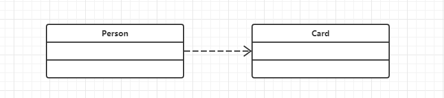
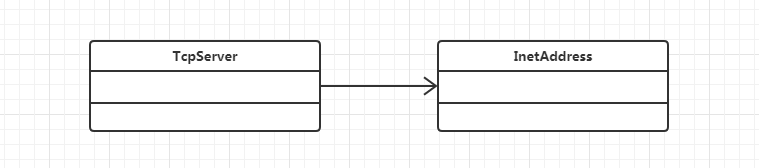
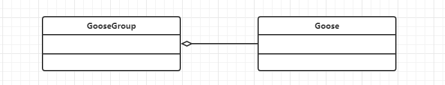
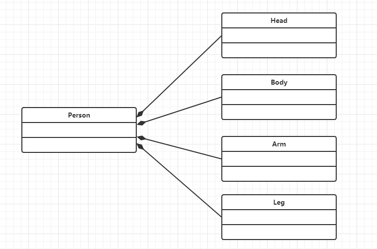
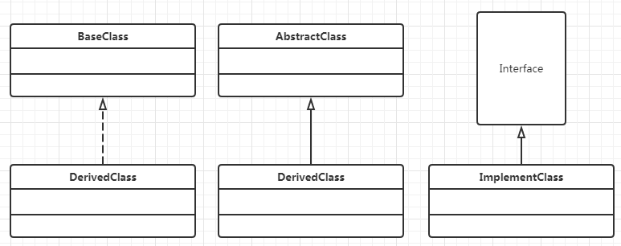
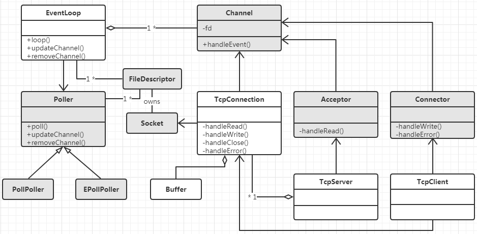
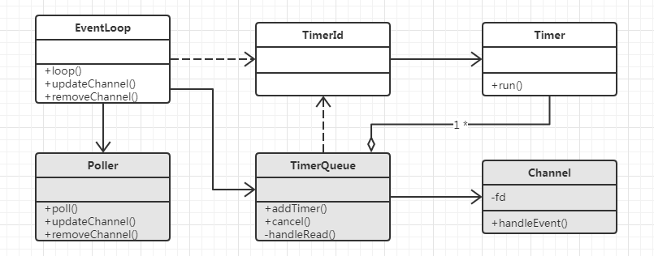

在使用面向对象的语言进行一个比较大型的项目设计的时候，一开始规划好其内部要有哪些类、类之间的关系是极其必要的，这时候使用类图就很有用，类之间大概存在五种关系，下面一一介绍

同时提供对应的Java实例给开发者更直观的感受

>注：本文绘图工具为[https://www.processon.com](https://www.processon.com)。关于这个在线画图工具的用法可以参考[《【UML 建模】在线UML建模工具 ProcessOn 使用详解》](https://blog.csdn.net/shulianghan/article/details/47684729)

## 依赖关系(Dependency)

依赖关系是一种单向的关系，表示一个类依赖于另一个类的定义，其中一个类的变化将影响另外一个类，是一种**use a**的关系

在实际的编码过程中，具体的表现形式为：如果A依赖于B，可能是B是A的局部变量、方法参数、静态方法调用等



下面给出具体的例子

```java
public class Person{
    //局部变量
    public void Proc1(){
        Card card = new Card();
    }

    //方法参数
    public void Proc2(Card card){

    }

    //静态方法调用
    public void Proc3(){
        int id = Card.getId();
    }
}
```

## 关联关系(Association)

关联关系是单向或双向的（通常为了降耦合，避免使用双向关联关系）是一种**has a**关系，如果A单向关联B，则A has a B，通常表现为全局变量



下面给出具体的例子

```java
public class TcpServer{
    public InetAddress serverAddress;

    public void setServerAddress(InetAddress serverAddress){
        this.serverAddress = serverAddress;
    }

    public InetAddress getServerAddress(){
        return this.serverAddress
    }
}
```

## 聚合关系(Aggregation)

聚合关系是单向关系，属于关联关系的一种，与关联关系之间的区别是语义上的，关联的两个对象通常是平等的，聚合则一般不平等，有一种整体和局部的感觉，实现区别上不大



GooseGroup由Goose组成，其生命周期不同，整体不存在了，部分依然存在，当前GooseGroup解散了，Goose还在，还可以加入别GooseGroup

下面给出具体的例子

```java
public class GooseGroup{
    public Goose;

    public GooseGroup(Goose goose){
        this.goose = goose;
    }
}
```

## 组合关系(Composition)

组合关系是一种单向关系，是一种强依赖的特殊聚合关系



Head、Body、Arm、Leg组合成People，其生命周期相同，如果整体不存在了，部分也将消亡

下面给出具体的例子

```java
public class Person {
    public Head head;
    public Body body;
    public Arm arm;
    public Leg leg;

    public Person(){  
        head = new Head();  
        body = new Body();  
        arm = new Arm();  
        leg = new Leg();  
    }
}
```

## 继承关系(Inheritance)

继承关系就很好理解了，这是面向对象的三大特性之一！类实现接口、类集成抽象类、类继承父类都是属于这种关系



具体还可以更为细分：

* 实现(Realization)：类实现接口
* 泛化(Generalization)：即**is a**关系，类继承抽象类、类继承父类

下面给出具体的例子，先给出泛化的例子

```java
public class BaseClass{
    public Proc(){
        System.out.println("BaseClass.Proc()");
    }
}

public class DerivedClass extends BaseClass{
    @Override
    public Proc(){
        System.out.println("DerivedClass.Proc()");
    }
}
```

再给出实现的例子

```java
public interface InterfaceA {
    public int Func();
}
 
public interface InterfaceB {
    public void Proc();
}
 
public class ImplementClass implements InterfaceA, InterfaceB {
    public int Func(){
        return 1;
    }

    public void Proc(){

    }
}
```

## muduo网络部分类图

基于上面对UML类图各种关系的介绍，下面是我为muduo绘制的类图，包括了客户端和服务端用到的所有的类



下面简单对网络部分的各个类进行说明

## muduo网络库架构简介

>直接参考自[《muduo库整体架构简析》](https://www.cnblogs.com/gaorong/p/6476757.html)

首先是EventLoop类，它是事件循环（反应器Reactor），每个线程只能有一个EventLoop实体，它负责IO和定时器事件的分派。它用TimerQueue作为定时器管理，用Pollere作为IO Multiplexing

TimerQueue底层使用timerefd\_\*系列函数将定时器转换为fd添加到事件循环中（而在libevent等网络库中一般会选择使用二叉堆作为定时器的管理数据结构），当时间到达后就自动触发事件，其内部使用set管理一些注册好的Timer，由于set有自动排序功能，所以注册到事件循环的总是第一个需要处理的Timer

Poller是IO Multiplexing的实现，它是一个抽象类，具体实现由子类PollPoller、EPollPoller实现，这是muduo库中唯一一个用到面向对象思想实现的类，通过虚函数提供回调功能。Poll中的updateChannel方法用于注册和更新关注的事件，所有的fd都需要调用它添加到事件循环中

除了TimerQueue和Poller管理时间事件和IO事件外，EventLoop还包含一个任务队列，它用来做一些计算任务，你可以将自己的任务添加到任务队列中，EventLoop在一次事件循环中处理完IO事件后就会依次取出这些任务进行执行，这样当多个线程需要处理同一资源时可以减少锁的复杂性，将资源的管理固定地交由一个线程来处理，其他线程对资源的处理只需要添加到该线程的任务队列中，由该线程异步执行，其他地方无需加锁，减少锁的滥用。但是有一个问题，如果EventLoop阻塞在epoll\_wait处就无法处理这些计算任务了，毕竟计算任务是在处理完IO事件后才执行的，所以需要通过某种通信方式唤醒该线程，被唤醒后就取出队列中的任务进行执行。muduo采用eventfd(2)来异步唤醒

muduo中通过Channel对fd进行封装，其实更合适的说法是对fd事件相关方法的封装，例如负责注册fd的可读或可写事件到EventLoop，又如fd产生事件后要如何响应。一个fd对应一个Channel，Channel在其析构函数中不会close这个fd。它有一个handleEvent()方法，当该fd有事件产生时EventLoop会调用handleEvent方法进行处理，在handleEvent内部根据可读或可写事件调用不同的回调函数（回调函数可实现注册）

Channel一般作为其他类的成员，例如EventLoop通过一个vector<Channel \*>对注册到其内的众多fd进行管理，毕竟有了Channel就有了fd极其对应的事件处理方法，所以上面类图中可以看到EventLoop与Channel是一对多的关系

Socket是对fd的封装，不同于Channel，它仅封装::socket产生的fd，并且提供的方法也是一些获取或设置网络连接属性的方法，当Socket析构时会close这个fd。不管如何封装fd，一些系统函数传递的参数总是fd，所以muduo的一些类中既有fd，又有Channel或Socket都是在所难免的

TcpConnection是一个对连接的封装，一个TcpConnection包含一个Socket和一个Channel，上面说到Channel::handleEvent()会在产生事件后调用事先注册的回调函数，其实在TcpConnection构造的时候就为其所属的Channel注册好这些回调函数。handleRead()、handleWrite()……分别对应可读可写事件产生后调用的回调函数。事件产生后会调用handleRead（或handleWrite），TcpConnection会在handleRead中做一些处理，然后交给上层，提交到上层的具体体现就是调用上层注册的回调函数（又事一样的套路）

因为Channel是个内部类，所以它的回调函数的注册只能TcpConnection完成，上层需要将回调函数注册到TcpConnection后其自动处理。之所以加了TcpConnection是为了解决TCP协议收发数据时阻塞问题，比如::write()时内核缓冲区满了，只能等到下次POLLOUT事件产生后再写，对于一些完善的网络库来说，应该是上层只需要调用一次SendMessags()发送全部数据，网络库内部将数据分批::write给peer，TcpConnection就实现了这一点，它内部维护一个应用层的inputBuffer和outputBuffer保证数据的可靠发送，同时在连接断开时也能保证数据发送完成后再断开

Acceptor用来接受连接，其内是维护一个listenfd及其对应的Channel，它会对listenfd进行一些初始化操作，例如::bind、::listen，然后就调用Channel的方法注册到事件循环中，事件产生后回调其handleRead进行accept()连接，然后调用上层注册的newConnectionCallback回调

Acceptor是一个内部类，它属于一个TcpServer，Acceptor::newConnectionCallback的实例就是由TcpServer进行注册的，产生连接后TcpServer主要对这个连接创建一个TcpConnection对象并设置好其对应的回调函数，TcpServer维护一个TcpConnection的map来管理它的Client，TcpServer可以通过线程池来处理并发请求，线程池内是多个IO线程也就是多个EventLoop，每个连接到来会自动分配到其中一个来创建TcpConnection。如此就打打提升了TcpServer的请求处理能力

Connector和TcpClient的关系如同Acceptor与TcpServer的关系，只不过它是用来主动发起连接的，他需要注意的就是自动重连等功能

## muduo定时器部分类图

定时器的部分就比较简单，下面只把类图放在这就不做过多说明了



## 参考资料

* [《uml类图(Class Diagram)中类与类之间的关系及表示方式》](https://blog.csdn.net/a19881029/article/details/8957441)
* [《【UML 建模】在线UML建模工具 ProcessOn 使用详解》](https://blog.csdn.net/shulianghan/article/details/47684729)
* [《Java中@Override的作用》](https://blog.csdn.net/zht666/article/details/7869383)
* [《Java 继承》](http://www.runoob.com/java/java-inheritance.html)
* [《Java 重写(Override)与重载(Overload)》](http://www.runoob.com/java/java-override-overload.html)
* [《浅谈UML中的聚合与组合》](https://blog.csdn.net/liushuijinger/article/details/6994265)
* [《muduo库整体架构简析》](https://www.cnblogs.com/gaorong/p/6476757.html)
* [《muduo网络库学习之EventLoop（一）：事件循环类图简介和muduo 定时器TimeQueue》](https://blog.csdn.net/jnu_simba/article/details/14486661)
