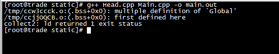

# 从一个小例子开始

开发过程中希望在多个cpp文件中都使用某个全局变量，那这个全局变量该怎么定义、怎么使用呢？

这部分会先给一个小例子，展示编译和运行效果，并不会深入解释背后的原因，关于底层原理的解释会放到后续的部分！

### 头文件中定义全局变量

异想天开的认为，在头文件中定义全局变量，然后在各个cpp文件include该头文件，这样不就每个cpp中都能访问该全局变量了吗？

Head.hpp

```c++
#ifndef HEAD_H
#define HEAD_H

int Global;

int Func();

#endif
```

Head.cpp

```c++
#include <stdio.h>
#include "Head.hpp"

int Func()
{
    Global = 10;
    printf("Head Func, %d, %x\n", Global, &Global);
}
```

Main.cpp

```c++
#include <stdio.h>
#include "Head.hpp"

int main()
{
    Global = 100;
    Func();
    printf("Main main, %d, %x\n", Global, &Global);

}
```

`g++ Head.cpp Main.cpp -o main.out`编译报错，报错信息如下



Global重复定义？编译的结果明显和最开始自以为的有出入！

### 尝试使用static关键字

那我对头文件中的变量使用static关键字进行修饰呢？

Head.hpp

```c++
#ifndef HEAD_H
#define HEAD_H

static int Global;

int Func();

#endif
```

Head.cpp

```c++
#include <stdio.h>
#include "Head.hpp"

int Func()
{
    Global = 10;
    printf("Head Func, %d, %x\n", Global, &Global);
}
```

Main.cpp

```c++
#include <stdio.h>
#include "Head.hpp"

int main()
{
    Global = 100;
    Func();
    printf("Main main, %d, %x\n", Global, &Global);
}
```

`g++ Head.cpp Main.cpp -o main.out`编译后，运行效果如下


可以看到在Main.cpp和Head.cpp中的Global并不是同一个变量，它们位于不同的内存地址！

为什么在Head.hpp中声明的一个Global，最终在多个cpp文件中include之后，就变成了多个Global？

### 使用extern关键字

Head.hpp

```c++
#ifndef HEAD_H
#define HEAD_H

int Func();

#endif
```

Head.cpp

```c++
#include <stdio.h>
#include "Head.hpp"

//在这里定义Global变量
int Global;

int Func()
{
    Global = 10;
    printf("Head Func, %d, %x\n", Global, &Global);
}
```

Main.cpp

```c++
#include <stdio.h>
#include "Head.hpp"

//在另一个需要用到Global的地方使用extern
extern int Global;

int main()
{
    Global = 100;
    Func();
    printf("Main main, %d, %x\n", Global, &Global);
}

`g++ Head.cpp Main.cpp -o main.out`编译后，运行效果如下


这时候Global确实就是多个.cpp文件都可以访问到的全局变量了

### extern修饰全局变量的另一种用法

除了上面使用extern修饰全局变量的方式，还可以在Head.cpp中定义全局变量，在Head.hpp中extern该全局变量，所有想使用该全局变量的模块直接#include "Head.hpp"即可

Head.hpp

```c++
#ifndef HEAD_H
#define HEAD_H

extern int Global;
//int Func(); 其实就是等价于extern int Func();
//在头文件中修饰函数的时候，extern关键字可省略
int Func();

#endif
```

Head.cpp

```c++
#include <stdio.h>
#include "Head.hpp"

//在这里定义Global变量
int Global;

int Func()
{
    Global = 10;
    printf("Head Func, %d, %x\n", Global, &Global);
}
```

Main.cpp

```c++
#include <stdio.h>
//直接#include "Head.hpp"即可引用到extern全局变量
#include "Head.hpp"

int main()
{
    Global = 100;
    Func();
    printf("Main main, %d, %x\n", Global, &Global);
}

`g++ Head.cpp Main.cpp -o main.out`编译后，运行效果如下


这时候Global确实就是多个.cpp文件都可以访问到的全局变量了。这种方式仅仅只是编码的方式与上一种使用extern的方式有差别，本质上是一致的！

# 详解static

在C语言中static可以用来修饰局部变量、全局变量以及函数，在不同情况下的作用不尽相同。下面分别进行详细介绍！

在C++中除了有上述C语言一样的特性外，static还可以做更多的事情

### C中static修饰局部变量

一般局部变量是存储在栈区的，局部变量的生命周期在其所在的语句块执行结束时便结束了。但如果用static修饰局部变量，那么这个变量就不会存储在栈区而是放在静态数据区，其生命周期会一直持续到整个程序结束

不过需要注意的是：

* 虽然static局部变量的生命周期变长了，但其作用域依然仅限于其所在的语句块
* static修饰局部变量后，该变量只在初次运行时进行初始化，且只进行一次

```c
#include <stdio.h>

void fun()
{
    static int a = 1;
    a++;
    printf("a = %d\n", a);
}

int main()
{
    fun();
    fun();
    fun();

    return 0;
}
```

编译后运行效果为


说明在第二次调用fun()时，a的值为2，没有进行初始化赋值，直接进行自增运算。如果静态局部变量没有初始化的话，整型变量会自动赋值为0，字符串数组会自动赋值为'\0'

### C中static修饰全局变量

对于一个全局变量，它既可在本源文件中被访问，也可在同个工程的其他源文件中被访问，使用extern即可（正如最开始的那个例子）

file1.c

```c
int a = 1;
```

file2.c

```
#include <stdio.h>

extern int a;

int main()
{
    printf("%d\n", a);
    return 0;
}
```

编译运行效果为


但如果修改file1.c为这样

```
static int a = 1;
```

那么就会编译报错，此时a只在file1.c中可见！对于整个工程的其他源文件则不可见！


### C中static修饰函数

使用static修饰函数的话，情况与修饰全局变量大同小异，就是改变了函数的作用域

### C++中的static

除了兼容上面C的这些特性，C++中的static还有其他功能

* 如果类中的某个函数用static修饰，表示该函数属于一个类而不是属于任何特定对象
* 如果类中的某个变量用static修饰，表示该变量为类以及其所有对象所有。它们在存储空间中只有一个副本，可通过类或对象去调用
* 静态成员函数，只能访问静态成员函数和静态成员变量！

# extern详解

在C语言中，extern用在变量或函数的声明前，用来说明“此变量/函数是在别处定义的，要在此处引用”。就像上面的例子中，在file2.c中如果想调用file1.c中的变量a，只需要用extern进行声明即可调用a。这里需要注意extern声明的位置对其作用域也有关系，如果是在main函数中进行的，则只能在main函数中调用，其他函数中不能用

可以看到在C语言中extern的用法很简单，但是在C++中extern（主要是extern "C"）就有很多值得好好说说的内容了！下面就细说说！

以下主要转载自[《extern "C"的用法解析》](https://www.cnblogs.com/rollenholt/archive/2012/03/20/2409046.html)

C++中的extern还有一个作用！就是用来指示C或C++函数的调用规范

比如在C++中调用C库函数，就需要在C++程序中使用`extern "C"`声明要引用的函数。这是给链接器使用的，告诉链接器在链接的时候用C函数规范来链接。主要原因是C++和C程序编译完成后在目标代码中命名规范不同，用此来解决名字匹配问题

C++的设计初衷是“a better C”，但这并不意味着C++中类似C得到全局变量和函数所采用的的编译和链接方式与C完全相同。作为一种和C兼容的语言，C++保留了一部分过程式语言的特点，因而它可以定义不属于任何类的全局变量和函数，但C++毕竟是一种面向对象的程序设计语言，为了支持函数的重载，C++对全局函数的处理方式与C有明显的不同

### 以一个问题为切入点

为什么标准头文件一般都有类似这样的结构？

```c++
#ifndef _HEAD_H
#define _HEAD_H

#ifdef __cplusplus
extern "C" {
#endif

/*  ...   */

#ifdef __cplusplus
}
#endif

#endif
```

显然头文件中的编译宏`#ifndef _HEAD_H`、`#define _HEAD_H`、`#endif`的作用是防止头文件被重复引用

那么下面这部分宏的作用是什么呢？

```c++
#ifdef __cplusplus
extern "C" {
#endif

/*  ...   */

#ifdef __cplusplus
}
#endif
```

extern "C"包含双重含义，从字面上即可得到：首先，被它修饰的目标是extern的；其次，被它修饰的目标是C的，下面来从多个方面逐步解读这两重含义

### 被extern "C"限定的函数或变量是extern类型的

extern是C/C++中表明函数和全局变量作用范围的关键字，该关键字告诉编译器，其声明的函数和变量在本模块或其他模块中使用。记住，下列语句

```c
extern int a;
```

其仅仅是一个变量的声明，并不是在定义变量a，并未给a分配内存空间。变量a在所有模块中作为一种全局变量只能被定义一次，否则会出现链接错误

通常，在模块的头文件中对本模块提供给其他模块引用的函数或全局变量使用extern声明。例如，如果模块B欲引用该模块A重定义的全局变量和函数时，只需要包含模块A的头文件即可（就像在最开始例子中展示的那两种用法）。这样模块B中调用模块A中的函数时，在编译阶段，模块B虽然找不到该函数/变量，但它并不会报错，它会在链接阶段从模块A编译生成的目标代码中寻找

与extern对应的是static，被它修饰的全局变量和函数只能在本模块中使用。因此，一个函数或变量只能被本模块使用时，其不可能被extern "C"修饰

### 未加extern "C"声明时的编译方式

首先看看C++中对类似C的函数是什么编译的？

作为一种面向对象的语言，C++支持函数重载，而过程式语言C则不支持。函数被C++编译后在符号库中的名字与C语言的不同。假设某个函数的原型是：

```c
void foo(int x, int y);
```

该函数被C编译器编译后在符号库中的名字是\_foo，而C++编译器则会产生类似\_foo\_int\_int之类的名字（不同的编译器可能生成的名字不同，但都采用了相同的机制，生成的新名字称为“mangled name”）

\_foo\_int\_int这样的名字包含了函数名、函数参数数量及类型信息，C++就是靠这种机制来实现函数重载的。例如，在C++中，函数void foo(int x, int y)与void foo(int x, float y)编译生成的符号是不相同的，后者为\_foo\_int\_float

同样地，C++中的变量除支持局部变量外，还支持类成员变量和全局变量。用户所编写程序的类成员变量可能与全局变量同名，我们以"."来区分。而本质上，编译器在进行编译时，与函数的处理相似，也为类中的变量取了一个独一无二的名字，这个名字与用户程序中同名的全局变量名字不同

### 未加extern "C"声明时的链接方式

假设在C++中，模块A的头文件moduleA.h如下

```c++
#ifndef MODULE_A_H
#define MODULE_A_H

int foo(int x, int y);

#endif
```

在模块B（moduleB.cpp）中引用该函数

```c++
#include "moduleA.h"

int main()
{
    foo(2, 3);
}
```

实际上，在链接阶段，链接器会从模块A生成的目标文件moduleA.obj中寻找\_foo\_int\_int这样的符号

### 加extern "C"后的编译和链接方式

moduleA.hpp加了extern "C"声明后的头文件变为

```c++
#ifndef MODULE_A_H
#define MODULE_A_H

extern "C" {
    int foo(int x, int y);
}

#endif
```

在模块B的实现文件中仍然调用foo(2, 3)，其结果是

* 模块A编译生成foo的目标代码时，没有对其名字进行特殊处理，采用了C语言的方式
* 链接器在为模块B的目标代码寻找foo(2,3)调用时，寻找的是未经修改的符号名\_foo

如果在模块A中函数声明了foo为extern "C"类型，而在模块B中包含的是extern int foo(int x, int y)，则模块B找不到模块A中的函数，反之亦然

所以，可以用一句话概括extern "C"这个声明的真是目的（任何语言中的任何语法特性的诞生都不是随意而来的，来源于真实世界的需求驱动。当我们在思考问题的时候，不能只停留在这个语言是怎么做的，还要问一问它为什么要这么做，动机是什么，这样我们可以更深入地理解许多问题

### C++引用C语言中的函数和变量

在C++引用C语言中的函数和变量时，在包含C语言头文件（比如example.h）时，需要进行一下处理

```c++
extern "C"
{
#include "example.c"
}
```

而在C语言的头文件中，对其外部函数只能指定为extern类型，C不支持extern "C"声明，在.c文件中包含了extern "C"时会出现编译语法错误

比如编写C++引用C函数例子的工程有三个源文件代码如下

C语言头文件example.h

```c
#ifndef C_EXAMPLE_H
#define C_EXAMPLE_H

extern int add(int x,int y);     //注:写成extern "C" int add(int , int ); 也可以

#endif
```

C语言实现文件example.c

```c
#include "example.h"

int add( int x, int y )
{
    return x + y;
}
```

**先使用C编译器**对其进行编译得到目标文件


C++实现文件（main.cpp），调用add

```c++
#include <stdio.h>

extern "C"
{
#include "example.h"        //注：此处不妥，如果这样编译通不过，换成 extern "C" int add(int , int ); 可以通过
}

int main(int argc, char* argv[])
{
    int c = add(2, 3);
    printf("add(2, 3) = %d\n", c);

    return 0;
}
```

**再使用C++编译器**编译main.cpp，然后使用C++编译器连接.o文件


如果C++调用一个C语言编写的DLL/SO时，当包括DLL/SO的头文件或声明接口函数式，应加上extern "C" {}

### 在C中引用C++的函数和变量

在C中引用C++的函数和变量时，C++的头文件需添加extern "C"，但在C中不能直接引用声明了extern "C"的头文件，应该仅将C文件中将C++中定义的extern "C"函数声明为extern类型

比如C引用C++函数例子工程中有三个文件的源码如下：

C++头文件example.hpp

```c++
#ifndef CPP_EXAMPLE_H
#define CPP_EXAMPLE_H

extern "C" int add(int x, int y);

#endif
```

C++实现文件example.cpp

```c++
#include "example.hpp"

int add(int x, int y)
{
    return x + y;
}
```

对于上面的部分，需要**先使用C++编译器**对其进行编译生成目标文件


C实现函数（main.c）

```
#include <stdio.h>
/*
 * #include "example.hpp"
 * 
 * 不能在C的实现中直接这样include，会编译报错
 * 而应该像下面这样直接 extern int add(int x, int y);
 */
extern int add(int x, int y);

int main()
{
    int c = add(1, 2);
    printf("add(1, 2) = %d\n", c);
    
    return 0;
}
```

然后**再使用C编译器**编译得到main.cpp的目标文件，最后使用C编译器对两个目标文件进行链接，这样就可以运行了


