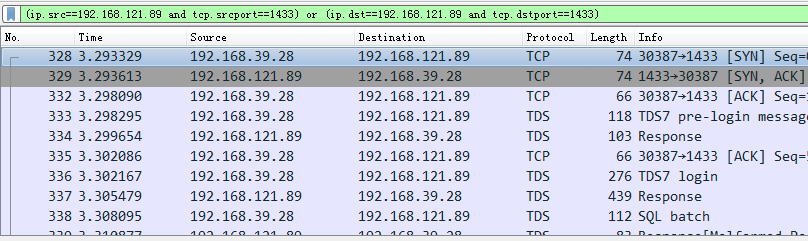
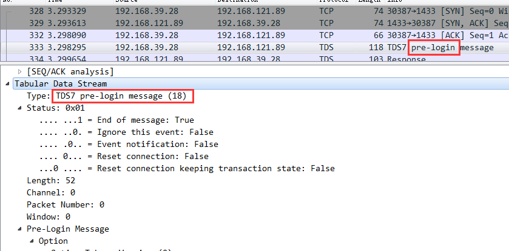
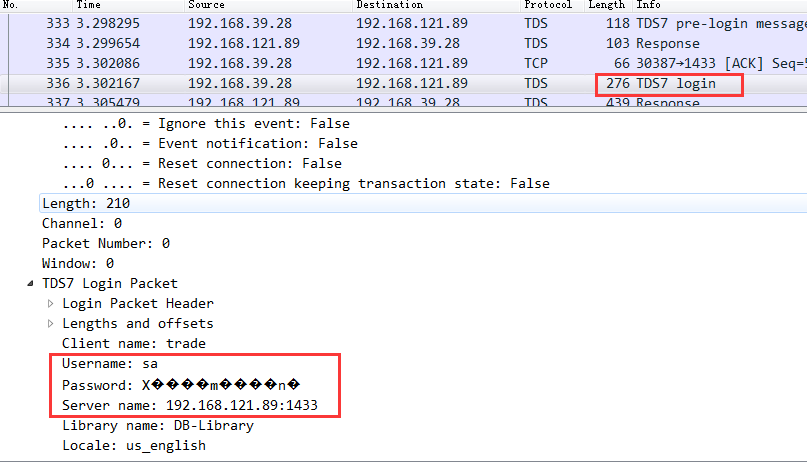
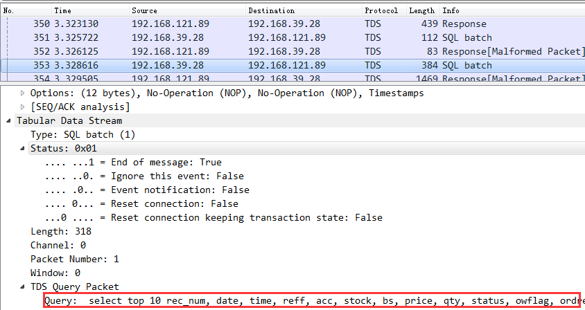
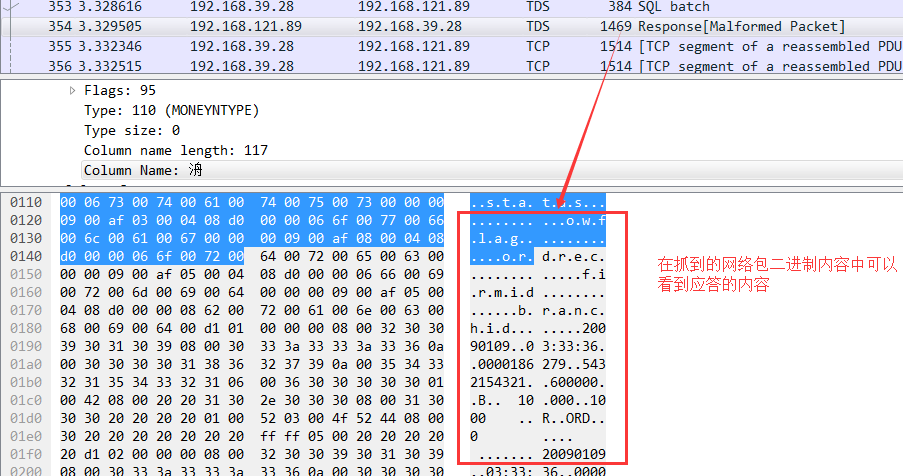
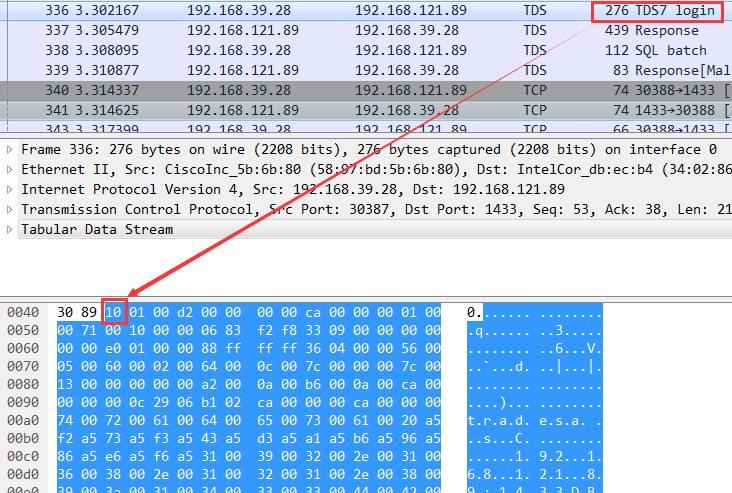

之前在[《Linux下编写程序访问Windows上的SQL Server》](http://www.xumenger.com/linux-freetds-windows-sqlserver-20170705/)上整理了如何在Linux下通过freetds库对接SQL Server进行开发，在[《linux 下用freetds 连接sqlserver》](https://my.oschina.net/laopiao/blog/115469)上有对freetds的API更详细的说明

最近一段时间在赶项目，其正是在Linux上开发程序对接SQL Server，所以在赶项目的同时研究一下SQL Server的更多细节，本文将会研究SQL Server的通信协议TDS(Tabular Data Stream)。关于数据库的索引、事务、锁机制、执行计划等技术点，后续有时间的话也将尝试以类似本文以实验的方式进行展示！

## 开始抓包

SQL Server所在机器的IP是192.168.121.89，监听的端口是1433。WireShark部署在该机器上，启动WireShark，设置过滤条件为：

```
(ip.src==192.168.121.89 and tcp.srcport==1433) or (ip.dst==192.168.121.89 and tcp.dstport==1433)
```

启动后，Linux下使用freetds开发的SQL Server客户端程序开始运行，程序里面执行了一些登录操作，以及select、insert的SQL语句，运行过程中WireShark抓包的内容如下（本次抓包的数据可以点击[这里](../download/20180414/tds.pcapng)下载）



很显然最开始三条是建立连接的三次握手，无需赘言。下面会逐步对其中的内容进行分析！这里先说明一下Linux下SQL Server客户端程序干了什么事情：

* 先建立2个数据库连接，称之为A、B（也就是要进行两次登录）
* 连接A从表1中select出数据，连接B将从表1中select的数据insert到表2中
* 完成数据转移后，即可关闭A、B连接
* 简单的说，就是在Linux上作为客户端，把SQL Server中一张表的数据拷贝到另一张表！
* 接下来进行两次同样的逻辑，不过是处理不同表的数据

好了，简单说明了客户端程序的逻辑之后，我们来通过网络包以探寻其中的细节！

## 简单分析WireShark包

在没有对TDS有任何的了解之前，单纯的从流程上来梳理也知道大概会有这些步骤，以及这样传输数据：

* 登录SQL Server服务器
* 客户端发送SQL给SQL Server服务器
* SQL Server把结果返回给客户端

逐条看一下WireShark抓的包，首先看到的是预登陆报文（通过截图可以看到其是TDS7.0的版本）



然后看到登录报文，在登录报文里面可以看到用户名、密码等信息



客户端执行SQL，其实是要发送给服务端，所以SQL语句也会通过网络发送出去



同样的，执行后的返回结果也需要通过网络从服务端发送回给客户端才行



以上简单的看了一下流程，以及简单的看了对应的报文，详细的内容没有设计，最主要的就是TDS的包格式！别着急，下面就会讲到！

>其实在以上使用WireShark简单分析TDS协议的时候，发现WireShark已经内置了对TDS协议的解析了，但如果仔细分析每个网络包，还是会看到WireShark内置的TDS解析并不是完全准确的，所以可以借助WireShark内置的解析机制看TDS的解析，但为了保证不因为WireShark的不准确误导了自己，自己去分析网络包的每个字节的含义还是有必要的！

以下内容主要是结合FreeTDS官网中[TDS Protocol Documentation](http://www.freetds.org/tds.html)的中文翻译，可以点击[这里](../download/20180414/tds.pdf)下载英文版PDF。多说一句，仔细研究像TDS这种成熟的应用层网络协议的设计和实现对于自己进行网络编程、网络协议的设计都是有很好的参考价值的！

## TDS协议概述

下面是针对TDS4.2的协议详解，当然不一定是100%正确的，不过尽管如此还是可以帮助你对TDS有一个全局的把握。TDS协议主要包括以下交互内容：

```
--> Login
<-- Login acknowledgement


--> INSERT SQL statement
<-- Result Set Done


--> SELECT SQL statement
<-- Column Names
<-- Column Info
<-- Row Result
<-- Row Result
<-- Result Set Done


--> Call stored procedure
<-- Column Names
<-- Column Info
<-- Row Result
<-- Row Result
<-- Done Inside Process
<-- Column Names
<-- Column Info
<-- Row Result
<-- Row Result
<-- Done Inside Process
<-- Return Status
<-- Process Done
```

## TDS包格式

每个TDS协议的信息被划分成多个包，所有的包都以下面8Byte头部开始（注意INT8表示8bit而不是8byte）

 INT8       | INT8                  | INT16       | 4 Bytes
------------|-----------------------|-------------|---------
packet type | last packet indicator | packet size | unknown

下面介绍以上各个字段的值域：

* packet type
	* 0x01 [TDS 4.2 or 7.0 query](http://www.freetds.org/tds.html#p1)
	* 0x02 [TDS 4.2 or 5.0 login packet](http://www.freetds.org/tds.html#login)
	* 0x03 [RPC](http://www.freetds.org/tds.html#p3)
	* 0x04 [response from server](http://www.freetds.org/tds.html#responses)
	* 0x06 cancels
	* 0x07 Used in [Bulk Copy](http://www.freetds.org/tds.html#p7)z
	* 0x0F TDS 5.0 query
	* 0x10 [TDS 7.0 login packet](http://www.freetds.org/tds.html#login7)
	* 0x11 [TDS 7.0 authentication packet](http://www.freetds.org/tds.html#auth7)
	* 0x12 TDS 8 prelogin packet
* last packet indicator
	* 0x00 后续还有更多的包
	* 0x01 这是最后一个包
* packet size
* unknown 
	* 通常是0x00
	* this has something to do with server to server communication/rpc stuff

比如我们看上面抓包的登录报文，应用层开始的内容就是0x10，而它确实就是TDS7.0的登录报文



网络包后续的内容由type信息确定。像上面提到的TDS网络包有查询(query)、登录(login)、应答(response)和取消(cancels)类型。应答包可能会被分为多个子包依次传输过来

更多的TDS网络包解析的示例没有在这里细说，更详细的像网络包的详细格式也没有详细解析，具体可对应[TDS Protocol Documentation](http://www.freetds.org/tds.html)对抓取到的TDS网络包进行分析！这里就不细说了

## 参考资料

* [《TDS协议》](https://blog.csdn.net/cxzhq2002/article/details/5720350)
* [FreeTDS官网](http://www.freetds.org)
* [FreeTDS User Guide](http://www.freetds.org/userguide/)
* [MS-SSTDS: Tabular Data Stream Protocol Version 4.2](https://msdn.microsoft.com/en-us/library/ee301863(v=sql.105).aspx)
* [《网络协议和 TDS 端点》](https://msdn.microsoft.com/zh-cn/library/ms191220.aspx)
* [《sql server各版本对应的tds协议版本》](http://www.freetds.org/userguide/choosingtdsprotocol.htm)
* [《Sybase TDS协议分析》](https://my.oschina.net/tangcoffee/blog/359493)
* [《TDS协议解析（转载）》](https://www.cnblogs.com/yylqinghao/archive/2010/03/16/1687551.html)
* [《WireShark抓包分析简单网络问题》](http://www.xumenger.com/tcp-wireshark-20170215/)
* [《WireShark/tcpdump分析telnet》](http://www.xumenger.com/linux-windows-wireshark-tcpdump-telnet-20170706/)
* [《表格数据流协议TDS》](https://blog.csdn.net/shanyou/article/details/4811874)
* [《什么是TDS协议?》](https://www.cnblogs.com/awpatp/archive/2010/03/12/1684155.html)
* [《利用网络抓包工具分析SQLServer TDS协议》](http://blog.sina.com.cn/s/blog_71534205010167hq.html)
* [《SQL Server 网络协议和 TDS 端点》](http://blog.51cto.com/ultrasql/1847205)
