虽然现在NoSQL、缓存技术发展的很迅速，但在大型项目中关系型数据库依然是不可或缺的核心组件！而且关系型数据库在很多方面还无法被NoSQL取代！

在[《一篇学会Redis！》](http://www.xumenger.com/redis-20180319/)对Redis进行了讲解，不过相比于SQL Server、MySQL、Oracle这些大型的数据库系统，Redis在架构上还是简单的多！[《How does a relational database work》](http://coding-geek.com/how-databases-work/)通过一篇文章对数据库的运行原理进行了讲解，其功力可见一斑！对应的PDF可以点击[这里](../download/20180415/mpdf.pdf)下载

本文是对[《How does a relational database work》](http://coding-geek.com/how-databases-work/)的翻译，其间也参考了别人的翻译[《数据库的原理，一篇文章搞定》](https://blog.csdn.net/zhangcanyan/article/details/51439012)！

>和[《一篇学会C++！》](http://www.xumenger.com/cpp-one-paper-20171230/)中我开头说的一样：一篇学会数据库是不存在的！！

# 前言

每当提到关系型数据库的时候，我禁不住去想：有一些东西被忽略了！关系型数据库在各种领域被使用，而且种类繁多：从轻量级的SQLite到重量级的Teradata。但只有很少的文章是介绍数据库如何工作的。你可以用关键字“how does a relational database works”去Google，结果只有少量的结果。而且这些文章往往都很简短。现在如果你去搜索最新的前沿技术（大数据、NoSQL、JavaScript）的资料，反而能找到更多深入研究的文章

难道关系型数据库已经太陈旧太无趣以至于除了大学、文献、书籍之外就没有其他的更多的资料了吗


作为一个开发者，我讨厌使用那些我不能理解的技术。而且既然数据库已经持续应用超过40年了，那一定有其合理性的（译者注：存在即合理）。近些年，我花了成百上千小时的时间去尝试理解这个我整天在工作中用到的黑盒子是怎么工作的。关系型数据库非常的有趣因为它们基于非常实用且可复用的概念。如果你有兴趣去理解数据库原理但没有时间或者找不到切入点，那么你应该会喜欢本文

尽管本文的主题很明确，但其目的并不在于讲解如何使用关系型数据库。不过我假定你已经知道如何写一个简单的join查询、编写简单的CRUD，否则你会很难理解本文，而你目前也只需要知道这些就好，我会解释剩下的其他知识点

我会从一些计算机科学的知识谈起，比如时间复杂度。我知道你们中有一些人讨厌这些概念，但如果不先理解这些概念，你将很难理解数据库底层的工作原理。既然这是一个很大的话题，我会集中探讨我认为本质性的内容：数据库是如何执行一个SQL查询的。我仅仅介绍数据库底层的基本原理好让你能够在读完本文后对数据库底层到底发生了什么有一个很好的理解

本文将是一个很长又很有技术含量的文章，并且会涉及到很多算法与数据结构的知识，所以请多花些时间好好研读。有一些概念会很难理解，你可以跳过它们先从整体上对数据库原理有个把握

主要分为以下三个部分：

* 底层和上层数据库组件概况
* 查询优化过程概况
* 事务和缓冲池管理概况

# 回到基础

很久很久以前，开发者必须确切地知道他们的代码需要多少次运算。他们把算法和数据结构牢记于心，因为他们的计算机运行缓慢，无法承受对CPU和内存的浪费

在这一部分，我将带大家回顾一些这类的概念，因为它们对理解数据库原理的根本。另外我还会介绍数据库索引的概念

### O(1) vs O(N^2)

现如今许多的开发者已经不再关心时间复杂度的问题了……他们也是对的！

但当你处理大数据（注意我说的可不是千、万级别的那种数据量），或者你要争取毫秒级别的性能，那么理解时间复杂度的概念就变成了关键所在。你猜怎么样？数据库需要同时应对这两个方面的需求。我不会浪费你很久时间，只要你能够给你传递这个观念就好。这个概念将会在下面帮助我们理解什么是基于成本的优化

时间复杂度用于描述一个算法在给定数据量的情况下需要花多少时间执行完成。为了描述这个复杂度，计算机科学家们使用数学上的大写O符号进行表示，这个符号使用一个函数来描述一个算法在给定数量的输入后需要进行多少步操作才能完成工作

例如当我说一个算法是O(func())的时候，它意味着对于一个特定的数据量data\_amount，这个算法需要func(data\_amount)步的操作才能完成工作

重要的不是数据量而是当数据量变大的时候，操作步骤对应是按照什么趋势增长的。时间复杂度不会给出确切的运算次数，但是给出的是一种理念

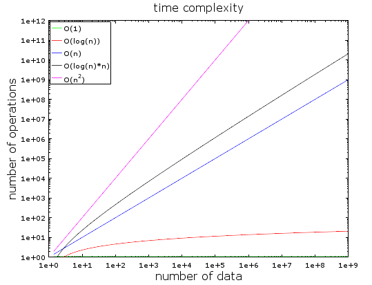

上图中，你可以看到几种不同类型的时间复杂度。我使用对数尺来构建这个图，具体点说，数据量以很快的速度从1增长到10^9，我们可以看到

* O(1)或者叫做常数时间复杂度保持不变（否则就不会叫它常数时间复杂度）
* O(log(N))复杂度在数据量增长到10^9的时候，操作步骤依然很少
* 时间复杂度最高的是O(N^2)，平方阶复杂度，运算数快速膨胀
* O(N)和O(N\*log(N))是另外两种复杂度，也是比较快的增长的

当数据量比较少的时候，O(1)和O(N^2)的时间复杂度时间差别是很微小的。比如你有一个算法要处理2000个元素

* O(1)算法需要1步操作
* O(log(N))算法需要7步操作
* O(N)算法需要2000步操作
* O(N\*Log(N))算法需要14000步操作
* O(N^2)算法需要4000000步操作

O(1)算法和O(N^2)算法的时间复杂度看上去相差很多(1 : 4000000)，但在实际运行的时候不过相差2ms的时间，也就是一眨眼的时间不到。事实上现在的处理器可以每秒进行上亿次的运算，这正是为什么现在很多的IT项目中性能调优并不是那么重要

但我还是要说，当需要处理真真正的大数据的时候，理解时间复杂度的概念是极其重要的。再举一个例子，如果算法需要处理1000000个元素（其实这个还不算是真正的大数据）

* O(1)算法需要1步操作
* O(log(N))算法需要14步操作
* O(N)算法需要1000000步操作
* O(N\*log(N))算法需要14000000步操作
* O(N^2)算法需要1000000000000步操作 

我没有具体计算过，但我可以说用O(N^2)算法的话，你有时间去喝一杯咖啡了，如果在1000000数据量的基础上在加一个0，甚至更多的0，那耗时可想而知

### 再深入一点

先给你一个直观的认知：

* 在哈希表中搜索一个元素的时间复杂度是O(1)
* 在一个均衡的树中搜索一个元素的时间复杂度是O(log(N))
* 在一个阵列（数组）中搜索一个元素的时间复杂度是O(N)
* 最好的排序算法的时间复杂度是O(N\*log(N))
* 一个不好的排序算法的时间复杂度是O(N^2)

>提示：在后面的章节中，我们会看到这些算法和数据结构

另外，有下面这几种类型的时间复杂度

* 平均时间复杂度
* 最好情况下的时间复杂度
* 最坏情况下的时间复杂度

时间复杂度往往是最坏情况下的时间复杂度

上面我只讨论了时间复杂度，复杂度还包括下面这些：

* 算法的内存消耗
* 算法的磁盘IO消耗

当然还有比O(N^2)更糟糕的时间复杂度：

* N^4：差劲，不过确实有些算法就是如此的复杂度
* 3^N：更差劲，本文中研究的一些算法具备这种复杂度（而且在很多数据库中还真的使用了）
* N!：你将永远得不到，即使是在少量数据的情况下
* N^N：如果你写出这种复杂度的算法，那你就需要问问自己是不是适合IT领域了

>提示：我没有给你关于O符号的真正定义，只是提到这个概念。你可以阅读这个[Wikipedia](https://en.wikipedia.org/wiki/Big_O_notation)去了解O的真实定义

### 归并排序

当你要对一个集合进行排序的时候你会怎么做？什么？你会直接调用sort()函数……好吧，很好的回答……但为了理解数据库原理你还需要理解sort()这个函数到底是怎么工作的？

总共有好几个不错的排序算法，而我将着重介绍最重要的一个：归并排序。现在你也许不理解为什么对数据排序这么重要，但看完查询优化部分之后你就会理解了。而且理解了归并排序会有助于我们理解一个通用的数据库连接操作：合并连接

和许多有用的算法一样，归并排序基于这样的技巧：合并两个N/2大小的有序序列得到一个大小为N的有序序列的操作只需要N步。这个操作就被称为归并

我们来通过一个例子来理解一下

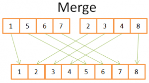

如上图，你只需要在两个4元素的有序序列中迭代一次，就可以构建最终的8元素有序序列，因为这两个4元素序列都是有序的

* 1) 在两个序列中，比较当前元素（当前 = 第一个元素）
* 2) 然后取出最小的元素放到8元素序列中
* 3) 找出两个序列的下个元素，比较后取出最小的
* 重复1、2、3步骤，直到你你达到其中一个有序序列的尾部
* 然后把另一个有序序列中剩下的其他元素直接放到8元素序列中

因为4元素序列都是排好序的，所以这么做是可行的，你不需要再回到序列中查找比较

既然我们理解了这个技巧，下面是我们对归并算法的逻辑实现

```python
array mergeSort(array a):
    if(length(a) == 1):
        return a[0]
    
    //recursive calls
    [left_array, right_array] := split_into_2_equally_sized_arrays(a)
    array new_left_array := mergeSort(left_array)
    array new_right_array := mergeSort(right_array)

    //merging the 2 small ordered arrays into a big one
    array result := merge(new_left_array, new_right_array)
    return result;
```

归并排序把大问题分解成多个小问题，通过找出各个小问题的解决方案最终来解决最初的大问题（这种算法被称为分而治之）

如果你不理解这个算法，没关系，我在第一次接触这个算法的时候也没有理解。我把这个算法分为两步希望能够帮助你理解

* 拆分阶段：把大序列分成两个较小的序列（译者注：直到拆分成一个个的原子序列）
* 排序阶段：把小的有序序列合在一起构成大序列

下图展示了拆分阶段的过程

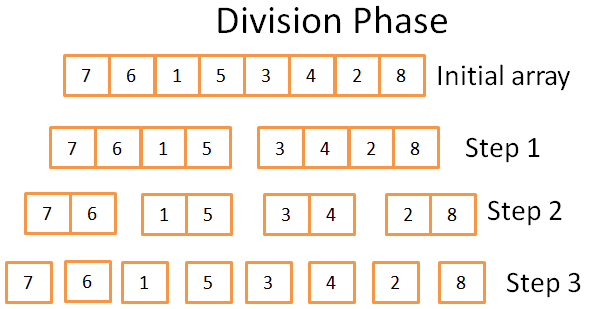

在拆分阶段，通过三个步骤把它拆分为多个原子序列（译者注：每个原子序列只有一个元素，显然只有一个元素的序列本身是有序的），这步的时间复杂度是O(log(N))

我是怎么知道的？

一句话：数学！思路是每步把原始序列均分成2个子序列，步骤数就是你能把原序列长度除以2的次数。这正是对数的定义！

下图展示排序阶段的过程

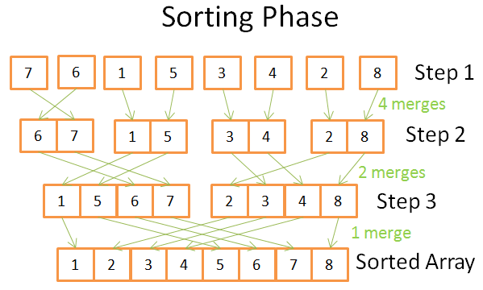

在排序阶段，你会从多个原子序列开始。每一步你进行多次归并操作，成本一共是N=8个操作

* 第一步：你要进行4次归并，每次归并成本是2个操作
* 第二步：你要进行2次归并，每次归并成本是4个操作
* 第三步：你要进行1次归并，每次归并成本是8个操作

因为一共有log(N)步，每部需要N次操作，所以时间复杂度是O(N\*log(N))

为什么归并排序这么强大？因为：

* 你可以修改它以减少内存使用，方法是不创建新的序列而是直接修改输入序列（这种算法叫做[原地算法](https://en.wikipedia.org/wiki/In-place_algorithm)）
* 你可以修改它以同时使用磁盘空间和少量的内存空间并且不会造成大量的磁盘IO。思路是只把当前需要处理的数据部分加载到内存。这在当只有100M内存空间排序几GB的表时是很重要的技巧（这种算法叫做[外部排序](https://en.wikipedia.org/wiki/External_sorting)）
* 你还可以修改它运行在多进程、多线程、分布式系统下。例如在[Hadoop](https://hadoop.apache.org/docs/stable/api/org/apache/hadoop/mapreduce/Reducer.html)（一个专门用于处理大数据的框架）中，分布式归并排序是一个重要的组件

这个算法很厉害，真的可以点石成金！

这种排序算法被应用到大多数（不是全部）的数据库系统中，但它并不是唯一的算法，如果你想知道更多，可以阅读[这个讨论数据库常用排序算法优势和劣势的论文](http://wwwlgis.informatik.uni-kl.de/archiv/wwwdvs.informatik.uni-kl.de/courses/DBSREAL/SS2005/Vorlesungsunterlagen/Implementing_Sorting.pdf)

既然我们理解了时间复杂度和排序背后的思想，我不得不向你介绍三种数据结构。他们构成了现代数据库系统的基石。我将还会提到数据库索引的概念

### 阵列（数组）

二维数组是最简单的数据结构！一个表可以被看做一个数组，如下图的例子

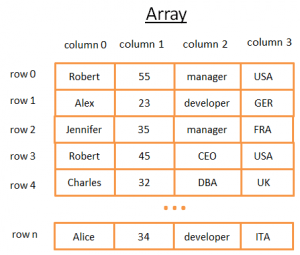

这个二维数组是由行和列组成的表

* 每一行代表一个对象
* 每一列表示这个对象的某一个属性
* 每一列存储特定类型的数据（整型、字符串、日期……）

尽管使用阵列是很好的存储数据和将数据可视化的方法，但当你需要去搜索一个特定的值的时候会很蛋疼

举个例子，如果你想去查找到表中所有在UK工作的人，你不得不去逐行检查每条数据以判断其是否在UK工作，这样的时间复杂度就达到了O(N)。看起来还不赖，但是不是有更好的方法！确实有，这时候树数据结构就闪亮登场了

>提示：大多数现代数据库系统中提供了更先进的阵列去高效的存储表结构，例如用堆结构组织的表或用索引组织的表。但它仍然没有能够改变这样一个问题：在多个列中快速搜索满足特定条件的记录

### 树和数据库索引

二叉查找树是一种有着特殊属性的二叉树，每个节点的值需要满足这样的条件：

* 比它左子树上所有节点的值都大
* 比它右子树上所有节点的值都小

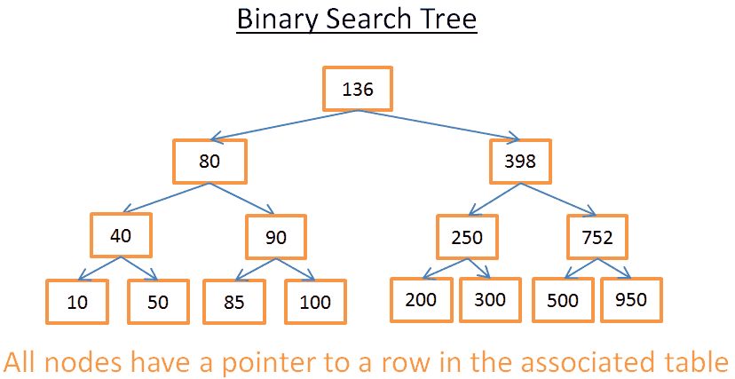

这棵树有N=15个元素，接下来我来描述搜索208这个元素的步骤：

* 先从根节点开始，136<208，所以我接下来去根节点的右子树搜索
* 398>208，所以去398的左子树继续搜索
* 250>208，所以去250的左子树继续搜素
* 200<208，所以去200的右子树继续搜索
* 但是200没有右子树，所以208这个元素不存在

再举个例子，比如我要去搜索40这个元素

* 依然是从根节点开始，136>40，所以我接下来取根节点的左子树搜索
* 80>40，所以去80的左子树继续搜索
* 40=40，好的！我找到了40这个节点！
* 知道了rowid，我就知道了数据在表中的精确位置，就可以立即获取数据了

最后总结一下，所有的搜索操作的成本都是树内部的层数，也就是log(N)，很不错！

### 回到我们的问题

上面的内容还是很抽象，所以让我们回到我们最初的问题。如果不是搜索最简单的整数，而是代表国家的字符串，假设你的表中有"country"这个列

* 如果你想知道谁在UK工作
* 你在树中查找代表UK的节点
* 在UK节点你会找到UK员工那些行的位置

这个搜索只花费了log(N)，而不是像前面搜索阵列花费的O(N)，刚才所设想的这种场景就是数据库中的索引

只要你有一个可以比较键值（多个列的组合）的函数，你就可以为多个列的组合（一个字符串、一个整数、两个字符串、一个整数和一个字符串、一个日期……）构建一个树形索引

### B+树索引

尽管二叉搜索树在搜索某个特定的值时可以很好的工作，但当你要搜索两个值之间的多个元素时就会遇到大麻烦，它会耗时O(N)因为你不得不去检查树中的每个节点是不是在这两个值的范围中（例如对树做中序遍历）。而且这个操作对磁盘IO也很不友好因为你需要去检查整棵树。所以我们需要向一个办法去有效的解决范围查询的问题。为了解决这个问题，现代数据库系统使用二叉查找树的进阶版本：B+树

在B+树中：

* 只有最后一层节点（叶子节点）存储数据（相关表的行位置信息）
* 其他的节点只是用来在搜索的时候来引导到正确的节点上


正如你所看到的，现在树上有更多的节点（是二叉搜索树的两倍）。事实上你有的额外的节点就是帮助你找到正确节点的决策节点（正确节点保存着相关表中行的位置），但是搜索的时间复杂度还是保持在O(log(N))

最大的不同点是：叶子节点是和它们的后续节点相连的

用上图中的B+树为例，搜索40到100之间的元素的步骤如下：

* 就像在前面二叉搜索树中做的那样，只需要找到40（如果40不存在就找到40后的第一个元素）
* 然后用那些连接来收集40的后续节点，直到找到100

假如这棵树有N个节点，而你找到了M个后续节点。那么搜索到特定节点的时间复杂度是O(log(N))，一旦你找到了这个节点，你只需要M步操作就可以得到后续M个节点，所以B+树下的搜索时间复杂度是O(log(N) + M)，相比于前面二叉搜索树的O(N)时间复杂度好得多，因为往往M是远远小于N的值（现在你不需要扫描整个树，只需要扫描M + log(N)个节点即可）

但现在有产生了新的问题！如果你在有B+树索引的表中新增或删除一行：

* 你必须在B+树中的节点之间保持顺序，否则节点变乱，无法利用B+树属性搜索
* 你必须尽可能降低B+树的层次，否则O(log(N))会变成O(N)

换句话说，B+树需要自调整和自平衡

所幸的是我们有智能删除和插入，但这又带来了新的成本：插入和删除在B+树中的时间复杂度是O(log(N))，这就是为什么你们应该听说过**使用过多的索引并不是一个好的主意**。没错数据库为了更新索引在插入/更新/删除的时候都需要O(log(N))的时间复杂度。另外，增加索引还意味着给事务管理器带来更多的工作负担（我们会在文章末尾讲解事务管理器）

你可以通过[这篇关于B+树的文章](https://en.wikipedia.org/wiki/B%2B_tree)来了解更多细节。如果你想知道数据库中B+树实现的例子可以看MySQL核心开发者[这篇文章](http://blog.jcole.us/2013/01/07/the-physical-structure-of-innodb-index-pages/)和[这篇文章](http://blog.jcole.us/2013/01/10/btree-index-structures-in-innodb/)，这两篇文章都着重讲解MySQL的innoDB是如何处理索引的

>提示：有读者告诉我，因为最低层的优化，B+树不得不进行全平衡

### 哈希表

我们最后讲到的一个重要的数据结构是哈希表。当你想要快速搜索一个元素的时候，哈希表很有用！另外理解了哈希表会帮助我们理解后面讲到的一种数据库连接操作：哈希连接。这种数据结构也被数据库用于保存一些内部数据（比如锁表或缓冲池，我们会在下面看到这两个概念）

通过哈希表我们可以快速的通过键值找到元素。为了构建一个哈希表你需要定义：

* 元素的关键字
* 关键字的哈希函数。关键字计算出来的哈希值给出元素的位置（称为哈希桶）
* 关键字比较函数。一旦你找到正确的哈希桶，你需要使用比较函数找到你想要的元素

来看一个可视化的例子

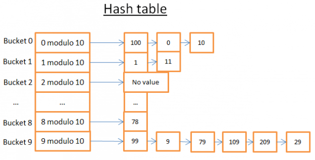

这个哈希表有10个哈希桶。我很懒，就只画了5个，但我知道你足够聪明可以想象出来没有画出来的5个桶！我使用的哈希函数是键值对10取模，换句话说，我只保留元素关键字的最后一位，用它来查找它的哈希桶

* 如果元素最后一位是0，则进入哈希桶0
* 如果元素最后一位是1，则进入哈希桶1
* 如果元素最后一位是2，则进入哈希桶2
* ……

我用的比较函数只是判断两个整数是否相等

比如你要找元素78：

* 哈希表计算78的哈希码，等于8
* 查找哈希桶8，找到的第一个元素是78
* 返回元素78
* 查询仅耗费了2次运算（1次计算哈希值，另一次在哈希桶中查找元素）

现在，比方说你要找元素59：

* 哈希表计算59的哈希码，等于9
* 查找哈希桶9，第一个找到的元素是99。因为99不等于59，那么99不是正确的元素
* 用同样的逻辑，查找第二个元素(9)，第三个(79)，……，最后一个(29)
* 元素不存在
* 搜索耗费了7次运算

正如你看到的，寻找不同的元素花费的时间是不同的

如果我现在修改哈希函数为键值对1000000取模，第二个搜索也只花费1步操作，因为000059号桶没有元素。**所以真正的挑战是找到一个好的哈希函数，它创建的桶只有少量的元素**

在我的例子中，找到一个好的哈希函数很简单。但这只是几个极简的例子，当键值是下面的情况的时候，找到一个好的哈希函数将很难：

* 键值为一个字符串（比如一个人的名字）
* 键值为两个字符串（比如一个人的姓和名字）
* 键值为两个字符串和一个日期（比如一个人的姓、名字、出生日期）
* ……更多复杂的场景

如果能有一个好的哈希函数，搜索的时间复杂度能够降为O(1)

### 阵列还是哈希表？

为什么不使用阵列呢？

哈！你问了一个很好的问题

* 一个哈希表可以只装载一半到内存，剩下的哈希桶继续存储在磁盘上
* 使用阵列的话，你需要在内存中申请一块连续的内存空间，如果你的表很大，那么将很难找到一块这么大的连续内存
* 使用哈希表的话，你可以选择你想用的键值（比如，一个人的国家和姓氏）

为了更多的信息，你可以阅读我写的[关于Java HashMap的文章](http://coding-geek.com/how-does-a-hashmap-work-in-java/)，是关于高效哈希表实现的。通过这篇文章，你不需要知道Java的概念就能理解其中的概念

# 全局概览

我们刚刚看到了数据库底层的基础组件。我们现在跳出来去看看数据库的全貌

数据库是一个易于访问和修改的数据集合！不过一个简单的文件集合就能达成相同的效果。事实上，最轻量的数据库比如SQLite就是一个文件集合，不过它是精心设计的文件集合，因为它允许你：

* 使用事务来保证数据的安全和一致性
* 快速处理百万级的数据

数据库架构一般是这样的：


在开始写这部分内容之前，我读了大量的书籍和论文，它们都使用自己的方式取描述数据库。所以不要纠结我怎么组织数据库架构，以及我怎么为这些程序命名，因为我选择了自己的方式来描述这些概念以适应本篇文章。真正重要的是不同的组件。总体的思路是一个数据库由多个不同的组件构成，并且它们之间相互交互

下面是这些核心组件：

* 进程管理器(process manager)：许多数据库有一个线程池/进程池，所以需要被管理起来。而且，为了实现纳秒级的操作，一些现代数据库使用自己的线程而不是操作系统线程
* 网络管理器(network manager)：网络IO是一个大的话题，特别是对于分布式系统，这正是为什么很多数据库系统有它们自己的网络管理器
* 文件系统管理器(file system manager)：磁盘IOO是数据库最主要的瓶颈。有一个管理器可以很好的应对数据库文件系统，甚至取代它
* 内存管理器(memory manager)：为了避免磁盘IO带来的性能损失，需要大量的内存，但当你处理大量的内存的时候，你就需要一个高效的内存管理器，尤其是你有很多查询同时使用内存的时候
* 安全管理器(security manager)：管理用户的权限
* 客户端管理器(client manager)：管理客户端连接
* ……

工具部分：

* 备份管理器(backup manager)：为了保存和恢复数据
* 复原管理器(recovery manager)：用于崩溃后重启数据库到一个一致状态
* 监控管理器(monitor manager)：使用日志记录数据库的行为，提供工具监控数据库
* Administration管理器(Administration manager)：用于保存元数据（比如表的名字、结构等），提供工具去管理数据库、模式、表空间

查询管理器（译者注：SQL相关）

* 查询解析器(query parser)：检查查询是否合法
* 查询重写器(query rewriter)：对查询进行预优化
* 查询优化器(query optimizer)：对查询进行优化
* 查询执行器(query executor)：编译并执行查询

数据管理器

* 事务管理器(transaction manager)：处理事务
* 缓存管理器(cache manager)：数据被使用之前置于内存，或者数据写入磁盘之前置于内存
* 数据访问管理器(data access manager)：访问磁盘中的数据

文章的后续部分，我将着重讲解数据库如何通过下面的组件管理SQL查询的：

* 客户端管理器
* 查询管理器
* 数据管理器（包括复原管理器）

# 客户端管理器


客户端管理器用于和客户端进行通信，客户端可能是一个Web服务器或者一个终端应用。客户端管理器提供不同的方法去访问数据库，包括以下这些知名的API：JDBC、ODBC、OLE-DB……

当你连接到数据库之后：

* 管理器首先检查你的权限（登录名和密码），判断你是否有使用数据库的权限，这个访问权限一般是DBA进行设计的
* 然后检查是不是存在可用的进程/现场去处理你的查询
* 管理器还会检查当前数据库是否负载很重
* 可能为了获取需要的资源要等待一段时间，但如果等待超时，会关闭连接并且返回一个可读的错误信息
* 然后会把你的查询送到查询管理器(query manager)，接着处理你的查询
* 因为查询处理进程不是**不全则无**的，一旦从查询管理器获取数据，就会把部分结果保存到一个缓冲区并返回给你
* 如果遇到问题，就会关闭连接并返回给你一个可读的解释，然后释放资源

# 查询管理器


这部分正是数据库的威力所在！在这部分，一个写的很垃圾的SQL查询会被优化成快速的可执行代码。这个代码被执行然后把查询结果返回给客户端管理器，这是一个多步骤组成的操作：

* 首先解析查询SQL，检查其语法是否合法
* 重写SQL，去除其中无用的操作，并且进行一些预优化处理
* 然后进一步优化以提升性能，并转换为可执行代码和数据访问计划
* 然后计划被编译
* 最后执行查询

在这部分，我不会对最后两个步骤讨论太多，因为它们没有那么重要！

在阅读完本部分内容后，如果你想对数据库有更好的理解，我推荐阅读：

* 关于成本优化(CBO)的初步研究论文[Access Path Selection in a Relational Database Management System](http://www.cs.berkeley.edu/~brewer/cs262/3-selinger79.pdf)，这篇文章只有12页，而且只需要有一般的计算机科学知识就能理解
* 非常好且深入的对DB2 9.X是如何进行优化查询介绍的文章，点击[这里](http://infolab.stanford.edu/~hyunjung/cs346/db2-talk.pdf)
* 非常好且深入的介绍PostgreSQL优化查询的[文章](http://momjian.us/main/writings/pgsql/optimizer.pdf)，这是一篇很友好的文章，因为它不是在讨论“让我们看看PostgreSQL中使用到哪些算法”，而是在讨论“让我们看看在这种情况下PostgreSQL给出了什么样的查询计划”
* [SQLite关于优化的官方文档](https://www.sqlite.org/optoverview.html)，SQLite使用的是比较简单的规则，所以很容易理解。而且这是唯一介绍SQLite如何工作的官方文档
* 介绍SQL Server 2005查询优化的[文章](https://blogs.msdn.com/cfs-filesystemfile.ashx/__key/communityserver-components-postattachments/00-08-50-84-93/QPTalk.pdf)
* 关于Oracle 12c查询优化的[白皮书](http://www.oracle.com/technetwork/database/bi-datawarehousing/twp-optimizer-with-oracledb-12c-1963236.pdf)
* 2篇查询优化的教程，[这篇](http://codex.cs.yale.edu/avi/db-book/db6/slide-dir/PPT-dir/ch12.ppt)和[这篇](http://codex.cs.yale.edu/avi/db-book/db6/slide-dir/PPT-dir/ch13.ppt)。教程来自于《数据库系统概论的作者》，集中讨论磁盘IO，需要读者有不错的计算机科学知识
* 我找到的另一份[教程](https://www.informatik.hu-berlin.de/de/forschung/gebiete/wbi/teaching/archive/sose05/dbs2/slides/09_joins.pdf)，专注于讲解连接操作和磁盘IO

### 查询解析器

每条SQL语句都被送到解析器来检查其语法是否合法。如果你在SQL中写了错误的语法，那么解析器会直接拒绝这条SQL。例如，你写的是"SLECT ..."而不是正确的"SELECT ..."

更进一步的，他还会检查SQL的关键字是不是写在了正确的地方，比如"WHERE"写到"SELECT"前面的话，也会被直接拒绝

然后会分析SQL中的表和字段，解析器会使用数据库的元数据(Meta Data)进行检查：

* 表是否存在
* 表中的字段是否存在
* 对于某类型字段的操作是否可行（例如，不能拿一个整型和字符串类型比较，你不能对一个整型调用substring()函数）

然后会检查你是不是有权限去读/写查询中的表。再说一遍，对于表的访问权限要DBA来进行设置

在解析阶段，SQL查询会被转化为数据库内部的表示形式（经常是一个树形结构）

如果所有的检查都通过了，那么内部表示形式会被发送到查询重写器

### 查询重写器

在这一步，我们会先得到从查询解析器发送过来的查询内部表示形式，重写器的目的是：

* 对查询进行预优化
* 去除查询中不必要的操作
* 为优化器寻找合理的最佳解决方案

重写器为查询执行一系列的已知规则。如果查询匹配到某条规则，那么这条规则就会被应用，而查询就会被重写。下面是（可选）规则的非详尽的列表：

* 视图合并：如果在你的查询中使用了视图，视图就会被转换为它的SQL代码
* 子查询扁平化：存在子查询的SQL优化起来难度很大，因此重写器会尝试修改带有子查询的查询，最好是将子查询去除

例如下面这个SQL

```sql
SELECT PERSON.*
FROM PERSON
WHERE PERSON.person_key IN
(SELECT MAILS.person_key
FROM MAILS
WHERE MAILS.mail LIKE 'christophe%')
```

会用下面的SQL替换上面的SQL

```sql
SELECT PERSON.*
FROM PERSON, MAILS
WHERE PERSON.person_key = MAILS.person_key
AND MAILS.mail LIKE 'christophe%'
```

* 移除不必要的操作：例如如果你使用了DISTINCT，而其实你有UNIQUE约束（这本来就是为了防止出现重复），那么DISTINCT就会被去掉
* 排除冗余的连接：如果因为一个连接条件藏在视图中，或者由于传递性产生的无用的连接导致你的查询存在两个相同的连接条件，那么就会被移除
* 常量计算赋值：如果你写了需要进行计算的SQL，那么在重写的过程中计算会被执行一次。例如WHERE AGE > 10+2，会被转换为WHERE AGE > 12，TODATE("some date")会被转换成一个日期形式
* (高级)分区裁剪(Partition Prunning)：如果你用了分区表，重写器能够找到需要使用的分区
* (高级)物化视图重写(Materialized view rewrite)：如果你有个物化视图匹配查询谓词的一个子集，重写器将检查视图是否最新并修改查询，令查询使用物化视图而不是原始表
* (高级)自定义规则(Custom rules)：如果你有自定义规则来修改查询（就像Oralce policy），重写器就会执行这些规则
* (高级)Olap转换(Olap transformations)：分析/加窗函数、星形连接、ROLLUP函数……都会发生转换（但我不确定这是在重写器还是在优化器部分完成的，因为这两个步骤很接近，这就必须看具体是什么数据库了）

重写后的查询会被送到查询优化器。注意！现在有趣的事情开始了！

### 统计

在我们开始看数据库是如何优化一个查询之前，需要先去谈谈统计，因为没有它们数据库就会像傻子一样。如果你没有告诉数据库去分析它自己的数据，它就不会去做。没有分析的话往往会导致数据库做出很差劲的假设！

但数据库需要什么样的信息呢？

我不得不去谈谈数据库和操作系统是如何存储数据的！它们使用成为页或者块（默认是4或8KB）最小单元，这就意味着如果你只需要1KB的数据，也会占用1页的空间，如果每页的大小是8KB，那么显然你将会浪费7KB的空间

回到统计上来！当你要求数据库去收集统计信息，它会计算下列的值：

* 一张表有多少行/多少页？
* 对于表中的每一列：
    * 唯一值
    * 数据长度（最小、最大、平均）
    * 数据范围（最小、最大、平均）
* 表的索引信息

这些统计信息会帮助优化器去评估一个查询需要用到的磁盘IO、CPU占用、内存占用等

对于每一列的统计信息是很重要的。例如如果PERSON表需要连接两个列：LAST\_NAME、FIRST\_NAME。有了统计信息后，数据库知道FIRST\_NAME列有1000个不同的数据、LAST\_NAME列有1000000个不同的数据。因此数据库就会按照LAST\_NAME, FIRST\_NAME而不是FIRST\_NAME, LAST\_NAME的方式进行连接，LAST\_NAME更不容易重复，因此多数情况下比较LAST\_NAAME的头2、3个字符就够了，所以这种处理方式会降低比较的次数

但这只是一些最基础的统计信息，你可以要求数据库进行更高级的统计，我们称之为直方图(histograms)，直方图表示列中数据分布的统计信息，例如：

* 最常出现的值
* 分位数
* ……

这些额外的统计会帮助数据库找到一个更佳的查询计划！尤其是对于等式谓词（比如：WHERE AGE=18）以及范围谓词（例如：WHERE AGE>10 and AGE<40），因为数据库可以更好的了解这些谓词相关的数据类型数据行（注：这个概念的专业名词叫做选择率）

统计信息会被存储在数据库的元数据中。例如你可以看到（非分区）表的统计信息：

* Oralce：USER/ALL/DBA\_TABLES和USER/ALL/DBA\_TAB\_COLUMNS
* DB2：SYSCAT.TABLES和SYSCAT.COLUMNS

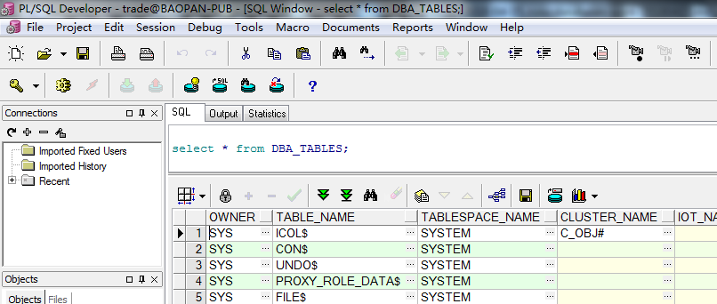

**注意！统计信息必须及时更新**。没有比数据库认为它只有500行而它实际有1000000行更糟的事情了。唯一的缺陷是需要花时间来计算它们。这就是为什么大多数数据库默认不开启自动统计的功能，当数据量达到百万级别的时候，统计将会变得很难。这时候你可以选择仅做基础统计或者在一个数据库样本上进行统计

举个例子，我参加的一个项目，每张表中有上亿的数据量，我选择只统计10%，结果造成了大量的时间消耗。这个故事证明有时候Oracle 10G从特定表的特定列中选出10%跟全部100%有很大不同（对于拥有一亿行数据的表，这种情况极少发生）。这次错误的统计导致了一个本应30秒完成的查询最终执行了8小时，查找这个现象根源的过程简直是个噩梦。这个例子说明了统计的重要性

>提示：当然了，每种不同的数据库还有其特定的更高级的统计。如果你想知道更多，需要去阅读对应数据库的文档。话虽如此，我已经尽力解释统计是如何工作的了，这方面最好的官方文档来自[PostgreSQL](http://www.postgresql.org/docs/9.4/static/row-estimation-examples.html)

### 查询优化器


所有的现代数据库使用基于成本的优化(Cost Based Optimization, CBO)来优化查询。思路是针对每个运算设置一个成本，通过应用成本最低廉的一系列运算，来找到最佳的降低查询成本的方法

为了理解成本优化器的原理，我觉得最好用个例子来感受一下这个任务背后的复杂性。在这部分我会展示连接2张表的三种方法，我们很快会发现即使是最简单的连接查询对于优化器来说都是一个噩梦。在这之后，你将了解真正的优化器是怎么做的

对于连接操作，我会集中讲它们的时间复杂度，而不是一个数据库优化器运算需要的CPU消耗、磁盘IO消耗和内存占用。时间复杂度和CPU消耗之间的区别是时间成本是个近似值（给我这样的懒家伙准备的）。而CPU成本，我需要计算每个操作，包括一个加法、一个if判断、一个乘法、一个迭代……而且：

* 每个高级运算都需要特定数量的低级CPU运算
* CPU运算根据你使用的是Inter Core i7，还是Interl Pentium 4，还是AMD Opteron而不同，换句话说，就是依赖于你的CPU架构

使用时间复杂度相对更简单（至少对于我而言），而且通过时间复杂度的概念我们仍然可以理解CBO。因为磁盘IO是很重要的概念，所以我偶尔会提到它。请记住：大多数时候的性能瓶颈在磁盘IO而不是CPU占用

### 索引

我们在B+树部分讨论过索引，要记住一点：索引是已经排好序了的！

仅供参考：还有其他类型的索引，像位图(bitmap)索引，相比于B+树索引，它们在CPU、磁盘IO、内存占用方面的消耗是不同的

另外，许多现代数据库为了改善执行计划的成本，可以仅为当前查询动态生成临时索引

### 存取路径

在应用你的连接操作之前，首先需要获取你得数据，下面是你获取数据的方法

>提示：因为存取路径的真正问题在于磁盘IO，所以我不会谈论太多时间复杂度的问题

**全扫描(full scan)**

如果你曾看过SQL的执行计划，你一定看到过`full scan`这个关键词。简单地说，全扫描就是数据库完整的读一张表或一个索引，就磁盘IO而言，一个表的全扫描比一个索引的全扫描更昂贵

**范围扫描(range scan)**

还有其他类型的扫描，例如索引范围扫描(index range scan)。比如当你执行WHERE AGE>20 AND AGE<40的时候会执行这样的扫描

当然为了使用索引范围扫描，首先你需要在AGE列建一个索引！

我们已经在上看看到了执行一个范围查询的时间复杂度是log(N)+M（N是索引数据的量，M是范围中的数据量），因为执行过统计，所以N和M的值都是知道的（提示：M是谓词"AGE>20 AND AGE<40"的选择率）。另外，执行范围扫描的时候，你不需要读取整个索引，所以磁盘IO上的消耗相比于全扫描是很小的

**唯一扫描**

如果你只需要从索引中取出一个值，你可以用唯一扫描

**根据ROWID存取**

大多数时候，数据库使用索引，它就必须查找与索引相关的行，这样就会用到根据ROWID存取的方式

例如你运行

```sql
SELECT LASTNAME, FIRSTNAME from PERSON WHERE AGE = 28
```

如果你在PERSON表的AGE列有一个索引，优化器会使用索引查找PERSON表中所有AGE为28的记录，然后会向表索要相关的这些行，因为索引只有AGE的信息，而你可能还想要LASTNAME和FIRSTNAME等其他列

但是，如果你想这样

```sql
SELECT TYPE_PERSON.CATEGORY from PERSON, TYPE_PERSON
WHERE PERSON.AGE = TYPE_PERSON.AGE
```

PERSON表的索引会和TYPE\_PERSON进行连接，但是PERSON表不会根据ID存取，因为你并没有要求这个表内的信息

虽然这个方法在少量存取时表现很好，这个运算的真正问题其实是磁盘IO。假设需要大量的根据行ID存取，数据库也许会选择全扫描

**其他路径**

我没有把所有的存取路径都列出来。如果你想知道更多，你可以阅读[Oracle的文档](https://docs.oracle.com/database/121/TGSQL/tgsql_optop.htm)。具体的术语可能和其他数据库不同，但背后的原理是相通的

### 连接操作

好的，我们知道怎么获取我们的数据了，接下来来连接它们

我会介绍3种常见的连接操作：合并连接（Merge join），哈希连接（Hash Join）和嵌套循环连接（Nested Loop Join）。但在此之前，我需要去介绍新的概念：内关系和外关系（inner relation and outer relation），一个关系可以是：

* 一张表
* 一个索引
* 上一个运算的中间结果（比如上一个连接运算的结果）

当你去连接两个关系的时候，连接算法对两个关系的处理是不同的。在文章的剩下部分，我会假设：

* 外关系是左侧数据集
* 内关系是右侧数据集

例如 A JOIN B 是A和B之间的连接，A是外关系，B是内关系

大多数情况下，A JOIN B的耗时和B JOIN A的耗时是不同的

在这部分，我还会假设外关系有N个元素，内关系有M个元素。请记住：真实的优化器是可以通过统计知道N和M的值的

### 嵌套循环连接

嵌套循环连接是最简单的一种连接

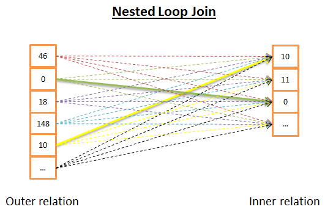

运行原理如下：

* 针对外关系的每一行
* 查看内关系的所有行来寻找匹配的行

下面是伪代码

```python
nested_loop_join(array outer, array inner):
    for each row a in outer:
        for each row b in inner:
            if(match_join_condition(a, b)):
                write_result_in_output(a, b)
```

因为它是双重循环，所以时间复杂度是O(N\*M)

在磁盘IO方面，针对外关系N行的每一行，内关系需要循环M次。这个算法需要从磁盘读 N+N\*M 行。但如果内关系足够小，你可以把它存储在内存中，这样你只需要 M+N 次读磁盘。有了这个修改，需要保证内关系是相对外关系最小的那个，这样才能有最大的机会将内关系加载到内存中

在时间复杂度方面没有什么区别，但在磁盘IO方面最好是每个关系只读取一次

当然，内关系可以由索引替代，这样对磁盘IO更有利！

由于这个算法很简单，下面是另一个在内关系太大以至于无法加载仅内存的情况下还可以对磁盘IO友好的版本。思路是这样的：

* 不再是针对每个关系进行逐行的读
* 可以成簇地读取，把（两个关系里读到的）两簇数据行保存到内存中
* 比较两簇数据中的每一行，并将匹配到的保存在内存中
* 然后从磁盘加载新的数据簇来继续比较
* 直到加载完所有数据

算法的伪代码如下：

```python
//improved vresion to reduce the disk I/O
nested_loop_join_v2(file outer, file inner):
    for each bunch ba in outer:
    //ba is now in memory
        for each bunch bb in inner:
        //bb is now in memory
            for each row a in ba:
                for each row b in bb:
                    if(match_join_condition(a, b)):
                        write_result_in_output(a, b)
```

这个版本的时间复杂度还是一样的，但磁盘IO的数量大大降低了：

* 前一种算法需要 N+N\*M 次的访问（每次访问读到一行）
* 新版本的算法，磁盘访问的次数变成了 number\_of\_bunches\_for(outer) + number\_of\_bunches\_for(outer) \* number\_of\_bunches\_for(inner)
* 如果你增加bunch的大小，可以降低磁盘访问的次数

>提示：每个磁盘访问比以前的算法收集更多的数据，但它并不重要，因为它们是顺序访问（机械磁盘的真正问题是获取第一个数据的时间）

### 哈希连接

哈希连接更为复杂但相比于循环嵌套连接在很多情况下会有更低的消耗

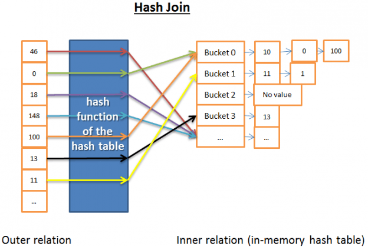

哈希连接的思路是：

* 从内关系中获取所有的元素
* 在内存中建立哈希表
* 从外关系中逐行取元素
* 比较每个元素的哈希（使用哈希表的哈希函数）来查找内关系中相关哈希桶
* 在哈希桶中寻找是否有和外关系元素匹配的项

为了计算时间复杂度，我需要做一些假设来简化问题：

* 内关系被分到X个桶中
* 哈希函数几乎平均地分布每个元素内数据的哈希值，就是说哈希桶大小一致
* 外关系的元素与哈希桶内的所有元素匹配，成本是哈希桶内元素的数量

时间复杂度是 (M/X)\*N + cost\_to\_create\_hash\_table(M) + cost\_of\_hash\_function\*N

如果哈希函数创建的每个哈希桶足够小，时间复杂度会降到 O(M+N)

下面是另一个版本的哈希连接，它在内存使用方面更友好，但在磁盘IO方面不太友好：

* 计算内关系和外关系双方的哈希表
* 保存哈希表到磁盘
* 然后逐个哈希桶比较（其中一个读入内存，另一个逐行读取）

### 合并连接

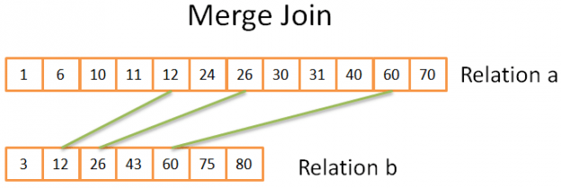

>合并连接要求两个关系是已经排好序的！

合并连接和我们上面讲到的合并排序中的合并操作很像！但不同的是，这次我们不是从两个关系中取出所有元素，而只是挑选相同的元素，原理如下：

* 1) 在两个关系中比较当前元素（当前指的是头一次出现的第一个）
* 2) 如果它们相等，就把它们都放到结果集中，然后继续比较两个关系的下一个元素
* 3) 如果不相等，就去带有最小元素的关系中找下一个元素（因为下一个元素可能会匹配）
* 重复1、2、3步。直到到达其中一个关系的最后一个元素

两个关系都是排好序的，因此你不需要再回头去找，所以这么做是可行的

以上是简化版的算法，因为它没有处理两个序列中相同数据出现多次的情况（即多重匹配）。真实的版本比上面的简化版本复杂很多，所以为了演示我就选择了简化版进行展示

如果两个关系都是排好序的，那么该算法的时间复杂度是O(N+M)

如果两个关系需要先进行排序，那么时间复杂度就是排序的时间：O(N\*log(N) + M\*log(M))，合并的时间复杂度为O(N+M)相对可以忽略掉

对于计算机科学的极客，我给出下面这个可能的算法来处理多重匹配（注：对该算法，我不保证100%正确）

```python
mergeJoin(relation a, relaition b):
    relation output
    int a_key = 0
    int b_key = 0

    while(a[a_key]!=null or b[b_key]!=null):
        if(a[a_key] < b[b_key]):
            a_key++
        else if(a[a_key] > b[b_key]):
            b_key++
        else: //Join predicate satisfied
              // i.e. a[a_key] == b[b_key]
            // count the number of duplicates in relation a
            int nb_dup_in_a = 1
            while(a[a_key] == a[a_key + nb_dup_in_a]):
                nb_dup_in_a++

            // count the number of duplicates in relation b
            int nb_dup_in_b = 1
            while(b[b_key] == b[b_key + nb_dup_in_b]):
                nb_dup_in_b++


            // write the duplicates in output
            for(int i=0; i<nb_dup_in_a; i++):
                for(int j=0; j<nb_dup_in_b; j++):
                    write_result_in_output(a[a_key+i], b[b_key+j])
            
            a_key = a_key + nb_dup_in_a - 1
            b_key = b_key + nb_dup_in_b - 1
```

### 哪一种连接是最好的？

如果有最好的连接，那么就没有必要弄出这么多类型了。这个问题比较难，因为需要考虑很多的因素：

* **空闲内存的数量**：没有足够的内存空间你就得和强大的哈希连接说再见了（至少是完全内存中的哈希连接）
* **两个数据集的大小**：例如比如你要用一个很大的表去和一个很小的表进行连接，那么嵌套循环连接会比哈希连接更快，因为哈希连接在创建哈希的时候会花费大量时间。如果两个表都非常大，那么嵌套循环连接就很占CPU了
* **索引是否存在**：如果建立了B+树索引，那么合并连接会是明智的选择
* **结果集是否需要排序**：即使你在两个无序的结果集上进行连接操作，你还是会用耗时的归并连接，因为最终得到有序的结果后，你可以把它和另一个合并连接串起来（或者也许是因为查询用ORDER BY/GROUP BY/DISTINCT等操作符隐式或显式地要求一个排序结果）
* **数据集是否已经被排序**：如果两个数据集已经被排好序，那么合并连接将会是更好的选择
* **连接的类型**：是等值连接（例如 tableA.clo1 = tableB.col2）？还是内连接？还是外连接？还是笛卡尔乘积？还是自连接？有些连接在特定环境下是无法工作的
* **数据的分布**：如果连接条件中的数据是倾斜的（比如根据姓氏来连接人，但很多人同姓），用哈希连接会是一个灾难，因为哈希连接将产生分布极其不均匀的哈希桶
* 你是否想要连接被**多线程/多进程**执行

获取更多的资料，你可以阅读[DB2](https://www-01.ibm.com/support/knowledgecenter/SSEPGG_9.7.0/com.ibm.db2.luw.admin.perf.doc/doc/c0005311.html)、[Oracle](http://docs.oracle.com/cd/B28359_01/server.111/b28274/optimops.htm#i76330)或[SQL Server](https://technet.microsoft.com/en-us/library/ms191426(v=sql.105).aspx)的文档

### 简单的例子

我们刚刚只看到了三种类型的连接操作

现在让我们来看看为了得到一个完整的个人信息的视图我们需要去连接5张表，一个PERSON可以有：

* 多个手机信息（MODILES）
* 多个邮件信息（MAILS）
* 多个地址信息（ADDRESSES）
* 多个银行账户信息（BANK\_ACCOUNTS）

换句话说，我们需要用下面的查询快速获得结果

```sql
SELECT * FROM PERSON, MOBILES, MAILS, ADDRESSES, BANK_ACCOUNTS
WHERE
PERSON.PERSON_ID = MOBILES.PERSON_ID
AND PERSON.PERSON_ID = MAILS.PERSON_ID
AND PERSON.PERSON_ID = ADRESSES.PERSON_ID
AND PERSON.PERSON_ID = BANK_ACCOUNTS.PERSON_ID
```

作为一个查询优化器，我需要找到最快获取数据集的方法，但这里有两个问题：

1) 我需要为每个连接具体选择什么类型的连接操作？

我可以选择三种连接（哈希连接、合并连接、嵌套循环连接），同时可能用到0、1或2个索引（不必说还有多种类型的索引）

2) 按照什么顺序执行连接？

例如，下图展示位4张表执行3个连接操作的可能方案：

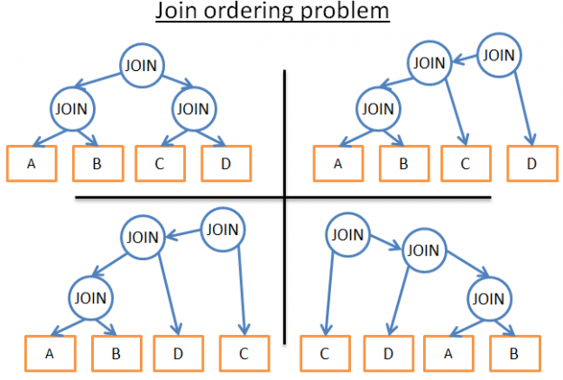

下面是我可能采用的方法：

1) 采用粗暴的方式

使用数据库统计，计算每种可能的执行计划的成本，然后我选择最优的方案。但会存在太多哦可能的执行计划。对每个给定的连接，会有3中可能性：哈希连接、合并连接、嵌套循环连接。所以一共有3^4 种可能的执行计划。确定连接顺序是一个[二叉树排序问题](https://en.wikipedia.org/wiki/Catalan_number)，会有 (2\*4)!/(4+1)! 种可能的顺序，对于本例这个简化了的问题，我最后会得到 (3^4)\*(2\*4)!/(4+1)! 种可能

抛开专业领域的问题，意味着有27216种可能的执行计划。如果给合并连接加上使用0、1或2个B+树索引，可能性就变成了210,000种（开始的时候我是不是说过这个查询非常简单？！试想那些真正复杂的查询会有多少种可能性）

2) 我大哭然后放弃了这个任务

这很有诱惑力，但这样一来你不会得到查询结果，而我需要钱来付账单

3) 我只比较少量的执行计划，然后选择其中耗时最少的那个

既然我不是超人，我不能为每个执行计划计算耗时。相反，我可以武断地从所有可能的执行计划中选出一个子集，计算它们的耗时，然后给出子集中最好的一个执行计划

4) 我采用更智能的规则去减少可能的执行计划的数量

下面有两种规则：

* 我可以使用“逻辑”规则去除无用的可能性，但无法过滤大量的可能性。比如：嵌套循环连接的内关系必须是最小的数据集
* 我接受现实，不去寻找最佳方案，用更激进的规则来大大降低可能性的数量。比如：如果一个关系很小，那就使用嵌套循环连接，绝不使用合并或哈希连接

在这个简单的例子中，我最后得到了很多可能性。但现实世界的查询还会有其他关系运算符，比如：OUTER JOIN、CROSS JOIN、GROUP BY、ORDER BY、PROJECTION、UNION、INTERSECT、DISTINCT……这意味着更多的可能性

那么数据库是怎么处理的呢？

>动态规划、贪婪算法和启发式编程（Dynamic programming, greedy algorithm and heuristic）

关系型数据库会尝试我刚才提到的各种方法。优化器的真正工作是在限定的时间内找到一个好的解决方案

大多数时候优化器并不会找到一个最好的方案，而只是选择一个不错的解决方案

对于小规模的查询，采用粗暴的方式是可能的。但为了让中等规模的查询也能采取粗暴的方式，我们有办法避免不必要的计算，这就是动态规划

### 动态规划

这个概念背后的原理是很多执行计划是很相似的。如果你看下面的这些执行计划

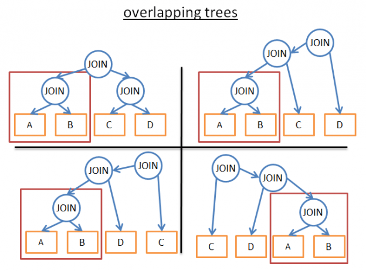

它们共享相同的子树（A JOIN B）。因此我们可以只计算这个子树一次而不是在计算每个执行计划的耗时的时候都去执行一次！然后在看到这个子树的时候重复使用就好了！更规范的说法是，我们面对的是一个重叠的问题，为了避免重复运算，我们使用记忆法！

使用这个技巧后，时间复杂度不再是(2\*N)!/(N+1)!，而变成了3^N。在我们前面那个存在4个连接操作的例子中，意味着从336变成了81。如果你处理有8个连接的查询，意味着从57657600降低到6561

对于计算机极客，下面是我在[这个课程](http://codex.cs.yale.edu/avi/db-book/db6/slide-dir/PPT-dir/ch13.ppt)上找到的算法实现。如果你知道动态规划或者对算法比较熟练，建议你阅读下面的伪代码

```python
procedure findbestplan(S)
if (bestplan[S].cost infinite)
   return bestplan[S]
// else bestplan[S] has not been computed earlier, compute it now
if (S contains only 1 relation)
         set bestplan[S].plan and bestplan[S].cost based on the best way
         of accessing S  /* Using selections on S and indices on S */
     else for each non-empty subset S1 of S such that S1 != S
   P1= findbestplan(S1)
   P2= findbestplan(S - S1)
   A = best algorithm for joining results of P1 and P2
   cost = P1.cost + P2.cost + cost of A
   if cost < bestplan[S].cost
       bestplan[S].cost = cost
      bestplan[S].plan = “execute P1.plan; execute P2.plan;
                 join results of P1 and P2 using A”
return bestplan[S]
```

对于更大规模的查询，你可以继续使用动态规划，但要附加额外的规则（或者成为启发式算法）

1) 如果我们仅分析一个特定类型的计划（例如左深树left-deep tree，我们得到 n\*(2^n) 而不是 3^n

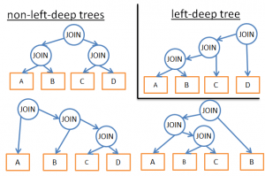

2) 如果我们添加逻辑规则来避免一些模式的计划（比如，如果一个表有针对指定谓词的索引，就不要对表尝试合并连接，要对索引），就会在不给最佳方案造成过多伤害的前提下，减少可能性的数量

3) 如果我们在流程中添加规则（例如，连接运算先于其他所有的关系运算），也能减少大量的可能性

### 贪婪算法

>译者注：贪婪算法不从全局视角寻找最优解决方案，而是基于这样的假设：假如为了解决一个问题，有多个步骤，只为当前步骤寻找最优的方案，最终组合起来的不一定是最优方案，但也会是一个不错的方案

但当处理一个非常大的查询，或者为了尽快得到答案，还会采用另外一种算法：贪恋算法

原理是按照一个规则（或启发）以增量的方式构建一个查询计划。根据这个规则，贪婪算法逐步寻找最优方案：先处理一个JOIN，接着每一步按照同样的规则加一个新的JOIN

继续看一个简单的例子。比如这样一个查询，它有对5张表的4个连接（A、B、C、D和E）。为了简化问题，我们把嵌套循环连接作为可能的连接。让我们来看看**使用最低成本的连接规则**：

* 直接从5张表中选择一张（比如选择A）
* 我们计算每个和A进行连接的耗时（A作为我们的外关系或内关系）
* 发现A JOIN B是最省时的
* 然后计算所有和A JOIN B的结果集进行的连接的耗时（A JOIN B作为内关系或外关系）
* 我们发现 (A JOIN B) JOIN C 是最省时的
* 然后我们继续计算所有和 (A JOIN B) JOIN C 的结果集进行的连接的耗时
* …………
* 最后我们发现执行计划  ((((A JOIN B) JOIN C) JOIN D) JOIN E) 是最优方案

既然我们可以直接选择从表A开始，我们也可以选择从B开始并应用相同的算法，然后C，然后D，然后E，最后保留成本最低的执行计划

顺便说一句，这个算法的名字叫做[最近邻居算法](https://en.wikipedia.org/wiki/Nearest_neighbour_algorithm)

我们不会涉及到太多细节，只需要一个良好的模型和一个N\*log(N)复杂度的排序，问题就轻松解决了！这个算法的复杂度是 O(N\*log(N)) ，对比一下动态规划的 O(3^N)。如果你有个20个连接的大型查询，这意味着 26 vs 3,486,784,401 ，天壤之别！

这个算法的问题是，我们假设找到2个表的最佳连接方式，保留这个连接结果，再连接下一个表，最终能够得到最优结果。不过尽管 A JOIN B 给出A、B、C三张表的最佳方案，但 (A JOIN C) JOIN B 也许会是比 (A JOIN B) JOIN C 更有的方案 

为了改善这一状况，你可以多次使用基于不同规则的贪婪算法，并保留最佳的执行计划

### 其他算法

>如果你对算法部分已经开始厌烦了，那么可以直接跳过这部分，接下来我要说的东西和本文剩下要讲解的内容关系不大

为问题找到最佳的解决方案是很多计算机科学家们热衷的研究课题。他们经常尝试为特定的问题或模式寻找更好的解决方案，比如：

* 如果查询是星型连接（一种多连接查询），某些数据库会使用一种特定的算法
* 如果查询是并行的查询，一些数据库会选择特定的算法
* ……

还有其他一些算法正在被研究，希望能够用于取代大型查询中的动态规划。贪婪算法是启发式算法这个大家族中的一员。贪婪算法根据一条规则（启发），保存上一步找到的方法，附加到当前步骤来进一步搜寻答案。一些算法采用一种规则，并把它应用到每个步骤中，但它并不总是保存上一步找到的最佳方案，这些算法就被叫做启发式算法

例如，基因算法就是应用一种规则，但是上一步得到的最佳方案并不总是被保留：

* 一个解决方案表示一个可能的全查询计划
* 每一步保留P个解决方案（计划）而不是一个方案（计划）
    * 0) P个查询计划被随机创建
    * 1) 只有耗时最少的方案被保留
    * 2) 这些最佳计划混在一起产生P个新的计划
    * 3) 一些新的计划被随机改写
    * 4) 步骤1、2、3重复T次
    * 5) 然后在最后一次循环，从 P 个计划里得到最佳计划

循环的次数越多，你得到的方案越好

是不是很神奇？不是的，这是基于自然法则：适者生存

[PostgreSQL](http://www.postgresql.org/docs/9.4/static/geqo-intro.html)就实现了基因算法，但我并没有发现它是不是默认使用这种算法的

还有其他的启发式算法被用在数据库中，比如模拟退火算法(Simulated Annealing)、交互式改良算法(Iterative Improvement)、(双阶段优化算法（Two-Phase Optimization)……不过，我不知道这些算法当前是否在企业级数据库应用了，还是仅仅用在研究型数据库

为了获取更多的信息，你可以阅读下面这篇文章，它介绍了更多的算法[Review of Algorithms for the Join Ordering Problem in Database Query Optimization](http://www.acad.bg/rismim/itc/sub/archiv/Paper6_1_2009.PDF)

### 真实的优化器

>这段不重要，可以直接跳过

但这部分的所有唠叨都是涉及到底层原理性的。不过我作为一个开发者而不是一个研究者，我更喜欢具体的例子

让我们看看[SQLite的优化器](https://www.sqlite.org/optoverview.html)是如何工作的。这是一个轻量级的数据库，因此它采用基于贪婪算法的优化，它建立在一些规则规则的基础上来降低可能性：

* SQLite选择在CROSS JOIN中不进行重新排序
* 连接都选择嵌套循环连接
* 外连接始终按顺序评估
* ……
* 3.8.0之前的版本使用最近邻居贪婪算法来搜寻最佳查询计划
* 从3.8.0版本开始，SQLite使用[N近邻算法sss(https://www.sqlite.org/queryplanner-ng.html)这种贪婪算法来搜寻最佳查询计划

来看看另一个优化器是怎么工作的？IDM DB2和所有的企业级数据库一样，我讨论它是因为在切换到大数据之前，它是我最后真正使用的数据库

如果我们看了[官方文档](https://www-01.ibm.com/support/knowledgecenter/SSEPGG_9.7.0/com.ibm.db2.luw.admin.perf.doc/doc/r0005278.html)，可以看到DB2使用了7个层次的优化：

* 为连接操作使用贪婪算法
    * 0 - 最小优化，使用索引扫描和嵌套循环连接，避免一些查询重写
    * 1 - 低级别的优化
    * 2 - 全优化
* 为连接操作使用动态规划
    * 3 - 中等优化和粗略的近似法
    * 5 - 全优化，使用带有启发式的全部技术
    * 6 - 和 5 类似的全优化，没有使用启发式算法
    * 9 - 最大优化，完全不顾开销，考虑所有可能的连接顺序，包括笛卡尔积

我们可以看到DB2使用了贪心算法和动态规划。当然他们没有分享他们使用的启发式算法，以为查询优化器是数据库的核心技术所在

默认的级别是 5，默认情况下优化器使用以下的特性：

* 所有可用的统计。包括线段树(frequent-value)和分位数统计(quantile statistics)
* 使用所有查询重写规则（含物化查询表路由，materialized query table routing），除了在极少情况下适用的计算密集型规则。
* 使用动态编程模拟联接
* 有限使用组合内关系（composite inner relation）
* 对于涉及查找表的星型模式，有限使用笛卡尔乘积
* 考虑宽泛的访问方式，含列表预取（list prefetch，注：我们将讨论什么是列表预取），index ANDing（注：一种对索引的特殊操作），和物化查询表路由

默认情况下，DB2使用受启发式算法限制的动态规划算法对连接排序进行处理

其它情况 (GROUP BY, DISTINCT…) 由简单规则处理

### 查询计划缓存

既然创建执行计划很耗时，大多数的数据库会在查询计划缓存中存储计划，以避免对同样的查询计划进行重复运算

这又是一个很大的话题，因为数据库需要知道什么时候更新过时的计划。办法是设置一个上线，如果对表的统计变化超过了上线，关于该表的查询计划就从缓存中清除

>译者注：在数据库开发中使用绑定变量法就是一种将查询计划缓存起来的方式

### 查询执行器

在这个阶段，我们有了一个优化过的执行计划。这个执行计划被编译成可执行的代码。然后如果有足够的资源（内存、DPU），它就会被查询执行器执行

然后执行计划中的操作（JOIN、SORT BY……）会被顺序或并发的执行，这取决于执行器的实现

为了获取和写入数据，查询执行器与数据管理器交互。数据管理器在接下来的章节进行介绍

# 数据管理器


在这一步，查询管理器执行了查询，需要从表和索引中获取数据。它向数据管理器索要数据，但这里有2个问题：

* 关系型数据库使用事务模型。所以你不能在“随心所欲”的在任何时间获取你想要的数据，因为其他人可能同时正在使用或修改这部分数据
* 数据提取是数据库中最慢的操作。所以数据管理器需要足够的智能地获取数据，并将它们保存在内存缓冲区中

在这一部分，我们会看到关系型数据库是如何处理这两个问题的。我不会谈到数据管理器获取数据的方法，因为这不是最重要的（而且文章已经足够长了）

### 缓存管理器

我前面说过，数据库最大的性能瓶颈在磁盘IO。为了提升性能，现代数据库都使用缓存管理器

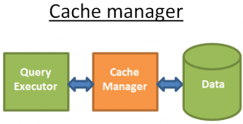

查询执行器问缓存管理器索要数据，而不是直接从文件系统中获取数据。缓存管理器有一个内存中的缓存，被称为缓存池。从内存中取数据提升了数据库的性能。对此很难给出一个数量级，因为这取决于你需要做什么操作：

* 顺序访问（例如全扫描） vs 随机访问（例如通过RowId访问）
* 读操作 vs 写操作

也取决于你的数据库使用的是什么类型的磁盘：

* 7.2k/10k/15k rpm HDD
* SSD
* RAID 1/5/…

但内存的访问速度是磁盘访问速度的100到10万倍

但这又导致了另一个问题（数据库总是这样）。缓存管理器需要在查询执行器使用数据之前把这些数据加载到内存，否则查询管理器不得不等待数据缓慢地从磁盘中读出来

### 预读(prefetching)

这个问题叫做预读。查询执行器知道它需要的数据，因为它了解整个查询流，而且通过统计也知道了磁盘上的数据。下面是其工作原理：

* 当查询执行器正在处理它的第一批数据
* 它告诉缓存管理器提前加载第二批数据
* 当查询执行器正在处理第二批数据
* 它告诉缓存管理器提前加载第三批数据，并且告诉缓存管理器第一批可以从缓存里清掉了
* ……

缓存管理器在缓冲池中保存所有这些数据。为了知道数据是否还会被用到，缓存管理器为缓存的数据添加一个额外的信息（叫闩锁(latch)）

有时候查询执行器不知道它需要什么数据，以及一些数据库没有提供这个功能。相反，它们使用一种推测预读法（比如，如果查询执行器要了数据1、3、5，那么接下来它很有可能要7、9、11），或者顺序预读法（这时候，缓存管理器只是读取一批数据后简单地从磁盘加载下一批连续数据）

为了监控预读的工作情况，现代数据库提供了一种衡量的方法，被称为缓冲/缓存命中率，用来表示请求的数据在缓存中找到而不是从磁盘读取的频率

>注：糟糕的缓存命中率并不总是意味着缓存工作状况不佳。更多的信息可以阅读[Oracle文档](http://docs.oracle.com/database/121/TGDBA/tune_buffer_cache.htm)

但缓存只是有限的内存空间。因此它需要先移出一些数据以保证能够加载新的数据。加载和清楚缓存需要一些磁盘和网络IO的成本。如果你有一个经常执行的查询，那么每次都把查询结果加载然后清除，效率就太低了。为了解决这个问题，现代数据库使用缓冲区置换策略来解决这个问题

大多数现代数据库（至少SQL Server、MySQL、Oracle、DB2）使用LRU算法

>译者注：这个名字是不是很熟悉，在学习操作系统的时候不就学过吗

### LRU

LRU是Least Recently Used的缩写（最近最少使用）这个算法背后的思想是在缓存里保留的数据是最近使用的，所以更有可能再次使用

这是一个可视化的例子


为了更好的理解，我假设缓冲区里的数据没有被闩锁锁住（就是说是可以被移除的），在这个简单的例子中，缓冲区可以保存三个元素

* 缓存管理器使用数据1，然后把它加载到空的缓存中
* 缓存管理器使用数据4，然后把它放入半载（半载指有数据但还有剩余空间）的缓存中
* 缓存管理器使用数据3，然后把它放入半载的缓存中
* 缓存管理器使用数据9，因为缓存满了，而且1是最后一个最近被使用的数据，所以1被移除，数据9加载到内存
* 缓存管理器使用数据4，因为缓存中已经有4了，所以它再次成为第一个最近使用的
* 缓存管理器使用数据1，因为缓存满了，而且9是最后一个最近被使用的数据，所以9被移除，数据1加载到内存
* ……

这个算法的运行效果不错，但还是存在一些限制。如果有一个对大表的全扫描怎么办？换句话说，当表或索引的大小超过缓冲区的大小怎么办？使用这个算法会清除之前缓存内所有的数据，而且全扫描的数据很可能只使用一次

### 改进措施

为了防止这种情况的发生，一些数据库添加了特殊的规则。例如在[Oracle的文档](http://docs.oracle.com/database/121/CNCPT/memory.htm#i10221)中有介绍

>对于非常大的表，数据库通常使用直接路径来读，即直接加载区块来避免填满缓冲区。对于中等大小的表，数据库可能会用到直接读取或缓存读取，如果使用缓存读取方式，数据库把区块置于LRU的尾部，防止清空当前缓冲区

还有其他的方法，比如使用改进版本的LRU（称为LRU-K）。例如，SQL Server使用 LRU-2

这个算法的原理是把更多的历史记录考虑进来，简单LRU（也就是 LRU-1），只考虑最后一次使用的数据。LRU-K呢？

* 考虑数据最后K次使用的情况
* 数据使用的次数加进了权重
* 一批新数据加载进入缓存，旧的但经常使用的数据不会被清除（因为权重更高）
* 但这个算法不会保留缓存中不再使用的数据
* 所以数据如果不再使用，权重值会随着时间推移而降低

计算权重也是需要时间成本的，这就是为什么SQL Server只使用K=2，这个值性能不错而且额外开销可以接受

关于LRU-K更深入的知识，可以阅读早期的研究论文（1993）：[数据库磁盘缓冲的LRU-K页面置换算法](http://www.cs.cmu.edu/~christos/courses/721-resources/p297-o_neil.pdf)

### 其他算法

当然还有其他管理缓存的算法，比如：

* 2Q（类LRU-K算法）
* CLOCK（类LRU-K算法）
* MRU（最新使用的算法，用LRU同样的逻辑但不同的规则）
* LRFU（Least Recently and Frequently Used，最近最少使用最近最不常用）
* ……

### 写缓冲区

我只讨论了读缓冲——在使用之前预先加载数据。但是在数据库中你还需要写缓冲区，它被用来保存数据、成批刷入磁盘而不是逐条写入数据从而造成很多单词磁盘访问

要记住，缓冲区保存的是页（最小的数据单位）而不是行（逻辑上人类习惯的观察数据的方式）缓冲池内的页如果被修改了，但还没有写入磁盘，就是脏页。有很多算法来决定写入脏页的最佳时机，这个问题与事务的概念高度关联，下面我们就谈谈事务

# 事务管理器

最后但也是最重要的！这部分讨论的是事务管理器。我们会看到这个进程保证每个查询在它自己的事务中被执行，但在这之前我们需要先理解一下事务中ACID的概念

### ACID

一个ACID事务需要保证这4个方面：

* 原子性(Atomicity)：事务“要么全部完成，要么全部取消”，就算是它耗时10小时！如果事务崩溃，那么状态回滚到事务执行之前
* 隔离性(Isolation)：如果2个事务A和B同时执行，事务A和B的最终结果是相同的，不管A是结束于B之前/之后/运行期间
* 持久性(Durability)：一旦事务提交成功，无论发生什么，数据都要保存在数据库中
* 一致性(Consistency)：只有合法的数据（依照关系约束和函数约束）才能写入数据库，一致性与原子性和隔离性有关


在同一个事务中，你可以运行多个SQL查询来读取、创建、更新和删除数据。当两个事务使用相同的数据，麻烦就来了。经典的例子就是从账户A到账户B的汇款，假设有两个事务：

* 事务1（T1）从账户A取出100元，然后转到账户B中
* 事务2（T2）从账户A中取出50元，然后转到账户B中

如果我们会看ACID属性：

* 原子性保证不管T1期间发生了什么（服务器崩溃、网络中断……），不能出现从A账户取出100元旦没有写到账户B的情况（这就是数据不一致状态）
* 隔离性确保如果T1和T2同时发生，最终A将减少150元，B将得到150元，而不是其他结果，比如因为 T2 部分抹除了 T1 的行为，A减少150美元而B只得到50美元（这也是不一致状态）
* 持久性确保如果T1刚刚提交，数据库就发生崩溃，T1不会消失的无影无踪
* 一致性确保钱不会在系统内无端地生成或丢失

很多现代数据库不使用纯粹的隔离性作为默认的行为，因为这会带来严重的性能消耗。SQK通常定义了4个级别的隔离性

* 串行化(Serializable，SQLite中默认的行为)：隔离性的最高级别。两个同时发生的事务是100%隔离的，每个事务在自己的“世界”中运行
* 可重复读(Repeatable read，MySQL中默认的行为)：每个事务在它自己的“世界”运行，除了这样的情况：如果事务事务成功执行完成并且添加了新的数据，这些数据对其他正在执行的事务是可见的。但如果事务A修改了数据并且成功运行，这个修改对其他正在运行的事务是不可兼得。因此事务只有在新增了数据的情况下突破了隔离，对已经存在的数据仍旧隔离。举个例子，如果事务A运行"SELECT count(1) from TABLE\_X"，然后事务B在TABLE\_X加入一条新数据并提交，当事务A再运行一次 count(1)结果不会是一样的。这叫幻读(phantom read)
* 读取已提交(Read commited，Oracle、PostgreSQL、SQL Server默认的行为)：可重复读+新的隔离突破。如果事务A读取了数据D，然后数据D被事务B修改/删除并提交，事务A再次读取数据D时数据的变化(修改/删除)是可见的。这叫做不可重复读(non-repeatable read)
* 读取未提交(Read uncommited)：最低级别的隔离，是读取已提交+新的隔离突破。如果事务A读取了数据D，然后数据D被事务B修改（但并未提交，事务B仍在运行中），事务A再次读取数据D时，数据修改是可见的。如果事务B回滚，那么事务A第二次读取的数据D是无意义的，因为那是事务B所做的从未发生的修改（已经回滚了嘛）。这叫脏读(dirty read)

多数数据库添加了自定义的隔离级别（比如PostgreSQL、Oracle、SQL Server的快照隔离），而且并没有实现SQL规范里的所有级别（尤其是读取未提交级别）

默认的隔离级别可以由用户/开发者在建立连接时覆盖（只需要增加很简单的一行代码）

### 并发控制

确保隔离性、一致性和原子性的真正问题是对相同数据的写操作（增、更、删）：

* 如果所有的事务都是读数据，那么它们可以同时工作而不用更改其他事务的行为
* 如果（至少）有一个事务在修改其他事务读取的数据，数据库需要找个方法对其他事务隐藏这个修改。而且它还需要确保这个修改操作不会被另一个看不到这些数据修改的事务擦除

这个问题叫做并发控制

解决这个问题的最简单的方法是一个个的运行所有事务！但这样就完全没有伸缩性，因为在多核的服务器上只能利用一个核的运算能力，效率很低……

理想的方法是，每次一个事务创建或取消时：

* 监控所有事务的所有操作
* 检查是否2(更多)事务的部分操作因为读取/修改相同的数据而存在冲突
* 重新编排冲突事务中的操作以减少冲突的部分
* 按照一定的顺序执行冲突的部分（同时非冲突事务仍在并发运行）
* 考虑事务可能会被取消

更规范的说法是这是对冲突的调度问题。更具体点说，这是一个很难并且CPU占用很高的问题。企业级的数据库不能等几个小时去找出最好的调度，因此就使用不那么理想的方式以避免更多的时间浪费在解决冲突上

为了解决这个问题，多数数据库使用锁或数据版本控制。这又是一个很大的话题，接下来会集中讨论锁，和一点点的数据版本控制

### 悲观锁

锁背后的思想是：

* 如果一个事务需要数据
* 它会把这个数据锁上
* 如果另一个事务也需要这个数据
* 它会一直等着，直到上一个事务对这个数据加的锁释放掉

这种锁叫做排它锁

但为一个只读数据的事务加排它锁是很昂贵的，因为它会强制其他同样只做读操作的事务也要等待，这导致了另一种锁的诞生——共享锁

通过共享锁：

* 如果一个事务只会去读数据A
* 它使用共享锁锁住该数据，然后去读数据
* 如果第二个事务也只会去读数据A
* 它也会对这个数据加共享锁，然后去读它
* 如果第三个事务需要去修改数据A
* 那么这个事务会使用排它锁锁住这个数据，但它需要等另外两个事务都释放它们在数据A上加的共享锁之后才能对A加排它锁

同样的，如果一块数据加上排它锁，一个只需要读取该数据的事务必须等待排他锁释放才能对该数据加共享锁

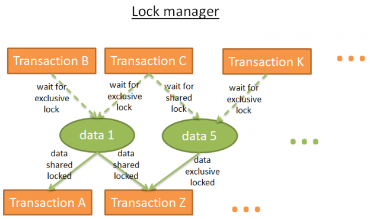

锁管理器是添加和释放锁的进程。内部它使用哈希表存储锁（键值是锁作用的数据），并且了解每一块数据是：

* 被哪个事务加的锁
* 哪个事务在等待数据解锁

### 死锁

但使用锁可能会导致这样的一种情况：两个事务互相等待对方的数据

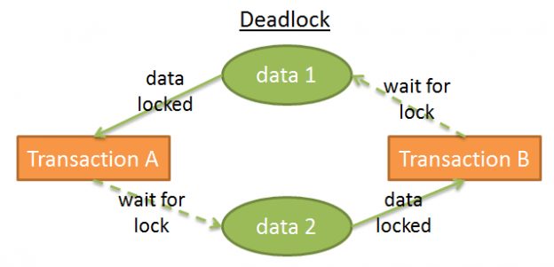

上图中：

* 事务A对数据1加排它锁，然后它等待数据2
* 事务B对数据2加排它锁，然后它等待数据1

这种情况就被成为死锁！

在死锁发生时，锁管理器会选择取消其中一个事务并回滚，以释放死锁。但选择取消哪个事务不是那么简单：

* 杀死数据修改量最少的事务（这样会减少事务回滚的成本）？
* 杀死持续时间最短的事务，因为其他事务用户等待的时间更长？
* 杀死能用更少时间结束的事务（避免可能的资源饥荒）？
* 一旦发生回滚，有多少事务会收到回滚的影响？

在作出选择之前，锁管理器需要检查是否有死锁存在

哈希表可以看作是个图表（见上文图）。如果出现循环就说明有死锁。既然检查循环十分的耗时（因为包含所有锁的图将会非常大），那么一个常用的简单方法是检查超时设置，如果一个锁在超时时间内没有加上，那事务就进入死锁状态

锁管理器也可以在加锁之前检查给定的锁会不会导致死锁。但想要完美的做到这一点是很昂贵的，因此这些预检查经常设置一些基本规则

### 两段锁

实现纯粹的隔离最简单的方法是：事务开始时获取锁，结束时释放锁。这就意味着一个事务需要在它开始之前等待它需要的所有锁，而且这些锁一直被持有，直到事务执行结束后被释放。这样可以工作，但在等待所有锁的过程中可能会耗太长时间！

更快的方法是使用两段锁协议(Two-Phase Locking Protocol，由 DB2 和 SQL Server使用)，事务被分成两个阶段：

* 成长阶段(growing phase)：事务可以拥有锁，但不释放任何锁
* 收缩阶段(shrinking phase)：事务可以释放所（对应的数据已经被处理过并且不再继续处理了），但是不能拥有新的锁

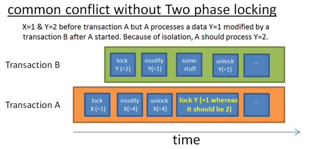

这2个简单规则背后的思想是：

* 释放不再使用的锁来降低其他事务的等待时间
* 防止发生这类事情：事务最初获得的数据，在事务开始后被修改，当事务重新读取该数据时发生不一致

这个协议可以很好的规则，但有个例外：如果修改了一条数据、释放了关联的锁之后，事务被取消（回滚），而另一个事务读到了修改后的值，但最后这个值却被回滚。为了避免这个问题，所有独占锁必须在事务结束时释放

### 多说几句

当然了，真实的数据库使用更复杂的系统，涉及到更多类型的锁（比如意向锁 intention locks），和更多粒度（行级锁、页级锁、分区锁、表锁、表空间锁），但道理是相同的

我只探讨纯粹基于锁的方法，数据库版本控制是解决这个问题的另一个办法

版本控制背后的思想是这样的：

* 所有的事务能够同时修改相同的数据
* 每个事务拥有它自己的数据拷贝（版本）
* 如果两个事务修改相同的数据，只有一个会被接受，另一个会被拒接而且关联的事务会被回滚或重新运行

这将提升性能，因为：

* 读事务不会阻塞写事务
* 些食物不会阻塞读事务
* 没有臃肿的锁管理器来浪费开销

版本控制在很多方面都比锁机制好，但除了这个例外：两个事务写同一份数据。不过你很快会发现磁盘空间消耗很大

数据版本和锁机制是两个不同的视角：乐观锁和悲观锁。两者各有利弊，完全取决于使用场景（读多还是写多）。关于数据库版本控制，我推荐[这篇很好的文章](http://momjian.us/main/writings/pgsql/mvcc.pdf)，讲的是PostgreSQL如何实现多版本并发控制的

一些数据库，比如DB2(直到版本9.7)和SQL Server(不含快照隔离)仅使用锁机制。其他的像PostgreSQL、MySQL和Oracle使用锁和版本控制混合机制。我不知道是否有仅用版本控制的数据库（如果你知道请告诉我）

>[2015-08-20更新]一名读者告诉我：

>Firebird 和 Interbase 用不带锁的版本控制

>版本控制对索引的影响挺有趣的：有时唯一索引会出现重复，索引的条目会多于表行数，等等

如果你度过不同级别的隔离那部分内容，你会知道提高隔离级别就会增加锁的数量和事务等待加锁的时间。这就是为什么多数数据库默认不使用最高级别的隔离9即串行化）

当然你总是可以去主流数据库（[MySQL](http://dev.mysql.com/doc/refman/5.7/en/innodb-transaction-model.html)、[PostgreSQL](http://www.postgresql.org/docs/9.4/static/mvcc.html)或[Oracle](http://docs.oracle.com/cd/B28359_01/server.111/b28318/consist.htm#i5337)）的文档里查一下

# 日志管理器

>日志管理器也是数据管理器的一个组成部分，但这里单独拎出来讲解

我们已经看到为了提升性能，数据库将数据存储在内存缓冲中。但假如当事务提交后，数据库崩溃了，你将丢失在崩溃期间还在内存中的数据，这就破坏了事务的持久性

你可以把所有数据都写到磁盘上，但如果服务器崩溃，最终数据可能只有部分写到磁盘上，这就破坏了事务的原子性

所有事务进行的写修改必须完成或者回滚

有两种方法去解决这个问题：

* 影子副本/页(Shadow copies/pages)：每个事务创建它自己对数据库的拷贝（或者只是数据库的一部分），然后在拷贝上进行工作。一旦出错，拷贝就被删除。一旦成功，数据库立即使用文件系统的一个技巧，把副本替换到数据中，然后删掉旧数据
* 事务日志(Transaction log)：事务日志是一个存储空间。在每次写磁盘之前，数据库在事务日志中写入一些信息，这样当事务崩溃或回滚，数据库知道如何移除或完成尚未完成的事务

### WAL(预写式日志)

影子副本/页在运行较多事务的大型数据库时会产生大量的磁盘开销，所以现代数据库使用事务日志。事务日志必须存储在稳定的存储上。我不会深究存储技术，但至少RAID磁盘是必须的，以防磁盘故障

大多数数据库（至少是Oracle、[SQL Server](https://technet.microsoft.com/en-us/library/ms186259(v=sql.105).aspx)、[DB2](http://www.ibm.com/developerworks/data/library/techarticle/0301kline/0301kline.html)、[PostgreSQL](http://www.postgresql.org/docs/9.4/static/wal.html)、MySQL和[SQLite](https://www.sqlite.org/wal.html)）使用预写式日志(Write-Ahead-Logging protocol)的方式处理事务日志。WAL协议设置三个规则：

* 每个写数据库操作产生一个日志记录，而且日志记录在数据写入磁盘之前写入事务日志
* 日志记录必须按顺序写入；记录A发生在记录B之前，则A必须写在B之前
* 当一个事务提交时，在事务成功之前，提交顺序必须写入事务日志

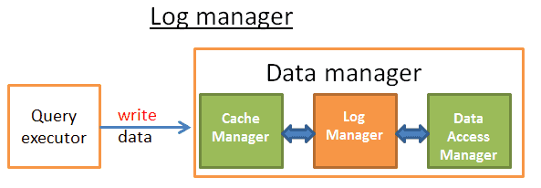

这个工作由日志管理器完成。简单的理解就是，日志管理器处于缓存管理器和数据访问管理器(data access manager，负责把数据写入磁盘)之间，每个update/delete/create/commit/rollback操作在写入磁盘之前先写入事务日志。简单，对吧？

回答错误！我们研究了这么多内容，现在你应该知道与数据库相关的每一件事都带着【数据库效应】的诅咒。正经一点，问题在于找到方法保证在写日志的同时还保持高性能。如果写事务日志很慢，那么它将会导致所有事情都变慢

### ARIES

在1992年，IBM的研究人员“发明”出WAL的进阶版本ARIES。ARIES或多或少地在现代数据库中被应用。使用逻辑也许不同但ARIES背后的概念应用很广。我在发明上加了引号是因为根据[MIT的课程](http://db.csail.mit.edu/6.830/lectures/lec15-notes.pdf)，IBM的研究人员**仅仅是写了事务恢复的最佳实践方案**。AIRES论文发表的时候我才5岁，我不关心那些酸溜溜的科研人员的闲言碎语。事实上我提到这个典故是为了继续下面的内容之前给你个小的放松。我读了[ARIES研究论文](http://www.cs.berkeley.edu/~brewer/cs262/Aries.pdf)的大部分内容，我发现它很有趣！在这部分我只会对ARIES进行概况式的介绍，如果你想真正了解，我强烈建议你去阅读这篇论文

ARIES是Algorithms for Recovery and Isolation Exploiting Semantics(数据库恢复原型算法)的缩写。这个技术要达到一个双重目标：

* 在写日志的时候保持高性能
* 快速且可靠的数据恢复

有很多理由导致数据库必须回滚事务：

* 因为用户取消了
* 因为服务器或网络故障
* 因为事务破坏了数据库的完整性（比如一个列有唯一性约束而事务添加了重复值）
* 因为死锁

有时候（比不如网络故障），数据库可以恢复事务。这怎么可能呢？为了回答这个问题，我们需要理解存储在日志记录中的信息

### 日志

事务中的每个操作（add/remove/modify）都会产生日志，日志由以下内容组成：

* LSN(A unique Log Sequence Number)：LSN是按时间顺序分配的，这意味着如果操作A先于操作B，log A的LSN要比log B的LSN小
* TransID：产生操作的事务的ID
* PageID：被修改数据在磁盘上的位置。数据在磁盘上最小的存储单位是页，所以数据的位置就是包含这个数据的页的位置
* PrevLSN：同一个事务产生的上一条日志记录的链接
* UNDO：取消本次操作的方法。例如，如果操作是update，UNDO会存储元素被update之前的内容（物理UNDO），或者回到原来状态的反向操作（逻辑UNDO）
* REDO：重复本次操作的方法。同样的，有2种方法：或者保存操作后的元素值/状态，或者保存操作本身以便重复
* ARIES日志还有两个字段：UndoNxtLSN和Type

而且，磁盘（存储数据而非日志）上的每个页都记录着最后一个修改该数据操作的LSN

LSN的分配更加复杂，因为它关系到日志存储的方式，但道理是相同的

ARIES只使用逻辑UNDO，因为物理UNDO太过混乱了

>注：根据我的了解，只有PostgreSQL没有使用UNDO，而是使用一个垃圾回收服务来删除旧版本的数据。这个跟PostgreSQL对数据版本控制的实现有关

为了更好的说明这一点，下面是一个可视化的简单例子，展示由"UPDATE FROM PERSON SET AGE = 18;"产生的日志记录。我们假设这个查询由事务18执行

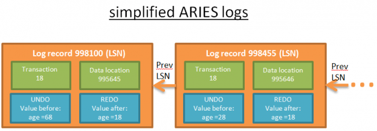

每条日志都有一个唯一的LSN，链接在一起的日志属于同一个事务。日志按照时间顺序链接（链接列表的最后一条日志是最后一个操作产生的）

### 日志缓冲区

为了防止写日志变成主要的性能瓶颈，在数据库中使用了日志缓冲区

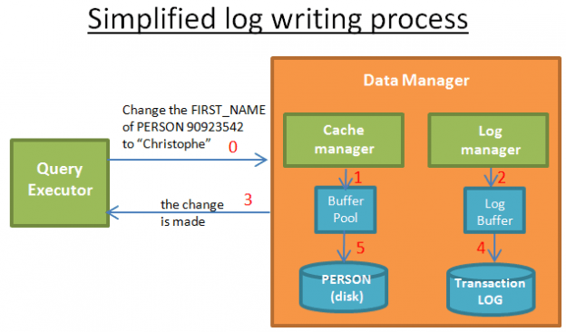

当查询执行器请求一个修改操作

* 1) 缓存管理器在缓冲区中存储这个修改
* 2) 日志管理器在它的缓冲区中存储相关的日志
* 3) 到这一步，查询执行器认为操作完成了（因为可以请求做另一次修改）
* 4) 接着不久之后，日志管理器把日志写到事务日志中，什么时候写日志由算法决定
* 5) 接着不久之后，缓存管理器把修改写到磁盘上，什么时候把数据落地到磁盘由算法决定

当事务提交之后，就意味着事务每个操作的1、2、3、4、5步骤都做完了。写事务日志是很快的，因为它只是在事务日志某处增加一条日志；而数据写盘就更加复杂了，因为要用能够快速读取的方式写入数据

### STEAL和FORCE策略

>紧接着上一小节

出于性能的考虑，第5步可能在事务提交之后完成，因为一旦发生崩溃，还有可能使用REDO日志恢复事务。这叫做NO-FORCE策略

数据库可以选择FORCE策略（比如第5步在提交之前必须完成）来降低恢复时的负载

另一个问题是，要选择数据是一步步的写入（STEAL策略），还是缓冲管理器需要等待提交命令来之后一次性全部写入（NO-STEAL策略）。选择STEAL还是NO-STEAL取决于你想要什么：快速写入但是从 UNDO 日志恢复缓慢，还是快速恢复

总结一下这些策略对恢复的影响：

* STEAL/NO-FORCE需要UNDO和REDO：高性能但是在日志和恢复过程会更复杂（比如AREIS）。这是大多数数据库会选择的方案（注：这是我从多个学术论文和教程里看到的，但并没有看到官方文档里显式说明这一点）
* STEAL/FORCE只需要UNDO
* NO-STEAL/NO-FORCE只需要REDO
* NO-STEAL/FORCE什么也不需要，但性能最差，而且需要巨大的内存

### 关于数据恢复

很好，有了很好的日志了，现在让我们把日志用起来

假如一个实习生把数据库搞崩溃了（首要规矩：永远是实习生的错），你重启了数据库，数据恢复过程就开始了！

ARIES从崩溃中恢复需要经历三个阶段：

**1) 分析阶段**：恢复进程会读所有的事务日志来重建崩溃过程中所发生事件的时间线。它决定哪些事务需要回滚（所有未提交的事务都要回滚），以及崩溃时哪些数据需要写盘

**2) Redo阶段**：在这个阶段，从分析中选中的一条日志记录开始，使用REDO来将数据库恢复到崩溃之前的状态

在Redo阶段，REDO日志按照时间顺序处理（使用LSN）

对于每个日志，恢复进程读取磁盘上包含数据的页(page\_on\_disk)的LSN去进行修改

如果LSN(page\_on\_disk) >= LSN(log\_record)，说明数据在数据库崩溃之前已经写到磁盘上了（但值已经被日志之后、崩溃之前的某个操作覆盖），所以不需要做什么

如果LSN(page\_on\_disk) < LSN(log\_record)，那么磁盘上的也将会被更新

即使将被回滚的事务，REDO也是要做的，因为这样简化了恢复过程（但是我相信现代数据库不会这么做的）

**3) UNDO阶段**：这个阶段回滚崩溃瞬间所有没有完成的事务。回滚从每个事务的最后一条日志开始，并且按照时间倒序处理UNDO日志（使用日志记录的PrevLSN）

恢复过程中，事务日志必须留意恢复过程的操作，以便写入磁盘的数据与事务日志相一致。一个解决办法是从事务日志中删除被取消的事务的日志记录，但这个太困难了。相反，ARIES在事务日志中记录补偿日志，来逻辑上删除被取消的事务的日志记录

当事务被手工取消，或者被锁管理器取消（比如解决死锁问题），或者仅仅是因为网络故障，那么分析阶段就不是必要的。事实上，需要REDO和UNDO的信息在两个内存表中：

* 事务表，存储当前所有事务的状态
* 脏页表，存储哪些数据需要写到磁盘

这些表在每个新的事务发生时，被内存管理器、事务管理器更新。因为它们是内存表，所以当数据库崩溃的时候其中的数据也就没有了

分析阶段的工作是在数据库崩溃之后使用事务日志的信息恢复这两张表。为了提升分析阶段的性能，ARIES提出了一个概念叫做检查点(checkpoint)。背后的思路是不时地把事务表和脏页表的内容，还有此时最后一条LSN写入磁盘。那么分析阶段只需要分析这个LSN之后的日志即可！

# 总结

在开始写这篇文章之前，我就知道这个主题太大，而且我知道需要花很多时间写出深入探讨数据库的文章。最后还是证明我过于乐观了，事实上我花了预期两倍的时间完成本文。不过这个过程中我学到了很多！

如果你想对数据库系统有一个很好的把握，我建议你阅读[数据库系统架构](http://db.cs.berkeley.edu/papers/fntdb07-architecture.pdf)，这篇110页的论文很好的介绍了数据库，而且就算是针对没有计算机科学背景的人，它的可读性也很高。这篇论文在我制定本文的书写计划时起了很大的作用，而且它不像我一样着重探讨算法与数据结构，而更多关注的是架构层面的概念

如果你认真的阅读本文，现在你应该认识到数据库的强大之处。既然这是一篇很长的文章，现在再来让我们回顾一下本文的内容：

* B+树索引的概览
* 数据库架构的概览
* 基于成本的优化概述，特别专注了连接运算
* 缓冲池管理概述
* 事务管理概述

但是，数据库包含了更多的聪明技巧。例如我没有谈到下面这些棘手的问题：

* 如何管理数据库集群和全局事务
* 如何在数据库运行的时候产生快照
* 如何高效地存储（和压缩）数据
* 如何管理内存

所以当你在问题多多的NoSQL数据库和坚如磐石的关系型数据库之间选择的时候，一定要三思而后行。不要错误的理解我的意思，一些NoSQL数据库是很棒的，但它们仍然很年轻，只是解决了少量应用关注的一些特定问题

总结一下！如果有人问你数据库是怎么工作的，你应该能够回答他，而不再是逃避问题


或者，你可以推荐他阅读本文！

### 参考资料

* [《How does a relational database work》](http://coding-geek.com/how-databases-work/)
* [《数据库的原理，一篇文章搞定（一）》](https://blog.csdn.net/zhangcanyan/article/details/51439012)
* [《数据库的原理，一篇文章搞定（二）》](https://blog.csdn.net/zhangcanyan/article/details/51439021)
* [《数据库的原理，一篇文章搞定（三）》](https://blog.csdn.net/zhangcanyan/article/details/51439034)
