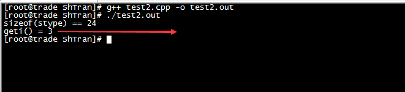

以下涉及到的测试环境是


代码编译为64位程序运行测试！

## 从一个错误开始

C++中写这样的代码，可以编译，但是运行的时候报错

```c++
#include <string>
#include <stdio.h>
#include <stdlib.h>

using namespace std;

struct TYPE
{
    int i1;
    int i2;
    string s1;
};
typedef struct TYPE stype;


int main()
{
    printf("sizeof(stype) == %d\n", sizeof(stype));
    stype * st = (stype *)malloc(sizeof(stype));

    st->i1 = 1;
    st->i2 = 2;
    st->s1 = "s1";

    free(st);

    return 0;
}
```


都是因为自己的Delphi思维，因为Delphi里面，类似的写法是没有问题的

```pascal
unit Unit1;

interface

uses
  Windows, Messages, SysUtils, Variants, Classes, Graphics, Controls, Forms,
  Dialogs, StdCtrls;

type
  TForm1 = class(TForm)
    Button1: TButton;
    procedure Button1Click(Sender: TObject);
  private
    { Private declarations }
  public
    { Public declarations }
  end;


  stype = record
    i1: Integer;
    i2: Integer;
    s1: string;
  end;

var
  Form1: TForm1;

implementation

{$R *.dfm}

procedure TForm1.Button1Click(Sender: TObject);
var
  st: ^stype;
begin
  New(st);
  st.i1 := 1;
  st.i2 := 2;
  st.s1 := 's1';
  Dispose(st);

  ShowMessage(IntToStr(SizeOf(stype)));
end;

end.
```


但是将上面的C++代码修改成这样就OK了

```c++
#include <string>
#include <stdio.h>
#include <stdlib.h>

using namespace std;

struct TYPE
{
    int i1;
    int i2;
    string s1;
};
typedef struct TYPE stype;


int main()
{
    printf("sizeof(stype) == %d\n", sizeof(stype));
    stype * st = new stype();

    st->i1 = 1;
    st->i2 = 2;
    st->s1 = "s1";

    delete st;

    return 0;
}
```


为什么呢？从代码层面看，两个代码的差别很简单，就是第一个使用malloc申请内存，第二个使用new申请内存，所以接下来就要去深究一下new和malloc的区别了！

## 合理猜测

看到上面C++代码中定义了struct TYPE中是有string类型的，string是一个类，所以是不是因为malloc没有调用结构体内部成员变量的构造方法导致的？

先去看看如果只有int这种基础数据类型会怎么样

```c++
#include <string>
#include <stdio.h>
#include <stdlib.h>

using namespace std;

struct TYPE
{
    int i1;
    int i2;
};
typedef struct TYPE stype;


int main()
{
    printf("sizeof(stype) == %d\n", sizeof(stype));
    stype * st = (stype *)malloc(sizeof(stype));

    st->i1 = 1;
    st->i2 = 2;

    free(st);

    return 0;
}
```

编译运行效果如下


如果struct TYPE里面有某个类的成员变量，然后使用malloc()/free()呢？

```c++
#include <string>
#include <stdio.h>
#include <stdlib.h>

using namespace std;

class TEST
{
public:
    int i;

    TEST()
    {
        printf("TEST::TEST()\n");
    }
 
    virtual ~TEST()
    {
        printf("TEST::~TEST()\n");
    }

    int geti()
    {
        return this->i;
    }
};

struct TYPE
{
    int i1;
    int i2;
    TEST t;
};
typedef struct TYPE stype;


int main()
{
    printf("sizeof(stype) == %d\n", sizeof(stype));
    stype * st = (stype *)malloc(sizeof(stype));

    st->i1 = 1;
    st->i2 = 2;
    st->t.i = 3;

    printf("geti() = %d\n", st->t.geti());

    free(st);

    return 0;
}
```

编译运行效果如下，很显然TEST类的对象t的构造方法和析构方法没有被调用



继续测试！如果struct TYPE里面有某个类的成员变量，然后使用new/dedlete呢？

```c++
#include <string>
#include <stdio.h>
#include <stdlib.h>

using namespace std;

class TEST
{
public:
    int i;

    TEST()
    {
        printf("TEST::TEST()\n");
    }
 
    virtual ~TEST()
    {
        printf("TEST::~TEST()\n");
    }

    int geti()
    {
        return this->i;
    }
};

struct TYPE
{
    int i1;
    int i2;
    TEST t;
};
typedef struct TYPE stype;


int main()
{
    printf("sizeof(stype) == %d\n", sizeof(stype));
    stype * st = new stype();

    st->i1 = 1;
    st->i2 = 2;
    st->t.i = 3;

    printf("geti() = %d\n", st->t.geti());

    delete st;

    return 0;
}
```


上面的代码还有一个没有说到的问题，其实在C++中struct就是类，如果你对struct本身定义了构造方法和析构方法，那么如果你是使用malloc申请的内存，那显然其本身的构造方法和析构方法也不会被调用。同样的给出具体的代码示例

```c++
#include <string>
#include <stdio.h>
#include <stdlib.h>

using namespace std;

struct TYPE
{
    int i1;
    int i2;
    TYPE()
    {
        printf("TYPE::TYPE()\n");
    }
    ~TYPE()
    {
        printf("TYPE::~TYPE()\n");
    }
};
typedef struct TYPE stype;


int main()
{
    printf("malloc()\n");
    stype *st = (stype *)malloc(sizeof(stype));
    printf("free()\n");
    free(st);

    printf("\n\nnew\n");
    st = new stype();
    printf("delete\n");
    delete st;

    return 0;
}
```


## 简单总结

其他的像什么new是关键字，malloc是函数的这种区别没有必要扯太多。主要还是去关注那些真正本质的东西

new会先调用operator new函数，申请足够的内存（通常底层就是用malloc()实现的），然后调用类型的构造函数，初始化成员变量（如果成员变量是类变量，也去调用其构造函数），最后返回自定义类型指针

delete先调用析构函数，然后调用operator delete函数释放内存，通常底层是由free()实现

malloc()/free()是库函数，只能动态的申请和释放内存，无法强制要求做自定义类型对象的构造

参考以下这些文章

* [《经典面试题之new和malloc的区别》](https://blog.csdn.net/nie19940803/article/details/76358673)
* [《c/c++ new与malloc的区别及使用时注意的问题》](https://blog.csdn.net/qq_26816591/article/details/52214313)
