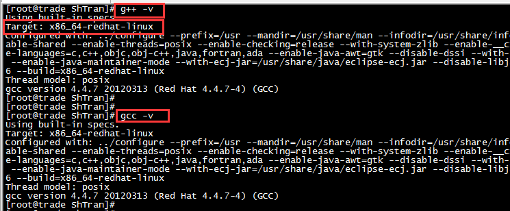
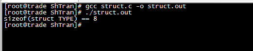
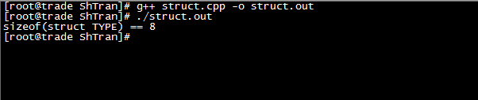
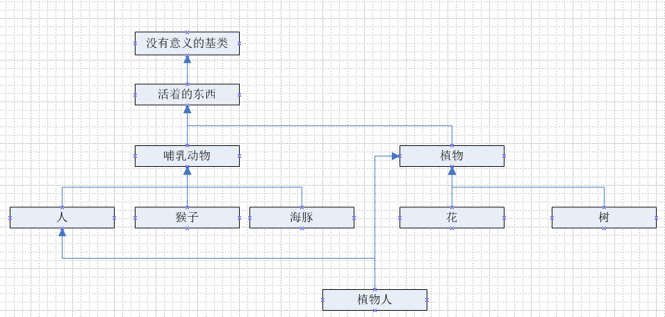

在[上一篇博客](http://www.xumenger.com/1-cpp-struct-malloc-new-20180416)中讲到了对C++的struct指针最好不要使用malloc()/free()而是使用new/delete来管理内存！通过几个小实验并给出了简单的分析。本文接着其内容继续多说一些

以下涉及到的测试环境是



代码编译为64位程序运行测试！

先给出下面这么一个代码，其中包含一个struct结构体，代码逻辑是输出该结构体的大小

```c
#include <stdio.h>

struct TYPE
{
    int i1;
    int i2;
};

int main()
{
    printf("sizeof(struct TYPE) == %d\n", sizeof(struct TYPE));
    return 0;
}
```

使用GCC编译器编译运行的效果如下（每个int类型是4字节，总共是8字节，内存模型和实际的输出一致



那使用G++编译器编译运行程序呢？如下图结果还是8，之前探讨[C++对象内存模型](http://www.xumenger.com/tags/#C++对象内存模型)的时候讲到C++的类是有虚函数指针的，而struct在C++中就是一种特殊的类，为什么这里看到struct的内存中只存储了i1(int 4Byte)、i2(int 4Byte)这两个成员变量，没有虚函数指针的空间呢？


既然是虚函数指针，是不是要有函数才行，那我变一下代码，在struct类中添加一个成员函数

```c++
#include <stdio.h>

struct TYPE
{
    int i1;
    int i2;

    int getid()
    {
        return 1;
    }
};

int main()
{
    printf("sizeof(struct TYPE) == %d\n", sizeof(struct TYPE));
    return 0;
}
```



运行发现，struct的大小还是8，那是不是普通的成员函数不会产生虚函数指针，必须是虚函数才行，那么我再改一下代码：

```c++
#include <stdio.h>

struct TYPE
{
    int i1;
    int i2;

    virtual int getid()
    {
        return 1;
    }
};

int main()
{
    printf("sizeof(struct TYPE) == %d\n", sizeof(struct TYPE));
    return 0;
}
```

果然！现在struct这个类的大小是16，除了i1、i2，还有8Byte的空间用来存储虚函数指针


对于以上所有的c++程序，在当前的测试环境下，将struct替换为class的运行效果是一样的！那class和struct到底是什么区别呢？详细的可以去读读[《C++ 下啥时候用struct, 啥时候用class》](https://www.cnblogs.com/BearOcean/p/4298187.html)

>以下是转抄这篇文章中的一部分内容，值得开发者思考一下！

教课书上，为了教会人使用C++, 通常会这么举例，好，你现在定义一个“人”，那么他的继承树应该是这样的



有莫有，有莫有这样的

人还有类似说话，吃饭，骗其他人感情和身体这些方法

猴子就要简单些，只会叫唤，但是由于他们都继承自哺乳动物，所以他们都有继承自哺乳动物的方法喂奶。至于植物系的，当然就没有那么高级了，但是它和哺乳动物一样，又从LivingThing 那里继承了一些东西，比如生长和死亡。当然我承认那个植物人是开玩笑的

还有一些是拿交通工具举例的。。。看起来多么优雅，代码重用性超高

对于这种为了面向对象而面向对象的思维方式，我只想说看到这样的代码，可以直接拖出去毙了。原因是，稍微复杂点的项目，没人会这么干。因为继承树的深度在以指数的方式影响复杂度。有天你会发现，想实现一个SuperMan，根本无从下手，想改变一个基类方法，不知道他最终会影响哪些类

我同意muduo的作者那个谁的观点：

在你要对一个代码进行修改（可能是Fix bug，也可能是添加一个新的功能），首先要做的事情，绝对不是直接撸袖子开始干代码。首先是要想出要怎么改。为了要想出一个方案，你首先要了解当前的代码，把代码理解了，就如同内存装载数据一样。优雅的代码，你只需要了解很少的相关代码（这也是提倡解耦的原因）。所以如果是上图所示的代码。。我想问问你的脑存今年有没有升过级

我自己比较接受Service 和 Data分开的原则，模块化比面向对象更重要，另外在基础框架稳固的前提下。基于组件的设计原则也是极其爽的，特别是游戏开发。Unity3d的引擎就是基于组件的。啥都是组件！
