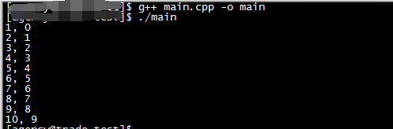
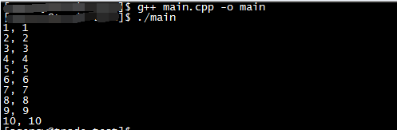
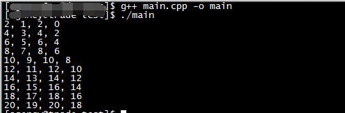

今天使用C/C++中的++遇到一个和预期不一样的问题，记录一下

测试代码是这样的

```c++
#include <stdio.h>

int main(){
  int index = 0;
  int i = 0;
  for(i=0; i<10; i++){
    printf("%d, %d\n", index, index++);
  }

  return 0;
}
```

代码看上去很简单，预期的输出是这样的

```
0, 0
1, 1
2, 2
3, 3
4, 4
5, 5
6, 6
7, 7
8, 8
9, 9
```

但实际的输出却是这样的：



惊不惊喜！意不意外！

这个在开发的时候一定要小心！

那我如果再改成下面这样呢？（index++修改为++index）

```c++
#include <stdio.h>

int main(){
  int index = 0;
  int i = 0;
  for(i=0; i<10; i++){
    printf("%d, %d\n", index, ++index);
  }

  return 0;
}
```

现在的输出是这样的：



再改成这样试一下呢

```c++
#include <stdio.h>

int main(){
  int index = 0;
  int i = 0;
  for(i=0; i<10; i++){
    printf("%d, %d, %d, %d\n", index, index++, index, index++);
  }

  return 0;
}
```

在运行之前，思考一下你预期会是什么样的输出？

好的，现在我们来看看实际的输出



所以C/C++中的++一定要慎用，至少上面这样的用法要避免！
