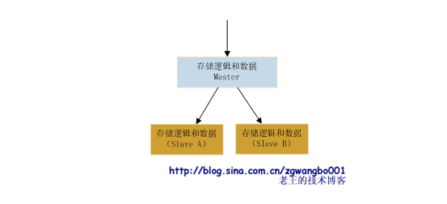
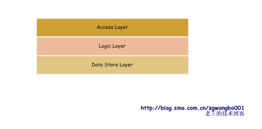
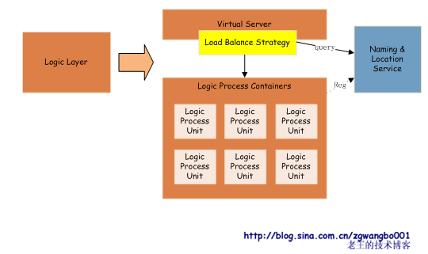

## 前言

>转载自[《蚂蚁变大象：浅谈常规网站是如何从小变大的》](http://blog.sina.com.cn/zgwangbo001)。从新的维度去思考一个系统是如何从无到有，从小到大演化的！

本文主要是从宏观视角的看法和总结，而其中涉及到的每个模块、环节的编码实现细节是另一个维度的问题，本文没有涉及到太多！但这些细节正是在具体实现的过程中必须要解决的，如此才能不至于让想法和设计飘在空中，而这些每个细节深究的话都有太多需要研究的点！

比如如何设计和实现一个高效的HTTP服务器、MySQL在数据量变大后如何优化性能、如何解析用户的输入检查是不是有攻击性内容、如何判断是否遭受到DDos攻击、拥有用户信息后如何分析用户行为等等有太多的细节，这是技术层面的，另外就是业务层面的，不同的系统处理不同的业务，这些都是有差异的，具体怎么编码、分层来进行解耦又需要深刻结合所对应的业务场景。这些个更为具体和细节的维度又需要开发者在大量的架构实践中慢慢经历和总结

接下来还是先从宏观维度看一下架构的设计与演化！

## 原作前言

2005年，我开始和朋友拉活儿做网站，当时第一个网站是在Linux上用JSP搭建的，到后来逐步地引入了多种框架，如webwork、hibernate等。再到后来，进入公司，开始用C/C++做分布式计算和存储（到那时才解开了我的一个疑问：C语言除了用来写HelloWorld，还能干嘛？！）

总而言之，网站根据不同的需求，不同的请求压力，不同的业务模型，需要不同的架构来给予支持。我从我的一些经历和感受出发，大体上总结了以下的一些阶段。详情容我慢慢道来

## 第一阶段：搭建属于自己的网站

我们最先开始的网站可能是长成这个样子的


我们用JSP、ASP、PHP等页面语言搭建最简单的业务逻辑，将数据存放在通用关系数据库中，如果有必要还搭建一个WebServer（如果偷懒的话，JSP直接使用Tomcat或resin当服务器，连Apache都省了）。所有的东西都放在一台服务器上（实际可能是买一个空间或托管服务器）。这里有一个经典的单词：**LAMP**

这个时候，我们的业务可能比较简单，往往是做一个XXX Managemet Information System，数据量也比较小，通常都是几千，最多也就几万条记录；压力也比较小，估计也就每天几千，最多几万次请求

这样做的好处是简单、入门快。所有的代码都写在Server Page中，看起来就像是HTML中增加了很多怪异的非HTML标签和代码。根据不同的逻辑和机器性能，单机性能从几十到几千QPS（一般能到100就不错了）

不过问题也很明显，就是页面集成了各种代码，既要负责处理器请求参数，又要处理各种逻辑，还要负责连接数据库，最后输出显示……可想而知，代码的可重用性和可维护性是不太好的。而且，还有一个问题，像JSP这样的语言，必须在请求时才能编译，生成class代码，调试上很难受

嗯，于是，我们考虑代码的可重用性和可维护性

## 第二阶段：增强代码可重用性和可维护性

我们引入了很多框架，来帮助我们解决重用性问题和可维护性问题


拿Java做例子，我们可能会引入struts、spring、hibernate等框架，用来做URL分流，C、V、M隔离，数据的ORM等。这样，我们的系统中，**数据访问层可以抽取出很多公用的类，业务逻辑层也可以抽取出很多公用的业务类，同一个业务逻辑可以对应多个展示页面，可复用性得到极大的增强**

不过，从性能上看，引入框架后，效率并不见得比第一种架构高，有可能还有降低。因为框架可能会大量引入“反射”的机制，来创建对应的业务对象；同时，也可能增加额外的框架逻辑，来增强隔离性。从而使得整体服务能力下降。幸好，在这个阶段，业务请求量不大，性能不是我们太care的事情

## 第三阶段：降低磁盘压力

可能随着业务的持续发展，或者是网站关注度逐步提升（也有可能是搜索引擎的爬虫关注度逐步提升。我之前有一个网站，每天有超过1/3的访问量就是各种爬虫贡献的），我们的请求量逐步变大，这个时候，往往出现瓶颈的就是磁盘性能。在Linux下，用vmstat、iostat等命令，可以看到磁盘的bi、bo、wait、util等值持续高位运行。怎么办？

其实，在我们刚刚踏进大学校门的时候，第一门计算机课程——《计算机导论》里面就给出了解决方案。依稀记得下面这个图


我们的存储体系中，磁盘一般是机械的（现在Flash、SSD等开始逐步大规模使用了），读取速度是最慢的，而内存访问速度较快（读取一个字节约10us，速度较磁盘能高几百倍），速度最快的是CPU的cache。不过价格和存储空间却递减

话题切换回来，当我们的磁盘出现性能瓶颈的时候，就要考虑其他的存储介质，那么我们使用CPU cache还是内存呢，或者是其他形态的磁盘？**综合性能比来看**，到这个阶段，我个人还是推荐使用内存。现在内存真是白菜价，而且容量持续增长（我现在就看到64G内存的机器[截止2012-4-3]）

但问题来了，磁盘是持久化存储的，断电后，数据不会丢失，而内存却是易失性存储介质，断电后内容会丢失。因此，内存只能用来保存临时性数据，持久性数据还是需要放到磁盘等持久化介质上。因此，内存可以有多种设计，其中最常见的就是Cache（其他的设计方案会在后面提及）。这种数据结构通常利用LRU算法（现在还有结合队列、集合等多种数据结构，以及排序等多种算法的Cache），用于记录一段时间的临时性数据，在必要的时候可以淘汰或定期删除，以保证数据的有效性。Cache通常以Key-Value形式来存储数据（也有Key-SubKey-Value，或者是Key-List，以及Key-Set等形式）。因为数据存放在内存，所以访问速度会提升上百倍，而且极大的降低磁盘IO压力

Cache有多种架构设计，最常见的就是穿透式和旁路式。穿透式通常是程序本身使用对应的Cache代码库，将Cache编译进程序，通过函数直接访问。旁路式则是以服务的方式提供查询和更新。在此阶段，我们通常使用旁路式Cache，这种Cache往往利用开源的服务程序直接搭建就可以使用（如MemCache）。旁路式结构如下


请求来临的时候，我们的程序先从Cache中取数据，如果数据存在并且有效，就直接返回结果；如果数据不存在，则从数据库里面获取，经过逻辑处理后，先写入到Cache，然后再返回给用户数据。这样，我们下次再访问的时候，就可以从Cache中获取数据

Cache引入以后，最重要的就是调整内存的大小，以保证有足够的的命中率。根据经验，好的内存设置，可以极大的提升命中率，从而提升服务的响应速度。如果原来IO有瓶颈的网站，经过引入内存Cache以后，性能提升10倍是没有问题的

不过，有一个问题就是：Cache依赖。如果Cache出问题（比如挂了，或者命中率下降）那就悲剧了。这时候，服务器就会直接将大的压力压向数据库，造成服务响应慢，或者是直接500

另外，服务如果重新启动时，也会出现慢启动，即：给Cache充数据的阶段。对于这种情况，可以采取回放日志，或是从数据库抽取最新数据等方式，在服务启动之前，提前将一部分数据放入到Cache中，保证有一定的命中率

## 第四阶段：第一次服务多机化

当IO性能得到解决以后，我们可能就会面临CPU瓶颈，即程序处理不过来了。那这个时候，最好的方式就是优化程序。从整体架构和具体业务逻辑上去分析并优化（可以借助一些性能分析工具，如gprof、xprof等）。**根据之前的经验，反射、正则表达式、字符串拼接、内存拷贝等都是吃CPU的大户**，所以优化上可以重点考虑。通过性能优化，一般可以将性能提升30-40个百分点

如果性能优化后，都还不能满足需求，那可以考虑更换更好的服务器。随着时间的推移，硬件发展极为迅速，且成本下降非常明显。可以考虑双核、4核等多核服务器。这样是提升服务性能最快的方式

如果这样都还不能满足需求，那么恭喜你，说明你的网站流量已经有一定规模了。接下来就是——多机

多机是小网站从技术架构上要迈出的第一步，也是一个质的飞跃（想当年，我还利用Java提供的库做了一个可多机的网站，不过一直没用上）。这个阶段，最简单的就是将WebServer、数据库和Cache这两个东西移动到另外的机器上去，利用WebServer、数据库和Cache的网络协议对其进行访问。这样就能将原来被他们占用的CPU给我们的逻辑程序使用


经过这样的拆分以后，我们就迈出了多机的第一步。虽然看起来比较简单和容易，但这也是非常具有里程碑意义的。这样的优化，可能会提升20-30%左右的一个CPU idle。能够使得我们的网站经受更大的压力

## 第五阶段：逻辑程序的多机化

当我们的访问量持续增加的时候，我们承受这成长的快乐和痛苦。流量刷刷往上涨，高兴！但是呢，服务器叫苦不迭，我们的程序已经快到不能服务的边缘了，怎么办？

>快使用分布式，哼哼哈嘿！

这个时候，我们就需要针对CPU瓶颈，将我们的程序分别放到多台服务器上，让它们同时提供服务器，将用户请求分摊到多个提供服务的机器

好，如果提供这样的服务，我们会遇到什么样的问题？怎么样来解决？我们逐个分析

**1) WebServer怎么来分流用户请求？**

在考虑这个问题的时候，我们常见的WebServer早已给我们想好了解决方案。现在主流的WebServer几乎都提供一个叫“Load Balance”的功能，翻译过来就是负载均衡。我们可以在WebServer配置一组机器列表，当请求来临的时候，WebServer会根据一定的规则选取某一台机器，将请求转发到对应的逻辑处理程序上

有同学马上就会问了！“一定的规则”是怎么样的规则？它能解决什么样的问题？如果机器宕机了怎么办？……

哈哈，这里的一定规则就是**Load Balance**。负载均衡其实是分布式计算和存储中最基础的算法，它的好坏，直接决定了服务的稳定性。我曾经设计和开发了一个负载均衡算法（现在正在大规模使用），有一次就因为一个很小的case，导致服务大面积出现问题

负载均衡要解决的就是，上游程序如何在我们提供的一堆机器列表中，找出合适的机器来提供下游的服务。因此我们将负载均衡分成两个方向来看：

* 第一，根据怎样的规则来选机器
* 第二，符合规则的机器中，哪些是能提供服务的

对于第一个问题，我们通常使用随机、轮询、一致Hash等算法；对于第二个问题，我们要使用心跳、服务响应判定等方法检测机器的健康状态。关于负载均衡，要谈的话点其实很多，我之前也写过专门的一篇文章来介绍，后续有空了，我再详细的描述

总之，分流的问题，我们可以通过负载均衡来比较轻松的解决

**2) 用户的Session如何同步**

虽然HTTP协议是一个无状态的服务协议，但用户的基本信息是要求能够保证的。比如：登录信息，原来在单机的时候，我们可以很简单的使用类似`setSession("user", "XXX")`的函数来解决。当使用多机的时候，该怎么来解决呢？

其实这个问题也是当年困扰我很久的一个问题。如果用setSession，用户在某一台机器上登录了，当下次请求来的时候，到其他机器了，就变成未登录了，显然不友好！

OK，让我们一个个的来看：

* 一台机器登录，其他机器不知道
* 用户请求可能到多台机器

对于第一个问题，如果我们在一台机器的登录信息让其他机器知道，不就OK了嘛，或者大家都在一台机器上登录，不就可以了吗。对于第二个问题，如果我们让同一个用户的请求，只落在同一台机器上，不就OK了嘛，因此我们可以提出三种解决方案：

* 提供Session同步机制
* 提供统一Session服务
* 将同一用户分流到同一台机器

嗯，这三种方案，你会选哪个呢？如果是我，我就算最后一个，因为我是一个懒虫，我会选最简单的一个，我信奉的一个原则就是：简单粗暴有效！哈哈。在WebServer层使用一致Hash算法，按session\_id进行分流（如果WebServer没有提供该服务，可以简单写一个扩展，或者干脆在WebServer后面做一个代理即可），但这个方案有一个致命的问题，当一台机器宕机后，该机器上所有用户的Session信息就都丢失了，即使是做了磁盘备份，也会有一段时间出现Session失效

好，那看看第一种方案，其实现在有一些框架已经提供了这样的服务机制。比如Tomcat就提供Session同步机制。利用自有的协议，将一台机器上的Session数据同步到其他的机器上。这样就有一个问题，我需要在所有的机器上都配置需要同步的机器，机器的耦合度瞬间就增加了，烦啊！而且，如果Session量比较大的话，同步的时效性还是一个问题

那再来看看第二种方案，提供统一Session服务。这个就是单独再写一个逻辑程序，来管理Session，而且以网络服务的方式提供查询和更新。对于这样的一个阶段的服务来讲，显得重了一些，因为，我们如果这样做又会面临一堆其他问题，比如：这个服务是否存在单点（一台服务器如果宕机服务就停止），使用什么样的协议来进行交互等等。这些问题在我们这个阶段还得不到解决，所以看来这个方案也不是很完美

好吧，三张方案选其一，如果是你，你会选哪一种呢？或者还有更好的方案？如果我没钱没实力（传说中的屌丝，哈哈）我就可能牺牲一下服务的稳定性，采用代价最低的

**3) 数据访问同步问题**

当多个请求同时到达，并且竞争同一资源的时候（比如：秒杀、或是订火车票），我们怎么来解决呢？

这个时候，因为我们用到了单机数据库，可以很好的利用数据库的“锁”功能来解决这个问题。一般的数据库都提供事务的功能。事务的级别分多钟，比如可重复读、串行化等，根据不同的业务需求，可能会选择不同的事务级别。我们可以在需要竞争的资源上加锁，用于同步资源的请求。但是这个东西也不是万能的，锁会极大的影响效率，所以尽量的减少锁的时候，并且已经使用锁的地方尽量的优化，并检查是否可能出现死锁

Cache也有对应的解决方案，比如延迟删除或者冻结时间等技术，就是让资源在一段时间处于不可读的状态，用户最直接从数据库查询，这样保证数据的有效性

好了，上述三个问题，应该涵盖了我们在这个阶段遇到的大部分问题。那么，我们现在可以把整体的架构图画出来看看


这样的结构，足够我们支撑一段时间了，并且因为逻辑程序的**无状态性**，可以通过增加机器来扩展。而接下来我们要面对的，就是提交增长和查询量增加带来的存储性能的瓶颈

## 第六阶段：读写分离、提升IO性能

好了，到现在这个阶段，我们的单机数据库可能已经逐步成为瓶颈，数据库出现严重的读写冲突（即：多个线程或进程因为读写需要，争抢磁盘，使得磁盘的磁头不断变换磁道或盘片，造成读写都很缓慢）

那我们针对这样的问题，看看有哪些方法来解决

**1) 减少读取量**。我们所有的问题来源就是因为读写量增加，所以看起来这个是最直接最根源的解决办法。不过，用户有那么大请求量我们怎么可能减呢？其实，对于越后端的系统，这是越可能的事情。我们可以在每一层都减少一部分往后传输的请求。具体到数据库的话，我们可以考虑通过增加Cache命中率减少数据库压力。增加Cache命中率有很多方法，比如对业务访问模式进行优化、多级Cache模式、增加内存容量等等。业务模式的修改不是太好通用，因此这里我们考虑如何通过增加内存容量来解决问题

对于单机，现在通用的Cache服务一般都可以配置内存大小，这个只需要很简单的配置即可。另外，我们也可以考虑多机Cache的方案。通过增加机器来扩展内存容量。因此，我们就引入了分布式Cache，现在常用的Cahce（比如MemCache）都带有这样的功能，支持多机Cache服务，可以通过负载均衡算法，将请求分散到多台不同的机器上，从而扩充内存容量

这里要强调一点。在我们选择均衡算法的时候，是有考虑的。这个时候，常常选择一致Hash算法，将一系列ID分配到固定的机器，这样的话，能放的KV对基本等于所有机器相加。否则，如果不这样的分配，所有机器内存里面的内容会大量重复，内存并没有很好的利用。另外，因为采用一致Hash，即使一台机器宕机，也会比较均匀的分散到其他机器，不会瞬间造成其他机器Cache大量失效或不命中的问题

**2) 减少写入量**。要减少用户的提交，这个看起来是不太现实的。确实，我们要减少写入的量似乎是一件很难的事情。不过也不是完全不可能的。这里我们会提到一个思想：**合并写入**。就是将有可能的写入在内存里进行合并，到一定时间或一定条件后，再一起写入。其实，在MySQL等存储引擎内部，都是有这样的机制的。打个比方，比如有一个逻辑是修改用户购买物品的数量，每次用户购买物品后，计数都加一。如果我们现在不是每次都去实时写磁盘，而是到一定的时间或一定次数后，再写入，这样就可以减少大量的写入操作。但是，这里需要考虑，如果服务器宕机后，内存数据的恢复问题（这一部分会在后面描述）。因此，如果想简单的使用数据合并，最好是针对数据重要性不是很强的业务，即使丢掉一部分数据也没有关系

**3) 多机承担能力，分散压力**。如果我们能将原来单机的服务，扩充成多机，这样我们就能很好的将处理能力在一定限度内很好的扩展。那怎么来做呢？其实有多种方法，我们常用的有数据同步和数据订阅

数据同步，我们将所有的更新数据发送到一台固定的数据服务器上，由数据服务处理后，通过日志等方式，同步到其他机器的数据服务程序上。如下图：



这种结构的好处就是，我们的数据基本能保证最终一致性（即：数据可能在短暂时间内出现不一致，但最后的数据能达到一致），而且结构比较简单，扩展性较好。另外，如果我们需要实时数据，我们可以通过查询Master就行。但是，问题比较明显，如果负责处理和分发的机器宕掉，我们就需要考虑单点备份和切换方案

数据订阅，我们也可以通过这样的方式来解决数据多机更新的问题。这种模式即是在存储逻辑和数据系统前，增加一个叫做Message Queue（消息队列，MQ）的东西，前端业务逻辑将数据直接提交到MQ，MQ将数据做排队等操作，各个存储系统订阅自己想要的数据，然后让MQ推送或自己拉取需要的数据


MQ不带任何业务处理逻辑，它的作用就是数据转发，将数据转发给需要的系统。其他系统拿到数据后，自行处理

这样大的结构，好处是扩展比较方便，数据分发效率很高。但是问题也比较明显，因为处理逻辑分散在各个机器，所以数据的一致性难以得到保证。另外，因为这种模式看起来就是一个异步提交的模式，如果想得到同步的更新结果，要做很多附加的工作，成本很高且耦合度很大。还有，需要考虑MQ的单点备份和切换问题

因为现在数据库（如MySQL）基本带有数据同步功能，因此我们在这个阶段比较推荐数据同步的方法。至于第二种方法，其实是很好的一种思想，后续我们会着重的提及。那再来看我们的架构，就应该演变成这样


到目前这个阶段，我们基本上就实现了从单机到多机的转变。数据的多机化必然带来的问题：一致性！这个是否有解决诶方案？这个时候我们需要引入一个著名的理论：**CAP理论**

CAP原理包含了三个要素：一致性(Consistency)、可用性(Availability)、分区容忍性(Partition tolerance)。三个要素中，最多只能保证两个要素同时满足，不能三者兼顾。架构设计时，要根据业务需要进行取舍。比如，我们为了保证可用性和分区容忍性，可能会舍去一致性

我们将数据分成多机，提高了系统的可用性，因此，一致性的保证很难做到强一致性。有可能做到最终一致性。这也是分布式引入以后的烦恼

这样的一个系统，也是后续我们分布式架构的一个雏形，虽然比较简陋，但它还是比较简单实用，对于一般中型网站，已经很好的解决问题

## 第七阶段：拆分

到上面的阶段，我们初步接触到了逻辑、存储等的多机模式。这样的结构，对于逻辑不是特别复杂的网站，足以撑起千万级的压力。所以大多数网站，只要能够用好上面的结构就可以很好的应对服务压力了。只不过**还有很多细化的工作需要精细化**，比如：多机的运维、稳定性的监控、日志的管理、请求的分析与挖掘等

如果流量持续增长，或者是业务持续的扩展，上述的架构可能又将面临挑战。比如，多人开发常常出现版本冲突；对于数据库的更新量变大；一个表里面的记录数已经超过千万甚至过亿等

怎么解决呢？还记得我们之间介绍过一个CAP理论吗？三要素里面有一个叫做分区容忍性(Partition tolerance)。其实，这个就是我们接下来解决问题的基础：**切分**！

**1) 从数据流向来看，切分包括：请求的切分、逻辑的切分、数据的切分**

数据的切分：将不同的数据放到不同的库中，将原来的单一的一个库切分成多个库

逻辑的切分：将不同的业务逻辑拆分成多份代码，用不同的代码管理路径来管理（如SVN目录）

请求的切分：将不同的逻辑请求分流到不同的机器上。比如：图片请求、视频请求、注册请求等

**2) 从数据组织来看，切分包括：水平切分、垂直切分**

数据库的变大通常是朝着两个方向来进行的

* 一个是功能增加，导致表结构横向扩展
* 一个是提交数据持续增加，导致数据库表中的数据量持续纵向增加


数据量变大以后，单机性能会下降很明显，因此我们需要在合适的时候对数据进行切分（**这个我没有太深入的研究过相关数据库的最合适的切分点，只是从经验上来讲，单表的字段数控制在20个以内，记录数量控制在5千万以内会比较好**）

垂直切分和水平切分，其实是挺纠结的两个词。之前我对这两个词经常搞混。后来自己画了个图，就很直接明了了


水平切分就是因为记录数太多，需要横着来一刀，将原来一张表里面的数据存入到多张表中，用于减少单表中的数据量

垂直切分


垂直切分就是因为业务逻辑需要的字段太多，需要竖着来一刀，将原来放在一张表里的所有字段拆分成多张表，通过某一个Key来做关联（如关系数据库中的外键），从而避免大表的产生

好了，有了上述的基础以后，我们再来看实际问题如何来解决

假设，现在我们有一个博客网站，这个网站拥有多个功能，如：图片、博客、用户信息等的增删改查操作。而现在博客数据膨胀比较厉害

首先，我们从数据流向来看，用户访问博客、图片、用户信息等这几个逻辑没有直接的耦合，对应的业务逻辑关联也很少

因此，我们第一步从入口上就可以把这三者分开。最简单的方式就是通过域名来切分，比如img.xxx.com、blog.xxx.com、user.xxx.com。然后通过不同的WebServer来接收这些请求

第二步，我们的业务逻辑代码，很明显可以将这些逻辑分开（从部署上分开）。一部分专门处理图片的请求，如ImageUploadAction/ImageDisplayAction/ImageDeleteAction，一部分专门处理博客请求，如BlogDisplayAction/BlogDeleteAction，一部分专门处理用户相关请求，如：UserModifyAction/UserDisplayAction等等

第三步，从数据库存储上，将三者剥离开。简单的就是分成三个不同的库。这样，从数据流向上，我们就按照不同的功能，将请求进行了拆分

其次，从数据存储上来看，由于博客数据量增长比较快，我们可以将博客的数据进行水平的拆分。拆分的方法很多，比较常用的是：

1) 按区间拆分。假定我们用blog\_id作为key，那么可以每1千万做一次拆分。比如\[1,1kw\)、\[1kw,2kw\)等等。这样做的好处就是可以不断的增长。但访问可能会因为博客新旧的原因，集中到最新的几个库或表中。另外，要根据数据的增长动态的建表

2) 取模拆分。比如我们预估我们的blog\_id最多不超过10亿，如果每张表里我们预估存入1千万数据，那么就需要100张表（或库）。我们可以按照blog\_id % 100这样做切分。这样做的好处是简单，表在一开始就全部建立好。且每个表或库的访问都比较均匀。但问题是，如果数据持续扩张，超出预期（比如涨到100亿），那么扩展性就成为最主要的问题

3) 其他一些衍生的方式，比如按Hash值切分等，大多大同小异

这样一来，我们通过访问模式、数据组织等多个维度的拆分以后，我们单机能够提供服务的能力就变得比较强悍了。具体的架构图如下


这个结构看似比较完美，但在实际的使用中可能会遇到以下几个问题：

* 业务管理问题。多个Service之间不可能没有关联，如果出现关联，怎么办？特别是如果是提交的信息需要修改多个业务的数据的时候，就比较头疼
* 服务运维问题。这样拆分以后，随着机器数量的膨胀，对于机器的管理将会变得愈发的困难。这个问题直接会影响到整体架构的设计。**面向运维的设计是架构设计中必须要考虑的重要因素**
* 还有一个问题是我们WebServer始终是单机的，如果出现宕机等问题，那影响将是致命的。这个我们还没有解决

这些问题都会在接下来的部分详细来解决

## 第八阶段：WebServer多机化

上面说了这么多，我们的业务都基本上运转在只有一个WebServer的条件下。如果出现宕机，所有服务就停掉了；如果压力大了，单机不能承载了，怎么办？

说到这个话题，我们需要来回顾一下在大学时学习的关于网络的基本知识

抛开复杂的网络，我们简化我们的模型。我们的电脑通过光纤直接连入互联网。当我们在浏览器地址中输入http://www.xxx.com时，到我们的浏览器展现出页面为止，中间出现了怎么样的数据变化？（注意，为了不那么复杂，我简化了很多东西，比如NAT、CDN、数据包切片、TCP超时重传等）


上面的图我们应该比较熟悉，同时也应该比较清晰的表达了我们简化后，从输入网址到页面展现的一个过程。中间有两个东西我们比较关注，也是解决我们WebServer多机化的关键

* DNS服务是否能帮助我们解决多机化
* www.xxx.com服务器的WebServer如何多机化

首先，如果DNS解析能够根据我们的请求来区分，对于同一域名，将不同的用户请求，绑定到不同的IP上，这样，我们就能部署多个WebServer，对应不同的IP，剩下的无非就是多申请几个IP地址而已

**当我们网站比较小的时候，我们都是在代理商处购买域名并由代理商的服务域名解析服务器帮我们做域名解析**，这样便于对服务进行控制和管理。而域名的解析往往有专门的策略来处理，比如根据IP地域、根据不同请求IP的运营商等返回不同的服务器IP地址（大家可能以前也有过这样的经验：在不同的地方，ping几个大的网站，看到的IP是不同的）


DNS策略分析和处理服务是对请求IP进行分析和判断的系统，判断请求来自哪个地域、哪个运营商，然后根据内部的一些库的判断，决定应该返回哪个WebServer的IP。这样就能尽量保证用户以最快的速度访问到对应的服务

但是，如果我们有大量的WebServer，那每个Server都要有一个IP，另外，我们要增加一个新机器，又要申请一个IP地址，好像很麻烦，且不可接受，那怎么办呢？

第二点，我们需要考虑对于服务器的WebServer的多机化方式

我们为什么要WebServer多机化？原因就是因为单机的处理性能不行了，我们要提升处理能力

那WebServer要做哪些事情？Hold住大量用户请求连接，**根据URL将请求分流到不同逻辑处理的服务器上，有可能还有一些防攻击策略等**。其实这些都是消耗CPU的

如果我们在WebServer前端增加一层，什么逻辑都不处理，就是利用一定的负载均衡策略将数据包转发给WebServer（比如：工作在IP层，而非TCP层）。那这一层的处理能力跟WebServer比是否要强悍很多？！这样的话，这一层后面就可以挂载很多的WebServer，而无需增加外网IP。我们暂且叫这一层为VS（Virtual Server）。这一层服务要求稳定性较高，且处理逻辑要极为简单，同时最好工作在网络模型中较低的层次上


这样的话，我们就只需要几个这样的VS服务器组，就可以组建大量的WebServer集群。当一个群组出现问题，直接通过改变IP绑定，就可以切换到其他服务器组上

现在这样的VS实现有多种。有靠硬件方式实现的，也有靠软件方式实现的。硬件方式实现的话，成本较高，但稳定性和效率较好。软件方式实现的，则成本较低，但稳定性和效率较硬件方式低一些

现在用的比较多的有开源的LVS（Linux Virtual Server），是由我国的一个博士写的。另外还有F5 Networks公司出的收费的F5-BIG-IP-GTM等

好的，通过上述的方式，我们基本实现了WebServer的多机化

>这部分虽然只有短短的1000多字，但这个问题实际困扰过我很长时间，因为不像搭建简单的Web服务那么简单，我很难实际的配置和操作DNS Server。所以这个问题的解答，其实花了我较多时间去查资料和思考。到目前为止，还没有实际操作过，完全是空想，希望不会误导大家

## 第九阶段：逻辑关联和层次划分

在第七阶段的时候，我们提到了几个问题，其中有一个就是业务关联问题。当我们将业务拆分以后，多个业务之间没有了耦合（或者是极弱的耦合），能够独立的运转。这个看起来是多么美妙的事情。但实际情况是这样吗？

这样的业务还真是存在的。比如我们有两个业务blog和image。blog可以上传和展示图片。那么image.xxx.com就提供两个HTTP服务，一个是上传的，一个是显示的。这样，blog业务就可以通过简单的URL耦合来实现图片的这些功能

但真是所有的情况都是如此吗？

我们再看一个例子。比如blog和用户相关的业务。用户可以在blog登录、注销等，blog需要实时判断某一个用户是否登录等。登录和注销两个操作似乎可以通过类似account.xxx.com提供的login和logout这样的URL接口实现。但每次页面浏览要判断用户是否已经登录了，出于安全性等方面的考虑，就不好通过URL来提供这样的服务

那看起来，我们在第七阶段提出的按业务划分的理想情况，在实施的时候，并不是那样的完美。在实际的运行中，耦合是不可避免的

**有了耦合，我的第一反应基本上就是看看是否能够借助设计模式来解决这些问题**。其实呢，设计模式早已经给我们比较好的解决方案（但绝对不是完美的解决方案。俗话说的：没有最好，只有更好！）。在这篇文章的最初已经提到过了，为了增强网站代码的可重用性，我们引入了一些框架，比如：struts、spring、hibernate等。其实这些框架，基本上是围绕着MVC的原则来设计的。struts、webwork等框架，将视图和逻辑控制分离；spring负责组织业务逻辑的数据；hibernate很好的做了数据访问层的工作，实现了ORM

那现在我们采用多机分布式的时候，是否可以借鉴这些思想呢？其实也是可以的

我们来分析一下我们的业务。其实我们的业务大多可以分为两类：

**1) 与实际的产品相关的业务**。比如blog、news等，这些业务之间的耦合度不是很高，往往可以通过提供HTTP的接口即可实现业务需要的互通。因此，从这个层面上来看，是可以基本做到业务垂直拆分的

**2) 基础服务**。比如：用户账号管理、消息通知等等。这些服务往往被多个业务所依赖。他们需要提供更通用的、更安全的、更稳定的接口和服务。但是，关于基础业务的理解和划分，是没有一个特定的规则的。比如，image图片服务，它有可能刚开始是一个业务服务，到一定阶段以后，多个系统需要对它有强的依赖，自然也就成为了一个基础服务

所以，从上面的描述，我们可以发现服务的类型，并不是固定的。要很好的解决服务耦合的问题，也并没有一个十分完美的解决方案。我们能做的就是尽量降低耦合，通过某种方式，能够很好的达到耦合和可维护性的平衡

总的来看，MVC模式其实给我们提供了一个很好的方案

我们把系统从两个维度上进行划分：垂直（业务）和水平（逻辑）


我们做了这样的划分之后，似乎看起来没有实质性的改变。但是，我们可以明确了我们设计的原则，并强化了代码的可复用性。另外，最关键的是，服务之间的依赖和耦合关系，有了明确的地方来做。同时，我们还可以将业务内部的结构进行拆分，更好的增强复用

数据访问和组织层、数据存储层，这两个位于下游的层次，应该是属于系统内部的层次，原则上最好不要对外开放接口的，否则，系统间的耦合就会非常的大。并且可维护性会非常的难。而控制逻辑和视图层，实际上是提供对外（对用户或者是外系统）最好的访问的入口。当然，这个入口可以是HTTP协议的，也可以是非HTTP协议的

比如，对于account服务，可以提供基于HTTPS对用户开放的login和logout服务，也提供基于XXX protocol数据交换的协议给内部的get\_session服务。从简单的设计上来看，只是根据服务不同，提供不同的数据交换格式、以及不同的安全控制。这样也是秉承了一个高内聚低耦合的原则 

这里还有几个极其重要的问题没有详细提及：

* 系统内外的数据传输协议
* 接口API
* 服务访问定位

这几个问题实际上还跟运维问题紧密相关，都会放到后面来详细讨论

## 第十阶段：数据存储优化

在前面的阶段中，我们都使用数据库作为默认的存储引擎，很少谈论关于数据存储的话题。但是，数据的存储却是我们现在众多大型网站面临的最核心问题。现在众多网络巨头纷纷推出自己的“高端”存储引擎，也吸引了众多的眼球。比如Google的BigTable、Facebook的cassandra、以及开源的Hadoop等等。国内众多IT巨头也纷纷推出自己的“云”存储引擎

其实这些存储用的一些关键技术有许多的共性，比如：Meta信息管理、分片、冗余备份、数据自动恢复等等。因为之前我也做过一些工作和研究，但是不是特别深入，不敢在此指手画脚、高谈阔论。相关的资料在网上比比皆是，大家有兴趣可以Google一下

关系型数据库常用的有几个，比如MySQL、PostgreSQL、SQL Server、DB2、Oracle等

互联网使用频率最高的应该要算是MySQL。最重要的是开源。其次是它提供的一些特性，比如：多种存储引擎、主从同步机制等，使用起来非常的方便。另外就是一个单词**LAMP**，几乎成为搭建网站的必备利器。还有就是较高的服务稳定性

关系型数据库使得建立网站变得非常轻松，几乎是个网站都会有一个数据库。试想一下，如果没有这种通用的关系型数据库，我们的生活会是怎么样？

关系型数据库在95%的场景下是工作的非常好的。而且只要配置得当、数据切分合理、架构设计符合要求，性能上是绝对能够承受业务的需求。现在很多大型网站的后台，几乎都是数据库作为标准的存储引擎

另外，最近炒的比较热的概念就是NoSQL。说起来，其实就是放弃关系型数据库中许多的特性，比如：事务、外键等等。简化设计，将视线更专注于存储本身，比如：BDB、MongoDB、[Redis](http://ifelsend.com/blog/2013/03/07/解密redis持久化.html)等等。这些存储引擎提供更为直接的Key-Value存储，以便满足互联网高效快速的业务需求。其实，从另外一个角度来看，关系型数据库（比如MySQL），如果不使用那么多的关系型数据库特性，也可以简化为KV模式，提升效率

不过，有些时候，为了节省机器资源，提升存储引擎的效率，就不得不开发针对业务需要的专用存储引擎。这些存储引擎的效率，往往较关系型数据库效率高10-100倍。比如当一个图片服务，存储的图片量从1亿到10亿，甚至100亿；现在流行的微博，假如发布总量达到10亿或100亿。这样级别的数据量，如果用数据库来存储固然可以，但有可能需要消耗相当多的机器，且维护成本和代价不小

其实分析我们通常的业务，我们对数据的操作无非就四个：**查、改、删、改**。对应数据库的操作就是select、insert、delete、update。那自己设计的存储引擎无非就是对这四个操作中的某几个做针对性的优化，让其中几个根据不同的业务特点，使其变得更加高效。比如：对于微博而言，可能就需要插入和查询具有很高的效率，而删除和修改的需求不是那么高。这个时候就可以牺牲一部分删除和修改的性能，而重点放在插入和查询上

在业务上，我们的提交通常可以看做在某一个维度上是有序的。比如，每个微博或博客可能都会有一个id，这些id可能是按照序列递增、或是时间递增等。而查询的时候，则是按照另外一个维度的顺序组织的，比如按照关注的人组织微博的信息。这样就造成了一个冲突，就是提交的组织顺序和查询的组织顺序不一致

再来看看我们的磁盘。我们现在常规磁盘还是机械方式运转的：有盘片、有磁头等等。当需要写入或读取的时候，磁头定位到不同的盘片的不同扇区上，然后找到或修改对应的信息。如果信息分散在不同的盘片、扇区上，那么磁头寻道的时间就会比较长

反过来，我们再来看看我们的业务和磁盘的组织。

* A)如果我们按照写入有序的方式存储数据，那么磁盘会以很高的效率，将数据连续地写入到盘片中，无需多次寻道。那么读取的时候，可能就会出现按照另外的维度来组织数据，这样就有可能需要在多个地方来读取。从而造成我们的磁盘来寻道定位，使得查询效率低下
* B)如果我们按照某一种查询维度来存储数据（因为同一业务往往有多种查询模式），那读取的时候，就让磁盘顺序读取即可，但带来的麻烦是，写入的时候有可能需要反复的寻道定位，将提交的数据一条条写入，这样就会给写入带来麻烦

其实矛盾的主体就是：**僵化的磁盘存储方式不能满足网站日益增长的提交和查询需求！**

是否有解决方案呢？那必须有！

要解决这个问题，可以从两方面入手

* 改变现有的磁盘存储方式。随着硬件快速的发展，磁盘本身的效率得到了极大的提升。磁盘的转速、盘片的个数等都大幅度增加，本身寻道的速度提升很快。加上缓存等的加强，效率提升还是很明显。另外，Flash Disk、Solid State Disk等新技术的引入，改变了原来的随机读取的低效（没有数据，根据经验，Flash或SSD的效率可以达到10-100倍普通硬盘的随机访问的效率）
* 根据不同的业务，有效的组织数据。比如微博（我没有开发微博，但做过类似的项目），因为读取业务的组织的维度是按人，而提交组织的维度则是时间。所以，我们可以将某个人一段时间提交的数据，在内存里面进行合并，然后再一次性的刷入到磁盘中。这样，某个人一段时间发布的数据就在磁盘上连续存储。当读取的时候，原来需要多次读取的数据，现在可以一次性的读取出来

第一点提到的东西现在也逐步的开始普及，其实它给我们的改变是比较大的。不用花太多的经历和时间去精心设计和优化一个系统，而只需要花一些钱就能使得性能大幅提升，而且这样的成本还在降低

但是，资源永远是不够的。多年前，当内存还是64K的时候，我们畅想如果内存有个32M该有多美妙。但随着数据的膨胀，即使现在64G的内存，也很快就不能满足我们的需求

所以，在一些特殊的应用下面，我们还是需要更多的关注第二个点

对于存储优化，一直是一个持久的话题，也有很多成熟的方案。我这里可能提几个点

先来看一张简单的架构图


上面这张图比较简单的表明了从软件到硬件的一个层次关系，其中括号里面的部分只是一个举例。比如，用户程序Blog要读取一个数据，使用C标准库stdio的fread函数，fread去调用操作系统提供的接口read函数，read再通过sys\_read等一系列的深入调用，到最下层操作磁盘

我们对于数据存储的优化，实际上就是这样一个过程，每一步的优化

为了更好的说明问题，我们拿简化的微博举例子，因为在微博的实现有**推和拉**两种实现方案。针对我们这里要举例的内容，我们就用“拉”的实现来讨论（说明：推的方式就是用户发微博的时候，就把数据推到关注者的队列中，访问的时候直接就可以展示；拉的方法是发微博的时候只记录在发送者的队列中，展示的时候再从被关注者队列中获取数据。两种方式各有优劣，不在此赘述）

我们假定就实现这样的一个功能：用户提交微博，用户可以浏览自己关注人的微博。具体的数据定义如下：

* 用户就只有一个属性：`struct user {uint32 uid};`
* 微博就只有两个属性：`struct mblog {uint64 mbid, char content[32]};`
* 一个用户可以发多个微博：`struct user_mb {uint32 uid, uint64 mbid};`
* 用户间可以相互关注：`struct user_follow {uint32 uid1, uint32 uid2};`

有了上述的定义，为了更简洁的说明存储的优化，我们只关注一个点：用户微博数据的存储

用户随时间推移不断的提交微博数据。如果我们按这样的顺序来存储数据，我们可以利用磁盘高效的顺序读写性能来实时写入磁盘。不过，当我们要读取时就要犯难了。请看下图


我们这个时候就需要从磁盘当中去搜索被关注人发的微博。假定平均每个用户关注了10个用户，且平均每个用户发微博数目为100。另外，假设我们一页展示30个微博，那么访问第一页的时候（注意，这里为了简化，强调的是第一页），我们就需要去读取300次磁盘，然后将数据进行排序。这个处理的开销实在是难以接受。（当然，我们也有许多折中的处理方法，我们可以记录最近有更新的用户按时间排序，然后按顺序拉取，或者我们用更为压缩的方法，先读取出时间摘要，先排序，再读取实际的内容，不过这个就不在这里介绍）

那我们来看如何优化。如果我们能将同一个用户在一段时间内发送的数据，在内存中进行合并，比如User1今天发的微博，我们在内存中先合并，形成一个链表：mbr1->mbr2->mbr3...-\>mbrk，等到半夜访问量降低的时候，或者内存快满的时候，我们再集中的一次性写入到磁盘中。然后在磁盘中形成该用户一段时间连续的数据。假如一个用户平均一天发送微博10条，那么我们这样做了合并以后，同一个用户的10条微博就会连续地写入到磁盘中。那读取第一页的时候，一个用户的数据只用读3次，这样我们就减少了一个数量级的访问次数。如果为了得到更好的效果，我们可以将多个这样的磁盘数据，做定期的合并，这样可以更好的减少访问次数，有可能把同一个用户的访问次数压缩到1次

不过，有一个问题，因为我们一天提交的数据都放在内存中。如果某个时刻机器宕机了，我们的数据岂不是就丢了？

那我们还需要引入数据回放机制。我们需要一个redo log，用于记录每一个发微博的动作，另外，加上一个check point，用于记录上次写盘后的有效记录点。当程序重启以后，我们就从check point开始回放我们的log，就可以恢复内存结构

其实这个技术也是业界比较成熟的一个技术。在MySQL中，数据也不是实时写盘的，而是有数据合并的过程。也有通过这样的方式来做优化。在更为高级的“云”存储中，这个技术也是广泛使用

说到这里，就稍微的描述一下几个文件读写的函数：fread、fwrite、fseek、fflush、read、write、lseek、pread、pwrite、flush，这些函数带f开头的，是std标准库中提供的函数，在库级别做了缓存，以提升效率。但是带来的问题就是，你不知道数据什么时候被写入，可控性较差。不带f的，则是操作系统提供的系统调用，你可以认为调用了这些函数以后，数据就被写入了。但实际上，这些函数也是有缓存的，并不是实时写入的。操作系统会根据系统的运行状态来按照一定策略将内存中的数据刷回到磁盘中，比如，Linux中的按脏页比例刷回等就是策略之一。另外，还有一种访问方式，叫做Direct IO。这种方式可以认为是实时读写磁盘，没有缓存。但是要求我们的内存buffer和磁盘的分页是对齐的

>推荐[《解密Redis持久化》](http://justjavac.com/nosql/2012/04/13/redis-persistence-demystified.html)，原文[Redis persistence demystified](http://antirez.com/post/redis-persistence-demystified.html)

好，假定我们已经开发出这样一个优化的微博存储系统，但是这个系统还是单机的。How to work？

其实我们可以有多种方式。还记得我们之前提过的数据库多机化的方案吗？实际上这个也是一样的

* 仿照MySQL等数据库的实现方式，实现一套主从同步的机制
* 如果只针对MySQL，可以做成MySQL的一种存储引擎，让MySQL来帮助你实现数据的同步（其他数据库没怎么研究过）
* 利用Message Queue，实现消息的多机分发

其实上面几种方案都是可行的，为了降低成本，我比较喜欢第三种方案，就是利用消息队列来转发数据。但有一个问题就是CAP原理：不同机器之间的数据不能做到强一致性，最多只能达到最终一致性

修改后的数据存储架构就变成下面这样


其实，数据存储优化是一个很深的话题。如果真正要比较详细的来写这一部分，可以写出《算法导论》那么厚的一本书。我这里只是很皮毛的做了一个介绍。**关键的一个点就是，分析清楚业务的需求，按照读写分离的原则，对读写进行折中，达到一种平衡**

## 阶段性小结

经过了上述的架构扩展和优化以后，我们的系统无论是从前端接入，还是后端存储都较最初的阶段有了质的变化。这样的架构足以支撑起10亿级别的流量和10亿级别的数据量。我们具体的来看一下整体的架构


上述的模型是我个人觉得的一个比较理想的模型。Virtual Server Cluster接收数据包，转发给Web Server Cluster或者Private Protocol Server Cluster（如果有的话）。然后视图和逻辑层Server负责调用Cache或者数据访问组织层的接口，返回处理后的数据。定制存储系统、通用存储系统和数据库集群，提供基本的数据

每一个层次通过负载均衡和一定的协议来获取下一层提供的数据，或者提交数据。在存储系统内部，通过Meta信息管理、主从同步、消息订阅等方式，实现数据的同步

**如果我们再要扩大规模，比如：机器数扩展到上千台、上万台。对于我们来说，管理机器就成为了头等的大问题**

同时，我们之前还有几个问题没有很详尽的描述，比如：数据传输协议、远程系统调用、系统的异构性等，这些都是会影响到我们系统可维护性的大问题

我7年前开始使用Java，到现在，总算能看懂一些东西了。J2EE我个人觉得确实是一个比较伟大的东西。里面其实早已经提出一套比较完善的解决大型或超大型网站的整体解决方案

比如：

* JNDI(Java Naming and Directory Interface)：描述了如何使用命名和目录等的规范，使得我们能够将服务作为资源挂接到命名服务器上，并且通过标准的接口进行访问。这对我们管理巨大的机器资源和服务提供了很好的方案
* RMI(Remote Method Invoke)：远程过程调用。即通过标准的RMI接口，可以轻松实现跨系统的远程调用
* IDL(Interface Definition Language)：接口定义语言。这个本来是CORBA中用来访问异构系统对象的统一语言，其实也给我们提供了跨系统调用中，对外接口的定义方案
* JDBC(Java Database Connectivity)：数据库访问接口。屏蔽了不同数据库访问的实现细节，使得数据库开发变得轻松
* JSP(Java Server Page)：实现将视图和控制层很好分离的方式
* JMS(Java Message Service)：用于和面向消息的中间件相互通信的应用程序接口。提供了很好的消息推送和订阅的机制

以上这些组件其实很好的协助构建了J2EE整体架构。我的很多想法都来源于这些东西。后续结合这些，详细来分析诸如资源命名位置服务、数据传输协议、异构系统接口定义等解决大规模机器运维问题的方案

## 第十一阶段：命名位置服务

在前面我们不止一次提到了命名位置服务(Naming & Location Service)。在不同的架构或公司里面，这个名字往往不一样。比如，在Java里面叫做JNDI(Java Naming & Directory Interface)，在有些地方可能会叫做资源位置系统(Resource Location System)

总之，不管叫什么名字，我们要知道的就是为什么要有这样的系统？它能做哪些事情？它有哪些实现方式？等等

在我们之前的章节中，我们的服务从一台单机扩展到十几台的多机，到成百上千台机器。我们的服务从单一的一个服务扩展到成百上千的服务。这么多的机器、服务，如果不好好管理，我们就崩溃了。比如，我们的服务A要连接服务B，如果现在采用配置IP的方式，可能需要配置几十台机器的IP，如果其中某些机器出现了变更，那么所有服务A连接服务B的IP都要改变。如果所有的服务都是这样，这将是多么痛苦的一件事情

如果我们只是简单的将我们的服务看出是一个个资源（Resource），这些资源可以是数据库，可以是Cache，可以是我们自己写的服务。它们都有一个共同的特点，就是在某一个IP上，打开一个Port，遵循一定的协议，提供服务

我们先简单的来构建这样一个模型。我们这里先抽象一个接口，叫做Interface Resource。这个接口下面有多个实现，比如：DBResource、CacheResource、ImageResource等等。具体类图如下


有了这样的一个层次结构以后，我们为了得到某一个实例，有很多种实现方式，比如：

1) 直接生成的方式

```java
Resource r = new ImageResource();
```

2) 间接生成的方式

比如我们在设计模式中经常使用到的工厂模式

```java
Resource r = ResourceFactory.gey("Image");
```

Ioc(Inversion of Control)方式

```java
Resource r = (Resource)Container.getInstance("ImageResource");
```

我们打一个不是完全匹配的比方。我们如果直接在服务中采用IP配置的方式，就类似于直接生成实例一样，如果实例发生变化，或者要调整生成的对象，就需要修改调用者的代码。也就是说，如果其他服务的IP发生变化，我们调用者就需要修改配置，重启程序等等。而且对于如果很多很多这样的服务，我们就崩溃了

那么，我们觉得更好的一种方式呢，就是，如果有一个工厂，或者一个容器，来帮助我们管理这一堆服务IP、端口、协议等等，我们要用的时候，就只需要叫一声：“给我XXX服务的实例”，那是多么美妙的事情啊！

其实，我们的命名位置服务要做的就是这样的事情。他类似于一个Meta Server，记录所有服务的IP、Port、Protocol等基础信息，以及检查这些服务的健康状态，提供给调用者最基础的信息服务。同时，再结合调用时的负载均衡策略，就可以帮我们提供很好的资源管理方式

这个服务，提供注册、注销、获取列表等接口。它的存在，就将直接关联的两个服务很好的解耦了，我们看看对比


在没有Naming Location Service的时候，我们的服务相互直接依赖，到最后，关联关系极其复杂，可能完全没有办法维护

如果我们增加Naming Location Service以后，这个状态就可以得到极大的改善


这个时候，我们所有的服务都在NLS上注册，同时向NLS获取其他服务的信息，所有的信息都汇聚到NLS上管理

有了这个服务，就好类比我们生成一个类的时候，采用间接的方式生成

```java
Service s = (Service)NamingService.getService("Image");
```

好，有了这样一个架构以后，我们可能会关注这个NLS如何来实现。实现这个服务有简单的方式，也有复杂的方式。关键是要考虑以下几个方面：

**1) 如何找到这个NLS**。NLS是所有服务的入口，它应该是有一个不变的地址来保证我们的服务。因为，我们可以使用之前提过的Virtual Server的方案，通过一个（或多个）固定的域名或IP来绑定这个服务

**2) 可用性(Availability)和数据一致性(Consistency)**。因为这个服务是一个最基础的服务，如果这个服务挂掉了，其他服务就没有办法来定位了，那么这个服务的稳定和可靠性就极其重要了。解决方案有如下几种：

* 单机实现服务，本地增加备份。我们用单机来实现这样一个服务，这样可以保证绝对的数据一致性。同时，每次请求数据后，每个服务本地保留一份备份数据。当这个服务挂掉了，就使用最近的一次备份。这个方案对于大多数情况是足以应付的，而且具备简单粗暴有效的特点
* 多机服务，数据同步。采用多机提供服务，信息更新时进行数据同步。这种方式的优点就是服务可以保证7\*24小时服务，服务稳定性高。但是，问题就是维护成本会比上面一种方式高

**3) 功能**。实现服务名称到IO、Port、Protocol等信息的一个对应。如果要设计的更通用，比如可以注册任何信息，就只需要实现Key-Value的通用数据格式。其中，Value部分需要支持更多更丰富的结构，比如List、Set等

有了这样的一个系统，我们就可以很方便的扩展我们的服务，并且能很好的规范我们服务的获取、访问接口

## 第十二阶段：传输协议、接口、远程调用

这一部分主要谈谈关于协议、接口和远程调用相关的内容。本来这一部分应该在之前就比较详细的讨论，不过我放到后面来，足见其重要性。特别是在系统越来越多的时候，这个东西直接决定了我们的开发速度和运维成本

好，接下来我们一个个的看

**1、传输协议**

到目前为止，在不同系统之间获取数据的时候，你是采用哪种方式呢？我们简单看一个例子

```java
Socket socket = new Socket("ImageService", 3128);
OutputStream os = socket.getOutputStream();
InputStream is = socket.getInputStream();

PrintWriter pw = new PrintWriter(os);
pw.println("method:get_user_info");
pw.println("begin");
pw.println("user_id:123");
pw.println("end");
pw.flush();

BufferedReader br = new BufferedReader(new InputStreamReader(is));
String data = null;
while((data = br.readLine()) != null){
    //analyze data
    if("begin".equals(data)){
        //TODO...
    }
    //TODO...
}

pw.close();
br.close();

socket.close();
```

以上这个可能是我们最初学习网络编程的时候，最常使用的一种C-S交互方式。其实这里面我们已经定义了一种交互协议，只是这种方式显得比较山寨，没有规范。扩充性等等都没有充分考虑

我们在学习网络编程的时候，老师就给我们讲过，网络分层的概念，经典的有5层和7层模型。在每一层里面，都有自己的协议。比如：IP、TCP、HTTP等。这些协议基本上都由两部分组成：头+数据

先来看看TCP协议


头信息中，一般可能会包含几个重要的元素：协议标识符、版本号、串号（或是本次交互的ID）、数据包长度、数据校验等信息，可能有些协议还会带有一些其他数据，比如数据发出方名称、接收方名称、时间、保留字段等信息

这些信息的目的，就是为了清晰的表达，我是怎样的一种协议，我有哪些特征，我带的数据有多大。方便接收方能够清晰的辨认出来

数据部分是为了让应用层更好的通讯和表达数据。要达到的目的就是简洁高效、清晰明了。说起来很容易，但实现起来要考虑的东西就比较多，比如：数据压缩、字符转移、二进制数据表达等等

我们通常有多种格式来作为数据部分的协议。大体生可以分为：

* 二进制流。比如C里面的结构体、Java中的Serializable，以及像Google的protobug等。将内存里面实体的数据，按字节序列化到缓冲区，这种方式的好处是数据非常紧凑，几乎没有什么浪费。但是，问题也比较明显。双方必须很清楚协议，面向的语言基本上是要求一样的，很难做兼容，跨平台差。且扩展性比较差。另外，还有网络大小端字节序(Big-Endian、Little-Endian)的问题需要考虑
* 文本传输协议。就是以字符串的方式来组织信息。常见的有XML、JSON等。这种方式的好处就是扩展性强，跨平台兼容性好，接口标准且规范。问题就是传输量比较大，需要考虑做压缩或优化


因此，我们可以按照我们实际的需求，来定制我们想要的数据格式，从而达到高效、易于表达和扩展的效果

经过上述分析，我们基本上对传输协议有了一个比较大致的了解。有了传输协议之后，我们的跨机器间的数据交互，才显得比较规范和具有扩展性。如果我们还不想自己来定义协议，我们可以用现有的协议进行组合，比如：HTML+XML、HTTPS+JSON等。只要在一个平台上，大家都遵守这样的规范，后续开发起来就变得轻松容易

**2、接口（或者API）**

接口是我们的服务对外表达的窗口。接口的好坏直接决定了我们服务的可表达性。因此，接口是一个承上启下的作用。对外，很好的表达提供的服务名称、参数、功能、返回的数据等等；对内能够自动生成描述所对应的代码函数框架，让开发者编写实现

我们描述接口的方式有很多，可以利用描述性语言来表达。比如：XML、Java里面提供的IDL(Interface Definition Language)等等。我们把这种描述接口的语言统一称为IDL(Interface Definition Language)


我们可以自己开发一些工具，将IDL进行翻译，转换成方便阅读的HTML格式、DOC、CHM等等。方便其他开发者查阅

同时，另外一方面，我们可以将IDLL转换成我们的接口代码，让服务接口的开发者和调用方的开发者按照规范和标准来实现


对于下层代码如何来实现数据的解析、函数的调用、参数的传递、数据的转换和压缩、数据的交换等工作，则由工具来生成。对上完全屏蔽。详细的内容，我们将在接下来的远程调用中来分析

**3、远程调用**

我们最初写代码的时候，就被教授了函数的概念。我们可以将一些公用的代码，或者实现一定含义或逻辑的代码，做成一个函数，方便重复的使用

最开始，这些函数往往在同一个文件中，我们只要先申明，即可使用

后来，我们开始使用库里面的函数，或是将函数封装成一个个的库（比如C里面的静态库.a或动态链接库.so或Java中的.jar）

以上对于函数的调用，以及函数自身的处理都是在本地。假如，当我们单机不能满足需求的时候，我们就需要将函数的处理放到其他机器上，让机器做并行的计算。这个时候，我们就需要远程的函数调用，或者叫做远程过程调用（Remote Procedure Call或Remote Method Invoke，简称RPC或RMI）

我们在之前讲过几个东西：负载均衡、命名位置服务、协议、接口。其实前面将这几个东西都是为了给远程过程调用做铺垫。RPC都是建立在以上部分的基础上

还是按照我们之前分析问题的思路：为什么要这个东西？这个东西解决了什么问题？如何实现？有哪些问题？等等来分析RPC把！

RPC的目的，就是使得不同服务上获取数据如同本地调用一样方便和自然。让程序调用者不需要了解网络细节，不用了解协议细节，不用了解服务的机器状态细节等等。如果没有RPC，其实也是可以的，就是我们写程序的时候难受点而已

接下来我们看看如何来实现


以上是整个的一个大体静态逻辑。最先编写调用的IDL，完成后由工具生成接口说明文档(doc)；同时，生成客户端调用代码(stub，我们叫做存根)；另外，需要生成Server端接口框架(Skeleton)，接口开发者实现具体的代码逻辑


以上就是客户端调用的整个逻辑

客户端的使用非常简单，利用工具生成的库或代码（推荐是库的方式，便于维护和升级），编译进代码或运行时动态加载都可以。调用时直接使用函数调用方式即可

而在库里，整个流程就如上图

* 现根据服务名称，从命名位置服务上获取服务信息，包括机器列表、端口、协议类型等
* 然后将传入参数和调用函数等信息按协议打包
* 之后利用连接池和负载均衡策略，从中选取可用的连接，发送数据给服务器
* 这个时候，如果我们使用的是同步模式，我们就等待数据返回。如果是异步模式，就直接返回，等有数据回来后，再调用回调函数
* 当数据回来后，我们将数据按协议解包，并拼装成对应的类或结构体，返回给调用者

整个客户端的调用过程对调用者是透明的，看起来就根本地调用一样。调用者不用关心我的机器在哪里、用的是哪个端口、用的什么协议、数据应该怎么组装等等。所有的这一切，都已经做好，看起来是那么完美和简单

再来看看Server端的流程


Server端的处理逻辑就比较简单，根据参数来分发不同的请求，处理完成后，就打包返回数据即可。**开发者要实现的就是红色部分。其他均由代码框架生成**

好了！我们再回过头看看，整个远程过程调用

* 目标：让系统间的耦合尽可能降到最低；简化开发，提升开发效率
* 方法：利用了命名位置服务、、负载均衡、网络交互协议、程序交互接口等工具
* 效果：使得开发远程数据获取和本地调用一样简单有效，不用关心底层细节

当然，在我们实际做的过程中可能会遇到很多问题，比如：如何考虑跨平台的实现？如何考虑扩展性？如何来管理连接池等等。不过这些问题只要考虑到了，都是可以解决的

在业界，其实也有很多成熟的系统，比如MicroSof的COM/DCOM，OMG的CORBA、SUN的EJB等等。所以远程过程调用其实都是比较成熟和现成的东西。不过要把它做好，真的是不容易，要考虑的东西太多。如果真能做好，整个系统就完美了

## 第十三阶段：分布式计算和存储的运维设计和考虑

以上的部分已经从前到后的将系统架构进行来了描述，同时针对我们会遇到的问题进行了分析和处理，提出了一些解决方案，以保证我们的系统在不断增长的压力下，如何的良好运转

不过，我们很少描述运维相关的工作，以及设计如何和运维相关联。系统运维的成败，直接决定了系统设计的成败。所以系统的运维问题，是设计中必须考虑的问题。特别是当我们有成千上万台机器的时候，运维越发显得重要。因此，在系统设计初期，就应当把运维问题纳入其中来进行综合的考虑

如果我们用人来管理机器，在几台、几十台的时候是比较可行的。出了问题，人直接上，搞定！不过，当我们有几百台、几千台、几万台、几十万台机器的时候，我们如果要让人去搞定，那就未见得可行了

首先，人是不一定靠谱的。即使再聪明可靠的人，也有犯错误的时候。按照一定概率计算，如果我们机器数量变多，那么出错的绝对数量也是很大的。同时，人和人之间的协作也可能会出现问题。另外，每个人的素质也是不一样的

其次，随着机器数量的膨胀，需要投入更多的人力来管理机器。人的精力是有限的，机器增多以后，需要增加人力来管理机器。这样的膨胀是难以忍受的

再次，人工恢复速度慢。如果出现了故障，人工来恢复的速度是比较慢的，一般至少是分钟级别。这对于要提供7\*24小时的服务来说系统稳定运行的指标是存在问题的。同时随着机器的增多，机器出问题的概率一定的条件下，绝对数量会变多，这也导致我们的服务会经常处于出错的情况下

还有，如果涉及到多地机房，如何来管理还是一个比较麻烦的事情

如果我们能转换思维，在设计系统的时候，如果能有一套自动化管理的模式，借助电脑的计算能力和运算速度，让机器来管理机器，那我们的工作就轻松了

比如，我们可以设计一套系统，集成了健康检查、负载均衡、任务调度、自动数据切片、自动数据恢复等等功能，让这套系统来管理我们的程序，一旦出现问题，系统可以自动的发现有问题的机器，并自动修复或处理

**当然以上都是比较理想的情况。凡事没有绝对之说，只是需要尽可能达到一个平衡**

好了！说了这么多的问题，要表述的一点就是：人来管理机器是不靠谱的，需要尽量用机器来管理机器

接下来，我们比较简单的描述一下一个比较理想的自动化管理模型

我们将我们的系统层次进行初步的划分



我们将系统粗略的分为三个层次：访问接入层、逻辑处理层和数据存储层。上一层对下一层进行调用，获取数据，并返回

因此，如果我们能够做到，说下一层提供给上一层足够可靠的服务，我们就可以简化我们的设计模型了

好，那如果要提供足够可靠的服务，方便调用的话，应该如何来做呢？

我们可以针对每一层来看

首先，看看访问接入层


所有的Web Server和Private Protocol Server将服务注册到命名和定位服务上。一旦注册后，NLS会定期去检查服务的存活，如果服务宕掉，会自动摘除，并发出报警信息，供运维人员查阅。等服务恢复后，再自动注册

Virtual Server从NLS获取服务信息，并利用负载均衡策略去访问对应的后续服务。而对外，只看到有一台Virtual Serever

接下来，我们看看逻辑层



由于HTTP的无状态性，我们将逻辑代码按标准接口写成一个个的逻辑处理单元，放入到我们的逻辑处理容器之中，进行统一的运行。并通过容器，到NLS中注册。Virtual Server通过NLS获取到对应的信息，并通过负载均衡策略将数据转发到下游

这里比较关键的数据处理单元，实际就是我们要写的业务逻辑。业务逻辑的编写，我们需要严格按照容器提供的规范（如IDL的标准等），并从容器获取资源（如存储服务、日志服务等）。这样上线也变得简单，只需要将我们的处理单元发布到对应的容器目录下，容器就可以自动的加载服务，并在NLS上注册。如果某一个服务出现异常，就从NLS上将其摘掉

容器做的工作就相对较多。需要提供基础的服务注册功能、服务分发功能等。同时，还需要提供各种资源，如：存储服务资源（通过NLS、API等，提供存储层的访问接口）、日志服务资源等，给处理单元，让其能够方便的计算和处理

总体来说，因为HTTP的无状态特定，以及不存在数据的存储，逻辑层要做到同构化是相对比较容易的，并且同构以后的运维也就非常容易了

最后看看数据存储层


存储层是运维设计中最难的一部分。因为根据不同的业务需求，可能提供不同存储引擎，而不同的存储引擎实现的机理和方式可能完全不同。比如，为了保证数据的有效性和一致性，有些存储系统需要使用事务；而有些业务，可能为了追求高效，会牺牲一些数据的一致性，而提供快速的KV查询等等

因此，数据存储层的异构性就是运维设计中亟待解决的问题

一种比较理想的方式，就是让各个存储系统，隐藏内部的实现，对外提供简单的访问接口。而在系统内部，通过meta server、data server、status manager、message queue等管理单元来管理数据存储单元。当然，这只是其中一种方式。也可以利用MySQL类似的主从级联方式来管理，这种方式也是可行的

数据存储系统的设计，也没有一个固定的规范（比如：Big Table、Cassandra、Oracle数据库集群等），所以运维的设计需要在系统中充分考虑。上述图示只是提供了一种简单的设计方案

好了，有了多个层次的详细分析以后，上一层次调用下一层次，就直接通过固定的地址进行访问即可

不过有一个问题就是，如果我们的Virtual Server是一个单点，出现故障后，该层就不能提供服务。这个是我们不可接受的。怎么办？

要解决这样的问题，就是利用冗余。我们可以将我们的服务划分为多个组，分别由多个VS来管理。上层调用下层的时候，通过一定的选择策略来选择即可。这样，如果服务出现问题，我们就能通过冗余策略，将请求冗余到其他组上

我们来看一个实例


用户通过域名访问我们的服务，DNS通过访问IP解析，返回对应访问层的IP地址。访问层将请求转发到对应的逻辑处理组，逻辑处理组从不同的存储系统中获取数据，并返回处理结果

通过以上的分析，我们通过原有的一些技术手段，可以做到比较好的自动化运维的方式。不过这种运维方式也不是完全智能的。有些时候也需要人工的参与。最难的一点就是存储系统的设计和实现。如果要完全的自动化的话，是一件比较难的事情

>说明：以上的描述是一个比较理想化的模型，要真正实现这种模型，需要很多的辅助手段，并且需要搭建很多基础设施。可能会遇到我们没有提到的很多实际问题，比如：跨机房网络传输延迟、服务间隔离性、网卡带宽限制、服务的存活监控等等。因此，在具体实施的时候，需要仔细分析和考虑

## 第十四阶段：杂货店

前面将我遇到过的、我能想到的都基本列举出来了。由于能力所限，也就这点货了。接下来给大家讲述的是一些比较杂的东西。但是在我们的网站发展中也是需要关注的，否则，及时我们的架构做的再好，这些点不跟上，我们的很多东西也没办法玩转

**1、防攻击**

提前声明：由于我在这方面的研究很浅，了解的东西也仅限于原来课本上的和工作中遇到的情况，所以如果有言之不对的地方请大家谅解

人的思想良莠不齐，在这个充斥着利益的社会中，总有很多人想利用网络技术对我们的网站或者用户进行攻击，从而获取想得到的利益

绝大部分的供给都是因为我们自身程序写的有问题，攻击者利用程序本身的漏洞，发起攻击。所以我们需要很好的了解攻击的原理，并在程序中着重去处理和避免

我自己将攻击划分为两个大部分，**基于服务能力的攻击**和**基于页面内容的攻击**

A) 基于服务能力的攻击

这种攻击，往往针对网站服务器本身。利用非法或者是恶意的请求，降低网站的服务能力，最终导致网站不能服务

最常见的就是Dos(Denial of Service)和DDos(Dostributed Denial of Service)

Dos往往是单机的攻击，利用协议或者是服务缺陷，耗尽服务资源。经典的案例：“死亡之ping”、“SYN Flood”等等

DDos从名字上就可以看出，这种攻击采用分布式方式，攻击者控制成百上千台机器，然后集中发起访问攻击。让网站顷刻之间崩溃。即使我们的服务能力再强，也是难以招架的

基于服务能力的攻击的特点就是消耗服务器资源，降低服务器正常服务于能力，从而使得服务器瘫痪。因此，对于它的控制也需要从这个角度来下手。比如增加DDos防火墙等

我们的服务层能控制的，就是对请求进行分析和判断，看看请求行为是否是攻击行为。比如：我们可以将所有到达服务的请求进行统一分析，如果同一个IP在一段时间内产生大量的请求，这个可能就是有问题的；或者如果多个IP在一段时间内，大量请求同一个页面，这个也可能是有问题的；在这，如果突然之间，网站的访问量大增，这个也可能是攻击

在遇到这种情况的时候，我们有可能就需要对这种问题的请求进行拒绝，直接返回错误并关闭连接，保证我们的服务资源。如果是再严重一点的情况，我们可能就需要拒绝部分正常请求，保证系统一定的服务能力

对于一些不确定的情况，我们可以通过一些技术手段进行确认。比如，Google在遭受攻击的时候，就会出验证码，让用户输入验证码来确认是否是攻击

所以，在我们架构的接入层，就需要有一个基于访问分析的防攻击策略系统，来帮我们做好这些基于服务能力的供给

B) 基于页面内容的攻击

这种攻击，一般是为了获取用户数据信息，利用程序的漏洞，进行攻击，最终导致网站用户信息的泄漏或者是网站数据的破坏

常见的攻击有XSS、CSRF、SQL注入等等

XSS(Cross Site Scripting)，利用网站页面漏洞，植入JavaScript语句，破坏页面本身的展现或数据，可以获取网站用户的信息，或是获取特殊的权限，能够对网站进行特殊的操作而获取利益

因此，要解决这种攻击，最好的方式就是将程序写的更加完善，对用户提交的内容进行HTML标签检查和转义等等

CSRF(Cross-Site Request Forgery)，这种跨站攻击，利用的两个点：

* 用户登录
* 在不登出的情况下，访问恶意网站的提交代码

用户在我们的网站登录之后，产生了Cookie，第三方恶意网站通过一些手段，让用户访问一个恶意网站，这个恶意网站发起对我们网站的一些提交调用，从而使得登录用户在不知情的情况下，提交了不是他想提交的数据

因此，最根源的原因还是在于我们的提交接口是不安全的

要解决这个问题，就是严格遵守HTTP协议的GET、POST等规范，同时，在提交的时候利用加密令牌、验证码等方式，来防止不知情的非法提交

SQL注入，就是利用我们程序的漏洞，提交一些SQL语句，使得正常的SQL遭到截断，而执行一些非法的语句，使得数据遭到破坏，用户信息丢失等等

这个问题产生的根源就是我们没有对提交的数据进行检查，SQL执行的时候，没有对数据进行转义（如\、'等特殊符号）

那要解决这个问题也很简单，在SQL执行之前，利用数据库提供的函数对SQL进行转义

以上讲述的都是一些很常见攻击方式，网上讨论的也比较多。详细的可以自己Google

**2、反作弊**

我进入到公司的第一份工作就是做反作弊，之前也对这部分工作认识不是很清晰。到后来才发现，反作弊对于现在网站来说，有多么的重要，特别是UGC类的网站。如果是反作弊做的不好，这个网站基本上就废了

作弊，从字面上很容易理解，就是利用网站提供的功能，发表一些带有特殊目的的内容，骗取用户，从而达到金钱的、荣誉的、XXX的目的。因此，我们做反作弊的目的就是为了控制作弊用户不正常的行为，而保护正常用户

从分析方式来讲，一般可以有智能的和人工的方式。智能的方式一般就是利用数据挖掘、自然语言处理等来对信息进行分析，从而判断是否是作弊内容；而人工的方式，则是通过人工去分析和判断，从而总结出经验，形成一套经验体系来对内容进行判断

从作弊特点来说，一般可以分为内容和行为作弊。基于内容的作弊一般可能是含有一些关键词，这些关键词本身就是很XX的词，因此这类问题只需要对关键词进行分析处理即可；对于另外一类，有可能不含有关键词，或者关键词很难分析，而是从某些行为上判断。如：微博的大量骗取反关注等，这一部分就需要从行为上来分析和判断。但是，往往我们都是将内容和行为相结合，来提升我们判断的准确度

从处理方法来讲，一般可以有直接拒绝和分析后反馈的方式。如果我们有比较大的把握，通过一个提交行为就能分析出是作弊，那么我们就可以直接拒绝提交。如果我们不是很确定，我们可以通过一系列的行为内容分析再来判断，看之前的提交是否是作弊，如果是的话，我们就可以用分析后反馈的方式进行处理

反作弊总的来说，就是需要用心去分析和挖掘，应该就能做的比较好。同时方法上需要充分利用现有的数据分析方法，对数据进行有效的分析，就能取得比较好的效果

**3、日志管理**

我们的网站越来越大，对于日志其实是要求越来越严格

一是反馈在日志的需求上。我们需要针对日志进行分析，或是针对日志做一些特殊的产品功能

而是反馈在日志的产生量上。随着我们服务的增多和压力的增大，我们的日志可能每天以上G、T、P的数量级产生，如何有效的组织日志，就是我们需要去着重关注的问题

因此，需要我们对日志有以下的要求：

* 良好的日志打印框架。需要提供比较好的日志打印框架，方便程序打印日志
* 标准的日志打印规范。越是大的系统，对于日志的规范要求越严格，否则到后来，日志就没有办法管理了，或者是管理成本巨大
* 统一的日志管理平台。对于日志的管理，最好是由统一的日志管理平台来处理。否则日志分散在各个机器上，没有办法进行统一的分析和处理，同时，对于历史日志的保存和管理也是没有办法进行的

因此，对于我们架构的要求就是，提供标准日志打印库。其实业界也有很多很好的库，比如log4j等。同时，需要根据业务特点，制定好标准的打印规范，最好将规范集成到库中，这样就能保证程序必须按规范打印。最后，是要有这样一个大容器数据存储和分析的平台。比如hadoop等，这样的分布式计算和处理平台，能比较好的满足我们对日志的管理需求

**4、运维和监控体系**

我们的服务能否良好的运行，除了架构意外，最重要的就是我们的运维和监控。我们之前的这章节中也讲述过，**设计中必须要考虑运维的事情，否则这样的设计是没办法工作的**。因此，一个好的体系，是需要有良好运维设计和考虑的。我们的运维和监控平台，必须能很好的配合线上架构，进行程序的发布、状态的监控以及问题的处理、问题追查。这几点缺一不可

* 程序发布：最理想的情况是，系统自动发布程序，无需人工管理。程序发布后，由线上系统自动来接手启动服务
* 状态监控：当程序放到线上开始运行的时候，我们就需要对程序的状态进行控制，如果出现异常，就需要提供预警机制，让后续处理单元来处理，并通知管理员
* 问题处理：问题处理单元配合监控单元，对出现问题的机器或者是程序进行管理和处理，比如停止服务或摘除机器等等
* 问题追查：当问题机器或程序摘除后，或者是服务异常后，需要能够快速的对问题进行追查和定位，避免更严重的问题出现

>一个好的运维和监控体系其实是一个系统工程，要考虑的因素相当的多，以上说的内容可能只是冰山一角

**5、数据分析体系**

一个好的系统，不光要能提供产品服务，还要能很好的提供产品分析和决策。这个时候，对于数据的分析就需要着重的考虑。其实，很多时候，不是技术决定了一个网站的发展，而是产品！

因此，数据分析对于网站的支持程度，很多时候决定了网站最后的发展。特别是一些中大型的网站，很多决策是需要基于对数据的分析和判断的

数据分析工具现在也是比较多，最常用的就是数据挖掘和自然语言处理。经常会用的方法，如：分类、聚类、关联分析、语义分析等等（我的研究生就是读的Data Mining方向，学了点基本概念，剩下的就是打酱油了，哈哈）

这一部分没有太多的实践过，所以仅仅提一提。真正涉及到的时候，可以着重的关注

以上这些是我对于整体架构的补充和说明。这些内容都是在我们网站架构时必须要考虑的。否则，我们的架构体系很可能因为某些内容的缺失，而陷于瘫痪

不过，因为个人能力和眼界有限，可能有些东西没有说到或有遗漏，请谅解

## 总结

终于在2012年的国际劳动节之前，洋洋洒洒的把这篇文章写完了。也是将自己对架构的所学、所见、所闻、所感基本上表达出来了

同时，在即将迈入而立之年的时候，对自己过去十年编码生涯的一个回顾和总结

高考的时候，我误打误撞进入了计算机系，不过我却很喜欢这一行，对编程的热爱推动着我不断的往前走。俗话说干一行爱一行，我觉得这个话其实可以反过来说：爱一行干一行。如果做一件事情最好有发自内心的热爱和兴趣，这样就能很好推动自己前进（我还记得我初中班主任说的一句话：兴趣是最好的老师。确实是的，我对语文就没啥兴趣，所以经常考试不及格，哈哈）

我进入公司之前，做了几个网站，都有自己面临的问题，虽然也想了很多方案，但是当时也没有很好的解决。后来进了公司，从码工开始，一步步的了解分布式的设计，自己不断地问自己，这个为什么要这样设计，好处是什么，有什么问题。其实中间也亲历了几次架构的变迁。我自己感到很幸运，有机会亲自参与其中

后来，在反复的设计之后，总结出一点：**不是为了架构而架构！**而是根据实际业务的发展区定制需要的合理的架构。过度架构设计会使得付出超出收获

其次，架构的目的就是为了让系统运行的更轻松，开发者写代码更简单，运维者管理起来更方便！
