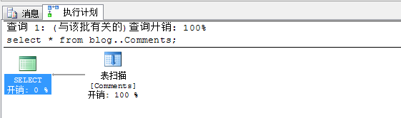
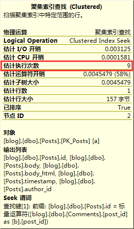

数据库是存储和管理数据的软件系统，就像一个存入数据的物流仓库。在商业领域，信息就意味着商机，取得信息的一个非常重要的途径就是对数据进行分析处理，这就催生出了各种专业的数据管理软件，数据库就是其中一种

之前翻译的一篇[《数据库是如何工作的？》](http://www.xumenger.com/how-databases-work-20180415/)让我们对关系型数据库的方方面面有了很好的了解，今天以SQL Server这个实实在在的关系型数据库作为研究对象，展示关系型数据库更为具体的东西

因为在现在的工作中经常和SQL Server打交道，而且最近做的一个基于SQL Server的项目中因为性能问题还专门针对SQL插入慢而进行了性能调优，所以想把自己对SQL Server的简单研究梳理成文

本文的测试环境是这样的：Windows 7(64)、SQL Server 2008、Red Hat Enterprise Linux Server release 6.5 (Santiago)、FreeTDS 0.91

>本文主要涉及SQL Server，其他的关系型数据库像Oracle、MySQL只会简单的提及，但它们背后的很多东西都是相通的！

## 基础数据准备

以下的内容主要是我查阅了大量的各种资料整理得到的。而且本文包含丰富的实践内容，这些实践操作依赖的基础数据表、数据，在文章的开始我先准备好！这里我选择最经典的博客系统的关系型数据表设计方案！

首先创建测试用的数据库（先在D盘下创建blog文件夹）

```sql
USE [master]
GO

IF EXISTS (SELECT * FROM sysdatabases WHERE name='blog')
BEGIN
    --如果数据库存在就先删除数据库
    DROP DATABASE blog
END

--再重新创建数据库
CREATE DATABASE blog

--表示属于 primary 文件组
on primary
(
    --主数据文件的逻辑名称
    name='blog_data',
    --主数据文件的物理名称
    filename='D:\blog\blog_data.mdf',
    --主数据文件的初始大小
    size=5mb,
    --主数据文件增长的最大值
    maxsize=100mb,
    --主数据文件的增长率
    filegrowth=15%
)

--日志配置
log on
(
    --日志文件的逻辑名称
    name='blog_log',
    --日志文件的物理名称
    filename='D:\blog\blog_log.ldf',
    --日志文件的初始大小
    size=2mb,
    --日志文件增长的最大值
    maxsize=20mb,
    --日志文件的增长率
    filegrowth=1mb
)
```

接着创建需要的表

```sql
USE [blog]
GO

--角色表
CREATE TABLE Roles(
    id INT NOT NULL,
    name VARCHAR(64),
    is_default BIT DEFAULT(0),

    /* 权限说明
     * FOLLOW = 1
     * COMMENT = 2
     * WRITE = 4
     * MODERATE = 8
     * ADMIN = 16   */
    permissions INT,

    CONSTRAINT PK_Roles PRIMARY KEY CLUSTERED (id),
    CONSTRAINT UQ_Roles UNIQUE (name),
);
GO

CREATE NONCLUSTERED INDEX IX_Roles2 ON Roles (is_default);
GO


--用户表
--思考：id使用int类型，假如用户量真的过大超出int的范围怎么办？
--思考：id使用IDENTITY(1, 1)是不是更好
CREATE TABLE Users(
    id INT NOT NULL,
    email VARCHAR(64),
    username VARCHAR(64),
    role_id INT,
    password_hash VARCHAR(128),
    is_confirmed BIT DEFAULT(0),
    name VARCHAR(64),
    location VARCHAR(64),
    about_me TEXT,
    member_since DATETIME DEFAULT(getdate()),
    last_seen DATETIME DEFAULT(getdate()),
    avatar_hash VARCHAR(32),

    CONSTRAINT PK_Users PRIMARY KEY CLUSTERED (id),
    CONSTRAINT UQ_Users1 UNIQUE (email),
    CONSTRAINT UQ_Users2 UNIQUE (username),
    FOREIGN KEY(role_id) REFERENCES Roles(id)
);
GO

CREATE NONCLUSTERED INDEX IX_Users1 ON Users (email);
GO


--用户关注和被关注关系
CREATE TABLE Follows(
    follower_id INT,
    followed_id INT,
    timestamp DATETIME DEFAULT(getdate()),

    CONSTRAINT PK_Follows PRIMARY KEY CLUSTERED (follower_id, followed_id),
    FOREIGN KEY(follower_id) REFERENCES Users(id),
    FOREIGN KEY(followed_id) REFERENCES Users(id)
);
GO


--博客表
--思考：id使用int类型，假如博客量真的过大超出int的范围怎么办？
--思考：id使用IDENTITY(1, 1)是不是更好
CREATE TABLE Posts(
    id INT,
    body TEXT,
    body_html TEXT,
    timestamp DATETIME DEFAULT(getdate()),
    author_id INT,

    CONSTRAINT PK_Posts PRIMARY KEY CLUSTERED (id),
    FOREIGN KEY(author_id) REFERENCES Users(id)
);
GO

CREATE NONCLUSTERED INDEX IX_Posts ON Posts (timestamp);
GO


--评论表
--思考：id使用int类型，假如评论数真的过大超出int的范围怎么办？
--思考：id使用IDENTITY(1, 1)是不是更好
CREATE TABLE Comments(
    id INT,
    body TEXT,
    body_html TEXT,
    timestamp DATETIME DEFAULT(getdate()),
    is_disabled BIT,
    author_id INT,
    post_id INT,

    CONSTRAINT PK_Comments PRIMARY KEY CLUSTERED (id),
    FOREIGN KEY(author_id) REFERENCES Users(id),
    FOREIGN KEY(post_id) REFERENCES Posts(id)
);
GO

CREATE NONCLUSTERED INDEX IX_Comments ON Comments (timestamp);
GO
```

创建好数据表之后，在表中造一些用于后续测试的数据，测试数据量很少，但是在随便一个真实的生产环境数据量会大得多，不过通过这些小数据我们还是可以以小见大的！

```sql
--按照依赖顺序先清空所有表，被依赖的表最后清空
delete from blog..Comments;
delete from blog..Posts;
delete from blog..Follows;
delete from blog..Users;
delete from blog..Roles;


--模拟角色
--FOLLOW = 1
--COMMENT = 2
--WRITE = 4
--MODERATE = 8
--ADMIN = 16
insert into blog..Roles(id, name, is_default, permissions) values(1, 'User', 1, 1|2|4);
insert into blog..Roles(id, name, is_default, permissions) values(2, 'Moderator', 0, 1|2|4|8);
insert into blog..Roles(id, name, is_default, permissions) values(3, 'Administrator', 0, 1|2|4|8|16);


--模拟用户（测试时密码哈希函数选择MD5，实际生产环境再做其他考虑）
insert into blog..Users values(1, 'xumenger@126.com', 'xumenger', 3, sys.fn_sqlvarbasetostr(HashBytes('MD5','password')),
    1, 'xumeng', 'hangzhou', '...', GETDATE(), GETDATE(), NULL);
insert into blog..Users values(2, 'test@126.com', 'test', 1, sys.fn_sqlvarbasetostr(HashBytes('MD5','test')),
    1, 'test', 'hangzhou', '...', GETDATE(), GETDATE(), NULL);
insert into blog..Users values(3, 'hello@126.com', 'hello', 1, sys.fn_sqlvarbasetostr(HashBytes('MD5','hello')),
    1, 'hello', 'hangzhou', '...', GETDATE(), GETDATE(), NULL);
insert into blog..Users values(4, 'joker@126.com', 'joker', 1, sys.fn_sqlvarbasetostr(HashBytes('MD5','joker')),
    1, 'joker', 'hangzhou', '...', GETDATE(), GETDATE(), NULL);


--模拟一些用户关注关系
insert into blog..Follows values(2, 1, GETDATE());
insert into blog..Follows values(3, 1, GETDATE());
insert into blog..Follows values(4, 1, GETDATE());
insert into blog..Follows values(3, 2, GETDATE());
insert into blog..Follows values(2, 3, GETDATE());


--模拟博客
insert into blog..Posts values(1, 'Hello World !', 'Hello World !', GETDATE(), 1);
insert into blog..Posts values(2, 'Hello Kitty !', 'Hello Kitty !', GETDATE(), 1);
insert into blog..Posts values(3, 'Hello Blog !', 'Hello Blog !', GETDATE(), 1);
insert into blog..Posts values(4, 'Hello Blog !', 'Hello Blog !', GETDATE(), 2);
insert into blog..Posts values(5, 'Hello Blog !', 'Hello Blog !', GETDATE(), 3);
insert into blog..Posts values(6, 'Hello Blog !', 'Hello Blog !', GETDATE(), 4);


--模拟评论
insert into blog..Comments values(1, 'first comment', 'first comment', GETDATE(), 1, 2, 1);
insert into blog..Comments values(2, 'second comment', 'second comment', GETDATE(), 1, 3, 1);
insert into blog..Comments values(3, 'third comment', 'third comment', GETDATE(), 1, 4, 3);
insert into blog..Comments values(4, '4th comment', '4th comment', GETDATE(), 1, 3, 1);
insert into blog..Comments values(5, '5th comment', '5th comment', GETDATE(), 1, 1, 6);
insert into blog..Comments values(6, '6th comment', '6th comment', GETDATE(), 1, 2, 1);
insert into blog..Comments values(7, '7th comment', '7th comment', GETDATE(), 1, 3, 2);
insert into blog..Comments values(8, '8th comment', '8th comment', GETDATE(), 1, 4, 4);
insert into blog..Comments values(9, '9th comment', '9th comment', GETDATE(), 1, 4, 5);
```

逐条执行完以上所有的SQL语句后，在D盘的blog目录下可以看到对应的数据文件和日志文件


OK，基础数据准备完成，下面就结合理论与实践，开始动手搞起来！

## 数据表的基本结构

一个新表被创建之时，系统将在磁盘中分配一段以8KB为单位的连续空间，当字段的值从内存写入磁盘时，就在这一既定空间随机保存，当一个8K用完的时候，数据库指针会自动分配另一个8K的空间。这里，每个8K空间被称为一个数据页(Page)，又名页面或数据页面，并分配从0-7的页号，每个文件的第0页记录引导信息，叫文件头(File header)，每8个数据页(64K)的组合形成扩展区(Extent)，称为扩展。全部数据页的组合形成堆(Heap)

SQL Server规定行不能跨越数据页，所以，每行记录的最大数据量只能为8K。这就是[(n)char和(n)varchar这两种字符串类型](https://www.cnblogs.com/qanholas/p/3298882.html)容量要限制在8K以内的原因，存储超过8K的数据应使用text类型，实际上，text类型的字段值不能直接录入和保存，它只是存储一个指针，指向由若干8K的文本数据页所组成的扩展区，真正的数据正是放在这些数据页中的

页面有空间页面和数据页面之分

当一个扩展区的8个数据页中既包含了空间页面又包含了数据和索引页面时，称为混合扩展(Mixed Extent)，每张表都以混合扩展开始；反正，称之为一致扩展(Uniform Extent)，专门保存数据及索引信息

表被创建之时，SQL Server在混合扩展中为其分配至少一个数据页面，随着数据量的增长，SQL Server可即时在混合扩展中分配出7个页面，当数据超过8个页面时，则从一致扩展中分配数据页面

空间页面专门负责数据空间的分配和管理，包括：

* PFS页面(Page free space)：记录一个页面是否已分配、位于混合扩展还是一致扩展以及页面上还有多少可用空间等信息
* GAM(Global allocation map)和SGAM(Secodary global allocation map)：用来记录空闲的扩展或含有空闲页面的混合扩展的位置

SQL Server综合利用这三种类型的页面文件在必要时为数据表创建新空间

数据页或索引页则专门保存数据及索引信息，SQL Server使用四种类型的数据页面来管理表或索引，它们是：IAM页、数据页、文本/图像页和索引页

在Windows中，我们对文件执行的每一步操作，在磁盘上的物理位置只有系统知道；SQL Server沿袭了这种工作方式，在插入数据的过程中不但每个字段值在数据页面中的保存位置时随机的，而且每个数据页面在“堆”中的排列位置页只有系统才知道

这是为什么呢？众所周知，OS之所以能管理Disk，是因为在系统启动时首先加载了文件分配表FAT(File Allocation Table)，正是由它管理文件系统并记录堆文件的一切操作，系统才得以正常运行；同理，作为管理系统的SQL Server，也有这样一张类似FAT的表，它就是索引分布映像表IAM(Index Allocation Map)

IAM的存在，使SQL Server对数据表的物理管理有了可能

IAM页从混合扩展中分配，记录了8个初始页面的位置和该扩展区的位置，每个IAM页能管理512000个数据页面，如果数据量太大，SQL Server也可以增加更多的IAM页，可以位于文件的任何位置。第一个IAM页被称为FirstIAM，其中记录了以后的IAM页的位置

数据页和文本/图像页相反，前者保存非文本/图像类型的数据，因为它们都不超过8K的容量，后者则只保存超过8K容量的文本或图像类型数据。而索引页顾名思义，保存的是与索引结构相关的数据信息

了解页面的问题有助于我们准确理解SQL Server维护索引的方式，比如页拆分、填充因子等

## 数据表索引

SQL Server有多种索引类型

* 按存储结构区分：聚集索引（聚类索引、簇集索引）、非聚集索引（非聚类索引、非簇集索引）
* 按数据唯一性区分：唯一索引、非唯一索引
* 按键列个数区分：单列索引、多列索引

聚集索引是一种对磁盘上实际数据重新组织以按指定的一列或多列值排序。像我们用到的汉语字典，就是一个聚集索引，比如要查“张”，我们自然而然就翻到字典的后面百十页，然后根据字母顺序查找出来。这里用到微软的平衡二叉树算法，即首先把书翻到大概二分之一的位置，如果要找的页码比该页的页码小，就把书向前翻到四分之一处，否则，就把书向后翻到四分之三的地方，依此类推，把书页续分成更小的部分，直至正确的页码

由于聚集索引是给数据库排序，不可能有多种排法，所以一个表只能建立一个聚集索引。科学统计建立这样的索引需要至少相当于该表120%的附加空间用来存放该表的副本和索引中间页，但它的性能几乎总是比其他索引要快

由于在聚集索引下，数据在物理上是按序排列在数据页上的，重复值也排在一起，因而包含范围检查（between、<、>、<=、>=）或使用group by或order by的查询时，一旦找到第一个键值的行，后面都将是连在一起，不必再进一步的搜索，避免了大范围的扫描，可以大大提升查询速度

SQL Server默认情况下建立的是非聚集索引，它不重新组织表中的数据，而是对每一行存储索引列值并用一个指针指向数据所在的页面。它像汉语字典中的根据“偏旁部首”查找要找的字，即便对数据不排序，然而它拥有的目录更像是目录，对查取数据的效率也是具有的提升空间，不需要全表扫描

一个表可以拥有多个非聚集索引，每个非聚集索引根据索引列的不同提供不同的排序顺序

创建索引的SQL语法是这样的

```sql
CREATE [UNIQUE] [CLUSTERED | NONCLUSTERED]
INDEX index_name ON { table | view } ( column [ ASC | DESC ] [ ,...n ] )
[with[PAD_INDEX][[,]FILLFACTOR=fillfactor]
[[,]IGNORE_DUP_KEY]
[[,]DROP_EXISTING]
[[,]STATISTICS_NORECOMPUTE]
[[,]SORT_IN_TEMPDB]
]
[ ON filegroup ]
```

下面总结一些建立索引的一般原则：

* 系统一般会给主键字段自动建立聚集索引
* 有大量重复值且经常有范围查询和排序、分组的列，或经常频繁访问的列，考虑建立聚集索引
* 在一个经常做插入操作的表中建立索引，应使用fillfactor(填充因子)来减少页分裂，同时提高并发度降低死锁的发生。如果表为只读表，填充因子可设为100
* 在选择索引键时，尽可能采用小数据类型的列作为键以使得每个索引页容纳尽可能多的索引键和指针，通过这种方式，可使一个查询必需遍历的索引页面降低至最小，此外，尽可能的使用整数作为键值，因为整数的访问速度最快

>填充因子是索引的一个特性，定义该索引每页上的可用空间量。fillfactor适应以后表数据的扩展并减少页拆分的可能性。填充因子是从0到100的百分比数值，设为100时表示将数据页填满。只有当不会对数据进行更改时（例如只读表）才用此设置。值越小则数据页上的空闲空间越大，这样可以减少在索引增长过程中进行页分裂的需要，但这一操作需要占用更多的磁盘空间。填充因子指定不当，会降低数据库的读取性能，其降低量与填充因子设置值成反比

## T-SQL语句查询执行顺序

```sql
--查询组合字段
(5)select (5-2) distinct (5-3) top (<top_specification>) (5-1) <select_list>
--连表
(1)from (1-J)<left_table><join_type> join <right_table> on <on_predicate>
        (1-A)<left_table><apply_type> apply <right_table_expression> as <alias>
        (1-P)<left_table> pivot (<pivot_specification>) as <alias>
        (1-U)<left_table> unpivot (<unpivot_specification>) as <alias>
--查询条件
(2)where <where_pridicate>
--分组
(3)group by <group_by_specification>
--分组条件
(4)having <having_pridicate>
--排序
(6)order by <order_by_list>
```

顺序有1-6，6个大顺序，然后细分，5-1、5-2、5-3由小变大顺序，1-J、1-A、1-P、1-U为并行顺序。执行过程中也会产生多个虚拟表，以配合最终的正确查询


比如执行下面这条SQL语句

```sql
select top(4) role_id , max(u.id) as maxUserID
from blog..Users as u right outer join blog..Posts as p
on u.id = p.author_id
where u.id>0
group by role_id 
having role_id >=0
order by maxUserID asc
```

下面就针对这个SQL具体分析一下其执行顺序！

**1.从from开始**

1.1.先加载左表

```sql
from blog..Users as u
```

查询Users表中的所有数据

1.2.这里应该是right outer join，但这里在SQL中被定义分解为2个步骤，即join、right outer join。表达式关键字从左到右，依次执行

```sql
join blog Posts as p
```

查询结果润初虚表vt1，位两个表的笛卡尔集合

1.3.on筛选器

```sql
on u.id = p.author_id
```

从 上一步的笛卡尔集合多条数据中删除不匹配的行，存入虚拟表vt2

1.4.天假外部行(outer row)

```sql
righter outer join blog..Posts as p
```

游标blog..Posts作为保留表，把剩余的数据重新添加到上一步的虚拟表vt2中，生成虚拟表vt3

**2.进入where阶段**

```sql
where u.id>0
```

查询结果存入虚拟表vt4，是筛选的条件为true的结果集，这里加入一个记忆点，就是where的筛选删除为永久的，而on的筛选删除为暂时的，因为on筛选过后，有可能会经过outer添加外部行，重新把数据加载回来，而where则不能

**3.group by分组**

```sql
group by role_id 
```

查询结果存入vt5，以role\_id列的数值开始分组，即role\_id列，值一样的分为一组，这里的两个null在三值逻辑中被视为true。三值逻辑：true、false、null。此三值，null为未知，是数据的逻辑特色，有的地方两个null相等为true，在有些地方则为false

**4.having筛选器**

```sql
having role_id >=0
```

筛选分好组的组数据，把不满足条件的删除掉

**5.select查询挑拣计算列**

5.1.计算表达式

```sql
select role_id , max(u.id)
```

从分过组的数据中计算各个组中的最大u.id，列出要筛选显示的列

5.2.distinct过滤重复

5.3.top结合order by筛选多少行，但这里的数据没有排列只是把多少行数据列出来而已

**6.order by排序显示**

最后排序显示结果！


>以上内容参考自[《T-sql语句查询执行顺序》](http://www.cnblogs.com/knowledgesea/p/4177830.html)

## 执行计划

>官方数据显示，执行T-SQL存在问题，80%都可以在执行计划中找到答案。所以执行计划的重要性不言而喻！

了解了索引和T-SQL的执行顺序后，我们接下来来看看SQL Server的执行计划

SQL Server Management Studio作为一个可视化的操作平台，可以很方便的查看SQL的执行计划，比如下面的SQL语句，查询关注了管理员的用户的信息

```sql
--查询关注了管理员的用户的信息（只要前2个）

select top 2 u1.id, u1.email, u1.username, u1.role_id
  from blog .. Users as u1,
       blog .. Users u2,
       blog .. Follows as f,
       blog .. Roles as r
 where r.permissions = 31
   and r.id = u2.role_id
   and u2.id = f.followed_id
   and u1.id = f.follower_id
```

F5执行结果是这样的


选中该SQL后，按下组合按钮【Ctrl+L】即可查看该SQL的执行计划，每个图标会有执行的操作、开销等信息的说明


把鼠标放到每个图标上可以看到有更详细的内容


图形化执行计划是从上到下从右到左看的（详细的参见[《看懂SqlServer查询计划》](http://www.cnblogs.com/fish-li/archive/2011/06/06/2073626.html)）

比如上面查询语句的执行计划的执行顺序是这样的

1. 【聚集索引扫描】，通过Users u2的主键PK\_Users，占10%的开销
2. 【聚集索引查找】，通过Roles r的主键PK\_Roles，占12%的开销
3. 对1、2的结果进行【嵌套循环】，Inner Join，占0%的开销
4. 【聚集索引扫描】，通过Follows f的主键PK\_Follows，占10%的开销
5. 对3、4的结果进行【哈希匹配】，Inner Join，占56%的开销
6. 【聚集索引查找】，通过Users u1的主键PK\_User，占10%的开销
7. 对6、7的结果进行【嵌套循环】，Inner Join，占0%的开销
8. Top 2选取结果的前2行

也可以在实际SQL前加上`set statistics profile on`

```sql
set statistics profile on

select top 2 u1.id, u1.email, u1.username, u1.role_id
  from blog .. Users as u1,
       blog .. Users u2,
       blog .. Follows as f,
       blog .. Roles as r
 where r.permissions = 31
   and r.id = u2.role_id
   and u2.id = f.followed_id
   and u1.id = f.follower_id

set statistics profile off
```

然后直接执行SQL就可以看到下面这种格式的执行计划。执行查询后，得到两个表格，上面的表格显示了查询的结果，下面的表格显示了查询的执行过程。相比图形化的执行计划，这中表格的方式可能在直观上不太友好，但它能反映更多的信息，尤其在比较复杂的查询时，可能看起来更容易，因为对于复杂的查询，执行计划的步骤太多，图形方式会造成图形过大，不容易观察


第二个表格看着是不是很像在PLSQL中对指定的SQL按F5之后输出的执行计划的格式


执行计划让你知道复杂的SQL到底是怎么执行的，有没有按照你设想的方案执行，有没有按照最高效的方式执行，使用了众多索引中的哪一个，怎么排序，怎么合并数据的，有没有造成不必要资源浪费单等等

下面只展示在开启了`set statistics profile on`情况下的非图形化的执行计划要怎么分析

下面的图展示了看非图形化的执行计划的顺序，很明显和上面分析的图形化执行计划得到的执行顺序信息是一致的！


SQL Server是如何选择一个执行计划的呢？

SQL Server怎么知道什么时候该用索引或者用哪个索引？对于SQL Server来说，每当要执行一个查询时，都要首先检查这个查询的执行计划是否存在缓存中。如果没有，就要生成一个执行计划，具体在产生执行计划时，并不是看有哪些索引可用然后随机选择，而是会参考一种被称为**索引统计信息**的数据。如果你仔细地看一下执行计划或执行过程表格，会看到SQL Server能预估每个步骤产生的数据量，正是因为SQL Server能预估这些数据量，SQL Server才能选择一个它认为最合适的方法去执行查询过程，此时索引统计信息就能告诉SQL Server这些信息

接下来我们来看看**索引统计信息是什么样子**

在SQL Server Management Studio中输入下面的语句

```sql
dbcc show_statistics (Users, PK_Users);

--当然也可以指定其他表、其他索引列
--比如
--dbcc show_statistics (Posts, IX_Posts);
```

执行得到（因为是测试数据，所以现在没有值）


第一个表格，它列出了这个索引统计信息的主要信息

列名               |  说明
-------------------|--------------------
Name               | 统计信息的名称
Updated            | 上一次更新统计信息的日期和时间
Rows               | 表中的行数
Rows Sampled       | 统计信息的抽样行数
Steps              | 数据可分成多少个组，与第三个表对应
Density            | 第一个索引列前缀的选择性（不包括EQ\_Rows）
Average key length | 索引列前缀集的平均长度
String Index       | 如果为“是”，则统计信息中包含字符串摘要索引，以支持为 LIKE 条件估算结果集大小。仅适用于 char、varchar、nchar 和 nvarchar、varchar(max)、nvarchar(max)、text 以及 ntext 数据类型的前导列

第二个表格，它列出各种字段组合的选择性，数据越小表示重复性越小，当然选择性也就越高

列名           | 说明
---------------|--------------
All density    | 索引列前缀集的选择性（包括 EQ\_ROWS）。注意：这个值越小就表示选择性越高。如果小于0.1，这个索引的选择性就比较高，反之，则表示选择性不高
Average length | 索引列前缀集的平均长度
Columns        | 为其显示 All density 和 Average length 的索引列前缀的名称

第三个表格，数据分布的直方图，SQL Server就是靠它预估一些执行步骤的数据量的

列名                  | 说明
----------------------|--------------
RANGE\_HI\_KEY        | 每个组中的最大值
RANGE\_ROWS           | 每组数据组的估算行数，不包含最大值
EQ\_ROWS              | 每组数据组中与最大值相等的行的估算数目
DISTINCT\_RANGE\_ROWS | 每组数据组中的非重复值的估算数目，不包含最大值
AVG\_RANGE\_ROWS      | 每组数据组中的重复值的平均数目，不包含最大值，计算公式：RANGE_ROWS / DISTINCT_RANGE_ROWS for DISTINCT_RANGE_ROWS > 0

以上参考自[《看懂SqlServer查询计划》](http://www.cnblogs.com/fish-li/archive/2011/06/06/2073626.html)，继续参考这个这个文章中的例子，针对本文的几张表

...

下面给一些根据执行计划细节要做的优化操作，更多的还是自己在实践中多总结：

* select \*通常情况下聚集索引会比非聚集索引更优
* 如果出现Nested Loops，需要查下是否需要聚集索引，非聚集索引是否可以包含所有需要的列
* Hash Match连接操作更适合于需要做Hasing算法集合很小的连接
* Merge Join时需要检查下原有的集合是否已经有排序，如果没有排序，使用索引能否解决
* 出现表扫描、聚集索引扫描、非聚集索引扫描时，考虑语句是否可以加where限制，select \*是否可以去除不必要的列
* 出现Rid查询时，是否可以加索引优化解决
* 在计划中看到不是你想要的索引时，看能否在语句中强制使用你想用的索引解决问题，强制使用索引的办法是：`select cluname1, cluname2 from table with(index=indexname)`
* 看到不是你想要的连接算法时，尝试强制使用你想要的算法解决。强制使用连接算法的语句：`select * from t1 left join t2 on t1.id=t2.id option(Hash/Loop/Merge Join)`
* 看到不是你想要的聚合算法时，尝试强制使用你想要的聚合算法。强制使用聚合算法的语句示例：`select age, count(age) as cnt from t1 group by age opetion(order/hash group)`
* 看到不是你想要的解析执行顺序时，或者解析顺序耗时过大时，尝试强制使用你定的执行顺序。`option (force order)`
* 看到有多个线程来合并执行你的SQL语句而影响到性能时，尝试强制是不并行操作。`option (maxdop 1)`
* 在存储过程中，由于参数不同导致执行计划不同，也影响了性能时尝试指定参数来优化。`option (optiomize for (@name='zlh'))`
* 不操作多余的列、多余的行，不做不必要的聚合、排序

>留一个问题，针对上面的SQL如何详细分析其执行计划，并对其进行优化？

## SQL Server Profiler和数据库引擎优化顾问

在[《SQL Server服务器端跟踪并定位导致死锁的SQL》](http://www.xumenger.com/sqlserver-deadlock-20160711/)中讲到了怎么使用SQL Server Profiler检查数据库死锁，其实SQL Server Profiler还有其他的更强大的功能，比如用于分析SQL Server执行某些SQL的性能

打开SQL Server Profiler后可以【文件】-->【新建追踪】-->【事件选择】-->【列筛选器】，选中TextData，然后编辑筛选器，比如`select%`表示监控所有以select开头的SQL，当然，类似的你可以监控你想监控的任何SQL，而且正如你看到的Profiler还有其他的更多的筛选项！


【确定】-->【运行】，然后在SQL Server Management Studio中分别执行下面的SQL

```sql
select u1.id, u1.email, u1.username, u1.role_id
  from blog .. Users as u1,
       blog .. Users u2,
       blog .. Follows as f,
       blog .. Roles as r
 where r.permissions = 31
   and r.id = u2.role_id
   and u2.id = f.followed_id
   and u1.id = f.follower_id;
```

>这里提一个细节，在SQL Server Management Studio中执行SQL语句的话，如果筛选器TextData设置为select%，那么SQL前面不能有空行、空格，否则监控不到，为了稳妥起见，可以设置TextData的筛选器内容是`%select%`

然后在SQL Server Profiler中可以看到监控到这条SQL的执行情况


然后【文件】-->【另存为】-->跟踪文件

一般情况下，最长查询时间的查询语句就是最影响性能的原因所在。它不仅占用数据库引擎大量的时间，还浪费系统资源

主要的系统资源就是CPU、读写IO，建议监控的事件有：Connect、Disconnect、ExistingConnection、SQL:BatchCompleted、RPC:completed，列包含writes，reads，cpu

打开【数据库引擎优化顾问】，界面是这样的


选择上面保存的文件，选择要优化的数据库和表，然后【操作】-->【开始分析】，然后得到这样的分析结果


不过这里因为一些问题导致分析过程出问题，如上图，在数据库引擎优化顾问的优化选项Tab页-->【高级选项】-->【定义建议所用的最大空间】


然后重新进行分析：






结合上面介绍的执行计划和这里提到的性能监控工具，我们可以很好的、很有针对性的进行性能调优！ 

可以看到，一个完善的系统软件，满足功能需求是一个方面，性能、稳定性等又是一个方面，而像SQL Server Profiler这种提供了完善的监控和分析功能也是必不可少的！就像Linux一样，对CPU、内存、网络、磁盘IO、进程、线程、句柄等资源提供了[完善的监控方案](http://www.cnblogs.com/knowledgesea/p/6392979.html)

## 记一次性能调优经历

实际的业务场景是这样的（所以用到的表并不是最开始准备的测试表）！在Linux系统上使用C++、FreeTDS开发系统对接Windows的SQL Server服务器，结果在测试的时候发现insert和update的性能慢的感人！所以需要针对这个问题进行调优！

首先因为程序存在select读操作，而且读取的数据量很大，而读的性能很快，所以基本可以排除网络层面的问题，那接下来就针对数据库和SQL进行排查和调优

>数据包是oiw01..ashare_ordwth，rec_num是表的主键，new_rec_num是一个索引列

抽取出代码中的SQL是这样的（我将多笔update语句拼成一个字符串，然后执行SQL）

```sql
update oiw01..ashare_ordwth set status = 'R' where rec_num = 1;
update oiw01..ashare_ordwth set status = 'R' where rec_num = 2;
update oiw01..ashare_ordwth set status = 'R' where rec_num = 3;
update oiw01..ashare_ordwth set status = 'R' where rec_num = 4;
update oiw01..ashare_ordwth set status = 'R' where rec_num = 5;
update oiw01..ashare_ordwth set status = 'R' where rec_num = 6;
update oiw01..ashare_ordwth set status = 'R' where rec_num = 7;
update oiw01..ashare_ordwth set status = 'R' where rec_num = 8;
```

结果上面的SQL执行很慢，测试发现每秒大概更新300条记录。很明显的，上面的多条SQL完全可以合并为一条SQL

```sql
update oiw01..ashare_ordwth set status = 'R' where rec_num in (1, 2, 3, 4, 5, 6, 7, 8);
```

后者网络传输的耗时也少，而且后者只有一条SQL，解析执行耗时也更少！

但实际需求发生变更，需要更新超过1个字段，而且每条记录更新的值不同，大概是下面这样的，现在就不能把多条update语句合并为一条了

```sql
update oiw01..ashare_ordwth set status = 'R', new_rec_num = 1 where rec_num = 1;
update oiw01..ashare_ordwth set status = 'R', new_rec_num = 2 where rec_num = 2;
update oiw01..ashare_ordwth set status = 'R', new_rec_num = 3 where rec_num = 3;
update oiw01..ashare_ordwth set status = 'R', new_rec_num = 4 where rec_num = 4;
update oiw01..ashare_ordwth set status = 'R', new_rec_num = 5 where rec_num = 5;
update oiw01..ashare_ordwth set status = 'R', new_rec_num = 6 where rec_num = 6;
update oiw01..ashare_ordwth set status = 'R', new_rec_num = 7 where rec_num = 7;
update oiw01..ashare_ordwth set status = 'R', new_rec_num = 8 where rec_num = 8;
```

后来排查发现SQL Server默认是自动提交的，即每个修改的SQL语句执行后会自动提交，所以上面8条SQL其实开启了8个事务，就会很慢，针对这个点，我修改为多条语句使用一个事务来执行！

```sql
begin tran
update oiw01..ashare_ordwth set status = 'R', new_rec_num = 1 where rec_num = 1;
update oiw01..ashare_ordwth set status = 'R', new_rec_num = 2 where rec_num = 2;
update oiw01..ashare_ordwth set status = 'R', new_rec_num = 3 where rec_num = 3;
update oiw01..ashare_ordwth set status = 'R', new_rec_num = 4 where rec_num = 4;
update oiw01..ashare_ordwth set status = 'R', new_rec_num = 5 where rec_num = 5;
update oiw01..ashare_ordwth set status = 'R', new_rec_num = 6 where rec_num = 6;
update oiw01..ashare_ordwth set status = 'R', new_rec_num = 7 where rec_num = 7;
update oiw01..ashare_ordwth set status = 'R', new_rec_num = 8 where rec_num = 8;
commit tran
```

后者还有一个好处，即只要有一条SQL执行出错就全部执行失败，而前者可能前3条SQL执行成功，第4条失败，所以后者更容易控制，数据的一致性更好地得到保证！通过这样的优化主要解决了数据库服务端对于事务的开销！添加了事务后的SQL执行性能明显提升了，测试结果显示现在执行的速度达到每秒1000条以上

很明显这次试一次简单的数据库写入操作性能优化，现在我们再看看数据库在进行写入操作时的主要耗时情况

**数据库连接**

我们进行数据库开发的时候，往往都是在客户端进行开发的，所以最开始要先和数据库建立TCP连接，说到TCP连接大家都知道首先要三次握手，然后数据库会分析连接字符串信息、验证登录身份等等

这一系列操作是很耗时的，所以很明显如果你每次写操作前先去创建连接，完成后再去断开连接是很愚蠢的做法！这样每次写操作实际会在连接的创建和断开的过程中耗费大量的时间

而应该在一次创建连接完成后，持续复用数据库连接，最好是使用连接池，这样就算确实用完了连接后，可以只是把连接放回连接池，而不是直接释放连接，后续比如其他的线程再去请求数据库连接的时候，可以直接从连接池中获取而不要再花费时间去创建一个全新的连接

**解析器开销**

当我们向SQL Server传递SQL语句时，SQL Server服务器需要先对SQL进行解析，由于SQL Server解析器执行速度很快，所以解析时间往往可以忽略不计，但仍然可以通过使用存储过程、绑定变量法而不是直接的SQL语句来减少解析器的开销

比如我们创建这么一个简单的存储过程（如果想要修改存储过程的定义，把CREATE修改为ALTER）

```sql
CREATE PROCEDURE Proc_Insert_Posts
    @id INT,
    @body TEXT,
    @body_html TEXT,
    @timestamp DATETIME,
    @author_id INT,
    @result INT output,
    @message NVARCHAR(4000) output
AS
BEGIN
    SET NOCOUNT ON;
    SET @result = 0;
    BEGIN TRY
        BEGIN TRAN
            INSERT INTO blog..Posts VALUES (@id, @body, @body_html, @timestamp, @author_id);
        COMMIT TRAN
    END TRY
    BEGIN CATCH
        IF @@TRANCOUNT > 0
        BEGIN
            SET @result = -1
            SET @message = ERROR_MESSAGE()
            ROLLBACK TRAN
        END
    END CATCH
END
```

在SQL Server Management Studio执行该存储过程后，就可以通过下面的方式进行调用

```sql
DECLARE @result INT
DECLARE @message NVARCHAR(4000)
DECLARE @date DATETIME
SET @date = GETDATE()
EXECUTE Proc_Insert_Posts 10, 'TEST PROC', 'TEST PROC', @date, 3, @result output, @message output;
PRINT @result
PRINT @message
```

**数据库事务和锁**

为了保证ACID(原子性、一致性、隔离性、持久性)，SQL Server必须保证所有的数据库更改是有序的。它是通过使用锁来确保插入、删除、更近操作之间不会互相冲突的

由于大多数数据库都是面向多用户的环境，当我们对Users表进行插入的时候，也许同时有更多的用户也在对Users表进行操作，所以SQL Server必须保证这些操作是有序的

那么，当SQL Server在做这些事情的时候就会产生锁。所以锁机制也会导致SQL执行的耗时

**约束处理**

在插入数据时，每个约束（如，外键、默认值、SQL CHECK、索引等）需要额外的时间来检测数据是否符合约束

由于SQL Server为了保证每个插入、更新、删除的记录都符合约束条件，所以，我们需要考虑是否应该在数据量大的表中增加约束条件

**varchar类型**

varchar是数据库常用的类型，但它也可能导致意想不到的性能开销。每次我们存储可变长度的列，那么SQL Server必须做更多的内存管理。字符串可以很容易地消耗数百字节的内存，如果我们在一个varchar列设置索引，那么SQL Server执行B-树搜索时，就需要进行O(字符串长度)次比较，相比而言整数字段比较次数只受限于内存延迟和CPU频率

**磁盘IO**

SQL Server最终会将数据写入到磁盘中，首先，SQL Server把数据写入到事务日志中，当执行备份时，事务日志会合并到永久的数据库文件中。这一系列操作由后台完成，它不会影响到数据查询的速度，但每个事务都必须拥有属于自己的磁盘空间，所以我们可以通过给事务日志和主数据文件分配独立的磁盘空间减少IO开销

当然最好的解决办法是尽可能减少事务的数量，这个具体要怎么做可能很大程度上看你所开发的系统的业务特点了

**简单总结**

小插曲！还发现了程序本身的一个问题，程序中每个循环还有一个usleep(100)的硬编码，导致性能也降低了，切记，在工业级开发中，代码中直接调用usleep()这样的硬编码是很不可取的！应该要使用阻塞队列、condition、多路复用等方式来替代这种丑陋的硬编码

在实际进行性能调优的时候一定要考虑所有的可能性

* 是不是网络的问题，如果和SQL Server服务器之间的带宽不够用，那很显然速度提不起来
* 是不是代码逻辑有不必要的循环、不必要的逻辑
* 是不是数据库索引设计不合理
* 是不是SQL写的不合理
	* 比如业务只要name、age列，但SQL查询了所有列，一方面数据库会变慢，另外网络传输时也传输了大量不必要的数据
    * 比如明明只要关联两张表就可以获取需要的信息，结果你的SQL要去关联三张表
* 是不是事务使用的不合理，比如本节提到的这个例子
* 

## 数据库调优技巧简单总结

SQL语句性能差，一般是下面这些原因导致的，排查的时候就要定位到具体是哪几个点，而不是笼统的排查：

* 网速不给力，不稳定。因为SQL语句要首先通过网络发送到服务器，指向结果也要通过网络发回来
* 服务器内存不够，或者SQL被分配的内存不够
* SQL语句设计不合理
* 没有相应的索引，索引不合理
* 没有有效的索引视图
* 表数据过大没有有效的分区设计
* 数据库设计太烂，存在大量的数据冗余
* 索引列上缺少相应的统计信息，或者统计信息过期
* 等等

针对以上可能导致性能慢的原因，我们需要逐步定位，定位到瓶颈点后再针对性的进行调优处理

另外，单线程大量insert一张表不需要过分考虑锁的问题，如果大量线程并发insert一张表还得考虑锁的问题

>优化，最重要的是在于你平时设计语句、数据库的习惯和方式。如果你平时不在意，汇总到一块再优化，你就需要耐心的分析，然而分析的过程就看你的悟性、需求、知识水平了

## MySQL数据库

MySQL是一个关系型数据库管理系统，由瑞典MySQL AB公司开发，目前属于Oracle旗下产品。MySQL是最流行的关系型数据库管理系统之一，在Web应用方面，MySQL是最好的RDBMS应用软件之一

* MySQL官网：[https://www.mysql.com/](https://www.mysql.com/)
* MySQL下载：[https://www.mysql.com/downloads/](https://www.mysql.com/downloads/)

MySQL数据库根据应用的需要准备了不同的引擎，不同的引擎侧重点不一样

* MyISAM：MySQL 5.0之前的默认数据库引擎，最为常用，拥有较高的插入、查询速度，但不支持事务
* InnoDB：事务性数据库的首选引擎，支持ACID事务，支持行级锁定，MySQL 5.5起成为默认数据库引擎
* BDB：源自Berkeley DB，事务型数据库的另一种选择，支持Commit和Rollback等其他事务特性
* Memory：所有数据置于内存的存储引擎，拥有较高的插入、更新和查询效率。但会占用和数据量成正比的内存空间。并且其内容会在MySQL重启后丢失
* Merge：将一定数量的MyISAM表联合而成一个整体，在超大规模数据存储时很有用
* Archive：非常适合存储大量的、独立的、作为历史记录的数据。因为它们不经常被读取，Archive拥有高效的插入速度，其对查询的支持相对较差
* Federated：将不同的MySQL服务器联合起来，逻辑上组成一个完整的数据库。非常适合分布式应用
* Cluster/NDB：高冗余的存储引擎，用多台数据机器联合提供服务以提高整体性能和安全性。适合数据量大、安全和性能要求高的应用
* CSV：逻辑上由逗号分割数据的存储引擎。它会在数据库子目录里为每个数据表创建一个.csv文件。这是一种普通文本文件，每个数据行占用一个文本行。CSV存储引擎不支持索引
* BlackHole：黑洞引擎，写入的任何数据都会消失，一般用于记录binlog做复制的中继
* EXAMPLE：是一个不做任何事情的存根引擎。它的目的是作为MySQL源代码中的一个例子，用来演示如何开始编写一个新存储引擎

MySQL的存储引擎接口定义良好，有兴趣的开发者可以通过阅读文档编写自己的存储引擎


关于MySQL，本文不会再花大篇幅讲解，记得前面提到过：官方数据显示，执行T-SQL存在问题，80%都可以在执行计划中找到答案。所以执行计划的重要性不言而喻！所以我们这里就只对这个最重要的执行计划进行简单的梳理

先启动MySQL服务器，连接到MySQL


## SQL注入

很多Web程序在开发的时候安全意识不够，没有对用户提交的数据进行充分的合法性判断，使应用程序存在安全隐患。用户可以提交一段数据库查询代码，根据程序返回的结果，获得某些他想得知的数据，或者篡改数据库内容，这就是所谓的SQL注入

SQL注入的手法相当灵活，在注入的时候会碰到很多意外的情况。能不能根据具体情况进行分析，构造巧妙的SQL语句，从而成功获得想要的数据，是高手与菜鸟的根本区别。下面对一些简单的SQL注入方法进行介绍

根据注入参数类型（一般通过分析GET请求的URL参数、POST请求的输入字段进行合理猜测），先尝试重构SQL语句的原貌，按参数类型主要分为下面三种

**1) id=49 这类注入的参数是数字型**，SQL语句原貌大致如下

```sql
select * 
from 表名 
where 字段=49
```

注入的参数为`id=49 and [查询条件]`，即生成语句

```sql
select * 
from 表名 
where 字段=49 and [查询条件]
```

**2) class=电影 这类注入的参数是字符串**，SQL语句原貌大致如下

```sql
select * 
from 表名 
where 字段 = '电影'
```

注入的参数为`class = 电影' and [查询条件] and ''='`，即生成语句

```sql
select * 
from 表名 
where 字段 = '电影' and [查询条件] and '' = ''
```

**3) 搜索时没有过来参数的，如keyword = 关键字**，SQL语句原貌如下

```sql
select * 
from 表名 
where 字段 like '%关键字%'
```

注入的参数为`keyword = ' and [查询条件] and '%25' = '`，即生成语句

```sql
select * 
from 表名 
where 字段 like '%' and [查询条件] and '%'='%'
```

了解了注入参数类型后，下面我们通过SQL注入尝试获取更多信息

**将查询条件替换成SQL语句，猜解表名**，例如：

```sql
id = 49 and (select count(*) from admin) > = 0
```

如果页面就与id=49的相同，说明附加条件成立，即表admin存在，反之说明不存在，如此循环，直到2猜到表名为止

表名猜出来后，将count(\*)替换为count(字段名)，用同样的原理去猜测字段名

当然这里存在偶然的成分，如果表名起的很复杂，那根本没法搞。确实，这世界根本就不存在100%成功的黑客技术，苍蝇不叮无缝的蛋，无论多技术多高深的黑客，都是因为别人的程序写得不严密或使用者保密意识不够，才有得下手

其实像表名、字段名等信息在大多数据库中是在某些系统表中存储和管理的，如果能直接搞到这个系统表不就直接拿到这些信息了？！

以上只是一些最直白、最简单的SQL注入方法的。千万不要以为SQL注入就只有这些东西！

在实际的生产环境中，对于SQL注入攻击，我们可以通过以下方式防御

* 不要直接把数据库的错误信息暴露在浏览器上
    * 攻击者往往会故意构造一些非法输入来通过应答报错信息获取大量我们服务器的信息
    * 基于这些信息为后续指定进一步的攻击计划提供指导
    * 当然这只是攻击者收集情报的方法之一
    * 在实际的攻击中，攻击者会尝试使用各种方法收集情报
    * 所以我们系统暴露出的机密信息要尽可能少！！
* 正则表达校验用户输入
* 参数化存储过程
* 参数化SQL语句
* 添加数据库新架构
* LINQ to SQL
* 其他

## 简单总结

本文的内容纯粹是根据自己平时接触到的SQL Server的一些方面进行的简单总结，还有更多没有涉及到的内容，比如：

* 系统表：sysobjects、deleted、insert、
* SQL Server不同版本之间的区别
* 数据表设计三范式
* 视图
* 全局变量
* 事务
* 触发器
* 主从机制和多机部署
* 连接
* 分库、分表
* 用户认证和权限
* 数据库统计信息
* 数据库日志

另外本文对于所涉及到的这些点的总结还是很浅显的，每个点往深了研究都有太多值得挖掘的知识

* 知道了数据库三范式，但具体设计时一定要遵守吗？如果不遵守，理由是什么？
* SQL在数据库内部是怎么解析的？
* 小型的应用一张表足以存储全部数据，假如数据量实在是太大，一个数据库根本应对不了怎么办？
* MySQL和SQL Server在哪些方面是一致的？在哪些方面是有差异的？

## 参考资料

* [《数据库是如何工作的？》](http://www.xumenger.com/how-databases-work-20180415/)
* [《SQL小纸条：快速参考》](http://www.xumenger.com/sql-quick-use/)
* [《深入理解SQL的连接》](http://www.xumenger.com/sql-join-20160630/)
* [《测试SQL Server的连接数》](http://www.xumenger.com/sqlserver-conn-20160606/)
* [《TDS网络协议》](http://www.xumenger.com/sqlserver-tds-20180414/)
* [《Linux下编写程序访问Windows上的SQL Server》](http://www.xumenger.com/linux-freetds-windows-sqlserver-20170705/)
* [《SQL Server服务器端跟踪并定位导致死锁的SQL》](http://www.xumenger.com/sqlserver-deadlock-20160711/)
* [《数据库查询 sysobjects》](http://www.cnblogs.com/knowledgesea/archive/2012/05/15/2501221.html)
* [《SQL 视图 局部变量 全局变量 条件语句 事务 触发器》](http://www.cnblogs.com/knowledgesea/archive/2012/05/29/2522853.html)
* [《c#（asp.net/core）杂谈笔记》](http://www.cnblogs.com/knowledgesea/archive/2012/07/10/2530436.html)
* [《存储过程详解》](http://www.cnblogs.com/knowledgesea/archive/2013/01/02/2841588.html)
* [《sqlserver 时间格式函数详细》](http://www.cnblogs.com/knowledgesea/archive/2013/02/17/2914214.html)
* [《PowerDesigner》](http://www.cnblogs.com/knowledgesea/archive/2013/03/27/2985354.html)
* [《数据库设计三大范式》](http://www.cnblogs.com/knowledgesea/p/3667395.html)
* [《SqlServer索引的原理与应用》](http://www.cnblogs.com/knowledgesea/p/3672099.html)
* [《SqlServer性能检测和优化工具使用详细》](http://www.cnblogs.com/knowledgesea/p/3683505.html)
* [《sql语句的优化分析》](http://www.cnblogs.com/knowledgesea/p/3686105.html)
* [《SQL Server表分区》](http://www.cnblogs.com/knowledgesea/p/3696912.html)
* [《SQL Server游标》](http://www.cnblogs.com/knowledgesea/p/3699851.html)
* [《SQL Server中的事务与锁》](http://www.cnblogs.com/knowledgesea/p/3714417.html)
* [《T-sql语句查询执行顺序》](http://www.cnblogs.com/knowledgesea/p/4177830.html)
* [《MSSQLSERVER添加c# clr程序集的使用方法》](http://www.cnblogs.com/knowledgesea/p/4617877.html)
* [《MSSQLSERVER执行计划详解》](http://www.cnblogs.com/knowledgesea/p/5005163.html)
* [《MSSQL数据批量插入优化详细》](http://www.cnblogs.com/knowledgesea/p/6232461.html)
* [《将死锁减至最少》](https://docs.microsoft.com/zh-cn/previous-versions/sql/sql-server-2008-r2/ms191242(v=sql.105))
* [《图形执行计划图标 (SQL Server Management Studio)》](https://docs.microsoft.com/zh-cn/previous-versions/sql/sql-server-2005/ms175913(v=sql.90))
* [《看懂SqlServer查询计划》](http://www.cnblogs.com/fish-li/archive/2011/06/06/2073626.html)
* [《T-SQL概述》](https://www.w3cschool.cn/t_sql/t_sql_overview.html)
* [《T-SQL简介及基本语法》](https://www.jianshu.com/p/a7bb06705916)
* [《CREATE TABLE (Transact-SQL)》](https://docs.microsoft.com/zh-cn/sql/t-sql/statements/create-table-transact-sql?view=sql-server-2017)
* [《T-SQL 之 DDL语法》](https://www.cnblogs.com/xinaixia/p/5817654.html)
* [《sql-主键、外键、索引》](https://www.cnblogs.com/wangjinke/p/5123549.html)
* [《varchar和Nvarchar区别》](https://www.cnblogs.com/qanholas/p/3298882.html)
* [《int、bigint、smallint 和 tinyint的范围》](https://msdn.microsoft.com/zh-tw/library/ms187745(v=sql.120).aspx)
* [《ERROR_MESSAGE (Transact-SQL)》](https://msdn.microsoft.com/zh-cn/library/vs/alm/ms190358(v=sql.120).aspx)
* [《SQL Server 高性能写入的一些总结》](https://www.cnblogs.com/rush/archive/2012/08/31/2666090.html)
* [《SQL注入漏洞全接触--入门篇》](https://blog.csdn.net/wufeng4552/article/details/3449834)
* [《SQL注入漏洞全接触--进阶篇》](https://blog.csdn.net/wufeng4552/article/details/3449870)
* [《一个小时学会MySQL数据库》](https://www.cnblogs.com/best/p/6517755.html)
* [《MySQL高级 之 explain执行计划详解》](https://blog.csdn.net/wuseyukui/article/details/71512793)


* [《Execution Plan 执行计划介绍》](http://www.cnblogs.com/biwork/archive/2013/04/11/3015655.html)
* [《SQL Server执行计划的理解》](http://www.cnblogs.com/kissdodog/p/3160560.html)
* [《SQL Server数据库基础》](https://www.cnblogs.com/justdoitba/articles/8067840.html)
* [《sql优化：SQL Server与Oracle性能对比（插入100w条数据时）》](https://blog.csdn.net/sqlserverdiscovery/article/details/53858224)
* [《一个insert插入语句很慢的优化》](http://blog.itpub.net/26736162/viewspace-1244044)
* [《Linux下用freetds执行SqlServer的sql语句和存储过程》](http://www.cnblogs.com/MikeZhang/archive/2012/03/30/useFreetdsAccessSqlServer2008.html)
* [《sqlserver禁止management studio的自动提交事务(转)》](https://blog.csdn.net/dragoo1/article/details/51691177)
* [《SQL Server 大量Update和Insert操作如何提升性能?》](https://segmentfault.com/q/1010000004195311)
* [《sql server 2005 大数据量插入性能对比》](https://www.cnblogs.com/MAYADIDI/p/3483611.html)
* [《SQL Server Insert操作效率（堆表VS聚集索引表）》](https://www.2cto.com/database/201302/187642.html)
