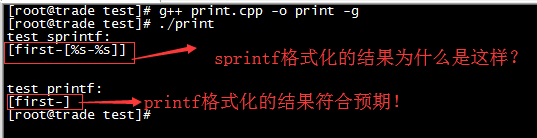
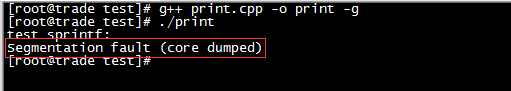
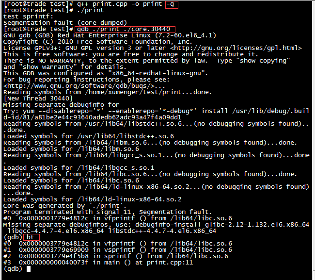

>先执行`ulimit -c unlimited`不限制生成的core文件的大小

在使用C/C++中的格式化函数时，有这样一个场景出现会怎么样？假如格式化字符串中有N个格式化符号，但在替换的时候只提供了N-1个值，格式化的结果会怎么样？

那接下来就简单实验一下！

编写的代码如下，分别可以用来测试sprintf和printf这两个常用的格式化函数

```cpp
#include <string.h>
#include <stdlib.h>
#include <stdio.h>

int main()
{
    const char *format = "[%s-%s]";
    char *cache = (char *)malloc(1000 * sizeof(char));

    printf("test sprintf:\n");
    sprintf(cache, format, "first");
    printf("%s\n\n", cache);

    free(cache);


    printf("\ntest printf:\n");
    printf(format, "first");
    printf("\n");

    return 0;
}
```

运行结果如下



可以看到sprintf和printf的运行效果完全不一致，看起来printf更符合我们期望的结果，而sprintf的结果是完全始料未及的！

在测试的过程中还遇到这样一个误用sprintf导致程序崩溃的问题，比如我把上面的代码修改成下面这样

```cpp
#include <string.h>
#include <stdlib.h>
#include <stdio.h>

int main()
{
    //const char *format = "[%s-%s]";
    char *cache = (char *)malloc(1000 * sizeof(char));

    printf("test sprintf:\n");
    //不用format变量，直接在sprintf中硬编码格式化字符串[%s-%s]
    sprintf(cache, "[%s-%s]", "first");
    printf("%s\n\n", cache);


    free(cache);


    printf("\ntest printf:\n");
    printf("[%s-%s]", "first");
    printf("\n");

    return 0;
}
```

编译运行就直接崩溃



`gdb 可执行文件 core文件`，然后通过where或bt命令可以查看函数调用栈信息



调用栈很清晰的说明就是在sprintf的时候导致崩溃
