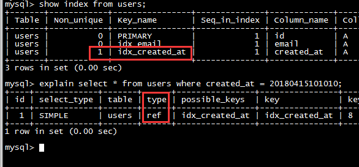

>执行SQL存在问题，80%都可以在执行计划中找到答案。所以执行计划的重要性不言而喻！所以我们这里就只对这个最重要的执行计划进行简单的梳理

MySQL是一个关系型数据库管理系统，由瑞典MySQL AB公司开发，目前属于Oracle旗下产品。MySQL是最流行的关系型数据库管理系统之一，在Web应用方面，MySQL是最好的RDBMS应用软件之一

* MySQL官网：[https://www.mysql.com/](https://www.mysql.com/)
* MySQL下载：[https://www.mysql.com/downloads/](https://www.mysql.com/downloads/)

MySQL数据库根据应用的需要准备了不同的引擎，不同的引擎侧重点不一样

* MyISAM：MySQL 5.0之前的默认数据库引擎，最为常用，拥有较高的插入、查询速度，但不支持事务
* InnoDB：事务性数据库的首选引擎，支持ACID事务，支持行级锁定，MySQL 5.5起成为默认数据库引擎
* BDB：源自Berkeley DB，事务型数据库的另一种选择，支持Commit和Rollback等其他事务特性
* Memory：所有数据置于内存的存储引擎，拥有较高的插入、更新和查询效率。但会占用和数据量成正比的内存空间。并且其内容会在MySQL重启后丢失
* Merge：将一定数量的MyISAM表联合而成一个整体，在超大规模数据存储时很有用
* Archive：非常适合存储大量的、独立的、作为历史记录的数据。因为它们不经常被读取，Archive拥有高效的插入速度，其对查询的支持相对较差
* Federated：将不同的MySQL服务器联合起来，逻辑上组成一个完整的数据库。非常适合分布式应用
* Cluster/NDB：高冗余的存储引擎，用多台数据机器联合提供服务以提高整体性能和安全性。适合数据量大、安全和性能要求高的应用
* CSV：逻辑上由逗号分割数据的存储引擎。它会在数据库子目录里为每个数据表创建一个.csv文件。这是一种普通文本文件，每个数据行占用一个文本行。CSV存储引擎不支持索引
* BlackHole：黑洞引擎，写入的任何数据都会消失，一般用于记录binlog做复制的中继
* EXAMPLE：是一个不做任何事情的存根引擎。它的目的是作为MySQL源代码中的一个例子，用来演示如何开始编写一个新存储引擎

MySQL的存储引擎接口定义良好，有兴趣的开发者可以通过阅读文档编写自己的存储引擎


在Mac上是这样启动MySQL服务器，连接到MySQL的


Linux下是这样启动服务器和连接到服务器的


## 基础数据准备

执行下面SQL创建数据库和表

```sql
drop database if exists test;
create database test;


use test;

--用户
create table users (
    `id` varchar(50) not null,
    `email` varchar(50) not null,
    `passwd` varchar(50) not null,
    `admin` bool not null,
    `name` varchar(50) not null,
    `image` varchar(500) not null,
    `created_at` real not null,
    unique key `idx_email` (`email`),
    key `idx_created_at` (`created_at`),
    primary key (`id`)
) engine=innodb default charset=utf8;

--博客
create table blogs (
    `id` varchar(50) not null,
    `user_id` varchar(50) not null,
    `user_name` varchar(50) not null,
    `user_image` varchar(500) not null,
    `name` varchar(50) not null,
    `summary` varchar(200) not null,
    `content` mediumtext not null,
    `created_at` real not null,
    key `idx_created_at` (`created_at`),
    primary key (`id`)
) engine=innodb default charset=utf8;

--评论
create table comments (
    `id` varchar(50) not null,
    `blog_id` varchar(50) not null,
    `user_id` varchar(50) not null,
    `user_name` varchar(50) not null,
    `user_image` varchar(500) not null,
    `content` mediumtext not null,
    `created_at` real not null,
    key `idx_created_at` (`created_at`),
    primary key (`id`)
) engine=innodb default charset=utf8;
```

然后执行下面的语句模拟测试数据

```sql
use test;

insert into users values('1', 'xumenger@126.com', 'pwd', true, 'xumenger', 'xm', 20180415101010);
insert into users values('2', 'aaaaaaa@126.com', 'pwd', false, 'aaaaaa', 'aa', 20180415101010);
insert into users values('3', 'bbbbbbb@126.com', 'pwd', false, 'bbbbbb', 'bb', 20180416101010);
insert into users values('4', 'ccccccc@126.com', 'pwd', false, 'cccccc', 'cc', 20180416101010);
insert into users values('5', 'ddddddd@126.com', 'pwd', false, 'dddddd', 'dd', 20180417101010);
insert into users values('6', 'eeeeeee@126.com', 'pwd', false, 'eeeeee', 'ee', 20180417101010);
insert into users values('7', 'fffffff@126.com', 'pwd', false, 'ffffff', 'ff', 20180418101010);
insert into users values('8', 'ggggggg@126.com', 'pwd', false, 'gggggg', 'gg', 20180418101010);
insert into users values('9', 'hhhhhhh@126.com', 'pwd', false, 'hhhhhh', 'hh', 20180419101010);
insert into users values('10', 'iiiiiii@126.com', 'pwd', false, 'iiiiii', 'ii', 20180419101010);
insert into users values('11', 'jjjjjjj@126.com', 'pwd', false, 'jjjjjj', 'jj', 20180501101010);
insert into users values('12', 'kkkkkkk@126.com', 'pwd', false, 'kkkkkk', 'kk', 20180502101010);
insert into users values('13', 'lllllll@126.com', 'pwd', false, 'llllll', 'll', 20180502101010);


insert into blogs values('1', '1', 'xumenger', 'xm', 'hello', 'hello', 'hello blog', 20180415101010);
insert into blogs values('2', '2', 'aaaaaa', 'aa', 'aa', 'test', 'aa blog', 20180416111010);
insert into blogs values('3', '2', 'aaaaaa', 'aa', 'aa', 'test', 'aa blog', 20180417121010);
insert into blogs values('4', '1', 'xumenger', 'xm', 'blog', 'xumenger', 'xumenger blog', 20180418101010);
insert into blogs values('5', '3', 'bbbbbb', 'bb', 'title', 'bb', 'bb blog', 20180419101110);
insert into blogs values('6', '8', 'gggggg', 'gg', 'name', 'gg', 'gg blog', 20180420111210);
insert into blogs values('7', '1', 'xumenger', 'xm', 'new', 'test', 'test blog', 20180423101010);
insert into blogs values('8', '5', 'dddddd', 'dd', 'my blog', 'dd', 'dd blog', 20180424101010);
insert into blogs values('9', '5', 'd22222', 'd2', 'new blog', 'd2', 'd2 blog', 20180424111010);
insert into blogs values('10', '5', 'd33333', 'd3', 'blog', 'd3', 'd3 blog', 20180424115010);
insert into blogs values('11', '4', 'cccccc', 'cc', 'test', 'cc', 'cc blog', 20180424115020);
insert into blogs values('12', '6', 'eeeeee', 'ee', 'blog', 'ee', 'ee blog', 20180425115010);
insert into blogs values('13', '1', 'xumenger', 'xm', 'hello', 'xm new blog', 'xm new blog', 20180425125010);
insert into blogs values('14', '1', 'xumenger', 'xm', 'blog', 'xm new blog', 'xm new blog', 20180425125510);


insert into comments values('1', '1', '1', 'xumenger', 'xm', 'not bad', 20180415121010);
insert into comments values('2', '1', '5', 'dddddd', 'dd', 'perfect', 20180416121010);
insert into comments values('3', '2', '1', 'xumenger', 'xm', '!!!', 20180416131010);
insert into comments values('4', '3', '2', 'aaaaaa', 'aa', 'not bad', 20180418121010);
insert into comments values('5', '11', '8', 'gggggg', 'gg', 'i like it', 20180424125020);
insert into comments values('6', '9', '1', 'xumenger', 'xm', 'shit', 20180425121010);
insert into comments values('7', '8', '1', 'xumenger', 'xm', 'not bad', 20180510121010);
```

## MySQL的执行计划

在MySQL中使用explain关键字可以模拟优化器执行SQL查询语句，从而知道MySQL是如何处理你的SQL语句的，分析你的查询语句或是表结构的性能瓶颈

比如我们有这样一条SQL，查询所有管理员的博客

```sql
select b.id, b.user_id, b.name 
from users u, blogs b 
where u.id = b.user_id and u.admin = true;
```

执行的结果如下


在SQL语句前面加上一个关键字explain就可以看到该SQL的执行计划

```sql
explain
select b.id, b.user_id, b.name 
from users u, blogs b 
where u.id = b.user_id and u.admin = true;
```


## 看懂MySQL的执行计划

对于上面看到的执行计划的表格模式，先来针对每个列进行讲解

* id：select查询的序列号，包含一组数字，表示查询中执行select子句或操作表的顺序
* select\_type：查询的类型，主要是用于区分普通查询、联合查询、子查询等复杂的查询
* type：访问类型，SQL查询优化中一个很重要的指标
* possible\_keys：查询涉及到的字段上存在索引，则该索引将被列出，但不一定被查询实际使用
* key：实际使用的索引，如果为NULL，则没有使用索引
* key\_len：表示索引中使用的字节数，查询中使用的索引的长度（最大可能长度），并非实际使用长度，理论上长度越短越好。key\_len是根据表定义计算而得的，不是通过表内检索出的
* ref：显示索引的那一列被使用了，如果可能，是一个常量const
* rows：根据表统计信息及索引选用情况，大致估算出找到所需的记录所需要的行数
* Extra：不适合在其他字段中显示，但是十分重要的额外信息

下面分别针对各个重要的列进行讲解

### id

select查询的序列号，包含一组数字，表示查询中执行select子句或操作表的顺序

有三种情况

**1) id相同**。执行顺序是从上至下的

```sql
explain
select users.*
from users,blogs,comments
where users.id=blogs.user_id
    and users.id=comments.user_id
    and users.name='';
```


**2) id不同**。如果是子查询，id的序号会递增，id越大优先级越高，越先被执行

```sql
explain
select users.*
from users 
where id = 
(   select user_id 
    from blogs
    where id = 
    (   select comments.blog_id
        from comments
        where comments.id = '1'
    )
);
```


**3) id相同和不同的情况都存在**。id如果相同，可以认为是一组，从上往下顺序执行；在所有组中，id值越大，优先级越高，越先执行

```sql
explain
select blogs.*
from 
(   select users.id
    from users
    where users.name = 'xumenger'
)s1, blogs
where s1.id = blogs.user_id;
```


### select\_type

查询的类型，主要用于区分普通查询、联合查询、子查询等复杂的查询

* SIMPLE：简单的select查询，查询中不包含子查询或union
* PRIMARY：查询中包含任何复杂的子部分，最外层查询则被标记为primary
* SUBQUERY：在select或where列表中包含了自查询
* DERIVED：在from列表中包含的子查询被标记为derived(衍生)，MySQL或递归执行这些子查询，把结果放在临时表中
* UNION：若第二个select出现在union之后，则被标记为union；若union包含在from子句的子查询中，外层的select将被标记为derived
* UNION RESULT：从union表查询结果的select

```sql
explain
select * from blogs a left join users b on a.user_id = b.id
union
select * from blogs a right join users b on a.user_id = b.id;
```


### type

访问类型，SQL查询优化中一个很重要的指标，结果值从好到坏依次是：

system > const > eq\_ref > ref > fulltext > ref\_or\_null > index\_merge > unique\_subquery > index\_subquery > range > index > ALL

**1) system**。表中只有一行记录（等于系统表），这是const类型的特例，平时不会出现

**2) const**。表示通过索引依次就找到了，const用于比较primary key或unique索引。因为只需要匹配一行数据，所以很快。如果将主键置于where列表中，MySQL就能将该查询转换为一个const

```sql
explain
select *
from
(   select * 
    from users
    where id = '1'
)a;
```


**3) eq\_ref**。唯一性索引扫描，对于每个索引键，表中只有一条记录阈值匹配，常见于主键或唯一索引扫描

```sql
explain select * from users, blogs where users.id=blogs.id;
explain select * from blogs, users where users.id=blogs.id;
```


**4) ref**。非唯一性索引扫描，返回匹配某个单独值的所有行。本质是也是一种索引访问，它返回所有匹配单独值的行，然而它可能会找到多个符合条件的行，所以应该属于查找和扫描的混合体

```sql
explain select * from users where created_at = 20180415101010;
```



**5) range**。值检索给定范围的行，使用一个索引来选择行。key列显示使用的那个索引。一般就是在where语句中出现between、>、<、in等的查询。这种索引列上的范围扫描比全索引扫描要好。只需要开始于某一点，结束于另一个点，不用扫描全部索引

```sql
explain
select * 
from users
where id between '1' and '10';
```


**6) index**。Full Index Scan，index与ALL区别为index类型只遍历索引树。这通常比ALL快，因为索引文件通常比数据文件小（Index与ALL虽然都是读全表，但index是从索引中读取，而ALL是从硬盘读取）

```sql
explain
select id
from users;
```


**7) ALL**。Full Table Scan，遍历全表以找到匹配的行

```sql
explain
select *
from users
where name = 'xumenger';
```


### key

实际使用的索引，如果为NULL，则没有使用索引。查询中如果使用了覆盖索引，则该索引仅出现在key列表中

```sql
explain select created_at from users;
explain select id, created_at from users;
explain select id from users;
```


下面这个因为select存在非索引列，所以key为NULL

```sql
explain
select id, name, email
from users;
```


### Extra

不适合在其他字段显示但又十分重要的额外信息

**1) using filesort**。MySQL对数据使用一个外部的索引排序，而不是按照表内的索引进行排序读取，也就是说MySQL无法利用索引完成的顺序操作称为“文件排序”

```sql
--先为users表的name添加非唯一索引
create index `idx_name` on users (name);
--为image添加非唯一索引
create index `idx_image` on users (image);

--检查当前users表的索引信息
show index from users;
```


然后针对下面的SQL查看其执行计划

```sql
explain select * from users where name = 'xumenger' order by image;
explain select * from users where name = 'xumenger' order by name, image;
explain select * from users where name = 'xumenger' order by image, created_at;
```


比如最后一条，由于索引是先按image排序，再按created\_at排序，所以查询如果直接按照created\_at排序，索引就不能满足要求了，MySQL内部必须要再实现一次文件排序

**2) using temporary**。使用临时表保存中间结果，也就是说MySQL在对查询排序时使用了临时表，常见于order by和group by

```sql
explain
select * 
from users
where created_at = 20180415101010
group by name;
```


**3) using index**。表示响应的select操作中使用了覆盖索引，避免了访问表的数据行，效率高。如果同时出现using where，表明索引被用来执行索引键值的查找；如果没有同时出现using where，表明索引用来读取数据而非执行查找动作

```sql
explain 
select name 
from users;
```


**4) 覆盖索引(covering index)**。也叫索引覆盖，就是select列表中的字段，只用从索引中就能获取，不必根据索引再次读取数据文件，换句话说就是查询列要被所建的索引覆盖

* 如果使用覆盖索引，select列中的字段只取需要的列，不要`select *`
* 如果将所有字段都建索引会导致索引文件过大，反而降低CRUD性能

**5) impossible where**。where子句总是false，不能用来获取任何元组

```sql
explain
select * 
from users
where name = 'a'
and name = 'b';
```


## 实际分析一个例子

接下来根据上面的介绍我们直接针对一个实际的例子进行分析

```sql
explain
select d1.name, (select id from comments) d2
from
(   select id, name
    from users
    where created_at = 20180415101010
)d1
union
select id, name 
from blogs;
```


它的执行顺序是这样的

1. id=4。`select id, name from blogs`
    * select\_type为union，说明id=4的select是union里面的第二个select
2. id=3。`select id, name from users where created_at = 20180415101010`
    * 因为是在from语句中包含的子查询，所以被标记为DERIVED
    * `created_at = 20180415101010`通过非唯一性索引`idx_created_at`检索到多行，所以type为ref
3. id=2。`select id from comments`
    * 因为是在select中包含的子查询所以被标记为SUBQUERY
4. id=1。`select d1.name, (...)d2 from (...)d1`
    * select\_type位PRIMARY表示该查询为最外层查询
    * table列标记为<derived3>表示查询来自一个衍生表，即id=3的查询结果
5. id=NULL。`... union ...`
    * 表示从union的临时表中读取行的阶段
    * table列的<union1,4>表示用id=1和id=4的select结果进行union操作

>完全参考[《MySQL高级 之 explain执行计划详解》](https://blog.csdn.net/wuseyukui/article/details/71512793)的思路对这几张表进行实验

## 参考资料

* [《MySQL高级 之 explain执行计划详解》](https://blog.csdn.net/wuseyukui/article/details/71512793)
* [《一个小时学会MySQL数据库》](https://www.cnblogs.com/best/p/6517755.html)
* [MySQL官网](https://www.mysql.com/)
* [MySQL下载](https://www.mysql.com/downloads/)
* [MySQL 数据类型](http://www.runoob.com/mysql/mysql-data-types.html)
