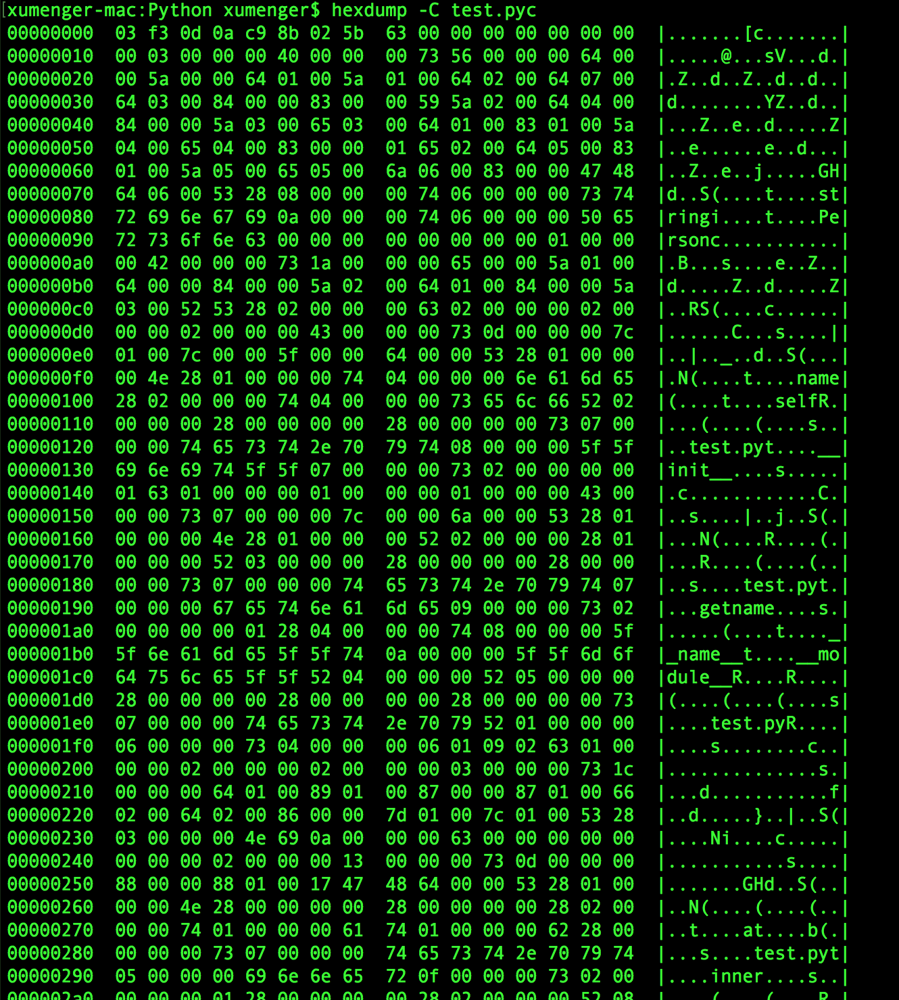

>本文测试环境：Python 2.7.14

## pyc格式简介

编写test.py文件如下

```python
s = 'string'
i = 10

def func():
    print 'pyc file format'
    ss = 'new string'
    return ss

sss = func()
print sss
```

执行`python2 -m compileall test.py`即可生成test.pyc文件，先使用`hexdump -C test.pyc`查看文件内容如下


先简单的看一下文件的内容，很明显变量名s、ss、sss等都存在，函数名func也看到了，字符串像'string'、'pyc file format'、'new string'也都有……

pyc是Python字节码在文件中存储的方式，而在虚拟机运行时环境中对应PyCodeObject对象。PyCodeObject格式如下

字段                | 类型        | 描述
-------------------|------------|--------
MAGIC              | long       | 魔数，区别不同版本的Python字节码
MTIME              | long       | 修改时间
TYPE\_CODE         | byte       | 表示这是一个PyCodeObject对象
co\_argcount       | long       | 【PyCodeObject】位置参数个数
co\_nlocals        | long       | 【PyCodeObject】局部变量个数
co\_stacksize      | long       | 【PyCodeObject】栈大小
co\_flags          | long       | 【PyCodeObject】
TYPE\_STRING       | byte       | 表示这是一个字符串，对应PyCodeObject的co\_code
co\_code size      | long       |
co\_code value     | bytes      |
TYPE\_LIST         | byte       | 这是一个列表
co\_consts size    | long       | 列表co\_consts的元素个数
TYPE\_INT          | byte       | 
co\_consts[0]      | long       | co\_consts[0]是一个整型
TYPE\_STRING       | byte       | 
co\_consts[1] size | long       | co\_consts[1]是一个字符串
co\_consts[1] value| bytes      |
TYPE\_CODE         | byte       |
co\_consts[2]      | long       | co\_consts[2]又是一个PyCodeObject，它对应的代码可能是一个函数或类

>上面的表格中还有一些字段没有写出来，比如co\_names、co\_varnames、co\_freevars、co\_cellvars、co\_filename、co\_name、co\_firstlineno、co\_lnotab

下面是补充一下PyCodeObject的类型定义

```c
typedef struct {
    PyObject_HEAD
    int co_argcount;        /* 位置参数个数 */
    int co_nlocals;         /* 局部变量个数 */
    int co_stacksize;       /* 栈大小 */
    int co_flags;  
    PyObject *co_code;      /* 字节码指令序列 */
    PyObject *co_consts;    /* 所有常量集合 */
    PyObject *co_names;     /* 所有符号名称集合 */
    PyObject *co_varnames;  /* 局部变量名称集合 */
    PyObject *co_freevars;  /* 闭包用的的变量名集合 */
    PyObject *co_cellvars;  /* 内部嵌套函数引用的变量名集合 */
    /* The rest doesn’t count for hash/cmp */
    PyObject *co_filename;  /* 代码所在文件名 */
    PyObject *co_name;      /* 模块名|函数名|类名 */
    int co_firstlineno;     /* 代码块在文件中的起始行号 */
    PyObject *co_lnotab;    /* 字节码指令和行号的对应关系 */
    void *co_zombieframe;   /* for optimization only (see frameobject.c) */
} PyCodeObject;
```

## 分析pyc文件

以上面test.py为例，编译其得到的pyc文件内容为

```
00000000  03 f3 0d 0a c2 6a 02 5b  63 00 00 00 00 00 00 00  |.....j.[c.......|
00000010  00 01 00 00 00 40 00 00  00 73 27 00 00 00 64 00  |.....@...s'...d.|
00000020  00 5a 00 00 64 01 00 5a  01 00 64 02 00 84 00 00  |.Z..d..Z..d.....|
00000030  5a 02 00 65 02 00 83 00  00 5a 03 00 65 03 00 47  |Z..e.....Z..e..G|
00000040  48 64 03 00 53 28 04 00  00 00 74 06 00 00 00 73  |Hd..S(....t....s|
00000050  74 72 69 6e 67 69 0a 00  00 00 63 00 00 00 00 01  |tringi....c.....|
00000060  00 00 00 01 00 00 00 43  00 00 00 73 0f 00 00 00  |.......C...s....|
00000070  64 01 00 47 48 64 02 00  7d 00 00 7c 00 00 53 28  |d..GHd..}..|..S(|
00000080  03 00 00 00 4e 73 0f 00  00 00 70 79 63 20 66 69  |....Ns....pyc fi|
00000090  6c 65 20 66 6f 72 6d 61  74 73 0a 00 00 00 6e 65  |le formats....ne|
000000a0  77 20 73 74 72 69 6e 67  28 00 00 00 00 28 01 00  |w string(....(..|
000000b0  00 00 74 02 00 00 00 73  73 28 00 00 00 00 28 00  |..t....ss(....(.|
000000c0  00 00 00 73 07 00 00 00  74 65 73 74 2e 70 79 74  |...s....test.pyt|
000000d0  04 00 00 00 66 75 6e 63  04 00 00 00 73 06 00 00  |....func....s...|
000000e0  00 00 01 05 01 06 01 4e  28 04 00 00 00 74 01 00  |.......N(....t..|
000000f0  00 00 73 74 01 00 00 00  69 52 02 00 00 00 74 03  |..st....iR....t.|
00000100  00 00 00 73 73 73 28 00  00 00 00 28 00 00 00 00  |...sss(....(....|
00000110  28 00 00 00 00 73 07 00  00 00 74 65 73 74 2e 70  |(....s....test.p|
00000120  79 74 08 00 00 00 3c 6d  6f 64 75 6c 65 3e 01 00  |yt....<module>..|
00000130  00 00 73 08 00 00 00 06  01 06 02 09 05 09 01     |..s............|
0000013f
```

**文件信息**

```
00000000  03 f3 0d 0a c2 6a 02 5b  63 00 00 00
```

前4个字节是magic number，也就是03f30d0a，其中0d0a就是\\r\\n

接下来4个字节是修改时间，即c26a025b，注意是小端模式，所以实际是0x5b026ac2

**字节码**

```
00000000  .. .. .. .. .. .. .. ..  .. .. .. .. 00 00 00 00  |            ....|
00000010  00 01 00 00 00 40 00 00  00 73 27 00 00 00 64 00  |.....@...s'...d.|
00000020  00 5a 00 00 64 01 00 5a  01 00 64 02 00 84 00 00  |.Z..d..Z..d.....|
00000030  5a 02 00 65 02 00 83 00  00 5a 03 00 65 03 00 47  |Z..e.....Z..e..G|
00000040  48 64 03 00 53 .. .. ..  .. .. .. .. .. .. .. ..  |Hd..S           |
```

然后是对象标识TYPE\_CODE，也就是0x63，也就是字符'c'，十进制是99。然后4个字节是全局code block的位置参数个数co\_argument，这里是0x00000000；再接着4个字节是code block的局部变量参数个数co\_nlocals，这里是0x00000000；接着四个字节是code block需要的栈空间，因为是小端模式，所以是0x00000001；然后4个字节是co\_flags，这里是0x00000040

接下来从0x73开始就是code block的字节码序列co\_code。注意它是PyStringObject形式的存在，因此开始写1个字节的类型标识TYPE\_STRING，即0x73。然后4个字节表示长度为0x00000027，也就是39个字节

从0x64开始就是co\_code的内容，可以通过dis命令来看一下


将内容拷贝如下

```python
xumenger-mac:Python xumenger$ python2
Python 2.7.14 (default, Sep 25 2017, 09:53:22) 
[GCC 4.2.1 Compatible Apple LLVM 9.0.0 (clang-900.0.37)] on darwin
Type "help", "copyright", "credits" or "license" for more information.
>>> import dis
>>> source = open('test.py').read()
>>> co = compile(source, 'test.py', 'exec')
>>> co.co_consts
('string', 10, <code object func at 0x10d491030, file "test.py", line 4>, None)
>>> co.co_names
('s', 'i', 'func', 'sss')
>>> dis.dis(co)
  1           0 LOAD_CONST               0 ('string')
              3 STORE_NAME               0 (s)

  2           6 LOAD_CONST               1 (10)
              9 STORE_NAME               1 (i)

  4          12 LOAD_CONST               2 (<code object func at 0x10d491030, file "test.py", line 4>)
             15 MAKE_FUNCTION            0
             18 STORE_NAME               2 (func)

  9          21 LOAD_NAME                2 (func)
             24 CALL_FUNCTION            0
             27 STORE_NAME               3 (sss)

 10          30 LOAD_NAME                3 (sss)
             33 PRINT_ITEM          
             34 PRINT_NEWLINE       
             35 LOAD_CONST               3 (None)
             38 RETURN_VALUE        

```

果然是39个字节。其中内容分别对应这些指令

所在列     | 说明
----------|--------------------------------
第 1 列    | 在源代码中的行数
第 2 列    | 该指令在co\_code中的偏移
第 3 列    | opcode，分为有操作数和无操作数两种，是一个字节的整数
第 4 列    | 操作数，占两个字节

这些指令对应的就是我们看到的pyc文件中的内容了，比如LOAD\_CONST指令就是0x64，然后两个字节操作数是0x0000；接下来是STORE\_NAME指令0x5a，操作数是0x0000

>详细的Python指令集会在后面讲到

**常量信息**

```
00000040  .. .. .. .. .. 28 04 00  00 00 74 06 00 00 00 73  |     (....t....s|
00000050  74 72 69 6e 67 69 0a 00  00 00 63 00 00 00 00 01  |tringi....c.....|
00000060  00 00 00 01 00 00 00 43  00 00 00 73 0f 00 00 00  |.......C...s....|
00000070  64 01 00 47 48 64 02 00  7d 00 00 7c 00 00 53 ..  |d..GHd..}..|..S |
```

接下来从0x28开始是co.co\_consts的内容，这是一个PyTupleObject对象，保存着code block的常量，有四个元素分别是字符串'string'、整数10、code object对象func以及None

PyTupleObject跟PyListObject类似，首先是记录类型标识TYPE\_TUPLE，也就是0x28，对应字符是'('。接下来4个字节是长度0x00000004，表示有4个元素

然后是元素内容

第一个是'string'，它是PyStringObject对象，因此先写入TYPE\_INTERNED，即0x74，对应字符't'，然后是4个字节的长度0x00000006，即长度为6字节，接着是6个字节的'string'内容信息

第二个是整数10，先是类型0x69，也就是字符'i'，然后是4字节的值0x0000000a，也就是十进制的10

第三个是code object（即函数func），先是TYPE\_CODE类型，也就是0x63，对应字符'c'，和最开始分析的字节码是一样的类型，然后就是code object的各个字段了，和前面分析字节码一样，在分析一遍func的字节码

字段           | 值
---------------|-------------
co\_argument   | 0x00000000
co\_nlocals    | 0x00000001
co\_stacksize  | 0x00000001
co\_flags      | 0x00000043
co\_code       | 它是PyStringObject形式的存在，标识为0x73，即TYPE\_STRING，即's'，长度为0x0000000f，即15字节，然后从0x64开始就是co\_code的内容

同样的，我们用dis分析func的co\_code


>注意代码中的`pyc.read(90)`是让文件指针后移90字节，移动至func函数的code object开始处

**分析func函数**

上面对func函数的字节码信息进行了分析，但是函数在pyc文件中还有更多的信息

```
00000070  .. .. .. .. .. .. .. ..  .. .. .. .. .. .. .. 28  |               (|
00000080  03 00 00 00 4e 73 0f 00  00 00 70 79 63 20 66 69  |....Ns....pyc fi|
00000090  6c 65 20 66 6f 72 6d 61  74 73 0a 00 00 00 6e 65  |le formats....ne|
000000a0  77 20 73 74 72 69 6e 67  .. .. .. .. .. .. .. ..  |w string        |
```

接下来是func的co\_consts字段，是PyTupleObject类型，标识为0x28，然后是4个字节的长度0x00000003

接着是第一个元素0x4e，也就是None，也就是字符'N'

然后是第二个元素，类型是字符串，即TYPE\_INTERNED，0x73，也就是字符's'，接着是字符串的长度0x0000000f，然后是对应长度的字符串内容'pyc file format'

接着是第三个元素，类型是字符串，即TYPE\_INTERNED，0x73，也就是字符's'，接着是字符串长度0x0000000a，然后是对应长度的字符串内容'new string'

>这里就看出了递归的结构，第一层是全局的code object，其co\_consts字段有func的定义信息，func的内部也有co\_consts信息……

```
000000a0  .. .. .. .. .. .. .. ..  28 00 00 00 00 28 01 00  |        (....(..|
000000b0  00 00 74 02 00 00 00 73  73 28 00 00 00 00 28 00  |..t....ss(....(.|
000000c0  00 00 00 .. .. .. .. ..  .. .. .. .. .. .. .. ..  |...             |
```

co\_consts字段结束后，接下来是co\_names，同样是PyTupleObject对象，显示标识0x28，然后是4个字节的长度0x00000000

接下来是co\_varnames，同样是PyTupleObject，类型是0x28，然后是4个字节的长度0x00000001，对应的变量名信息，0x74，即字符't'，表示其是TYPE\_INTERNED字符串类型，然后是4字节的字符串长度0x00000002，然后是对应长度的字符串名信息'ss'

再后面是闭包相关的东西co\_freevars，为空的PyTupleObject，类型0x28后面4个字节长度为0

然后是code block内部嵌套函数引用的局部变量名集合co_cellvars，同样是空的PyTupleObject对象

接下来是函数在源码文件中的信息

```
000000c0  .. .. .. 73 07 00 00 00  74 65 73 74 2e 70 79 74  |   s....test.pyt|
000000d0  04 00 00 00 66 75 6e 63  04 00 00 00 73 06 00 00  |....func....s...|
000000e0  00 00 01 05 01 06 01 ..  .. .. .. .. .. .. .. ..  |.......         |
```

从0x73开始是co\_filename，这是一个PyStringObject对象，先是标识0x73，即's'，然后是长度0x00000007，然后是文件名信息'test.py'

接着是co\_name，即函数名或类名，这里就是func了，首先也是对象标识0x74，即't'，然后是长度0x00000004，然后是对应长度的函数名'func'；然后是4字节的该函数在py文件中的位置信息，即0x00000004

然后是字节码指令与源文件行号对应的co\_lnotab，以PyStringObject对象存储，先是标识0x73('s')，然后是4字节的长度0x00000006，然后是内容0x010601050100

**其他内容**

```
000000e0  .. .. .. .. .. .. .. 4e  28 04 00 00 00 74 01 00  |       N(....t..|
000000f0  00 00 73 74 01 00 00 00  69 52 02 00 00 00 74 03  |..st....iR....t.|
00000100  00 00 00 73 73 73 28 00  00 00 00 28 00 00 00 00  |...sss(....(....|
00000110  28 00 00 00 00 73 07 00  00 00 74 65 73 74 2e 70  |(....s....test.p|
00000120  79 74 08 00 00 00 3c 6d  6f 64 75 6c 65 3e 01 00  |yt....<module>..|
00000130  00 00 73 08 00 00 00 06  01 06 02 09 05 09 01     |..s............|
0000013f
```

## 更复杂的Python代码

上面展示的是一个很简单的函数，下面我们编写一个更复杂的Python源码，包含类、闭包……

```python
# 全局变量
s = 'string'
i = 10

# 类
class Person:
    def __init__(self, name):
        self.name = name
    def getname(self):
        return self.name

# 函数和闭包
def outer(a):
    b = 10
    def inner():
        print a + b
    return inner

# 主逻辑
func = outer(10)
func();

p = Person('xumenger')
print p.getname()
```

执行`python2 -m compileall test.py`即可生成test.pyc文件，先使用`hexdump -C test.pyc`查看文件内容如下



拷贝内容如下

```
00000000  03 f3 0d 0a c9 8b 02 5b  63 00 00 00 00 00 00 00  |.......[c.......|
00000010  00 03 00 00 00 40 00 00  00 73 56 00 00 00 64 00  |.....@...sV...d.|
00000020  00 5a 00 00 64 01 00 5a  01 00 64 02 00 64 07 00  |.Z..d..Z..d..d..|
00000030  64 03 00 84 00 00 83 00  00 59 5a 02 00 64 04 00  |d........YZ..d..|
00000040  84 00 00 5a 03 00 65 03  00 64 01 00 83 01 00 5a  |...Z..e..d.....Z|
00000050  04 00 65 04 00 83 00 00  01 65 02 00 64 05 00 83  |..e......e..d...|
00000060  01 00 5a 05 00 65 05 00  6a 06 00 83 00 00 47 48  |..Z..e..j.....GH|
00000070  64 06 00 53 28 08 00 00  00 74 06 00 00 00 73 74  |d..S(....t....st|
00000080  72 69 6e 67 69 0a 00 00  00 74 06 00 00 00 50 65  |ringi....t....Pe|
00000090  72 73 6f 6e 63 00 00 00  00 00 00 00 00 01 00 00  |rsonc...........|
000000a0  00 42 00 00 00 73 1a 00  00 00 65 00 00 5a 01 00  |.B...s....e..Z..|
000000b0  64 00 00 84 00 00 5a 02  00 64 01 00 84 00 00 5a  |d.....Z..d.....Z|
000000c0  03 00 52 53 28 02 00 00  00 63 02 00 00 00 02 00  |..RS(....c......|
000000d0  00 00 02 00 00 00 43 00  00 00 73 0d 00 00 00 7c  |......C...s....||
000000e0  01 00 7c 00 00 5f 00 00  64 00 00 53 28 01 00 00  |..|.._..d..S(...|
000000f0  00 4e 28 01 00 00 00 74  04 00 00 00 6e 61 6d 65  |.N(....t....name|
00000100  28 02 00 00 00 74 04 00  00 00 73 65 6c 66 52 02  |(....t....selfR.|
00000110  00 00 00 28 00 00 00 00  28 00 00 00 00 73 07 00  |...(....(....s..|
00000120  00 00 74 65 73 74 2e 70  79 74 08 00 00 00 5f 5f  |..test.pyt....__|
00000130  69 6e 69 74 5f 5f 07 00  00 00 73 02 00 00 00 00  |init__....s.....|
00000140  01 63 01 00 00 00 01 00  00 00 01 00 00 00 43 00  |.c............C.|
00000150  00 00 73 07 00 00 00 7c  00 00 6a 00 00 53 28 01  |..s....|..j..S(.|
00000160  00 00 00 4e 28 01 00 00  00 52 02 00 00 00 28 01  |...N(....R....(.|
00000170  00 00 00 52 03 00 00 00  28 00 00 00 00 28 00 00  |...R....(....(..|
00000180  00 00 73 07 00 00 00 74  65 73 74 2e 70 79 74 07  |..s....test.pyt.|
00000190  00 00 00 67 65 74 6e 61  6d 65 09 00 00 00 73 02  |...getname....s.|
000001a0  00 00 00 00 01 28 04 00  00 00 74 08 00 00 00 5f  |.....(....t...._|
000001b0  5f 6e 61 6d 65 5f 5f 74  0a 00 00 00 5f 5f 6d 6f  |_name__t....__mo|
000001c0  64 75 6c 65 5f 5f 52 04  00 00 00 52 05 00 00 00  |dule__R....R....|
000001d0  28 00 00 00 00 28 00 00  00 00 28 00 00 00 00 73  |(....(....(....s|
000001e0  07 00 00 00 74 65 73 74  2e 70 79 52 01 00 00 00  |....test.pyR....|
000001f0  06 00 00 00 73 04 00 00  00 06 01 09 02 63 01 00  |....s........c..|
00000200  00 00 02 00 00 00 02 00  00 00 03 00 00 00 73 1c  |..............s.|
00000210  00 00 00 64 01 00 89 01  00 87 00 00 87 01 00 66  |...d...........f|
00000220  02 00 64 02 00 86 00 00  7d 01 00 7c 01 00 53 28  |..d.....}..|..S(|
00000230  03 00 00 00 4e 69 0a 00  00 00 63 00 00 00 00 00  |....Ni....c.....|
00000240  00 00 00 02 00 00 00 13  00 00 00 73 0d 00 00 00  |...........s....|
00000250  88 00 00 88 01 00 17 47  48 64 00 00 53 28 01 00  |.......GHd..S(..|
00000260  00 00 4e 28 00 00 00 00  28 00 00 00 00 28 02 00  |..N(....(....(..|
00000270  00 00 74 01 00 00 00 61  74 01 00 00 00 62 28 00  |..t....at....b(.|
00000280  00 00 00 73 07 00 00 00  74 65 73 74 2e 70 79 74  |...s....test.pyt|
00000290  05 00 00 00 69 6e 6e 65  72 0f 00 00 00 73 02 00  |....inner....s..|
000002a0  00 00 00 01 28 00 00 00  00 28 02 00 00 00 52 08  |....(....(....R.|
000002b0  00 00 00 52 0a 00 00 00  28 00 00 00 00 28 02 00  |...R....(....(..|
000002c0  00 00 52 08 00 00 00 52  09 00 00 00 73 07 00 00  |..R....R....s...|
000002d0  00 74 65 73 74 2e 70 79  74 05 00 00 00 6f 75 74  |.test.pyt....out|
000002e0  65 72 0d 00 00 00 73 06  00 00 00 00 01 06 01 12  |er....s.........|
000002f0  02 74 08 00 00 00 78 75  6d 65 6e 67 65 72 4e 28  |.t....xumengerN(|
00000300  00 00 00 00 28 07 00 00  00 74 01 00 00 00 73 74  |....(....t....st|
00000310  01 00 00 00 69 52 01 00  00 00 52 0b 00 00 00 74  |....iR....R....t|
00000320  04 00 00 00 66 75 6e 63  74 01 00 00 00 70 52 05  |....funct....pR.|
00000330  00 00 00 28 00 00 00 00  28 00 00 00 00 28 00 00  |...(....(....(..|
00000340  00 00 73 07 00 00 00 74  65 73 74 2e 70 79 74 08  |..s....test.pyt.|
00000350  00 00 00 3c 6d 6f 64 75  6c 65 3e 02 00 00 00 73  |...<module>....s|
00000360  0e 00 00 00 06 01 06 03  13 07 09 07 0c 01 07 02  |................|
00000370  0c 01                                             |..|
00000372
```

>具体如何分析该pyc不在这里赘述！

## Python指令集

```python
import opcode  
for op in range(len(opcode.opname)):  
    print('0x%.2X(%.3d): %s' % (op, op, opcode.opname[op]))  
```

执行以上的Python代码即可获取当前版本Python支持的指令集

```
0x00(000): STOP_CODE
0x01(001): POP_TOP
0x02(002): ROT_TWO
0x03(003): ROT_THREE
0x04(004): DUP_TOP
0x05(005): ROT_FOUR
0x06(006): <6>
0x07(007): <7>
0x08(008): <8>
0x09(009): NOP
0x0A(010): UNARY_POSITIVE
0x0B(011): UNARY_NEGATIVE
0x0C(012): UNARY_NOT
0x0D(013): UNARY_CONVERT
0x0E(014): <14>
0x0F(015): UNARY_INVERT
0x10(016): <16>
0x11(017): <17>
0x12(018): <18>
0x13(019): BINARY_POWER
0x14(020): BINARY_MULTIPLY
0x15(021): BINARY_DIVIDE
0x16(022): BINARY_MODULO
0x17(023): BINARY_ADD
0x18(024): BINARY_SUBTRACT
0x19(025): BINARY_SUBSCR
0x1A(026): BINARY_FLOOR_DIVIDE
0x1B(027): BINARY_TRUE_DIVIDE
0x1C(028): INPLACE_FLOOR_DIVIDE
0x1D(029): INPLACE_TRUE_DIVIDE
0x1E(030): SLICE+0
0x1F(031): SLICE+1
0x20(032): SLICE+2
0x21(033): SLICE+3
0x22(034): <34>
0x23(035): <35>
0x24(036): <36>
0x25(037): <37>
0x26(038): <38>
0x27(039): <39>
0x28(040): STORE_SLICE+0
0x29(041): STORE_SLICE+1
0x2A(042): STORE_SLICE+2
0x2B(043): STORE_SLICE+3
0x2C(044): <44>
0x2D(045): <45>
0x2E(046): <46>
0x2F(047): <47>
0x30(048): <48>
0x31(049): <49>
0x32(050): DELETE_SLICE+0
0x33(051): DELETE_SLICE+1
0x34(052): DELETE_SLICE+2
0x35(053): DELETE_SLICE+3
0x36(054): STORE_MAP
0x37(055): INPLACE_ADD
0x38(056): INPLACE_SUBTRACT
0x39(057): INPLACE_MULTIPLY
0x3A(058): INPLACE_DIVIDE
0x3B(059): INPLACE_MODULO
0x3C(060): STORE_SUBSCR
0x3D(061): DELETE_SUBSCR
0x3E(062): BINARY_LSHIFT
0x3F(063): BINARY_RSHIFT
0x40(064): BINARY_AND
0x41(065): BINARY_XOR
0x42(066): BINARY_OR
0x43(067): INPLACE_POWER
0x44(068): GET_ITER
0x45(069): <69>
0x46(070): PRINT_EXPR
0x47(071): PRINT_ITEM
0x48(072): PRINT_NEWLINE
0x49(073): PRINT_ITEM_TO
0x4A(074): PRINT_NEWLINE_TO
0x4B(075): INPLACE_LSHIFT
0x4C(076): INPLACE_RSHIFT
0x4D(077): INPLACE_AND
0x4E(078): INPLACE_XOR
0x4F(079): INPLACE_OR
0x50(080): BREAK_LOOP
0x51(081): WITH_CLEANUP
0x52(082): LOAD_LOCALS
0x53(083): RETURN_VALUE
0x54(084): IMPORT_STAR
0x55(085): EXEC_STMT
0x56(086): YIELD_VALUE
0x57(087): POP_BLOCK
0x58(088): END_FINALLY
0x59(089): BUILD_CLASS
0x5A(090): STORE_NAME
0x5B(091): DELETE_NAME
0x5C(092): UNPACK_SEQUENCE
0x5D(093): FOR_ITER
0x5E(094): LIST_APPEND
0x5F(095): STORE_ATTR
0x60(096): DELETE_ATTR
0x61(097): STORE_GLOBAL
0x62(098): DELETE_GLOBAL
0x63(099): DUP_TOPX
0x64(100): LOAD_CONST
0x65(101): LOAD_NAME
0x66(102): BUILD_TUPLE
0x67(103): BUILD_LIST
0x68(104): BUILD_SET
0x69(105): BUILD_MAP
0x6A(106): LOAD_ATTR
0x6B(107): COMPARE_OP
0x6C(108): IMPORT_NAME
0x6D(109): IMPORT_FROM
0x6E(110): JUMP_FORWARD
0x6F(111): JUMP_IF_FALSE_OR_POP
0x70(112): JUMP_IF_TRUE_OR_POP
0x71(113): JUMP_ABSOLUTE
0x72(114): POP_JUMP_IF_FALSE
0x73(115): POP_JUMP_IF_TRUE
0x74(116): LOAD_GLOBAL
0x75(117): <117>
0x76(118): <118>
0x77(119): CONTINUE_LOOP
0x78(120): SETUP_LOOP
0x79(121): SETUP_EXCEPT
0x7A(122): SETUP_FINALLY
0x7B(123): <123>
0x7C(124): LOAD_FAST
0x7D(125): STORE_FAST
0x7E(126): DELETE_FAST
0x7F(127): <127>
0x80(128): <128>
0x81(129): <129>
0x82(130): RAISE_VARARGS
0x83(131): CALL_FUNCTION
0x84(132): MAKE_FUNCTION
0x85(133): BUILD_SLICE
0x86(134): MAKE_CLOSURE
0x87(135): LOAD_CLOSURE
0x88(136): LOAD_DEREF
0x89(137): STORE_DEREF
0x8A(138): <138>
0x8B(139): <139>
0x8C(140): CALL_FUNCTION_VAR
0x8D(141): CALL_FUNCTION_KW
0x8E(142): CALL_FUNCTION_VAR_KW
0x8F(143): SETUP_WITH
0x90(144): <144>
0x91(145): EXTENDED_ARG
0x92(146): SET_ADD
0x93(147): MAP_ADD
0x94(148): <148>
0x95(149): <149>
0x96(150): <150>
0x97(151): <151>
0x98(152): <152>
0x99(153): <153>
0x9A(154): <154>
0x9B(155): <155>
0x9C(156): <156>
0x9D(157): <157>
0x9E(158): <158>
0x9F(159): <159>
0xA0(160): <160>
0xA1(161): <161>
0xA2(162): <162>
0xA3(163): <163>
0xA4(164): <164>
0xA5(165): <165>
0xA6(166): <166>
0xA7(167): <167>
0xA8(168): <168>
0xA9(169): <169>
0xAA(170): <170>
0xAB(171): <171>
0xAC(172): <172>
0xAD(173): <173>
0xAE(174): <174>
0xAF(175): <175>
0xB0(176): <176>
0xB1(177): <177>
0xB2(178): <178>
0xB3(179): <179>
0xB4(180): <180>
0xB5(181): <181>
0xB6(182): <182>
0xB7(183): <183>
0xB8(184): <184>
0xB9(185): <185>
0xBA(186): <186>
0xBB(187): <187>
0xBC(188): <188>
0xBD(189): <189>
0xBE(190): <190>
0xBF(191): <191>
0xC0(192): <192>
0xC1(193): <193>
0xC2(194): <194>
0xC3(195): <195>
0xC4(196): <196>
0xC5(197): <197>
0xC6(198): <198>
0xC7(199): <199>
0xC8(200): <200>
0xC9(201): <201>
0xCA(202): <202>
0xCB(203): <203>
0xCC(204): <204>
0xCD(205): <205>
0xCE(206): <206>
0xCF(207): <207>
0xD0(208): <208>
0xD1(209): <209>
0xD2(210): <210>
0xD3(211): <211>
0xD4(212): <212>
0xD5(213): <213>
0xD6(214): <214>
0xD7(215): <215>
0xD8(216): <216>
0xD9(217): <217>
0xDA(218): <218>
0xDB(219): <219>
0xDC(220): <220>
0xDD(221): <221>
0xDE(222): <222>
0xDF(223): <223>
0xE0(224): <224>
0xE1(225): <225>
0xE2(226): <226>
0xE3(227): <227>
0xE4(228): <228>
0xE5(229): <229>
0xE6(230): <230>
0xE7(231): <231>
0xE8(232): <232>
0xE9(233): <233>
0xEA(234): <234>
0xEB(235): <235>
0xEC(236): <236>
0xED(237): <237>
0xEE(238): <238>
0xEF(239): <239>
0xF0(240): <240>
0xF1(241): <241>
0xF2(242): <242>
0xF3(243): <243>
0xF4(244): <244>
0xF5(245): <245>
0xF6(246): <246>
0xF7(247): <247>
0xF8(248): <248>
0xF9(249): <249>
0xFA(250): <250>
0xFB(251): <251>
0xFC(252): <252>
0xFD(253): <253>
0xFE(254): <254>
0xFF(255): <255>
```

## 参考资料

* [《python下编译py成pyc和pyo》](https://blog.csdn.net/lyj1101066558/article/details/51479670)
* [《Python程序的执行原理》](https://www.cnblogs.com/xiaolongxia/articles/4039135.html)
* [《Python 2.6.2的.pyc文件格式》](http://rednaxelafx.iteye.com/blog/382423)
* [《Python 2.6.2的字节码指令集一览》](http://rednaxelafx.iteye.com/blog/382412)
* [《python虚拟机》](https://www.cnblogs.com/fancystar/p/6614007.html)
* [《Python pyc格式解析》](https://www.jianshu.com/p/03d81eb9ac9b)
* [《Python pyc格式解析》](https://www.2cto.com/kf/201504/395067.html)
* [《Python代码分析之dis模块》](https://www.cnblogs.com/heshangaichirou/p/5432703.html)
* [《飘逸的Python - 使用dis模块进行代码层次的性能分析》](https://blog.csdn.net/handsomekang/article/details/41479597)
* [《谈谈Python程序的运行原理》](https://www.cnblogs.com/restran/p/4903056.html)
* [《Python 2.6.2的字节码指令集一览》](https://blog.csdn.net/lxlmycsdnfree/article/details/78694474)
