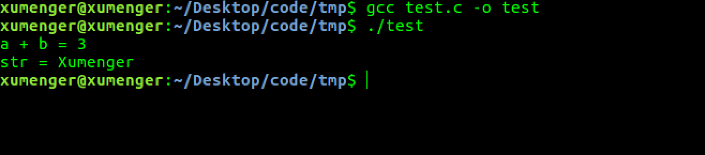
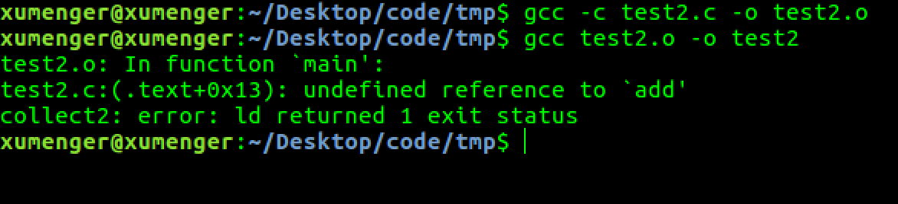
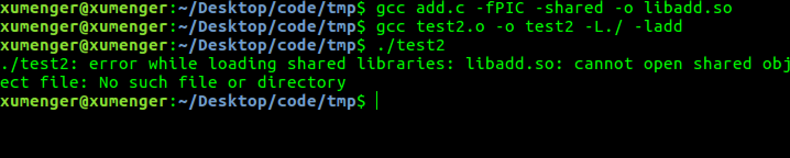

>本文的测试环境是Ubuntu 16.04LTS

比如我们编写一个简单的C语言的程序

```c
#include <stdio.h>

int main()
{
    int a = 1, b = 2;
    int c = a + b;
    printf("a + b = %d\n", c);

    char str[10] = "xumenger";
    str[0] = 'X';
    printf("str = %s\n", str);

    return 0;
}
```

`gcc test.c -o test`编译运行的效果如下



多说一句，编译得到的可执行文件可以用`hexdump -C test`去查看其二进制的内容！

```
00000000  7f 45 4c 46 02 01 01 00  00 00 00 00 00 00 00 00  |.ELF............|
00000010  02 00 3e 00 01 00 00 00  a0 04 40 00 00 00 00 00  |..>.......@.....|
00000020  40 00 00 00 00 00 00 00  18 1a 00 00 00 00 00 00  |@...............|
00000030  00 00 00 00 40 00 38 00  09 00 40 00 1f 00 1c 00  |....@.8...@.....|
00000040  06 00 00 00 05 00 00 00  40 00 00 00 00 00 00 00  |........@.......|
00000050  40 00 40 00 00 00 00 00  40 00 40 00 00 00 00 00  |@.@.....@.@.....|
00000060  f8 01 00 00 00 00 00 00  f8 01 00 00 00 00 00 00  |................|
00000070  08 00 00 00 00 00 00 00  03 00 00 00 04 00 00 00  |................|
00000080  38 02 00 00 00 00 00 00  38 02 40 00 00 00 00 00  |8.......8.@.....|
00000090  38 02 40 00 00 00 00 00  1c 00 00 00 00 00 00 00  |8.@.............|
000000a0  1c 00 00 00 00 00 00 00  01 00 00 00 00 00 00 00  |................|
000000b0  01 00 00 00 05 00 00 00  00 00 00 00 00 00 00 00  |................|
000000c0  00 00 40 00 00 00 00 00  00 00 40 00 00 00 00 00  |..@.......@.....|
000000d0  f4 07 00 00 00 00 00 00  f4 07 00 00 00 00 00 00  |................|
000000e0  00 00 20 00 00 00 00 00  01 00 00 00 06 00 00 00  |.. .............|
000000f0  10 0e 00 00 00 00 00 00  10 0e 60 00 00 00 00 00  |..........`.....|
00000100  10 0e 60 00 00 00 00 00  30 02 00 00 00 00 00 00  |..`.....0.......|
00000110  38 02 00 00 00 00 00 00  00 00 20 00 00 00 00 00  |8......... .....|
00000120  02 00 00 00 06 00 00 00  28 0e 00 00 00 00 00 00  |........(.......|
00000130  28 0e 60 00 00 00 00 00  28 0e 60 00 00 00 00 00  |(.`.....(.`.....|
00000140  d0 01 00 00 00 00 00 00  d0 01 00 00 00 00 00 00  |................|
00000150  08 00 00 00 00 00 00 00  04 00 00 00 04 00 00 00  |................|
00000160  54 02 00 00 00 00 00 00  54 02 40 00 00 00 00 00  |T.......T.@.....|
00000170  54 02 40 00 00 00 00 00  44 00 00 00 00 00 00 00  |T.@.....D.......|
00000180  44 00 00 00 00 00 00 00  04 00 00 00 00 00 00 00  |D...............|
00000190  50 e5 74 64 04 00 00 00  cc 06 00 00 00 00 00 00  |P.td............|
000001a0  cc 06 40 00 00 00 00 00  cc 06 40 00 00 00 00 00  |..@.......@.....|
000001b0  34 00 00 00 00 00 00 00  34 00 00 00 00 00 00 00  |4.......4.......|
000001c0  04 00 00 00 00 00 00 00  51 e5 74 64 06 00 00 00  |........Q.td....|
000001d0  00 00 00 00 00 00 00 00  00 00 00 00 00 00 00 00  |................|
*
000001f0  00 00 00 00 00 00 00 00  10 00 00 00 00 00 00 00  |................|
00000200  52 e5 74 64 04 00 00 00  10 0e 00 00 00 00 00 00  |R.td............|
00000210  10 0e 60 00 00 00 00 00  10 0e 60 00 00 00 00 00  |..`.......`.....|
00000220  f0 01 00 00 00 00 00 00  f0 01 00 00 00 00 00 00  |................|
00000230  01 00 00 00 00 00 00 00  2f 6c 69 62 36 34 2f 6c  |......../lib64/l|
00000240  64 2d 6c 69 6e 75 78 2d  78 38 36 2d 36 34 2e 73  |d-linux-x86-64.s|
00000250  6f 2e 32 00 04 00 00 00  10 00 00 00 01 00 00 00  |o.2.............|
00000260  47 4e 55 00 00 00 00 00  02 00 00 00 06 00 00 00  |GNU.............|
00000270  20 00 00 00 04 00 00 00  14 00 00 00 03 00 00 00  | ...............|
00000280  47 4e 55 00 a5 ad 25 a7  55 5e 60 89 ce 9f 94 43  |GNU...%.U^`....C|
00000290  bb 28 8d a4 5c cf 77 0a  01 00 00 00 01 00 00 00  |.(..\.w.........|
000002a0  01 00 00 00 00 00 00 00  00 00 00 00 00 00 00 00  |................|
000002b0  00 00 00 00 00 00 00 00  00 00 00 00 00 00 00 00  |................|
*
000002d0  0b 00 00 00 12 00 00 00  00 00 00 00 00 00 00 00  |................|
000002e0  00 00 00 00 00 00 00 00  1c 00 00 00 12 00 00 00  |................|
000002f0  00 00 00 00 00 00 00 00  00 00 00 00 00 00 00 00  |................|
00000300  23 00 00 00 12 00 00 00  00 00 00 00 00 00 00 00  |#...............|
00000310  00 00 00 00 00 00 00 00  35 00 00 00 20 00 00 00  |........5... ...|
00000320  00 00 00 00 00 00 00 00  00 00 00 00 00 00 00 00  |................|
00000330  00 6c 69 62 63 2e 73 6f  2e 36 00 5f 5f 73 74 61  |.libc.so.6.__sta|
00000340  63 6b 5f 63 68 6b 5f 66  61 69 6c 00 70 72 69 6e  |ck_chk_fail.prin|
00000350  74 66 00 5f 5f 6c 69 62  63 5f 73 74 61 72 74 5f  |tf.__libc_start_|
00000360  6d 61 69 6e 00 5f 5f 67  6d 6f 6e 5f 73 74 61 72  |main.__gmon_star|
00000370  74 5f 5f 00 47 4c 49 42  43 5f 32 2e 32 2e 35 00  |t__.GLIBC_2.2.5.|
00000380  47 4c 49 42 43 5f 32 2e  34 00 00 00 02 00 03 00  |GLIBC_2.4.......|
00000390  03 00 00 00 00 00 00 00  01 00 02 00 01 00 00 00  |................|
000003a0  10 00 00 00 00 00 00 00  75 1a 69 09 00 00 03 00  |........u.i.....|
000003b0  44 00 00 00 10 00 00 00  14 69 69 0d 00 00 02 00  |D........ii.....|
000003c0  50 00 00 00 00 00 00 00  f8 0f 60 00 00 00 00 00  |P.........`.....|
000003d0  06 00 00 00 04 00 00 00  00 00 00 00 00 00 00 00  |................|
000003e0  18 10 60 00 00 00 00 00  07 00 00 00 01 00 00 00  |..`.............|
000003f0  00 00 00 00 00 00 00 00  20 10 60 00 00 00 00 00  |........ .`.....|
00000400  07 00 00 00 02 00 00 00  00 00 00 00 00 00 00 00  |................|
00000410  28 10 60 00 00 00 00 00  07 00 00 00 03 00 00 00  |(.`.............|
00000420  00 00 00 00 00 00 00 00  48 83 ec 08 48 8b 05 c5  |........H...H...|
00000430  0b 20 00 48 85 c0 74 05  e8 53 00 00 00 48 83 c4  |. .H..t..S...H..|
00000440  08 c3 00 00 00 00 00 00  00 00 00 00 00 00 00 00  |................|
00000450  ff 35 b2 0b 20 00 ff 25  b4 0b 20 00 0f 1f 40 00  |.5.. ..%.. ...@.|
00000460  ff 25 b2 0b 20 00 68 00  00 00 00 e9 e0 ff ff ff  |.%.. .h.........|
00000470  ff 25 aa 0b 20 00 68 01  00 00 00 e9 d0 ff ff ff  |.%.. .h.........|
00000480  ff 25 a2 0b 20 00 68 02  00 00 00 e9 c0 ff ff ff  |.%.. .h.........|
00000490  ff 25 62 0b 20 00 66 90  00 00 00 00 00 00 00 00  |.%b. .f.........|
000004a0  31 ed 49 89 d1 5e 48 89  e2 48 83 e4 f0 50 54 49  |1.I..^H..H...PTI|
000004b0  c7 c0 a0 06 40 00 48 c7  c1 30 06 40 00 48 c7 c7  |....@.H..0.@.H..|
000004c0  96 05 40 00 e8 b7 ff ff  ff f4 66 0f 1f 44 00 00  |..@.......f..D..|
000004d0  b8 47 10 60 00 55 48 2d  40 10 60 00 48 83 f8 0e  |.G.`.UH-@.`.H...|
000004e0  48 89 e5 76 1b b8 00 00  00 00 48 85 c0 74 11 5d  |H..v......H..t.]|
000004f0  bf 40 10 60 00 ff e0 66  0f 1f 84 00 00 00 00 00  |.@.`...f........|
00000500  5d c3 0f 1f 40 00 66 2e  0f 1f 84 00 00 00 00 00  |]...@.f.........|
00000510  be 40 10 60 00 55 48 81  ee 40 10 60 00 48 c1 fe  |.@.`.UH..@.`.H..|
00000520  03 48 89 e5 48 89 f0 48  c1 e8 3f 48 01 c6 48 d1  |.H..H..H..?H..H.|
00000530  fe 74 15 b8 00 00 00 00  48 85 c0 74 0b 5d bf 40  |.t......H..t.].@|
00000540  10 60 00 ff e0 0f 1f 00  5d c3 66 0f 1f 44 00 00  |.`......].f..D..|
00000550  80 3d e9 0a 20 00 00 75  11 55 48 89 e5 e8 6e ff  |.=.. ..u.UH...n.|
00000560  ff ff 5d c6 05 d6 0a 20  00 01 f3 c3 0f 1f 40 00  |..].... ......@.|
00000570  bf 20 0e 60 00 48 83 3f  00 75 05 eb 93 0f 1f 00  |. .`.H.?.u......|
00000580  b8 00 00 00 00 48 85 c0  74 f1 55 48 89 e5 ff d0  |.....H..t.UH....|
00000590  5d e9 7a ff ff ff 55 48  89 e5 48 83 ec 30 64 48  |].z...UH..H..0dH|
000005a0  8b 04 25 28 00 00 00 48  89 45 f8 31 c0 c7 45 d4  |..%(...H.E.1..E.|
000005b0  01 00 00 00 c7 45 d8 02  00 00 00 8b 55 d4 8b 45  |.....E......U..E|
000005c0  d8 01 d0 89 45 dc 8b 45  dc 89 c6 bf b4 06 40 00  |....E..E......@.|
000005d0  b8 00 00 00 00 e8 96 fe  ff ff 48 b8 78 75 6d 65  |..........H.xume|
000005e0  6e 67 65 72 48 89 45 e0  66 c7 45 e8 00 00 c6 45  |ngerH.E.f.E....E|
000005f0  e0 58 48 8d 45 e0 48 89  c6 bf c0 06 40 00 b8 00  |.XH.E.H.....@...|
00000600  00 00 00 e8 68 fe ff ff  b8 00 00 00 00 48 8b 4d  |....h........H.M|
00000610  f8 64 48 33 0c 25 28 00  00 00 74 05 e8 3f fe ff  |.dH3.%(...t..?..|
00000620  ff c9 c3 66 2e 0f 1f 84  00 00 00 00 00 0f 1f 00  |...f............|
00000630  41 57 41 56 41 89 ff 41  55 41 54 4c 8d 25 ce 07  |AWAVA..AUATL.%..|
00000640  20 00 55 48 8d 2d ce 07  20 00 53 49 89 f6 49 89  | .UH.-.. .SI..I.|
00000650  d5 4c 29 e5 48 83 ec 08  48 c1 fd 03 e8 c7 fd ff  |.L).H...H.......|
00000660  ff 48 85 ed 74 20 31 db  0f 1f 84 00 00 00 00 00  |.H..t 1.........|
00000670  4c 89 ea 4c 89 f6 44 89  ff 41 ff 14 dc 48 83 c3  |L..L..D..A...H..|
00000680  01 48 39 eb 75 ea 48 83  c4 08 5b 5d 41 5c 41 5d  |.H9.u.H...[]A\A]|
00000690  41 5e 41 5f c3 90 66 2e  0f 1f 84 00 00 00 00 00  |A^A_..f.........|
000006a0  f3 c3 00 00 48 83 ec 08  48 83 c4 08 c3 00 00 00  |....H...H.......|
000006b0  01 00 02 00 61 20 2b 20  62 20 3d 20 25 64 0a 00  |....a + b = %d..|
000006c0  73 74 72 20 3d 20 25 73  0a 00 00 00 01 1b 03 3b  |str = %s.......;|
000006d0  30 00 00 00 05 00 00 00  84 fd ff ff 7c 00 00 00  |0...........|...|
000006e0  d4 fd ff ff 4c 00 00 00  ca fe ff ff a4 00 00 00  |....L...........|
000006f0  64 ff ff ff c4 00 00 00  d4 ff ff ff 0c 01 00 00  |d...............|
00000700  14 00 00 00 00 00 00 00  01 7a 52 00 01 78 10 01  |.........zR..x..|
00000710  1b 0c 07 08 90 01 07 10  14 00 00 00 1c 00 00 00  |................|
00000720  80 fd ff ff 2a 00 00 00  00 00 00 00 00 00 00 00  |....*...........|
00000730  14 00 00 00 00 00 00 00  01 7a 52 00 01 78 10 01  |.........zR..x..|
00000740  1b 0c 07 08 90 01 00 00  24 00 00 00 1c 00 00 00  |........$.......|
00000750  00 fd ff ff 40 00 00 00  00 0e 10 46 0e 18 4a 0f  |....@......F..J.|
00000760  0b 77 08 80 00 3f 1a 3b  2a 33 24 22 00 00 00 00  |.w...?.;*3$"....|
00000770  1c 00 00 00 44 00 00 00  1e fe ff ff 8d 00 00 00  |....D...........|
00000780  00 41 0e 10 86 02 43 0d  06 02 88 0c 07 08 00 00  |.A....C.........|
00000790  44 00 00 00 64 00 00 00  98 fe ff ff 65 00 00 00  |D...d.......e...|
000007a0  00 42 0e 10 8f 02 42 0e  18 8e 03 45 0e 20 8d 04  |.B....B....E. ..|
000007b0  42 0e 28 8c 05 48 0e 30  86 06 48 0e 38 83 07 4d  |B.(..H.0..H.8..M|
000007c0  0e 40 72 0e 38 41 0e 30  41 0e 28 42 0e 20 42 0e  |.@r.8A.0A.(B. B.|
000007d0  18 42 0e 10 42 0e 08 00  14 00 00 00 ac 00 00 00  |.B..B...........|
000007e0  c0 fe ff ff 02 00 00 00  00 00 00 00 00 00 00 00  |................|
000007f0  00 00 00 00 00 00 00 00  00 00 00 00 00 00 00 00  |................|
*
00000e10  70 05 40 00 00 00 00 00  50 05 40 00 00 00 00 00  |p.@.....P.@.....|
00000e20  00 00 00 00 00 00 00 00  01 00 00 00 00 00 00 00  |................|
00000e30  01 00 00 00 00 00 00 00  0c 00 00 00 00 00 00 00  |................|
00000e40  28 04 40 00 00 00 00 00  0d 00 00 00 00 00 00 00  |(.@.............|
00000e50  a4 06 40 00 00 00 00 00  19 00 00 00 00 00 00 00  |..@.............|
00000e60  10 0e 60 00 00 00 00 00  1b 00 00 00 00 00 00 00  |..`.............|
00000e70  08 00 00 00 00 00 00 00  1a 00 00 00 00 00 00 00  |................|
00000e80  18 0e 60 00 00 00 00 00  1c 00 00 00 00 00 00 00  |..`.............|
00000e90  08 00 00 00 00 00 00 00  f5 fe ff 6f 00 00 00 00  |...........o....|
00000ea0  98 02 40 00 00 00 00 00  05 00 00 00 00 00 00 00  |..@.............|
00000eb0  30 03 40 00 00 00 00 00  06 00 00 00 00 00 00 00  |0.@.............|
00000ec0  b8 02 40 00 00 00 00 00  0a 00 00 00 00 00 00 00  |..@.............|
00000ed0  5a 00 00 00 00 00 00 00  0b 00 00 00 00 00 00 00  |Z...............|
00000ee0  18 00 00 00 00 00 00 00  15 00 00 00 00 00 00 00  |................|
00000ef0  00 00 00 00 00 00 00 00  03 00 00 00 00 00 00 00  |................|
00000f00  00 10 60 00 00 00 00 00  02 00 00 00 00 00 00 00  |..`.............|
00000f10  48 00 00 00 00 00 00 00  14 00 00 00 00 00 00 00  |H...............|
00000f20  07 00 00 00 00 00 00 00  17 00 00 00 00 00 00 00  |................|
00000f30  e0 03 40 00 00 00 00 00  07 00 00 00 00 00 00 00  |..@.............|
00000f40  c8 03 40 00 00 00 00 00  08 00 00 00 00 00 00 00  |..@.............|
00000f50  18 00 00 00 00 00 00 00  09 00 00 00 00 00 00 00  |................|
00000f60  18 00 00 00 00 00 00 00  fe ff ff 6f 00 00 00 00  |...........o....|
00000f70  98 03 40 00 00 00 00 00  ff ff ff 6f 00 00 00 00  |..@........o....|
00000f80  01 00 00 00 00 00 00 00  f0 ff ff 6f 00 00 00 00  |...........o....|
00000f90  8a 03 40 00 00 00 00 00  00 00 00 00 00 00 00 00  |..@.............|
00000fa0  00 00 00 00 00 00 00 00  00 00 00 00 00 00 00 00  |................|
*
00001000  28 0e 60 00 00 00 00 00  00 00 00 00 00 00 00 00  |(.`.............|
00001010  00 00 00 00 00 00 00 00  66 04 40 00 00 00 00 00  |........f.@.....|
00001020  76 04 40 00 00 00 00 00  86 04 40 00 00 00 00 00  |v.@.......@.....|
00001030  00 00 00 00 00 00 00 00  00 00 00 00 00 00 00 00  |................|
00001040  47 43 43 3a 20 28 55 62  75 6e 74 75 20 35 2e 34  |GCC: (Ubuntu 5.4|
00001050  2e 30 2d 36 75 62 75 6e  74 75 31 7e 31 36 2e 30  |.0-6ubuntu1~16.0|
00001060  34 2e 39 29 20 35 2e 34  2e 30 20 32 30 31 36 30  |4.9) 5.4.0 20160|
00001070  36 30 39 00 00 00 00 00  00 00 00 00 00 00 00 00  |609.............|
00001080  00 00 00 00 00 00 00 00  00 00 00 00 00 00 00 00  |................|
00001090  00 00 00 00 03 00 01 00  38 02 40 00 00 00 00 00  |........8.@.....|
000010a0  00 00 00 00 00 00 00 00  00 00 00 00 03 00 02 00  |................|
000010b0  54 02 40 00 00 00 00 00  00 00 00 00 00 00 00 00  |T.@.............|
000010c0  00 00 00 00 03 00 03 00  74 02 40 00 00 00 00 00  |........t.@.....|
000010d0  00 00 00 00 00 00 00 00  00 00 00 00 03 00 04 00  |................|
000010e0  98 02 40 00 00 00 00 00  00 00 00 00 00 00 00 00  |..@.............|
000010f0  00 00 00 00 03 00 05 00  b8 02 40 00 00 00 00 00  |..........@.....|
00001100  00 00 00 00 00 00 00 00  00 00 00 00 03 00 06 00  |................|
00001110  30 03 40 00 00 00 00 00  00 00 00 00 00 00 00 00  |0.@.............|
00001120  00 00 00 00 03 00 07 00  8a 03 40 00 00 00 00 00  |..........@.....|
00001130  00 00 00 00 00 00 00 00  00 00 00 00 03 00 08 00  |................|
00001140  98 03 40 00 00 00 00 00  00 00 00 00 00 00 00 00  |..@.............|
00001150  00 00 00 00 03 00 09 00  c8 03 40 00 00 00 00 00  |..........@.....|
00001160  00 00 00 00 00 00 00 00  00 00 00 00 03 00 0a 00  |................|
00001170  e0 03 40 00 00 00 00 00  00 00 00 00 00 00 00 00  |..@.............|
00001180  00 00 00 00 03 00 0b 00  28 04 40 00 00 00 00 00  |........(.@.....|
00001190  00 00 00 00 00 00 00 00  00 00 00 00 03 00 0c 00  |................|
000011a0  50 04 40 00 00 00 00 00  00 00 00 00 00 00 00 00  |P.@.............|
000011b0  00 00 00 00 03 00 0d 00  90 04 40 00 00 00 00 00  |..........@.....|
000011c0  00 00 00 00 00 00 00 00  00 00 00 00 03 00 0e 00  |................|
000011d0  a0 04 40 00 00 00 00 00  00 00 00 00 00 00 00 00  |..@.............|
000011e0  00 00 00 00 03 00 0f 00  a4 06 40 00 00 00 00 00  |..........@.....|
000011f0  00 00 00 00 00 00 00 00  00 00 00 00 03 00 10 00  |................|
00001200  b0 06 40 00 00 00 00 00  00 00 00 00 00 00 00 00  |..@.............|
00001210  00 00 00 00 03 00 11 00  cc 06 40 00 00 00 00 00  |..........@.....|
00001220  00 00 00 00 00 00 00 00  00 00 00 00 03 00 12 00  |................|
00001230  00 07 40 00 00 00 00 00  00 00 00 00 00 00 00 00  |..@.............|
00001240  00 00 00 00 03 00 13 00  10 0e 60 00 00 00 00 00  |..........`.....|
00001250  00 00 00 00 00 00 00 00  00 00 00 00 03 00 14 00  |................|
00001260  18 0e 60 00 00 00 00 00  00 00 00 00 00 00 00 00  |..`.............|
00001270  00 00 00 00 03 00 15 00  20 0e 60 00 00 00 00 00  |........ .`.....|
00001280  00 00 00 00 00 00 00 00  00 00 00 00 03 00 16 00  |................|
00001290  28 0e 60 00 00 00 00 00  00 00 00 00 00 00 00 00  |(.`.............|
000012a0  00 00 00 00 03 00 17 00  f8 0f 60 00 00 00 00 00  |..........`.....|
000012b0  00 00 00 00 00 00 00 00  00 00 00 00 03 00 18 00  |................|
000012c0  00 10 60 00 00 00 00 00  00 00 00 00 00 00 00 00  |..`.............|
000012d0  00 00 00 00 03 00 19 00  30 10 60 00 00 00 00 00  |........0.`.....|
000012e0  00 00 00 00 00 00 00 00  00 00 00 00 03 00 1a 00  |................|
000012f0  40 10 60 00 00 00 00 00  00 00 00 00 00 00 00 00  |@.`.............|
00001300  00 00 00 00 03 00 1b 00  00 00 00 00 00 00 00 00  |................|
00001310  00 00 00 00 00 00 00 00  01 00 00 00 04 00 f1 ff  |................|
00001320  00 00 00 00 00 00 00 00  00 00 00 00 00 00 00 00  |................|
00001330  0c 00 00 00 01 00 15 00  20 0e 60 00 00 00 00 00  |........ .`.....|
00001340  00 00 00 00 00 00 00 00  19 00 00 00 02 00 0e 00  |................|
00001350  d0 04 40 00 00 00 00 00  00 00 00 00 00 00 00 00  |..@.............|
00001360  1b 00 00 00 02 00 0e 00  10 05 40 00 00 00 00 00  |..........@.....|
00001370  00 00 00 00 00 00 00 00  2e 00 00 00 02 00 0e 00  |................|
00001380  50 05 40 00 00 00 00 00  00 00 00 00 00 00 00 00  |P.@.............|
00001390  44 00 00 00 01 00 1a 00  40 10 60 00 00 00 00 00  |D.......@.`.....|
000013a0  01 00 00 00 00 00 00 00  53 00 00 00 01 00 14 00  |........S.......|
000013b0  18 0e 60 00 00 00 00 00  00 00 00 00 00 00 00 00  |..`.............|
000013c0  7a 00 00 00 02 00 0e 00  70 05 40 00 00 00 00 00  |z.......p.@.....|
000013d0  00 00 00 00 00 00 00 00  86 00 00 00 01 00 13 00  |................|
000013e0  10 0e 60 00 00 00 00 00  00 00 00 00 00 00 00 00  |..`.............|
000013f0  a5 00 00 00 04 00 f1 ff  00 00 00 00 00 00 00 00  |................|
00001400  00 00 00 00 00 00 00 00  01 00 00 00 04 00 f1 ff  |................|
00001410  00 00 00 00 00 00 00 00  00 00 00 00 00 00 00 00  |................|
00001420  ac 00 00 00 01 00 12 00  f0 07 40 00 00 00 00 00  |..........@.....|
00001430  00 00 00 00 00 00 00 00  ba 00 00 00 01 00 15 00  |................|
00001440  20 0e 60 00 00 00 00 00  00 00 00 00 00 00 00 00  | .`.............|
00001450  00 00 00 00 04 00 f1 ff  00 00 00 00 00 00 00 00  |................|
00001460  00 00 00 00 00 00 00 00  c6 00 00 00 00 00 13 00  |................|
00001470  18 0e 60 00 00 00 00 00  00 00 00 00 00 00 00 00  |..`.............|
00001480  d7 00 00 00 01 00 16 00  28 0e 60 00 00 00 00 00  |........(.`.....|
00001490  00 00 00 00 00 00 00 00  e0 00 00 00 00 00 13 00  |................|
000014a0  10 0e 60 00 00 00 00 00  00 00 00 00 00 00 00 00  |..`.............|
000014b0  f3 00 00 00 00 00 11 00  cc 06 40 00 00 00 00 00  |..........@.....|
000014c0  00 00 00 00 00 00 00 00  06 01 00 00 01 00 18 00  |................|
000014d0  00 10 60 00 00 00 00 00  00 00 00 00 00 00 00 00  |..`.............|
000014e0  1c 01 00 00 12 00 0e 00  a0 06 40 00 00 00 00 00  |..........@.....|
000014f0  02 00 00 00 00 00 00 00  2c 01 00 00 20 00 00 00  |........,... ...|
00001500  00 00 00 00 00 00 00 00  00 00 00 00 00 00 00 00  |................|
00001510  a0 01 00 00 20 00 19 00  30 10 60 00 00 00 00 00  |.... ...0.`.....|
00001520  00 00 00 00 00 00 00 00  48 01 00 00 10 00 19 00  |........H.......|
00001530  40 10 60 00 00 00 00 00  00 00 00 00 00 00 00 00  |@.`.............|
00001540  26 01 00 00 12 00 0f 00  a4 06 40 00 00 00 00 00  |&.........@.....|
00001550  00 00 00 00 00 00 00 00  4f 01 00 00 12 00 00 00  |........O.......|
00001560  00 00 00 00 00 00 00 00  00 00 00 00 00 00 00 00  |................|
00001570  6b 01 00 00 12 00 00 00  00 00 00 00 00 00 00 00  |k...............|
00001580  00 00 00 00 00 00 00 00  7f 01 00 00 12 00 00 00  |................|
00001590  00 00 00 00 00 00 00 00  00 00 00 00 00 00 00 00  |................|
000015a0  9e 01 00 00 10 00 19 00  30 10 60 00 00 00 00 00  |........0.`.....|
000015b0  00 00 00 00 00 00 00 00  ab 01 00 00 20 00 00 00  |............ ...|
000015c0  00 00 00 00 00 00 00 00  00 00 00 00 00 00 00 00  |................|
000015d0  ba 01 00 00 11 02 19 00  38 10 60 00 00 00 00 00  |........8.`.....|
000015e0  00 00 00 00 00 00 00 00  c7 01 00 00 11 00 10 00  |................|
000015f0  b0 06 40 00 00 00 00 00  04 00 00 00 00 00 00 00  |..@.............|
00001600  d6 01 00 00 12 00 0e 00  30 06 40 00 00 00 00 00  |........0.@.....|
00001610  65 00 00 00 00 00 00 00  d2 00 00 00 10 00 1a 00  |e...............|
00001620  48 10 60 00 00 00 00 00  00 00 00 00 00 00 00 00  |H.`.............|
00001630  a4 01 00 00 12 00 0e 00  a0 04 40 00 00 00 00 00  |..........@.....|
00001640  2a 00 00 00 00 00 00 00  e6 01 00 00 10 00 1a 00  |*...............|
00001650  40 10 60 00 00 00 00 00  00 00 00 00 00 00 00 00  |@.`.............|
00001660  f2 01 00 00 12 00 0e 00  96 05 40 00 00 00 00 00  |..........@.....|
00001670  8d 00 00 00 00 00 00 00  f7 01 00 00 20 00 00 00  |............ ...|
00001680  00 00 00 00 00 00 00 00  00 00 00 00 00 00 00 00  |................|
00001690  0b 02 00 00 11 02 19 00  40 10 60 00 00 00 00 00  |........@.`.....|
000016a0  00 00 00 00 00 00 00 00  17 02 00 00 20 00 00 00  |............ ...|
000016b0  00 00 00 00 00 00 00 00  00 00 00 00 00 00 00 00  |................|
000016c0  e0 01 00 00 12 00 0b 00  28 04 40 00 00 00 00 00  |........(.@.....|
000016d0  00 00 00 00 00 00 00 00  00 63 72 74 73 74 75 66  |.........crtstuf|
000016e0  66 2e 63 00 5f 5f 4a 43  52 5f 4c 49 53 54 5f 5f  |f.c.__JCR_LIST__|
000016f0  00 64 65 72 65 67 69 73  74 65 72 5f 74 6d 5f 63  |.deregister_tm_c|
00001700  6c 6f 6e 65 73 00 5f 5f  64 6f 5f 67 6c 6f 62 61  |lones.__do_globa|
00001710  6c 5f 64 74 6f 72 73 5f  61 75 78 00 63 6f 6d 70  |l_dtors_aux.comp|
00001720  6c 65 74 65 64 2e 37 35  39 34 00 5f 5f 64 6f 5f  |leted.7594.__do_|
00001730  67 6c 6f 62 61 6c 5f 64  74 6f 72 73 5f 61 75 78  |global_dtors_aux|
00001740  5f 66 69 6e 69 5f 61 72  72 61 79 5f 65 6e 74 72  |_fini_array_entr|
00001750  79 00 66 72 61 6d 65 5f  64 75 6d 6d 79 00 5f 5f  |y.frame_dummy.__|
00001760  66 72 61 6d 65 5f 64 75  6d 6d 79 5f 69 6e 69 74  |frame_dummy_init|
00001770  5f 61 72 72 61 79 5f 65  6e 74 72 79 00 74 65 73  |_array_entry.tes|
00001780  74 2e 63 00 5f 5f 46 52  41 4d 45 5f 45 4e 44 5f  |t.c.__FRAME_END_|
00001790  5f 00 5f 5f 4a 43 52 5f  45 4e 44 5f 5f 00 5f 5f  |_.__JCR_END__.__|
000017a0  69 6e 69 74 5f 61 72 72  61 79 5f 65 6e 64 00 5f  |init_array_end._|
000017b0  44 59 4e 41 4d 49 43 00  5f 5f 69 6e 69 74 5f 61  |DYNAMIC.__init_a|
000017c0  72 72 61 79 5f 73 74 61  72 74 00 5f 5f 47 4e 55  |rray_start.__GNU|
000017d0  5f 45 48 5f 46 52 41 4d  45 5f 48 44 52 00 5f 47  |_EH_FRAME_HDR._G|
000017e0  4c 4f 42 41 4c 5f 4f 46  46 53 45 54 5f 54 41 42  |LOBAL_OFFSET_TAB|
000017f0  4c 45 5f 00 5f 5f 6c 69  62 63 5f 63 73 75 5f 66  |LE_.__libc_csu_f|
00001800  69 6e 69 00 5f 49 54 4d  5f 64 65 72 65 67 69 73  |ini._ITM_deregis|
00001810  74 65 72 54 4d 43 6c 6f  6e 65 54 61 62 6c 65 00  |terTMCloneTable.|
00001820  5f 65 64 61 74 61 00 5f  5f 73 74 61 63 6b 5f 63  |_edata.__stack_c|
00001830  68 6b 5f 66 61 69 6c 40  40 47 4c 49 42 43 5f 32  |hk_fail@@GLIBC_2|
00001840  2e 34 00 70 72 69 6e 74  66 40 40 47 4c 49 42 43  |.4.printf@@GLIBC|
00001850  5f 32 2e 32 2e 35 00 5f  5f 6c 69 62 63 5f 73 74  |_2.2.5.__libc_st|
00001860  61 72 74 5f 6d 61 69 6e  40 40 47 4c 49 42 43 5f  |art_main@@GLIBC_|
00001870  32 2e 32 2e 35 00 5f 5f  64 61 74 61 5f 73 74 61  |2.2.5.__data_sta|
00001880  72 74 00 5f 5f 67 6d 6f  6e 5f 73 74 61 72 74 5f  |rt.__gmon_start_|
00001890  5f 00 5f 5f 64 73 6f 5f  68 61 6e 64 6c 65 00 5f  |_.__dso_handle._|
000018a0  49 4f 5f 73 74 64 69 6e  5f 75 73 65 64 00 5f 5f  |IO_stdin_used.__|
000018b0  6c 69 62 63 5f 63 73 75  5f 69 6e 69 74 00 5f 5f  |libc_csu_init.__|
000018c0  62 73 73 5f 73 74 61 72  74 00 6d 61 69 6e 00 5f  |bss_start.main._|
000018d0  4a 76 5f 52 65 67 69 73  74 65 72 43 6c 61 73 73  |Jv_RegisterClass|
000018e0  65 73 00 5f 5f 54 4d 43  5f 45 4e 44 5f 5f 00 5f  |es.__TMC_END__._|
000018f0  49 54 4d 5f 72 65 67 69  73 74 65 72 54 4d 43 6c  |ITM_registerTMCl|
00001900  6f 6e 65 54 61 62 6c 65  00 00 2e 73 79 6d 74 61  |oneTable...symta|
00001910  62 00 2e 73 74 72 74 61  62 00 2e 73 68 73 74 72  |b..strtab..shstr|
00001920  74 61 62 00 2e 69 6e 74  65 72 70 00 2e 6e 6f 74  |tab..interp..not|
00001930  65 2e 41 42 49 2d 74 61  67 00 2e 6e 6f 74 65 2e  |e.ABI-tag..note.|
00001940  67 6e 75 2e 62 75 69 6c  64 2d 69 64 00 2e 67 6e  |gnu.build-id..gn|
00001950  75 2e 68 61 73 68 00 2e  64 79 6e 73 79 6d 00 2e  |u.hash..dynsym..|
00001960  64 79 6e 73 74 72 00 2e  67 6e 75 2e 76 65 72 73  |dynstr..gnu.vers|
00001970  69 6f 6e 00 2e 67 6e 75  2e 76 65 72 73 69 6f 6e  |ion..gnu.version|
00001980  5f 72 00 2e 72 65 6c 61  2e 64 79 6e 00 2e 72 65  |_r..rela.dyn..re|
00001990  6c 61 2e 70 6c 74 00 2e  69 6e 69 74 00 2e 70 6c  |la.plt..init..pl|
000019a0  74 2e 67 6f 74 00 2e 74  65 78 74 00 2e 66 69 6e  |t.got..text..fin|
000019b0  69 00 2e 72 6f 64 61 74  61 00 2e 65 68 5f 66 72  |i..rodata..eh_fr|
000019c0  61 6d 65 5f 68 64 72 00  2e 65 68 5f 66 72 61 6d  |ame_hdr..eh_fram|
000019d0  65 00 2e 69 6e 69 74 5f  61 72 72 61 79 00 2e 66  |e..init_array..f|
000019e0  69 6e 69 5f 61 72 72 61  79 00 2e 6a 63 72 00 2e  |ini_array..jcr..|
000019f0  64 79 6e 61 6d 69 63 00  2e 67 6f 74 2e 70 6c 74  |dynamic..got.plt|
00001a00  00 2e 64 61 74 61 00 2e  62 73 73 00 2e 63 6f 6d  |..data..bss..com|
00001a10  6d 65 6e 74 00 00 00 00  00 00 00 00 00 00 00 00  |ment............|
00001a20  00 00 00 00 00 00 00 00  00 00 00 00 00 00 00 00  |................|
*
00001a50  00 00 00 00 00 00 00 00  1b 00 00 00 01 00 00 00  |................|
00001a60  02 00 00 00 00 00 00 00  38 02 40 00 00 00 00 00  |........8.@.....|
00001a70  38 02 00 00 00 00 00 00  1c 00 00 00 00 00 00 00  |8...............|
00001a80  00 00 00 00 00 00 00 00  01 00 00 00 00 00 00 00  |................|
00001a90  00 00 00 00 00 00 00 00  23 00 00 00 07 00 00 00  |........#.......|
00001aa0  02 00 00 00 00 00 00 00  54 02 40 00 00 00 00 00  |........T.@.....|
00001ab0  54 02 00 00 00 00 00 00  20 00 00 00 00 00 00 00  |T....... .......|
00001ac0  00 00 00 00 00 00 00 00  04 00 00 00 00 00 00 00  |................|
00001ad0  00 00 00 00 00 00 00 00  31 00 00 00 07 00 00 00  |........1.......|
00001ae0  02 00 00 00 00 00 00 00  74 02 40 00 00 00 00 00  |........t.@.....|
00001af0  74 02 00 00 00 00 00 00  24 00 00 00 00 00 00 00  |t.......$.......|
00001b00  00 00 00 00 00 00 00 00  04 00 00 00 00 00 00 00  |................|
00001b10  00 00 00 00 00 00 00 00  44 00 00 00 f6 ff ff 6f  |........D......o|
00001b20  02 00 00 00 00 00 00 00  98 02 40 00 00 00 00 00  |..........@.....|
00001b30  98 02 00 00 00 00 00 00  1c 00 00 00 00 00 00 00  |................|
00001b40  05 00 00 00 00 00 00 00  08 00 00 00 00 00 00 00  |................|
00001b50  00 00 00 00 00 00 00 00  4e 00 00 00 0b 00 00 00  |........N.......|
00001b60  02 00 00 00 00 00 00 00  b8 02 40 00 00 00 00 00  |..........@.....|
00001b70  b8 02 00 00 00 00 00 00  78 00 00 00 00 00 00 00  |........x.......|
00001b80  06 00 00 00 01 00 00 00  08 00 00 00 00 00 00 00  |................|
00001b90  18 00 00 00 00 00 00 00  56 00 00 00 03 00 00 00  |........V.......|
00001ba0  02 00 00 00 00 00 00 00  30 03 40 00 00 00 00 00  |........0.@.....|
00001bb0  30 03 00 00 00 00 00 00  5a 00 00 00 00 00 00 00  |0.......Z.......|
00001bc0  00 00 00 00 00 00 00 00  01 00 00 00 00 00 00 00  |................|
00001bd0  00 00 00 00 00 00 00 00  5e 00 00 00 ff ff ff 6f  |........^......o|
00001be0  02 00 00 00 00 00 00 00  8a 03 40 00 00 00 00 00  |..........@.....|
00001bf0  8a 03 00 00 00 00 00 00  0a 00 00 00 00 00 00 00  |................|
00001c00  05 00 00 00 00 00 00 00  02 00 00 00 00 00 00 00  |................|
00001c10  02 00 00 00 00 00 00 00  6b 00 00 00 fe ff ff 6f  |........k......o|
00001c20  02 00 00 00 00 00 00 00  98 03 40 00 00 00 00 00  |..........@.....|
00001c30  98 03 00 00 00 00 00 00  30 00 00 00 00 00 00 00  |........0.......|
00001c40  06 00 00 00 01 00 00 00  08 00 00 00 00 00 00 00  |................|
00001c50  00 00 00 00 00 00 00 00  7a 00 00 00 04 00 00 00  |........z.......|
00001c60  02 00 00 00 00 00 00 00  c8 03 40 00 00 00 00 00  |..........@.....|
00001c70  c8 03 00 00 00 00 00 00  18 00 00 00 00 00 00 00  |................|
00001c80  05 00 00 00 00 00 00 00  08 00 00 00 00 00 00 00  |................|
00001c90  18 00 00 00 00 00 00 00  84 00 00 00 04 00 00 00  |................|
00001ca0  42 00 00 00 00 00 00 00  e0 03 40 00 00 00 00 00  |B.........@.....|
00001cb0  e0 03 00 00 00 00 00 00  48 00 00 00 00 00 00 00  |........H.......|
00001cc0  05 00 00 00 18 00 00 00  08 00 00 00 00 00 00 00  |................|
00001cd0  18 00 00 00 00 00 00 00  8e 00 00 00 01 00 00 00  |................|
00001ce0  06 00 00 00 00 00 00 00  28 04 40 00 00 00 00 00  |........(.@.....|
00001cf0  28 04 00 00 00 00 00 00  1a 00 00 00 00 00 00 00  |(...............|
00001d00  00 00 00 00 00 00 00 00  04 00 00 00 00 00 00 00  |................|
00001d10  00 00 00 00 00 00 00 00  89 00 00 00 01 00 00 00  |................|
00001d20  06 00 00 00 00 00 00 00  50 04 40 00 00 00 00 00  |........P.@.....|
00001d30  50 04 00 00 00 00 00 00  40 00 00 00 00 00 00 00  |P.......@.......|
00001d40  00 00 00 00 00 00 00 00  10 00 00 00 00 00 00 00  |................|
00001d50  10 00 00 00 00 00 00 00  94 00 00 00 01 00 00 00  |................|
00001d60  06 00 00 00 00 00 00 00  90 04 40 00 00 00 00 00  |..........@.....|
00001d70  90 04 00 00 00 00 00 00  08 00 00 00 00 00 00 00  |................|
00001d80  00 00 00 00 00 00 00 00  08 00 00 00 00 00 00 00  |................|
00001d90  00 00 00 00 00 00 00 00  9d 00 00 00 01 00 00 00  |................|
00001da0  06 00 00 00 00 00 00 00  a0 04 40 00 00 00 00 00  |..........@.....|
00001db0  a0 04 00 00 00 00 00 00  02 02 00 00 00 00 00 00  |................|
00001dc0  00 00 00 00 00 00 00 00  10 00 00 00 00 00 00 00  |................|
00001dd0  00 00 00 00 00 00 00 00  a3 00 00 00 01 00 00 00  |................|
00001de0  06 00 00 00 00 00 00 00  a4 06 40 00 00 00 00 00  |..........@.....|
00001df0  a4 06 00 00 00 00 00 00  09 00 00 00 00 00 00 00  |................|
00001e00  00 00 00 00 00 00 00 00  04 00 00 00 00 00 00 00  |................|
00001e10  00 00 00 00 00 00 00 00  a9 00 00 00 01 00 00 00  |................|
00001e20  02 00 00 00 00 00 00 00  b0 06 40 00 00 00 00 00  |..........@.....|
00001e30  b0 06 00 00 00 00 00 00  1a 00 00 00 00 00 00 00  |................|
00001e40  00 00 00 00 00 00 00 00  04 00 00 00 00 00 00 00  |................|
00001e50  00 00 00 00 00 00 00 00  b1 00 00 00 01 00 00 00  |................|
00001e60  02 00 00 00 00 00 00 00  cc 06 40 00 00 00 00 00  |..........@.....|
00001e70  cc 06 00 00 00 00 00 00  34 00 00 00 00 00 00 00  |........4.......|
00001e80  00 00 00 00 00 00 00 00  04 00 00 00 00 00 00 00  |................|
00001e90  00 00 00 00 00 00 00 00  bf 00 00 00 01 00 00 00  |................|
00001ea0  02 00 00 00 00 00 00 00  00 07 40 00 00 00 00 00  |..........@.....|
00001eb0  00 07 00 00 00 00 00 00  f4 00 00 00 00 00 00 00  |................|
00001ec0  00 00 00 00 00 00 00 00  08 00 00 00 00 00 00 00  |................|
00001ed0  00 00 00 00 00 00 00 00  c9 00 00 00 0e 00 00 00  |................|
00001ee0  03 00 00 00 00 00 00 00  10 0e 60 00 00 00 00 00  |..........`.....|
00001ef0  10 0e 00 00 00 00 00 00  08 00 00 00 00 00 00 00  |................|
00001f00  00 00 00 00 00 00 00 00  08 00 00 00 00 00 00 00  |................|
00001f10  00 00 00 00 00 00 00 00  d5 00 00 00 0f 00 00 00  |................|
00001f20  03 00 00 00 00 00 00 00  18 0e 60 00 00 00 00 00  |..........`.....|
00001f30  18 0e 00 00 00 00 00 00  08 00 00 00 00 00 00 00  |................|
00001f40  00 00 00 00 00 00 00 00  08 00 00 00 00 00 00 00  |................|
00001f50  00 00 00 00 00 00 00 00  e1 00 00 00 01 00 00 00  |................|
00001f60  03 00 00 00 00 00 00 00  20 0e 60 00 00 00 00 00  |........ .`.....|
00001f70  20 0e 00 00 00 00 00 00  08 00 00 00 00 00 00 00  | ...............|
00001f80  00 00 00 00 00 00 00 00  08 00 00 00 00 00 00 00  |................|
00001f90  00 00 00 00 00 00 00 00  e6 00 00 00 06 00 00 00  |................|
00001fa0  03 00 00 00 00 00 00 00  28 0e 60 00 00 00 00 00  |........(.`.....|
00001fb0  28 0e 00 00 00 00 00 00  d0 01 00 00 00 00 00 00  |(...............|
00001fc0  06 00 00 00 00 00 00 00  08 00 00 00 00 00 00 00  |................|
00001fd0  10 00 00 00 00 00 00 00  98 00 00 00 01 00 00 00  |................|
00001fe0  03 00 00 00 00 00 00 00  f8 0f 60 00 00 00 00 00  |..........`.....|
00001ff0  f8 0f 00 00 00 00 00 00  08 00 00 00 00 00 00 00  |................|
00002000  00 00 00 00 00 00 00 00  08 00 00 00 00 00 00 00  |................|
00002010  08 00 00 00 00 00 00 00  ef 00 00 00 01 00 00 00  |................|
00002020  03 00 00 00 00 00 00 00  00 10 60 00 00 00 00 00  |..........`.....|
00002030  00 10 00 00 00 00 00 00  30 00 00 00 00 00 00 00  |........0.......|
00002040  00 00 00 00 00 00 00 00  08 00 00 00 00 00 00 00  |................|
00002050  08 00 00 00 00 00 00 00  f8 00 00 00 01 00 00 00  |................|
00002060  03 00 00 00 00 00 00 00  30 10 60 00 00 00 00 00  |........0.`.....|
00002070  30 10 00 00 00 00 00 00  10 00 00 00 00 00 00 00  |0...............|
00002080  00 00 00 00 00 00 00 00  08 00 00 00 00 00 00 00  |................|
00002090  00 00 00 00 00 00 00 00  fe 00 00 00 08 00 00 00  |................|
000020a0  03 00 00 00 00 00 00 00  40 10 60 00 00 00 00 00  |........@.`.....|
000020b0  40 10 00 00 00 00 00 00  08 00 00 00 00 00 00 00  |@...............|
000020c0  00 00 00 00 00 00 00 00  01 00 00 00 00 00 00 00  |................|
000020d0  00 00 00 00 00 00 00 00  03 01 00 00 01 00 00 00  |................|
000020e0  30 00 00 00 00 00 00 00  00 00 00 00 00 00 00 00  |0...............|
000020f0  40 10 00 00 00 00 00 00  34 00 00 00 00 00 00 00  |@.......4.......|
00002100  00 00 00 00 00 00 00 00  01 00 00 00 00 00 00 00  |................|
00002110  01 00 00 00 00 00 00 00  11 00 00 00 03 00 00 00  |................|
00002120  00 00 00 00 00 00 00 00  00 00 00 00 00 00 00 00  |................|
00002130  09 19 00 00 00 00 00 00  0c 01 00 00 00 00 00 00  |................|
00002140  00 00 00 00 00 00 00 00  01 00 00 00 00 00 00 00  |................|
00002150  00 00 00 00 00 00 00 00  01 00 00 00 02 00 00 00  |................|
00002160  00 00 00 00 00 00 00 00  00 00 00 00 00 00 00 00  |................|
00002170  78 10 00 00 00 00 00 00  60 06 00 00 00 00 00 00  |x.......`.......|
00002180  1e 00 00 00 2f 00 00 00  08 00 00 00 00 00 00 00  |..../...........|
00002190  18 00 00 00 00 00 00 00  09 00 00 00 03 00 00 00  |................|
000021a0  00 00 00 00 00 00 00 00  00 00 00 00 00 00 00 00  |................|
000021b0  d8 16 00 00 00 00 00 00  31 02 00 00 00 00 00 00  |........1.......|
000021c0  00 00 00 00 00 00 00 00  01 00 00 00 00 00 00 00  |................|
*
000021d8
```

实际上`gcc test.c - test`把很多中间步骤省略掉了，接下来就来说明一下

## 预处理

>gcc -E test.c -o test.i

得到的test.i文件内容是这样的

```c
# 1 "test.c"
# 1 "<built-in>"
# 1 "<command-line>"
# 1 "/usr/include/stdc-predef.h" 1 3 4
# 1 "<command-line>" 2
# 1 "test.c"
# 1 "/usr/include/stdio.h" 1 3 4
# 27 "/usr/include/stdio.h" 3 4
# 1 "/usr/include/features.h" 1 3 4
# 367 "/usr/include/features.h" 3 4
# 1 "/usr/include/x86_64-linux-gnu/sys/cdefs.h" 1 3 4
# 410 "/usr/include/x86_64-linux-gnu/sys/cdefs.h" 3 4
# 1 "/usr/include/x86_64-linux-gnu/bits/wordsize.h" 1 3 4
# 411 "/usr/include/x86_64-linux-gnu/sys/cdefs.h" 2 3 4
# 368 "/usr/include/features.h" 2 3 4
# 391 "/usr/include/features.h" 3 4
# 1 "/usr/include/x86_64-linux-gnu/gnu/stubs.h" 1 3 4
# 10 "/usr/include/x86_64-linux-gnu/gnu/stubs.h" 3 4
# 1 "/usr/include/x86_64-linux-gnu/gnu/stubs-64.h" 1 3 4
# 11 "/usr/include/x86_64-linux-gnu/gnu/stubs.h" 2 3 4
# 392 "/usr/include/features.h" 2 3 4
# 28 "/usr/include/stdio.h" 2 3 4


# 1 "/usr/lib/gcc/x86_64-linux-gnu/5/include/stddef.h" 1 3 4
# 216 "/usr/lib/gcc/x86_64-linux-gnu/5/include/stddef.h" 3 4

# 216 "/usr/lib/gcc/x86_64-linux-gnu/5/include/stddef.h" 3 4
typedef long unsigned int size_t;
# 34 "/usr/include/stdio.h" 2 3 4

# 1 "/usr/include/x86_64-linux-gnu/bits/types.h" 1 3 4
# 27 "/usr/include/x86_64-linux-gnu/bits/types.h" 3 4
# 1 "/usr/include/x86_64-linux-gnu/bits/wordsize.h" 1 3 4
# 28 "/usr/include/x86_64-linux-gnu/bits/types.h" 2 3 4


typedef unsigned char __u_char;
typedef unsigned short int __u_short;
typedef unsigned int __u_int;
typedef unsigned long int __u_long;


typedef signed char __int8_t;
typedef unsigned char __uint8_t;
typedef signed short int __int16_t;
typedef unsigned short int __uint16_t;
typedef signed int __int32_t;
typedef unsigned int __uint32_t;

typedef signed long int __int64_t;
typedef unsigned long int __uint64_t;


typedef long int __quad_t;
typedef unsigned long int __u_quad_t;
# 121 "/usr/include/x86_64-linux-gnu/bits/types.h" 3 4
# 1 "/usr/include/x86_64-linux-gnu/bits/typesizes.h" 1 3 4
# 122 "/usr/include/x86_64-linux-gnu/bits/types.h" 2 3 4


typedef unsigned long int __dev_t;
typedef unsigned int __uid_t;
typedef unsigned int __gid_t;
typedef unsigned long int __ino_t;
typedef unsigned long int __ino64_t;
typedef unsigned int __mode_t;
typedef unsigned long int __nlink_t;
typedef long int __off_t;
typedef long int __off64_t;
typedef int __pid_t;
typedef struct { int __val[2]; } __fsid_t;
typedef long int __clock_t;
typedef unsigned long int __rlim_t;
typedef unsigned long int __rlim64_t;
typedef unsigned int __id_t;
typedef long int __time_t;
typedef unsigned int __useconds_t;
typedef long int __suseconds_t;

typedef int __daddr_t;
typedef int __key_t;


typedef int __clockid_t;


typedef void * __timer_t;


typedef long int __blksize_t;


typedef long int __blkcnt_t;
typedef long int __blkcnt64_t;


typedef unsigned long int __fsblkcnt_t;
typedef unsigned long int __fsblkcnt64_t;


typedef unsigned long int __fsfilcnt_t;
typedef unsigned long int __fsfilcnt64_t;


typedef long int __fsword_t;

typedef long int __ssize_t;


typedef long int __syscall_slong_t;

typedef unsigned long int __syscall_ulong_t;


typedef __off64_t __loff_t;
typedef __quad_t *__qaddr_t;
typedef char *__caddr_t;


typedef long int __intptr_t;


typedef unsigned int __socklen_t;
# 36 "/usr/include/stdio.h" 2 3 4
# 44 "/usr/include/stdio.h" 3 4
struct _IO_FILE;


typedef struct _IO_FILE FILE;


# 64 "/usr/include/stdio.h" 3 4
typedef struct _IO_FILE __FILE;
# 74 "/usr/include/stdio.h" 3 4
# 1 "/usr/include/libio.h" 1 3 4
# 31 "/usr/include/libio.h" 3 4
# 1 "/usr/include/_G_config.h" 1 3 4
# 15 "/usr/include/_G_config.h" 3 4
# 1 "/usr/lib/gcc/x86_64-linux-gnu/5/include/stddef.h" 1 3 4
# 16 "/usr/include/_G_config.h" 2 3 4


# 1 "/usr/include/wchar.h" 1 3 4
# 82 "/usr/include/wchar.h" 3 4
typedef struct
{
  int __count;
  union
  {

    unsigned int __wch;


    char __wchb[4];
  } __value;
} __mbstate_t;
# 21 "/usr/include/_G_config.h" 2 3 4
typedef struct
{
  __off_t __pos;
  __mbstate_t __state;
} _G_fpos_t;
typedef struct
{
  __off64_t __pos;
  __mbstate_t __state;
} _G_fpos64_t;
# 32 "/usr/include/libio.h" 2 3 4
# 49 "/usr/include/libio.h" 3 4
# 1 "/usr/lib/gcc/x86_64-linux-gnu/5/include/stdarg.h" 1 3 4
# 40 "/usr/lib/gcc/x86_64-linux-gnu/5/include/stdarg.h" 3 4
typedef __builtin_va_list __gnuc_va_list;
# 50 "/usr/include/libio.h" 2 3 4
# 144 "/usr/include/libio.h" 3 4
struct _IO_jump_t; struct _IO_FILE;


typedef void _IO_lock_t;


struct _IO_marker {
  struct _IO_marker *_next;
  struct _IO_FILE *_sbuf;


  int _pos;
# 173 "/usr/include/libio.h" 3 4
};


enum __codecvt_result
{
  __codecvt_ok,
  __codecvt_partial,
  __codecvt_error,
  __codecvt_noconv
};
# 241 "/usr/include/libio.h" 3 4
struct _IO_FILE {
  int _flags;


  char* _IO_read_ptr;
  char* _IO_read_end;
  char* _IO_read_base;
  char* _IO_write_base;
  char* _IO_write_ptr;
  char* _IO_write_end;
  char* _IO_buf_base;
  char* _IO_buf_end;

  char *_IO_save_base;
  char *_IO_backup_base;
  char *_IO_save_end;

  struct _IO_marker *_markers;

  struct _IO_FILE *_chain;

  int _fileno;


  int _flags2;

  __off_t _old_offset;


  unsigned short _cur_column;
  signed char _vtable_offset;
  char _shortbuf[1];


  _IO_lock_t *_lock;
# 289 "/usr/include/libio.h" 3 4
  __off64_t _offset;


  void *__pad1;
  void *__pad2;
  void *__pad3;
  void *__pad4;

  size_t __pad5;
  int _mode;

  char _unused2[15 * sizeof (int) - 4 * sizeof (void *) - sizeof (size_t)];

};


typedef struct _IO_FILE _IO_FILE;


struct _IO_FILE_plus;

extern struct _IO_FILE_plus _IO_2_1_stdin_;
extern struct _IO_FILE_plus _IO_2_1_stdout_;
extern struct _IO_FILE_plus _IO_2_1_stderr_;
# 333 "/usr/include/libio.h" 3 4
typedef __ssize_t __io_read_fn (void *__cookie, char *__buf, size_t __nbytes);


typedef __ssize_t __io_write_fn (void *__cookie, const char *__buf,
     size_t __n);


typedef int __io_seek_fn (void *__cookie, __off64_t *__pos, int __w);


typedef int __io_close_fn (void *__cookie);
# 385 "/usr/include/libio.h" 3 4
extern int __underflow (_IO_FILE *);
extern int __uflow (_IO_FILE *);
extern int __overflow (_IO_FILE *, int);
# 429 "/usr/include/libio.h" 3 4
extern int _IO_getc (_IO_FILE *__fp);
extern int _IO_putc (int __c, _IO_FILE *__fp);
extern int _IO_feof (_IO_FILE *__fp) __attribute__ ((__nothrow__ , __leaf__));
extern int _IO_ferror (_IO_FILE *__fp) __attribute__ ((__nothrow__ , __leaf__));

extern int _IO_peekc_locked (_IO_FILE *__fp);


extern void _IO_flockfile (_IO_FILE *) __attribute__ ((__nothrow__ , __leaf__));
extern void _IO_funlockfile (_IO_FILE *) __attribute__ ((__nothrow__ , __leaf__));
extern int _IO_ftrylockfile (_IO_FILE *) __attribute__ ((__nothrow__ , __leaf__));
# 459 "/usr/include/libio.h" 3 4
extern int _IO_vfscanf (_IO_FILE * __restrict, const char * __restrict,
   __gnuc_va_list, int *__restrict);
extern int _IO_vfprintf (_IO_FILE *__restrict, const char *__restrict,
    __gnuc_va_list);
extern __ssize_t _IO_padn (_IO_FILE *, int, __ssize_t);
extern size_t _IO_sgetn (_IO_FILE *, void *, size_t);

extern __off64_t _IO_seekoff (_IO_FILE *, __off64_t, int, int);
extern __off64_t _IO_seekpos (_IO_FILE *, __off64_t, int);

extern void _IO_free_backup_area (_IO_FILE *) __attribute__ ((__nothrow__ , __leaf__));
# 75 "/usr/include/stdio.h" 2 3 4


typedef __gnuc_va_list va_list;
# 90 "/usr/include/stdio.h" 3 4
typedef __off_t off_t;
# 102 "/usr/include/stdio.h" 3 4
typedef __ssize_t ssize_t;


typedef _G_fpos_t fpos_t;


# 164 "/usr/include/stdio.h" 3 4
# 1 "/usr/include/x86_64-linux-gnu/bits/stdio_lim.h" 1 3 4
# 165 "/usr/include/stdio.h" 2 3 4


extern struct _IO_FILE *stdin;
extern struct _IO_FILE *stdout;
extern struct _IO_FILE *stderr;


extern int remove (const char *__filename) __attribute__ ((__nothrow__ , __leaf__));

extern int rename (const char *__old, const char *__new) __attribute__ ((__nothrow__ , __leaf__));


extern int renameat (int __oldfd, const char *__old, int __newfd,
       const char *__new) __attribute__ ((__nothrow__ , __leaf__));


extern FILE *tmpfile (void) ;
# 209 "/usr/include/stdio.h" 3 4
extern char *tmpnam (char *__s) __attribute__ ((__nothrow__ , __leaf__)) ;


extern char *tmpnam_r (char *__s) __attribute__ ((__nothrow__ , __leaf__)) ;
# 227 "/usr/include/stdio.h" 3 4
extern char *tempnam (const char *__dir, const char *__pfx)
     __attribute__ ((__nothrow__ , __leaf__)) __attribute__ ((__malloc__)) ;


extern int fclose (FILE *__stream);


extern int fflush (FILE *__stream);

# 252 "/usr/include/stdio.h" 3 4
extern int fflush_unlocked (FILE *__stream);
# 266 "/usr/include/stdio.h" 3 4


extern FILE *fopen (const char *__restrict __filename,
      const char *__restrict __modes) ;


extern FILE *freopen (const char *__restrict __filename,
        const char *__restrict __modes,
        FILE *__restrict __stream) ;
# 295 "/usr/include/stdio.h" 3 4

# 306 "/usr/include/stdio.h" 3 4
extern FILE *fdopen (int __fd, const char *__modes) __attribute__ ((__nothrow__ , __leaf__)) ;
# 319 "/usr/include/stdio.h" 3 4
extern FILE *fmemopen (void *__s, size_t __len, const char *__modes)
  __attribute__ ((__nothrow__ , __leaf__)) ;


extern FILE *open_memstream (char **__bufloc, size_t *__sizeloc) __attribute__ ((__nothrow__ , __leaf__)) ;


extern void setbuf (FILE *__restrict __stream, char *__restrict __buf) __attribute__ ((__nothrow__ , __leaf__));


extern int setvbuf (FILE *__restrict __stream, char *__restrict __buf,
      int __modes, size_t __n) __attribute__ ((__nothrow__ , __leaf__));


extern void setbuffer (FILE *__restrict __stream, char *__restrict __buf,
         size_t __size) __attribute__ ((__nothrow__ , __leaf__));


extern void setlinebuf (FILE *__stream) __attribute__ ((__nothrow__ , __leaf__));


extern int fprintf (FILE *__restrict __stream,
      const char *__restrict __format, ...);


extern int printf (const char *__restrict __format, ...);

extern int sprintf (char *__restrict __s,
      const char *__restrict __format, ...) __attribute__ ((__nothrow__));


extern int vfprintf (FILE *__restrict __s, const char *__restrict __format,
       __gnuc_va_list __arg);


extern int vprintf (const char *__restrict __format, __gnuc_va_list __arg);

extern int vsprintf (char *__restrict __s, const char *__restrict __format,
       __gnuc_va_list __arg) __attribute__ ((__nothrow__));


extern int snprintf (char *__restrict __s, size_t __maxlen,
       const char *__restrict __format, ...)
     __attribute__ ((__nothrow__)) __attribute__ ((__format__ (__printf__, 3, 4)));

extern int vsnprintf (char *__restrict __s, size_t __maxlen,
        const char *__restrict __format, __gnuc_va_list __arg)
     __attribute__ ((__nothrow__)) __attribute__ ((__format__ (__printf__, 3, 0)));

# 412 "/usr/include/stdio.h" 3 4
extern int vdprintf (int __fd, const char *__restrict __fmt,
       __gnuc_va_list __arg)
     __attribute__ ((__format__ (__printf__, 2, 0)));
extern int dprintf (int __fd, const char *__restrict __fmt, ...)
     __attribute__ ((__format__ (__printf__, 2, 3)));


extern int fscanf (FILE *__restrict __stream,
     const char *__restrict __format, ...) ;


extern int scanf (const char *__restrict __format, ...) ;

extern int sscanf (const char *__restrict __s,
     const char *__restrict __format, ...) __attribute__ ((__nothrow__ , __leaf__));
# 443 "/usr/include/stdio.h" 3 4
extern int fscanf (FILE *__restrict __stream, const char *__restrict __format, ...) __asm__ ("" "__isoc99_fscanf")

                               ;
extern int scanf (const char *__restrict __format, ...) __asm__ ("" "__isoc99_scanf")
                              ;
extern int sscanf (const char *__restrict __s, const char *__restrict __format, ...) __asm__ ("" "__isoc99_sscanf") __attribute__ ((__nothrow__ , __leaf__))

                      ;
# 463 "/usr/include/stdio.h" 3 4


extern int vfscanf (FILE *__restrict __s, const char *__restrict __format,
      __gnuc_va_list __arg)
     __attribute__ ((__format__ (__scanf__, 2, 0))) ;


extern int vscanf (const char *__restrict __format, __gnuc_va_list __arg)
     __attribute__ ((__format__ (__scanf__, 1, 0))) ;


extern int vsscanf (const char *__restrict __s,
      const char *__restrict __format, __gnuc_va_list __arg)
     __attribute__ ((__nothrow__ , __leaf__)) __attribute__ ((__format__ (__scanf__, 2, 0)));
# 494 "/usr/include/stdio.h" 3 4
extern int vfscanf (FILE *__restrict __s, const char *__restrict __format, __gnuc_va_list __arg) __asm__ ("" "__isoc99_vfscanf")


     __attribute__ ((__format__ (__scanf__, 2, 0))) ;
extern int vscanf (const char *__restrict __format, __gnuc_va_list __arg) __asm__ ("" "__isoc99_vscanf")

     __attribute__ ((__format__ (__scanf__, 1, 0))) ;
extern int vsscanf (const char *__restrict __s, const char *__restrict __format, __gnuc_va_list __arg) __asm__ ("" "__isoc99_vsscanf") __attribute__ ((__nothrow__ , __leaf__))


     __attribute__ ((__format__ (__scanf__, 2, 0)));
# 522 "/usr/include/stdio.h" 3 4


extern int fgetc (FILE *__stream);
extern int getc (FILE *__stream);


extern int getchar (void);

# 550 "/usr/include/stdio.h" 3 4
extern int getc_unlocked (FILE *__stream);
extern int getchar_unlocked (void);
# 561 "/usr/include/stdio.h" 3 4
extern int fgetc_unlocked (FILE *__stream);


extern int fputc (int __c, FILE *__stream);
extern int putc (int __c, FILE *__stream);


extern int putchar (int __c);

# 594 "/usr/include/stdio.h" 3 4
extern int fputc_unlocked (int __c, FILE *__stream);


extern int putc_unlocked (int __c, FILE *__stream);
extern int putchar_unlocked (int __c);


extern int getw (FILE *__stream);


extern int putw (int __w, FILE *__stream);


extern char *fgets (char *__restrict __s, int __n, FILE *__restrict __stream)
     ;
# 640 "/usr/include/stdio.h" 3 4

# 665 "/usr/include/stdio.h" 3 4
extern __ssize_t __getdelim (char **__restrict __lineptr,
          size_t *__restrict __n, int __delimiter,
          FILE *__restrict __stream) ;
extern __ssize_t getdelim (char **__restrict __lineptr,
        size_t *__restrict __n, int __delimiter,
        FILE *__restrict __stream) ;


extern __ssize_t getline (char **__restrict __lineptr,
       size_t *__restrict __n,
       FILE *__restrict __stream) ;


extern int fputs (const char *__restrict __s, FILE *__restrict __stream);


extern int puts (const char *__s);


extern int ungetc (int __c, FILE *__stream);


extern size_t fread (void *__restrict __ptr, size_t __size,
       size_t __n, FILE *__restrict __stream) ;


extern size_t fwrite (const void *__restrict __ptr, size_t __size,
        size_t __n, FILE *__restrict __s);

# 737 "/usr/include/stdio.h" 3 4
extern size_t fread_unlocked (void *__restrict __ptr, size_t __size,
         size_t __n, FILE *__restrict __stream) ;
extern size_t fwrite_unlocked (const void *__restrict __ptr, size_t __size,
          size_t __n, FILE *__restrict __stream);


extern int fseek (FILE *__stream, long int __off, int __whence);


extern long int ftell (FILE *__stream) ;


extern void rewind (FILE *__stream);

# 773 "/usr/include/stdio.h" 3 4
extern int fseeko (FILE *__stream, __off_t __off, int __whence);


extern __off_t ftello (FILE *__stream) ;
# 792 "/usr/include/stdio.h" 3 4


extern int fgetpos (FILE *__restrict __stream, fpos_t *__restrict __pos);


extern int fsetpos (FILE *__stream, const fpos_t *__pos);
# 815 "/usr/include/stdio.h" 3 4

# 824 "/usr/include/stdio.h" 3 4


extern void clearerr (FILE *__stream) __attribute__ ((__nothrow__ , __leaf__));

extern int feof (FILE *__stream) __attribute__ ((__nothrow__ , __leaf__)) ;

extern int ferror (FILE *__stream) __attribute__ ((__nothrow__ , __leaf__)) ;


extern void clearerr_unlocked (FILE *__stream) __attribute__ ((__nothrow__ , __leaf__));
extern int feof_unlocked (FILE *__stream) __attribute__ ((__nothrow__ , __leaf__)) ;
extern int ferror_unlocked (FILE *__stream) __attribute__ ((__nothrow__ , __leaf__)) ;


extern void perror (const char *__s);


# 1 "/usr/include/x86_64-linux-gnu/bits/sys_errlist.h" 1 3 4
# 26 "/usr/include/x86_64-linux-gnu/bits/sys_errlist.h" 3 4
extern int sys_nerr;
extern const char *const sys_errlist[];
# 854 "/usr/include/stdio.h" 2 3 4


extern int fileno (FILE *__stream) __attribute__ ((__nothrow__ , __leaf__)) ;


extern int fileno_unlocked (FILE *__stream) __attribute__ ((__nothrow__ , __leaf__)) ;
# 872 "/usr/include/stdio.h" 3 4
extern FILE *popen (const char *__command, const char *__modes) ;


extern int pclose (FILE *__stream);


extern char *ctermid (char *__s) __attribute__ ((__nothrow__ , __leaf__));
# 912 "/usr/include/stdio.h" 3 4
extern void flockfile (FILE *__stream) __attribute__ ((__nothrow__ , __leaf__));


extern int ftrylockfile (FILE *__stream) __attribute__ ((__nothrow__ , __leaf__)) ;


extern void funlockfile (FILE *__stream) __attribute__ ((__nothrow__ , __leaf__));
# 942 "/usr/include/stdio.h" 3 4

# 2 "test.c" 2


# 3 "test.c"
int main()
{
    int a = 1, b = 2;
    int c = a + b;
    printf("a + b = %d\n", c);

    char str[10] = "xumenger";
    str[0] = 'X';
    printf("str = %s\n", str);

    return 0;
}
```

可以看到`#include <stdio.h>`的内容被stdio.h文件的内容给替换了

而且对于预处理得到的test.i文件，我们也可以直接`gcc test.i -o test`得到可执行文件

## 编译

>gcc -S test.i -o test.s

>gcc -S test.c -o test.s

把C代码编译生成test.s代码，如下

```asm
	.file	"test.c"
	.section	.rodata
.LC0:
	.string	"a + b = %d\n"
.LC1:
	.string	"str = %s\n"
	.text
	.globl	main
	.type	main, @function
main:
.LFB0:
	.cfi_startproc
	pushq	%rbp
	.cfi_def_cfa_offset 16
	.cfi_offset 6, -16
	movq	%rsp, %rbp
	.cfi_def_cfa_register 6
	subq	$48, %rsp
	movq	%fs:40, %rax
	movq	%rax, -8(%rbp)
	xorl	%eax, %eax
	movl	$1, -44(%rbp)
	movl	$2, -40(%rbp)
	movl	-44(%rbp), %edx
	movl	-40(%rbp), %eax
	addl	%edx, %eax
	movl	%eax, -36(%rbp)
	movl	-36(%rbp), %eax
	movl	%eax, %esi
	movl	$.LC0, %edi
	movl	$0, %eax
	call	printf
	movabsq	$8243108416817296760, %rax
	movq	%rax, -32(%rbp)
	movw	$0, -24(%rbp)
	movb	$88, -32(%rbp)
	leaq	-32(%rbp), %rax
	movq	%rax, %rsi
	movl	$.LC1, %edi
	movl	$0, %eax
	call	printf
	movl	$0, %eax
	movq	-8(%rbp), %rcx
	xorq	%fs:40, %rcx
	je	.L3
	call	__stack_chk_fail
.L3:
	leave
	.cfi_def_cfa 7, 8
	ret
	.cfi_endproc
.LFE0:
	.size	main, .-main
	.ident	"GCC: (Ubuntu 5.4.0-6ubuntu1~16.04.9) 5.4.0 20160609"
	.section	.note.GNU-stack,"",@progbits
```

为这段汇编代码添加注释如下（注意编译时没有加-m32，所以得到的是x64的汇编指令）：

>一定要牢记：进程栈内存空间是从高地址往低地址“增长”的，也就是先压栈的数据地址大于后压栈的数据地址。同理可得，一个函数的栈底寄存器rbp存储的栈低地址是这个函数栈上最大的地址！

```asm
	.file	"test.c"
	.section	.rodata
.LC0:
    ; 程序中的常量字符串
	.string	"a + b = %d\n"
.LC1:
    ; 程序中的常量字符串
	.string	"str = %s\n"
	.text
	.globl	main
	.type	main, @function

; main函数汇编指令
main:
.LFB0:
	.cfi_startproc
    ; rbp寄存器的值压到栈上。几乎所有函数反汇编后都会是这样的汇编代码
    ; 用于把调用函数的栈底压栈到自己函数的栈中
	pushq	%rbp
	.cfi_def_cfa_offset 16
	.cfi_offset 6, -16
    ; rsp寄存器的值拷贝到rbp寄存器上。现在rbp保存的就是自己函数的栈低
	movq	%rsp, %rbp
	.cfi_def_cfa_register 6
    ; rsp寄存器的值减48，用于为main函数申请栈空间
	subq	$48, %rsp
	movq	%fs:40, %rax
	movq	%rax, -8(%rbp)
	xorl	%eax, %eax
    ; int a = 1。a的值存储在rbp-44地址处
	movl	$1, -44(%rbp)
    ; b = 2。b的值存储到tbp-40地址处
	movl	$2, -40(%rbp)
	; 分别从栈上把a、b读取（并不是弹出）放到edx、eax寄存器上
    movl	-44(%rbp), %edx
	movl	-40(%rbp), %eax
    ; 计算a+b的值
	addl	%edx, %eax
    ; 把计算结果存储到rbp-36处，也就是c
	movl	%eax, -36(%rbp)
    ; 把c的值再从栈上读取到eax
	movl	-36(%rbp), %eax
	movl	%eax, %esi
    ; 在.LC0处定义的是 .string "a + b = %d\n"
	movl	$.LC0, %edi
	movl	$0, %eax
    ; 调用printf函数输出
	call	printf
	; char str[10] = "xumenger";
	movabsq	$8243108416817296760, %rax
	movq	%rax, -32(%rbp)
	movw	$0, -24(%rbp)
	; str[0] = 'X';
	movb	$88, -32(%rbp)
	leaq	-32(%rbp), %rax
	movq	%rax, %rsi
	movl	$.LC1, %edi
	movl	$0, %eax
	call	printf
	movl	$0, %eax
	movq	-8(%rbp), %rcx
	xorq	%fs:40, %rcx
	je	.L3
	call	__stack_chk_fail
.L3:
	leave
	.cfi_def_cfa 7, 8
	ret
	.cfi_endproc
.LFE0:
	.size	main, .-main
	.ident	"GCC: (Ubuntu 5.4.0-6ubuntu1~16.04.9) 5.4.0 20160609"
	.section	.note.GNU-stack,"",@progbits
```

## 汇编

>gcc -c test.s -o test.o

>gcc -c test.i -o test.o

>gcc -c test.c -o test.o

汇编的作用是生成目标文件（二进制文件），使用`hexdump -C test.o`查看文件内容为

```
00000000  7f 45 4c 46 02 01 01 00  00 00 00 00 00 00 00 00  |.ELF............|
00000010  01 00 3e 00 01 00 00 00  00 00 00 00 00 00 00 00  |..>.............|
00000020  00 00 00 00 00 00 00 00  90 03 00 00 00 00 00 00  |................|
00000030  00 00 00 00 40 00 00 00  00 00 40 00 0d 00 0a 00  |....@.....@.....|
00000040  55 48 89 e5 48 83 ec 30  64 48 8b 04 25 28 00 00  |UH..H..0dH..%(..|
00000050  00 48 89 45 f8 31 c0 c7  45 d4 01 00 00 00 c7 45  |.H.E.1..E......E|
00000060  d8 02 00 00 00 8b 55 d4  8b 45 d8 01 d0 89 45 dc  |......U..E....E.|
00000070  8b 45 dc 89 c6 bf 00 00  00 00 b8 00 00 00 00 e8  |.E..............|
00000080  00 00 00 00 48 b8 78 75  6d 65 6e 67 65 72 48 89  |....H.xumengerH.|
00000090  45 e0 66 c7 45 e8 00 00  c6 45 e0 58 48 8d 45 e0  |E.f.E....E.XH.E.|
000000a0  48 89 c6 bf 00 00 00 00  b8 00 00 00 00 e8 00 00  |H...............|
000000b0  00 00 b8 00 00 00 00 48  8b 4d f8 64 48 33 0c 25  |.......H.M.dH3.%|
000000c0  28 00 00 00 74 05 e8 00  00 00 00 c9 c3 61 20 2b  |(...t........a +|
000000d0  20 62 20 3d 20 25 64 0a  00 73 74 72 20 3d 20 25  | b = %d..str = %|
000000e0  73 0a 00 00 47 43 43 3a  20 28 55 62 75 6e 74 75  |s...GCC: (Ubuntu|
000000f0  20 35 2e 34 2e 30 2d 36  75 62 75 6e 74 75 31 7e  | 5.4.0-6ubuntu1~|
00000100  31 36 2e 30 34 2e 39 29  20 35 2e 34 2e 30 20 32  |16.04.9) 5.4.0 2|
00000110  30 31 36 30 36 30 39 00  14 00 00 00 00 00 00 00  |0160609.........|
00000120  01 7a 52 00 01 78 10 01  1b 0c 07 08 90 01 00 00  |.zR..x..........|
00000130  1c 00 00 00 1c 00 00 00  00 00 00 00 8d 00 00 00  |................|
00000140  00 41 0e 10 86 02 43 0d  06 02 88 0c 07 08 00 00  |.A....C.........|
00000150  00 00 00 00 00 00 00 00  00 00 00 00 00 00 00 00  |................|
00000160  00 00 00 00 00 00 00 00  01 00 00 00 04 00 f1 ff  |................|
00000170  00 00 00 00 00 00 00 00  00 00 00 00 00 00 00 00  |................|
00000180  00 00 00 00 03 00 01 00  00 00 00 00 00 00 00 00  |................|
00000190  00 00 00 00 00 00 00 00  00 00 00 00 03 00 03 00  |................|
000001a0  00 00 00 00 00 00 00 00  00 00 00 00 00 00 00 00  |................|
000001b0  00 00 00 00 03 00 04 00  00 00 00 00 00 00 00 00  |................|
000001c0  00 00 00 00 00 00 00 00  00 00 00 00 03 00 05 00  |................|
000001d0  00 00 00 00 00 00 00 00  00 00 00 00 00 00 00 00  |................|
000001e0  00 00 00 00 03 00 07 00  00 00 00 00 00 00 00 00  |................|
000001f0  00 00 00 00 00 00 00 00  00 00 00 00 03 00 08 00  |................|
00000200  00 00 00 00 00 00 00 00  00 00 00 00 00 00 00 00  |................|
00000210  00 00 00 00 03 00 06 00  00 00 00 00 00 00 00 00  |................|
00000220  00 00 00 00 00 00 00 00  08 00 00 00 12 00 01 00  |................|
00000230  00 00 00 00 00 00 00 00  8d 00 00 00 00 00 00 00  |................|
00000240  0d 00 00 00 10 00 00 00  00 00 00 00 00 00 00 00  |................|
00000250  00 00 00 00 00 00 00 00  14 00 00 00 10 00 00 00  |................|
00000260  00 00 00 00 00 00 00 00  00 00 00 00 00 00 00 00  |................|
00000270  00 74 65 73 74 2e 63 00  6d 61 69 6e 00 70 72 69  |.test.c.main.pri|
00000280  6e 74 66 00 5f 5f 73 74  61 63 6b 5f 63 68 6b 5f  |ntf.__stack_chk_|
00000290  66 61 69 6c 00 00 00 00  36 00 00 00 00 00 00 00  |fail....6.......|
000002a0  0a 00 00 00 05 00 00 00  00 00 00 00 00 00 00 00  |................|
000002b0  40 00 00 00 00 00 00 00  02 00 00 00 0a 00 00 00  |@...............|
000002c0  fc ff ff ff ff ff ff ff  64 00 00 00 00 00 00 00  |........d.......|
000002d0  0a 00 00 00 05 00 00 00  0c 00 00 00 00 00 00 00  |................|
000002e0  6e 00 00 00 00 00 00 00  02 00 00 00 0a 00 00 00  |n...............|
000002f0  fc ff ff ff ff ff ff ff  87 00 00 00 00 00 00 00  |................|
00000300  02 00 00 00 0b 00 00 00  fc ff ff ff ff ff ff ff  |................|
00000310  20 00 00 00 00 00 00 00  02 00 00 00 02 00 00 00  | ...............|
00000320  00 00 00 00 00 00 00 00  00 2e 73 79 6d 74 61 62  |..........symtab|
00000330  00 2e 73 74 72 74 61 62  00 2e 73 68 73 74 72 74  |..strtab..shstrt|
00000340  61 62 00 2e 72 65 6c 61  2e 74 65 78 74 00 2e 64  |ab..rela.text..d|
00000350  61 74 61 00 2e 62 73 73  00 2e 72 6f 64 61 74 61  |ata..bss..rodata|
00000360  00 2e 63 6f 6d 6d 65 6e  74 00 2e 6e 6f 74 65 2e  |..comment..note.|
00000370  47 4e 55 2d 73 74 61 63  6b 00 2e 72 65 6c 61 2e  |GNU-stack..rela.|
00000380  65 68 5f 66 72 61 6d 65  00 00 00 00 00 00 00 00  |eh_frame........|
00000390  00 00 00 00 00 00 00 00  00 00 00 00 00 00 00 00  |................|
*
000003d0  20 00 00 00 01 00 00 00  06 00 00 00 00 00 00 00  | ...............|
000003e0  00 00 00 00 00 00 00 00  40 00 00 00 00 00 00 00  |........@.......|
000003f0  8d 00 00 00 00 00 00 00  00 00 00 00 00 00 00 00  |................|
00000400  01 00 00 00 00 00 00 00  00 00 00 00 00 00 00 00  |................|
00000410  1b 00 00 00 04 00 00 00  40 00 00 00 00 00 00 00  |........@.......|
00000420  00 00 00 00 00 00 00 00  98 02 00 00 00 00 00 00  |................|
00000430  78 00 00 00 00 00 00 00  0b 00 00 00 01 00 00 00  |x...............|
00000440  08 00 00 00 00 00 00 00  18 00 00 00 00 00 00 00  |................|
00000450  26 00 00 00 01 00 00 00  03 00 00 00 00 00 00 00  |&...............|
00000460  00 00 00 00 00 00 00 00  cd 00 00 00 00 00 00 00  |................|
00000470  00 00 00 00 00 00 00 00  00 00 00 00 00 00 00 00  |................|
00000480  01 00 00 00 00 00 00 00  00 00 00 00 00 00 00 00  |................|
00000490  2c 00 00 00 08 00 00 00  03 00 00 00 00 00 00 00  |,...............|
000004a0  00 00 00 00 00 00 00 00  cd 00 00 00 00 00 00 00  |................|
000004b0  00 00 00 00 00 00 00 00  00 00 00 00 00 00 00 00  |................|
000004c0  01 00 00 00 00 00 00 00  00 00 00 00 00 00 00 00  |................|
000004d0  31 00 00 00 01 00 00 00  02 00 00 00 00 00 00 00  |1...............|
000004e0  00 00 00 00 00 00 00 00  cd 00 00 00 00 00 00 00  |................|
000004f0  16 00 00 00 00 00 00 00  00 00 00 00 00 00 00 00  |................|
00000500  01 00 00 00 00 00 00 00  00 00 00 00 00 00 00 00  |................|
00000510  39 00 00 00 01 00 00 00  30 00 00 00 00 00 00 00  |9.......0.......|
00000520  00 00 00 00 00 00 00 00  e3 00 00 00 00 00 00 00  |................|
00000530  35 00 00 00 00 00 00 00  00 00 00 00 00 00 00 00  |5...............|
00000540  01 00 00 00 00 00 00 00  01 00 00 00 00 00 00 00  |................|
00000550  42 00 00 00 01 00 00 00  00 00 00 00 00 00 00 00  |B...............|
00000560  00 00 00 00 00 00 00 00  18 01 00 00 00 00 00 00  |................|
00000570  00 00 00 00 00 00 00 00  00 00 00 00 00 00 00 00  |................|
00000580  01 00 00 00 00 00 00 00  00 00 00 00 00 00 00 00  |................|
00000590  57 00 00 00 01 00 00 00  02 00 00 00 00 00 00 00  |W...............|
000005a0  00 00 00 00 00 00 00 00  18 01 00 00 00 00 00 00  |................|
000005b0  38 00 00 00 00 00 00 00  00 00 00 00 00 00 00 00  |8...............|
000005c0  08 00 00 00 00 00 00 00  00 00 00 00 00 00 00 00  |................|
000005d0  52 00 00 00 04 00 00 00  40 00 00 00 00 00 00 00  |R.......@.......|
000005e0  00 00 00 00 00 00 00 00  10 03 00 00 00 00 00 00  |................|
000005f0  18 00 00 00 00 00 00 00  0b 00 00 00 08 00 00 00  |................|
00000600  08 00 00 00 00 00 00 00  18 00 00 00 00 00 00 00  |................|
00000610  11 00 00 00 03 00 00 00  00 00 00 00 00 00 00 00  |................|
00000620  00 00 00 00 00 00 00 00  28 03 00 00 00 00 00 00  |........(.......|
00000630  61 00 00 00 00 00 00 00  00 00 00 00 00 00 00 00  |a...............|
00000640  01 00 00 00 00 00 00 00  00 00 00 00 00 00 00 00  |................|
00000650  01 00 00 00 02 00 00 00  00 00 00 00 00 00 00 00  |................|
00000660  00 00 00 00 00 00 00 00  50 01 00 00 00 00 00 00  |........P.......|
00000670  20 01 00 00 00 00 00 00  0c 00 00 00 09 00 00 00  | ...............|
00000680  08 00 00 00 00 00 00 00  18 00 00 00 00 00 00 00  |................|
00000690  09 00 00 00 03 00 00 00  00 00 00 00 00 00 00 00  |................|
000006a0  00 00 00 00 00 00 00 00  70 02 00 00 00 00 00 00  |........p.......|
000006b0  25 00 00 00 00 00 00 00  00 00 00 00 00 00 00 00  |%...............|
000006c0  01 00 00 00 00 00 00 00  00 00 00 00 00 00 00 00  |................|
000006d0
```

## 链接

>gcc test.o -o test

>gcc test.s -o test

>gcc test.i -o test

>gcc test.c -o test

抛开上面的例子，重新以一个例子展示链接的过程

先编写一个add.h头文件

```c
#ifndef _ADD_H_
#define _ADD_H_

int add(int a, int b);

#endif
```

先编写一个test2.c文件

```c
#include<stdio.h>
#include "add.h"

int main()
{
    int a = add(1, 10);
    printf("%d\n", a);

    return 0;
}
```

`gcc -c test2.c -o test2.o`成功生成目标文件，`gcc test2.o -o test2`报错



因为我们这里只有add函数的声明没有add函数的实现，所以要加一个add.c函数

```c
int add(int a, int b)
{
    return a + b;
}
```

然后`gcc -c add.c -o add.o`生成目标文件，再`gcc test2.o add.o -o test2`将这两个目标链接到一起

或者`gcc add.c -fPIC -shared -o libadd.so`生成动态链接库，再`gcc test2.o -o test2 -L./ -ladd`也可以生成可执行文件，`-L./`告诉编译器在当前目录中查找库文件。但这种方法编译得到的test2文件会运行报错



解决方法有这么几种：

* 可以把当前路径加入 /etc/ld.so.conf中然后运行ldconfig，或者以当前路径为参数运行ldconfig（要有root权限才行）
* 把当前路径加入环境变量LD_LIBRARY_PATH中
* 当然，如果你觉得不会引起混乱的话，可以直接把该库拷入/lib,/usr/lib/等位置（无可避免，这样做也要有权限），这样链接器和加载器就都可以准确的找到该库了
