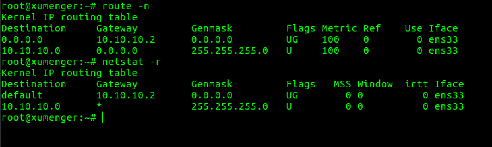
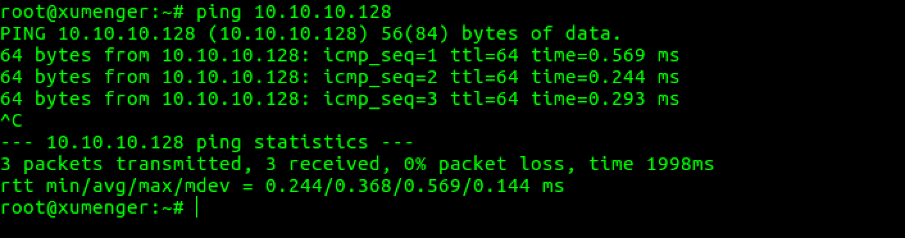
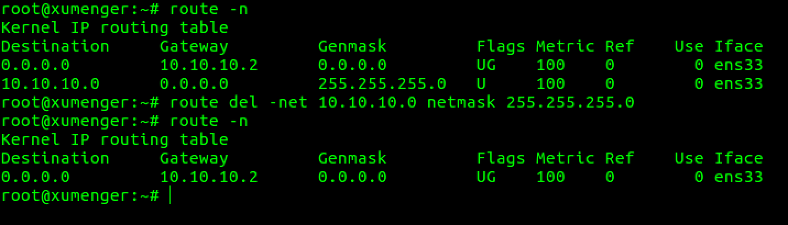
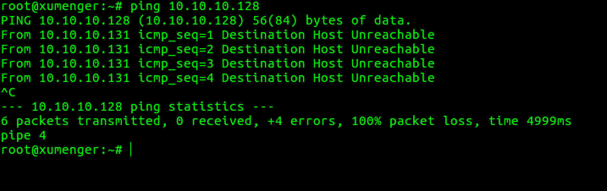
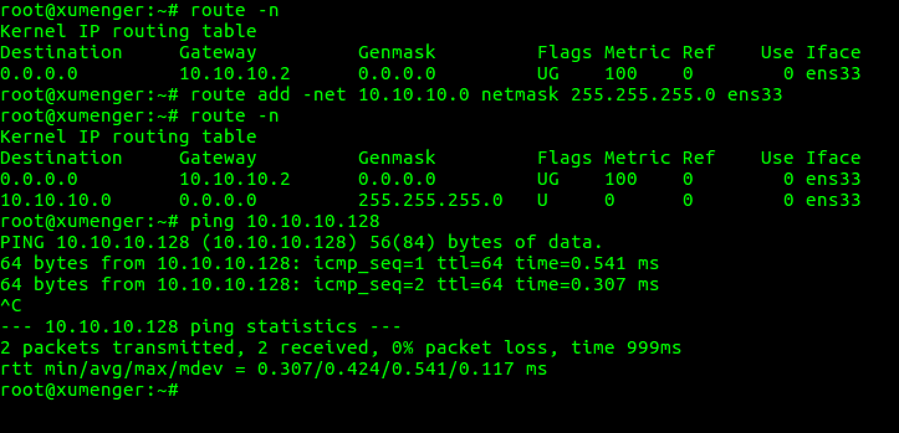

`route -n`或者`netstat -r`查看本机的路由表

本机的IP是`10.10.10.131`，试着去ping一下同一子网的`10.10.10.128`，ok，可以连通

因为`10.10.10.128`是和`10.10.10.131`同一内网的主机，所以走的是上面路由表中看到的那个10.10.10.0的路由

说明一下如果访问像[www.google.com](www.google.com)这样的外网，那么就会走0.0.0.0这个默认路由

接下来我们把10.10.10.0这个路由项删除`route del -net 10.10.10.0 netmask 255.255.255.0`

然后再去`ping 10.10.10.128`，现在无法通信了

然后把路由信息添加回去，但这次先不添加网关信息`route add -net 10.10.10.0 netmask 255.255.255.0 ens33`

发现现在两台主机又可以通信了

