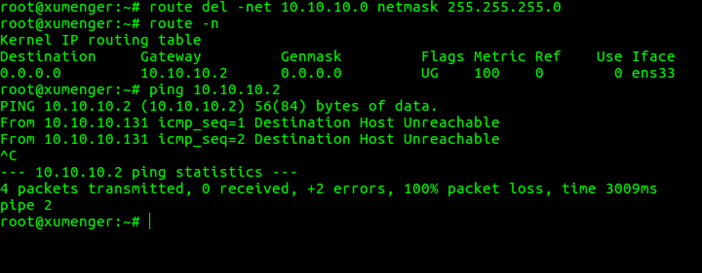
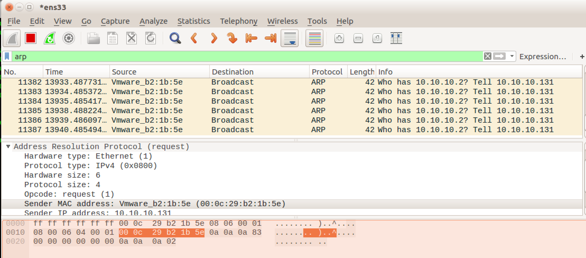

`route -n`或者`netstat -r`查看本机的路由表

本机的IP是`10.10.10.131`，试着去ping一下同一子网的`10.10.10.128`，ok，可以连通

因为`10.10.10.128`是和`10.10.10.131`同一内网的主机，所以走的是上面路由表中看到的那个10.10.10.0的路由

说明一下如果访问像[http://www.google.com](http://www.google.com)这样的外网，那么就会走0.0.0.0这个默认路由

接下来我们把10.10.10.0这个路由项删除`route del -net 10.10.10.0 netmask 255.255.255.0`

然后再去`ping 10.10.10.128`，现在无法通信了

然后把路由信息添加回去，但这次先不添加网关信息`route add -net 10.10.10.0 netmask 255.255.255.0 ens33`

发现现在两台主机又可以通信了

这里有一个疑问，当我把路由表中的10.10.10.0的路由项删除的时候，去ping 10.10.10.128，不还是有一个默认路由0.0.0.0的吗，这时候应该去走这个路由，然后经过这个路由表的网关10.10.10.2转发到10.10.10.128呀

我们去试一下，结果发现10.10.10.2这个网关本身也访问不到，所以当然走这条默认路由也是有问题的了

为什么10.10.10.2这个网关也访问不到呢，打开WireShark，过滤所有的ARP包，发现都是本机发起ARP请求以获取10.10.10.2对应的MAC地址信息的，但没有任何回复信息

因为获取不到Mac地址，所以当然没法通信，可能的原因比如是：10.10.10.2这台主机没有开机……

也正是因为10.10.10.2这个网关不可达，所以所有要经过默认路由出去的请求根本就走不通，比如想访问[http://www.google.com](http://www.google.com)、[http://www.baidu.com](http://www.baidu.com)这样的外网也就根本通不了

