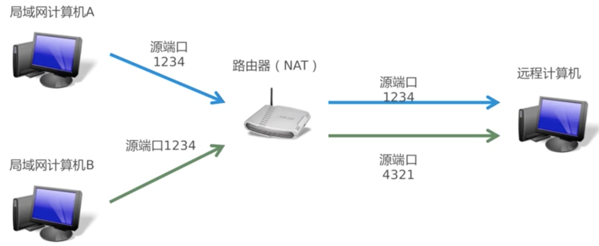

私有IP地址是指内部网络或主机的IP地址，公有IP地址是指在因特网上全球唯一的IP地址

RFC 1918为私有网络预留出三个IP地址块：

* A类：10.0.0.0 - 10.255.255.255
* B类：172.16.0.0 - 172.31.255.255
* C类：192.168.0.0 - 192.168.255.255

上述三个范围内的IP地址不会在因特网上被分配，因此可以不必向ISP或注册中心申请而在公司或企业内部自由使用，当在专用网内部的一些主机本来已经分配到了私有IP地址，但现在又想和因特网上的主机通信时（比如我在局域网内的计算机要访问[http://www.google.com](http://www.google.com)，那么就要用到NAT方法

## NAT实现方法

NAT实现方法有三种：

* 静态转换：Static Nat
* 动态转换：Dynamic Nat
* 端口多路复用：Port address Translation，PAT

**静态转换**是指将内部网络的私有IP地址转换为共有IP地址，IP地址是一对一的，是一成不变的，某个私有IP地址只转换为某个公用IP地址，借助于静态转换，可以实现外部网络对内部网络中某些特定设备（如服务器）的访问

**动态转换**是指将内部网络的私有IP地址转换为公用IP地址时，IP地址是不确定的、随机的，所有被授权访问上Internet的私有IP地址可随机转换为任何指定的合法IP地址。也就是说，只要指定哪些内部地址可以进行转换，以及哪些合法地址作为外部地址时，就可以进行动态转换。动态转换可以使用多个合法外部地址集。当ISP提供的合法IP地址略少于网络内部的计算机数量时，可以采用动态转换的方式

**端口多路复用**是指改变外出数据包的源端口并进行端口转换，即端口地址转换。内部网络的所有主机均可共享一个合法的外部IP地址实现对Internet的访问，从而可以最大限度地节约IP地址资源。同时，又可隐藏网络内部的所有主机，有效避免来自Internet的攻击

综上，端口多路复用技术是目前网络中应用最多的方式

## 端口多路复用

以一个简单的例子展示端口多路复用的逻辑

* 局域网内部的计算机A和计算机B同时用源端口1234发送了数据
* 很明显，这个端口就重复了
* 这个时候，路由器选择修改其中一台主机的源端口号
    * 比如修改计算机B的源端口号为4321
    * 具体的方法就是直接修改计算机B发出的TCP/UDP报文
* 然后再发送到远程计算机
* 源端口转换的同时，路由器会建立一个映射表
* 当远程计算机返回应答数据的时候
    * 路由器先按照映射表转换
    * 然后再发送到对应的内网主机上

通过以上对PAT的描述，其实也可以发现在网络安全防护上也会很有优势：如果黑客对这个IP地址的端口进行扫描的话，其实只是在扫描路由器，而路由器因为没有建立端口映射关系，所以不会把扫描端口的数据包转发到真实的计算机的，所以这个攻击是没有用的

平时我们的家用路由器基本就是端口多路复用的原理

