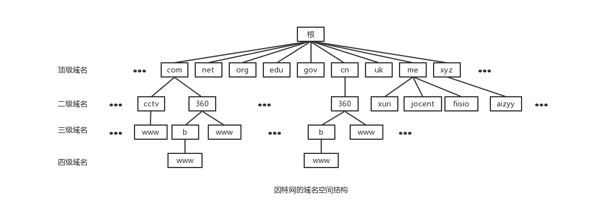
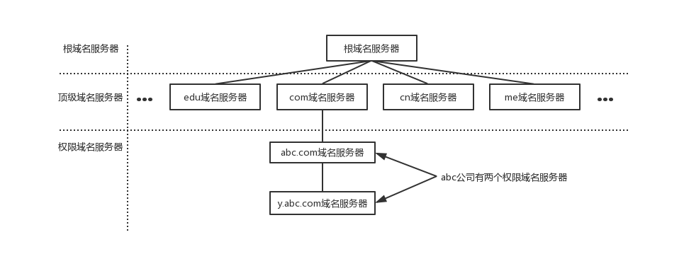
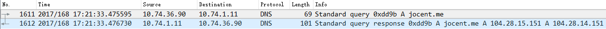
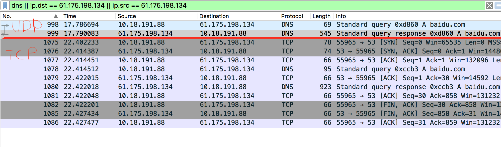
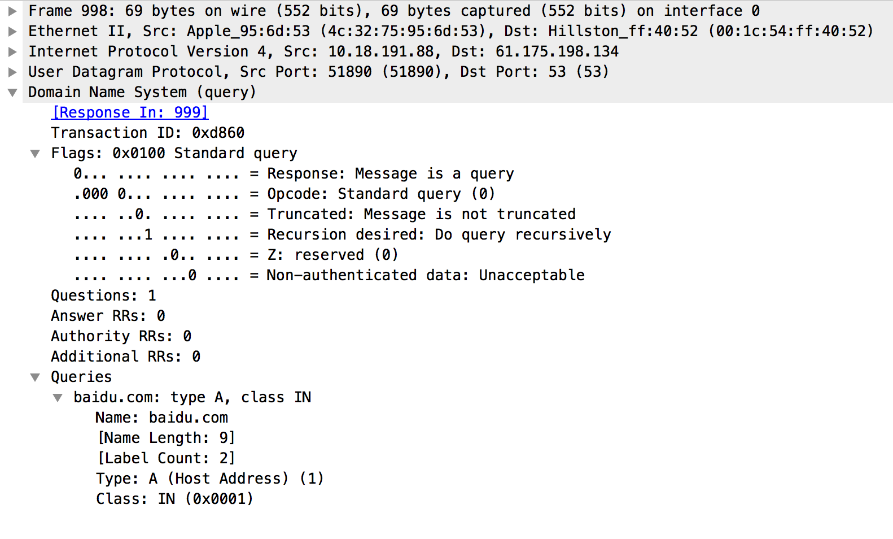
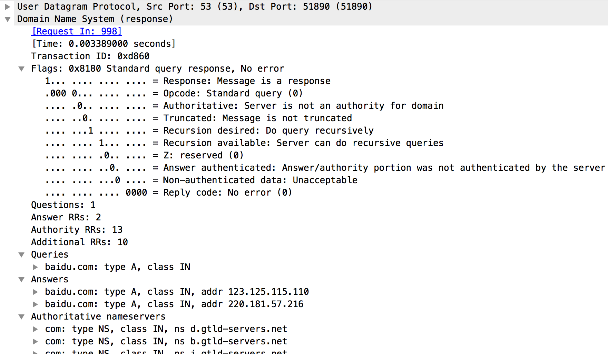

DNS是域名系统(Domain Name System)的缩写，主要用于解析如 www.google.com 这样的域名获取其对应的IP地址！

## 域名结构

为了保证域名的唯一性，因特网在命名的时候采用了层次结构的命名方式。每一个域名都是一个标号序列，用字母（A-Z、a-z，大小写等价）、数字（0-9）、和连接符（-）组成，标号序列总长度不能超过255个字符，它由点号分割成一个个的标号，每个标号应该在63个字符之内，每个标号都可以看成一个层次的域名。级别最低的域名写在左边，级别最高的域名写在右边

域名服务主要是基于UDP实现的，服务器的端口号为53

比如域名 www.360.com ，由点号分割成三个域名 www、360、com，其中 com 是顶级域名（TLD，Top Level Domain），360 是二级域名（SLD，Second Level Domain），www 是三级域名

关于域名的层次结构，如下图

>很明显是一个树形结构！

## 域名服务器

有域名结构还不行，还需要有一个东西去解析域名。域名需要由遍及全世界的域名服务器去解析，域名服务器实际上就是装有域名系统的主机。由高向低进行层次划分，可以分为这么几类

**根域名服务器**

最高层次的域名服务器，也是最重要的域名服务器，本地域名服务器如果解析不了域名就会向根域名服务器求助

全球共有13个不同IP地址的根域名服务器，它们的名称用一个英文字母命名，从a一直到m。这些服务器由各种组织控制，并由ICANN（互联网名称和数字地址分配公司）授权，由于每分钟都要解析的名称数量多得令人难以置信，所以实际上每个根服务器都有镜像服务器，**每个根服务器与它的镜像服务器共享同一个IP地址**，中国大陆地区只有6组根服务器镜像

当你对某个根服务器发出请求时，请求会被路由到该根服务器离你最近的镜像服务器。所有的根域名服务器都知道所有的顶级域名服务器的域名和地址，如果向根服务器发出对`www.360.com`的请求，则根服务器时不能在它的记录文件中找到与`www.360.com`匹配的记录的，但它会找到`com`的顶级域名记录，并把负责`com`地址的顶级域名服务器的地址发会给请求这

**顶级域名服务器**

顶级域名服务器负责在该顶级域名服务器下注册的二级域名。当根域名服务器告诉查询顶级域名服务器地址时，查询者紧接着就会到顶级域名服务器进行查询

比如查询`test.com`，根域名服务器已经告诉了查询者`com`顶级域名服务器的地址，`com`顶级域名服务器会找到`test.com`的域名服务器的记录，域名服务器检查其区域文件，并发现它有与`test.com`相关联的区域文件。在此文件的内部，有该主机的记录。此记录说明此主机所在的IP地址，并向请求者返回最终答案

**权限域名服务器**

负责一个区的域名解析工作

**本地域名服务器**

当一个主机发出DNS查询请求的时候，这个查询请求首先就是发给本地域名服务器的

## 域名解析过程

域名解析总体分为两个步骤！

第一个步骤是本机向本地域名服务器发出一个DNS请求报文，报文里携带需要查询的域名

第二个步骤是本地域名服务器向本机回应一个DNS响应报文，里面包含域名对应的IP地址。从下面对`jocent.me`进行域名解析的报文中可以明显看出这两个步骤

>注意，第二大步骤中采用的是迭代查询，其实是包含了很多小步骤的

* 主机10.74.36.90先向本地域名服务器10.74.1.11进行**递归查询**
* 本地域名服务器采用**迭代查询**，向一个根域名服务器进行查询
* 根域名服务器告诉本地域名服务器，下一次应该查询的顶级域名服务器`dns.com`的IP地址
* 本地域名服务器向顶级域名服务器`dns.me`进行查询
* 顶级域名服务器`me`告诉本地域名服务器，下一步查询权限服务器`dns.jocent.com`的IP地址
* 本地域名服务器向权限域名服务器`dns.jocent.me`进行查询
* 权限域名服务器`dns.jocent.me`告诉本地域名服务器所查询的主机的IP地址
* 本地域名服务器最后把查询结果告诉10.74.36.90

**递归查询**

本机向本地域名服务器发起一次查询请求，就静待最终的结果

如果本地域名服务器无法解析，自己会以DNS客户机的身份向其他域名服务器进行查询，直到最终的IP地址告诉本机

**迭代查询**

本机域名服务器向根域名服务器查询，根域名服务器告诉它下一步到哪里去查询，然后它再去查，每次它都是以客户机的身份去各个服务器查询

## 为什么DNS更适合用UDP

使用nslookup先使用基于UDP的DNS查询 baidu.com的IP，再用基于TCP的DNS查询

这个过程使用WireShark抓包的结果是这样的

很明显使用基于UDP的DNS协议只要一个请求、一个应答就好了

而使用基于TCP的DNS协议要三次握手、发送数据以及应答、四次挥手

明显基于TCP协议的DNS更浪费网络资源！

当然以上只是从数据包的数量以及占有网络资源的层面来进行的分析，那数据一致性层面呢？

DNS数据包不是那种大数据包，所以使用UDP不需要考虑分包，如果丢包那么就是全部丢包，如果收到了数据，那就是收到了全部数据！所以只需要考虑丢包的情况，那就算是丢包了，重新请求一次就好了。而且DNS的报文允许填入序号字段，对于请求报文和其对应的应答报文，这个字段是相同的，通过它可以区分DNS应答是对应的哪个请求

## 附上DNS协议格式

**会话标识(2字节)**

是DNS报文的ID标识，对于请求报文和其对应的应答报文，这个字段是相同的，通过它可以区分DNS应答是对应的哪个请求

**标志(2字节)**

标志(bit数)   | 解释
--------------|-----------------
QR(1bit)      | 查询/响应标志，0为查询，1为响应
opcode(4bit)  | 0表示标准查询，1表示反向查询，2表示服务器状态请求
AA(1bit)      | 表示授权回答
TC(1bit)      | 表示可截断的
RD(1bit)      | 表示期望递归
RA(1bit)      | 表示可用递归
rcode(4bit)   | 表示返回码，0表示没有差错，3表示名字差错，2表示服务器错误（Server Failure）

**数量字段**

Questions、Answer RRs、Authority RRs、Additional RRs 各自表示后面的四个区域的数目

Questions表示查询问题区域节的数量

Answers表示回答区域的数量

Authoritative nameservers表示授权区域的数量

Additional records表示附加区域的数量

>更详细的内容参见[《DNS协议详解及报文格式分析》](https://blog.csdn.net/tianxuhong/article/details/74922454)

**实例展示**

上面使用DNS查询 baidu.com 的例子中，分别看一下请求和应答报文的抓包情况

请求报文

应答报文

