## 测试环境

作为客户端的主机的网卡配置信息如下

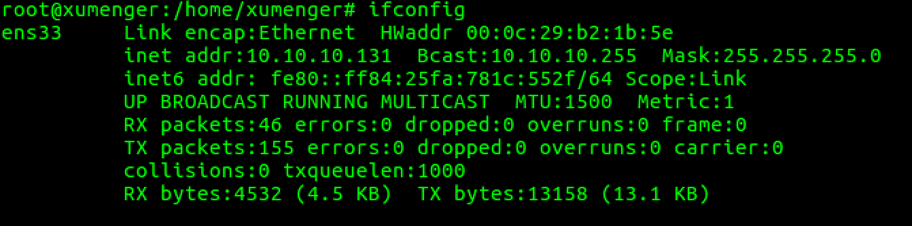

作为服务端的主机的网卡配置信息如下

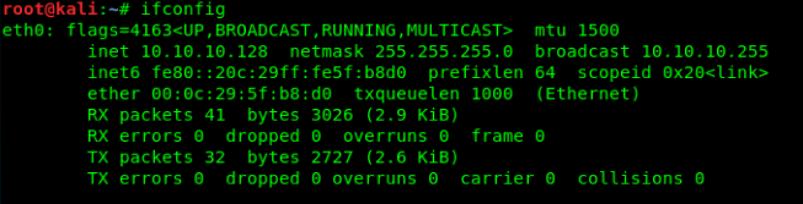

## 测试步骤

客户端和服务端分别开启WireShark设置过滤条件为

>(ip.dst==10.10.10.128 && ip.src==10.10.10.131) || (ip.src==10.10.10.128  && ip.dst==10.10.10.131)

使用WireShark抓包看到的seq是从0开始、ack是从1开始的，其实这些都是WireShark对真实数据处理后的结果，真实的TCP包的序号开始值是内核随机选择的，可以通过WireShark的菜单修改配置以显示真实的seq、ack

菜单路径是：【Edit】->【Preferences】->【Protocols】->【TCP】，按照下面的方式取消勾选【Relative sequence numbers】

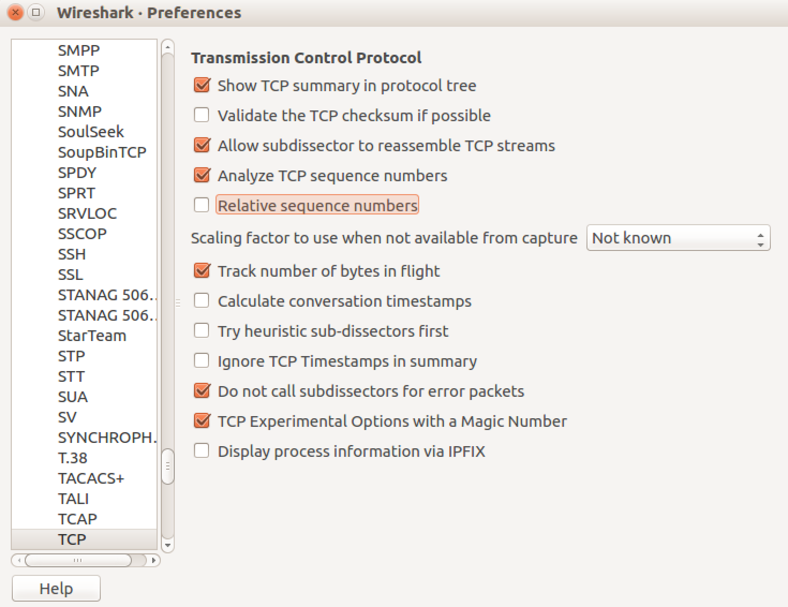

服务端使用nc监听在1234端口

>nc -lp 1234

客户端使用nc连接到服务端

>nc 10.10.10.128 1234

在WireShark上可以看到抓到了TCP三次握手包

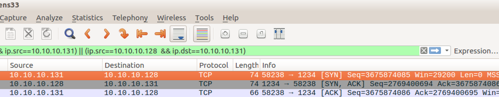

* Client -> Server: Seq(1,C) = 3675874085
* Server -> Client: Seq(1,S) = 2769400694, Ack(1,S) = 3675874086 = Seq(1,C) + 1
* Client -> Server: Seq(2,C) = 3675874086 = Seq(1,C) + 1, Ack(2,C) = 2769400695 = Seq(1,S) + 1

>服务端发送Ack=3675874086给客户端，表示服务端期望客户端下次发送的数据包的Seq是3675874086

>客户端发送给服务端的Ack也是一样的作用！

客户端发送 123 数据到服务端（实际发送出去的数据会在123后添加0x0A，所以其实一共发出去4字节）

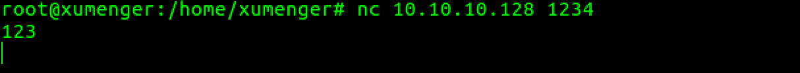

对应在WireShark也抓到了这次数据包

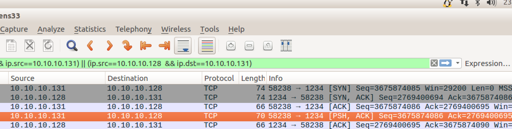

* Client -> Server: Seq(3,C) = 3675874086 = Seq(2,C), Ack(3,C) = 2769400695 = Ack(2,C), Len(3,C) = 4
* Server -> Client: Seq(2,S) = 2769400695, Ack(2,S) = 3675874090 = Seq(3,C) + Len(3,C)

客户端再发送 1234 数据到服务端（实际发送出去的数据会在1234后添加0x0A，所以其实一共发出去5字节）

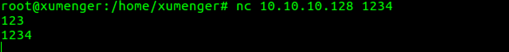

对应在WireShark中也抓到了这次数据包

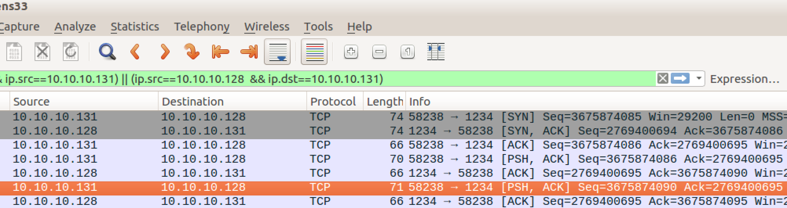

* Client -> Server: Seq(4,C) = 3675874090 = Ack(2,S) = Seq(3,C) + Len(3,C), Ack(4,C) = 2769400695, Len(4,C) = 5
* Server -> Client: Seq(3,S) = 2769400695, Ack(3,S) = 3675874095 = Seq(4,C) + Len(4,C)

以上都是拿客户端发送数据到服务端来展示客户端和服务端Seq、Ack的变化规律

下面测试一下服务端发送数据到客户端时，客户端和服务端的Seq、Ack分别的变化规律

服务端发送 abc 数据到客户端（实际发送出去的数据会在abc后添加0x0A，所以其实一共发出去4字节）

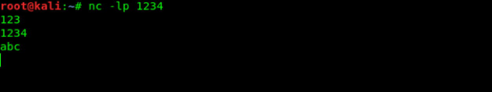

对应在WireShark中抓到这次数据包

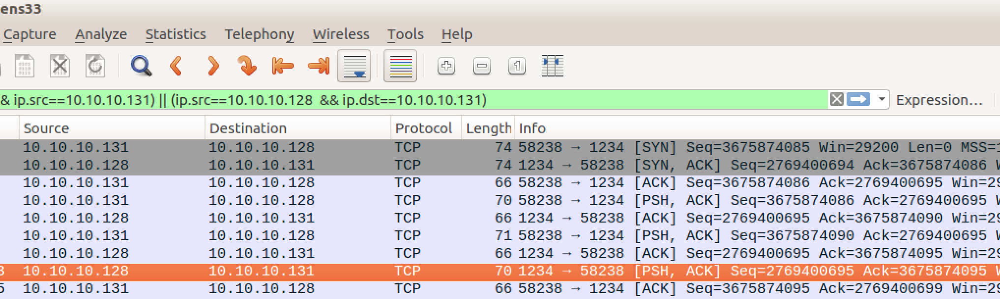

* Server -> Client: Seq(4,S) = 2769400695, Ack(4,S) = 3675874095, Len(4,S) = 4
* Client -> Server: Seq(5,C) = 3675874095, Ack(5,C) = 2769400699 = Seq(4,S) + Len(4,S)

然后在服务端[Ctrl-C]关闭服务端（注意这是服务端主动断开连接的）

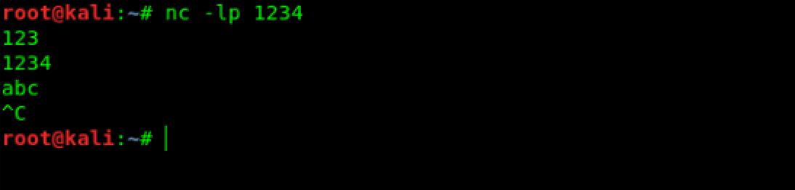

在WireShark抓包数据可以看到有四次挥手的过程

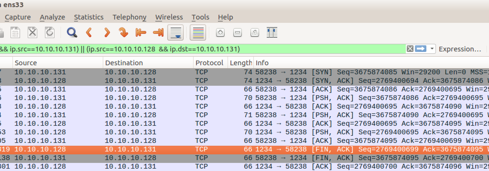

* Server -> Client: Seq(5,S) = 2769400699, Ack(5,S) = 3675874095
* Client -> Server: Seq(6,C) = 3675874095, Ack(6,C) = 2769400700 = Seq(5,S) + 1
* Server -> Client: Seq(6,S) = 2769400700, Ack(6,S) = 3675874096 = Seq(6,C) + 1

注意，虽然是四次挥手，但只发送了3个数据包！这里解释一下！

TCP是全双工的连接，所以断开连接的时候，两个方向的连接要分别断开，流程是这样的：

1. 主动方：Fin, Ack=z, Seq=x
2. 被动方：Ack=x+1, Seq=z
3. 被动方：Fin, Ack=x, seq=y
4. 主动方：Ack=y, seq=x

而真实的网络传输中往往把第2步、第3步的过程放在一个包里完成，也就是将对第一步的确认[Ack]和自己的主动断开[Fin]放在一个包中

