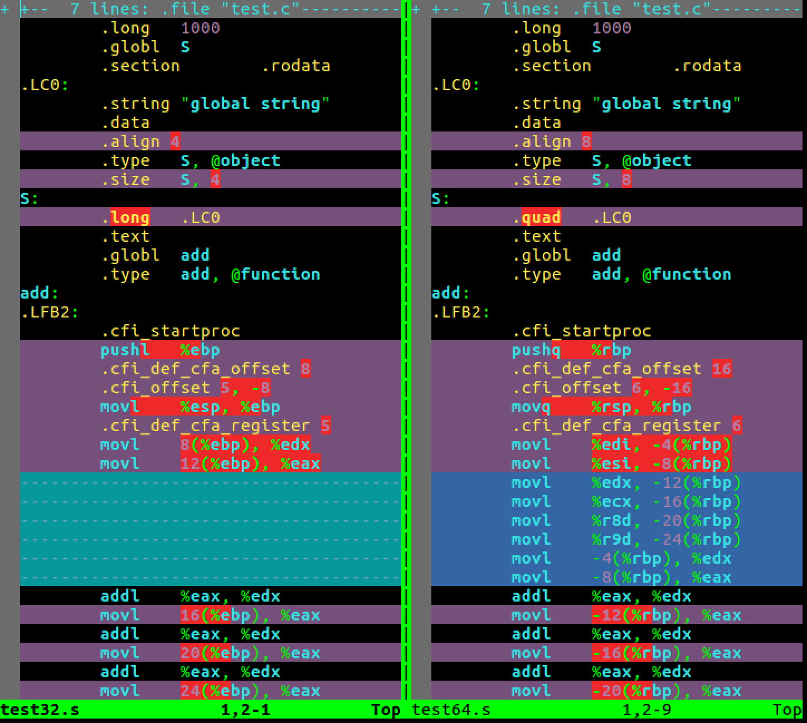

首先使用C编写test.c源文件，程序中包括if判断、for循环、函数调用、全局变量、局部变量等C语言的要素

```c
#include <stdio.h>
#include <stdlib.h>
#include <string.h>

//全局变量
int G = 1000;
char *S = "global string";


int add(int a, int b, int c, int d, int e, int f, int g, int h, int i)
{
    return a + b + c + d + e + f + g + h + i;
}

int ADD(int a, int b, int c, int d, int e, int f, int g, int h, int i)
{
    return add(a, b, c, d, e, f, g, h, i);
}

int main()
{
    //局部变量
    char str[8];
    int i = 0;
    
    //循环
    for(i=0; i<7; i++){
        str[i] = 'a';
    }
    str[7] = '\0';

    //判断
    if(strlen(str) < 6){
        printf("strlen(str) < 6\n");
    }
    else{
        printf("strlen(str) >= 6\n");
    }

    //函数调用
    int c = ADD(1, 2, 3, 4, 5, 6, 7, 8, 9);

    return 0;
}
```

## 编译得到32位的汇编指令

>gcc -m32 -S test.c -o test32.s

test32.s的内容如下

```assembly
	.file	"test.c"
	.globl	G
	.data
	.align 4
	.type	G, @object
	.size	G, 4
G:
	.long	1000
	.globl	S
	.section	.rodata
.LC0:
	.string	"global string"
	.data
	.align 4
	.type	S, @object
	.size	S, 4
S:
	.long	.LC0
	.text
	.globl	add
	.type	add, @function
add:
.LFB2:
	.cfi_startproc
	pushl	%ebp
	.cfi_def_cfa_offset 8
	.cfi_offset 5, -8
	movl	%esp, %ebp
	.cfi_def_cfa_register 5
	movl	8(%ebp), %edx
	movl	12(%ebp), %eax
	addl	%eax, %edx
	movl	16(%ebp), %eax
	addl	%eax, %edx
	movl	20(%ebp), %eax
	addl	%eax, %edx
	movl	24(%ebp), %eax
	addl	%eax, %edx
	movl	28(%ebp), %eax
	addl	%eax, %edx
	movl	32(%ebp), %eax
	addl	%eax, %edx
	movl	36(%ebp), %eax
	addl	%eax, %edx
	movl	40(%ebp), %eax
	addl	%edx, %eax
	popl	%ebp
	.cfi_restore 5
	.cfi_def_cfa 4, 4
	ret
	.cfi_endproc
.LFE2:
	.size	add, .-add
	.globl	ADD
	.type	ADD, @function
ADD:
.LFB3:
	.cfi_startproc
	pushl	%ebp
	.cfi_def_cfa_offset 8
	.cfi_offset 5, -8
	movl	%esp, %ebp
	.cfi_def_cfa_register 5
	pushl	40(%ebp)
	pushl	36(%ebp)
	pushl	32(%ebp)
	pushl	28(%ebp)
	pushl	24(%ebp)
	pushl	20(%ebp)
	pushl	16(%ebp)
	pushl	12(%ebp)
	pushl	8(%ebp)
	call	add
	addl	$36, %esp
	leave
	.cfi_restore 5
	.cfi_def_cfa 4, 4
	ret
	.cfi_endproc
.LFE3:
	.size	ADD, .-ADD
	.section	.rodata
.LC1:
	.string	"strlen(str) < 6"
.LC2:
	.string	"strlen(str) >= 6"
	.text
	.globl	main
	.type	main, @function
main:
.LFB4:
	.cfi_startproc
	leal	4(%esp), %ecx
	.cfi_def_cfa 1, 0
	andl	$-16, %esp
	pushl	-4(%ecx)
	pushl	%ebp
	.cfi_escape 0x10,0x5,0x2,0x75,0
	movl	%esp, %ebp
	pushl	%ecx
	.cfi_escape 0xf,0x3,0x75,0x7c,0x6
	subl	$36, %esp
	movl	%gs:20, %eax
	movl	%eax, -12(%ebp)
	xorl	%eax, %eax
	movl	$0, -28(%ebp)
	movl	$0, -28(%ebp)
	jmp	.L6
.L7:
	leal	-20(%ebp), %edx
	movl	-28(%ebp), %eax
	addl	%edx, %eax
	movb	$97, (%eax)
	addl	$1, -28(%ebp)
.L6:
	cmpl	$6, -28(%ebp)
	jle	.L7
	movb	$0, -13(%ebp)
	subl	$12, %esp
	leal	-20(%ebp), %eax
	pushl	%eax
	call	strlen
	addl	$16, %esp
	cmpl	$5, %eax
	ja	.L8
	subl	$12, %esp
	pushl	$.LC1
	call	puts
	addl	$16, %esp
	jmp	.L9
.L8:
	subl	$12, %esp
	pushl	$.LC2
	call	puts
	addl	$16, %esp
.L9:
	subl	$12, %esp
	pushl	$9
	pushl	$8
	pushl	$7
	pushl	$6
	pushl	$5
	pushl	$4
	pushl	$3
	pushl	$2
	pushl	$1
	call	ADD
	addl	$48, %esp
	movl	%eax, -24(%ebp)
	movl	$0, %eax
	movl	-12(%ebp), %ecx
	xorl	%gs:20, %ecx
	je	.L11
	call	__stack_chk_fail
.L11:
	movl	-4(%ebp), %ecx
	.cfi_def_cfa 1, 0
	leave
	.cfi_restore 5
	leal	-4(%ecx), %esp
	.cfi_def_cfa 4, 4
	ret
	.cfi_endproc
.LFE4:
	.size	main, .-main
	.ident	"GCC: (Ubuntu 5.4.0-6ubuntu1~16.04.9) 5.4.0 20160609"
	.section	.note.GNU-stack,"",@progbits
```

## 编译得到64位的汇编指令

>gcc -S test.c -o test64.s

这次的汇编内容如下

```assembly
	.file	"test.c"
	.globl	G
	.data
	.align 4
	.type	G, @object
	.size	G, 4
G:
	.long	1000
	.globl	S
	.section	.rodata
.LC0:
	.string	"global string"
	.data
	.align 8
	.type	S, @object
	.size	S, 8
S:
	.quad	.LC0
	.text
	.globl	add
	.type	add, @function
add:
.LFB2:
	.cfi_startproc
	pushq	%rbp
	.cfi_def_cfa_offset 16
	.cfi_offset 6, -16
	movq	%rsp, %rbp
	.cfi_def_cfa_register 6
	movl	%edi, -4(%rbp)
	movl	%esi, -8(%rbp)
	movl	%edx, -12(%rbp)
	movl	%ecx, -16(%rbp)
	movl	%r8d, -20(%rbp)
	movl	%r9d, -24(%rbp)
	movl	-4(%rbp), %edx
	movl	-8(%rbp), %eax
	addl	%eax, %edx
	movl	-12(%rbp), %eax
	addl	%eax, %edx
	movl	-16(%rbp), %eax
	addl	%eax, %edx
	movl	-20(%rbp), %eax
	addl	%eax, %edx
	movl	-24(%rbp), %eax
	addl	%eax, %edx
	movl	16(%rbp), %eax
	addl	%eax, %edx
	movl	24(%rbp), %eax
	addl	%eax, %edx
	movl	32(%rbp), %eax
	addl	%edx, %eax
	popq	%rbp
	.cfi_def_cfa 7, 8
	ret
	.cfi_endproc
.LFE2:
	.size	add, .-add
	.globl	ADD
	.type	ADD, @function
ADD:
.LFB3:
	.cfi_startproc
	pushq	%rbp
	.cfi_def_cfa_offset 16
	.cfi_offset 6, -16
	movq	%rsp, %rbp
	.cfi_def_cfa_register 6
	subq	$24, %rsp
	movl	%edi, -4(%rbp)
	movl	%esi, -8(%rbp)
	movl	%edx, -12(%rbp)
	movl	%ecx, -16(%rbp)
	movl	%r8d, -20(%rbp)
	movl	%r9d, -24(%rbp)
	movl	-24(%rbp), %r9d
	movl	-20(%rbp), %r8d
	movl	-16(%rbp), %ecx
	movl	-12(%rbp), %edx
	movl	-8(%rbp), %esi
	movl	-4(%rbp), %eax
	movl	32(%rbp), %edi
	pushq	%rdi
	movl	24(%rbp), %edi
	pushq	%rdi
	movl	16(%rbp), %edi
	pushq	%rdi
	movl	%eax, %edi
	call	add
	addq	$24, %rsp
	leave
	.cfi_def_cfa 7, 8
	ret
	.cfi_endproc
.LFE3:
	.size	ADD, .-ADD
	.section	.rodata
.LC1:
	.string	"strlen(str) < 6"
.LC2:
	.string	"strlen(str) >= 6"
	.text
	.globl	main
	.type	main, @function
main:
.LFB4:
	.cfi_startproc
	pushq	%rbp
	.cfi_def_cfa_offset 16
	.cfi_offset 6, -16
	movq	%rsp, %rbp
	.cfi_def_cfa_register 6
	subq	$32, %rsp
	movq	%fs:40, %rax
	movq	%rax, -8(%rbp)
	xorl	%eax, %eax
	movl	$0, -24(%rbp)
	movl	$0, -24(%rbp)
	jmp	.L6
.L7:
	movl	-24(%rbp), %eax
	cltq
	movb	$97, -16(%rbp,%rax)
	addl	$1, -24(%rbp)
.L6:
	cmpl	$6, -24(%rbp)
	jle	.L7
	movb	$0, -9(%rbp)
	leaq	-16(%rbp), %rax
	movq	%rax, %rdi
	call	strlen
	cmpq	$5, %rax
	ja	.L8
	movl	$.LC1, %edi
	call	puts
	jmp	.L9
.L8:
	movl	$.LC2, %edi
	call	puts
.L9:
	subq	$8, %rsp
	pushq	$9
	pushq	$8
	pushq	$7
	movl	$6, %r9d
	movl	$5, %r8d
	movl	$4, %ecx
	movl	$3, %edx
	movl	$2, %esi
	movl	$1, %edi
	call	ADD
	addq	$32, %rsp
	movl	%eax, -20(%rbp)
	movl	$0, %eax
	movq	-8(%rbp), %rdx
	xorq	%fs:40, %rdx
	je	.L11
	call	__stack_chk_fail
.L11:
	leave
	.cfi_def_cfa 7, 8
	ret
	.cfi_endproc
.LFE4:
	.size	main, .-main
	.ident	"GCC: (Ubuntu 5.4.0-6ubuntu1~16.04.9) 5.4.0 20160609"
	.section	.note.GNU-stack,"",@progbits
```

## 说明

上面分别得到32位和64位的汇编代码，可以使用下面的命令先简单看一下它们在代码层面的区别

>vimdiff test32.s test64.s



后面的系列章节会对32、64位汇编指令进行详细讲解

