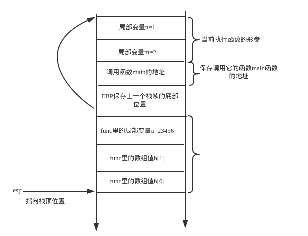

按照正常的思路，函数的局部变量应该是顺序入栈的，也就是说最先声明的变量最先入栈，最后声明的变量最后入栈

因为栈内存是从高地址向低地址增长的，所以先声明的变量在栈中的地址应该是高地址，后声明的变量在栈中是低地址

但事实是这样吗？

我们编写一个程序看一下

```c
#include <stdio.h>
#include <unistd.h>
#include <stdlib.h>

void func(int m, int n)
{
    int a = 123;
    int b[4];
    int c = 456;
    int d;
    int e = 789;
    int f[3] = {1, 2, 4};
    int g[2];
    printf("%p\n%p\n%p\n%p\n%p\n%p\n%p\n", &a, b, &c, &d, &e, f, g);
}

int main(int argc, char **argv, char **env)
{
    func(2, 1);
    return 0;
}

```

按理来说，输出的临时变量地址的顺序应该是：a > b > c > d > e > f > g，但实际编译运行的效果是这样的



结果我们发现实际运行时临时变量在栈上的顺序完全不是预期的那样：

* b的地址是最大的，也就是说b是在栈底，而不是预期的a
* 预期f的地址是最小的，但实际它是第二大的

## 看一下汇编代码

为什么会这样呢？我们看一下汇编代码来找一下答案

>gcc -m32 -S test.c -o test.s

汇编的内容是（我们只取出其中func的汇编代码部分分析即可）

```
func:
.LFB2:
    .cfi_startproc
    pushl   %ebp
    .cfi_def_cfa_offset 8
    .cfi_offset 5, -8
    movl    %esp, %ebp
    .cfi_def_cfa_register 5
    subl    $72, %esp
    movl    %gs:20, %eax
    movl    %eax, -12(%ebp)
    xorl    %eax, %eax

    ; a = 123;
    movl    $123, -64(%ebp)

    ; c = 456
    movl    $456, -60(%ebp)

    ; c和e之间有个d，因为d未初始化，所以没有对应的movl赋值指令
    ; 但从汇编指令看，c的地址是-60(%ebp)，e的地址是-52(%ebp)
    ; 中间空着的-56(%ebp)就是d的地址！

    ; e = 789
    movl    $789, -52(%ebp)

    ; 对f的三个元素的赋值
    movl    $1, -40(%ebp)
    movl    $2, -36(%ebp)
    movl    $4, -32(%ebp)

    ; 调用函数是参数入栈的顺序是固定的，从右到左（不严谨，具体还是和调用约定有关的）

    ; 最右边的参数g, 地址是-48(%ebp)
    leal    -48(%ebp), %eax
    pushl   %eax

    ; f, -40(%ebp)
    leal    -40(%ebp), %eax
    pushl   %eax

    ; e, -52(%ebp)
    leal    -52(%ebp), %eax
    pushl   %eax

    ; d, -56(%ebp)
    leal    -56(%ebp), %eax
    pushl   %eax

    ; c, -60(%ebp)
    leal    -60(%ebp), %eax
    pushl   %eax

    ; b, -28(%ebp)
    leal    -28(%ebp), %eax
    pushl   %eax

    ; a, -64(%ebp)
    leal    -64(%ebp), %eax
    pushl   %eax

    pushl   $.LC0
    call    printf
    addl    $32, %esp
    nop
    movl    -12(%ebp), %eax
    xorl    %gs:20, %eax
    je  .L2
    call    __stack_chk_fail
```

所以函数内部的局部变量并不是按照声明的顺序入栈的，这个一定要小心。具体按照什么顺序入栈的，直接去参考对应的汇编代码最为可靠！

就目前看到的情况：

* 数组和单一变量之间存在区别
* 未赋值和赋值的变量之间存在区别

另外到目前为止，我们看到的函数调用的参数都是按照顺序从右到左入栈的！
