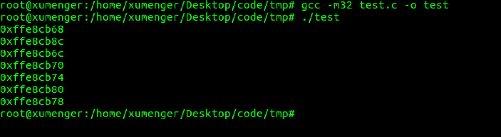

上面几篇文章简单的从汇编层面对C的执行逻辑、函数调用进行了分析，这篇文章来展示一个简单的栈溢出漏洞！

先编写一个简单的程序

```c
#include <stdio.h>
#include <unistd.h>
#include <stdlib.h>

void func(int m, int n)
{
    int a = 23456;
    int b[2];
    printf("b[2] = %d\n", b[2]);    //发生栈溢出
}

int main(int argc, char **argv, char **env)
{
    func(2, 1);
    return 0;
}
```

当调用func函数时，保存起进程地址空间的栈时这样的



正如我在[《Linux-C逆向工程基础：函数调用分析》](http://www.xumenger.com/linux-c-asm-3-20180606/)中简单分析的那样

* main在调用func之前，先要把参数压栈
    * 也就是为什么上图栈底前两个格子是局部变量 n=1, m=2
* (?)调用函数main的地址
* func函数的开始会`push ebp`，保存上个函数的ebp指针
    * 所以上图第四个格子是main的EBP指针
    * EBP就是保存当前函数的栈底地址
    * 因为函数调用的层次关系，当前函数的调用者的EBP就耀保存在栈上
* 函数内部的局部变量也是压到栈上存储的
    * 所以func中的a、b[0]、b[1]都是存在在栈上的
    * 上图栈顶的三个格子

上图中第三格[调用函数main的地址]存储的是什么？上面初步总结的时候没有详细说明！

当调用完func函数的时候，程序是不是直接退出了？当然不是，程序会接着执行调用func函数的这个函数，也就是本例中的main函数

那么系统要运行这个函数首先得要知道这个函数的地址吧，所以当func执行完的时候，首先就可以在栈上获取main的地址，eip指针指向这个函数地址就可以继续执行main函数了

而且main函数的EBP指针也都保存在栈上，都可以在func执行完后从栈上获取到！

## 
