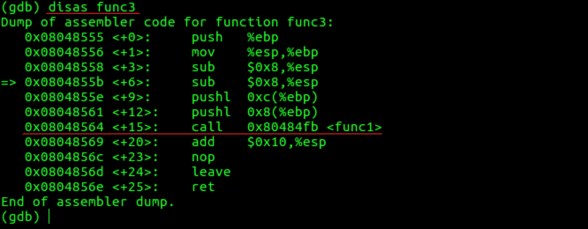

上面几篇文章简单的从汇编层面对C的执行逻辑、函数调用进行了分析，这篇文章来展示一个简单的栈溢出漏洞！

下面使用x86程序进行测试，x64的程序可以自己参考本文研究

先编写一个简单的程序

```c
#include <stdio.h>
#include <unistd.h>
#include <stdlib.h>

void func(int m, int n)
{
    int a = 23456;
    int b[3];
    printf("&b[0] = %p, &b[1] = %p, &b[2] = %p\n", &b[0], &b[1], &b[2]);
    printf("&a = %p\n", &a);
    printf("b[-1] = %d\n", b[-1]);
}

int main(int argc, char **argv, char **env)
{
    func(2, 1);
    return 0;
}
```

当调用func函数时，保存起进程地址空间的栈时这样的


正如我在[《Linux-C逆向工程基础：函数调用分析》](http://www.xumenger.com/linux-c-asm-3-20180606/)中简单分析的那样

* main在调用func之前，先要把参数压栈
    * 也就是为什么上图栈底前两个格子是局部变量 n=1, m=2
* (?)调用函数main的地址
* func函数的开始会`push ebp`，保存上个函数的ebp指针
    * 所以上图第四个格子是main的EBP指针
    * EBP就是保存当前函数的栈底地址
    * 因为函数调用的层次关系，当前函数的调用者的EBP就要保存在栈上
* 函数内部的局部变量也是压到栈上存储的
    * 所以func中的a、b[0]、b[1]、b[2]都是存在在栈上的
    * 上图栈顶的四个格子
    * 参考[《Linux-C逆向工程基础：函数局部变量的入栈顺序》](http://www.xumenger.com/linux-c-asm-4-20180606/)

编译运行上面的程序，看到b[-1]索引到了a临时变量的位置，所以输出了a变量的值


上图中第三格[调用函数main的地址]存储的是什么？上面初步总结的时候没有详细说明！

当调用完func函数的时候，程序是不是直接退出了？当然不是，程序会接着执行调用func函数的这个函数，也就是本例中的main函数

那么系统要运行这个函数首先得要知道这个函数的地址吧，所以当func执行完的时候，首先就可以在栈上获取main的地址，eip指针指向这个函数地址就可以继续执行main函数了

>注意：这里并不是main函数的起始地址，而是main上次执行到的那个地址，这样才能保证func执行完成后，继续从main函数上次执行到的地方继续执行，而不是从main函数开始的地方执行

而且main函数的EBP指针也都保存在栈上，都可以在func执行完后从栈上获取到！

>[《Linux-C逆向工程基础：函数调用分析》](http://www.xumenger.com/linux-c-asm-3-20180606/)没有讲解到栈上保存函数地址的问题，这里简单补充一下！

具体是如何实现的呢？其实就是用到了call和ret指令

* 调用者执行call的时候，主要有两个动作
    * 把eip指针的值压入到栈上
    * 将eip指向调用函数的地址
* ret则是被调用者执行的指令，主要是两个动作
    * 把保存在栈上的原来的eip值加载上来
    * 将加载上来的值写到eip寄存器中，这样接下来CPU就会跳转到eip执行的地址处继续执行

所以这就是我们看到在汇编中调用函数要用call指令，函数结束后要用ret指令！

## 利用栈溢出修改数据

上面的例子，如果给b[-1]赋值为0，那么a还会是23456吗？

当然不是了！因为&b[-1]和&a是一样的地址，改变b[-1]对应的a也就改变了，那么如果我依次类推给b[-2],b[-3],b[-4]…依次赋个值呢

程序修改成这样

```c
#include <stdio.h>
#include <unistd.h>
#include <stdlib.h>

void func(int m, int n)
{
    int a = 23456;
    int b[3];
    printf("a = %d\n", a);
    b[-1] = 0;
    printf("a = %d\n", a);
}

int main(int argc, char **argv, char **env)
{
    func(2, 1);
    return 0;
}
```

现在修改了b[-1]的值，其实是间接修改了a的值


## 利用栈溢出改变执行逻辑

>在计算机中，数据和指令都是用数字表示的！

编写下面的程序

```c
#include <stdio.h>
#include <string.h>

void func1(char *s, int n)
{
    char a[4];
    memcpy(a, s, n);
}

void func2(void)
{
    printf("hello,world\n");
}

void func3(char *s, int n)
{
    func1(s, n);
}

//暂不考虑越界问题和非法字符的问题
int str_to_int(char *s){
    int i = 0;
    int ret = 0;
    for(i=0; i<strlen(s); i++){
        ret = ret * 10 + s[i] - '0';
    }
    return ret;
}

int main(int argc, char **argv)
{
    void (*p)(void);

    int N = str_to_int(argv[1]);

    char a[N];
    char *s = a;
    bzero(s, N);
    p = &func2;
    s = s + N - 4;
    memcpy(s, &p, sizeof(p));
    func3(s, N);

    return 0;
}
```

希望确定上面的变量N的值，使得程序运行的时候，把func2的地址写入到

好的，下面就通过动态调试的方式来确定这个值是多少！

>gcc -m32 test.c -o test

>gdb test

首先随机设置一个N的值，比如一开始的时候设置为10，然后分别获取func1、func2、func3这些函数的地址信息，并且在func3、func1处下断点！然后开始运行


在func3的断点处停止了，我们反汇编看一下func3的代码



>在源代码级别的单步调试中，n/next、s/step分别是单步步过和单步步入，在汇编级别的调试下，则是ni/nexti和si/stepi

在func3中调用func1处的指令下断点，然后运行到这个断点处，在这里查看eip、ebp、esp寄存器的值


可以看到这时候三个寄存器的值分别是：

* eip = 0x8048564，也就是接下来要执行的代码的位置
* ebp = 0xffffce88，当前函数func3的栈底寄存器
* esp = 0xffffce70，当前函数func3的栈顶寄存器

接下来我们si步进到func1函数内部！反汇编func1，同样的看一下eip、ebp、esp寄存器的值


这时候这三个寄存器的值是

* eip = 0x80484fb
* ebp = 0xffffce88，在执行call指令前后，ebp寄存器的值不变
* esp = 0xffffce6c，

>还有机器大小端的问题这里没有提及，请读者考虑大小端对栈溢出漏洞利用的影响

