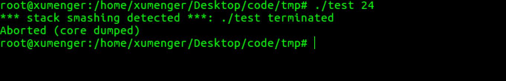

上面几篇文章简单的从汇编层面对C的执行逻辑、函数调用进行了分析，这篇文章来展示一个简单的栈溢出漏洞！

下面使用x86程序进行测试，x64的程序可以自己参考本文研究

先编写一个简单的程序

```c
#include <stdio.h>
#include <unistd.h>
#include <stdlib.h>

void func(int m, int n)
{
    int a = 23456;
    int b[3];
    printf("&b[0] = %p, &b[1] = %p, &b[2] = %p\n", &b[0], &b[1], &b[2]);
    printf("&a = %p\n", &a);
    printf("b[-1] = %d\n", b[-1]);
}

int main(int argc, char **argv, char **env)
{
    func(2, 1);
    return 0;
}
```

当调用func函数时，保存起进程地址空间的栈时这样的


正如我在[《Linux-C逆向工程基础：函数调用分析》](http://www.xumenger.com/linux-c-asm-3-20180606/)中简单分析的那样

* main在调用func之前，先要把参数压栈
    * 也就是为什么上图栈底前两个格子是局部变量 n=1, m=2
* (?)调用函数main的地址
* func函数的开始会`push ebp`，保存上个函数的ebp指针
    * 所以上图第四个格子是main的EBP指针
    * EBP就是保存当前函数的栈底地址
    * 因为函数调用的层次关系，当前函数的调用者的EBP就要保存在栈上
* 函数内部的局部变量也是压到栈上存储的
    * 所以func中的a、b[0]、b[1]、b[2]都是存在在栈上的
    * 上图栈顶的四个格子
    * 参考[《Linux-C逆向工程基础：函数局部变量的入栈顺序》](http://www.xumenger.com/linux-c-asm-4-20180606/)

编译运行上面的程序，看到b[-1]索引到了a临时变量的位置，所以输出了a变量的值


上图中第三格[调用函数main的地址]存储的是什么？上面初步总结的时候没有详细说明！

当调用完func函数的时候，程序是不是直接退出了？当然不是，程序会接着执行调用func函数的这个函数，也就是本例中的main函数

那么系统要运行这个函数首先得要知道这个函数的地址吧，所以当func执行完的时候，首先就可以在栈上获取main的地址，eip指针指向这个函数地址就可以继续执行main函数了

>注意：这里并不是main函数的起始地址，而是main上次执行到的那个地址，这样才能保证func执行完成后，继续从main函数上次执行到的地方继续执行，而不是从main函数开始的地方执行

而且main函数的EBP指针也都保存在栈上，都可以在func执行完后从栈上获取到！

>[《Linux-C逆向工程基础：函数调用分析》](http://www.xumenger.com/linux-c-asm-3-20180606/)没有讲解到栈上保存函数地址的问题，这里简单补充一下！

具体是如何实现的呢？其实就是用到了call和ret指令

* 调用者执行call的时候，主要有两个动作
    * 把eip指针的值压入到栈上
    * 将eip指向调用函数的地址
* ret则是被调用者执行的指令，主要是两个动作
    * 把保存在栈上的原来的eip值加载上来
    * 将加载上来的值写到eip寄存器中，这样接下来CPU就会跳转到eip执行的地址处继续执行

所以这就是我们看到在汇编中调用函数要用call指令，函数结束后要用ret指令！

## 利用栈溢出修改数据

上面的例子，如果给b[-1]赋值为0，那么a还会是23456吗？

当然不是了！因为&b[-1]和&a是一样的地址，改变b[-1]对应的a也就改变了，那么如果我依次类推给b[-2],b[-3],b[-4]…依次赋个值呢

程序修改成这样

```c
#include <stdio.h>
#include <unistd.h>
#include <stdlib.h>

void func(int m, int n)
{
    int a = 23456;
    int b[3];
    printf("a = %d\n", a);
    b[-1] = 0;
    printf("a = %d\n", a);
}

int main(int argc, char **argv, char **env)
{
    func(2, 1);
    return 0;
}
```

现在修改了b[-1]的值，其实是间接修改了a的值


## 利用栈溢出改变执行逻辑

>在计算机中，数据和指令都是用数字表示的！

编写下面的程序

```c
#include <stdio.h>
#include <string.h>

void func1(char *s, int n)
{
    char a[4];
    memcpy(a, s, n);
}

void func2(void)
{
    printf("hello,world\n");
}

void func3(char *s, int n)
{
    func1(s, n);
}

//暂不考虑越界问题和非法字符的问题
int str_to_int(char *s){
    int i = 0;
    int ret = 0;
    for(i=0; i<strlen(s); i++){
        ret = ret * 10 + s[i] - '0';
    }
    return ret;
}

int main(int argc, char **argv)
{
    void (*p)(void);

    int N = str_to_int(argv[1]);

    char a[N];
    char *s = a;
    bzero(s, N);
    p = &func2;
    s = s + N - 4;
    memcpy(s, &p, sizeof(p));
    func3(s, N);

    return 0;
}
```

希望确定上面的变量N的值，使得程序运行的时候，把func2的地址写入到

好的，下面就通过动态调试的方式来确定这个值是多少！

>gcc -m32 test.c -o test

>gdb test

首先随机设置一个N的值，比如一开始的时候设置为10，然后分别获取func1、func2、func3这些函数的地址信息，并且在func3、func1处下断点！然后开始运行


在func3的断点处停止了，我们反汇编看一下func3的代码


>在源代码级别的单步调试中，n/next、s/step分别是单步步过和单步步入，在汇编级别的调试下，则是ni/nexti和si/stepi

在func3中调用func1处的指令下断点，然后运行到这个断点处，在这里查看eip、ebp、esp寄存器的值


可以看到这时候三个寄存器的值分别是：

* eip = 0x8048564，也就是接下来要执行的代码的位置
* ebp = 0xffffce88，当前函数func3的栈底寄存器
* esp = 0xffffce70，当前函数func3的栈顶寄存器

接下来我们si步进到func1函数内部！反汇编func1，同样的看一下eip、ebp、esp寄存器的值


这时候这三个寄存器的值是

* eip = 0x80484fb
* ebp = 0xffffce88，在执行call指令前后，ebp寄存器的值不变
* esp = 0xffffce6c，执行call指令后，esp寄存器的值减少了0x4

这里重点介绍一下在执行call指令时，esp和eip的变化规律，因为在函数调用完成后需要返回到原来的地址处继续执行，所以就需要在函数调用的时候把这些信息保存起来，其实也就是在执行call指令的时候，CPU一方面把eip指针指向新的地址，另外把原来的eip压栈（保存在栈上，所以对应的esp栈顶指针就减少了4）

我们可以查看一下此时栈顶的值是什么


回看一下func3的反汇编代码，`call   0x80484fb <func1>`指令的下一个指令的地址就是0x08048569，也就是说在func3调用func1结束后，会将这个地址恢复到eip中，然后CPU继续从这个地址处开始执行

请记住这个保存了调用函数的eip的地址，也就是0xffffce6c。因为我们这个实验的目的就是希望通过栈溢出，用func2函数的地址去覆盖这个地址，然后就可以改变程序的执行逻辑了

好了接下来我们继续调试func1函数，先简单分析一下func1的汇编指令

```
(gdb) disas func1
Dump of assembler code for function func1:
=> 0x080484fb <+0>:     push   %ebp
   0x080484fc <+1>:     mov    %esp,%ebp
   0x080484fe <+3>:     sub    $0x28,%esp
   0x08048501 <+6>:     mov    0x8(%ebp),%eax
   0x08048504 <+9>:     mov    %eax,-0x1c(%ebp)
   0x08048507 <+12>:    mov    %gs:0x14,%eax
   0x0804850d <+18>:    mov    %eax,-0xc(%ebp)
   0x08048510 <+21>:    xor    %eax,%eax
   0x08048512 <+23>:    mov    0xc(%ebp),%eax
   0x08048515 <+26>:    sub    $0x4,%esp
   0x08048518 <+29>:    push   %eax
   0x08048519 <+30>:    pushl  -0x1c(%ebp)
   0x0804851c <+33>:    lea    -0x10(%ebp),%eax
   0x0804851f <+36>:    push   %eax
   0x08048520 <+37>:    call   0x8048390 <memcpy@plt>
   0x08048525 <+42>:    add    $0x10,%esp
   0x08048528 <+45>:    nop
   0x08048529 <+46>:    mov    -0xc(%ebp),%eax
   0x0804852c <+49>:    xor    %gs:0x14,%eax
   0x08048533 <+56>:    je     0x804853a <func1+63>
   0x08048535 <+58>:    call   0x80483b0 <__stack_chk_fail@plt>
   0x0804853a <+63>:    leave  
   0x0804853b <+64>:    ret    
End of assembler dump.
(gdb) 
```

结合在[《Linux-C逆向工程基础：程序逻辑分析》](http://www.xumenger.com/linux-c-asm-2-20180606/)、[《Linux-C逆向工程基础：函数调用分析》](http://www.xumenger.com/linux-c-asm-3-20180606/)、[《Linux-C逆向工程基础：函数局部变量的入栈顺序》](http://www.xumenger.com/linux-c-asm-4-20180606/)这三篇文章中的学习，去分析一下以上的汇编代码

对比func1函数的C代码

```c
void func1(char *s, int n)
{
    char a[4];
    memcpy(a, s, n);
}
```

添加注释后的内容如下

```
(gdb) disas func1
Dump of assembler code for function func1:

   ; 保存func3的ebp寄存器
=> 0x080484fb <+0>:     push   %ebp

   ; 把当前的esp寄存器值保存在ebp寄存器中，作为当前函数的栈底指针
   ; 在一个函数中，ebp的值是不变的，因为栈底是不变的
   ; 而esp的值是要变化的，因为需要通过esp的变化来实现压栈和出栈的功能
   0x080484fc <+1>:     mov    %esp,%ebp

   ; 通过减少esp寄存器的值实现扩大当前函数栈内存的空间
   ; 当前函数的栈内存现在是0x28字节大小
   0x080484fe <+3>:     sub    $0x28,%esp

   ; func3在调用func1之前，先把参数按照从右到左，下面的汇编指令主要实现获取func3传入的参数
   ; 从右到左压栈，所以最右边的参数所在的栈地址最高

   ; 获取最右边的参数，即s
   ; 第一个参数的地址在是0x8(%ebp)
   ; !!因为(%ebp)地址处保存的是上一个函数的ebp、0x4(%ebp)保存的是上一个函数接着要执行的指令地址
   ; 通过一系列指令，把该参数保存在 -0x1c(%ebp) 地址处
   0x08048501 <+6>:     mov    0x8(%ebp),%eax
   0x08048504 <+9>:     mov    %eax,-0x1c(%ebp)
   0x08048507 <+12>:    mov    %gs:0x14,%eax
   0x0804850d <+18>:    mov    %eax,-0xc(%ebp)
   0x08048510 <+21>:    xor    %eax,%eax

   ; 获取从右往左的第二个参数，即n，地址保存在eax中
   0x08048512 <+23>:    mov    0xc(%ebp),%eax

   ; 栈顶继续扩大0x4字节
   0x08048515 <+26>:    sub    $0x4,%esp

   ; func1函数内部会调用memcpy函数（memcpy(a, s, n)），所以也先要把三个参数压栈
   ; 也是从右往左压栈

   ; 刚才把n的值保存在eax中，先把最右边的参数n压栈
   0x08048518 <+29>:    push   %eax
   ; 再把s压栈
   0x08048519 <+30>:    pushl  -0x1c(%ebp)
   ; 获取参数a的值
   ; !!这里获取额外信息，即func中临时变量a的地址是-0x10(%ebp)
   ; !!而上面分析得之，保存func3的ebp值在当前函数ebp指针指向的地址
   ; !!保存func3接下来要执行的指令地址在0x4(%ebp)地址处
   ; !!所以我们要对a数据进行溢出，以覆盖原eip的值，这里就可以计算得到了！
   0x0804851c <+33>:    lea    -0x10(%ebp),%eax
   ; 把a压栈
   0x0804851f <+36>:    push   %eax
   ; 调用memcpy函数
   0x08048520 <+37>:    call   0x8048390 <memcpy@plt>

   ; esp的值减0x10，因为上面在进行了memcpy函数调用的时候，先`sub    $0x4,%esp`
   ; 又分别压入了三个参数到栈上，所以栈空间变大了0x10
   ; 现在执行add    $0x10,%esp操作，是为了恢复为调用memcpy申请的栈空间
   ; 所以现在的栈空间依然是0x28字节大小
   0x08048525 <+42>:    add    $0x10,%esp

   0x08048528 <+45>:    nop
   0x08048529 <+46>:    mov    -0xc(%ebp),%eax
   0x0804852c <+49>:    xor    %gs:0x14,%eax
   0x08048533 <+56>:    je     0x804853a <func1+63>
   0x08048535 <+58>:    call   0x80483b0 <__stack_chk_fail@plt>
   0x0804853a <+63>:    leave  
   0x0804853b <+64>:    ret    
End of assembler dump.
(gdb) 
```

>这里对汇编的注解结合了实战内容，相比于前三篇文章中的总结更为深刻

OK！上面在注解汇编代码的时候得到这样的信息：

* 当前函数的ebp指针指向的栈地址保存了上一个函数的ebp指针值
* 当前函数的0x4(%ebp)地址处，保存了上一个函数接下来要执行的指令地址，即func1结束后要恢复的eip的值
* 当前函数的-0x10(%ebp)地址处，保存的是临时变量a数组的值

经过分析，得到的栈结构是


要用a数组越界的方式去覆盖func3保存的eip的值，应该是这样的


也就是要用func2的地址覆盖掉a[20]-a[23]的内容

所以也就是确定了输入的值要是24

好的，我们运行程序看一下效果！



为什么直接崩溃！

哦！我们的程序在覆盖原来函数的EIP的时候，也用一些乱七八糟的值把原来函数的EBP给改了，导致程序错误，那我们把原来的func1函数修改成这样

```c
void func1(char *s, int n)
{
    char a[4];
    memcpy(a + n - 4, s, 4);
}
```

只覆盖原来函数的EIP缓存，不覆盖原来函数的EBP缓存，编译运行效果如下


这次已经成功调用到func2函数了

## 简单总结

上面的程序虽然成功调用到func2，但还是会在后续的处理中出现Segmentation fault，说明还要对函数调用的堆栈进行更进一步的处理才行

另外本文只是展示了x86下的函数调用细节，对于x64平台并没有介绍

还有很多问题没有考虑到

* C语言相对简单些，但C++中有引用传值、异常处理等更复杂的语法，对应要如何处理？
* 还有机器大小端的问题这里没有提及，请读者考虑大小端对栈溢出漏洞利用的影响！
* 等等
