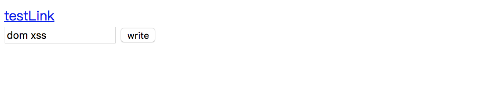

MVC架构将Web应用分为三层

* View负责用户视图、页面展示等工作
* Controller负责用户的逻辑实现，接收View层传入的用户请求，并转发给对应的Model做处理
* Model层则负责实现模型，完成数据的处理


从数据的流入来看，用户提交的数据先后流经了View层、Controller层、Model层，数据的流出则反过来。在设计安全方案时，要牢牢把握住数据这个关键因素

在MVC框架中，通过切片、过滤器等方式，往往能对数据进行全局处理，这为设计安全方案提供了极大的便利

>一个优秀的安全方案，应该是：**在正确的地方，做正确的事情**

比如在防御SQL注入攻击中，最好不要选择使用PHP的magic\_quotes\_gpc作为一项对抗SQL注入的防御方案，这是因为magic\_quotes\_gpc是有缺陷的，它并没有在正确的地方解决问题。magic\_quotes\_gpc实际上是调用了一次addslashes()，将一些特殊的符号，比如单引号转义为\\'

对应在MVC框架中，它是在View层做这件事情，而SQL注入是在Model层需要解决的问题！事实上，攻击者还是可以找到多种绕过magic\_quotes\_gpc的办法，比如使用GBK编码、使用无单引号的注入等

所以Model层的事情放在View层解决，效果只能适得其反！

一般来说，我们需要先想清楚要解决什么问题，深入理解这些问题后，在“正确”的地方对数据进行安全检查。一些主要的Web安全威胁，比如XSS、CSRF、SQL注入、访问控制、认证、URL跳转等不涉及业务逻辑的安全问题，都可以集中在MVC框架中解决

在框架中实施安全方案，比让程序员在业务中修复一个个具体的bug有更多的优势

* 有些安全问题可以在框架中统一解决，能大大节省开发者的工作量，节省人力成本。当代码的规模大到一定程序的时候，在业务的压力下，专门花时间去一个个修补漏洞几乎成为不可能完成的任务
* 对于一些常见的漏洞来说，由开发者一个个修补可能出现遗漏，而在框架中统一解决，有可能解决“遗漏”的问题。这需要制定相关的代码规范和工具配合
* 在每个业务中修补安全漏洞，补丁的标准难以统一，而在框架中集中实施的安全方案，可以使所有基于框架开发的业务都能受益，从安全方案的有效性来说，更容易把握

这也是一个典型的解耦的思维！

## 模板引擎与XSS防御

>XSS攻击，通常是指攻击者通过“HTML注入”等方式篡改网页，插入恶意的脚本，从而在用户浏览网页时，控制用户浏览器的一种攻击。在一开始，这种攻击的演示案例是跨域的，所以叫做“跨站脚本”。但是发展到今天，由于JavaScript的功能强大以及网站前端应用的复杂化，是否跨域已经不再重要了。但由于历史原因，XSS这个名字就一直保留下来了

**XSS有多种类型**

1)反射型XSS

反射型XSS只是简单地把用户输入的数据“反射”给浏览器。也就是说，攻击者往往需要诱使用户点击一个恶意链接，才能攻击成功

2)存储型XSS

Web应用中，一般会把用户的一些输入的数据“存储”在服务器，存储型XSS就是攻击者利用Web应用的这种特将恶意的脚本保存到服务器端，这种XSS具有很强的稳定性

比较常见的场景就是：攻击者写下一篇包含恶意的JavaScript代码的博客文章，文章发表后，所有访问该博客的用户都会在他们的浏览器上执行这段恶意的JavaScript代码

3)DOM Based XSS

DOM Based XSS其实是反射型XSS的一种，不过因为比较特殊，所以单独拿出来作为一个类型。通过修改页面的DOM节点形成的XSS，称之为DOM Based XSS

比如下面这段代码

```html
<script>
function test(){
  var str = document.getElementById("text").value;
  document.getElementById("t").innerHTML = "<a href='" + str + "'>testLink</a>"
}
</script>

<div id="t"></div>
<input type="text" id="text" value=""/>
<input type="button" id="s" value="write" onclick="test()"/>
```

保存为HTML文件后，使用浏览器打开


点击按钮后，会在当前页面插入一个超链接，其地址是文本框的内容



如果在输入框中构造`' onclick=alert(/xss/) //`，点击按钮后链接就变成了`<a href='' onclick=alert(/xss/) //'  >testLink</a>`

首先用一个单引号闭合掉href的第一个单引号，然后插入一个onclick事件，最后在用注释符//注释掉第二个单引号

点击按钮就生成了一个新的链接，点击这个链接脚本就会被执行


>XSS的本质还是一种“HTML注入”，用户的数据被当成了HTML代码一部分来执行，从而混淆了原本的语义，产生了新的语义

>讲到底，XSS攻击与防御就是在基于HTML语法、CSS语法、JavaScript语法、HTTP协议规范的基础上进行的“文字游戏”！具体能玩出什么花样，就看你对HTML、CSS、JavaScript、HTTP的熟悉程度了！

**正确的防御**

在View层，可以解决XSS问题。XSS攻击是在用户的浏览器上执行的，其形成过程则是在服务端页面渲染时，引入了恶意的HTML代码导致的

从MVC架构来说，是发生在View层，因此使用“输出编码”的防御方式更为合理，这意味着需要针对不同上下文的XSS攻击场景，使用不同的编码方式

在“输出编码”的防御中，大概有这些方法：

* 在HTML标签中输出变量
* 在HTML属性中输出变量
* 在script标签中输出变量
* 在事件中输出变量
* 在CSS中输出变量
* 在URL中输出变量

下面将用变量“$var”表示用户数据，它将被填充入HTML代码中，可能存在以下场景

**在HTML标签中输出**

```php
<div>$var</div>

<a href=# >$var</a>
```

所有在标签中输出的变量，如果没有进行任何处理，都会导致直接产生XSS

在这种场景下，XSS的利用方式一般是构造一个script标签，或者是任何能够产生脚本执行方式的代码，比如

```html
<div><script>alert(/xss/)</script></div>

<a href=# ></a>
```

防御方法就是对变量使用HtmlEncode

**在HTML属性中输出变量**

```php
<div id="abc" name="$var"></div>
```

与在HTML标签中输出类似，可能的攻击方法：

```html
<div id="abc" name=""><script>alert(/xss/)</script><"" ></div>
```

防御方法也是采用HtmlEncode

在OWASP ESAPI中推荐了一种更严格的HtmlEncode——除了字母、数字外，其他所有的特殊字符都被编码成HTMLEntities

```java
String safe = ESAPI.encoder().encodeForHTMLAttribute(request.getParameter("input"));
```

这种严格的编码方式，可以保证不出任何安全问题

**在script标签中输出变量**

在script标签中输出时，首先应该确保输出的变量在引号中

```php
<script>
var x = "&var";
</script>
```

攻击者首先需要闭合引号才能实施XSS攻击

```html
<script>
var x ="";alert(/xss/);//";
</script>
```

防御时使用JavaScriptEncode

**在事件中输出变量**

在事件中输出和在script标签中输出蕾西

```php
<a href=# onclick="funcA('$var')">test</a>
```

可能的攻击方法是

```html
<a href=# onclick="funcA('');alert(/xss/);//" >test</a>
```

防御时使用JavaScriptEncode

**在CSS中输出变量**

在CSS和style、style attribute中形成XSS的方式非常多样化，参考下面几个XSS的例子

```html
<STYLE>@import 'http://ha.ckers.org/xss.css';</STYLE>
<STYLE>BODY{-moz-binding:url("http://ha.ckers.org/xssmoz.xml#xss")}</STYLE>
<XSS STYLE="behavior: url(xss.htc);">
<STYLE>li  {list-style-image: url("javascript:alert('XSS')")}</STYLE><UL><LI>XSS
<DIV STYLE="background-image: url(javascript:alert('XSS'))">
<DIV STYLE="width: expression(alert('XSS'));">
```

所以，一般来说，尽可能禁止用户可控制的变量在`<style>标签`、`HTML标签的style属性`以及`CSS文件`中输出。如果一定有这样的需要，则推荐使用OWASP ESAPI中的encodeForCSS()函数

```java
String safe = ESAPI.encoder().encodeForCSS(request.getParameter("input"));
```

其实现原理类似于ESAPI.encoder().encodeForJavaScript()函数，除了字母、数字外的所有字符都被编码为十六进制形式“\uHH”

**在URL中输出变量**

在地址中输出也比较复杂。一般来说，在URL的path(路径)或者search(参数)中输出，使用URLEncode即可。URLEncode会将字符转换为“%HH”格式，比如空格就是"%20"，"<"就是"%3c"

```php
<a href="http://www.evil.com/?test=$var" >test</a>
```

可能的攻击方法

```html
<a href="http://www.evil.com/?test=" onclick=alert(1)"" ></a>
```

经过URLEncode后，变成

```hmtl
<a href="http://www.evil.com/?test=%22%20onclick%3balert%281%29%22" ></a>
```

## Web框架与CSRF防御

CSRF攻击可以在受害者毫不知情的情况下以受害者名义伪造请求发送给受攻击站点，从而在并未授权的情况下执行在权限保护之下的操作

比如，受害者Bob在银行有一笔存款，通过对银行的网站发送请求 http://bank.example/withdraw?account=bob&amount=1000000&for=bob2 可以使Bob把1000000的存款转到bob2的账户下。通常情况下，该请求发送到网站后，服务器会先验证该请求是否来自一个合法的session，并且该session的用户Bob已经成功登陆

黑客Mallory自己在该银行也有账户，他知道上文中的URL可以把钱进行转账操作。Mallory可以自己发送一个请求给银行： http://bank.example/withdraw?account=bob&amount=1000000&for=Mallory

但这个请求来自Mallory而不是Bob，他不能通过安全认证，因此该请求不会起作用。此时Mallory想到使用CSRF的攻击方式，他先自己做一个网站，在自己的网站中放入如下代码 `src="http://bank.example/withdraw?account=bob&amount=1000000&for=Mallory"`。并且通过广告等方式诱使Bob来访问他的网站。当 Bob访问该网站时，上述 url就会从 Bob的浏览器发向银行，而这个请求会附带 Bob浏览器中的 cookie一起发向银行服务器。大多数情况下，该请求会失败，因为他要求 Bob的认证信息。但是，如果 Bob 当时恰巧刚访问他的银行后不久，他的浏览器与银行网站之间的 session尚未过期，浏览器的 cookie之中含有 Bob的认证信息。这时，悲剧发生了，这个 url请求就会得到响应，钱将从 Bob的账号转移到 Mallory的账号，而 Bob当时毫不知情。等以后 Bob发现账户钱少了，即使他去银行查询日志，他也只能发现确实有一个来自于他本人的合法请求转移了资金，没有任何被攻击的痕迹。而 Mallory则可以拿到钱后逍遥法外

**使用token防御CSRF攻击**

CSRF攻击的目标，一般都会产生“写数据”操作的URL，比如增、删、改；而“读数据”操作并不是CSRF攻击的目标，因为在CSRF的攻击过程中攻击者无法获取服务端返回的数据，攻击者只是借用用户之手触发服务端动作，所以读数据对于CSRF来说并无直接的意义

>但如果同时存在XSS漏洞或其他的跨域漏洞，则可能会引起别的问题

在很多的CSRF攻击中，都是因为一些网站使用GET方式进行增、删、改的动作，比如使用`http://blog.sohu.com/manage/entry.do?m=delete?id=12345`这样的URL来删除文章，很显然，攻击者很容易通过构造这样的URL来实现恶意删除的攻击，比如在img标签中写入这个URL，浏览器就会主动发起GET请求，导致文章被恶意删除

因此，在Web应用开发中，有必要对“读操作”和“写操作”予以区分，比如要求所有的“写操作”都使用HTTP POST

在很多讲述CSRF防御的文章中，都要求使用HTTP POST进行防御，但实际上POST本身并不足以对抗CSRF，因为POST也是可以自动提交的。但是POST的使用，对于保护token本身有积极的意义，而security token的私密性是防御CSRF攻击的基础！

对于Web框架来说，可以自动地在所有涉及POST的代码中添加token，这些地方包括form表单、所有的AJAX POST请求等

完整的CSRF防御方案，对于Web框架来说有以下几处需要改动：

* 在Session中绑定token。如果不能保存在服务端的Session中，则可以替代为保存在Cookie中
* 在form表单中自动填入token字段，如`<input type=hidden name='anti_csrf_token' value='$token'>`
* 在AJAX请求中自动添加token，这可能需要已有的AJAX封装实现的支持
* 在服务端对比POST提交参数的token与Session中绑定的token是否一致，以验证CSRF攻击

比如在Flask的Flask-WTF扩展中，我们构造表单的时候就要使用到csrf\_token！Flask-WTF扩展为我们封装好了使用token防御CSRF的功能，使用起来很方便！


**为什么使用token可以防御CSRF**

CSRF攻击之所以能够成功，是因为攻击者可以完全伪造用户的请求，该请求中所有的用户验证信息都是存在于cookie中的，因此攻击者可以在不知道这些验证信息的情况下直接利用用户自己的cookie来通过安全验证

要防御CSRF，关键在于请求中不能放入攻击者不能伪造的信息，并且该信息不存在于cookie之中，可以在HTTP请求中一参数的形式加入一个随机产生的token，并在服务器端建立一个拦截器来验证这个token，如果请求中没有token，或者token的值不正确，则认为可能是CSRF攻击而拒绝该请求

token可以在用户登陆后产生并放在session中，然后在每次请求时把token从session中拿出，与请求中的token进行对比

但这种方法的难点在于如何把token以参数的形式加入请求

* 对于GET请求，token将附在请求地址之后，这样URL就变成 http://url?csrftoken=tokenvalue
* 而对于POST请求来说，要在form的最后加上 `<input type=”hidden” name=”csrftoken” value=”tokenvalue”/>`，这样就把token以参数的形式加入请求了

但是，在一个网站中，可以接受请求的地方很多，而对于每个请求都加上token时很麻烦的，并且很容易漏掉，通常使用的方法就是在每次页面加载时，使用JavaScript遍历整个DOM树，对于DOM中所有的a和form标签后面加入token。这样可以解决大部分的请求，但是对于在页面加载之后动态生成的html代码，这种方法就没有作用，还需要程序员在编码时手动添加token

该方法还有一个缺点是难以保证token本身的安全的。特别是在一些论坛之类支持用户自己发表内容的网站，攻击者可以在上面发布自己个人网站的地址。由于系统也会在这个地址后面加上token，攻击者可以在自己的网站上得到这个token，并马上发起CSRF攻击

为了避免这一点，系统可以在添加token时加一个判断，如果这个链接是链到自己本站的，就在后面添加token，如果是通向外网则不加。不过，即使这个csrf\_token不以参数的形式附加在请求之中，攻击者的网站也同样可以通过Referer来得到这个token值以发动CSRF攻击。这也是一些用户喜欢手动关闭浏览器Referer功能的原因

>所以使用token防御CSRF的前提是保证token本身的安全，其不可被盗取、其不可被预测！如果网站的XSS防御没有做好，token的信息就很容易被攻击者拿到，那么使用token防御CSRF攻击就不是很靠谱了！

## 数据持久层与SQL注入

>使用ORM框架对SQL注入是有积极意义的

我们知道对抗SQL注入的最佳方式就是使用“预编译绑定变量”，这样就可以避免“愚蠢”的拼接SQL字符串的方式与数据库进行交互

在实际解决SQL注入时，还有一个难点就是当Web应用复杂后，代码数量庞大，难以把可能存在SQL注入的地方不遗漏的找出来，而ORM框架为我们发现问题提供了一个便捷的途径

## 其他Web安全

本文参考众多资料，从Web框架的层面看Web安全

在此之外，Web安全在其他很多方面都会有体现，比如

* 点击劫持
* HTML5安全
* 权限控制
* DDos：SYN flood、UDP flood、ICMP flood
* CC攻击
* ReDos
* 验证码能被机器轻易识别
* 缓冲区溢出漏洞
* TCP/IP协议栈的诸多漏洞

所以在设计Web系统的时候，一定要充分考虑到这些可能出现的意外和攻击！
