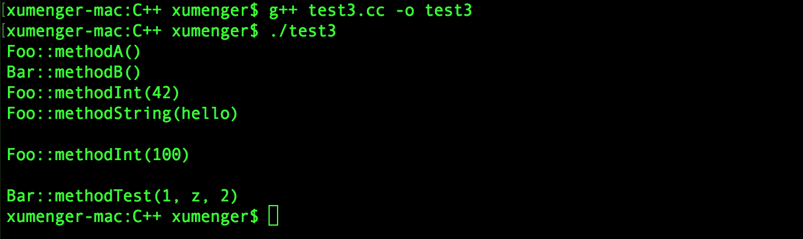

## boost::function

boost::function是一个函数包装器，也即一个函数模板，可以用来代替拥有相同返回类型，相同参数类型，以及相同参数个数的各个不同的函数

```cpp
#include<boost/function.hpp>
#include<iostream>

using namespace std;

typedef boost::function<int(int ,char)> Func;

int test(int num,char sign)
{
   cout << num << sign << endl;
   return 0;
}

int main()
{
    Func f;
    f = &test;  //or f = test;
    f(1, 'A');
}
```

编译运行的效果如下


当然有人会说，我用函数指针也可以做到啊

```cpp
#include<iostream>

using namespace std;

typedef int (*Func)(int, char);

int test(int num,char sign)
{
   cout << num << sign << endl;
   return 0;
}

int main()
{
    Func f;
    f = &test;  //or f = test;
    f(1, 'A');
}
```

当然也可以得到同样的效果


但是为什么还要用boost::function呢？

>如果没有boost::bind，那么boost::function就什么都不是；而有了boost::bind，同一个类的不同对象可以delegate给不同的实现，从而实现不同的行为，简直就是无敌了

## boost::bind

boost::function就像C#中的delegate，可以指向任何函数，包括成员函数（这点就是普通的函数指针做不到的！）

当用bind把某个成员函数绑定到某个对象上的时候，就可以得到一个closure（闭包）

```cpp
#include <string>
#include <iostream>
#include<boost/function.hpp>
#include<boost/bind.hpp>

using namespace std;

class Foo{
    public:
        void methodA() { cout << "Foo::methodA()" << endl; }
        void methodInt(int a) { cout << "Foo::methodInt(" << a << ")" << endl; }
        void methodString(const string &str) { cout << "Foo::methodString(" << str << ")" << endl; }
};

class Bar{
    public:
        void methodB() { cout << "Bar::methodB()" << endl; }
        int methodTest(int a, char b, int c) 
        { 
            cout << "Bar::methodTest(" << a << ", " << b << ", " << c << ")" << endl;
            return 0;
        }
};


int main()
{
    //无参数，无返回值
    boost::function<void()> fun1;

    //调用foo.methodA()
    Foo foo;
    fun1 = boost::bind(&Foo::methodA, &foo);
    fun1();

    //调用bar.methodB()
    Bar bar;
    fun1 = boost::bind(&Bar::methodB, &bar);
    fun1();

    //调用foo.methodInt(42)
    fun1 = boost::bind(&Foo::methodInt, &foo, 42);
    fun1();

    //调用foo.methodString("hello")
    //bind的时候直接传入实参，这不就是闭包吗
    fun1 = boost::bind(&Foo::methodString, &foo, "hello");
    fun1();


    cout << endl;
    //int参数，无返回值
    boost::function<void(int)> fun2;
    //bind的时候未传入实参，需要_1作为参数的占位
    fun2 = boost::bind(&Foo::methodInt, &foo, _1);
    fun2(100);


    cout << endl;
    //三个参数，有返回值
    boost::function<int(int, char, int)> func3;
    //bind的时候未传入实参，需要_1、_2、_3作为参数的占位
    func3 = boost::bind(&Bar::methodTest, &bar, _1, _2, _3);  //用_1、_2、_3作为参数的占位符
    func3(1, 'c', 2);
}
```

编译运行效果如下



## 生命周期的问题

在这个代码段中

```cpp
    //methodString函数定义
    void methodString(const string &str) { cout << "Foo::methodString(" << str << ")" << endl; }


    //调用foo.methodString("hello")
    fun1 = boost::bind(&Foo::methodString, &foo, "hello");
    fun1();
```

需要特别注意！bind拷贝的是实参类型，即`const char*`，而不是形参类型`string`

这里形参中的string对象的构造发生在调用fun1的时候，而不是在bind的时候，因此要留意bind的实参`const char *)`的生命周期，它应该不短于fun1的生命周期，必要时可通过`bind(&Foo::methodString, &foo, string("hello")`来保证安全。同时保证bind和fun1的调用在同一个作用域中，否则生成的实参的生命周期还是比func1的生命周期短

下面编写几个测试程序运行并解释原因

**测试程序1**

```cpp
#include <string>
#include <iostream>
#include <boost/function.hpp>
#include <boost/bind.hpp>
#include <string.h>

using namespace std;

class Foo{
    public:
        void methodString(const string &s) { cout << "Foo::methodString(" << s << ")" << endl; }
};


int main()
{
    boost::function<void()> fun1;
    Foo foo;

    //c指向的内存的生命周期明显在fun1调用之前就结束了
    //这种方式是错误的
    {
        char *c = (char *)malloc(7 * sizeof(char));
        strcpy(c, "world");
        fun1 = boost::bind(&Foo::methodString, &foo, c);
        c[0] = '\0';
        free(c);
        c = NULL;
    }
    fun1();
}
```


解释一下生命周期的问题：

* C++中通过 {} 表示变量的作用域和生命周期
* 所以在 {} 中定义 c，在 {} 结束的时候，c 的生命周期就结束了
	* 也就是 c不再包含在 main函数的栈上了
	* 不包含在栈上是因为 main函数的栈缩小了，在原来的内存处 c的值其实还是存在的
	* 除非这时候又定义了一个临时变量刚好把原来 c的值给覆盖掉！
	* 首先是栈内存的生命周期问题
* 同样的，虽然你调用了free释放堆内存，但这只是这个堆被还回去了，原来这个堆上面的数据其实还在
	* 这块堆内存只有在被其他人申请去了之后，才可能将上面的数据修改
	* 所以我在这里直接`c[0] = '\0';`强制修改了一下，以保证程序的演示效果
	* 如果没有`c[0] = '\0';`那么运行结果是看起来正确的一个结果（但实际上内存就已经出了问题了，只是被表面现象掩盖了而已）
	* 这里涉及到堆内存的生命周期问题
* 因为`c[0] = '\0';`的强制修改，所以在调用fun1()的时候，实参传进来发生了string(c)构造新的变量的时候，是个空字符串

这里就演示了一个因为实参的生命周期短于函数而产生了问题。因为形参中如果需要通过构造来生成，其是在函数调用的时候进行构造的，而不是在bind的时候进行构造的！

>很多问题就是因为在内存被释放掉后（上面的程序说明栈内存和堆内存都是如此），这块内存的数据并没有清除，所以很多时候程序都是“看起来”可以正常运行，但是一旦程序变大、运行速度变快、压力变大后，很多因为这个原因被掩盖掉的问题都逐个冒出来了！

**测试程序2**

```cpp
#include <string>
#include <iostream>
#include <boost/function.hpp>
#include <boost/bind.hpp>
#include <string.h>

using namespace std;

class Foo{
    public:
        void methodString(const string &s) { cout << "Foo::methodString(" << s << ")" << endl; }
};


int main()
{
    boost::function<void()> fun1;
    Foo foo;

    //虽然调用了string(c)，但得到的临时变量的生命周期在 } 时就结束了
    //也就是在fun1还没有调用的时候，参数的生命周期就结束了
    //这种方式是错误的
    {
        char *c = (char *)malloc(7 * sizeof(char));
        strcpy(c, "hello");
        fun1 = boost::bind(&Foo::methodString, &foo, string(c));
        c[0] = '\0';
        free(c);
        c = NULL;
    }
    fun1();
}
```


这里的问题和上面的一样，虽然看起来运行的效果是正确的，那是因为虽然`string(c)`构造的临时变量在{}后结束了，但是内存中的数据还在，所以能够正常运行，但假如这块内存在string(c)结束，fun1还未调用的这期间被其他人申请并修改了，那么就会把这个被掩盖的错误显露出来了

>C/C++的很多问题就是某块内存的生命周期虽然结束了，但是其上面的数据其实还在，就会导致虽然是非法访问这块内存，但却可以碰巧得到一个“看起来合法”的结果

**测试程序3**

```cpp
#include <string>
#include <iostream>
#include <boost/function.hpp>
#include <boost/bind.hpp>
#include <string.h>

using namespace std;

class Foo{
    public:
        void methodString(const string &s) { cout << "Foo::methodString(" << s << ")" << endl; }
};


int main()
{
    boost::function<void()> fun1;
    Foo foo;

    //c指向内存的生命周期在 fun1 调用前就结束了
    //这种方式是错误的
    char *c = (char *)malloc(7 * sizeof(char));
    strcpy(c, "test");
    fun1 = boost::bind(&Foo::methodString, &foo, c);
    c[0] = '\0';
    free(c);
    c = NULL;
    fun1();
}
```


很明显，根据运行结果就知道是错误的用法，其中生命周期的解释就不再赘述了

**测试程序4**

```cpp
#include <string>
#include <iostream>
#include <boost/function.hpp>
#include <boost/bind.hpp>
#include <string.h>

using namespace std;

class Foo{
    public:
        void methodString(const string &s) { cout << "Foo::methodString(" << s << ")" << endl; }
};


int main()
{
    boost::function<void()> fun1;
    Foo foo;

    //c指向内存的生命周期在fun1前就结束了
    //但调用了string(c)，其得到的匿名变量的生命周期比fun1长
    //所以这种方式是安全的
    char *c = (char *)malloc(7 * sizeof(char)); 
    strcpy(c, "safe");
    fun1 = boost::bind(&Foo::methodString, &foo, string(c));
    c[0] = '\0';
    free(c);
    c = NULL;
    fun1();

    //在main函数的 } 结束的时候，string(c)得到的临时变量的生命周期才结束！
}
```


这种用法是正确的！
