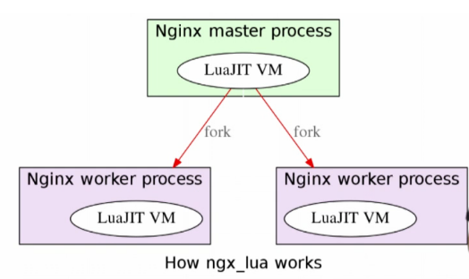
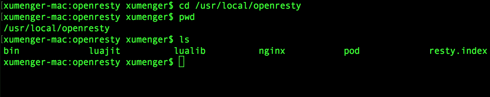
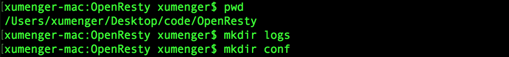
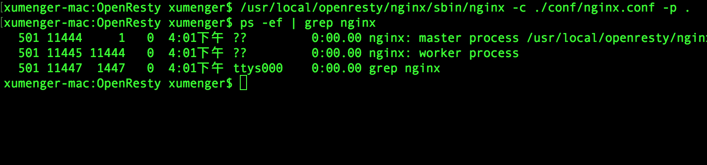
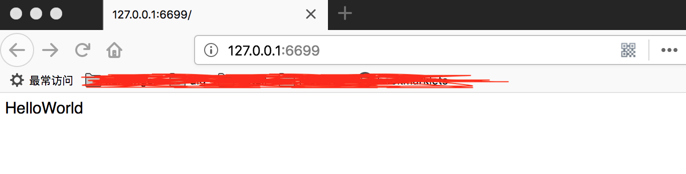
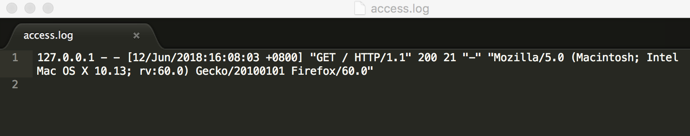
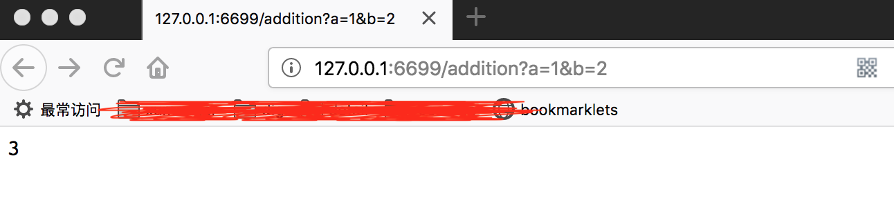
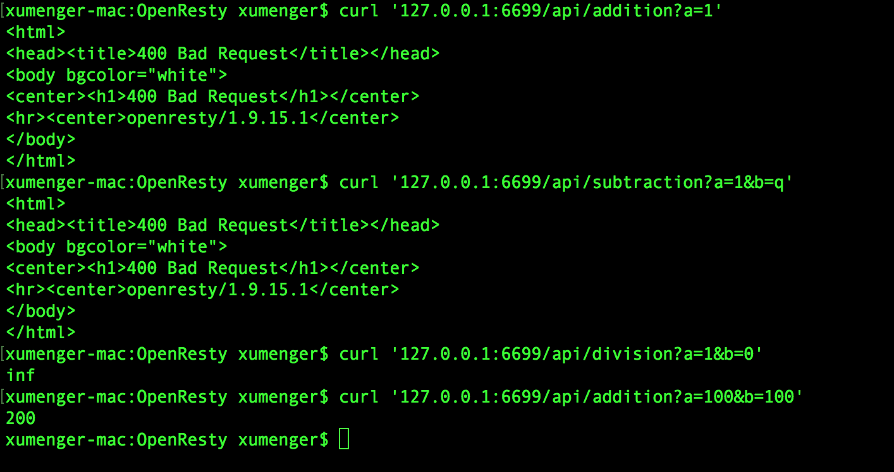

Nginx 采用的是master-worker模型，一个master进程管理多个worker进程，基本的事件处理都是放在woker中，master负责一些全局初始化，以及对worker的管理

在OpenResty中，每个woker使用一个LuaVM，当请求被分配到woker时，将在这个LuaVM里创建一个coroutine(协程)。协程之间数据隔离，每个协程具有独立的全局变量\_G

>协程和多线程下的线程类似：有自己的堆栈，自己的局部变量，有自己的指令指针，但是和其他协程程序共享全局变量等信息。线程和协程的主要不同在于：多处理器的情况下，概念上来说多线程是同时运行多个线程，而协程是通过代码来完成协程的切换，任何时刻只有一个协程程序在运行。并且这个在运行的协程只有明确被要求挂起时才会被挂起



## 部署OpenResty环境

首先安装OpenResty依赖的库`brew install pcre openssl`

到OpenResty的[官网下载页面](http://openresty.org/cn/download.html)下载源码。我选择的是openresty-1.9.15.1.tar.gz

下面就是编译、安装的流程

```
$ tar -xzvf openresty-1.9.15.1.tar.gz
$ cd openresty-1.9.15.1
$ ./configure \
   --with-cc-opt="-I/usr/local/opt/openssl/include/ -I/usr/local/opt/pcre/include/" \
   --with-ld-opt="-L/usr/local/opt/openssl/lib/ -L/usr/local/opt/pcre/lib/" \
   -j8
$ make
$ sudo make install
```

安装的目录是/usr/local/openresty



## 最简单的测试例子

OpenResty安装之后就有配置文件及相关的目录的，为了工作目录与安装目录互不干扰，并顺便学下简单的配置文件编写，我们另外创建一个OpenResty的工作目录来练习，并且另写一个配置文件。我选择在当前用户目录下创建OpenResty目录，并在该目录下创建logs和conf子目录分别用于存放日志和配置文件



**创建配置文件**

在conf下创建配置文件为nginx.conf，内容为

```nginx
# nginx worker 数量
worker_processes  1;

# 指定错误日志文件路径
error_log /Users/xumenger/Desktop/code/OpenResty/logs/error.log;
pid       /Users/xumenger/Desktop/code/OpenResty/logs/nginx.pid;

events {
    worker_connections 1024;
}


http {
    server {
        # 监听端口，若你的6699端口已经被占用，则需要修改
        listen 6699;
        location / {
            default_type text/html;

            # 使用lua的代码输出应答体内容
            content_by_lua_block {
                ngx.say("HelloWorld")
            }
        }
    }
}
```

然后我们用下面的命令启动Nginx

>/usr/local/openresty/nginx/sbin/nginx -c ./conf/nginx.conf -p .



另外补充一些相关命令参数

* nginx -s stop: 直接关闭nginx服务
* nginx -s quit: 优雅地停止nginx服务
* nginx -s reload: 运行中重新加载配置文件

然后在浏览器上输入`http://127.0.0.1:6699/`，访问效果如下



另外，我们可以在logs目录下看到该次HTTP请求的日志



>详细的日志是帮助我们分析用户行为、Web攻击等必不可少的东西！

## 简单的API Server框架

参考[简单API Server框架](https://moonbingbing.gitbooks.io/openresty-best-practices/content/openresty/simple_api.html)实现一个最最简单的数学计算：加、减、乘、除，演示如何搭建简单的API Server

按照上面的思路，直接通过配置文件编写功能代码

```nginx
# nginx worker 数量
worker_processes  1;

# 指定错误日志文件路径
error_log /Users/xumenger/Desktop/code/OpenResty/logs/error.log;
pid       /Users/xumenger/Desktop/code/OpenResty/logs/nginx.pid;

events {
    worker_connections 1024;
}

http {
    server {
        listen 6699;

        # 加法
        location /addition {
           content_by_lua_block {
                local args = ngx.req.get_uri_args()
                ngx.say(args.a + args.b)
            }
        }

        # 减法
        location /subtraction {
            content_by_lua_block {
                local args = ngx.req.get_uri_args()
                ngx.say(args.a - args.b)
            }
        }

        # 乘法
        location /multiplication {
            content_by_lua_block {
                local args = ngx.req.get_uri_args()
                ngx.say(args.a * args.b)
            }
        }

        # 除法
        location /division {
            content_by_lua_block {
                local args = ngx.req.get_uri_args()
                ngx.say(args.a / args.b)
            }
        }
    }
}
```

修改了配置文件后，执行下面的命令重新加载配置

>sudo /usr/local/openresty/nginx/sbin/nginx -s reload -c ./conf/nginx.conf -p .

然后通`http://127.0.0.1:6699/addition?a=1&b=2`访问服务器，可以看到确实得到的求加法的结果



但是明显这样的编码方式让人不舒服，能不能把配置文件和Lua代码拆分出来（解耦）

首先把配置文件修改为

```nginx
# nginx worker 数量
worker_processes  1;

# 指定错误日志文件路径
error_log /Users/xumenger/Desktop/code/OpenResty/logs/error.log;
pid       /Users/xumenger/Desktop/code/OpenResty/logs/nginx.pid;

events {
    worker_connections 1024;
}

http {
    # 设置默认Lua文件的搜索路径
    lua_package_path '$prefix/lua/?.lua;/blah/?.lua;;';

    server {
        listen 6699;

        # 在代码中使用nginx变量
        location ~ ^/api/([-_a-zA-Z0-9/]+) {
            # 准入阶段完成参数验证
            access_by_lua_file  lua/access_check.lua;

            #内容生成阶段
            content_by_lua_file lua/$1.lua;
        }
    }
}
```

在/Users/xumenger/Desktop/code/OpenResty/目录下心中lua文件夹，在该文件夹下编写lua代码，然后分别添加下面的lua源文件

**参数验证**

./lua/comm/param.lua

```lua
local _M = {}

--对输入参数进行逐个校验，只要不是数字类型就返回false
function _M.is_number(...)
    local arg = {...}
    local num
    for _, v in ipairs(arg) do
        num = tonumber(v)
        if nil == num then
            return false
        end
    end

    return true
end

return _M
```

./lua/access_check.lua

```lua
local param = require("comm.param")
local args = ngx.req.get_uri_args()

if not args.a or not args.b or not param.is_number(args.a, args.b) then
    ngx.exit(ngx.HTTP_BAD_REQUEST)
    return
end
```

**四则运算**

./lua/addition.lua

```lua
local args = ngx.req.get_uri_args()
ngx.say(args.a + args.b)
```

./lua/subtraction.lua

```lua
local args = ngx.req.get_uri_args()
ngx.say(args.a - args.b)
```

./lua/multiplication.lua

```lua
local args = ngx.req.get_uri_args()
ngx.say(args.a * args.b)
```

./lua/division.lua

```lua
local args = ngx.req.get_uri_args()
ngx.say(args.a / args.b)
```

然后分别执行下面的命令重启服务、发起请求

>sudo /usr/local/openresty/nginx/sbin/nginx -s reload -c ./conf/nginx.conf -p .

>curl '127.0.0.1:6699/api/addition?a=1'

>curl '127.0.0.1:6699/api/subtraction?a=1&b=q'

>curl '127.0.0.1:6699/api/division?a=1&b=0'

>curl '127.0.0.1:6699/api/addition?a=100&b=100'



比较意外的是

>OpenResty还支持访问MySQL、Redis，支持模板引擎等，合理组合这些组件完全可以直接使用OpenResty开发出强大的Web应用

## 简单总结

>当然本文只是展示简单的功能运行效果，Nginx的强大之处在于其是事件驱动的网络库，所以可以应对高并发，假如在生产环境中就像本文这样直接简单的去利用Nginx调用Lua去进行访问数据库等操作，可能就会阻塞整个网络库！显然是不可取的，所以在实际的生产架构中，如何组织各种功能组件的通信、部署、交互，这又是一个很大的Topic！

参考了如下的资料

* [《使用Nginx+Lua(OpenResty)开发高性能Web应用》](http://jinnianshilongnian.iteye.com/blog/2280928)
* [《跟我学OpenResty(Nginx+Lua)》](http://jinnianshilongnian.iteye.com/blog/2190344)
* [《OpenResty最佳实践》](https://moonbingbing.gitbooks.io/openresty-best-practices/content/)
* [《深入 Nginx：我们是如何为性能和规模做设计的》](http://blog.jobbole.com/88766/)
* [《使用Nginx和uWSGI部署Flask程序》](http://www.xumenger.com/nginx-flask-python-20180331/)
* [《Lua简明教程》](http://www.xumenger.com/lua-20180126/)
* [《Lua与C/C++混合编程》](http://www.xumenger.com/lua-c-cpp-20180202/)
* [《Redis下使用Lua脚本》](http://www.xumenger.com/lua-redis-20180127/)
* [《浅谈 OpenResty》](http://www.linkedkeeper.com/detail/blog.action?bid=1034)
