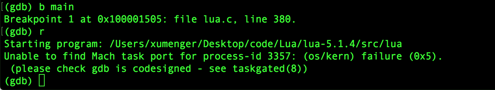
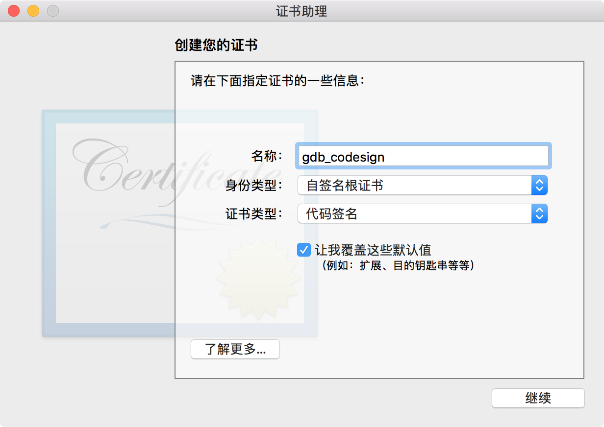
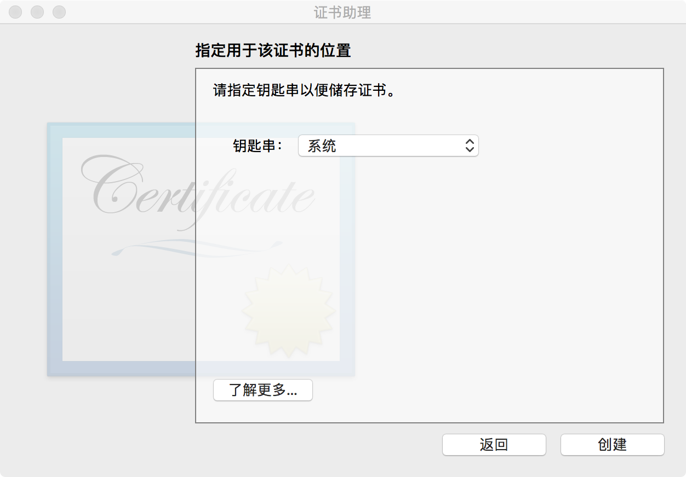
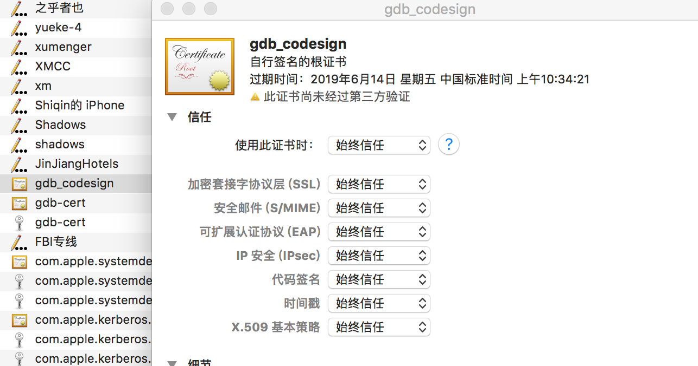
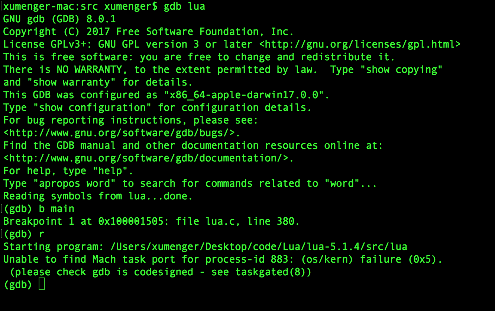
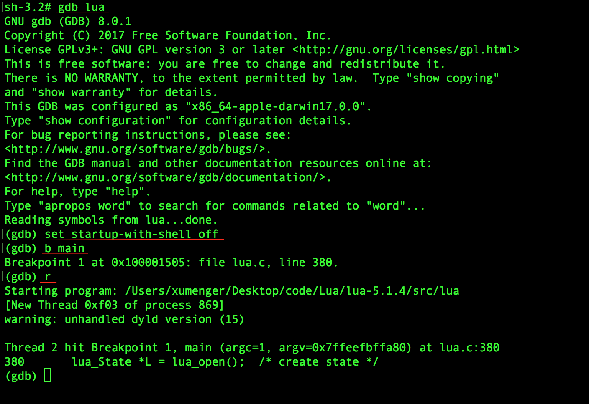

本来计划去调试分析Lua的源码的，选择的版本是lua-5.1.4，在[http://www.lua.org/ftp/](http://www.lua.org/ftp/)下载，也可以点击[这里](../download/20180614/lua-5.1.4.tar.gz)下载

执行命令`tar -xzvf lua-5.1.4.tar.gz`解压缩

修改Makefile，将`CFLAGS= -O2 -Wall $(MYCFLAGS)`修改为`CFLAGS= -O2 -Wall -g $(MYCFLAGS)`

`make macosx`进行编译，可以看到在当前目录下生成lua、luac可执行文件

但是在试着使用gdb调试的时候，却出现报错



## 解决Mac下GDB无法调试的问题

创建证书代码签名的证书

打开Keychain Access 应用程序，执行菜单【钥匙串访问】 -> 【证书助理】 -> 【创建证书】

填写如下信息：

* 名称：gdb_codesign
* 身份类型：自签名根证书
* 证书类型：代码签名
* 钩选：让我覆盖这些默认设置



一路确定，直到**指定证书位置**的步骤，选择**系统**



点击“创建”，会提示用输入系统登录密码，创建完成

在**钥匙串访问程序**中，选择左侧栏的**系统**和**我的证书**，找到你刚刚创建的**gdb_codesign**证书并双击打开证书信息窗口，展开**信任**项，设置**使用此证书时：**为**始终信任**



关闭证书信息窗口，系统会再次要求输入系统登录密码

执行`sudo codesign -s gdb_codesign /usr/local/bin/gdb`

然后一定要重启系统，使签名生效

但重启后，执行gdb还是失败



## 使用root用户

上面的方法还是无法解决问题，试着使用root用户来试一下

首先为root用户设置密码`sudo passwd root`，然后`su`切换到root用户

执行`codesign -s gdb_codesign /usr/local/bin/gdb`

>注意，启动gdb后，一定要先执行`set startup-with-shell off`

这时候使用root用户进行调试

```
sh-3.2# gdb lua
GNU gdb (GDB) 8.0.1
Copyright (C) 2017 Free Software Foundation, Inc.
License GPLv3+: GNU GPL version 3 or later <http://gnu.org/licenses/gpl.html>
This is free software: you are free to change and redistribute it.
There is NO WARRANTY, to the extent permitted by law.  Type "show copying"
and "show warranty" for details.
This GDB was configured as "x86_64-apple-darwin17.0.0".
Type "show configuration" for configuration details.
For bug reporting instructions, please see:
<http://www.gnu.org/software/gdb/bugs/>.
Find the GDB manual and other documentation resources online at:
<http://www.gnu.org/software/gdb/documentation/>.
For help, type "help".
Type "apropos word" to search for commands related to "word"...
Reading symbols from lua...done.
(gdb) set startup-with-shell off
(gdb) b main
Breakpoint 1 at 0x100001505: file lua.c, line 380.
(gdb) r
Starting program: /Users/xumenger/Desktop/code/Lua/lua-5.1.4/src/lua 
[New Thread 0xf03 of process 869]
warning: unhandled dyld version (15)

Thread 2 hit Breakpoint 1, main (argc=1, argv=0x7ffeefbffa80) at lua.c:380
380	  lua_State *L = lua_open();  /* create state */
(gdb) 
```


