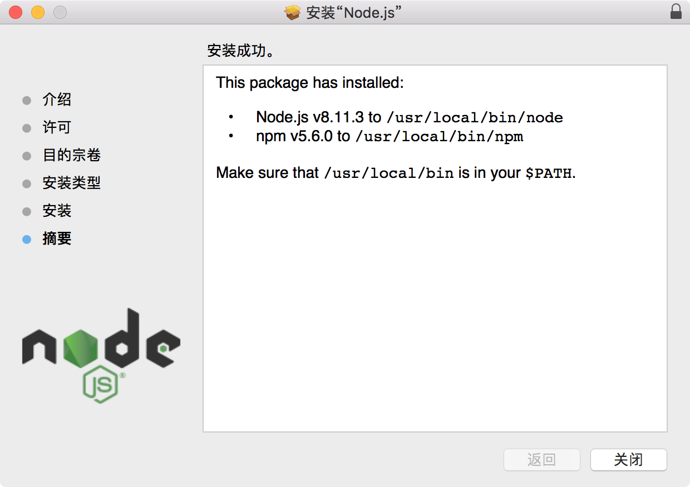
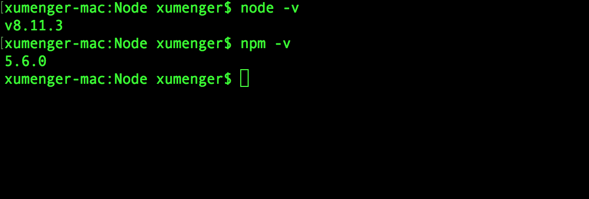
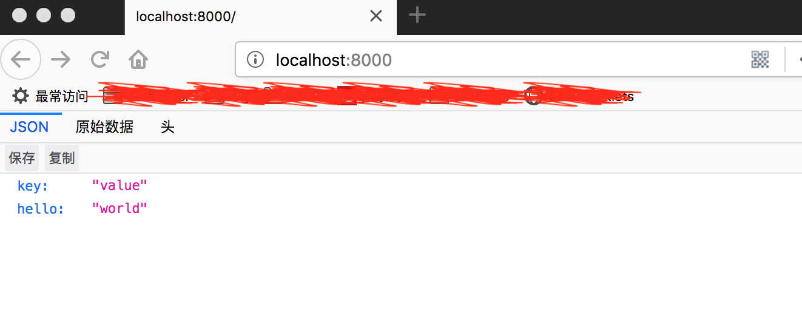

## 安装 node.js

在[node.js官网](https://nodejs.org/en/download/)下载pkg安装包，直接点击即可安装node.js



安装完成后，可以使用下面两个命令测试



然后可以编写这样的测试程序

```javascript
var http = require('http');

var data = {key: 'value', hello: 'world'};

var server = http.createServer(function(req, resp){
    resp.writeHead(200, {'Content-Type': 'application/json'});
    resp.end(JSON.stringify(data));
});

server.listen(8000, function(){
    console.log('listeing on localhost:8000');
});
```

然后执行`node test.js`即可启动服务器，在浏览器中输入`http://localhost:8000`



## 安装express

express作为node.js的一个框架，该框架提供了很多组件，方便了node.js的快速开发，这个就类似与其他语言的一些快速的框架， php中的yii、yp，java中的 SSH

上面安装了node、npm后，就可以通过npm进行全局安装了

>sudo npm install -g express-generator

在node.js中

