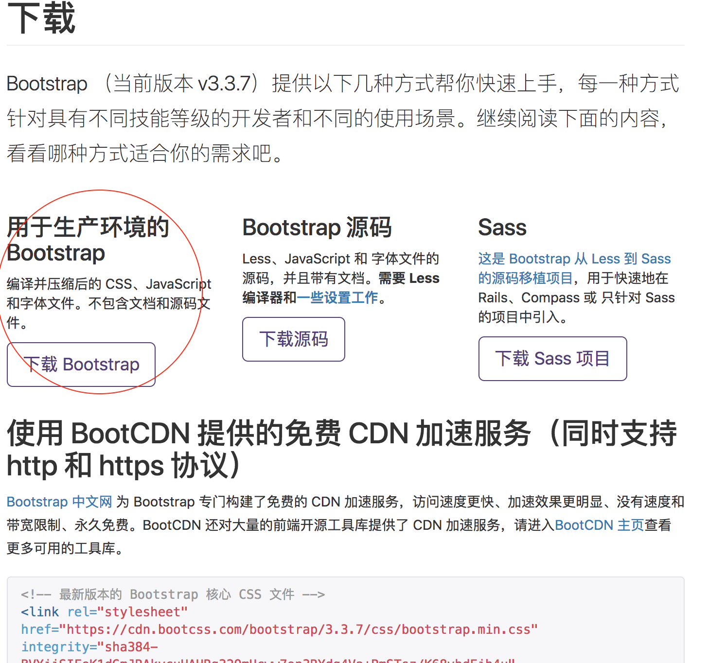
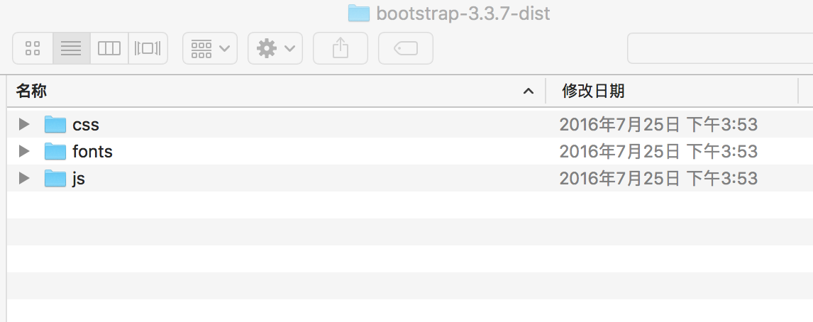
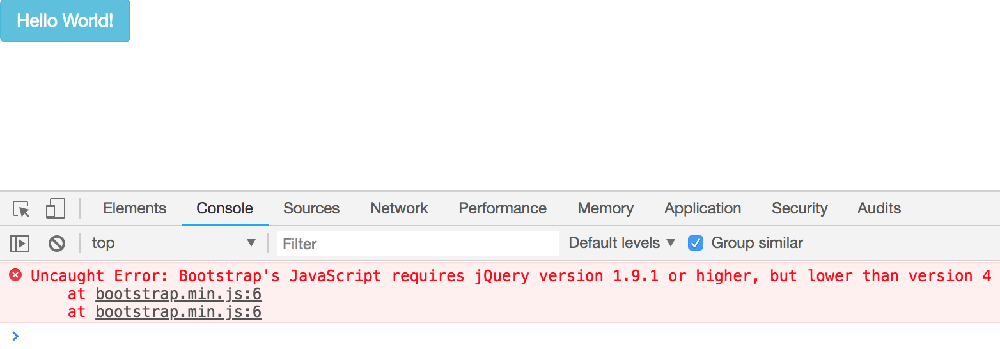
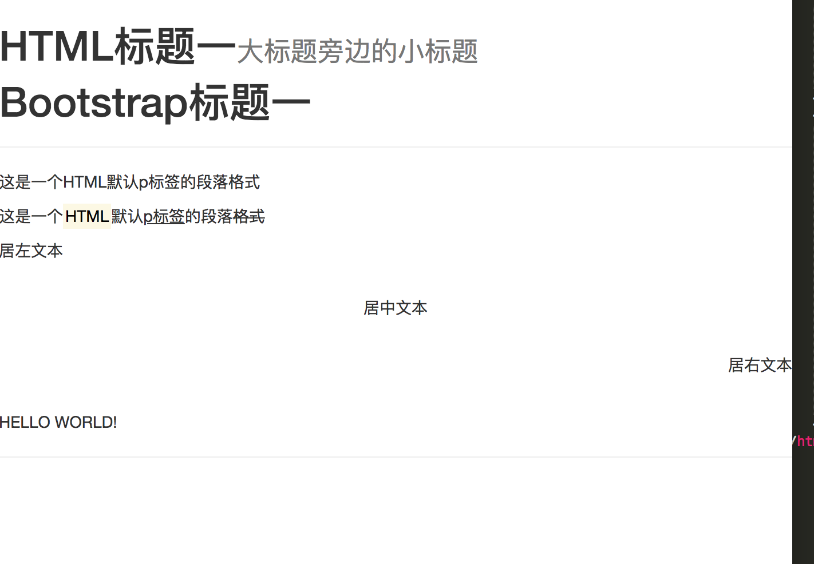
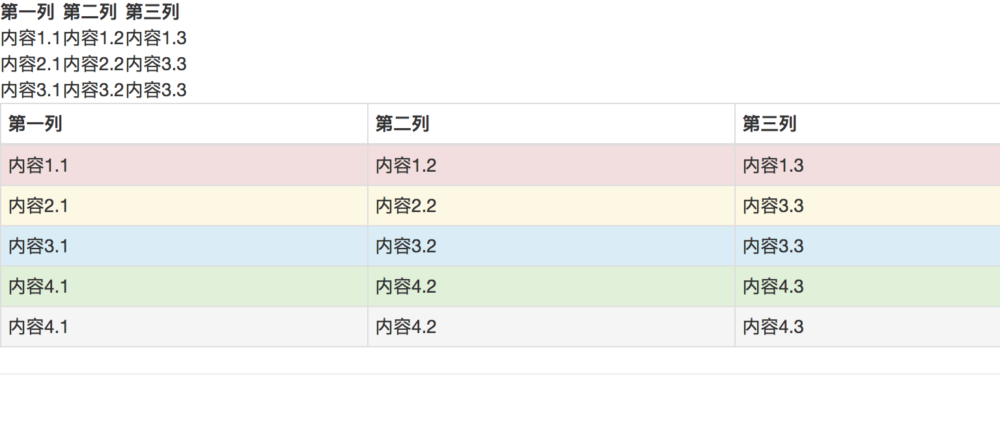
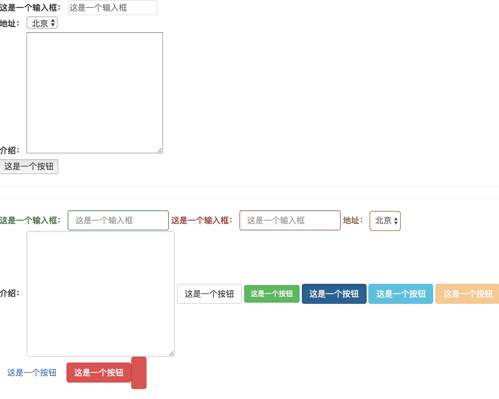
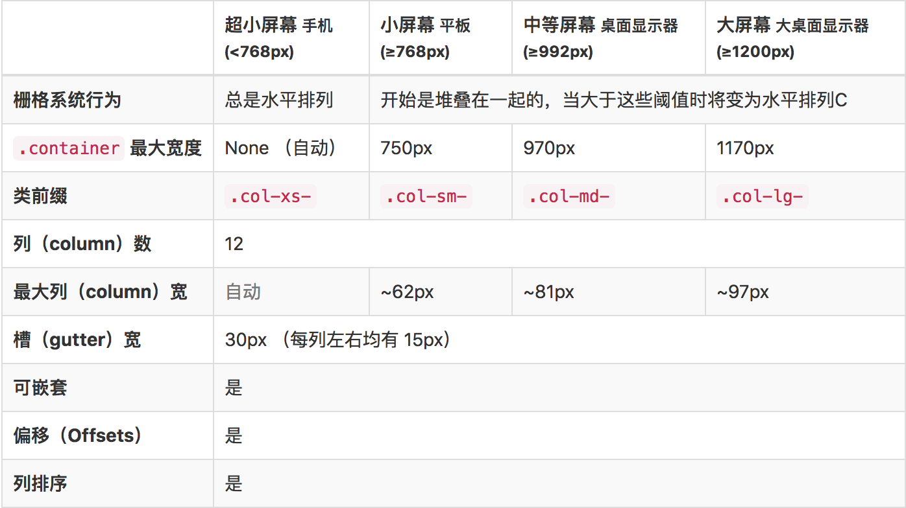
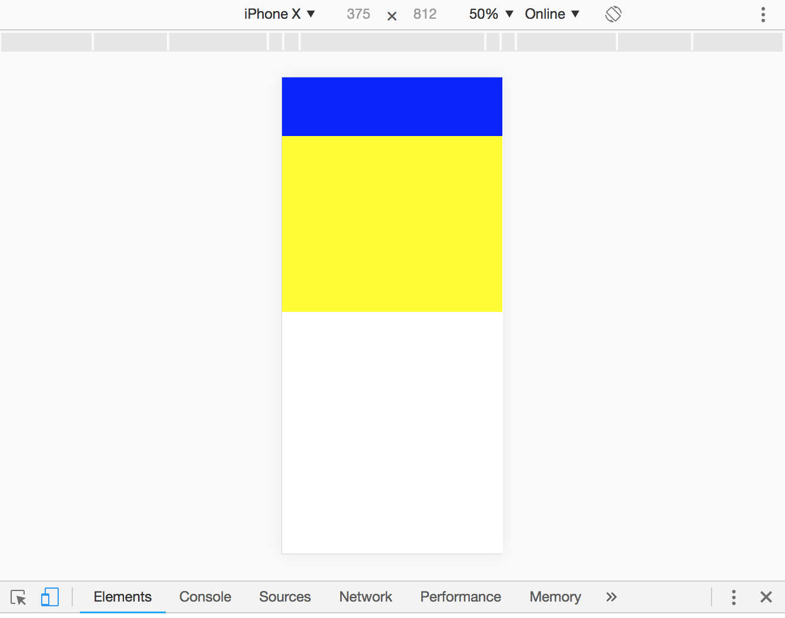

[Bootstrap](https://getbootstrap.com/)是美国 Twitter公司的设计师 Mark Otto和 Jacob Thornton合作基于 HTML、CSS、JavaScript开发的简洁、直观、强悍的前端开发框架，使得 Web 开发更加快捷。Bootstrap提供了优雅的 HTML和 CSS规范，它即是由动态 CSS语言 Less写成

Bootstrap为 Web应用程序快速开发提供了一套前端工具包。可以用 Bootstrap开发响应式布局、移动设备优先的项目

Bootstrap有如下这些特性，吸引了很多开发者

* 响应式设计
* 栅格布局
* 完整的类库环境
* JQuery插件
* 不同的使用场景

使用 Bootstrap进行开发时，可以选择习惯的 vim、sublime编辑器，也可以选择专门针对 Bootstrap设计的可视化开发工具 [Jetstrap](https://jetstrap.com/)，可以直接在网页中去拖拽各个组件来制作非常漂亮的网页

## 开发环境搭建

打开 [Bootstrap中文网](http://www.bootcss.com/)，进入 [Bootstrap3](https://v3.bootcss.com/)下载 Bootstrap3（选择图中标记的那个）



解压后的文件夹是这样的



然后去[下载](http://www.jq22.com/jquery-info122) JQuery-1.7.2版本，并放在和 Bootstrap文件夹相同目录下

然后编写一个基于 Bootstrap的网页

```html
<!DOCTYPE html>
<html lang="en">
    <head>
        <meta charset="UTF-8">
        <title>Bootstrap</title>
        <link rel="stylesheet" href="bootstrap-3.3.7/css/bootstrap.min.css"/>
        <script src="jquery-3.3.1/jquery.min.js"></script>
        <script src="bootstrap-3.3.7/js/bootstrap.min.js"></script>
    </head>
    <body>
        <button class="btn btn-info">Hello World!</button>
    </body>
</html>
```

在浏览器上可以看到运行效果，但是发现 JavaScript运行报错



因为 Bootstrap-3.3.7要求 JQuery的版本为1.9.1及以上，重新下载 JQuery-3.3.1，并修改上面的源码引用正确的JQuery版本，然后就没有问题了

>下文展示一些 Bootstrap的样式效果，更多内容还是通过[官方文档](https://v3.bootcss.com/)进行学习和练习，以尽快构建出好看的 HTML页面

## Bootstrap全局样式

>传统前端开发的过程中往往会花费大量时间在命名、结构修改、页面错乱解决上，Bootstrap作为一套完善的前端样式框架，提供了大量的可用的样式组件，可以有效的在提升网页开发效率的同时保持网页的整洁与美观。因为 Bootstrap提供了大量设计风格统一的样式，使得我们几乎不需要设计师设计过多的页面，甚至在原型界面出来的同时就进行开发了，这样可以大大提升项目开发周期

Bootstrap提供了大量的全局样式，基本的 HTML元素均可以通过 class设置样式并得到增强效果。网页中的排版、表格、表单、图片等常用网页元素的编写都可以轻松的通过 Bootstrap完成

Bootstrap对默认的排版方式进行了 CSS样式定义，使得各种基本结构套用出来的 HTML页面更加美观

比如下面这个例子展示了使用 Bootstrap编写标题、文本、表格、表单、图片等网页元素的代码实现

**标题和文本**

```html
<!DOCTYPE html>
<html lang="en">
    <head>
        <meta charset="UTF-8">
        <title>Bootstrap</title>
        <link rel="stylesheet" href="bootstrap-3.3.7/css/bootstrap.min.css"/>
        <script src="jquery-3.3.1/jquery.min.js"></script>
        <script src="bootstrap-3.3.7/js/bootstrap.min.js"></script>
    </head>
    <body>
        <!-- html中的h1-h6标签都可使用，Bootstrap还提供了.h1-.h6类，为了给内敛属性的文本赋予标题样式 -->
        <!-- h1: 36px、h2: 30px、h3: 24px、h4: 18px、h5: 14px、h6: 12px -->
        <h1>HTML标题一<small>大标题旁边的小标题</small></h1>
        <span class="h1">Bootstrap标题一</span>
        <hr>

        <!-- p标签表示段落，默认14px、行高20px、底部外边距10px -->
        <p>这是一个HTML默认p标签的段落格式</p>
        <p>这是一个<mark>HTML</mark>默认<ins>p标签</ins>的段落<del>格式</del></p>

        <!-- .text-left、.text-center、.text-right设置文本对齐方式 -->
        <p class="text-left">居左文本</p><br>
        <p class="text-center">居中文本</p><br>
        <p class="text-right">居右文本</p><br>
        <!-- .text-lowercase、.text-uppercase、.text-capitalize设置大小写 -->
        <span class="text-uppercase">Hello World!</span>
        <hr>
    </body>
</html>

```

使用浏览器打开的效果是这样的



**表格**

```html
<!DOCTYPE html>
<html lang="en">
    <head>
        <meta charset="UTF-8">
        <title>Bootstrap</title>
        <link rel="stylesheet" href="bootstrap-3.3.7/css/bootstrap.min.css"/>
        <script src="jquery-3.3.1/jquery.min.js"></script>
        <script src="bootstrap-3.3.7/js/bootstrap.min.js"></script>
    </head>
    <body>
        <!-- HTML原生表格 -->
        <table>
            <thead>
                <tr>
                    <th>第一列</th>
                    <th>第二列</th>
                    <th>第三列</th>
                </tr>
            </thead>
            <tbody>
                <tr>
                    <td>内容1.1</td>
                    <td>内容1.2</td>
                    <td>内容1.3</td>
                </tr>
                <tr>
                    <td>内容2.1</td>
                    <td>内容2.2</td>
                    <td>内容3.3</td>
                </tr>
                <tr>
                    <td>内容3.1</td>
                    <td>内容3.2</td>
                    <td>内容3.3</td>
                </tr>
            </tbody>
        </table>
        <!-- 带边框表格 .table-bordered；条纹状表格 .table-striped；悬停变色 .table-hover；紧凑风格 .table-condensed -->
        <!-- 更多的表格样式这里并没有提及，需要自己查文档了解 -->
        <table class="table table-bordered table-striped table-hover table-condensed">
            <thead>
                <tr>
                    <th>第一列</th>
                    <th>第二列</th>
                    <th>第三列</th>
                </tr>
            </thead>
            <tbody>
                <!-- 设置某一行的样式 -->
                <tr class="danger">
                    <td>内容1.1</td>
                    <td>内容1.2</td>
                    <td>内容1.3</td>
                </tr>
                <tr class="warning">
                    <td>内容2.1</td>
                    <td>内容2.2</td>
                    <td>内容3.3</td>
                </tr>
                <tr class="info">
                    <td>内容3.1</td>
                    <td>内容3.2</td>
                    <td>内容3.3</td>
                </tr>
                <tr class="success">
                    <td>内容4.1</td>
                    <td>内容4.2</td>
                    <td>内容4.3</td>
                </tr>
                <tr class="active">
                    <td>内容4.1</td>
                    <td>内容4.2</td>
                    <td>内容4.3</td>
                </tr>
            </tbody>
        </table>
        <hr>
    </body>
</html>
```



**表单**

```html
<!DOCTYPE html>
<html lang="en">
    <head>
        <meta charset="UTF-8">
        <title>Bootstrap</title>
        <link rel="stylesheet" href="bootstrap-3.3.7/css/bootstrap.min.css"/>
        <script src="jquery-3.3.1/jquery.min.js"></script>
        <script src="bootstrap-3.3.7/js/bootstrap.min.js"></script>
    </head>
    <body>
        <!-- html原生表单 -->
        <form>
            <div>
                <label for="">这是一个输入框：</label>
                <input type="text" placeholder="这是一个输入框"/>
            </div>
            <div>
                <label for="">地址：</label>
                <select name="" id="">
                    <option value="">北京</option>
                    <option value="">杭州</option>
                    <option value="">上海</option>
                </select>
            </div>
            <div>
                <label for="">介绍：</label>
                <textarea name="" id="" cols="30" rows="10"></textarea>
            </div>
            <button>这是一个按钮</button>
        </form>
        <hr>
        <hr>
        <!-- Bootstrap给HTML大部分表单都设置了默认样式，可以给表单添加相应的类名，以实现表单的水平排列、个性化定制等 -->
        <!-- .form-inline：水平排列；.form-horizontal：垂直排列-->
        <form class="form-inline" role="form">
            <div class="form-group has-success">
                <label class="control-label" for="">这是一个输入框：</label>
                <input type="text" class="form-control" placeholder="这是一个输入框"/>
            </div>
            <div class="form-group has-error">
                <label class="control-label" for="">这是一个输入框：</label>
                <input type="text" class="form-control" placeholder="这是一个输入框"/>
            </div>
            <div class="form-group has-warning">
                <label class="control-label" for="">地址：</label>
                <select name="" id="" class="form-control">
                    <option value="">北京</option>
                    <option value="">杭州</option>
                    <option value="">上海</option>
                </select>
            </div>
            <div class="form-group">
                <label for="">介绍：</label>
                <textarea name="" id="" cols="30" rows="10" class="form-control"></textarea>
            </div>
            <div class="form-group">
                <button class="btn btn-default btn-lt">这是一个按钮</button>
            </div>
            <div class="form-group">
                <button class="btn btn-success btn-sm">这是一个按钮</button>
            </div>
            <div class="form-group">
                <button class="btn btn-primary active">这是一个按钮</button>
            </div>
            <div class="form-group">
                <button class="btn btn-info btn-block">这是一个按钮</button>
            </div>
            <div class="form-group">
                <button class="btn btn-warning" disabled="disabled">这是一个按钮</button>
            </div>
            <div class="form-group">
                <button class="btn btn-link">这是一个按钮</button>
            </div>
            <div class="form-group">
                <a class="btn btn-danger" href="">这是一个按钮</button>
            </div>
        </form>
        <hr>
    </body>
</html>
```



## Bootstrap开发响应式网页

除了上面展示的 Bootstrap提供的大量 class样式，开发者还可以使用 Bootstrap开发响应式页面，利用栅格系统适配不同的硬件，比如手机、PC、平板

通过下表可以详细查看 Bootstrap 的栅格系统是如何在多种屏幕设备上工作的



>[https://v3.bootcss.com/css/](https://v3.bootcss.com/css/)

**栅格布局**

```html
<!DOCTYPE html>
<html lang="en">
    <head>
        <meta charset="UTF-8">
        <!-- meta标签中的Viewport，在写手机端的时候需要使用它 -->
        <!-- 它可以调整手机端的视窗大小，使得当前手机端的物理屏的单位等于pc端像素的单位的大小 -->
        <!--width=device-width 宽度等于设备宽度
            initial-scale=1 设置网页初始化时的大小
            maximum-scale=1, minimum-scale=1, 控制网页放大/缩小时的倍数
            user-scalable=no 是否允许用户伸缩网页 
        -->
        <meta name="viewport" content="width=device-width, initial-scale=1, maximum-scale=1, minimum-scale=1, user-scalable=no">
        <title>Bootstrap</title>
        <link rel="stylesheet" href="bootstrap-3.3.7/css/bootstrap.min.css"/>
        <script src="jquery-3.3.1/jquery.min.js"></script>
        <script src="bootstrap-3.3.7/js/bootstrap.min.js"></script>
        <style>
            *{
                padding: 0;
                margin: 0;
            }            
            .test{
                width: 300px;
                height: 200px;
                background: red;
            }
            /* 【这是CSS提供的原生的响应式编程语法】
               如果想操作不同的屏幕大小下网页的显示效果，比如在大屏幕中显示2列，小屏幕中显示1列…… 
               下面的意思是：在屏幕宽度在100px到500px时候的样式
               当屏幕大小变成如下的范围内的时候，就会从上面默认的样式变成下面的指定样式
               这样就可以根据屏幕大小做出对应的样式调整
               比如在用户放大和缩小浏览器屏幕的时候，比如在网页需要同时在PC和手机端显示的时候
            */
            @media screen and (min-width: 100px) and (max-width: 500px){
                .test{
                    width: 100%;
                    height: 100px;
                    background: blue;
                }
            }

            .test2{
                height: 300px;
                background: yellow;
            }
        </style>
    </head>
    <body>
        <div class="test"></div>

        <!--col-lg-3 col-md-4 col-sm-6 是Bootstrap提供的样式，它把屏幕分成12等份
        	col-lg-3 表示当判断为大屏幕的时候，宽度占3/12
            col-md-3 表示当判断为中等屏幕的时候，宽度占4/12
            col-sm-6 表示当判断为小屏幕的时候，宽度占6/12
            col-xs-12 表示超小屏幕时占全屏，手机
            col-lg-offset-3 表示当判断是超大屏幕时，往右偏移3/12
            详细对应上面的那张表格，更多的可以类比
            具体请试着拉伸和缩小网页、将网页在手机上浏览的方式来看效果-->
        <div class="test2 col-lg-3 col-md-4 col-sm-6 col-xs-12 col-lg-offset-3"></div>
    </body>
</html>
```

在 816px \* 496px 屏幕上显示是这样的


在 596px \* 496px 屏幕上显示是这样的


使用 Chrome的手机屏幕模拟器看是这样的



**单位**

## Bootstrap组件

```html

```

## 使用Bootstrap开发的典型网页

在 Web开发中，有很多的网页是很典型的，几乎每个 Web系统都需要提供的，比如登录页面、注册页面、博客系统的文章页面、博客系统的文章列表等等

下面就使用 Bootstrap做几个典型的网页！

**一个典型的HTML登录页**

```html

```


**一个典型的HTML内容页**

```html

```


## 其他内容

在研究 Bootstrap3使用的时候，各种使用方法在[https://github.com/xumenger/BootstrapDemo](https://github.com/xumenger/BootstrapDemo)专门进行了简单的梳理和练习
