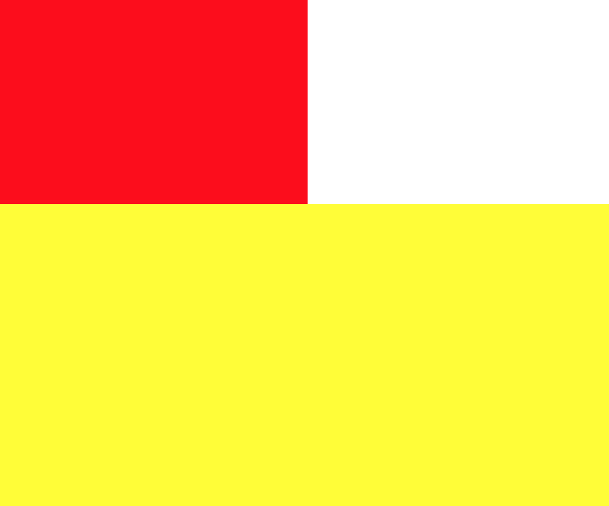

[Bootstrap](https://getbootstrap.com/)是美国 Twitter公司的设计师 Mark Otto和 Jacob Thornton合作基于 HTML、CSS、JavaScript开发的简洁、直观、强悍的前端开发框架，使得 Web 开发更加快捷。Bootstrap提供了优雅的 HTML和 CSS规范，它即是由动态 CSS语言 Less写成

Bootstrap为 Web应用程序快速开发提供了一套前端工具包。可以用 Bootstrap开发响应式布局、移动设备优先的项目

Bootstrap有如下这些特性，吸引了很多开发者

* 响应式设计
* 栅格布局
* 完整的类库环境
* JQuery插件
* 不同的使用场景

使用 Bootstrap进行开发时，可以选择习惯的 vim、sublime编辑器，也可以选择专门针对 Bootstrap设计的可视化开发工具 [Jetstrap](https://jetstrap.com/)，可以直接在网页中去拖拽各个组件来制作非常漂亮的网页

## 开发环境搭建

打开 [Bootstrap中文网](http://www.bootcss.com/)，进入 [Bootstrap3](https://v3.bootcss.com/)下载 Bootstrap3（选择图中标记的那个）


解压后的文件夹是这样的


然后去[下载](http://www.jq22.com/jquery-info122) JQuery-1.7.2版本，并放在和 Bootstrap文件夹相同目录下

然后编写一个基于 Bootstrap的网页

```html
<!DOCTYPE html>
<html lang="en">
    <head>
        <meta charset="UTF-8">
        <title>Bootstrap</title>
        <link rel="stylesheet" href="bootstrap-3.3.7/css/bootstrap.min.css"/>
        <script src="jquery-3.3.1/jquery.min.js"></script>
        <script src="bootstrap-3.3.7/js/bootstrap.min.js"></script>
    </head>
    <body>
        <button class="btn btn-info">Hello World!</button>
    </body>
</html>
```

在浏览器上可以看到运行效果，但是发现 JavaScript运行报错


因为 Bootstrap-3.3.7要求 JQuery的版本为1.9.1及以上，重新下载 JQuery-3.3.1，并修改上面的源码引用正确的JQuery版本，然后就没有问题了

>下文展示一些 Bootstrap的样式效果，更多内容还是通过[官方文档](https://v3.bootcss.com/)进行学习和练习，以尽快构建出好看的 HTML页面

## Bootstrap全局样式

>传统前端开发的过程中往往会花费大量时间在命名、结构修改、页面错乱解决上，Bootstrap作为一套完善的前端样式框架，提供了大量的可用的样式组件，可以有效的在提升网页开发效率的同时保持网页的整洁与美观。因为 Bootstrap提供了大量设计风格统一的样式，使得我们几乎不需要设计师设计过多的页面，甚至在原型界面出来的同时就进行开发了，这样可以大大提升项目开发周期

Bootstrap提供了大量的全局样式，基本的 HTML元素均可以通过 class设置样式并得到增强效果。网页中的排版、表格、表单、图片等常用网页元素的编写都可以轻松的通过 Bootstrap完成

Bootstrap对默认的排版方式进行了 CSS样式定义，使得各种基本结构套用出来的 HTML页面更加美观

比如下面这个例子展示了使用 Bootstrap编写标题、文本、表格、表单、图片等网页元素的代码实现

**标题和文本**

```html
<!DOCTYPE html>
<html lang="en">
    <head>
        <meta charset="UTF-8">
        <title>Bootstrap</title>
        <link rel="stylesheet" href="bootstrap-3.3.7/css/bootstrap.min.css"/>
        <script src="jquery-3.3.1/jquery.min.js"></script>
        <script src="bootstrap-3.3.7/js/bootstrap.min.js"></script>
    </head>
    <body>
        <!-- html中的h1-h6标签都可使用，Bootstrap还提供了.h1-.h6类，为了给内敛属性的文本赋予标题样式 -->
        <!-- h1: 36px、h2: 30px、h3: 24px、h4: 18px、h5: 14px、h6: 12px -->
        <h1>HTML标题一<small>大标题旁边的小标题</small></h1>
        <span class="h1">Bootstrap标题一</span>
        <hr>

        <!-- p标签表示段落，默认14px、行高20px、底部外边距10px -->
        <p>这是一个HTML默认p标签的段落格式</p>
        <p>这是一个<mark>HTML</mark>默认<ins>p标签</ins>的段落<del>格式</del></p>

        <!-- .text-left、.text-center、.text-right设置文本对齐方式 -->
        <p class="text-left">居左文本</p><br>
        <p class="text-center">居中文本</p><br>
        <p class="text-right">居右文本</p><br>
        <!-- .text-lowercase、.text-uppercase、.text-capitalize设置大小写 -->
        <span class="text-uppercase">Hello World!</span>
        <hr>
    </body>
</html>

```

使用浏览器打开的效果是这样的


**表格**

```html
<!DOCTYPE html>
<html lang="en">
    <head>
        <meta charset="UTF-8">
        <title>Bootstrap</title>
        <link rel="stylesheet" href="bootstrap-3.3.7/css/bootstrap.min.css"/>
        <script src="jquery-3.3.1/jquery.min.js"></script>
        <script src="bootstrap-3.3.7/js/bootstrap.min.js"></script>
    </head>
    <body>
        <!-- HTML原生表格 -->
        <table>
            <thead>
                <tr>
                    <th>第一列</th>
                    <th>第二列</th>
                    <th>第三列</th>
                </tr>
            </thead>
            <tbody>
                <tr>
                    <td>内容1.1</td>
                    <td>内容1.2</td>
                    <td>内容1.3</td>
                </tr>
                <tr>
                    <td>内容2.1</td>
                    <td>内容2.2</td>
                    <td>内容3.3</td>
                </tr>
                <tr>
                    <td>内容3.1</td>
                    <td>内容3.2</td>
                    <td>内容3.3</td>
                </tr>
            </tbody>
        </table>
        <!-- 带边框表格 .table-bordered；条纹状表格 .table-striped；悬停变色 .table-hover；紧凑风格 .table-condensed -->
        <!-- 更多的表格样式这里并没有提及，需要自己查文档了解 -->
        <table class="table table-bordered table-striped table-hover table-condensed">
            <thead>
                <tr>
                    <th>第一列</th>
                    <th>第二列</th>
                    <th>第三列</th>
                </tr>
            </thead>
            <tbody>
                <!-- 设置某一行的样式 -->
                <tr class="danger">
                    <td>内容1.1</td>
                    <td>内容1.2</td>
                    <td>内容1.3</td>
                </tr>
                <tr class="warning">
                    <td>内容2.1</td>
                    <td>内容2.2</td>
                    <td>内容3.3</td>
                </tr>
                <tr class="info">
                    <td>内容3.1</td>
                    <td>内容3.2</td>
                    <td>内容3.3</td>
                </tr>
                <tr class="success">
                    <td>内容4.1</td>
                    <td>内容4.2</td>
                    <td>内容4.3</td>
                </tr>
                <tr class="active">
                    <td>内容4.1</td>
                    <td>内容4.2</td>
                    <td>内容4.3</td>
                </tr>
            </tbody>
        </table>
        <hr>
    </body>
</html>
```


**表单**

```html
<!DOCTYPE html>
<html lang="en">
    <head>
        <meta charset="UTF-8">
        <title>Bootstrap</title>
        <link rel="stylesheet" href="bootstrap-3.3.7/css/bootstrap.min.css"/>
        <script src="jquery-3.3.1/jquery.min.js"></script>
        <script src="bootstrap-3.3.7/js/bootstrap.min.js"></script>
    </head>
    <body>
        <!-- html原生表单 -->
        <form>
            <div>
                <label for="">这是一个输入框：</label>
                <input type="text" placeholder="这是一个输入框"/>
            </div>
            <div>
                <label for="">地址：</label>
                <select name="" id="">
                    <option value="">北京</option>
                    <option value="">杭州</option>
                    <option value="">上海</option>
                </select>
            </div>
            <div>
                <label for="">介绍：</label>
                <textarea name="" id="" cols="30" rows="10"></textarea>
            </div>
            <button>这是一个按钮</button>
        </form>
        <hr>
        <hr>
        <!-- Bootstrap给HTML大部分表单都设置了默认样式，可以给表单添加相应的类名，以实现表单的水平排列、个性化定制等 -->
        <!-- .form-inline：水平排列；.form-horizontal：垂直排列-->
        <form class="form-inline" role="form">
            <div class="form-group has-success">
                <label class="control-label" for="">这是一个输入框：</label>
                <input type="text" class="form-control" placeholder="这是一个输入框"/>
            </div>
            <div class="form-group has-error">
                <label class="control-label" for="">这是一个输入框：</label>
                <input type="text" class="form-control" placeholder="这是一个输入框"/>
            </div>
            <div class="form-group has-warning">
                <label class="control-label" for="">地址：</label>
                <select name="" id="" class="form-control">
                    <option value="">北京</option>
                    <option value="">杭州</option>
                    <option value="">上海</option>
                </select>
            </div>
            <div class="form-group">
                <label for="">介绍：</label>
                <textarea name="" id="" cols="30" rows="10" class="form-control"></textarea>
            </div>
            <div class="form-group">
                <button class="btn btn-default btn-lt">这是一个按钮</button>
            </div>
            <div class="form-group">
                <button class="btn btn-success btn-sm">这是一个按钮</button>
            </div>
            <div class="form-group">
                <button class="btn btn-primary active">这是一个按钮</button>
            </div>
            <div class="form-group">
                <button class="btn btn-info btn-block">这是一个按钮</button>
            </div>
            <div class="form-group">
                <button class="btn btn-warning" disabled="disabled">这是一个按钮</button>
            </div>
            <div class="form-group">
                <button class="btn btn-link">这是一个按钮</button>
            </div>
            <div class="form-group">
                <a class="btn btn-danger" href="">这是一个按钮</button>
            </div>
        </form>
        <hr>
    </body>
</html>
```


## Bootstrap开发响应式网页

除了上面展示的 Bootstrap提供的大量 class样式，开发者还可以使用 Bootstrap开发响应式页面，利用栅格系统适配不同的硬件，比如手机、PC、平板

通过下表可以详细查看 Bootstrap 的栅格系统是如何在多种屏幕设备上工作的


>[https://v3.bootcss.com/css/](https://v3.bootcss.com/css/)

**栅格布局**

```html
<!DOCTYPE html>
<html lang="en">
    <head>
        <meta charset="UTF-8">
        <!-- meta标签中的Viewport，在写手机端的时候需要使用它 -->
        <!-- 它可以调整手机端的视窗大小，使得当前手机端的物理屏的单位等于pc端像素的单位的大小 -->
        <!--width=device-width 宽度等于设备宽度
            initial-scale=1 设置网页初始化时的大小
            maximum-scale=1, minimum-scale=1, 控制网页放大/缩小时的倍数
            user-scalable=no 是否允许用户伸缩网页 
        -->
        <meta name="viewport" content="width=device-width, initial-scale=1, maximum-scale=1, minimum-scale=1, user-scalable=no">
        <title>Bootstrap</title>
        <link rel="stylesheet" href="bootstrap-3.3.7/css/bootstrap.min.css"/>
        <script src="jquery-3.3.1/jquery.min.js"></script>
        <script src="bootstrap-3.3.7/js/bootstrap.min.js"></script>
        <style>
            *{
                padding: 0;
                margin: 0;
            }            
            .test{
                width: 300px;
                height: 200px;
                background: red;
            }
            /* 【这是CSS提供的原生的响应式编程语法】
               如果想操作不同的屏幕大小下网页的显示效果，比如在大屏幕中显示2列，小屏幕中显示1列…… 
               下面的意思是：在屏幕宽度在100px到500px时候的样式
               当屏幕大小变成如下的范围内的时候，就会从上面默认的样式变成下面的指定样式
               这样就可以根据屏幕大小做出对应的样式调整
               比如在用户放大和缩小浏览器屏幕的时候，比如在网页需要同时在PC和手机端显示的时候
            */
            @media screen and (min-width: 100px) and (max-width: 500px){
                .test{
                    width: 100%;
                    height: 100px;
                    background: blue;
                }
            }

            .test2{
                height: 300px;
                background: yellow;
            }
        </style>
    </head>
    <body>
        <div class="test"></div>

        <!--col-lg-3 col-md-4 col-sm-6 是Bootstrap提供的样式，它把屏幕分成12等份
        	col-lg-3 表示当判断为大屏幕的时候，宽度占3/12
            col-md-3 表示当判断为中等屏幕的时候，宽度占4/12
            col-sm-6 表示当判断为小屏幕的时候，宽度占6/12
            col-xs-12 表示超小屏幕时占全屏，手机
            col-lg-offset-3 表示当判断是超大屏幕时，往右偏移3/12
            详细对应上面的那张表格，更多的可以类比
            具体请试着拉伸和缩小网页、将网页在手机上浏览的方式来看效果-->
        <div class="test2 col-lg-3 col-md-4 col-sm-6 col-xs-12 col-lg-offset-3"></div>
    </body>
</html>
```

在 816px \* 496px 屏幕上显示是这样的


在 596px \* 496px 屏幕上显示是这样的



使用 Chrome的手机屏幕模拟器看是这样的


手机横过来之后看是这样的效果


**网页开发中的单位**

在前端开发中，常用到这些长度单位

* px：相对于显示屏幕分辨率的长度单位
	* px的大小无法随着屏幕放大缩小
	* 所有浏览器都支持px单位
* em：相对于当前文本内的字体尺寸
	* 会继承父级元素的字体大小，当父元素放大和缩小后，对应子元素也放大和缩小
	* em适合于进行手机端开发的文字，适合进行大小的调整以更适合手机端去浏览
	* IE的部分浏览器并不支持em
* rem：与em类似，相对于HTML根节点的字体单位
	* 为了应对em大小不稳定的问题，出现了rem的单位
	* rem会继承根节点的字体大小
	* 比如设置样式 `html { font-size = 62.5%; }`，那么rem的大小就是这个值

**字体图标**

在 Web开发中，网页设计一定会用到大量的图片，可想而知，一旦网站的流量变多后，那么这么多客户端对服务器的 HTTP请求对应也就变多了，对图片资源的管理、服务器应对网络的压力都变大了，所以怎么能够减少图片的使用呢？

最直接的方法就是减少图片的使用、或者让图片的体积变小；更好的方式是将图片以文字的形式出现，有一些文字可以做成图标的形状，细想一下，我们书写的文字无非也是一种形状。通过用字体图标做出图片的形状，然后以字体的形式做出来，如果想要改变图片的大小、颜色，就直接用样式改变字体的大小、颜色就好了

```html
<!DOCTYPE html>
<html lang="en">
    <head>
        <meta charset="UTF-8">
        <title>Bootstrap</title>
        <link rel="stylesheet" href="bootstrap-3.3.7/css/bootstrap.min.css"/>
        <script src="jquery-3.3.1/jquery.min.js"></script>
        <script src="bootstrap-3.3.7/js/bootstrap.min.js"></script>
        <style>
            .glyphicon-tasks{
                color: red;
                /* 因为它是字体，所以不会像图片一样在放大后失真 */
                font-size: 100px;
            }
            .glyphicon-globe{
                color: yellow;
                font-size: 100px;
            }
            .glyphicon-scissors{
                color: blue;
                font-size: 100px;
            }
        </style>
    </head>
    <body>
        <span class="glyphicon glyphicon-tasks"></span>
        <span class="glyphicon glyphicon-globe"></span>
        <span class="glyphicon glyphicon-scissors"></span>
    </body>
</html>
```


Bootstrap提供了字体图标 [https://v3.bootcss.com/components/](https://v3.bootcss.com/components/)

国内的阿里也提供了大量的字体图标可以在开发中使用 [http://www.iconfont.cn/](http://www.iconfont.cn/)

## Bootstrap组件

组件是一个网站、一个APP或一个系统的构件，或者是一些零件的组合，Bootstrap实现了很多可以复用的组件，比如：字体图标、下拉菜单、导航、警告框、弹出框、列表……

```html
<!DOCTYPE html>
<html lang="en">
    <head>
        <meta charset="UTF-8">
        <title>Bootstrap</title>
        <link rel="stylesheet" href="bootstrap-3.3.7/css/bootstrap.min.css"/>
        <script src="jquery-3.3.1/jquery.min.js"></script>
        <script src="bootstrap-3.3.7/js/bootstrap.min.js"></script>
    </head>
    <body>
    	<!--字体图标可以用到按钮、工具条中的按钮组、导航或输入框等地方-->
        <button type="button" class="btn btn-default" aria-label="Left Align">
            <span class="glyphicon glyphicon glyphicon-align-left"></span>
        </button>
        <button type="button" class="btn btn-default" aria-label="Left Align">
            <span class="glyphicon glyphicon glyphicon-align-right"></span>
        </button>
        <button type="button" class="btn btn-default btn-lg">
            <span class="glyphicon glyphicon-star" aria-hidden="true"></span> Star
        </button>
        <hr>

        <!-- alert组件中包含的图标用于表示这是一条错误信息 
            通过添加额外的 .sr-only 文本就可以让辅助设备知道这条提示所要表达的意思了-->
        <div class="alert alert-danger" role="alert">
            <span class="glyphicon glyphicon-exclamation-sign" aria-hidden="true"></span>
            <span class="sr-only">Error:</span>
            Enter a valid email address
        </div>
        <hr>

        <!-- 将下拉菜单触发器和下拉菜单都包括在.dropdown里，或者另一个声明了position: relative; 的元素 -->
        <div class="dropdown">
            <button class="btn btn-default dropdown-toggle" type="button" id="dropdownMenu1" data-toggle="dropdown" aria-haspopup="true" aria-expanded="true">
                Dropdown
                <span class="caret"></span>
            </button>
            <ul class="dropdown-menu" aria-labelledby="dropdownMenu1">
                <li><a href="#">Action</a></li>
                <li><a href="#">Another action</a></li>
                <li><a href="#">Something else here</a></li>
                <li class="disabled"><a href="#">Disabled link</a></li>
                <li role="separator" class="divider"></li>
                <li><a href="#">Separated link</a></li>
            </ul>
        </div>
        <hr>

        <!-- 嵌套 -->
        <div class="btn-group" role="group" aria-label="...">
            <button type="button" class="btn btn-default">1</button>
            <button type="button" class="btn btn-default">2</button>

            <div class="btn-group" role="group">
                <button type="button" class="btn btn-default dropdown-toggle" data-toggle="dropdown" aria-haspopup="true" aria-expanded="false">
                    Dropdown
                    <span class="caret"></span>
                </button>
                <ul class="dropdown-menu">
                    <li><a href="#">Dropdown link</a></li>
                    <li><a href="#">Dropdown link</a></li>
                </ul>
            </div>
        </div>
        <hr>

        <!-- 分裂式按钮下拉菜单 -->
        <div class="btn-group">
            <button type="button" class="btn btn-danger">Action</button>
            <button type="button" class="btn btn-danger dropdown-toggle" data-toggle="dropdown" aria-haspopup="true" aria-expanded="false">
                <span class="caret"></span>
                <span class="sr-only">Toggle Dropdown</span>
            </button>
            <ul class="dropdown-menu">
                <li><a href="#">Action</a></li>
                <li><a href="#">Another action</a></li>
                <li><a href="#">Something else here</a></li>
                <li role="separator" class="divider"></li>
                <li><a href="#">Separated link</a></li>
            </ul>
        </div>
        <hr>

        <!-- 输入框-->
        <div class="input-group">
            <span class="input-group-addon" id="basic-addon1">@</span>
            <input type="text" class="form-control" placeholder="Username" aria-describedby="basic-addon1">
        </div>

        <div class="input-group">
            <input type="text" class="form-control" placeholder="Recipient's username" aria-describedby="basic-addon2">
            <span class="input-group-addon" id="basic-addon2">@example.com</span>
        </div>

        <div class="input-group">
            <span class="input-group-addon">$</span>
            <input type="text" class="form-control" aria-label="Amount (to the nearest dollar)">
            <span class="input-group-addon">.00</span>
        </div>

        <label for="basic-url">Your vanity URL</label>
        <div class="input-group">
            <span class="input-group-addon" id="basic-addon3">https://example.com/users/</span>
            <input type="text" class="form-control" id="basic-url" aria-describedby="basic-addon3">
        </div>
        <hr>

        <!-- 导航栏 -->
        <ul class="nav nav-tabs">
            <li role="presentation" class="active"><a href="#">Home</a></li>
            <li role="presentation"><a href="#">Profile</a></li>
            <li role="presentation"><a href="#">Messages</a></li>
        </ul>
        <hr>

        <ul class="nav nav-pills nav-stacked">
            <li role="presentation" class="active"><a href="#">Home</a></li>
            <li role="presentation"><a href="#">Profile</a></li>
            <li role="presentation"><a href="#">Messages</a></li>
        </ul>
        <hr>

        <!-- 巨幕 -->
        <div class="jumbotron">
        <h1>Hello, world!</h1>
            <p>...</p>
            <p><a class="btn btn-primary btn-lg" href="#" role="button">Learn more</a></p>
        </div>
        <hr>

        <!--缩略图-->
        <div class="row">
            <div class="col-sm-6 col-md-4">
                <div class="thumbnail">
                    
                    <div class="caption">
                        <h3>Thumbnail label</h3>
                        <p>Cras justo odio, dapibus ac facilisis in, egestas eget quam. Donec id elit non mi porta gravida at eget metus. Nullam id dolor id nibh ultricies vehicula ut id elit</p>
                        <p><a href="#" class="btn btn-primary" role="button">Button</a> <a href="#" class="btn btn-default" role="button">Button</a></p>
                    </div>
                </div>
            </div>
        </div>
        <hr>

        <!-- 进度条 -->
        <div class="progress">
            <div class="progress-bar" role="progressbar" aria-valuenow="60" aria-valuemin="0" aria-valuemax="100" style="width: 60%;">
                60%
            </div>
        </div>

    </body>
</html>
```


>[https://v3.bootcss.com/components/](https://v3.bootcss.com/components/)讲到了所有的组件，可以在这里找你需要的组件

## 使用Bootstrap开发的典型网页

在 Web开发中，有很多的网页是很典型的，几乎每个 Web系统都需要提供的，比如登录页面、注册页面、博客系统的文章页面、博客系统的文章列表等等

上面的内容对于 Bootstrap的全局样式、响应式、组件都进行了介绍，那么就把上面的这些知识点组合起来开发一些典型的 Web网页

* [全局CSS样式](https://v3.bootcss.com/css/)
* [组件](https://v3.bootcss.com/components/)
* [JavaScript插件](https://v3.bootcss.com/javascript/)
* [使用 Bootstrap开发的示例网站](https://v3.bootcss.com/customize/)

下面就使用 Bootstrap做一个典型的登录网页！

```html
<!DOCTYPE html>
<html>
<head>
    <meta charset="utf-8"/>
    <meta http-equiv="X-UA-Compatible" content="IE=edge,chrome=1">      
    <meta http-equiv="Cache-Control" content="no-transform" />
    <meta http-equiv="Cache-Control" content="no-siteapp" />
    <meta name="viewport" content="width=device-width, initial-scale=1.0, minimum-scale=1.0, maximum-scale=1.0, user-scalable=no">
    <title>Login</title>
    <meta name="keywords" content="Bootstrap html login" />
    <meta name="description" content="这是一款基于Bootstrap开发的会员登录界面模板源码" />
    <meta name="author" content="xumenger" />
    <meta name="Copyright" content="xumenger" />
    <!-- Bootstrap依赖于JQuery，所以对JQuery的引用放在前面 -->
    <script src="jquery-3.3.1/jquery.min.js"></script>
    <link href="bootstrap-3.3.7/css/bootstrap.min.css" rel="stylesheet" id="bootstrap-css">
    <script src="bootstrap-3.3.7/js/bootstrap.min.js"></script>
    <style>
        /* Credit to bootsnipp.com for the css for the color graph */
        .colorgraph {
          height: 5px;
          border-top: 0;
          background: #c4e17f;
          border-radius: 5px;
          background-image: -webkit-linear-gradient(left, #c4e17f, #c4e17f 12.5%, #f7fdca 12.5%, #f7fdca 25%, #fecf71 25%, #fecf71 37.5%, #f0776c 37.5%, #f0776c 50%, #db9dbe 50%, #db9dbe 62.5%, #c49cde 62.5%, #c49cde 75%, #669ae1 75%, #669ae1 87.5%, #62c2e4 87.5%, #62c2e4);
          background-image: -moz-linear-gradient(left, #c4e17f, #c4e17f 12.5%, #f7fdca 12.5%, #f7fdca 25%, #fecf71 25%, #fecf71 37.5%, #f0776c 37.5%, #f0776c 50%, #db9dbe 50%, #db9dbe 62.5%, #c49cde 62.5%, #c49cde 75%, #669ae1 75%, #669ae1 87.5%, #62c2e4 87.5%, #62c2e4);
          background-image: -o-linear-gradient(left, #c4e17f, #c4e17f 12.5%, #f7fdca 12.5%, #f7fdca 25%, #fecf71 25%, #fecf71 37.5%, #f0776c 37.5%, #f0776c 50%, #db9dbe 50%, #db9dbe 62.5%, #c49cde 62.5%, #c49cde 75%, #669ae1 75%, #669ae1 87.5%, #62c2e4 87.5%, #62c2e4);
          background-image: linear-gradient(to right, #c4e17f, #c4e17f 12.5%, #f7fdca 12.5%, #f7fdca 25%, #fecf71 25%, #fecf71 37.5%, #f0776c 37.5%, #f0776c 50%, #db9dbe 50%, #db9dbe 62.5%, #c49cde 62.5%, #c49cde 75%, #669ae1 75%, #669ae1 87.5%, #62c2e4 87.5%, #62c2e4);
        }
    </style>
    <script type="text/javascript">
        $(function(){
            $('.button-checkbox').each(function(){
                var $widget = $(this),
                    $button = $widget.find('button'),
                    $checkbox = $widget.find('input:checkbox'),
                    color = $button.data('color'),
                    settings = {
                            on: {
                                icon: 'glyphicon glyphicon-check'
                            },
                            off: {
                                icon: 'glyphicon glyphicon-unchecked'
                            }
                    };

                $button.on('click', function () {
                    $checkbox.prop('checked', !$checkbox.is(':checked'));
                    $checkbox.triggerHandler('change');
                    updateDisplay();
                });

                $checkbox.on('change', function () {
                    updateDisplay();
                });

                function updateDisplay() {
                    var isChecked = $checkbox.is(':checked');
                    // Set the button's state
                    $button.data('state', (isChecked) ? "on" : "off");

                    // Set the button's icon
                    $button.find('.state-icon')
                        .removeClass()
                        .addClass('state-icon ' + settings[$button.data('state')].icon);

                    // Update the button's color
                    if (isChecked) {
                        $button
                            .removeClass('btn-default')
                            .addClass('btn-' + color + ' active');
                    }
                    else
                    {
                        $button
                            .removeClass('btn-' + color + ' active')
                            .addClass('btn-default');
                    }
                }
                function init() {
                    updateDisplay();
                    // Inject the icon if applicable
                    if ($button.find('.state-icon').length == 0) {
                        $button.prepend('<i class="state-icon ' + settings[$button.data('state')].icon + '"></i> ');
                    }
                }
                init();
            });
        });
    </script>
</head>
<body>
    <div class="container">
        <div class="row" style="margin-top:20px">
            <div class="col-xs-12 col-sm-8 col-md-6 col-sm-offset-2 col-md-offset-3">
                <form role="form">
                    <fieldset>
                        <h2>Please Sign In</h2>
                        <hr class="colorgraph">
                        <div class="form-group">
                            <input type="email" name="email" id="email" class="form-control input-lg" placeholder="Email Address">
                        </div>
                        <div class="form-group">
                            <input type="password" name="password" id="password" class="form-control input-lg" placeholder="Password">
                        </div>
                        <span class="button-checkbox">
                            <button type="button" class="btn" data-color="info">Remember Me</button>
                            <input type="checkbox" name="remember_me" id="remember_me" checked="checked" class="hidden">
                            <a href="" class="btn btn-link pull-right">Forgot Password?</a>
                        </span>
                        <hr class="colorgraph">
                        <div class="row">
                            <div class="col-xs-6 col-sm-6 col-md-6">
                                <input type="submit" class="btn btn-lg btn-success btn-block" value="Sign In">
                            </div>
                            <div class="col-xs-6 col-sm-6 col-md-6">
                                <a href="" class="btn btn-lg btn-primary btn-block">Register</a>
                            </div>
                        </div>
                    </fieldset>
                </form>
            </div>
        </div>
    </div>
</body>
</html>
```


>[https://bootsnipp.com/](https://bootsnipp.com/)提供了大量使用 Bootstrap开发的网页模板！刚开始的时候可以通过这里的资源模仿和学习

## 其他内容

在研究 Bootstrap3使用的时候，各种使用方法在[https://github.com/xumenger/BootstrapDemo](https://github.com/xumenger/BootstrapDemo)专门进行了简单的梳理和练习

以上只是局部知识点，更多的要在开发中结合下面的文档链接

* [https://v3.bootcss.com/css/](https://v3.bootcss.com/css/)
* [https://v3.bootcss.com/components/](https://v3.bootcss.com/components/)
* [https://v3.bootcss.com/javascript/](https://v3.bootcss.com/javascript/)
* [https://v3.bootcss.com/customize/](https://v3.bootcss.com/customize/)
* [网站实例](http://www.youzhan.org/)
* [基于 Bootstrap的网页模板](https://bootsnipp.com/)