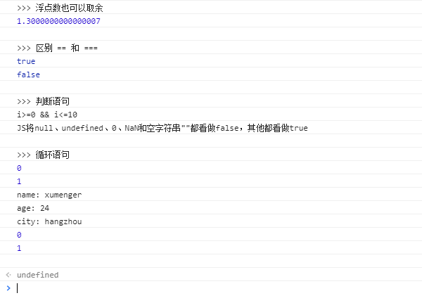
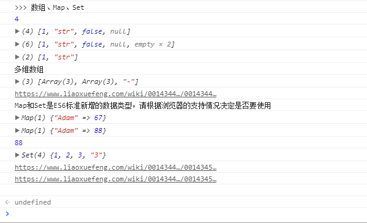
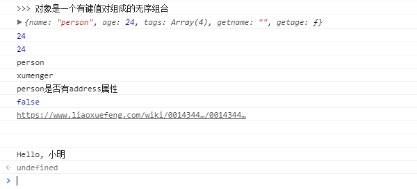
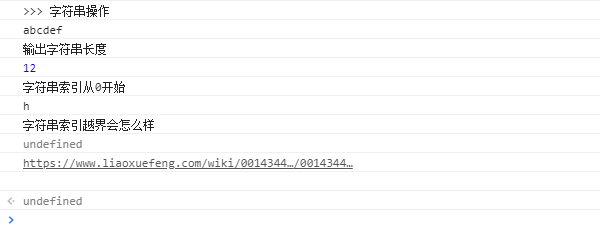
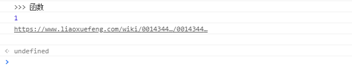

1995年，当时的网景公司正凭借其 Navigator浏览器成为 Web时代开启时最著名的第一代互联网公司。由于网景公司希望能在静态 HTML页面上添加一些动态效果，于是叫 Brendan Eich在两周内设计出 JavaScript语言。是的！就两周！

因为网景开发了 JavaScript，一年后微软又模仿 JavaScript开发了 JScript，为了让 JavaScript成为全球标准，几个公司联合 ECMA（European Computer Manufacturers Association）组织定制了 JavaScript语言的标准，被称为 ECMAScript标准。

所以简单说来就是，ECMAScript是一种语言标准，而 JavaScript是网景公司对 ECMAScript标准的一种实现

要让浏览器运行 JavaScript，必须先有一个 HTML页面，在HTML页面中引入 JavaScript，然后让浏览器加载该 HTML页面，就可以执行 JavaScript代码

你也许会想，直接在我的硬盘上创建好 HTML和J avaScript文件，然后用浏览器打开，不就可以看到效果了吗？这种方式允许部分 JavaScript代码没有问题，但由于浏览器的安全限制，以 `file://`开头的地址无法执行如联网等功能的 JavaScript代码，最终你还是需要架设一个Web服务器，然后以 `http://`开头的地址开正常执行所有 JavaScript代码

## 快速过一下JavaScript的语法

直接来一段包含了各种语法的代码（执行 JavaScript代码的方法也很简单，直接拷贝到 Chrome的 Console上回车即可）

**基础语法**

```js
console.log(">>> 浮点数也可以取余");
console.log(10.3 % 3);
console.log("");

console.log(">>> 区别 == 和 ===");
console.log(false == 0);
console.log(false === 0);
console.log("");

console.log(">>> 判断语句");
var i = 10;
if(i<0){
    console.log("i < 0");
}else if(i>=0 && i<=10){
    console.log("i>=0 && i<=10");
}else{
    console.log("i > 10");
}
console.log("JS将null、undefined、0、NaN和空字符串\"\"都看做false，其他都看做true");
console.log("");

console.log(">>> 循环语句");
var j = 0;
for(j=0; j<2; j++){
    console.log(j);
}
var o = {
    name: 'xumenger',
    age: 24,
    city: "hangzhou"
};
for(var key in o){
    console.log(key + ": " + o[key]);
}
var j = 0;
while(j < 2){
    console.log(j);
    j++;
}
console.log("");
```



**数组、Map、Set**

```js
console.log(">>> 数组、Map、Set");
var arr = [1, "str", false, null];
console.log(arr.length)
console.log(arr);
arr.length = 6;
console.log(arr);
arr.length = 2;
console.log(arr);
console.log("多维数组");
var arr1 = [[1, 2, 3], [400, 500, 600], '-'];
console.log(arr1);
console.log("https://www.liaoxuefeng.com/wiki/001434446689867b27157e896e74d51a89c25cc8b43bdb3000/00143449921138898cdeb7fc2214dc08c6c67827758cd2f000");
console.log("Map和Set是ES6标准新增的数据类型，请根据浏览器的支持情况决定是否要使用");
var m = new Map();
console.log(m.set('Adam', 67));
console.log(m.set('Adam', 88));
console.log(m.get('Adam'));
var s = new Set([1, 2, 3, 3, '3']);
console.log(s);
console.log("https://www.liaoxuefeng.com/wiki/001434446689867b27157e896e74d51a89c25cc8b43bdb3000/0014345007434430758e3ac6e1b44b1865178e7aff9082e000");
console.log("https://www.liaoxuefeng.com/wiki/001434446689867b27157e896e74d51a89c25cc8b43bdb3000/00143450082788640f82a480be8481a8ce8272951a40970000");
console.log("");
```



**面向对象**

```js
console.log(">>> 对象是一个有键值对组成的无序组合");
function GetName(){
    return this.name;
}
var person = {
    name: 'person',
    age: 24,
    tags: ['js', 'web', 'delphi', 'c'],
    getname: GetName(),
    getage: function(){
        return this.age;
    }
};
var xumenger = {
    name: 'xumenger'
}
xumenger.__proto__ = person;
console.log(person);
console.log(person.age);
console.log(person.getage())
console.log(person['name']);
console.log(xumenger['name']);
console.log("person是否有address属性");
console.log("address" in person);
console.log("https://www.liaoxuefeng.com/wiki/001434446689867b27157e896e74d51a89c25cc8b43bdb3000/00143449922400335c44d4b8c904ff29a78fd4334347131000");
console.log("");
console.log("");

function Student(name){
    this.name = name;
    this.hello = function(){
        console.log("Hello, " + this.name);
    }
}
var xiaoming = new Student("小明");
xiaoming.hello();
```



**字符串**

```js
console.log(">>> 字符串操作");
console.log("abc" + "def");
var s = "hello" + ", world";
console.log("输出字符串长度");
console.log(s.length);
console.log("字符串索引从0开始");
console.log(s[0]);
console.log("字符串索引越界会怎么样")
console.log(s[100]);
console.log("https://www.liaoxuefeng.com/wiki/001434446689867b27157e896e74d51a89c25cc8b43bdb3000/001434499203693072018f8878842a9b0011e3ff4e38b6b000");
console.log("");
```



**函数**

```js
console.log(">>> 函数");
function abs(x){
    if(x >= 0){
        return x;
    }else{
        return -x;
    }
}
console.log(abs(-1));
console.log("https://www.liaoxuefeng.com/wiki/001434446689867b27157e896e74d51a89c25cc8b43bdb3000/00143449926746982f181557d9b423f819e89709feabdb4000");
console.log("");
```



怎么运行和调试JavaScript代码，可以参考[《使用Chrome调试JavaScript代码》](http://www.xumenger.com/chrome-js-20160919/)

## 一些需要小心的语法特性

**全局变量**

JavaScript在设计之初，为了方便初学者学习，并不强制要求使用 `var`申明变量。这个设计错误带来了严重的后果，比如一个变量没有通过 `var`声明就使用，那么这个变量就自动声明为全局变量

```js
i = 10;    //i现在是全局变量
```

在同一个页面的不同 JavaScript文件中，如果都不用 `var`声明，恰好都使用了变量 i，将造成变量i互相影响，产生难以调试的错误结果！

为了修补JavaScript这一严重设计缺陷，ECMA在后续规范中推出了 strict模式，在strict模式下运行的 JavaScript代码，强制通过 `var`申明变量，未使用 `var`申明变量就使用的，将导致运行错误

```js
'use strict';
```

这是一个字符串，不支持 strict模式的浏览器会把它当做一个字符串语句执行，支持 strict模式的浏览器将开启 strict模式运行 JavaScript

**兼容性考虑**

Map、Set是 ES6引入的语法，如果你的浏览器不支持 ES6，那么在实现功能的时候就需要对老版本浏览器的兼容

另外遍历 Array可以采用下标循环，但遍历 Map和Set就无法使用下标，为了统一集合类型，ES6引入了新的 iterable类型，Array、Map、Set都属于 iterable类型

具有 iterable类型的集合可以通过`for..of`循环来遍历

```js
'use strict';
var a = [1, 2, 3]
for(var x of a){
    console.log(x);
}

var m = new Map([[1, 'x'], [2, 'y'], [3, 'z']]);
for (var x of m) {
    console.log(x[0] + '=' + x[1]);
}
```

同样的，使用 iterable的时候一定要考虑代码运行的浏览器是否支持ES6

这里只是列举了两个例子，还有更多的语法特性需要考虑浏览器的版本，可以简单参考[《JS中常遇到的浏览器兼容问题和解决方法》](https://www.cnblogs.com/lianzhibin/p/6083811.html)等类似文章

**小心return语句**

JavaScript引擎有一个在行末自动添加分号的机制，这可能让你栽到return语句的一个大坑

```js
function foo() {
    return { name: 'foo' };
}

foo(); // { name: 'foo' }
```

如果把return语句拆成两行

```js
function foo() {
    return
        { name: 'foo' };
}

foo(); // undefined
```

要小心了，由于 JavaScript引擎在行末自动添加分号的机制，上面的代码实际上变成了

```js
function foo() {
    return; // 自动添加了分号，相当于return undefined;
        { name: 'foo' }; // 这行语句已经没法执行到了
}
```

所以正确的多行写法是

```js
function foo() {
    return { // 这里不会自动加分号，因为{表示语句尚未结束
        name: 'foo'
    };
}
```

**Date对象的月份是从0而不是从1开始的**

```js
var d = new Date(2015, 5, 19, 20, 15, 30, 123);
console.log(d); // Fri Jun 19 2015 20:15:30 GMT+0800 (CST)
```

JavaScript的月份范围用整数表示是 0-11，0表示1月、1表示2月……11表示12月。不符合大多数人的直观感受，所以很容易搞错！

>好的，这样就相当于把 JavaScript语法本身大概熟悉清楚了，如果还有疑问，自己去看 [JavaScript教程](http://www.w3school.com.cn/js/index.asp)。接下来还是更重视怎么在 Web项目中应用 JavaScript，更多的语法上繁琐的东西希望不要在这里耽误我们的时间

## 浏览器

JavaScript可以获取浏览器提供的很多对象，并进行操作

* window对象不但充当全局作用域，而且表示浏览器窗口
* navigator对象表示浏览器的信息，最常用的属性包括
    * navigator.appName：浏览器名称
    * navigator.appVersion：浏览器版本
    * navigator.language：浏览器设置的语言
    * navigator.platform：操作系统类型
    * navigator.userAgent：浏览器设定的User-Agent字符串
* screen对象表示屏幕的信息，常用的属性有
    * screen.width：屏幕宽度，以像素为单位
    * screen.height：屏幕高度，以像素为单位
    * screen.colorDepth：返回颜色位数，如8、16、24
* location对象表示当前页面的URL信息
* document对象表示当前页面
    * 由于HTML在浏览器中以DOM形式表示为树形结构，document对象就是整个DOM树的根节点
    * document的title属性是从HTML文档中的`<title>xxx</title>`读取的
    * 用getElementById()和getElementsByTagName()可按ID获得一个DOM节点和按Tag名称获得一组DOM节点
    * document对象还有一个cookie属性，可以获取当前页面的Cookie
* history对象保存了浏览器的历史记录
    * JavaScript可以调用history对象的back()或forward()，相当于用户点击了后退或前进按钮
    * 这个对象属于历史遗留对象，对于现代Web页面来说，由于大量使用AJAX和页面交互，简单粗暴地调用history.back()可能会让用户感到非常愤怒
    * 任何情况，你都不应该使用history这个对象

上面提到了 Cookie，就说一个 Cookie的安全问题！JavaScript可以通过 document.cookie读取当前页面的 Cookie，而用户的登录信息通常也存储在 Cookie中，这就造成了巨大的安全隐患，这是因为在 HTML页面中引入第三方的 JavaScript代码是允许的

```html
<!-- 当前页面在www.example.com -->
<html>
    <head>
        <script src="http://www.foo.com/jquery.js"></script>
    </head>
    ...
</html>
```

如果引入的第三方的 JavaScript中存在恶意代码，则[www.foo.com](www.foo.com)网站将直接获取到[www.example.com](www.example.com)的用户登录信息

为了解决这个问题，服务器在设置 Cookie的时候可以使用 `httpOnly`，设定了 `httpOnly`的 Cookie将不能被 JavaScript读取。这个行为由浏览器实现，主流浏览器均支持 `httpOnly`选项

为了确保安全，服务端在设置 Cookie的时候，应该始终坚持使用 `httpOnly`

## AJAX

AJAX不是 JavaScript的规范，它只是一个哥们“发明”的缩写：Asynchronous JavaScript and XML，意思就是用 JavaScript执行异步网络请求

如果仔细观察一个 Form的提交，你就会发现，一旦用户点击 Submit按钮，表单开始提交，浏览器就会刷新页面，然后在新页面里告诉你操作是成功了还是失败了。如果不幸由于网络太慢或者其他原因，就会得到一个 404页面

这就是 Web的运行原理：一次 HTTP请求对应一个页面

如果要让用户停留在当前页面中，同时发出新的HTTP请求，就必须用 JavaScript发送这个新请求，接收到数据后，再用 JavaScript更新页面，这样一来，用户就感觉自己仍然停留在当前页面，但数据却可以不断更新

最早大规模使用 AJAX的就是 GMail，GMail的页面在首次加载后，剩下的所有数据都依赖于 AJAX来更新

用 JavaScript写一个完整的 AJAX代码并不复杂，但需要注意：AJAX请求是异步执行的，也就是说，要通过回调函数获得响应

在现代浏览器上写 AJAX主要依靠 XMLHttpRequest对象

```js
'use strict';

function success(text){
    var textarea = document.getElementById("test-response-text");
    textarea.value = text;
}

function fail(code){
    var textarea = document.getElementById('test-response-text');
    textarea.value = 'Error code: ' + code;
}

//新建XMLHTTPRequest对象
var request = new XMLHttpRequest();

//状态发生变化时，函数被回调
request.onreadystatechange = function(){
    if(4 === request.readyState){
        if(200 === request.status){
            return success(request.responseText);
        }else{
            return fail(request.status)
        }
    }else{
        //HTTP请求还在继续
    }
}

//发送请求
request.open('GET', '/api/categories');
request.send();

alert('请求已发送，请等待响应...');
```

## jQuery

jQuery是 JavaScript世界中使用最广泛的一个库。江湖传言，全世界大约有80-90%的网站直接或间接使用 jQuery。比如知名的 Bootstrap都要依赖于 jQuery

jQuery之所以这么流行，是因为它可以帮我们解决一些很重要的问题：

* 消除浏览器差异：你不需要自己写冗长的代码来针对不同的浏览器来绑定事件，编写AJAX等代码
* 简洁的操作 DOM的方法：写`$('#test')`肯定比`document.getElementById('test')`来得简洁
* 轻松实现动画、修改 CSS等各种操作

$符号是著名的 jQuery符号。实际上，jQuery把所有功能全部封装在一个全局变量 jQuery中，而 $也是一个合法的变量名，它是变量 jQuery的别名

选择器是 jQuery的核心。一个选择器写出来类似 `$('#dom-id')`

DOM操作中我们经常使用以下的代码

```js
// 按ID查找
var a = document.getElementById("dom-id");

// 按tag查找
var divs = document.getElementByTagName("div");

// 查找<p class="red">：
var ps = document.getElementsByTagName('p');
// 过滤出class="red":
// TODO:

// 查找<table class="green">里面的所有<tr>：
var table = ...
for (var i=0; i<table.children; i++) {
    // TODO: 过滤出<tr>
}
```

这些代码实在太繁琐了，并且，在层级关系中，例如，查找`<table class="green">`里面的所有`<tr>`，一层循环实际上是错的，因为`<table>`的标准写法是

```html
<table>
    <tbody>
        <tr>...</tr>
        <tr>...</tr>
    </tbody>
</table>
```

很多时候，需要递归查找所有子节点！jQuery的选择器就是帮助我们快速定位一个或多个 DOM节点

## 参考资料

* [《使用Chrome调试JavaScript代码》](http://www.xumenger.com/chrome-js-20160919/)
* [JavaScript教程](https://www.liaoxuefeng.com/wiki/001434446689867b27157e896e74d51a89c25cc8b43bdb3000)
* [HTML教程](http://www.w3school.com.cn/html/index.asp)
* [HTML5教程](http://www.w3school.com.cn/html5/index.asp)
* [CSS教程](http://www.w3school.com.cn/css/index.asp)
* [CSS3教程](http://www.w3school.com.cn/css3/index.asp)
* [JavaScript教程](http://www.w3school.com.cn/js/index.asp)
* [jQuery教程](http://www.w3school.com.cn/jquery/index.asp)
* [AJAX教程](http://www.w3school.com.cn/ajax/index.asp)
* [MapReduce: Simplified Data Processing on Large Clusters](http://research.google.com/archive/mapreduce.html)
* [《vue生命周期深入》](https://segmentfault.com/a/1190000014705819?utm_source=index-hottest)
* [vue官网教程](https://cn.vuejs.org/v2/guide/instance.html)
* [vue官网API](https://cn.vuejs.org/v2/api/#beforeCreate)
