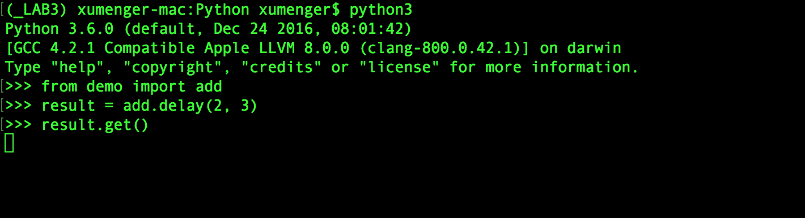

[Celery](http://docs.jinkan.org/docs/celery/index.html)是一个分布式的任务调度系统

任务队列是一种在线程或机器间分发任务的机制

消息队列的输入是工作的一个单元，成为任务，独立的职称(Worker)进程持续监视队列中是否有需要处理的新任务

Celery用于消息通信，通常使用中间人(Broker)在客户端和职程间斡旋。这个过程从客户端向队列添加消息开始，之后中间人把消息派发给职程

Celery系统可包含多个职程和中间人，一次获得高可用性和横向扩展能力

Celery需要一个发送和接受消息的传输者。RabbitMQ和 Redis中间人的消息传输支持所有特性，但也提供大量其他实验性方案的支持，包括用 SQLite进行本地开发


Celery可以单机运行，也可以在多台机器上运行，甚至可以跨越数据中心运行

比如编写tasks.py

```python
from celery import Celery
import time

celery = Celery('tasks', broker='redis://localhost:6379/0',
        backend='redis://localhost:6379/0')

@celery.task
def add(a, b):
    # 模拟一个耗时很长的任务
    time.sleep(10)
    return a + b

@celery.task
def subtract(a, b):
    # 模拟一个异常
    A_Exception()
    return a - b
```

先启动redis服务器，再启动Celery的worker

```
$ redis-server
$ pip3 install celery
$ pip3 install celery-with-redis
$ celery -A tasks worker --loglevel=info
```


启动新的shell，然后再运行Celery的Client

```
>>> from tasks import add
>>> from tasks import subtract
>>> 
>>> result = subtract.delay(2, 1)
>>> result.ready() # 获取Worker 是否执行完任务
True
>>>
>>> result.get()  # 如果Worker执行出现异常，这样直接把Worker执行的异常输出出来
Traceback (most recent call last):
  File "<stdin>", line 1, in <module>
  File "/Users/xumenger/Desktop/code/Laboratory3/_LAB3/lib/python3.6/site-packages/celery/result.py", line 162, in get
    self.maybe_reraise()
  File "/Users/xumenger/Desktop/code/Laboratory3/_LAB3/lib/python3.6/site-packages/celery/result.py", line 271, in maybe_reraise
    raise self.result
NameError: name 'A_Exception' is not defined
>>>
>>> result.get(propagate=False) # 指定propagate 参数来覆盖抛异常行为
NameError("name 'A_Exception' is not defined",)
>>>
>>> result.traceback # 如果任务抛出了一个异常，你也可以获取原始的回溯信息
'Traceback (most recent call last):\n  File "/Users/xumenger/Desktop/code/Laboratory3/_LAB3/lib/python3.6/site-packages/celery/app/trace.py", line 240, in trace_task\n    R = retval = fun(*args, **kwargs)\n  File "/Users/xumenger/Desktop/code/Laboratory3/_LAB3/lib/python3.6/site-packages/celery/app/trace.py", line 438, in __protected_call__\n    return self.run(*args, **kwargs)\n  File "/Users/xumenger/Desktop/code/Python/tasks.py", line 16, in subtract\n    A_Exception()\nNameError: name \'A_Exception\' is not defined\n'
>>> 
>>>
>>> 
>>> result = add.delay(4, 4)
>>> result.ready()
False
>>> result.get(timeout=1)
Traceback (most recent call last):
  File "<stdin>", line 1, in <module>
  File "/Users/xumenger/Desktop/code/Laboratory3/_LAB3/lib/python3.6/site-packages/celery/result.py", line 169, in get
    no_ack=no_ack,
  File "/Users/xumenger/Desktop/code/Laboratory3/_LAB3/lib/python3.6/site-packages/celery/backends/base.py", line 238, in wait_for
    raise TimeoutError('The operation timed out.')
celery.exceptions.TimeoutError: The operation timed out.
>>> 
>>> result.get() # 程序一直【阻塞】，直到等到Worker执行完获取结果！
8
>>>
>>> result.backend # 获取结果后端信息
<celery.backends.redis.RedisBackend object at 0x105f43240>
```

在Celery的worker运行环境中有这样的输出


针对以上的小例子的运行效果，其实可以对应的提出这些问题：

* Worker是怎么从Broker中获取信息的，拉？推(订阅)？
* Client、Broker、Worker之间传递了什么信息、数据的格式是什么样的？
* …………

另外，Celery有很多优点

* 高可用性：倘若连接丢失或失败，职程和客户端会自动重试，并且一些中间人通过 主/主 或 主/从 方式复制来提高可用性
* 快速：单个 Celery进程每分钟可处理数以百万计的任务，而保持往返延迟在亚毫秒级（使用 RabbitMQ、py-librabbitmq 和优化过的设置）
* 灵活：Celery几乎所有部分都可以扩展或单独使用。可以自制连接池、 序列化、压缩模式、日志、调度器、消费者、生产者、自动扩展、 中间人传输或更多

>推荐[《Celery官方简介》](http://docs.jinkan.org/docs/celery/getting-started/introduction.html)

## Client和Worker共用代码？

上面的例子看到Worker 和Client 都共用了tasks.py 代码，为什么呢？或者说这是必须的吗？那么就实验看一下

假设现在tasks.py 的路径是/Users/xumenger/Python。Worker还是不变的逻辑，还是用tasks.py 代码启动

```
celery -A tasks worker --loglevel=info
```

控制Worker方面的变量不变，改变Client 的变量来进行测试

**情况一：使用同目录下的不同文件**

比如我在相同的目录下创建一个demo.py 文件，将tasks.py的 代码完全拷贝过去，然后Client 端的运行效果是这样的（直接在获取结果的地方阻塞住了）



再去看Worker的运行情况


值得注意看一下传递的消息的内容是这样的格式（下面展示的是格式化之后的效果）

```
{
    'task': 'demo.add', 
    'id': '434fcc2e-4084-4595-8c5c-8ac6f4c7ef3e', 
    'args': (2, 3), 
    'kwargs': {}, 
    'retries': 0, 
    'eta': None, 
    'expires': None, 
    'utc': True, 
    'callbacks': None, 
    'errbacks': None, 
    'timelimit': (None, None), 
    'taskset': None, 
    'chord': None
}
```

**情况二：不同目录，文件名相同，代码除了接口相同外，都不同**

在/Users/xumenger/Python 下创建目录dir，在dir 下面创建tasks.py，编码内容为

```python
from celery import Celery

app = Celery('tasks', broker='redis://localhost:6379/0',
        backend='redis://localhost:6379/0')

# 函数只有接口与原来一致，代码逻辑直接删除了
@app.task
def add(a, b):
    pass
```

然后这次Client 可以成功运行


大概谈一下我的理解！

Celery 是异步调用任务的框架，更是远程调用的框架，远程调用的重点是什么

* Client 和Worker 的接口要约定一致（约定好函数名称、一样的函数参数类型、一样返回值类型）
* 代码逻辑是在Worker 端执行，所以Client 端的代码逻辑是非必要的！
* 其他内容

最开始展示的例子之所以Client 和Worker 共用一份代码，其实也是有好处的，这样接口就一定是一样的，当然你也可以分开写，只要像上面的例子中保证接口的一致性，但是说实话，既然是人来开发的，难免会出现写错的情况，比如函数名写错了等等，反而容易招致不必要的麻烦

## Celery配置中心化

Celery 提供了一些配置项供开发者使用

```python
# 配置序列化任务载荷的默认的序列化方式
celery.conf.CELERY_TASK_SERIALIZER = 'json'

# 一次性设置多个选项
celery.conf.update(
    CELERY_TASK_SERIALIZER='json',
    CELERY_ACCEPT_CONTENT=['json'],  # Ignore other content
    CELERY_RESULT_SERIALIZER='json',
    CELERY_TIMEZONE='Europe/Oslo',
    CELERY_ENABLE_UTC=True,
)
```

对于大型项目，采用独立配置模块更为有效，事实上你会为硬编码周期任务间隔和任务路由等配置项而感到沮丧，因为中心化保存配置更为合适

尤其是对于库而言，这使得用户控制任务行为成为可能，你也可以想象系统管理员在与搭配系统故障时对配置做出简单修改

可以调用`config_from_object()`来让 Celery 实例加载配置模块：

```python
celery.config_from_object('celeryconfig')
```

配置模块名字为celeryconfig.py，必须可以从当前目录或Python路径加载。内容格式为：

```python
BROKER_URL = 'amqp://'
CELERY_RESULT_BACKEND = 'amqp://'

CELERY_TASK_SERIALIZER = 'json'
CELERY_RESULT_SERIALIZER = 'json'
CELERY_ACCEPT_CONTENT=['json']
CELERY_TIMEZONE = 'Europe/Oslo'
CELERY_ENABLE_UTC = True
```

>生产环境中，可以在一台配置中心的服务器上为Celery、Nginx等所有的组件维护它们所有的配置信息，在Celery、Nginx工作的机器上专门开一个监控进程去定时从配置中心获取最新的配置信息更新到本地配置文件，如果发现配置文件更新了，那么监控进程就去重启对应的Celery、Nginx等进程。当然这是一种比较直观、粗暴的实现方式

将配置集中到一个地方是很好的解耦方式，也很强大，比如下面这个例子展示了如何把“脏活”路由到专门的队列

```python
CELERY_ROUTES = {
    'tasks.add': 'add_queue',
    'tasks.subtract': 'subtract_queue'
}
```

或者你可以限制任务的速率，这样每分钟只允许处理10个该类型的任务

```python
CELERY_ANNOTATIONS = {
    'tasks.add': {'rate_limit': '10/m'}
}
```

## 使用Redis作为Broker

