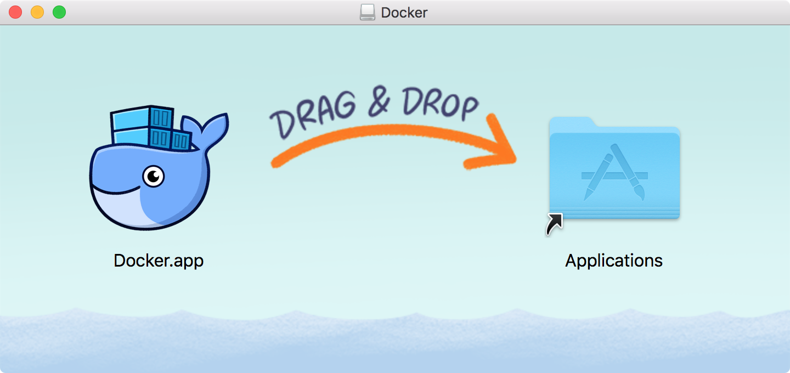
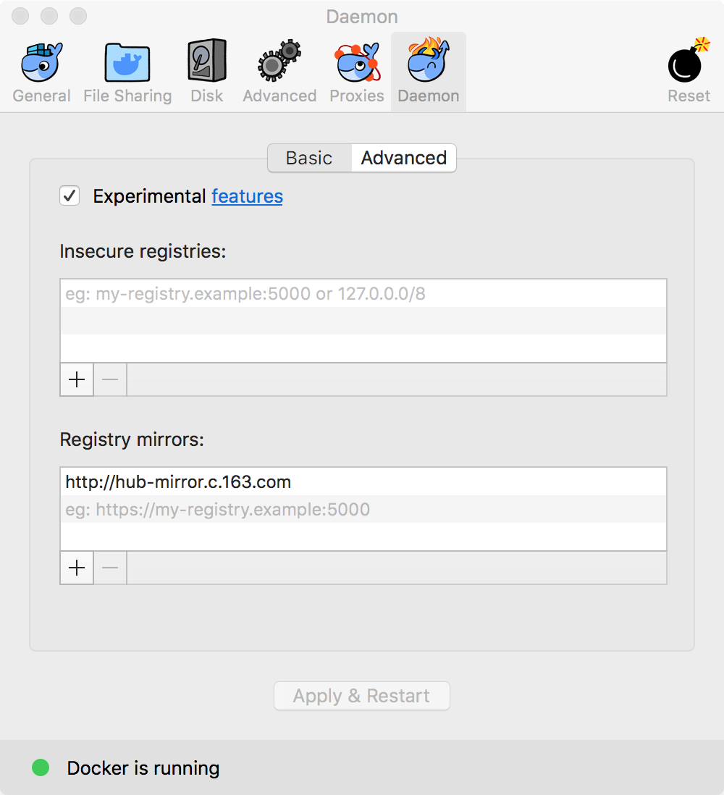
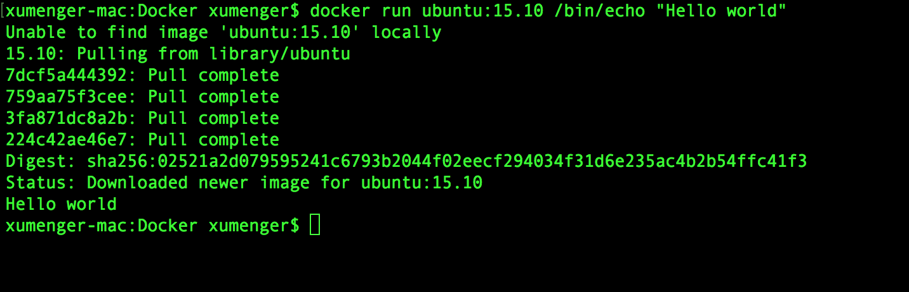
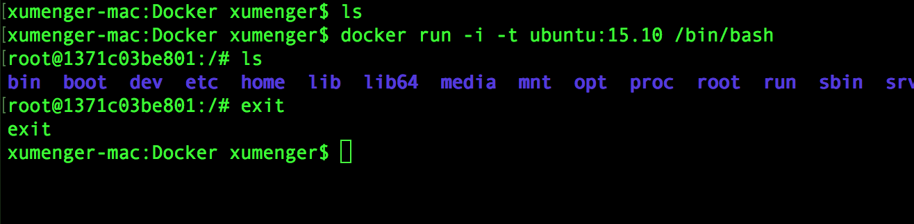
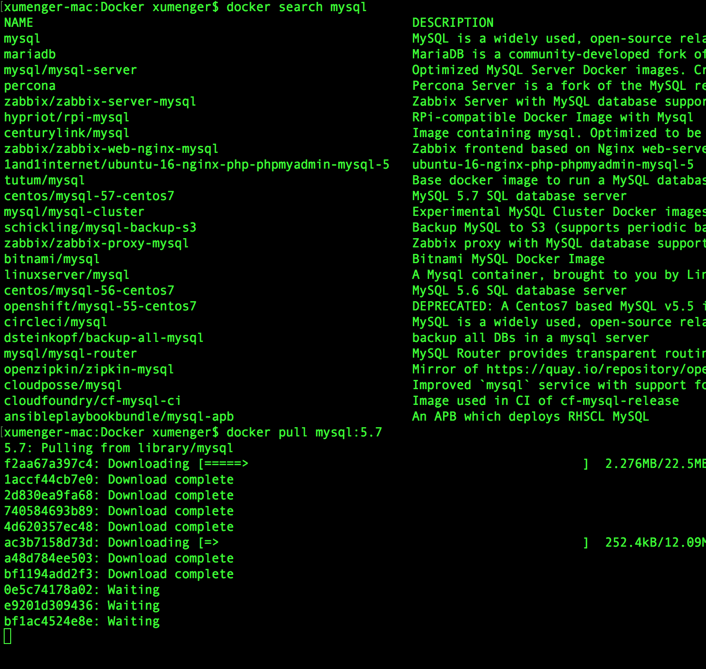
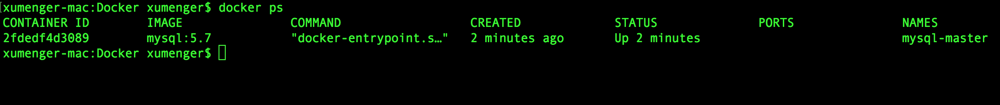
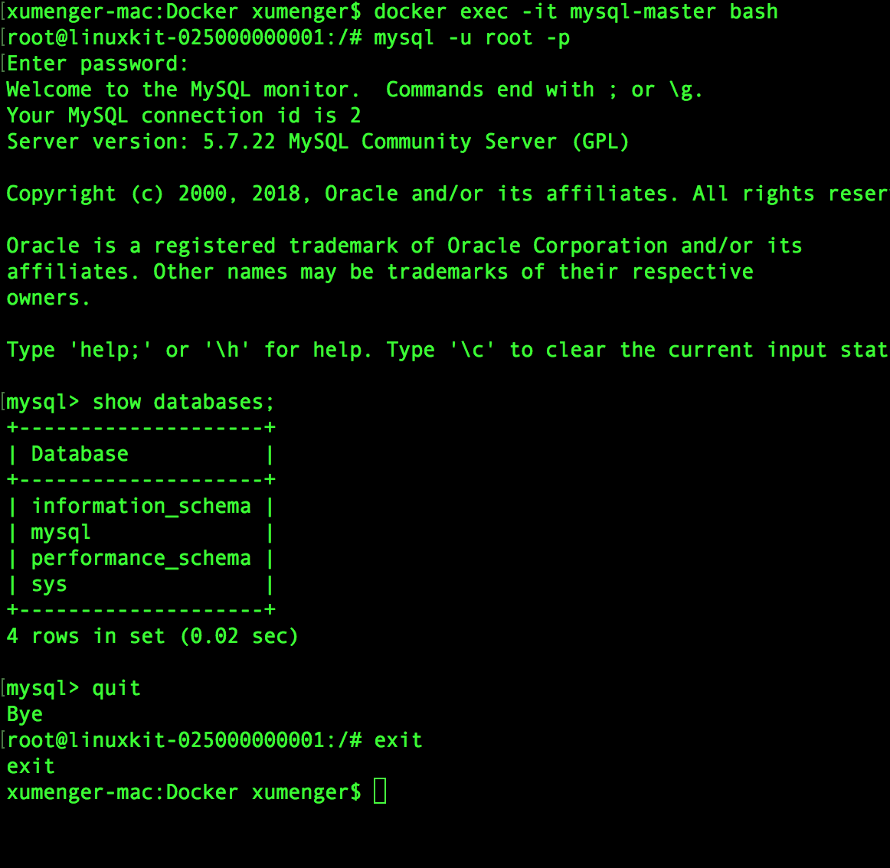

## 关于Docker

Docker 是一个开源的应用容器引擎，基于Go 语言并遵从Apache2.0 协议开源。Docker可以让开发者打包他们的应用以及依赖包到一个轻量级、可移植的容器中，然后发布到任何流行的Linux 机器上，也可以实现虚拟化

容器是完全使用沙箱机制，相互之间不会有任何接口（类似iPhone 的app），更重要的是容器性能开销极低

Docker 使用客户端-服务器架构模式，使用远程API来管理和创建Docker 容器。Docker 容器通过Docker 镜像来创建

* Docker 容器类似于面向对象中的对象
* Docker 镜像类似于面向对象中的类


 名词          | 说明
--------------|--------------------------------
Docker 镜像    | Docker 镜像是用于创建Docker 容器的模板
Docker 容器    | 容器是独立运行的一个或一组应用
Docker 客户端  | Docker 客户端通过命令行或其他工具使用Docker API 与Docker 的守护进程通信
Docker 主机     | 一个物理或虚拟的机器用于执行Docker 守护进程和容器
Docker 仓库     | Docker 仓库用来保存镜像，可以理解为代码控制中的代码仓库
Docker Machine | 一个简化的Docker 安装的命令工具，通过一个简单的命令行即可以在相应的平台上安装Docker

[Docker Hub](https://hub.docker.com/)是一个Docker 仓库，提供了庞大的镜像集合供使用

## 搭建Docker环境

本文在Mac 下进行所有操作，下载[https://download.docker.com/mac/stable/Docker.dmg](https://download.docker.com/mac/stable/Docker.dmg)，双击安装即可



另外Homebrew 的Cask 已经支持Docker for Mac，因此可以很方便的使用Homebrew Cask 来进行安装：`brew cask install docker`

鉴于国内网络问题，拉取Docker 镜像非常缓慢，可以配置加速器来解决，可以使用网易的镜像地址[http://hub-mirror.c.163.com](http://hub-mirror.c.163.com)

在任务栏点击 Docker for mac 应用图标 -> Perferences... -> Daemon -> Registry mirrors。在列表中填写加速器地址即可。修改完成之后，点击 Apply & Restart 按钮，Docker 就会重启并应用配置的镜像地址了



Docker 允许你在容器内运行应用程序， 使用`docker run`命令来在容器内运行一个应用程序。比如输出 Hello world



* **run**: 与前面的 docker 组合来运行一个容器
* **ubuntu:15.10**指定要运行的镜像，Docker首先从本地主机上查找镜像是否存在，如果不存在，Docker 就会从指定的镜像仓库下载公共镜像
* **/bin/echo "Hello world"**: 在启动的容器里执行的命令

还可以通过docker 的两个参数`-i`和`-t`，让docker 运行的容器实现“对话”的能力



## Docker安装MySQL

可以选择[使用Dockerfile 进行安装](http://www.runoob.com/docker/docker-install-mysql.html)，更简单的是直接`docker pull mysql:..`



创建mysql 目录，分别在mysql 目录下创建 conf、logs、data文件夹

* data目录将映射为mysql容器配置的数据文件存放路径
* logs目录将映射为mysql容器的日志目录
* conf目录里的配置文件将映射为mysql容器的配置文件

然后使用下面的命令运行MySQL 容器

```
$ mkdir mysql-master
$ cd mysql-master
$ mkdir conf logs data
$ docker run -p 3301:3306 \
  --name mysql-master \
  -v $PWD/conf:/etc/mysql/conf.d \
  -v $PWD/logs:/logs \
  -v $PWD/data:/var/lib/mysql \
  --net=host \
  -e MYSQL_ROOT_PASSWORD=123456 \
  -d mysql:5.7
```

* **-p 3301:3306**：将容器的3306端口映射到主机的3301端口
* **-v $PWD/conf:/etc/mysql/conf.d**：将主机当前目录下的 conf/my.cnf 挂载到容器的 /etc/mysql/my.cnf
* **-v $PWD/logs:/logs**：将主机当前目录下的 logs 目录挂载到容器的 /logs
* **-v $PWD/data:/var/lib/mysql**：将主机当前目录下的data目录挂载到容器的 /var/lib/mysql
* **--net=host**：共享宿主机的网络，大大降低容器之间的通信复杂度
* **-e MYSQL_ROOT_PASSWORD=123456**：初始化 root 用户的密码
* **-d mysql:5.7**启动mysql:5.7容器

可以使用`docker ps`查看容器启动情况



测试一下，先`docker exec -it mysql-master bash`进入mysql容器，再连接mysql



后续可以直接通过下面的命令启动或关闭或者删除该镜像

```
$ docker start mysql-master
$ docker stop mysql-master
$ docker rm mysql-master
```

## MySQL主从复制

上面配置的MySQL 作为我们master 使用，按照相同的方式创建一个slave 镜像

```
$ mkdir mysql-slave-1
$ cd mysql-slave-1
$ mkdir conf logs data
$ docker run -p 3306:3306 \
  --name mysql-slave-1 \
  -v $PWD/conf:/etc/mysql/conf.d \
  -v $PWD/logs:/logs \
  -v $PWD/data:/var/lib/mysql \
  -e MYSQL_ROOT_PASSWORD=123456 \
  -d mysql:5.7
```


## 参考资料

* [Docker 教程](http://www.runoob.com/docker/docker-tutorial.html)
* [《macOS 安装 Docker》](https://www.cnblogs.com/yu-hailong/p/7629130.html)
* [《使用Docker分分钟启动常用应用》](https://www.cnblogs.com/Erik_Xu/p/6662936.html)
* [《Docker 使用入门，创建一个Nginx服务器》](https://www.cnblogs.com/roverliang/p/8431206.html)
* [《Docker搭建独立服务器》](https://www.cnblogs.com/zlgxzswjy/p/6551578.html)
* [Docker 命令大全](http://www.runoob.com/docker/docker-command-manual.html)
* [《mac下使用docker》](https://www.jianshu.com/p/ba4cad306aa5)
* [《Mac OS X 下安装使用 Docker(16年3月最新方法)》](https://blog.csdn.net/zhouhuakang/article/details/51005861)
* [《Docker创建Mysql容器并通过命令行连接到容器》](https://www.cnblogs.com/baolong/p/5763412.html)
* [《如何利用docker快速构建MySQL主从复制环境》](https://www.cnblogs.com/ivictor/p/6440429.html)