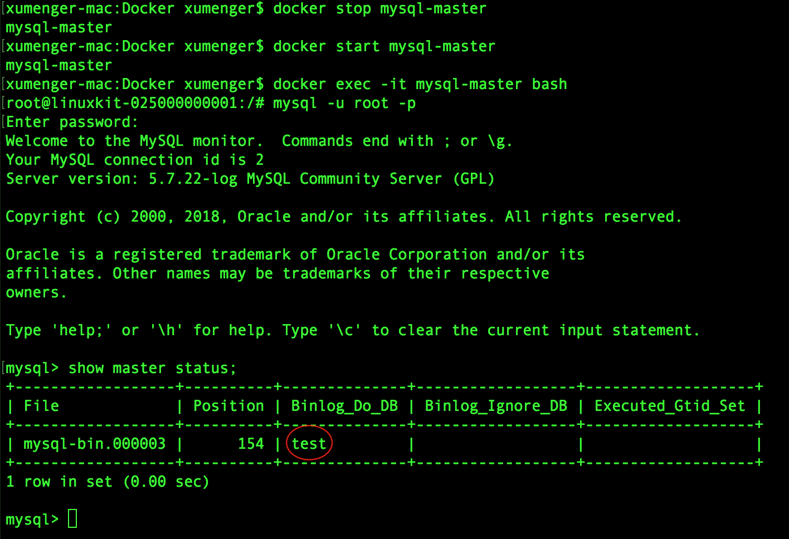

## 关于Docker

Docker 是一个开源的应用容器引擎，基于Go 语言并遵从Apache2.0 协议开源。Docker可以让开发者打包他们的应用以及依赖包到一个轻量级、可移植的容器中，然后发布到任何流行的Linux 机器上，也可以实现虚拟化

容器是完全使用沙箱机制，相互之间不会有任何接口（类似iPhone 的app），更重要的是容器性能开销极低

Docker 使用客户端-服务器架构模式，使用远程API来管理和创建Docker 容器。Docker 容器通过Docker 镜像来创建

* Docker 容器类似于面向对象中的对象
* Docker 镜像类似于面向对象中的类


 名词          | 说明
--------------|--------------------------------
Docker 镜像    | Docker 镜像是用于创建Docker 容器的模板
Docker 容器    | 容器是独立运行的一个或一组应用
Docker 客户端  | Docker 客户端通过命令行或其他工具使用Docker API 与Docker 的守护进程通信
Docker 主机     | 一个物理或虚拟的机器用于执行Docker 守护进程和容器
Docker 仓库     | Docker 仓库用来保存镜像，可以理解为代码控制中的代码仓库
Docker Machine | 一个简化的Docker 安装的命令工具，通过一个简单的命令行即可以在相应的平台上安装Docker

[Docker Hub](https://hub.docker.com/)是一个Docker 仓库，提供了庞大的镜像集合供使用

## 搭建Docker环境

本文在Mac 下进行所有操作，下载[https://download.docker.com/mac/stable/Docker.dmg](https://download.docker.com/mac/stable/Docker.dmg)，双击安装即可


另外Homebrew 的Cask 已经支持Docker for Mac，因此可以很方便的使用Homebrew Cask 来进行安装：`brew cask install docker`

鉴于国内网络问题，拉取Docker 镜像非常缓慢，可以配置加速器来解决，可以使用网易的镜像地址[http://hub-mirror.c.163.com](http://hub-mirror.c.163.com)

在任务栏点击 Docker for mac 应用图标 -> Perferences... -> Daemon -> Registry mirrors。在列表中填写加速器地址即可。修改完成之后，点击 Apply & Restart 按钮，Docker 就会重启并应用配置的镜像地址了


Docker 允许你在容器内运行应用程序， 使用`docker run`命令来在容器内运行一个应用程序。比如输出 Hello world


* **run**: 与前面的 docker 组合来运行一个容器
* **ubuntu:15.10**指定要运行的镜像，Docker首先从本地主机上查找镜像是否存在，如果不存在，Docker 就会从指定的镜像仓库下载公共镜像
* **/bin/echo "Hello world"**: 在启动的容器里执行的命令

还可以通过docker 的两个参数`-i`和`-t`，让docker 运行的容器实现“对话”的能力


## Docker安装MySQL

可以选择[使用Dockerfile 进行安装](http://www.runoob.com/docker/docker-install-mysql.html)，更简单的是直接`docker pull mysql:..`


创建mysql 目录，分别在mysql 目录下创建 conf、logs、data文件夹

* data目录将映射为mysql容器配置的数据文件存放路径
* logs目录将映射为mysql容器的日志目录
* conf目录里的配置文件将映射为mysql容器的配置文件

然后使用下面的命令运行MySQL 容器

```
$ mkdir mysql-master
$ cd mysql-master
$ mkdir conf logs data
$ docker run -p 3301:3306 \
  --name mysql-master \
  -v $PWD/conf:/etc/mysql/conf.d \
  -v $PWD/logs:/logs \
  -v $PWD/data:/var/lib/mysql \
  --net=host \
  -e MYSQL_ROOT_PASSWORD=123456 \
  -d mysql:5.7
```

* **-p 3301:3306**：将容器的3306端口映射到主机的3301端口
* **-v $PWD/conf:/etc/mysql/conf.d**：将主机当前目录下的 conf/my.cnf 挂载到容器的 /etc/mysql/my.cnf
* **-v $PWD/logs:/logs**：将主机当前目录下的 logs 目录挂载到容器的 /logs
* **-v $PWD/data:/var/lib/mysql**：将主机当前目录下的data目录挂载到容器的 /var/lib/mysql
* **--net=host**：共享宿主机的网络，大大降低容器之间的通信复杂度
* **-e MYSQL_ROOT_PASSWORD=123456**：初始化 root 用户的密码
* **-d mysql:5.7**启动mysql:5.7容器

可以使用`docker ps`查看容器启动情况


可以看到端口部分为空，因为其实当你使用`--net=host`选项的时候，端口设置就无效，在`docker run ...`的时候是有警告的：`WARNING: Published ports are discarded when using host network mode`

测试一下，先`docker exec -it mysql-master bash`进入mysql容器，再连接mysql


另外，其实你可以看一下当前容器的操作系统环境


可以在当前容器的环境中运行apt-get 安装需要的软件，但首次执行是无法安装的，因为这时候的源设置的有问题，需要添加源，设置源的端口与IP关系，然后更新，接下来就可以安装需要的软件了（这里我们首先安装vim、net-tools）

```
cd /etc/apt/

echo deb http://mirrors.163.com/ubuntu/ trusty main restricted universe multiverse >> sources.list
echo deb http://mirrors.163.com/ubuntu/ trusty-security main restricted universe multiverse >> sources.list
echo deb http://mirrors.163.com/ubuntu/ trusty-updates main restricted universe multiverse >> sources.list
echo deb http://mirrors.163.com/ubuntu/ trusty-proposed main restricted universe multiverse >> sources.list
echo deb http://mirrors.163.com/ubuntu/ trusty-backports main restricted universe multiverse >> sources.list
echo deb-src http://mirrors.163.com/ubuntu/ trusty main restricted universe multiverse >> sources.list
echo deb-src http://mirrors.163.com/ubuntu/ trusty-security main restricted universe multiverse >> sources.list
echo deb-src http://mirrors.163.com/ubuntu/ trusty-updates main restricted universe multiverse >> sources.list
echo deb-src http://mirrors.163.com/ubuntu/ trusty-proposed main restricted universe multiverse >> sources.list
echo deb-src http://mirrors.163.com/ubuntu/ trusty-backports main restricted universe multiverse >> sources.list


echo 123.58.190.228     mirrors.163.com >> /etc/hosts
echo 123.58.190.236     mirrors.163.com >> /etc/hosts

mv /var/lib/apt/lists /var/lib/apt/lists.bak
mkdir /var/lib/apt/lists
apt-get update
apt-get install vim
apt-get install net-tools
apt-get install iputils-ping
```

>Docker 确实很强大，现在完全可以用Docker 来构建多套隔离的环境，比虚拟机方便多了

后续可以直接通过下面的命令启动或关闭或者删除该镜像

```
$ docker start mysql-master
$ docker stop mysql-master
$ docker rm mysql-master
```

## MySQL主从复制

下图展示的是一个常见的主从复制实现读写分离的简单架构


而MySQL 主从复制的原理是这样的


MySQL 之间数据复制的基础是二进制日志文件（binary log）。一台MyQL 数据库一旦启动二进制日志后，其作为master，它的数据库中所有操作都会以“事件”的方式记录在二进制日志中，其他数据库作为slave 通过一个I/O 线程与主服务器保持通信，并监控master 的二进制日志文件的变化，如果发现master 二进制日志文件发生变化，则会把变化复制到自己的中继日志中，然后slave 的一个SQL 线程会把相关的“事件”执行到自己的数据库中，以此实现从数据库和主数据库的一致性，也就实现了主从复制

配置要求：

* 主服务器
	* 开启二进制日志
	* 配置唯一的server-id
	* 获得master 二进制日志文件名及位置
	* 创建一个用于slave 和master 通信的用户账号
* 从服务器
	* 配置唯一的server-id
	* 使用master 分配的用户账户读取master 二进制日志
	* 启动slave 服务

**配置slave容器**

上面配置的MySQL 作为我们master 使用，按照相同的方式创建一个slave 镜像

```
$ mkdir mysql-slave-1
$ cd mysql-slave-1
$ mkdir conf logs data
$ docker run -p 3302:3306 \
  --name mysql-slave-1 \
  -v $PWD/conf:/etc/mysql/conf.d \
  -v $PWD/logs:/logs \
  -v $PWD/data:/var/lib/mysql \
  -e MYSQL_ROOT_PASSWORD=123456 \
  -d mysql:5.7
```

注意，这里不要再用`--net=host`选项

**在master中创建测试数据库**

```
xumenger-mac:Docker xumenger$ docker exec -it mysql-master bash
root@linuxkit-025000000001:/# mysql -u root -p
Enter password: 
Welcome to the MySQL monitor.  Commands end with ; or \g.
Your MySQL connection id is 5
Server version: 5.7.22 MySQL Community Server (GPL)

Copyright (c) 2000, 2018, Oracle and/or its affiliates. All rights reserved.

Oracle is a registered trademark of Oracle Corporation and/or its
affiliates. Other names may be trademarks of their respective
owners.

Type 'help;' or '\h' for help. Type '\c' to clear the current input statement.

mysql> show databases;
+--------------------+
| Database           |
+--------------------+
| information_schema |
| mysql              |
| performance_schema |
| sys                |
+--------------------+
4 rows in set (0.02 sec)

mysql> create database test;
Query OK, 1 row affected (0.01 sec)

mysql> show databases;
+--------------------+
| Database           |
+--------------------+
| information_schema |
| mysql              |
| performance_schema |
| sys                |
| test               |
+--------------------+
5 rows in set (0.01 sec)

mysql> 
```

这时候查看slave 中的数据库，它没有这个test数据库，完全是和master 隔离的


slave 和master 一样设置好apt-get 源，安装好vim 和net-tools，可以看一下master 和slave 的IP地址分别是172.17.0.1 和172.17.0.2


>因为master 所在的镜像设置了`--net=host`，而slave 没有，所以看到的网络配置不一样

## 修改master配置

在/etc/mysql/mysql.conf.d/mysqld.cnf 配置文件中[mysqld]部分添加如下两行

```ini
[mysqld]
log-bin=mysql-bin  #开启二进制日志
server-id=1        #设置server-id
```

重启MySQL 服务器，创建用于同步的用户账号

```
xumenger-mac:Docker xumenger$ docker stop mysql-master
mysql-master
xumenger-mac:Docker xumenger$ docker start mysql-master
mysql-master
xumenger-mac:Docker xumenger$ docker exec -it mysql-master bash
root@linuxkit-025000000001:/# mysql -u root -p
Enter password: 
Welcome to the MySQL monitor.  Commands end with ; or \g.
Your MySQL connection id is 2
Server version: 5.7.22-log MySQL Community Server (GPL)

Copyright (c) 2000, 2018, Oracle and/or its affiliates. All rights reserved.

Oracle is a registered trademark of Oracle Corporation and/or its
affiliates. Other names may be trademarks of their respective
owners.

Type 'help;' or '\h' for help. Type '\c' to clear the current input statement.

mysql> CREATE USER 'sync'@'172.17.0.2' IDENTIFIED BY '123321';
Query OK, 0 rows affected (0.02 sec)

mysql> GRANT REPLICATION SLAVE ON *.* TO 'sync'@'172.17.0.2';
Query OK, 0 rows affected (0.00 sec)

mysql> flush privileges;
Query OK, 0 rows affected (0.00 sec)

mysql>
```

查看master 状态，记录二进制文件名和位置


## 修改slave配置

同样找到/etc/mysql/mysql.conf.d/mysqld.cnf 配置文件中[mysqld]部分添加如下两行

```ini
[mysqld]
server-id=2        #设置server-id
```

重启MySQL，打开MySQL 会话，执行同步SQL 语句（需要主服务器主机名，登陆凭据，二进制文件的名称和位置）

```
xumenger-mac:Docker xumenger$ docker stop mysql-slave-1
mysql-slave-1
xumenger-mac:Docker xumenger$ docker start mysql-slave-1
mysql-slave-1
xumenger-mac:Docker xumenger$ docker exec -it mysql-slave-1 bash
root@f38d3aceca7a:/# mysql -u root -p
Enter password: 
Welcome to the MySQL monitor.  Commands end with ; or \g.
Your MySQL connection id is 2
Server version: 5.7.22 MySQL Community Server (GPL)

Copyright (c) 2000, 2018, Oracle and/or its affiliates. All rights reserved.

Oracle is a registered trademark of Oracle Corporation and/or its
affiliates. Other names may be trademarks of their respective
owners.

Type 'help;' or '\h' for help. Type '\c' to clear the current input statement.

mysql> CHANGE MASTER TO
    -> MASTER_HOST='172.17.0.1',
    -> MASTER_USER='sync',
    -> MASTER_PASSWORD='123321',
    -> MASTER_LOG_FILE='mysql-bin.000002',
    -> MASTER_LOG_POS=765;
Query OK, 0 rows affected, 2 warnings (0.04 sec)

mysql> 
```

启动slave 同步进程，然后查看slave 状态


这时候之前在master 中创建的test 数据库并没有能够同步过来，所以需要设置一下需要同步的库，修改master 的/etc/mysql/mysql.conf.d/mysqld.cnf 配置文件，在[mysqld]节点下添加

```
# 只同步哪些数据库，除此之外，其他不同步
binlog-do-db = test
```

然后**重启**master ，可以看一下其状态



重启slave，然后启动slave 模式，再在slave下先**手工创建**test数据库

```
xumenger-mac:Docker xumenger$ docker stop mysql-slave-1
mysql-slave-1
xumenger-mac:Docker xumenger$ docker start mysql-slave-1
mysql-slave-1
xumenger-mac:Docker xumenger$ docker exec -it mysql-slave-1 bash
root@f38d3aceca7a:/# mysql -u root -p
Enter password: 
Welcome to the MySQL monitor.  Commands end with ; or \g.
Your MySQL connection id is 4
Server version: 5.7.22 MySQL Community Server (GPL)

Copyright (c) 2000, 2018, Oracle and/or its affiliates. All rights reserved.

Oracle is a registered trademark of Oracle Corporation and/or its
affiliates. Other names may be trademarks of their respective
owners.

Type 'help;' or '\h' for help. Type '\c' to clear the current input statement.

mysql> start slave;
Query OK, 0 rows affected, 1 warning (0.00 sec)

mysql> create database test;
Query OK, 1 row affected (0.00 sec)
```

然后在master 的test 下创建数据表user

```sql
create table user(
    id int primary key auto_increment,
    name varchar(18),
    description varchar(100)
);
```

再去slave，看到数据已经同步过来了


## 参考资料

* [Docker 教程](http://www.runoob.com/docker/docker-tutorial.html)
* [《macOS 安装 Docker》](https://www.cnblogs.com/yu-hailong/p/7629130.html)
* [《使用Docker分分钟启动常用应用》](https://www.cnblogs.com/Erik_Xu/p/6662936.html)
* [《Docker 使用入门，创建一个Nginx服务器》](https://www.cnblogs.com/roverliang/p/8431206.html)
* [《Docker搭建独立服务器》](https://www.cnblogs.com/zlgxzswjy/p/6551578.html)
* [Docker 命令大全](http://www.runoob.com/docker/docker-command-manual.html)
* [《mac下使用docker》](https://www.jianshu.com/p/ba4cad306aa5)
* [《Mac OS X 下安装使用 Docker(16年3月最新方法)》](https://blog.csdn.net/zhouhuakang/article/details/51005861)
* [《Docker创建Mysql容器并通过命令行连接到容器》](https://www.cnblogs.com/baolong/p/5763412.html)
* [《如何利用docker快速构建MySQL主从复制环境》](https://www.cnblogs.com/ivictor/p/6440429.html)
* [《docker运行mysql主从备份，读写分离》](https://blog.csdn.net/sunlihuo/article/details/54018843)
* [《mySql 主从复制linux配置》](https://www.cnblogs.com/mfmdaoyou/p/7237988.html)
* [《MySQL主从复制(Master-Slave)实践》](https://www.cnblogs.com/gl-developer/p/6170423.html)
* [《mysql 主从复制原理》](https://www.cnblogs.com/Aiapple/p/5792939.html)