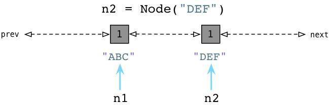
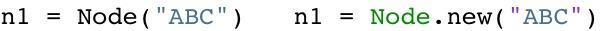
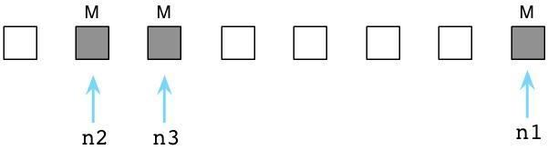
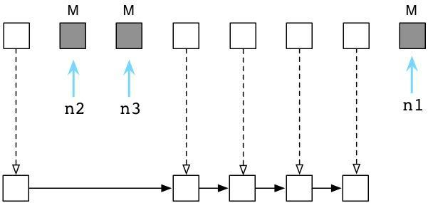
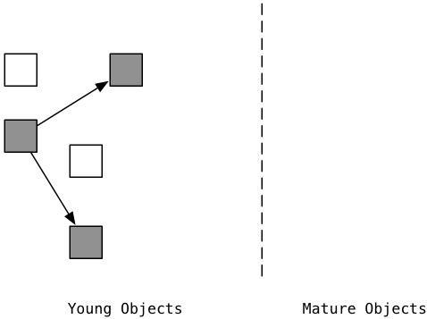
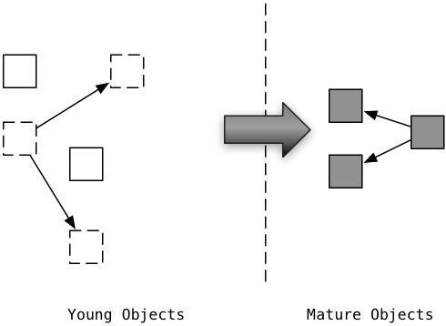
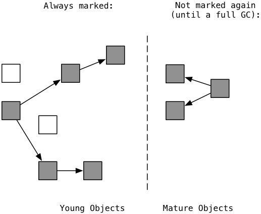
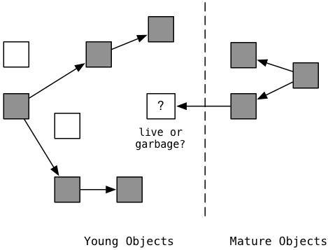

>转载自[https://www.jianshu.com/p/1e375fb40506](https://www.jianshu.com/p/1e375fb40506)

现在的高级语言如Java、C#等，都采用了垃圾回收机制，而不再是C、C++里面用户自己管理维护内存的方式。自己管理内存极其自由，可以任意申请内存，但如同一把双刃剑，为内存泄漏、悬空指针、重复释放等bug埋下隐患

对于一个字符串、列表、类甚至是数值都是对象，且定位简单易用的语言Python，自然不会让用户去处理如何分配回收内存的问题

>Python 里也同Java 一样采用了垃圾回收机制，不过不一样的是：Python 采用的是**引用计数**机制为主，**标记-清除**和**分代收集**两种机制为辅的策略

## 引用计数机制

Python 中每个东西都是对象，它们的核心就是一个结构体

```c
typedef struct _object{
    int ob_refcnt;
    struct _typeobject *ob_type;
}PyObject;
```

PyObject 是每个对象必有得内容，其中`ob_refcnt`就是做为引用计数。当一个对象有新的引用计数时，它的`ob_refcnt`就会增加，当引用它的对象被删除时，它的`ob_refcnt`就会减少

```c
#define Py_INCREF(op)   ((op)->ob_refcnt++)
#define Py_DECREF(op) \
    if(--(op)->ob_refcnt != 0) \
        ; \
    else \
        __Py_Dealloc((PyObject *)(op))
```

当引用计数为0时，该对象生命就结束了

引用计数的优点是简单；实时性强，一旦没有引用，内存就直接释放。不像其他机制等到特定实际。实时性还带来一个好处，就是回收内存的时间分摊到了平时

但是引用计数也存在缺点：维护引用计数消耗资源、循环引用问题

```python
list1 = []
list2 = []
list1.append(list2)
list2.append(list1)
```

list1 和list2 相互引用，如果不存在其他对象对它们的引用，list1 和list2 的引用计数也仍然为1，所占用的内存将永远无法回收，这将是致命的

C++中的智能指针shared\_ptr 的最大的陷阱也是循环引用，循环引用会导致堆内存无法正确释放，导致内存泄漏，C++中是通过引入weak\_ptr 来解决

而Python中还将引入新的回收机制：标记-清除、分代收集

## 画说Ruby 与Python 垃圾回收

英文原文：[visualizing garbage collection in ruby and python](http://patshaughnessy.net/2013/10/24/visualizing-garbage-collection-in-ruby-and-python)

中文：[画说 Ruby 与 Python 垃圾回收](https://ruby-china.org/topics/28127)


如果将算法和业务逻辑比作应用程序的大脑，垃圾回收对应哪个器官呢？

GC系统锁承担的工作远比“垃圾回收”多得多。实际上，它们负责三个重要任务：

* 为新生成的对象分配内存
* 识别那些垃圾对象
* 从垃圾对象那里回收内存

如果将应用程序比作人的身体：所有你所写的那些优雅的代码、业务逻辑、算法，应该就是大脑。依次类推，垃圾回收机制应该是哪个身体器官呢？

我认为垃圾回收应该是应用程序那颗跃动的心。像心脏为其他器官提供血液和营养物那样，垃圾回收器为你的应用程序提供内存和对象。如果心脏停跳，过不了几分钟人就完了。如果垃圾回收器停止工作或运行迟缓,像动脉阻塞,你的应用程序效率也会下降，直至最终死掉

#### 一个简单的例子

运用示例一贯有助于理论的理解。下面是一个简单类，分别用Python 和Ruby 写成

```python
class Node:
    def __init__(self, val):
        self.value = val

print(Node(1))
print(Node(2))
```

```ruby
class Node
    def initialize(val)
        @value = val
    end
end

p Node.new(1)
p Node.new(2)
```

这两种语言在语法上如此相像，Ruby 和Python 在表达同一事物上真的只是略有不同。但是这两种语言的内部实现上是否也如此相似呢？

#### 可用列表

当我们执行上面的`Node.new(1)`的时候，Ruby 到底做了什么呢？Ruby 是如何管理我们创建的对象的呢？

出乎意料的是它做的非常少。实际上，早在代码开始执行，Ruby 就提前创建了成百上千个对象，并把它们串在链表上，名曰：可用列表。下图所示为可用列表的概念图


想象一下每个白色方格上都标着一个“为使用预创建对象”。当我们调用`Node.new`，Ruby 只需取一个预创建对象给我们使用即可


上图中左侧灰格表示我们代码中使用的当前对象，同时其他白格是未使用对象。（请注意：无疑我的示意图是对实际的简化。实际上，Ruby 会用另一个对象来装载字符串"ABC"，另一个对象装载Node 类定义，还有一个对象装载了代码中分析出的抽象语法树，等等）

如果我们再次调用 Node.new，Ruby将递给我们另一个对象


这个简单的用链表来预分配对象的算法已经发明了超过50年了，而发明人是赫赫有名的计算机科学家John McCarthy，一开始是用Lisp实现的。Lisp不仅是最早的函数式编程语言，在计算机科学领域也有许多创举。其一就是利用垃圾回收机制自动化进行程序内存管理的概念

标准的Ruby，也就是总所周知的"Matz's Ruby Interpreter"(MRI)，所使用的GC 算法与McCarthy 在1960年的实现方式很类似。无论好坏，Ruby 的垃圾回收机制已经53岁高龄了。像Lisp 一样，Ruby 预先创建一些对象，然后在你分配新对象或者变量的时候供你使用

## Python 的对象分配

我们已经了解了Ruby预先创建对象并将它们存放在可用列表中。那么Python 又是怎么样的呢？

尽管由于许多原因Python 也使用可用列表（用来回收一些特定对象，比如list），但在为新对象和变量分配内存的方面Python 和Ruby 是不同的。例如我们用Python 来创建一个Node 对象


与Ruby 不同，当创建对象时Python 立即向操作系统申请内存。（Python 实际上实现了一套自己的内存分配系统，在操作系统堆之上提供了一个抽象层，这里就不展开说了）

当我们创建第二个对象的时候，再次向OS 申请内存


看起来够简单吧，在我们创建对象的时候，Python 会花些时间为我们找到并分配内存

## Python 开发者住在卫生之家


用完的垃圾对象会立即被Python 打扫干净

Python 与Ruby 的垃圾回收机制颇为不同。让我们回到前面提到的三个Python Node 对象


在内部，创建一个对象时，Python 总是在对象的C 结构体内保存一个整数，称之为**引用计数**。期初，Python 将这个值设置为1


值为1说明分别有一个指针指向或引用这三个对象。加入我们现在创建一个新的Node 示例，"JKL"，并且n1 指向它：


与之前一样，Python 设置"JKL" 的引用计数为1.然而，请注意由于我们改变了n1 指向"JKL"，不再指向"ABC"，Python 就把"ABC" 的引用计数置为0了。此刻，Python 垃圾回收器立刻挺身而出！每当对象的引用计数减为0，Python 立即将其释放，把内存还给操作系统


上面Python 回收了"ABC" Node 实例使用的内存

对比Ruby，Ruby 是弃旧对象于原地不顾，也不释放它们的内存

Python 的这种垃圾回收算法被称为引用计数。是George-Collins 在1960年发明的，恰巧与John McCarthy 发明的可用列表算法在同一年出现。就像Mike-Bernstein 在6月份[哥谭市Ruby大会](http://goruco.com/)杰出的[垃圾回收机制演讲](http://www.confreaks.com/videos/2545-goruco2013-to-know-a-garbage-collector)中说的: "1960年是垃圾收集器的黄金年代..."

Python 开发者工作在卫生之家，你可以想象，有个患有轻度OCD(一种强迫症)的室友一刻不停地跟在你身后打扫，你一放下脏碟子或杯子，有个家伙已经准备好把它放进洗碗机了！

接着看第二个例子

假如我们让n2 引用 n1，即`n2 = n1`


上图中左边的"DEF" 的引用数已经被Python 减少了，垃圾回收器会立即回收"DEF" 实例。同时"JKL" 的引用数已经变为了2 ，因为n1 和n2 都指向它

## 标记-清除

最终那间凌乱的房间充斥着垃圾，再不能岁月静好了，在Ruby 程序运行了一阵子之后，可用列表最终被用光了


此刻所有Ruby 预创建对象都被程序用过了（它们都变灰了），可用列表里空空如也（没有白格子了）

此刻Ruby 祭出另一McCarthy 发明的算法，名曰：**标记-清除**

首先Ruby 把程序停下来，Ruby 用“地球停转垃圾回收大法”。之后Ruby 轮询所有指针，变量和代码产生别的引用对象和其他值。同时Ruby 通过自身的虚拟机遍历内部指针。标记出这些指针引用的每个对象。在图中用M 表示


上图中那三个被标记为M 的对象是程序还在使用的。在内部，Ruby 实际上使用一串位值，被称为**可用位图**（译注：还记得《编程珠玑》里的为突发排序吗，这对离散度不高的有限整数集合具有很强的压缩效果，用以节约机器的资源。），来跟踪对象是否被标记


Ruby将这个可用位图存放在独立的内存区域中，以便充分利用Unix的写时拷贝化。有关此事的更多内容请关注我另一博文[《Why You Should Be Excited About Garbage Collection in Ruby 2.0》](http://patshaughnessy.net/2012/3/23/why-you-should-be-excited-about-garbage-collection-in-ruby-2-0)

如果说被标记的对象是存活的，剩下的未标记的对象只能是垃圾，这意味着我们的代码不再会使用它了。我会在下图中用白格子表示垃圾对象


接下来Ruby清除这些无用的垃圾对象，把它们送回到可用列表中：


在内部这一切发生得迅雷不及掩耳，因为Ruby 实际上不会把对象从这拷贝到那，而是通过调整内部指针，将其指向一个新链表的方式，来将垃圾对象归为到可用列表中

现在等下回再创建对象的时候，Ruby 又可以把这些垃圾对象分给我们使用了。在Ruby里，对象们六道轮回，转世投胎，享受多次人生

## 标记-清除 vs 引用计数

乍一看，Python 的GC 算法貌似远胜于Ruby 的：宁舍洁宇而居秽室乎？为什么Ruby 宁愿定期强制程序停止运行，也不使用Python 的算法呢？

然而，引用计数并像第一眼看上去那么简单。有许多原因使得许多语言不像Python 这样使用引用计数GC 算法

首先，它不好实现。Python 不得不再每个对象内部留一些空间来处理引用计数。这样付出了一小点空间上的代价。但更糟糕的是，每个简单的操作（像修改变量或引用）都会变成一个更复杂的操作，因为Python 需要增加一个计数、减少另外一个计数，还可能释放对象

第二点，它相对较慢。虽然Python 随着程序执行GC 很稳健，但这并不一定快。Python 不停地更新着众多引用数值。特别是当你不再使用一个大数据结构的时候，比如一个包含很多元素的列表，Python 可能必须一次性释放大量内存。减少引用计数就成了一项复杂的递归过程了

最后，它不总是奏效。下面会看到引用计数不能处理环形数据结构，即含有循环引用的数据结构

>扩展思考：引用计数机制在多线程并发的环境下会有什么样的问题？

## 继续对比Ruby 和Python 的垃圾回收

英文原文地址：[Generational GC in Python and Ruby](http://patshaughnessy.net/2013/10/30/generational-gc-in-python-and-ruby)

中文原文：[对比Ruby和Python的垃圾回收（2）：代式垃圾回收机制](http://blog.jobbole.com/73300/)

上面讲到Ruby 是如何使用名为标记回收的垃圾回收算法的，这个算法是为1960年原版本的Lisp 所开发。同样，我也介绍了Python 使用一种有53年历史的GC 算法，这种算法的思路非常不同，称之为引用计数

事实证明，Python 在引用计数之外，还用了另一个名为Generational Garbage Collection 的算法。这意味着Python 的垃圾回收器用不同的方式对待新创建的以及旧有的对象。并且在即将到来的2.1版本的MRI Ruby 中也首次引入了Generational Garbage Collection 的垃圾回收机制（在另两个Ruby的实现：JRuby和Rubinius中，已经使用这种GC机制很多年了）

当然，这句话“用不同的方式对待新创建的以及旧有的对象”是有点模糊不清，比如如何定义新、旧对象？又比如对于Ruby 和Python 来说具体是如何采用不同的对待方式？接下来就来谈谈这两种语言GC机制的运行原理，回答上边那些疑问。但是在我们开始谈论Generational GC之前，我们先要花点时间谈论下Python的引用计数算法的一个严重的理论问题

## Python 中的循环数据结构及引用计数

通过上面的内容，知道在Python 中，每个对象都保存了一个称为引用计数的整数值，来追踪到底有多少引用指向这个对象。无论何时，如果我们的程序中的一个变量或其他对象引用了一个目标对象，Python 将会增加这个计数值，而当程序停止使用这个对象，则Python 会减少这个计数值。一旦计数值被减到零，Python将会释放这个对象以及回收相关内存空间

参考[https://blog.csdn.net/m0_37338590/article/details/78452764](https://blog.csdn.net/m0_37338590/article/details/78452764)

* 导致引用计数+1 的情况
	* 对象被创建，例如`a = 23`
	* 对象被引用，例如`b = a`
	* 对象被作为参数，传入函数中，例如`func(a)`
	* 对象作为一个元素，存储到容器中，例如`list1 = [a, a]`
* 导致引用计数-1 的情况
	* 对象的别名被显式销毁，例如`del a`
	* 对象的别名被赋予新的对象，例如`a = 24`
	* 一个对象离开它的作用域，例如函数执行完毕后，func中的局部变量（全局变量不会）
	* 对象所在的容器被销毁，或者从容器中删除对象

从六十年代开始，计算机科学界就面临了一个严重的理论问题，那就是针对引用计数这种算法来说，如果一个数据结构引用到了它自身，即如果这个数据结构是一个循环数据结构，那么某些引用计数值是肯定不会变为零的。为了更好的理解这个问题，让我们举个例子。下面的代码展示了一些上周我们所用到的节点类：


我们有一个构造器（在Python 中叫做init），在一个实例变量中存储一个单独的属性。在类定义之后我们创建两个节点，"ABC" 以及"DEF"，在图中为左边的矩形框。两个节点的引用计数都被初始化为1，因为各有两个引用指向各个节点（n1 和n2）

现在，让我们在节点中定义两个附加的属性，next 以及prev


跟Ruby 不同的是，Python 中你可以在代码运行的时候动态定义实例变量或者对象属性。这看起来似乎有点像Ruby 缺失了某些有趣的魔法（声明下我不是一个Python 程序员，所以可能会存在一些命名方面的错误）。我们设置`n1.next`指向n2，同时设置`n2.prev`指回n1。现在，我们的两个节点使用循环引用的方式构成了一个双端链表。同时请注意到"ABC"以及"DEF"的引用计数值已经增加到了2。这里有两个指针指向了每个节点，首先是n1 以及n2，其次就是next 以及prev

现在，假定我们的程序不再使用这两个节点了，我们将n1 和n2 都设置为null（Python中是None）


好了，Python 会像往常一样将每个节点的引用计数减少到1

## Python 中的零代

请注意在以上刚刚说到的例子中，我们以一个不是很常见的情况结尾：我们有一个“孤岛”或是一组未使用的、互相指向的对象，但是谁都没有外部引用。换句话说，我们的程序不再使用这些节点对象了，所以我们希望Python 的垃圾回收机制能够足够智能去释放这些对象并回收它们占用的内存空间。但是这不可能，因为所有的引用计数都是1而不是0。Python 的引用计数算法不能够处理互相指向自己的对象

当然，上边举的是一个估计设计的例子，但是你的代码中也许会有不经意间包含循环引用并且你并未意识到的。事实上，当你的Python 程序运行的时候它将会建立一定数量的“浮点数垃圾”，Python 的GC 不能够处理未使用的对象因为引用计数值不会到零

这就是为什么Python 要引入Generational GC 算法的原因！正如Ruby使用一个链表（free list）来持续追踪未使用的、自由的对象一样，Python 使用一种不同的链表来持续追踪活跃的对象，而不是将其称为“活跃列表”，Python 的内部C 代码将其称为“零代”（Generation Zero）。每次当你创建一个对象或其他什么值的时候，Python 会将其加入零代链表


从上面可以看到当我们创建"ABC" 节点的时候，Python 将其加入零代链表，请注意到这并不是一个真正的列表，并不能直接在你的代码中访问，事实上这个链表是一个完全内部的Python 运行时

相似的，当我们创建"DEF" 节点的时候，Python 将其加入到同样的链表



现在零代包含了两个节点对象。（它还将包含Python 创建的每个其他值，与一些Python 自己使用的内部值）

## 检查循环引用

随后，Python 会循环遍历零代列表上的每个对象，检查列表中每个相互引用的对象，根据规则减掉其引用计数。在这个过程中，Python 会一个接一个的统计内部引用的数量以放过早地释放对象

为了便于理解，来看一个例子


从上面看到"ABC" 和"DEF" 节点包含的引用计数为1，有三个其他的对象同时存在于零代链表中，蓝色的箭头指示了有一些对象正在被零代链表之外的其他对象所引用。（接下来我们会看到，Python 中同时存在另外两个分别被称为一代和二代的链表）。这些对象有着更高的引用计数因为它们正在被其他指针所指向着

接下来你会看到Python 的GC 是如何处理零代链表的


通过识别内部引用，Python 能够减少许多零代链表对象的引用计数。在上图的第一行中你能看到"ABC" 和"DEF" 的引用计数已经变为零了，这意味着收集器可以释放它们并回收内存空间了。剩下的活跃的对象则被移动到一个新的链表：一代链表

从某种意义上说，Python 的GC 算法类似于Ruby 所用的标记回收算法。周期性地从一个对象到另一个对象追踪引用以确定对象是否还活跃的，正在被程序所使用的，这正类似于Ruby 的标记过程

## Python 中的GC 阈值

Python 什么时候会进行这个标记过程？随着你的程序运行，Python 解释器保持对新创建的对象，以及因为引用计数为零而释放掉的对象的追踪。从理论上说，这两个值应该保持一致，因为程序新创建的每个对象都应该最终被释放掉

当然，事实并非如此。因为循环引用的原因，并且因为你的程序使用了一些比其他对象存在时间更长的对象，从而被分配对象的计数值与被释放对象的计数值之间的差异在逐渐增长。一旦这个差异累计超过某个阈值，则Python 的收集机制就启动了，并且触发上面所说的零代算法，释放“浮动的垃圾”，并且将剩下的对象移动到一代列表

随着时间的推移，程序所使用的对象逐渐从零代列表移动到一代列表。而Python 对于一代列表中对象的处理遵循同样的方法，一旦被分配计数值与被释放计数值累计到一定阈值，Python 会将剩下的活跃对象移动到二代列表

通过这种方法，你的代码所长期使用的对象，那些你的代码持续访问的活跃对象，会从零代链表转移到一代再转移到二代。通过不同的阈值设置，Python 可以在不同的时间间隔处理这些对象

Python 处理零代最为频繁，其次是一代，然后是二代

## 弱代假说

来看看代垃圾回收算法的核心行为：垃圾回收器会更频繁的处理新对象。一个新的对象即是你的程序刚刚创建的，而一个老的对象则是经过几个时间周期之后仍然存在的对象。Python 会在当一个对象从零代移动到一代，或是从一代移动到二代的过程中提升这个对象

为什么要这么做？这种算法的根源来自于弱代假说(weak generational hypothesis)。这个假说由两个观点构成：首先是年轻的对象通常死得也快，而老对象则很可能存活更长时间

假定现在我用Python 或Ruby 创建一个新对象



根据假说，我的代码可能仅仅会使用"ABC" 很短的时间。这个对象也许仅仅只是一个方法中的中间结果，并且随着方法的返回这个对象就变成了垃圾。大部分的新对象都是如此这般地很快变成垃圾。然而，偶尔程序会创建一些很重要的、存活时间比较长的对象，例如Web 应用中的Session 变量或配置项

通过频繁的处理零代链表中的新对象，Python 的垃圾收集器将把时间花在更有意义的地方：它处理那些很快很可能变成垃圾的新对象。同时只在很少的时候，当满足阈值的条件，收集器才会去处理那些老变量

## 回到Ruby 的自由链

即将到来的Ruby 2.1版本将会首次使用基于代的垃圾回收算法！(请注意的是，其他的Ruby实现，例如JRuby和Rubinius已经使用这个算法许多年了)。让我们回到上篇博文中提到的自由链的图来看看它到底是怎么工作的

请回忆当自由链表使用完之后，Ruby 会标记你的程序仍然在使用的对象



从这张图可以看到有三个活跃的对象，因为指针n1、n2、n3 仍然指向着它们。剩下的用白色矩阵表示的对象即是垃圾。（当然，实际情况会复杂得多，自由链可能会包含上千个对象，并且有复杂的引用指向关系，这里的简图只是帮助我们了解Ruby的GC机制背后的简单原理，而不会将我们陷入细节之中）

同样，我们说过Ruby 会将垃圾对象移动回自由链中，这样的话，它们就能在程序申请新对象的时候被循环使用了



## Ruby 2.1 基于代的GC 机制

从2.1版本开始，Ruby 的GC 代码增加了一些附加步骤：它将留下来的活跃对象晋升(promote)到成熟代(mature generation)中。(在MRI的C源码中使用了old这个词而不是mature)，接下来的图展示了两个Ruby2.1对象代的概念图



在左边是一个跟自由链不相同的场景，我们可以看到垃圾对象是用白色表示的，剩下的是灰色的活跃对象。灰色的对象刚刚被标记。

一旦“标记清除”过程结束，Ruby2.1将剩下的标记对象移动到成熟区



跟Python 中使用三代来划分不同，Ruby2.1 只用了两代，左边是年轻的新一代对象，而右边是成熟代的老对象。一旦Ruby2.1 标记了对象一次，它就会被认为是成熟的。Ruby 会打赌剩下的活跃对象在相当长的一段时间内不会很快变成垃圾对象

>重要提醒：Ruby 2.1 并不会真的在内存中拷贝对象，这些代表不同代的区域并不是由不同的物理内存区域构成。（有一些别的编程语言的GC 实现或是Ruby 的其他实现，可能会在对象晋升的时候采取拷贝的操作）。Ruby 2.1的内部实现不会将在标记&清除过程中预先标记的对象包含在内。一旦一个对象已经被标记过一次了，那么将不会被包含在接下来的标记清楚过程中

现在，假定你的Ruby 程序接着运行着，创造了更多新的，更年轻的对象。则GC的过程将会在新的一代中出现，如图



如同Python 那样，Ruby 的垃圾收集器将大部分精力都放在新一代的对象之上。它仅仅会将自上一次GC过程发生后创建的新的、年轻的对象包含在接下来的标记清除过程中。这是因为很多新对象很可能马上就会变成垃圾（白色标记）。Ruby 不会重复标记右边的成熟对象。因为他们已经在一次GC 过程中存活下来了，在相当长的一段时间内不会很快变成垃圾。因为只需要标记新对象，所以Ruby 的GC 能够运行得更快。它完全跳过了成熟对象，减少了代码等待GC 完成的时间

偶然的Ruby 会运行一次“全局回收”，重标记(re-marking)并重清除(re-sweeping)，这次包括所有的成熟对象。Ruby通过监控成熟对象的数目来确定何时运行全局回收。当成熟对象的数目双倍于上次全局回收的数目时，Ruby会清理所有的标记并且将所有的对象都视为新对象

## 白障

这个算法的一个重要挑战是值得深入解释的：假定你的代码创建了一个新的年轻的对象，并且将其作为一个已经存在的成熟对象的子嗣加入。举个例子，这种情况将会发生在，当你往一个已经存在了很长时间的数组中添加一个新值的时候



让我们来看看图，左边的是新对象，而成熟的对象在右边。在左边标记过程已经识别出了5个新的对象目前仍然是活跃的（灰色）。但有两个对象已经变成垃圾了（白色）。但是如何处理正中间这个新建对象？这是刚刚那个问题提到的对象，它是垃圾还是活跃对象呢？

当然它是活跃对象了，因为有一个从右边成熟对象的引用指向它。但是我们前面说过已经被标记的成熟对象是不会被包含在标记清除过程中的（一直到全局回收）。这意味着类似这种的新建对象会被错误的认为是垃圾而被释放，从而造成数据丢失

Ruby2.1 通过监视成熟对象，观察你的代码是否会添加一个从它们到新建对象的引用来克服这个问题。Ruby2.1 使用了一个名为白障(white barriers)的老式GC 技术来监视成熟对象的变化 – 无论任意时刻当你添加了从一个对象指向另一个对象的引用时（无论是新建或是修改一个对象），白障就会被触发。白障将会检测是否源对象是一个成熟对象，如果是的话则将这个成熟对象添加到一个特殊的列表中。随后，Ruby2.1 会将这些满足条件的成熟对象包括到下一次标记清除的范围内，以防止新建对象被错误的标记为垃圾而清除

Ruby2.1 的白障实现相当复杂，主要是因为已有的C 扩展并未包含这部分功能。Koichi Sasada 以及Ruby 的核心团队使用了一个比较巧妙的方案来解决这个问题。如果想了解更多的内容，请阅读这些相关材料：Koich 在EuRuKo 2013上的演讲Koichi’s fascinating presentation

## 简单总结

乍眼一看，Ruby 和Python 的GC 实现是截然不同的，Ruby 使用John-MaCarthy 的原生“标记并清除”算法，而Python 使用引用计数。但是仔细看来，可以发现Python 使用了些许标记清除的思想来处理循环引用，而两者同时以相似的方式使用基于代的垃圾回收算法。Python 划分了三代，而Ruby 只有两代

这种相似性应该不会让人感到意外。两种编程语言都使用了几十年前的计算机科学研究成果来进行设计，这些成果早在语言成型之前就已经被做出来了。我比较惊异的是当你掀开不同编程语言的表面而深入底层，你总能够发现一些相似的基础理念和算法。现代编程语言应该感激那些六七十年代由麦卡锡等计算机先贤所作出的计算机科学开创性研究