>转载自[https://www.jianshu.com/p/1e375fb40506](https://www.jianshu.com/p/1e375fb40506)

现在的高级语言如Java、C#等，都采用了垃圾回收机制，而不再是C、C++里面用户自己管理维护内存的方式。自己管理内存极其自由，可以任意申请内存，但如同一把双刃剑，为内存泄漏、悬空指针、重复释放等bug埋下隐患

对于一个字符串、列表、类甚至是数值都是对象，且定位简单易用的语言Python，自然不会让用户去处理如何分配回收内存的问题

>Python 里也同Java 一样采用了垃圾回收机制，不过不一样的是：Python 采用的是**引用计数**机制为主，**标记-清除**和**分代收集**两种机制为辅的策略

## 引用计数机制

Python 中每个东西都是对象，它们的核心就是一个结构体

```c
typedef struct _object{
    int ob_refcnt;
    struct _typeobject *ob_type;
}PyObject;
```

PyObject 是每个对象必有得内容，其中`ob_refcnt`就是做为引用计数。当一个对象有新的引用计数时，它的`ob_refcnt`就会增加，当引用它的对象被删除时，它的`ob_refcnt`就会减少

```c
#define Py_INCREF(op)   ((op)->ob_refcnt++)
#define Py_DECREF(op) \
    if(--(op)->ob_refcnt != 0) \
        ; \
    else \
        __Py_Dealloc((PyObject *)(op))
```

当引用计数为0时，该对象生命就结束了

引用计数的优点是简单；实时性强，一旦没有引用，内存就直接释放。不像其他机制等到特定实际。实时性还带来一个好处，就是回收内存的时间分摊到了平时

但是引用计数也存在缺点：维护引用计数消耗资源、循环引用问题

```python
list1 = []
list2 = []
list1.append(list2)
list2.append(list1)
```

list1 和list2 相互引用，如果不存在其他对象对它们的引用，list1 和list2 的引用计数也仍然为1，所占用的内存将永远无法回收，这将是致命的

C++中的智能指针shared\_ptr 的最大的陷阱也是循环引用，循环引用会导致堆内存无法正确释放，导致内存泄漏，C++中是通过引入weak\_ptr 来解决

而Python中还将引入新的回收机制：标记-清除、分代收集

## 画说Ruby 与Python 垃圾回收

英文原文：[visualizing garbage collection in ruby and python](http://patshaughnessy.net/2013/10/24/visualizing-garbage-collection-in-ruby-and-python)

中文：[画说 Ruby 与 Python 垃圾回收](https://ruby-china.org/topics/28127)


如果将算法和业务逻辑比作应用程序的大脑，垃圾回收对应哪个器官呢？

GC系统锁承担的工作远比“垃圾回收”多得多。实际上，它们负责三个重要任务：

* 为新生成的对象分配内存
* 识别那些垃圾对象
* 从垃圾对象那里回收内存

如果将应用程序比作人的身体：所有你所写的那些优雅的代码、业务逻辑、算法，应该就是大脑。依次类推，垃圾回收机制应该是哪个身体器官呢？

我认为垃圾回收应该是应用程序那颗跃动的心。像心脏为其他器官提供血液和营养物那样，垃圾回收器为你的应用程序提供内存和对象。如果心脏停跳，过不了几分钟人就完了。如果垃圾回收器停止工作或运行迟缓,像动脉阻塞,你的应用程序效率也会下降，直至最终死掉

#### 一个简单的例子

运用示例一贯有助于理论的理解。下面是一个简单类，分别用Python 和Ruby 写成

```python
class Node:
    def __init__(self, val):
        self.value = val

print(Node(1))
print(Node(2))
```

```ruby
class Node
    def initialize(val)
        @value = val
    end
end

p Node.new(1)
p Node.new(2)
```

这两种语言在语法上如此相像，Ruby 和Python 在表达同一事物上真的只是略有不同。但是这两种语言的内部实现上是否也如此相似呢？

#### 可用列表

当我们执行上面的`Node.new(1)`的时候，Ruby 到底做了什么呢？Ruby 是如何管理我们创建的对象的呢？

出乎意料的是它做的非常少。实际上，早在代码开始执行，Ruby 就提前创建了成百上千个对象，并把它们串在链表上，名曰：可用列表。下图所示为可用列表的概念图


想象一下每个白色方格上都标着一个“为使用预创建对象”。当我们调用`Node.new`，Ruby 只需取一个预创建对象给我们使用即可

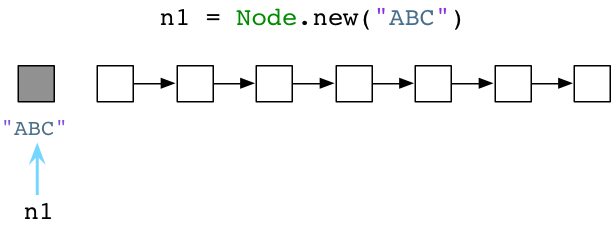

上图中左侧灰格表示我们代码中使用的当前对象，同时其他白格是未使用对象。（请注意：无疑我的示意图是对实际的简化。实际上，Ruby 会用另一个对象来装载字符串"ABC"，另一个对象装载Node 类定义，还有一个对象装载了代码中分析出的抽象语法树，等等）

如果我们再次调用 Node.new，Ruby将递给我们另一个对象

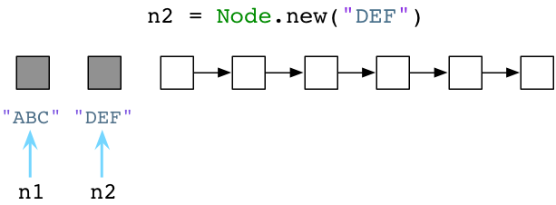

这个简单的用链表来预分配对象的算法已经发明了超过50年了，而发明人是赫赫有名的计算机科学家John McCarthy，一开始是用Lisp实现的。Lisp不仅是最早的函数式编程语言，在计算机科学领域也有许多创举。其一就是利用垃圾回收机制自动化进行程序内存管理的概念

标准的Ruby，也就是总所周知的"Matz's Ruby Interpreter"(MRI)，所使用的GC 算法与McCarthy 在1960年的实现方式很类似。无论好坏，Ruby 的垃圾回收机制已经53岁高龄了。像Lisp 一样，Ruby 预先创建一些对象，然后在你分配新对象或者变量的时候供你使用

## Python 的对象分配

我们已经了解了Ruby预先创建对象并将它们存放在可用列表中。那么Python 又是怎么样的呢？

尽管由于许多原因Python 也使用可用列表（用来回收一些特定对象，比如list），但在为新对象和变量分配内存的方面Python 和Ruby 是不同的。例如我们用Python 来创建一个Node 对象

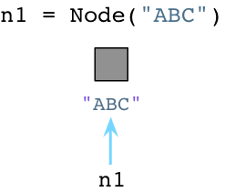

与Ruby 不同，当创建对象时Python 立即向操作系统申请内存。（Python 实际上实现了一套自己的内存分配系统，在操作系统堆之上提供了一个抽象层，这里就不展开说了）

当我们创建第二个对象的时候，再次向OS 申请内存

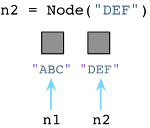

看起来够简单吧，在我们创建对象的时候，Python 会花些时间为我们找到并分配内存

## Python 开发者住在卫生之家


用完的垃圾对象会立即被Python 打扫干净

Python 与Ruby 的垃圾回收机制颇为不同。让我们回到前面提到的三个Python Node 对象

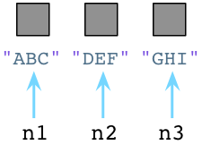

在内部，创建一个对象时，Python 总是在对象的C 结构体内保存一个整数，称之为**引用计数**。期初，Python 将这个值设置为1

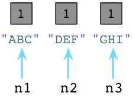

值为1说明分别有一个指针指向或引用这三个对象。加入我们现在创建一个新的Node 示例，"JKL"，并且n1 指向它：

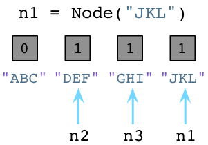

与之前一样，Python 设置"JKL" 的引用计数为1.然而，请注意由于我们改变了n1 指向"JKL"，不再指向"ABC"，Python 就把"ABC" 的引用计数置为0了。此刻，Python 垃圾回收器立刻挺身而出！每当对象的引用计数减为0，Python 立即将其释放，把内存还给操作系统

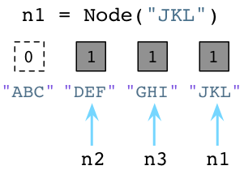

上面Python 回收了"ABC" Node 实例使用的内存

对比Ruby，Ruby 是弃旧对象于原地不顾，也不释放它们的内存

Python 的这种垃圾回收算法被称为引用计数。是George-Collins 在1960年发明的，恰巧与John McCarthy 发明的可用列表算法在同一年出现。就像Mike-Bernstein 在6月份[哥谭市Ruby大会](http://goruco.com/)杰出的[垃圾回收机制演讲](http://www.confreaks.com/videos/2545-goruco2013-to-know-a-garbage-collector)中说的: "1960年是垃圾收集器的黄金年代..."

Python 开发者工作在卫生之家，你可以想象，有个患有轻度OCD(一种强迫症)的室友一刻不停地跟在你身后打扫，你一放下脏碟子或杯子，有个家伙已经准备好把它放进洗碗机了！

接着看第二个例子

假如我们让n2 引用 n1，即`n2 = n1`

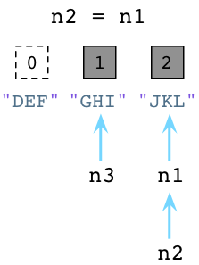

上图中左边的"DEF" 的引用数已经被Python 减少了，垃圾回收器会立即回收"DEF" 实例。同时"JKL" 的引用数已经变为了2 ，因为n1 和n2 都指向它

## 标记-清除

最终那间凌乱的房间充斥着垃圾，再不能岁月静好了，在Ruby 程序运行了一阵子之后，可用列表最终被用光了

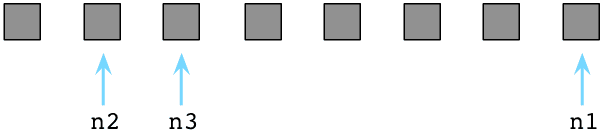

此刻所有Ruby 预创建对象都被程序用过了（它们都变灰了），可用列表里空空如也（没有白格子了）

此刻Ruby 祭出另一McCarthy 发明的算法，名曰：**标记-清除**

首先Ruby 把程序停下来，Ruby 用“地球停转垃圾回收大法”。之后Ruby 轮询所有指针，变量和代码产生别的引用对象和其他值。同时Ruby 通过自身的虚拟机遍历内部指针。标记出这些指针引用的每个对象。在图中用M 表示

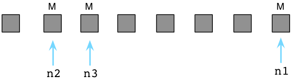

上图中那三个被标记为M 的对象是程序还在使用的。在内部，Ruby 实际上使用一串位值，被称为**可用位图**（译注：还记得《编程珠玑》里的为突发排序吗，这对离散度不高的有限整数集合具有很强的压缩效果，用以节约机器的资源。），来跟踪对象是否被标记

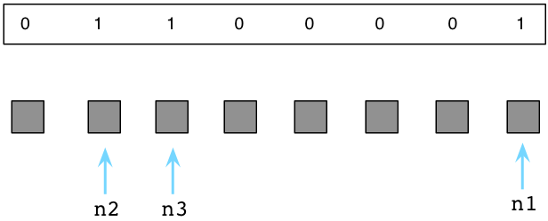

Ruby将这个可用位图存放在独立的内存区域中，以便充分利用Unix的写时拷贝化。有关此事的更多内容请关注我另一博文[《Why You Should Be Excited About Garbage Collection in Ruby 2.0》](http://patshaughnessy.net/2012/3/23/why-you-should-be-excited-about-garbage-collection-in-ruby-2-0)

如果说被标记的对象是存活的，剩下的未标记的对象只能是垃圾，这意味着我们的代码不再会使用它了。我会在下图中用白格子表示垃圾对象


接下来Ruby清除这些无用的垃圾对象，把它们送回到可用列表中：

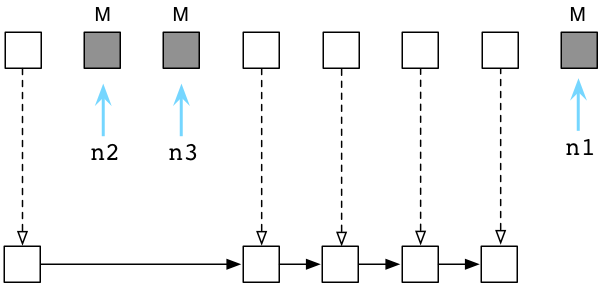

在内部这一切发生得迅雷不及掩耳，因为Ruby 实际上不会把对象从这拷贝到那，而是通过调整内部指针，将其指向一个新链表的方式，来将垃圾对象归为到可用列表中

现在等下回再创建对象的时候，Ruby 又可以把这些垃圾对象分给我们使用了。在Ruby里，对象们六道轮回，转世投胎，享受多次人生

## 标记-清除 vs 引用计数

乍一看，Python 的GC 算法貌似远胜于Ruby 的：宁舍洁宇而居秽室乎？为什么Ruby 宁愿定期强制程序停止运行，也不使用Python 的算法呢？

然而，引用计数并像第一眼看上去那么简单。有许多原因使得许多语言不像Python 这样使用引用计数GC 算法

首先，它不好实现。Python 不得不再每个对象内部留一些空间来处理引用计数。这样付出了一小点空间上的代价。但更糟糕的是，每个简单的操作（像修改变量或引用）都会变成一个更复杂的操作，因为Python 需要增加一个计数、减少另外一个计数，还可能释放对象

第二点，它相对较慢。虽然Python 随着程序执行GC 很稳健，但这并不一定快。Python 不停地更新着众多引用数值。特别是当你不再使用一个大数据结构的时候，比如一个包含很多元素的列表，Python 可能必须一次性释放大量内存。减少引用计数就成了一项复杂的递归过程了

最后，它不总是奏效。下面会看到引用计数不能处理环形数据结构，即含有循环引用的数据结构

>扩展思考：引用计数机制在多线程并发的环境下会有什么样的问题？