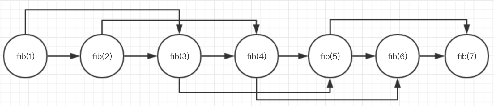

>the basic idea of dynamic programming is to take a problem, split into subproblems, solve those subproblems and reuse the solutions to your subproblems.

## 斐波那契数列

首先是直接根据其递归的定义给出最简单的递归实现方式

```c++
int fib(int n){
    if(n <= 0)
        return 0;
    if(1 == n || 2 == n)
        return 1;
    return fib(n-1) + fib(n-2);
}
```

参考[《递归和循环》](http://www.xumenger.com/recursion-vs-loop-20170830/)，可以知道因为存在大量的重复运算，所以这种实现的复杂度达到`O(2^N)`

**自顶向下的记忆法**

每当我们计算出一个斐波那契数字，就把它放到一个字典中，然后当我们要计算某个斐波那契数字的时候，先检查字典中是否已经存在这个数，如果存在就直接拿出来，否则再进行计算

```c++
int compute(int n, int *memo){
    if(0 != memo[n])
        return memo[n];

    if(n <= 2)
        memo[n] = 1;
    else
        memo[n] = compute(n-1, memo) + compute(n-2, memo);

    return memo[n];
}

int fib(int n){
    if(n <= 0)
       return 0;
    int memo[n+1];
    memset(memo, 0, (n+1)*sizeof(int));
    return compute(n, memo);
}
```

用空间换时间的策略，把已经计算出来的结果保存起来，下次直接从对应的内存中获取，而不需要进行重复运算！现在的时间复杂度从 O(2^N) 降到 O(N)

>这正是动态规划的核心：先计算出子问题，再由子问题计父问题！但是在设计动态规划算法中真正的挑战在于如何正确找出什么是所谓的“子问题”！

**自底向上的动态规划**

上面的方法还是会用到递归，而且会有额外的空间消耗，很明显当n 很大的时候，会存在栈溢出的风险，其实还有更好的方法

```c++
int fib(int n){
    if(n <= 0)
        return 0;
    if(1 == n || 2 == n)
        return 1;
    int f1 = 1;
    int f2 = 1;
    int f = f1 + f2;
    int i = 3;
    while(i < n){
        f1 = f2;
        f2 = f;
        f = f1 + f2;
        i++;
    }
    return f;
}
```

这里解释一下所谓的自底向上和自顶向下！上面的自顶向下是要计算fib(n)，就要先计算出fib(n-1) 和fib(n-2)，然后逐步往下递归计算；而自底向上则是从fib(1)、fib(2) 往上递推得到fib(n)

当然！这只是一个极其简单的例子！！！！

## 有向无环图的最短路径

其实上面的斐波那契问题可以转换为有向无环图（DAG）的最短路径问题



## 参考资料

* [《递归和循环》](http://www.xumenger.com/recursion-vs-loop-20170830/)
* [MIT Algorithms](https://ocw.mit.edu/courses/electrical-engineering-and-computer-science/6-006-introduction-to-algorithms-fall-2011/)
* [DP I](https://www.youtube.com/watch?v=OQ5jsbhAv_M)
* [DP II](https://www.youtube.com/watch?v=ENyox7kNKeY)
* [DP III](https://www.youtube.com/watch?v=ocZMDMZwhCY)
