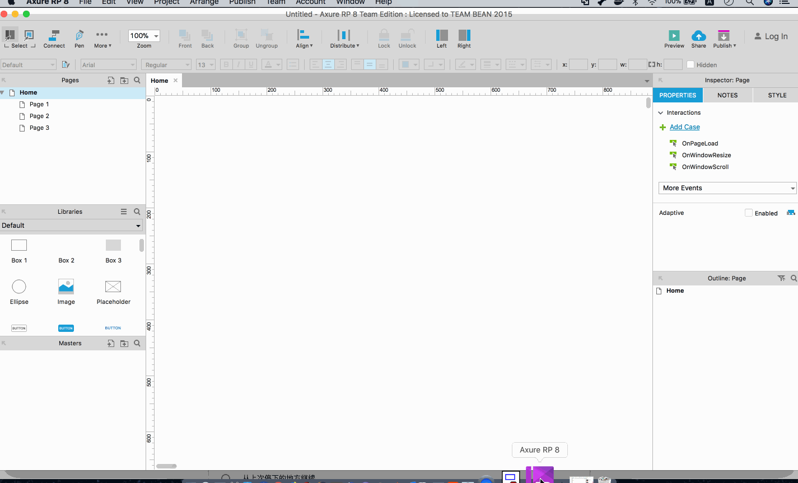
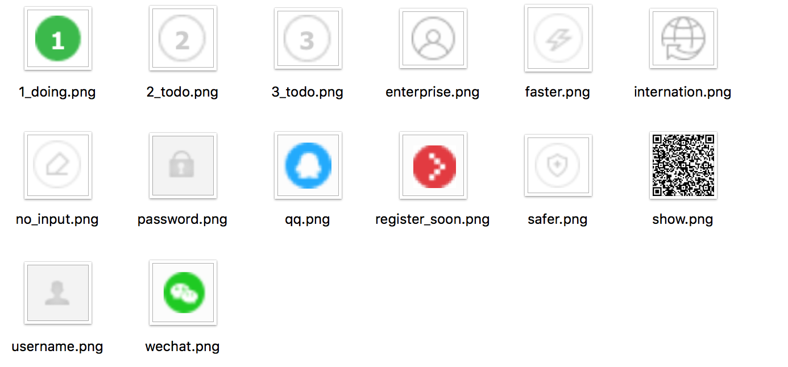

Axure RP 是一个专业的快速原型设计工具。Axure（发音：Ack-sure），代表美国Axure 公司；RP则是Rapid Prototyping（快速原型）的缩写

Axure RP 是美国Axure Software Solution 公司旗舰产品，是一个专业的快速原型设计工具，让负责定义需求和规格、设计功能和界面设计的专家能够快速创建应用软件或Web 网站的线框图、流程图、原型和规格说明文档。作为专业的原型设计工具，它能快速、高效地创建原型，同时支持多人协作设计和版本控制管理

Axure RP 的使用者主要包括商业分析师、信息架构师、可用性专家、产品经理、IT 咨询师、用户体验设计师、交互设计师、界面设计师等等，另外，架构师、程序开发工程师也在使用Axure

>本文的gif 图片使用LICEcap 录屏软件生成。另外Mac 上使用Chrome 等浏览器打开gif 文件可以直接查看gif 图片内容

## 使用简介

打开Axure 后界面是这样的

然后你可以通过菜单栏的【Publish】选项在浏览器中查看原型的交互效果

## Axure工具栏和常用快捷键

其实Axure 的很多功能、快捷键和Word 这样的文本编辑器的操作逻辑很类似（当然Axure 毕竟是Axure，它有它独特的地方、适用的领域）！

### 画布网格

比如在画布上使用快捷键【command + '】控制网格的显示和隐藏（网格可以作为坐标轴帮助我们精确放置组件的位置）

### 颜色、宽度等样式

比如我选择一个矩形组件，可以设置它的边框颜色、边框宽度、填充颜色、透明度、阴影效果、文本内容颜色、文本内容字体等，填充颜色的时候可以指定对应的RGB 色号，也可以通过“吸管”吸取某张图（双击Image 即可选择本地图片）上的颜色

同样的，可以像上面介绍的那样，通过【Publish】菜单在浏览器中查看原型效果！

### 其他快捷键

另外就是和大多数文本编辑器一样的快捷键

* 【command + o】：open
* 【command + n】：new
* 【command + s】：save
* 【command + z】：undo
* 【command + c】：copy
* 【command + v】：paste
* 【command + x】：cut
* 【command + f】：find
* 【command + a】：select all

## 使用Axure设计网站注册与登录页面

其实在[前端开发框架Bootstrap](http://www.xumenger.com/bootstrap-20180621/)讲到如何使用Bootstrap 设计一个网站的登录注册页，本文使用Axure 来设计一个简单的登录注册页以展示Axure 的使用方法、常用的控件

登录注册页面的设计至少包括以下内容：

* 登录表单布局与交互设计
* 注册表单布局与交互设计
* 表单验证

这里我模仿[京东](https://passport.jd.com/new/login.aspx?ReturnUrl=https://www.jd.com/)的登录注册页面，使用Axure 作出原型

先看一下京东登录注册页的交互逻辑

[这里](../download/20180728/image.zip)是京东登录注册页需要的图片等素材

### 登录页原型

比如先把登录页的扫码登录实现

### 注册页原型

这里不做过多文字说明，直接看gif 动图的内容

>最终的Axure 原型文件可以点击[这里](../download/20180728/simple.rp)下载

## 参考资料

* [Mac上小巧实用的GIF格式录屏软件 LICEcap](https://blog.csdn.net/agonie201218/article/details/49686265)
* [史蒂芬周的博客](http://www.sdifen.com/?s=Axure&submit=%E6%90%9C%E7%B4%A2)
* [Axure RP8 MAC中文破解版](https://www.cnblogs.com/exmyth/p/8560056.html)
* [极客学院 Axure](http://www.jikexueyuan.com/course/axure/)
* [综合案例：蜜桃全球购高保真原型设计](http://www.jikexueyuan.com/course/2642.html)
* [axure非官方中文网](https://www.axure.com.cn/)
* [axure非官方中文网视频教程](https://www.axure.com.cn/category/axure/videos/)
* [axure原创教程网](http://www.iaxure.com/)
* [Axure实现Tab选项卡切换功能](https://blog.csdn.net/huyuyang6688/article/details/41043255)
