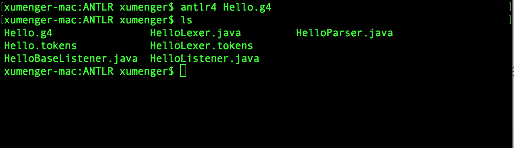
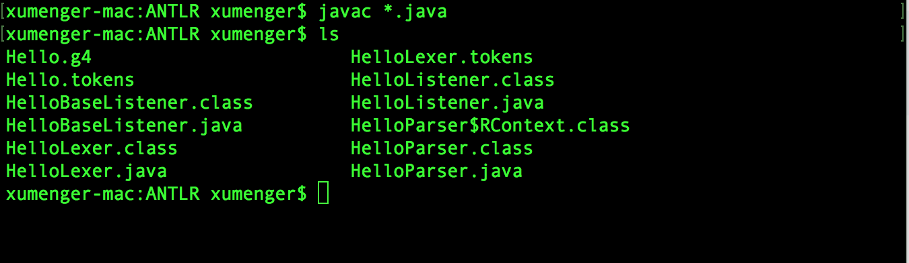
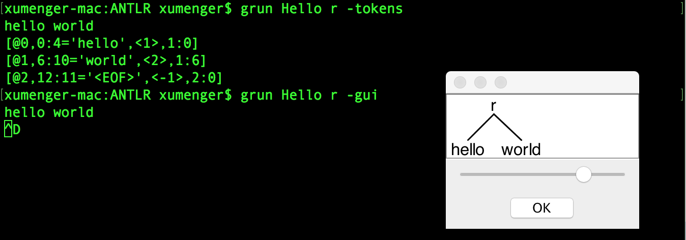

编译器的后端基本都可以通过LLVM 来解决，而ANTLR 则是处理编译器前端的神器！

## 搭建ANTLR环境

在Mac 上执行这些命令即可配置好ANTLR 环境

```
# 下载 ANTLR
cd /usr/local/lib/
curl -O http://www.antlr.org/download/antlr-4.0-complete.jar

# 设置环境变量
export CLASSPATH=".:/usr/local/lib/antlr-4.0-complete.jar:$CLASSPATH"
alias antlr4='java -jar /usr/local/lib/antlr-4.0-complete.jar'
alias grun='java org.antlr.v4.runtime.misc.TestRig'
```

为了让antlr4、grun 命令永久生效，需要修改`~/.bash_profile`，将上面设置环境变量的内容都添加到该配置文件中

保存退出后执行`source ~/.bash_profile` 使刚才的配置生效就可以了

试着照抄一个Hello World 的例子

```ANTLR
grammar Hello ;
r : 'hello' ID ;
ID : [a-z]+ ;
WS : [ \t\r\n]+ -> skip;
```

执行`antlr4 Hello.g4`命令生成Java 文件



`javac *.java`编译程序



可以使用grun 看一下`hello world`的解析效果，比如执行，注意分别在输入`hello world`后按【Control + d】



在[https://github.com/antlr/grammars-v4/](https://github.com/antlr/grammars-v4/)总结了ASM、SQL、Lisp、C、C++、Java、Python、Lua 等各种常用编程语言的语法规则

## 