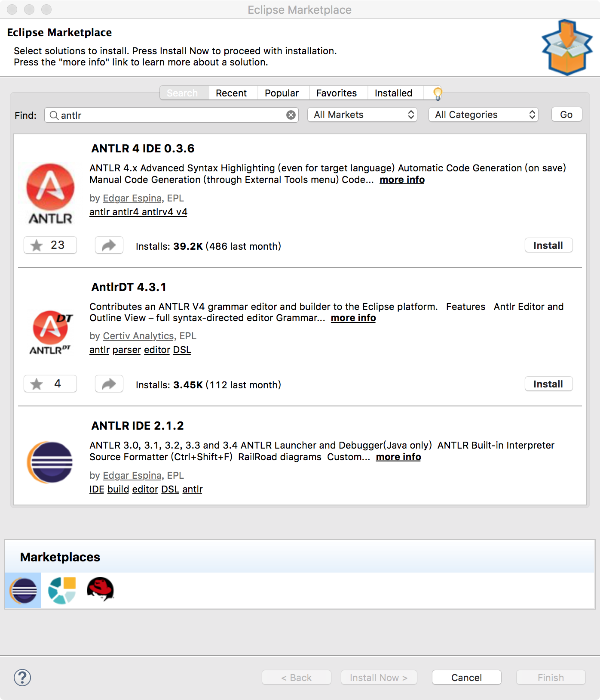
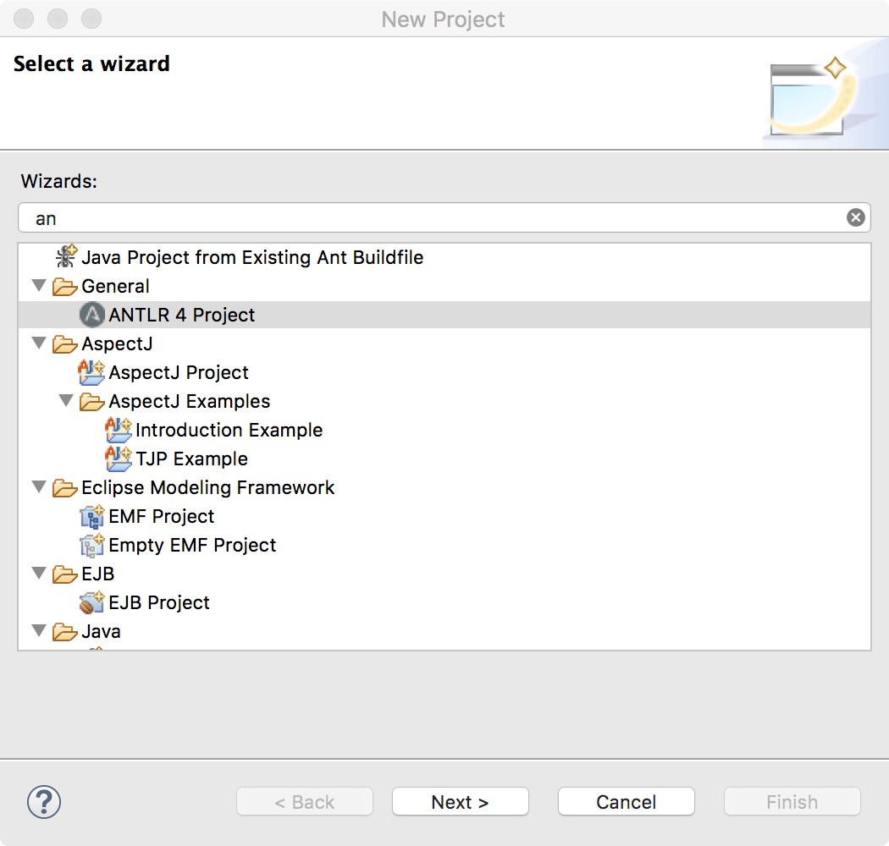
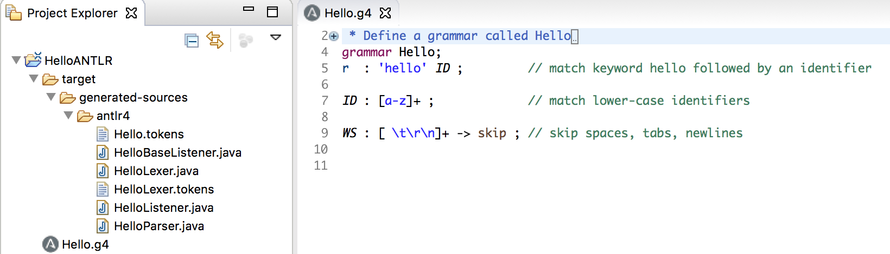

编译器的后端基本都可以通过[LLVM](https://llvm.org/) 来解决，而[ANTLR](http://www.antlr.org/) 则是处理编译器前端的神器！

ANTLR（ANother Tool for Language Recognition）是一个功能强大的Parser 生成器，用来读取、处理、执行或翻译结构化文本或二进制文件。ANTLR 被广泛地用于构建语言、工具和框架。ANTRL 可以从语法生成Parser，用来构建和遍历分析树

ANTLR 对解析（parsing）理论和应用有以下贡献

* 线性近似预测
* 语法和语义预测
* ANTLRWorks
* 树结构解析
* LL(\*)
* 在ANTLR v4 中实现了自适应LL(\*)

## 搭建ANTLR环境

在Mac 上执行这些命令即可配置好ANTLR 环境

```sh
# 下载 ANTLR
cd /usr/local/lib/
curl -O http://www.antlr.org/download/antlr-4.0-complete.jar

# 设置环境变量
export CLASSPATH=".:/usr/local/lib/antlr-4.0-complete.jar:$CLASSPATH"
alias antlr4='java -jar /usr/local/lib/antlr-4.0-complete.jar'
alias grun='java org.antlr.v4.runtime.misc.TestRig'
```

为了让antlr4、grun 命令永久生效，需要修改`~/.bash_profile`，将上面设置环境变量的内容都添加到该配置文件中

保存退出后执行`source ~/.bash_profile` 使刚才的配置生效就可以了

试着照抄一个Hello World 的例子

```antlr
grammar Hello ;
r : 'hello' ID ;
ID : [a-z]+ ;
WS : [ \t\r\n]+ -> skip;
```

执行`antlr4 Hello.g4`命令生成Java 文件


`javac *.java`编译程序


可以使用grun 看一下`hello world`的解析效果，比如执行，注意分别在输入`hello world`后按【Control + d】


在[https://github.com/antlr/grammars-v4/](https://github.com/antlr/grammars-v4/)总结了ASM、SQL、Lisp、C、C++、Java、Python、Lua 等各种常用编程语言的语法规则

## Eclipse集成ANTLR4开发环境

【Help】->【Eclipse Marketplace…】搜索antlr



选择第一个安装，antlr4 安装完毕之后Eclipse 会继续安装Xtext，安装完成之后会提示重启Eclipse！重启一下就安装完毕啦！

创建一个ANTLR 项目，假设叫做HelloANTLR



会生成一下项目结构



其中，HelloANTLR.g4 就是这个项目的核心文件了，我们所有的语法以及词法规则都会在这里定义！

和上面类似，我们编写语法规则如下

```
grammar HelloANTLR;
r  : 'hello' ID ;         // match keyword hello followed by an identifier

ID : [a-z]+ ;             // match lower-case identifiers

WS : [ \t\r\n]+ -> skip ; // skip spaces, tabs, newlines
```

【Run as】->【Generate ANTLR Recognizer】，控制台输出以下内容即说明安装成功


## ANTLR解析SQL


另外可以参考像[用 antlr 做一个计算器](https://blog.csdn.net/zjq_1314520/article/details/65938532)等文章使用ANTLR4 做出更强大的应用
