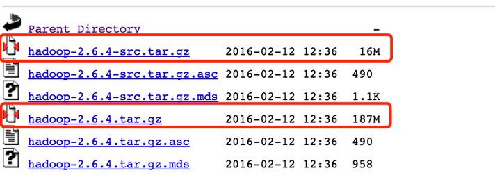
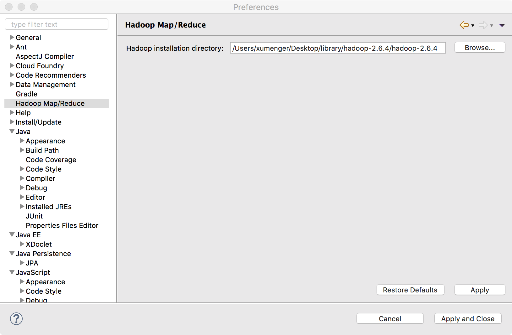

老套路，现在自己的机器上搭建好Hadoop 的运行环境（这里搭建的是伪分布式环境）

## 搭建Hadoop伪分布式环境

在[https://archive.apache.org/dist/hadoop/common/hadoop-2.6.4/](https://archive.apache.org/dist/hadoop/common/hadoop-2.6.4/)下载Hadoop 的源码包和编译后的包

使用`tar  -zxvf ?`解压.tar.gz 文件

进入Hadoop 所在的目录，运行`sh start-all.sh`启动Hadoop

在浏览器访问[http://localhost:50070](http://localhost:50070)

在浏览器访问[http://localhost:8088/](http://localhost:8088/)

## 配置Eclipse开发环境

下载[hadoop-eclipse-plugin-2.7.3.jar](../download/20180731/hadoop-eclipse-plugin-2.7.3.jar)，然后把插件放到eclipse/plugins 目录下

重启Eclipse，配置Hadoop installation directory

如果插件安装成功，打开[eclipse] –> 【Perfernces】，在窗口左侧会有【Hadoop Map/Reduc】选项，点击此选项，在窗口右侧设置【Hadoop】安装路径

接着配置Map/Reduce Locations

## 扩展阅读

分布式系统领域，Google 的三驾马车Google File System、MapReduce、Bigtable 可谓是大名鼎鼎。虽然Google 没有公布这三个产品的源码，但是它发布了这三个产品的详细设计论文

而且Yahoo 资助的Hadoop 也有按照这三篇论文的开源Java 实现

* Hadoop MapReduce 对应MapReduce
* Hadoop Distribute File System 对应Google File Syetem
* HBase 对应Bigtable

总的介绍一下三大大数据框架

**Hadoop**

Hadoop 是实现了MapReduce 的思想，将数据切片计算来处理大量的离线数据

Hadoop 处理的数据必须是已经存放在HDFS 上或者类似HBase 的数据库中，所以Hadoop 实现的时候是通过移动计算到这些存放数据的机器上来提高效率

**Spark**

Spark 是一个基于内存计算的开源集群计算系统，目的是更快速的进行数据分析

Spark 由加州伯克利大学AMP 实验室Matei 为主的小团队使用Scala 开发，类似于Hadoop MapReduce 的通用并行计算框架，Spark 基于Map Reduce 算法实现的分布式计算，拥有Hadoop MapReduce 所具有的优点，但不同于MapReduce 的是Job 中间输出和结果可以保存在内存中，从而不再需要读写HDFS，因此Spark 能更好地适用于数据挖掘与机器学习等需要迭代的Map Reduce的算法

**Storm**

Storm 是最佳的流式计算框架，Storm 由Java 和Clojure 写成，Storm 的优点是全内存计算，所以它的定位是分布式实时计算系统

按照Storm 作者的说法，Storm 对于实时计算的意义类似于Hadoop 对于批处理的意义

**简单总结**

Hadoop 适合于离线的批量数据处理适用于对实时性要求极低的场景

Storm 适合于实时流数据处理，实时性方面做得极好

Spark 是内存分布式计算框架，试图吞并Hadoop 的Map-Reduce 批处理框架和Storm 的流处理框架，但Spark 已经做得很不错了，批处理方面性能优于Map-Reduce，但是流处理目前还是弱于Storm，产品仍在改进之中

## 参考资料

* [在mac上安装hadoop伪分布式](http://www.cnblogs.com/aijianiula/p/3842581.html)
* [Google三驾马车：GFS、MapReduce和Bigtable](https://www.cnblogs.com/maybe2030/p/4568541.html)
* [spark、storm与Hadoop](https://www.cnblogs.com/mlj5288/p/4606092.html)
* [Google File System(中文翻译)](https://blog.csdn.net/xuleicsu/article/details/526386)
* [mapreduce 中文版 中文翻译](https://blog.csdn.net/active1001/article/details/1675920)
* [Google's BigTable 原理 （翻译）](https://blog.csdn.net/accesine960/article/details/595628)
* [Google File System原理](https://juejin.im/post/582d9c91d203090067fba883)
* [Storm与Spark、Hadoop三种框架对比](https://blog.csdn.net/zuochao_2013/article/details/78175419)
* [谷歌技术"三宝"之谷歌文件系统](https://blog.csdn.net/opennaive/article/details/7483523)
* [谷歌技术"三宝"之MapReduce](https://blog.csdn.net/opennaive/article/details/7514146)
* [谷歌技术"三宝"之BigTable](https://blog.csdn.net/OpenNaive/article/details/7532589)