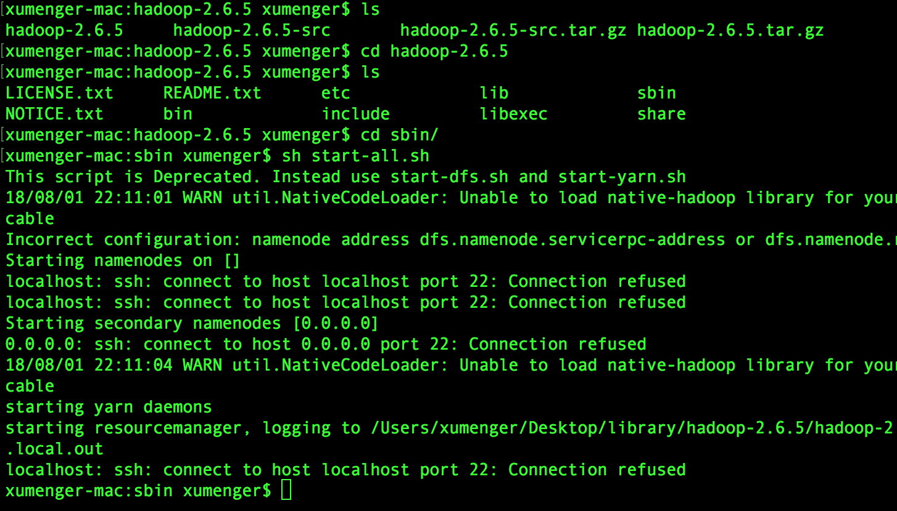
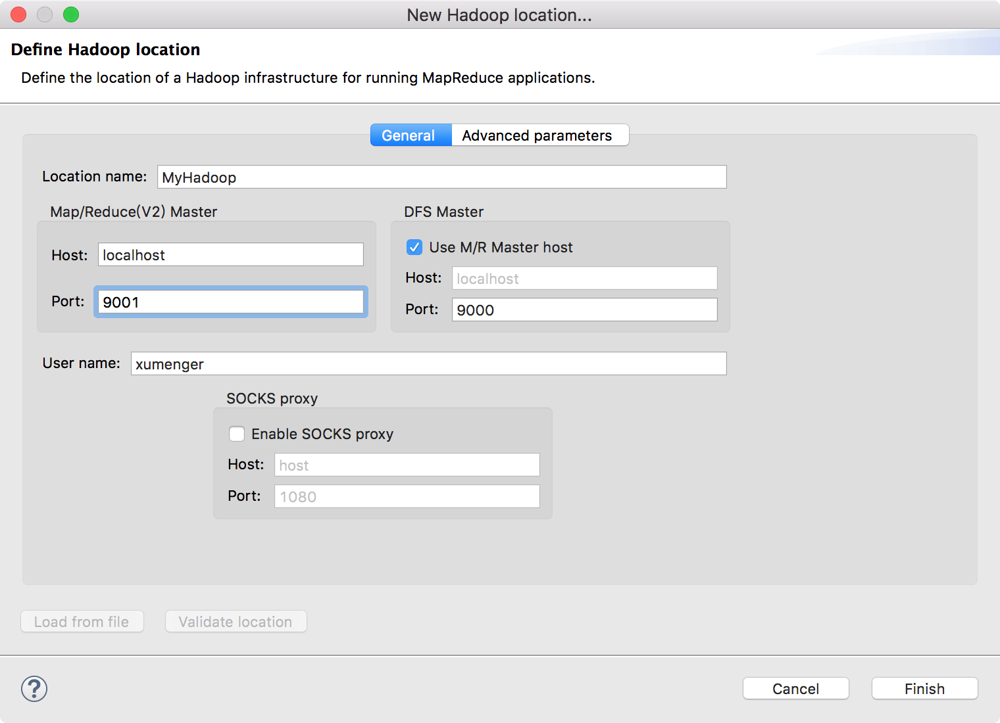
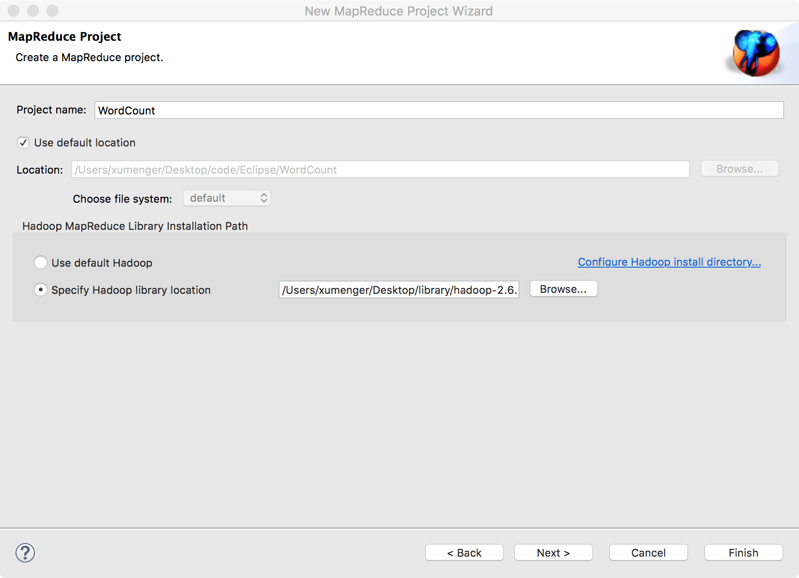

老套路，现在自己的机器上搭建好Hadoop 的运行环境（这里搭建的是伪分布式环境）

## 搭建Hadoop伪分布式环境

在[http://mirror.bit.edu.cn/apache/hadoop/common/hadoop-2.6.5/](http://mirror.bit.edu.cn/apache/hadoop/common/hadoop-2.6.5/)下载Hadoop 的源码包和编译后的包


使用`tar -zxvf ?`解压.tar.gz 文件

进入Hadoop 所在的目录，运行`sh start-all.sh`启动Hadoop



在浏览器访问[http://localhost:8088/](http://localhost:8088/)


hadoop 的bin 目录下是更多的命令，但是执行命令时报错


>报错内容是：18/08/01 22:29:07 WARN util.NativeCodeLoader: Unable to load native-hadoop library for your platform... using builtin-java classes where applicable

这个问题并不会有什么影响，但是看到显示出来的目录不是hdfs 上的文件，而是本地根目录下的文件

需要修改hadoop 安装目录下etc/hadoop/core-site.xml 文件的配置内容，添加fs.default.name，否则默认是本地文件系统

```xml
<?xml version="1.0"?>
<?xml-stylesheet type="text/xsl" href="configuration.xsl"?>
<!-- Put site-specific property overrides in this file. -->

<configuration>
<property>
   <name>hadoop.tmp.dir</name>
   <value>/Users/xumenger/Desktop/library/hadoop-2.6.5/hadoop-2.6.5/tmp</value>
   <description>A base for other temporary directories.</description>
 </property>
<property>
   <name>fs.default.name</name>
   <value>hdfs://localhost:9000</value>
</property>
</configuration>
```

还需要去配置/etc/hadoop/mapred-site.xml 内容为

```xml
<?xml version="1.0"?>
<?xml-stylesheet type="text/xsl" href="configuration.xsl"?>
<!-- Put site-specific property overrides in this file. -->

<configuration>
<property>
  <name>mapred.job.tracker</name>
  <!-- 注意这里是对MapReduce的配置，不是HDFS，所以不要加 hdfs:// 协议约定 -->
  <value>localhost:9001</value>
</property>
</configuration>
```

配置/etc/hadoop/hdfs-site.xml 内容为

```xml
<?xml version="1.0"?>
<?xml-stylesheet type="text/xsl" href="configuration.xsl"?>
<!-- Put site-specific property overrides in this file. -->

<configuration>
<property>
  <name>dfs.namenode.name.dir</name>
  <value>/Users/xumenger/Desktop/library/hadoop-2.6.5/hadoop-2.6.5/node/namenode</value>
</property>
<property>
  <name>dfs.datanode.data.dir</name>
  <value>/Users/xumenger/Desktop/library/hadoop-2.6.5/hadoop-2.6.5/node/datanode</value>
</property>
<property>
  <name>dfs.replication</name>
  <value>1</value>
</property>
</configuration>
```

另外还必须要启动本机SSH 服务

```sh
# 启动服务
sudo launchctl load -w /System/Library/LaunchDaemons/ssh.plist

# 关闭服务
sudo launchctl unload -w /System/Library/LaunchDaemons/ssh.plist
```

每次启动hadoop 的时候需要手工输入登录密码，操作起来还是比较麻烦的，可以的话还是设置一下SSH 免密登录

如果`~/.ssh`下没有id_rsa.pub 文件，那么执行`ssh-keygen -t rsa`并一路回车，接着执行下面的命令，在`~/.ssh`目录下生成authorized_keys

```sh
cd ~/.ssh
cp id_rsa.pub authorized_keys
```

之后直接`ssh localhost`即可实现免密登录！！之后再执行`sh start-all.sh`的时候就不需要多次输入密码了，省力不少！

>[SSH登录原理及免密登录](https://blog.csdn.net/m0_37572458/article/details/78568558)

接着设置环境变量，在`~/.bash_profile`中添加以下环境变量配置

```sh
export HADOOP_COMMON_LIB_NATIVE_DIR="$HADOOP_HOME/lib/native"
export HADOOP_HOME="/Users/xumenger/Desktop/library/hadoop-2.6.5/hadoop-2.6.5"
export HADOOP_OPTS="-Djava.library.path=$HADOOP_HOME/lib:$HADOOP_COMMON_LIB_NATIVE_DIR"
```

进入sbin 目录下重启服务

```sh
sh stop-all.sh
sh start-all.sh
```

>启动服务的时候，会显示哪些信息放在哪个日志文件中，所以如果出现问题，可以去对应的日志文件中查看详细信息！

通过jps 命令可以查看启动的Java 进程，可以使用lsof 命令查看端口监听状态


好的，现在可以执行hadoop 的命令了（下图中的警告信息暂时请忽略）


>更多命令参见[https://blog.csdn.net/m0_38003171/article/details/79086780](https://blog.csdn.net/m0_38003171/article/details/79086780)

## 配置Eclipse开发环境

下载[hadoop-eclipse-plugin-2.7.3.jar](../download/20180731/hadoop-eclipse-plugin-2.7.3.jar)，然后把插件放到eclipse/plugins 目录下

重启Eclipse，配置Hadoop installation directory

如果插件安装成功，打开【Eclipse】–>【Perfernces】，在窗口左侧会有【Hadoop Map/Reduc】选项，点击此选项，在窗口右侧设置【Hadoop】安装路径


接着配置Map/Reduce Locations。【Window】->【Perspective】->【Open Perspective】->【Other】，选中Map/Reduce 后，选择Open


然后就可以在Eclipse 下面看到Map/Reduce Location 选项卡


点击Map/Reduce Location 选项卡，点击右边小象图标，打开Hadoop Location 配置窗口：输入Location Name，任意名称即可。配置Map/Reduce Master 和DFS Mastrer，Host 和Port 配置成与core-site.xml 的设置一致即可



点击”Finish”按钮，关闭窗口。点击左侧的DFSLocations—>MyHadoop（上一步配置的location name)，如能看到user，表示安装成功。但是我配置的时候出现报错，还未解决！


## 新建WordCount项目

【File】->【New】->【Project】，选择Map/Reduce Project，输入项目名称WordCount，点finish 完成



新建一个包：test。再新建一个WordCount.java 类。项目结构如下


该类的实现代码是

```java
package test;

import java.io.IOException;  
import org.apache.hadoop.conf.Configuration;  
import org.apache.hadoop.fs.Path;  
import org.apache.hadoop.io.IntWritable;  
import org.apache.hadoop.io.Text;  
import org.apache.hadoop.mapreduce.Job;  
import org.apache.hadoop.mapreduce.Mapper;  
import org.apache.hadoop.mapreduce.Reducer;  
import org.apache.hadoop.mapreduce.lib.input.FileInputFormat;  
import org.apache.hadoop.mapreduce.lib.output.FileOutputFormat;  
import org.apache.hadoop.util.GenericOptionsParser;  

public class WordCount {

    private static class WordCountMapper extends Mapper<Object, Text, Text, IntWritable>{  
        @Override  
        protected void map(Object key, Text value, Context context)  
                throws IOException, InterruptedException {  
            String str=value.toString();  
            String []strArray=str.split(" ");  
            for(String s:strArray){  
                context.write(new Text(s), new IntWritable(1));  
            }  
        }    
    }  

    private static class WordCountReducer extends Reducer<Text, IntWritable, Text, IntWritable>{  
        @Override  
        protected void reduce(Text key, Iterable<IntWritable> values,  
                Context context)  
                throws IOException, InterruptedException { 
            int sum=0; 
            for(IntWritable count:values){  
                sum+=count.get();  
            }  
            context.write(key, new IntWritable(sum));  
        }  
    }  

    public static void main(String[] args) throws Exception{  
        Configuration conf=new Configuration();  
        String []argArray=new GenericOptionsParser(conf,args).getRemainingArgs();  
        if(argArray.length!=2){  
            System.out.println("需要两个参数");  
            System.exit(1);  
        }  
        Job job=Job.getInstance(conf,"wordcount"); 
        job.setJarByClass(WordCount.class); 

        job.setMapperClass(WordCountMapper.class);  
        job.setMapOutputKeyClass(Text.class);  
        job.setMapOutputValueClass(IntWritable.class);  

        job.setReducerClass(WordCountReducer.class);
        job.setOutputKeyClass(Text.class);  
        job.setOutputValueClass(IntWritable.class); 

        FileInputFormat.addInputPath(job, new Path(argArray[0]));  
        FileOutputFormat.setOutputPath(job, new Path(argArray[1]));  

        System.exit(job.waitForCompletion(true)?0:1);  
    }
}
```

将本地的test.txt 中编辑内容为

```
test
xum
hello
world
test
xum
```

然后上传到HDFS：`hdfs dfs -appendToFile test.txt /test/test.txt`

点击WordCount.java 右键，点击Run As ->Run Configurations，输入运行参数：hdfs://localhost:9000/test hdfs://localhost:9000/output 


结果图如下，其中test 是输入文件夹，ouput 是输出文件夹


## Hadoop源码

如果想深入学习Hadoop，阅读源码是非常必要的。之前已经下载了Hadoop 的源码包，并解压到指定路径下，我的路径为：/Users/xumenger/Desktop/library/hadoop-2.6.5/hadoop-2.6.5-src

接下来，只要在Eclipse 下的工程中，只要做简要配置即可

如想查看Job 类的源码。按住【Command】键，同时鼠标点击Job 类


然后点击【Attach Source...】->【External location】->【External Folder..】选择之前源码解压的路径即可


现在就可以看到源码了


## 扩展阅读

分布式系统领域，Google 的三驾马车Google File System、MapReduce、Bigtable 可谓是大名鼎鼎。虽然Google 没有公布这三个产品的源码，但是它发布了这三个产品的详细设计论文

而且Yahoo 资助的Hadoop 也有按照这三篇论文的开源Java 实现

* Hadoop MapReduce 对应MapReduce
* Hadoop Distribute File System 对应Google File Syetem
* HBase 对应Bigtable

总的介绍一下三大大数据框架

**Hadoop**

Hadoop 是实现了MapReduce 的思想，将数据切片计算来处理大量的离线数据

Hadoop 处理的数据必须是已经存放在HDFS 上或者类似HBase 的数据库中，所以Hadoop 实现的时候是通过移动计算到这些存放数据的机器上来提高效率

**Spark**

Spark 是一个基于内存计算的开源集群计算系统，目的是更快速的进行数据分析

Spark 由加州伯克利大学AMP 实验室Matei 为主的小团队使用Scala 开发，类似于Hadoop MapReduce 的通用并行计算框架，Spark 基于Map Reduce 算法实现的分布式计算，拥有Hadoop MapReduce 所具有的优点，但不同于MapReduce 的是Job 中间输出和结果可以保存在内存中，从而不再需要读写HDFS，因此Spark 能更好地适用于数据挖掘与机器学习等需要迭代的Map Reduce的算法

**Storm**

Storm 是最佳的流式计算框架，Storm 由Java 和Clojure 写成，Storm 的优点是全内存计算，所以它的定位是分布式实时计算系统

按照Storm 作者的说法，Storm 对于实时计算的意义类似于Hadoop 对于批处理的意义

**简单总结**

Hadoop 适合于离线的批量数据处理适用于对实时性要求极低的场景

Storm 适合于实时流数据处理，实时性方面做得极好

Spark 是内存分布式计算框架，试图吞并Hadoop 的Map-Reduce 批处理框架和Storm 的流处理框架，但Spark 已经做得很不错了，批处理方面性能优于Map-Reduce，但是流处理目前还是弱于Storm，产品仍在改进之中

## 参考资料

* [在mac上安装hadoop伪分布式](http://www.cnblogs.com/aijianiula/p/3842581.html)
* [hadoop配置ssh登陆](https://blog.csdn.net/whiteforever/article/details/51062331)
* [SSH登录原理及免密登录](https://blog.csdn.net/m0_37572458/article/details/78568558)
* [An internal error occurred during: "Map/Reduce location status updater". java.lang.NullPointerExcept](https://blog.csdn.net/petershusheng/article/details/51318904)
* [Hadoop配置文件](https://blog.csdn.net/jediael_lu/article/details/38680013)
* [Hadoop 2.x常用端口及查看方法](https://www.cnblogs.com/jancco/p/4447756.html)
* [Google三驾马车：GFS、MapReduce和Bigtable](https://www.cnblogs.com/maybe2030/p/4568541.html)
* [spark、storm与Hadoop](https://www.cnblogs.com/mlj5288/p/4606092.html)
* [Google File System(中文翻译)](https://blog.csdn.net/xuleicsu/article/details/526386)
* [mapreduce 中文版 中文翻译](https://blog.csdn.net/active1001/article/details/1675920)
* [Google's BigTable 原理 （翻译）](https://blog.csdn.net/accesine960/article/details/595628)
* [Google File System原理](https://juejin.im/post/582d9c91d203090067fba883)
* [Storm与Spark、Hadoop三种框架对比](https://blog.csdn.net/zuochao_2013/article/details/78175419)
* [谷歌技术"三宝"之谷歌文件系统](https://blog.csdn.net/opennaive/article/details/7483523)
* [谷歌技术"三宝"之MapReduce](https://blog.csdn.net/opennaive/article/details/7514146)
* [谷歌技术"三宝"之BigTable](https://blog.csdn.net/OpenNaive/article/details/7532589)